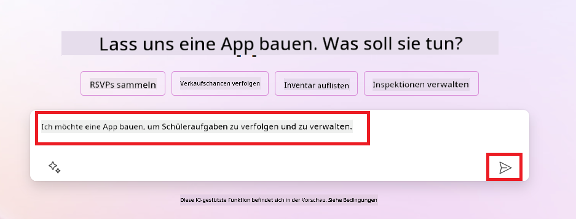
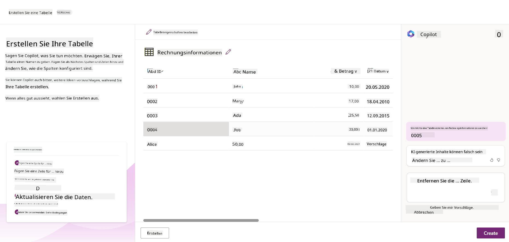
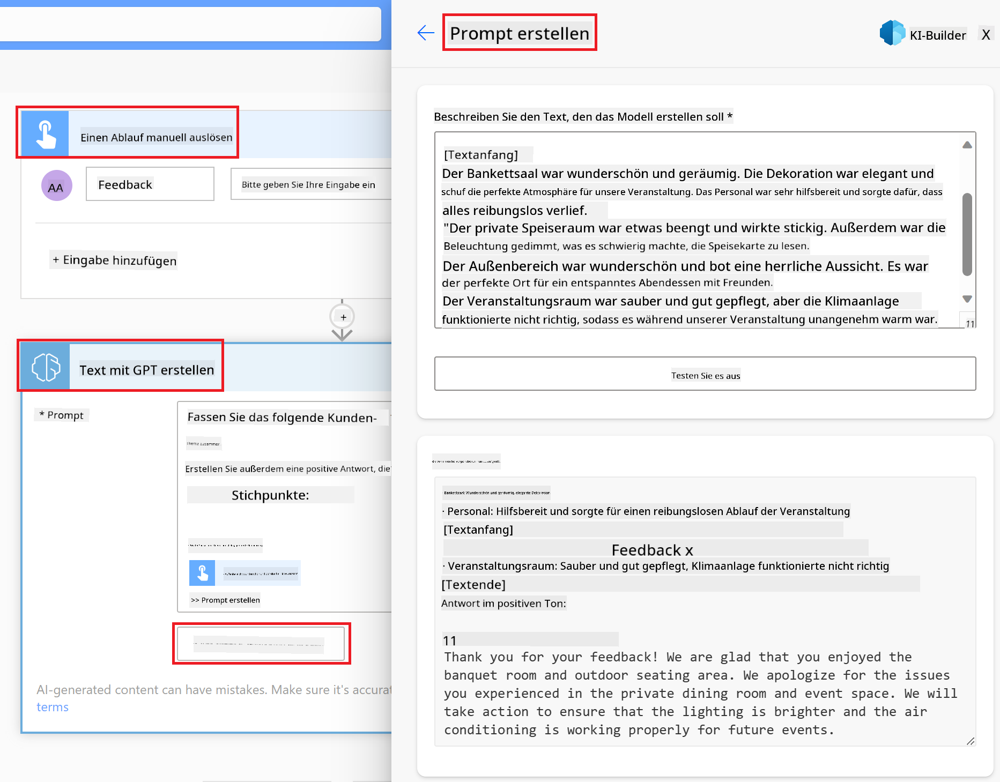

<!--
CO_OP_TRANSLATOR_METADATA:
{
  "original_hash": "846ac8e3b7dcfb697d3309fec05f0fea",
  "translation_date": "2025-10-17T22:57:01+00:00",
  "source_file": "10-building-low-code-ai-applications/README.md",
  "language_code": "de"
}
-->
# Erstellung von Low-Code-AI-Anwendungen

> _(Klicken Sie auf das Bild oben, um das Video zu dieser Lektion anzusehen)_

## Einführung

Nachdem wir gelernt haben, wie man Anwendungen zur Bilderzeugung erstellt, sprechen wir nun über Low-Code. Generative KI kann in verschiedenen Bereichen eingesetzt werden, einschließlich Low-Code, aber was genau ist Low-Code und wie können wir KI darin integrieren?

Die Entwicklung von Apps und Lösungen ist für traditionelle Entwickler und Nicht-Entwickler durch die Nutzung von Low-Code-Entwicklungsplattformen einfacher geworden. Low-Code-Entwicklungsplattformen ermöglichen es, Apps und Lösungen mit wenig bis gar keinem Code zu erstellen. Dies wird durch eine visuelle Entwicklungsumgebung erreicht, die es ermöglicht, Komponenten per Drag-and-Drop zu verwenden, um Apps und Lösungen zu erstellen. Dadurch können Apps und Lösungen schneller und mit weniger Ressourcen entwickelt werden. In dieser Lektion tauchen wir tief in die Nutzung von Low-Code ein und zeigen, wie man die Low-Code-Entwicklung mit KI mithilfe der Power Platform verbessern kann.

Die Power Platform bietet Organisationen die Möglichkeit, ihre Teams zu befähigen, eigene Lösungen in einer intuitiven Low-Code- oder No-Code-Umgebung zu erstellen. Diese Umgebung vereinfacht den Prozess der Lösungsentwicklung. Mit der Power Platform können Lösungen in Tagen oder Wochen statt Monaten oder Jahren erstellt werden. Die Power Platform besteht aus fünf Hauptprodukten: Power Apps, Power Automate, Power BI, Power Pages und Copilot Studio.

Diese Lektion behandelt:

- Einführung in generative KI in der Power Platform
- Einführung in Copilot und dessen Nutzung
- Nutzung generativer KI zur Erstellung von Apps und Workflows in der Power Platform
- Verständnis der KI-Modelle in der Power Platform mit AI Builder

## Lernziele

Am Ende dieser Lektion werden Sie in der Lage sein:

- Verstehen, wie Copilot in der Power Platform funktioniert.

- Eine App zur Nachverfolgung von Schüleraufgaben für unser Bildungs-Startup erstellen.

- Einen Workflow zur Rechnungsverarbeitung erstellen, der KI nutzt, um Informationen aus Rechnungen zu extrahieren.

- Best Practices bei der Nutzung des GPT-KI-Modells zur Texterstellung anwenden.

Die Werkzeuge und Technologien, die Sie in dieser Lektion verwenden werden, sind:

- **Power Apps**, für die App zur Nachverfolgung von Schüleraufgaben, die eine Low-Code-Entwicklungsumgebung bietet, um Apps zur Nachverfolgung, Verwaltung und Interaktion mit Daten zu erstellen.

- **Dataverse**, zur Speicherung der Daten für die App zur Nachverfolgung von Schüleraufgaben, wobei Dataverse eine Low-Code-Datenplattform zur Speicherung der App-Daten bereitstellt.

- **Power Automate**, für den Workflow zur Rechnungsverarbeitung, der eine Low-Code-Entwicklungsumgebung bietet, um Workflows zur Automatisierung des Rechnungsverarbeitungsprozesses zu erstellen.

- **AI Builder**, für das KI-Modell zur Rechnungsverarbeitung, bei dem vorgefertigte KI-Modelle verwendet werden, um die Rechnungen für unser Startup zu verarbeiten.

## Generative KI in der Power Platform

Die Verbesserung der Low-Code-Entwicklung und -Anwendung mit generativer KI ist ein zentraler Fokusbereich der Power Platform. Ziel ist es, jedem zu ermöglichen, KI-gestützte Apps, Websites, Dashboards zu erstellen und Prozesse mit KI zu automatisieren, _ohne dass Datenwissenschaftskenntnisse erforderlich sind_. Dieses Ziel wird durch die Integration generativer KI in die Low-Code-Entwicklungsumgebung der Power Platform in Form von Copilot und AI Builder erreicht.

### Wie funktioniert das?

Copilot ist ein KI-Assistent, der es Ihnen ermöglicht, Power Platform-Lösungen zu erstellen, indem Sie Ihre Anforderungen in einer Reihe von Konversationsschritten in natürlicher Sprache beschreiben. Sie können beispielsweise Ihrem KI-Assistenten mitteilen, welche Felder Ihre App verwenden soll, und er erstellt sowohl die App als auch das zugrunde liegende Datenmodell. Oder Sie können angeben, wie ein Workflow in Power Automate eingerichtet werden soll.

Sie können Copilot-gesteuerte Funktionen als Feature in Ihren App-Bildschirmen verwenden, um Benutzern zu ermöglichen, Erkenntnisse durch konversationelle Interaktionen zu gewinnen.

AI Builder ist eine Low-Code-KI-Funktionalität, die in der Power Platform verfügbar ist und es Ihnen ermöglicht, KI-Modelle zu nutzen, um Prozesse zu automatisieren und Ergebnisse vorherzusagen. Mit AI Builder können Sie KI in Ihre Apps und Workflows integrieren, die mit Ihren Daten in Dataverse oder in verschiedenen Cloud-Datenquellen wie SharePoint, OneDrive oder Azure verbunden sind.

Copilot ist in allen Produkten der Power Platform verfügbar: Power Apps, Power Automate, Power BI, Power Pages und Power Virtual Agents. AI Builder ist in Power Apps und Power Automate verfügbar. In dieser Lektion konzentrieren wir uns darauf, wie man Copilot und AI Builder in Power Apps und Power Automate verwendet, um eine Lösung für unser Bildungs-Startup zu erstellen.

### Copilot in Power Apps

Als Teil der Power Platform bietet Power Apps eine Low-Code-Entwicklungsumgebung zur Erstellung von Apps, die Daten nachverfolgen, verwalten und mit ihnen interagieren. Es ist eine Suite von App-Entwicklungsdiensten mit einer skalierbaren Datenplattform und der Möglichkeit, sich mit Cloud-Diensten und lokalen Daten zu verbinden. Power Apps ermöglicht es Ihnen, Apps zu erstellen, die in Browsern, auf Tablets und Smartphones laufen und mit Kollegen geteilt werden können. Power Apps erleichtert den Einstieg in die App-Entwicklung mit einer einfachen Benutzeroberfläche, sodass jeder Geschäftsanwender oder professionelle Entwickler benutzerdefinierte Apps erstellen kann. Die App-Entwicklungserfahrung wird auch durch generative KI über Copilot verbessert.

Die Copilot-KI-Assistentenfunktion in Power Apps ermöglicht es Ihnen, zu beschreiben, welche Art von App Sie benötigen und welche Informationen Ihre App nachverfolgen, sammeln oder anzeigen soll. Copilot generiert dann eine responsive Canvas-App basierend auf Ihrer Beschreibung. Sie können die App anschließend an Ihre Bedürfnisse anpassen. Der KI-Copilot generiert und schlägt auch eine Dataverse-Tabelle mit den Feldern vor, die Sie benötigen, um die Daten zu speichern, die Sie nachverfolgen möchten, sowie einige Beispieldaten. Wir werden später in dieser Lektion darauf eingehen, was Dataverse ist und wie Sie es in Power Apps verwenden können. Sie können die Tabelle dann mithilfe der KI-Copilot-Assistentenfunktion durch konversationelle Schritte anpassen. Diese Funktion ist direkt vom Startbildschirm von Power Apps aus verfügbar.

### Copilot in Power Automate

Als Teil der Power Platform ermöglicht es Power Automate den Benutzern, automatisierte Workflows zwischen Anwendungen und Diensten zu erstellen. Es hilft, sich wiederholende Geschäftsprozesse wie Kommunikation, Datenerfassung und Genehmigungen zu automatisieren. Seine einfache Benutzeroberfläche ermöglicht es Benutzern mit jeder technischen Kompetenz (von Anfängern bis hin zu erfahrenen Entwicklern), Arbeitsaufgaben zu automatisieren. Die Workflow-Entwicklungserfahrung wird auch durch generative KI über Copilot verbessert.

Die Copilot-KI-Assistentenfunktion in Power Automate ermöglicht es Ihnen, zu beschreiben, welche Art von Workflow Sie benötigen und welche Aktionen Ihr Workflow ausführen soll. Copilot generiert dann einen Workflow basierend auf Ihrer Beschreibung. Sie können den Workflow anschließend an Ihre Bedürfnisse anpassen. Der KI-Copilot generiert und schlägt auch die Aktionen vor, die Sie benötigen, um die Aufgabe zu automatisieren, die Sie ausführen möchten. Wir werden später in dieser Lektion darauf eingehen, was Workflows sind und wie Sie sie in Power Automate verwenden können. Sie können die Aktionen dann mithilfe der KI-Copilot-Assistentenfunktion durch konversationelle Schritte anpassen. Diese Funktion ist direkt vom Startbildschirm von Power Automate aus verfügbar.

## Aufgabe: Verwalten Sie Schüleraufgaben und Rechnungen für unser Startup mit Copilot

Unser Startup bietet Online-Kurse für Schüler an. Das Startup ist schnell gewachsen und hat nun Schwierigkeiten, mit der Nachfrage nach seinen Kursen Schritt zu halten. Das Startup hat Sie als Power Platform-Entwickler eingestellt, um ihnen zu helfen, eine Low-Code-Lösung zu entwickeln, die ihnen hilft, die Schüleraufgaben und Rechnungen zu verwalten. Die Lösung sollte es ermöglichen, Schüleraufgaben über eine App zu verfolgen und zu verwalten sowie den Rechnungsverarbeitungsprozess über einen Workflow zu automatisieren. Sie wurden gebeten, generative KI zur Entwicklung der Lösung zu verwenden.

Wenn Sie mit der Nutzung von Copilot beginnen, können Sie die [Power Platform Copilot Prompt Library](https://github.com/pnp/powerplatform-prompts?WT.mc_id=academic-109639-somelezediko) verwenden, um mit den Eingabeaufforderungen zu beginnen. Diese Bibliothek enthält eine Liste von Eingabeaufforderungen, die Sie verwenden können, um Apps und Workflows mit Copilot zu erstellen. Sie können die Eingabeaufforderungen in der Bibliothek auch verwenden, um eine Vorstellung davon zu bekommen, wie Sie Ihre Anforderungen an Copilot beschreiben können.

### Erstellen Sie eine App zur Nachverfolgung von Schüleraufgaben für unser Startup

Die Lehrkräfte unseres Startups haben Schwierigkeiten, die Schüleraufgaben zu verfolgen. Sie haben eine Tabelle verwendet, um die Aufgaben zu verfolgen, aber dies ist schwierig zu verwalten, da die Anzahl der Schüler gestiegen ist. Sie haben Sie gebeten, eine App zu erstellen, die ihnen hilft, Schüleraufgaben zu verfolgen und zu verwalten. Die App sollte es ihnen ermöglichen, neue Aufgaben hinzuzufügen, Aufgaben anzusehen, Aufgaben zu aktualisieren und Aufgaben zu löschen. Die App sollte auch Lehrkräften und Schülern ermöglichen, die Aufgaben zu sehen, die bewertet wurden und die, die noch nicht bewertet wurden.

Sie werden die App mit Copilot in Power Apps erstellen, indem Sie die folgenden Schritte ausführen:

1. Navigieren Sie zum Startbildschirm von [Power Apps](https://make.powerapps.com?WT.mc_id=academic-105485-koreyst).

1. Verwenden Sie das Textfeld auf dem Startbildschirm, um die App zu beschreiben, die Sie erstellen möchten. Zum Beispiel: **_Ich möchte eine App erstellen, um Schüleraufgaben zu verfolgen und zu verwalten_**. Klicken Sie auf die Schaltfläche **Senden**, um die Eingabeaufforderung an den KI-Copilot zu senden.

1. Der KI-Copilot schlägt eine Dataverse-Tabelle mit den Feldern vor, die Sie benötigen, um die Daten zu speichern, die Sie verfolgen möchten, sowie einige Beispieldaten. Sie können die Tabelle dann mithilfe der KI-Copilot-Assistentenfunktion durch konversationelle Schritte anpassen.

   > **Wichtig**: Dataverse ist die zugrunde liegende Datenplattform der Power Platform. Es ist eine Low-Code-Datenplattform zur Speicherung der App-Daten. Es handelt sich um einen vollständig verwalteten Dienst, der Daten sicher in der Microsoft Cloud speichert und innerhalb Ihrer Power Platform-Umgebung bereitgestellt wird. Es bietet integrierte Datenverwaltungsfunktionen wie Datenklassifizierung, Datenherkunft, fein abgestimmte Zugriffskontrolle und mehr. Weitere Informationen zu Dataverse finden Sie [hier](https://docs.microsoft.com/powerapps/maker/data-platform/data-platform-intro?WT.mc_id=academic-109639-somelezediko).

   

1. Lehrkräfte möchten E-Mails an die Schüler senden, die ihre Aufgaben eingereicht haben, um sie über den Fortschritt ihrer Aufgaben auf dem Laufenden zu halten. Sie können Copilot verwenden, um der Tabelle ein neues Feld hinzuzufügen, um die E-Mail-Adresse des Schülers zu speichern. Zum Beispiel können Sie die folgende Eingabeaufforderung verwenden, um der Tabelle ein neues Feld hinzuzufügen: **_Ich möchte eine Spalte hinzufügen, um die E-Mail-Adresse des Schülers zu speichern_**. Klicken Sie auf die Schaltfläche **Senden**, um die Eingabeaufforderung an den KI-Copilot zu senden.

1. Der KI-Copilot generiert ein neues Feld, und Sie können das Feld anschließend an Ihre Bedürfnisse anpassen.

1. Sobald Sie mit der Tabelle fertig sind, klicken Sie auf die Schaltfläche **App erstellen**, um die App zu erstellen.

1. Der KI-Copilot generiert eine responsive Canvas-App basierend auf Ihrer Beschreibung. Sie können die App anschließend an Ihre Bedürfnisse anpassen.

1. Damit Lehrkräfte E-Mails an Schüler senden können, können Sie Copilot verwenden, um der App einen neuen Bildschirm hinzuzufügen. Zum Beispiel können Sie die folgende Eingabeaufforderung verwenden, um der App einen neuen Bildschirm hinzuzufügen: **_Ich möchte einen Bildschirm hinzufügen, um E-Mails an Schüler zu senden_**. Klicken Sie auf die Schaltfläche **Senden**, um die Eingabeaufforderung an den KI-Copilot zu senden.

1. Der KI-Copilot generiert einen neuen Bildschirm, und Sie können den Bildschirm anschließend an Ihre Bedürfnisse anpassen.

1. Sobald Sie mit der App fertig sind, klicken Sie auf die Schaltfläche **Speichern**, um die App zu speichern.

1. Um die App mit den Lehrkräften zu teilen, klicken Sie auf die Schaltfläche **Teilen** und dann erneut auf die Schaltfläche **Teilen**. Sie können die App dann mit den Lehrkräften teilen, indem Sie deren E-Mail-Adressen eingeben.

> **Ihre Hausaufgabe**: Die App, die Sie gerade erstellt haben, ist ein guter Anfang, kann aber verbessert werden. Mit der E-Mail-Funktion können Lehrkräfte E-Mails nur manuell senden, indem sie die E-Mail-Adressen eingeben. Können Sie Copilot verwenden, um eine Automatisierung zu erstellen, die es Lehrkräften ermöglicht, E-Mails automatisch an Schüler zu senden, wenn sie ihre Aufgaben einreichen? Ihr Hinweis: Mit der richtigen Eingabeaufforderung können Sie Copilot in Power Automate verwenden, um dies zu erstellen.

### Erstellen einer Rechnungstabelle für unser Startup

Das Finanzteam unseres Startups hat Schwierigkeiten, den Überblick über Rechnungen zu behalten. Sie haben eine Tabelle verwendet, um die Rechnungen zu verfolgen, aber dies ist schwierig zu verwalten, da die Anzahl der Rechnungen gestiegen ist. Sie haben Sie gebeten, eine Tabelle zu erstellen, die ihnen hilft, die Informationen zu den erhaltenen Rechnungen zu speichern, zu verfolgen und zu verwalten. Die Tabelle sollte verwendet werden, um eine Automatisierung zu erstellen, die alle Rechnungsinformationen extrahiert und in der Tabelle speichert. Die Tabelle sollte dem Finanzteam auch ermöglichen, die bezahlten und unbezahlten Rechnungen einzusehen.

Die Power Platform verfügt über eine zugrunde liegende Datenplattform namens Dataverse, die es Ihnen ermöglicht, die Daten für Ihre Apps und Lösungen zu speichern. Dataverse bietet eine Low-Code-Datenplattform zur Speicherung der App-Daten. Es handelt sich um einen vollständig verwalteten Dienst, der Daten sicher in der Microsoft Cloud speichert und innerhalb Ihrer Power Platform-Umgebung bereitgestellt wird. Es bietet integrierte Datenverwaltungsfunktionen wie Datenklassifizierung, Datenherkunft, fein abgestimmte Zugriffskontrolle und mehr. Weitere Informationen [über Dataverse finden Sie hier](https://docs.microsoft.com/powerapps/maker/data-platform/data-platform-intro?WT.mc_id=academic-109639-somelezediko).
Warum sollten wir Dataverse für unser Startup nutzen? Die Standard- und benutzerdefinierten Tabellen in Dataverse bieten eine sichere und cloudbasierte Speicheroption für Ihre Daten. Tabellen ermöglichen es Ihnen, verschiedene Arten von Daten zu speichern, ähnlich wie bei der Verwendung mehrerer Arbeitsblätter in einer einzigen Excel-Arbeitsmappe. Sie können Tabellen verwenden, um Daten zu speichern, die spezifisch für die Anforderungen Ihrer Organisation oder Ihres Unternehmens sind. Einige der Vorteile, die unser Startup durch die Nutzung von Dataverse erhält, umfassen unter anderem:

- **Einfach zu verwalten**: Sowohl die Metadaten als auch die Daten werden in der Cloud gespeichert, sodass Sie sich keine Gedanken darüber machen müssen, wie sie gespeichert oder verwaltet werden. Sie können sich darauf konzentrieren, Ihre Apps und Lösungen zu entwickeln.

- **Sicher**: Dataverse bietet eine sichere und cloudbasierte Speicheroption für Ihre Daten. Sie können steuern, wer Zugriff auf die Daten in Ihren Tabellen hat und wie sie darauf zugreifen können, indem Sie rollenbasierte Sicherheit verwenden.

- **Reiche Metadaten**: Datentypen und Beziehungen werden direkt in Power Apps verwendet.

- **Logik und Validierung**: Sie können Geschäftsregeln, berechnete Felder und Validierungsregeln verwenden, um Geschäftslogik durchzusetzen und die Datenintegrität zu gewährleisten.

Jetzt, da Sie wissen, was Dataverse ist und warum Sie es verwenden sollten, schauen wir uns an, wie Sie Copilot verwenden können, um eine Tabelle in Dataverse zu erstellen, die den Anforderungen unseres Finanzteams entspricht.

> **Note** : Sie werden diese Tabelle im nächsten Abschnitt verwenden, um eine Automatisierung zu erstellen, die alle Rechnungsinformationen extrahiert und in der Tabelle speichert.

Um eine Tabelle in Dataverse mit Copilot zu erstellen, folgen Sie den untenstehenden Schritten:

1. Navigieren Sie zur [Power Apps](https://make.powerapps.com?WT.mc_id=academic-105485-koreyst) Startseite.

2. Wählen Sie in der linken Navigationsleiste **Tabellen** aus und klicken Sie dann auf **Neue Tabelle beschreiben**.

1. Auf dem Bildschirm **Neue Tabelle beschreiben** verwenden Sie das Textfeld, um die Tabelle zu beschreiben, die Sie erstellen möchten. Zum Beispiel: **_Ich möchte eine Tabelle erstellen, um Rechnungsinformationen zu speichern_**. Klicken Sie auf die Schaltfläche **Senden**, um die Eingabeaufforderung an den AI Copilot zu senden.

1. Der AI Copilot schlägt eine Dataverse-Tabelle mit den Feldern vor, die Sie benötigen, um die Daten zu speichern, die Sie verfolgen möchten, sowie einige Beispieldaten. Sie können die Tabelle dann mit der AI Copilot-Assistentenfunktion durch konversationelle Schritte an Ihre Bedürfnisse anpassen.

1. Das Finanzteam möchte eine E-Mail an den Lieferanten senden, um ihn über den aktuellen Status seiner Rechnung zu informieren. Sie können Copilot verwenden, um der Tabelle ein neues Feld hinzuzufügen, um die E-Mail-Adresse des Lieferanten zu speichern. Zum Beispiel können Sie die folgende Eingabeaufforderung verwenden, um der Tabelle ein neues Feld hinzuzufügen: **_Ich möchte eine Spalte hinzufügen, um die E-Mail-Adresse des Lieferanten zu speichern_**. Klicken Sie auf die Schaltfläche **Senden**, um die Eingabeaufforderung an den AI Copilot zu senden.

1. Der AI Copilot generiert ein neues Feld, und Sie können das Feld dann an Ihre Bedürfnisse anpassen.

1. Sobald Sie mit der Tabelle fertig sind, klicken Sie auf die Schaltfläche **Erstellen**, um die Tabelle zu erstellen.

## KI-Modelle in der Power Platform mit AI Builder

AI Builder ist eine Low-Code-KI-Funktion, die in der Power Platform verfügbar ist und es Ihnen ermöglicht, KI-Modelle zu verwenden, um Prozesse zu automatisieren und Ergebnisse vorherzusagen. Mit AI Builder können Sie KI in Ihre Apps und Workflows integrieren, die mit Ihren Daten in Dataverse oder in verschiedenen Cloud-Datenquellen wie SharePoint, OneDrive oder Azure verbunden sind.

## Vorgefertigte KI-Modelle vs. Benutzerdefinierte KI-Modelle

AI Builder bietet zwei Arten von KI-Modellen: Vorgefertigte KI-Modelle und Benutzerdefinierte KI-Modelle. Vorgefertigte KI-Modelle sind einsatzbereite Modelle, die von Microsoft trainiert wurden und in der Power Platform verfügbar sind. Diese helfen Ihnen, Intelligenz zu Ihren Apps und Workflows hinzuzufügen, ohne Daten sammeln und dann eigene Modelle erstellen, trainieren und veröffentlichen zu müssen. Sie können diese Modelle verwenden, um Prozesse zu automatisieren und Ergebnisse vorherzusagen.

Einige der vorgefertigten KI-Modelle, die in der Power Platform verfügbar sind, umfassen:

- **Schlüsselbegriff-Extraktion**: Dieses Modell extrahiert Schlüsselbegriffe aus Text.
- **Spracherkennung**: Dieses Modell erkennt die Sprache eines Textes.
- **Stimmungsanalyse**: Dieses Modell erkennt positive, negative, neutrale oder gemischte Stimmungen in Texten.
- **Visitenkartenleser**: Dieses Modell extrahiert Informationen aus Visitenkarten.
- **Texterkennung**: Dieses Modell extrahiert Text aus Bildern.
- **Objekterkennung**: Dieses Modell erkennt und extrahiert Objekte aus Bildern.
- **Dokumentenverarbeitung**: Dieses Modell extrahiert Informationen aus Formularen.
- **Rechnungsverarbeitung**: Dieses Modell extrahiert Informationen aus Rechnungen.

Mit benutzerdefinierten KI-Modellen können Sie Ihr eigenes Modell in AI Builder einbringen, sodass es wie jedes benutzerdefinierte AI Builder-Modell funktioniert und Sie das Modell mit Ihren eigenen Daten trainieren können. Sie können diese Modelle verwenden, um Prozesse zu automatisieren und Ergebnisse sowohl in Power Apps als auch in Power Automate vorherzusagen. Bei der Verwendung Ihres eigenen Modells gelten bestimmte Einschränkungen. Lesen Sie mehr über diese [Einschränkungen](https://learn.microsoft.com/ai-builder/byo-model#limitations?WT.mc_id=academic-105485-koreyst).

## Aufgabe #2 - Erstellen eines Rechnungsverarbeitungs-Workflows für unser Startup

Das Finanzteam hat Schwierigkeiten, Rechnungen zu bearbeiten. Sie haben eine Tabelle verwendet, um die Rechnungen zu verfolgen, aber dies ist mit der steigenden Anzahl von Rechnungen schwierig geworden. Sie haben Sie gebeten, einen Workflow zu erstellen, der ihnen hilft, Rechnungen mit KI zu verarbeiten. Der Workflow sollte es ihnen ermöglichen, Informationen aus Rechnungen zu extrahieren und diese Informationen in einer Dataverse-Tabelle zu speichern. Der Workflow sollte ihnen auch ermöglichen, eine E-Mail mit den extrahierten Informationen an das Finanzteam zu senden.

Jetzt, da Sie wissen, was AI Builder ist und warum Sie ihn verwenden sollten, schauen wir uns an, wie Sie das Rechnungsverarbeitungs-KI-Modell in AI Builder, das wir zuvor behandelt haben, verwenden können, um einen Workflow zu erstellen, der dem Finanzteam bei der Verarbeitung von Rechnungen hilft.

Um einen Workflow zu erstellen, der dem Finanzteam bei der Verarbeitung von Rechnungen mit dem Rechnungsverarbeitungs-KI-Modell in AI Builder hilft, folgen Sie den untenstehenden Schritten:

1. Navigieren Sie zur [Power Automate](https://make.powerautomate.com?WT.mc_id=academic-105485-koreyst) Startseite.

2. Verwenden Sie das Textfeld auf der Startseite, um den Workflow zu beschreiben, den Sie erstellen möchten. Zum Beispiel: **_Eine Rechnung verarbeiten, wenn sie in meinem Posteingang ankommt_**. Klicken Sie auf die Schaltfläche **Senden**, um die Eingabeaufforderung an den AI Copilot zu senden.

   

3. Der AI Copilot schlägt die Aktionen vor, die Sie ausführen müssen, um die Aufgabe zu automatisieren, die Sie durchführen möchten. Sie können auf die Schaltfläche **Weiter** klicken, um die nächsten Schritte durchzugehen.

4. Im nächsten Schritt fordert Power Automate Sie auf, die für den Flow erforderlichen Verbindungen einzurichten. Sobald Sie fertig sind, klicken Sie auf die Schaltfläche **Flow erstellen**, um den Flow zu erstellen.

5. Der AI Copilot generiert einen Flow, und Sie können den Flow dann an Ihre Bedürfnisse anpassen.

6. Aktualisieren Sie den Auslöser des Flows und legen Sie den **Ordner** auf den Ordner fest, in dem die Rechnungen gespeichert werden. Zum Beispiel können Sie den Ordner auf **Posteingang** setzen. Klicken Sie auf **Erweiterte Optionen anzeigen** und setzen Sie **Nur mit Anhängen** auf **Ja**. Dies stellt sicher, dass der Flow nur ausgeführt wird, wenn eine E-Mail mit einem Anhang im Ordner empfangen wird.

7. Entfernen Sie die folgenden Aktionen aus dem Flow: **HTML zu Text**, **Zusammenstellen**, **Zusammenstellen 2**, **Zusammenstellen 3** und **Zusammenstellen 4**, da Sie diese nicht verwenden werden.

8. Entfernen Sie die Aktion **Bedingung** aus dem Flow, da Sie diese nicht verwenden werden. Es sollte wie im folgenden Screenshot aussehen:

   

9. Klicken Sie auf die Schaltfläche **Aktion hinzufügen** und suchen Sie nach **Dataverse**. Wählen Sie die Aktion **Neue Zeile hinzufügen**.

10. Aktualisieren Sie in der Aktion **Informationen aus Rechnungen extrahieren** die **Rechnungsdatei**, sodass sie auf den **Anhangsinhalt** aus der E-Mail verweist. Dies stellt sicher, dass der Flow Informationen aus dem Rechnungsanhang extrahiert.

11. Wählen Sie die **Tabelle**, die Sie zuvor erstellt haben. Zum Beispiel können Sie die Tabelle **Rechnungsinformationen** auswählen. Wählen Sie die dynamischen Inhalte aus der vorherigen Aktion aus, um die folgenden Felder auszufüllen:

    - ID
    - Betrag
    - Datum
    - Name
    - Status - Setzen Sie den **Status** auf **Ausstehend**.
    - Lieferanten-E-Mail - Verwenden Sie den dynamischen Inhalt **Von** aus dem Auslöser **Wenn eine neue E-Mail eintrifft**.

    

12. Sobald Sie mit dem Flow fertig sind, klicken Sie auf die Schaltfläche **Speichern**, um den Flow zu speichern. Sie können den Flow dann testen, indem Sie eine E-Mail mit einer Rechnung an den Ordner senden, den Sie im Auslöser angegeben haben.

> **Ihre Hausaufgabe**: Der Flow, den Sie gerade erstellt haben, ist ein guter Anfang. Jetzt müssen Sie darüber nachdenken, wie Sie eine Automatisierung erstellen können, die es unserem Finanzteam ermöglicht, eine E-Mail an den Lieferanten zu senden, um ihn über den aktuellen Status seiner Rechnung zu informieren. Ihr Hinweis: Der Flow muss ausgeführt werden, wenn sich der Status der Rechnung ändert.

## Verwenden eines Textgenerierungs-KI-Modells in Power Automate

Das Text erstellen mit GPT-KI-Modell in AI Builder ermöglicht es Ihnen, basierend auf einer Eingabeaufforderung Text zu generieren und wird vom Microsoft Azure OpenAI Service betrieben. Mit dieser Funktion können Sie GPT (Generative Pre-Trained Transformer)-Technologie in Ihre Apps und Workflows integrieren, um eine Vielzahl von automatisierten Flows und aufschlussreichen Anwendungen zu erstellen.

GPT-Modelle durchlaufen ein umfangreiches Training mit großen Datenmengen, wodurch sie in der Lage sind, Text zu erzeugen, der der menschlichen Sprache sehr ähnlich ist, wenn sie mit einer Eingabeaufforderung versehen werden. Wenn sie mit Workflow-Automatisierung integriert werden, können KI-Modelle wie GPT genutzt werden, um eine Vielzahl von Aufgaben zu rationalisieren und zu automatisieren.

Zum Beispiel können Sie Flows erstellen, um automatisch Text für verschiedene Anwendungsfälle zu generieren, wie: Entwürfe von E-Mails, Produktbeschreibungen und mehr. Sie können das Modell auch verwenden, um Text für verschiedene Apps zu generieren, wie Chatbots und Kundenservice-Apps, die es Kundenservice-Mitarbeitern ermöglichen, effektiv und effizient auf Kundenanfragen zu reagieren.

Um zu lernen, wie Sie dieses KI-Modell in Power Automate verwenden können, gehen Sie das Modul [Intelligenz mit AI Builder und GPT hinzufügen](https://learn.microsoft.com/training/modules/ai-builder-text-generation/?WT.mc_id=academic-109639-somelezediko) durch.

## Großartige Arbeit! Setzen Sie Ihr Lernen fort

Nachdem Sie diese Lektion abgeschlossen haben, schauen Sie sich unsere [Generative AI Learning Collection](https://aka.ms/genai-collection?WT.mc_id=academic-105485-koreyst) an, um Ihr Wissen über generative KI weiter zu vertiefen!

Gehen Sie zu Lektion 11, wo wir uns ansehen, wie man [Generative KI mit Funktionsaufrufen integriert](../11-integrating-with-function-calling/README.md?WT.mc_id=academic-105485-koreyst)!

---

**Haftungsausschluss**:  
Dieses Dokument wurde mit dem KI-Übersetzungsdienst [Co-op Translator](https://github.com/Azure/co-op-translator) übersetzt. Obwohl wir uns um Genauigkeit bemühen, beachten Sie bitte, dass automatisierte Übersetzungen Fehler oder Ungenauigkeiten enthalten können. Das Originaldokument in seiner ursprünglichen Sprache sollte als maßgebliche Quelle betrachtet werden. Für kritische Informationen wird eine professionelle menschliche Übersetzung empfohlen. Wir übernehmen keine Haftung für Missverständnisse oder Fehlinterpretationen, die sich aus der Nutzung dieser Übersetzung ergeben.