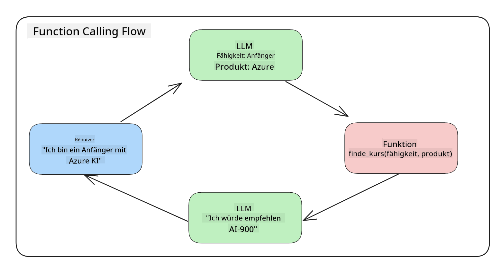

<!--
CO_OP_TRANSLATOR_METADATA:
{
  "original_hash": "77a48a201447be19aa7560706d6f93a0",
  "translation_date": "2025-05-19T21:19:06+00:00",
  "source_file": "11-integrating-with-function-calling/README.md",
  "language_code": "de"
}
-->
# Integration mit Funktionsaufrufen

Du hast in den vorherigen Lektionen bereits einiges gelernt. Dennoch können wir uns weiter verbessern. Einige Dinge, die wir angehen können, sind, wie wir ein konsistenteres Antwortformat erhalten, um die Arbeit mit der Antwort zu erleichtern. Außerdem möchten wir möglicherweise Daten aus anderen Quellen hinzufügen, um unsere Anwendung weiter zu bereichern.

Die oben genannten Probleme sind das, was dieses Kapitel zu lösen versucht.

## Einführung

Diese Lektion behandelt:

- Erklären, was Funktionsaufrufe sind und ihre Anwendungsfälle.
- Erstellen eines Funktionsaufrufs mit Azure OpenAI.
- Wie man einen Funktionsaufruf in eine Anwendung integriert.

## Lernziele

Am Ende dieser Lektion wirst du in der Lage sein:

- Den Zweck der Verwendung von Funktionsaufrufen zu erklären.
- Einen Funktionsaufruf mit dem Azure OpenAI Service einzurichten.
- Effektive Funktionsaufrufe für den Anwendungsfall deiner Anwendung zu entwerfen.

## Szenario: Verbesserung unseres Chatbots mit Funktionen

Für diese Lektion möchten wir eine Funktion für unser Bildungs-Startup entwickeln, die es Nutzern ermöglicht, einen Chatbot zu verwenden, um technische Kurse zu finden. Wir werden Kurse empfehlen, die ihrem Fähigkeitsniveau, ihrer aktuellen Rolle und ihrem Interessengebiet entsprechen.

Um dieses Szenario abzuschließen, verwenden wir eine Kombination aus:

- `Azure OpenAI`, um eine Chaterfahrung für den Benutzer zu erstellen.
- `Microsoft Learn Catalog API`, um Nutzern zu helfen, Kurse basierend auf ihrer Anfrage zu finden.
- `Function Calling`, um die Anfrage des Nutzers zu nehmen und an eine Funktion zu senden, um die API-Anfrage zu stellen.

Um zu beginnen, schauen wir uns an, warum wir überhaupt Funktionsaufrufe verwenden möchten:

## Warum Funktionsaufrufe

Vor den Funktionsaufrufen waren die Antworten eines LLM unstrukturiert und inkonsistent. Entwickler mussten komplexen Validierungscode schreiben, um sicherzustellen, dass sie jede Variation einer Antwort verarbeiten konnten. Benutzer konnten keine Antworten wie "Wie ist das aktuelle Wetter in Stockholm?" erhalten. Dies liegt daran, dass Modelle auf die Zeit beschränkt waren, in der die Daten trainiert wurden.

Funktionsaufrufe sind ein Feature des Azure OpenAI Service, um die folgenden Einschränkungen zu überwinden:

- **Konsistentes Antwortformat**. Wenn wir das Antwortformat besser kontrollieren können, können wir die Antwort leichter in andere Systeme integrieren.
- **Externe Daten**. Fähigkeit, Daten aus anderen Quellen einer Anwendung in einem Chat-Kontext zu verwenden.

## Problemveranschaulichung durch ein Szenario

> Wir empfehlen dir, das [beigelegte Notebook](../../../11-integrating-with-function-calling/python/aoai-assignment.ipynb) zu verwenden, wenn du das unten stehende Szenario ausführen möchtest. Du kannst auch einfach mitlesen, während wir versuchen, ein Problem zu veranschaulichen, bei dem Funktionen helfen können, das Problem zu lösen.

Schauen wir uns das Beispiel an, das das Problem des Antwortformats veranschaulicht:

Angenommen, wir möchten eine Datenbank mit Studentendaten erstellen, damit wir ihnen den richtigen Kurs vorschlagen können. Unten haben wir zwei Beschreibungen von Studenten, die sich in den enthaltenen Daten sehr ähnlich sind.

1. Erstelle eine Verbindung zu unserer Azure OpenAI-Ressource:

   ```python
   import os
   import json
   from openai import AzureOpenAI
   from dotenv import load_dotenv
   load_dotenv()

   client = AzureOpenAI(
   api_key=os.environ['AZURE_OPENAI_API_KEY'],  # this is also the default, it can be omitted
   api_version = "2023-07-01-preview"
   )

   deployment=os.environ['AZURE_OPENAI_DEPLOYMENT']
   ```

   Unten ist etwas Python-Code zur Konfiguration unserer Verbindung zu Azure OpenAI, wo wir `api_type`, `api_base`, `api_version` and `api_key`.

1. Creating two student descriptions using variables `student_1_description` and `student_2_description` festlegen.

   ```python
   student_1_description="Emily Johnson is a sophomore majoring in computer science at Duke University. She has a 3.7 GPA. Emily is an active member of the university's Chess Club and Debate Team. She hopes to pursue a career in software engineering after graduating."

   student_2_description = "Michael Lee is a sophomore majoring in computer science at Stanford University. He has a 3.8 GPA. Michael is known for his programming skills and is an active member of the university's Robotics Club. He hopes to pursue a career in artificial intelligence after finishing his studies."
   ```

   Wir möchten die obigen Studentenbeschreibungen an ein LLM senden, um die Daten zu analysieren. Diese Daten können später in unserer Anwendung verwendet und an eine API gesendet oder in einer Datenbank gespeichert werden.

1. Lass uns zwei identische Aufforderungen erstellen, in denen wir das LLM anweisen, welche Informationen uns interessieren:

   ```python
   prompt1 = f'''
   Please extract the following information from the given text and return it as a JSON object:

   name
   major
   school
   grades
   club

   This is the body of text to extract the information from:
   {student_1_description}
   '''

   prompt2 = f'''
   Please extract the following information from the given text and return it as a JSON object:

   name
   major
   school
   grades
   club

   This is the body of text to extract the information from:
   {student_2_description}
   '''
   ```

   Die obigen Aufforderungen weisen das LLM an, Informationen zu extrahieren und die Antwort im JSON-Format zurückzugeben.

1. Nachdem wir die Aufforderungen und die Verbindung zu Azure OpenAI eingerichtet haben, senden wir die Aufforderungen nun an das LLM, indem wir `openai.ChatCompletion`. We store the prompt in the `messages` variable and assign the role to `user` verwenden. Dies soll eine Nachricht eines Benutzers simulieren, die an einen Chatbot geschrieben wird.

   ```python
   # response from prompt one
   openai_response1 = client.chat.completions.create(
   model=deployment,
   messages = [{'role': 'user', 'content': prompt1}]
   )
   openai_response1.choices[0].message.content

   # response from prompt two
   openai_response2 = client.chat.completions.create(
   model=deployment,
   messages = [{'role': 'user', 'content': prompt2}]
   )
   openai_response2.choices[0].message.content
   ```

Jetzt können wir beide Anfragen an das LLM senden und die Antwort, die wir erhalten, wie folgt untersuchen `openai_response1['choices'][0]['message']['content']`.

1. Lastly, we can convert the response to JSON format by calling `json.loads`:

   ```python
   # Loading the response as a JSON object
   json_response1 = json.loads(openai_response1.choices[0].message.content)
   json_response1
   ```

   Antwort 1:

   ```json
   {
     "name": "Emily Johnson",
     "major": "computer science",
     "school": "Duke University",
     "grades": "3.7",
     "club": "Chess Club"
   }
   ```

   Antwort 2:

   ```json
   {
     "name": "Michael Lee",
     "major": "computer science",
     "school": "Stanford University",
     "grades": "3.8 GPA",
     "club": "Robotics Club"
   }
   ```

   Obwohl die Aufforderungen gleich sind und die Beschreibungen ähnlich, sehen wir Werte der `Grades` property formatted differently, as we can sometimes get the format `3.7` or `3.7 GPA` for example.

   This result is because the LLM takes unstructured data in the form of the written prompt and returns also unstructured data. We need to have a structured format so that we know what to expect when storing or using this data

So how do we solve the formatting problem then? By using functional calling, we can make sure that we receive structured data back. When using function calling, the LLM does not actually call or run any functions. Instead, we create a structure for the LLM to follow for its responses. We then use those structured responses to know what function to run in our applications.



We can then take what is returned from the function and send this back to the LLM. The LLM will then respond using natural language to answer the user's query.

## Use Cases for using function calls

There are many different use cases where function calls can improve your app like:

- **Calling External Tools**. Chatbots are great at providing answers to questions from users. By using function calling, the chatbots can use messages from users to complete certain tasks. For example, a student can ask the chatbot to "Send an email to my instructor saying I need more assistance with this subject". This can make a function call to `send_email(to: string, body: string)`

- **Create API or Database Queries**. Users can find information using natural language that gets converted into a formatted query or API request. An example of this could be a teacher who requests "Who are the students that completed the last assignment" which could call a function named `get_completed(student_name: string, assignment: int, current_status: string)`

- **Creating Structured Data**. Users can take a block of text or CSV and use the LLM to extract important information from it. For example, a student can convert a Wikipedia article about peace agreements to create AI flashcards. This can be done by using a function called `get_important_facts(agreement_name: string, date_signed: string, parties_involved: list)`

## Creating Your First Function Call

The process of creating a function call includes 3 main steps:

1. **Calling** the Chat Completions API with a list of your functions and a user message.
2. **Reading** the model's response to perform an action i.e. execute a function or API Call.
3. **Making** another call to Chat Completions API with the response from your function to use that information to create a response to the user.


### Step 1 - creating messages

The first step is to create a user message. This can be dynamically assigned by taking the value of a text input or you can assign a value here. If this is your first time working with the Chat Completions API, we need to define the `role` and the `content` of the message.

The `role` can be either `system` (creating rules), `assistant` (the model) or `user` (the end-user). For function calling, we will assign this as `user` und eine Beispiel-Frage.

```python
messages= [ {"role": "user", "content": "Find me a good course for a beginner student to learn Azure."} ]
```

Durch die Zuweisung unterschiedlicher Rollen wird dem LLM klar gemacht, ob es das System ist, das etwas sagt, oder der Benutzer, was hilft, eine Gesprächshistorie aufzubauen, auf der das LLM aufbauen kann.

### Schritt 2 - Erstellen von Funktionen

Als nächstes definieren wir eine Funktion und die Parameter dieser Funktion. Wir verwenden hier nur eine Funktion namens `search_courses` but you can create multiple functions.

> **Important** : Functions are included in the system message to the LLM and will be included in the amount of available tokens you have available.

Below, we create the functions as an array of items. Each item is a function and has properties `name`, `description` and `parameters`:

```python
functions = [
   {
      "name":"search_courses",
      "description":"Retrieves courses from the search index based on the parameters provided",
      "parameters":{
         "type":"object",
         "properties":{
            "role":{
               "type":"string",
               "description":"The role of the learner (i.e. developer, data scientist, student, etc.)"
            },
            "product":{
               "type":"string",
               "description":"The product that the lesson is covering (i.e. Azure, Power BI, etc.)"
            },
            "level":{
               "type":"string",
               "description":"The level of experience the learner has prior to taking the course (i.e. beginner, intermediate, advanced)"
            }
         },
         "required":[
            "role"
         ]
      }
   }
]
```

Lass uns jede Instanz der Funktion unten genauer beschreiben:

- `name` - The name of the function that we want to have called.
- `description` - This is the description of how the function works. Here it's important to be specific and clear.
- `parameters` - A list of values and format that you want the model to produce in its response. The parameters array consists of items where the items have the following properties:
  1.  `type` - The data type of the properties will be stored in.
  1.  `properties` - List of the specific values that the model will use for its response
      1. `name` - The key is the name of the property that the model will use in its formatted response, for example, `product`.
      1. `type` - The data type of this property, for example, `string`.
      1. `description` - Description of the specific property.

There's also an optional property `required` - required property for the function call to be completed.

### Step 3 - Making the function call

After defining a function, we now need to include it in the call to the Chat Completion API. We do this by adding `functions` to the request. In this case `functions=functions`.

There is also an option to set `function_call` to `auto`. This means we will let the LLM decide which function should be called based on the user message rather than assigning it ourselves.

Here's some code below where we call `ChatCompletion.create`, note how we set `functions=functions` and `function_call="auto"` und damit dem LLM die Wahl geben, wann es die von uns bereitgestellten Funktionen aufrufen soll:

```python
response = client.chat.completions.create(model=deployment,
                                        messages=messages,
                                        functions=functions,
                                        function_call="auto")

print(response.choices[0].message)
```

Die zurückkommende Antwort sieht jetzt so aus:

```json
{
  "role": "assistant",
  "function_call": {
    "name": "search_courses",
    "arguments": "{\n  \"role\": \"student\",\n  \"product\": \"Azure\",\n  \"level\": \"beginner\"\n}"
  }
}
```

Hier sehen wir, wie die Funktion `search_courses` was called and with what arguments, as listed in the `arguments` property in the JSON response.

The conclusion the LLM was able to find the data to fit the arguments of the function as it was extracting it from the value provided to the `messages` parameter in the chat completion call. Below is a reminder of the `messages` Wert:

```python
messages= [ {"role": "user", "content": "Find me a good course for a beginner student to learn Azure."} ]
```

Wie du siehst, `student`, `Azure` and `beginner` was extracted from `messages` and set as input to the function. Using functions this way is a great way to extract information from a prompt but also to provide structure to the LLM and have reusable functionality.

Next, we need to see how we can use this in our app.

## Integrating Function Calls into an Application

After we have tested the formatted response from the LLM, we can now integrate this into an application.

### Managing the flow

To integrate this into our application, let's take the following steps:

1. First, let's make the call to the OpenAI services and store the message in a variable called `response_message`.

   ```python
   response_message = response.choices[0].message
   ```

1. Jetzt definieren wir die Funktion, die die Microsoft Learn API aufruft, um eine Liste von Kursen zu erhalten:

   ```python
   import requests

   def search_courses(role, product, level):
     url = "https://learn.microsoft.com/api/catalog/"
     params = {
        "role": role,
        "product": product,
        "level": level
     }
     response = requests.get(url, params=params)
     modules = response.json()["modules"]
     results = []
     for module in modules[:5]:
        title = module["title"]
        url = module["url"]
        results.append({"title": title, "url": url})
     return str(results)
   ```

   Beachte, wie wir jetzt eine tatsächliche Python-Funktion erstellen, die auf die in den `functions` variable. We're also making real external API calls to fetch the data we need. In this case, we go against the Microsoft Learn API to search for training modules.

Ok, so we created `functions` variables and a corresponding Python function, how do we tell the LLM how to map these two together so our Python function is called?

1. To see if we need to call a Python function, we need to look into the LLM response and see if `function_call` eingeführten Funktionsnamen abbildet und die angezeigte Funktion aufruft. Hier ist, wie du die genannte Überprüfung unten durchführen kannst:

   ```python
   # Check if the model wants to call a function
   if response_message.function_call.name:
    print("Recommended Function call:")
    print(response_message.function_call.name)
    print()

    # Call the function.
    function_name = response_message.function_call.name

    available_functions = {
            "search_courses": search_courses,
    }
    function_to_call = available_functions[function_name]

    function_args = json.loads(response_message.function_call.arguments)
    function_response = function_to_call(**function_args)

    print("Output of function call:")
    print(function_response)
    print(type(function_response))


    # Add the assistant response and function response to the messages
    messages.append( # adding assistant response to messages
        {
            "role": response_message.role,
            "function_call": {
                "name": function_name,
                "arguments": response_message.function_call.arguments,
            },
            "content": None
        }
    )
    messages.append( # adding function response to messages
        {
            "role": "function",
            "name": function_name,
            "content":function_response,
        }
    )
   ```

   Diese drei Zeilen stellen sicher, dass wir den Funktionsnamen, die Argumente extrahieren und den Aufruf durchführen:

   ```python
   function_to_call = available_functions[function_name]

   function_args = json.loads(response_message.function_call.arguments)
   function_response = function_to_call(**function_args)
   ```

   Unten ist die Ausgabe von unserem Code:

   **Ausgabe**

   ```Recommended Function call:
   {
     "name": "search_courses",
     "arguments": "{\n  \"role\": \"student\",\n  \"product\": \"Azure\",\n  \"level\": \"beginner\"\n}"
   }

   Output of function call:
   [{'title': 'Describe concepts of cryptography', 'url': 'https://learn.microsoft.com/training/modules/describe-concepts-of-cryptography/?
   WT.mc_id=api_CatalogApi'}, {'title': 'Introduction to audio classification with TensorFlow', 'url': 'https://learn.microsoft.com/en-
   us/training/modules/intro-audio-classification-tensorflow/?WT.mc_id=api_CatalogApi'}, {'title': 'Design a Performant Data Model in Azure SQL
   Database with Azure Data Studio', 'url': 'https://learn.microsoft.com/training/modules/design-a-data-model-with-ads/?
   WT.mc_id=api_CatalogApi'}, {'title': 'Getting started with the Microsoft Cloud Adoption Framework for Azure', 'url':
   'https://learn.microsoft.com/training/modules/cloud-adoption-framework-getting-started/?WT.mc_id=api_CatalogApi'}, {'title': 'Set up the
   Rust development environment', 'url': 'https://learn.microsoft.com/training/modules/rust-set-up-environment/?WT.mc_id=api_CatalogApi'}]
   <class 'str'>
   ```

1. Jetzt senden wir die aktualisierte Nachricht, `messages`, an das LLM, damit wir eine Antwort in natürlicher Sprache statt einer API-JSON-formatierten Antwort erhalten können.

   ```python
   print("Messages in next request:")
   print(messages)
   print()

   second_response = client.chat.completions.create(
      messages=messages,
      model=deployment,
      function_call="auto",
      functions=functions,
      temperature=0
         )  # get a new response from GPT where it can see the function response


   print(second_response.choices[0].message)
   ```

   **Ausgabe**

   ```python
   {
     "role": "assistant",
     "content": "I found some good courses for beginner students to learn Azure:\n\n1. [Describe concepts of cryptography] (https://learn.microsoft.com/training/modules/describe-concepts-of-cryptography/?WT.mc_id=api_CatalogApi)\n2. [Introduction to audio classification with TensorFlow](https://learn.microsoft.com/training/modules/intro-audio-classification-tensorflow/?WT.mc_id=api_CatalogApi)\n3. [Design a Performant Data Model in Azure SQL Database with Azure Data Studio](https://learn.microsoft.com/training/modules/design-a-data-model-with-ads/?WT.mc_id=api_CatalogApi)\n4. [Getting started with the Microsoft Cloud Adoption Framework for Azure](https://learn.microsoft.com/training/modules/cloud-adoption-framework-getting-started/?WT.mc_id=api_CatalogApi)\n5. [Set up the Rust development environment](https://learn.microsoft.com/training/modules/rust-set-up-environment/?WT.mc_id=api_CatalogApi)\n\nYou can click on the links to access the courses."
   }

   ```

## Aufgabe

Um dein Lernen über Azure OpenAI Funktionsaufrufe fortzusetzen, kannst du Folgendes erstellen:

- Weitere Parameter der Funktion, die Lernenden helfen könnten, mehr Kurse zu finden.
- Einen weiteren Funktionsaufruf, der mehr Informationen vom Lernenden wie seine Muttersprache entgegennimmt.
- Fehlerbehandlung erstellen, wenn der Funktionsaufruf und/oder API-Aufruf keine geeigneten Kurse zurückgibt.

Hinweis: Folge der [Learn API-Referenzdokumentation](https://learn.microsoft.com/training/support/catalog-api-developer-reference?WT.mc_id=academic-105485-koreyst) Seite, um zu sehen, wie und wo diese Daten verfügbar sind.

## Großartige Arbeit! Setze die Reise fort

Nach Abschluss dieser Lektion schau dir unsere [Generative AI Learning Collection](https://aka.ms/genai-collection?WT.mc_id=academic-105485-koreyst) an, um dein Wissen über Generative KI weiter auszubauen!

Gehe zu Lektion 12, wo wir uns ansehen, wie man [UX für KI-Anwendungen gestaltet](../12-designing-ux-for-ai-applications/README.md?WT.mc_id=academic-105485-koreyst)!

**Haftungsausschluss**:  
Dieses Dokument wurde mit dem KI-Übersetzungsdienst [Co-op Translator](https://github.com/Azure/co-op-translator) übersetzt. Obwohl wir uns um Genauigkeit bemühen, beachten Sie bitte, dass automatisierte Übersetzungen Fehler oder Ungenauigkeiten enthalten können. Das Originaldokument in seiner ursprünglichen Sprache sollte als maßgebliche Quelle angesehen werden. Für kritische Informationen wird eine professionelle menschliche Übersetzung empfohlen. Wir haften nicht für Missverständnisse oder Fehlinterpretationen, die sich aus der Nutzung dieser Übersetzung ergeben.