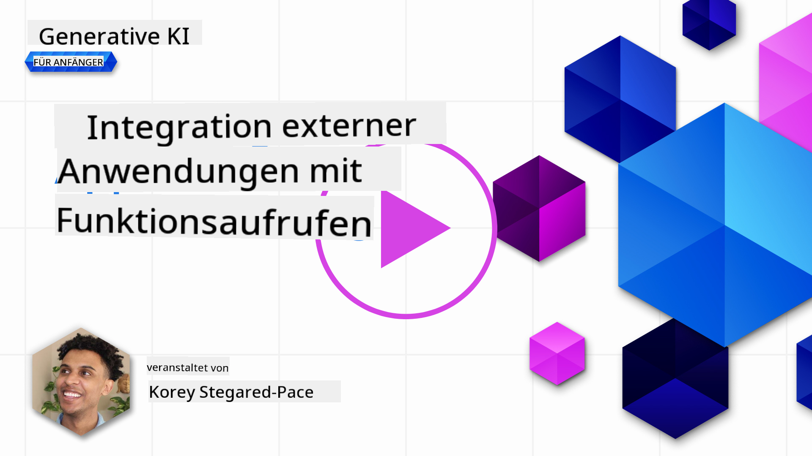
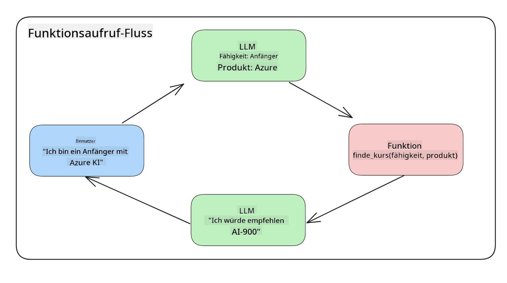
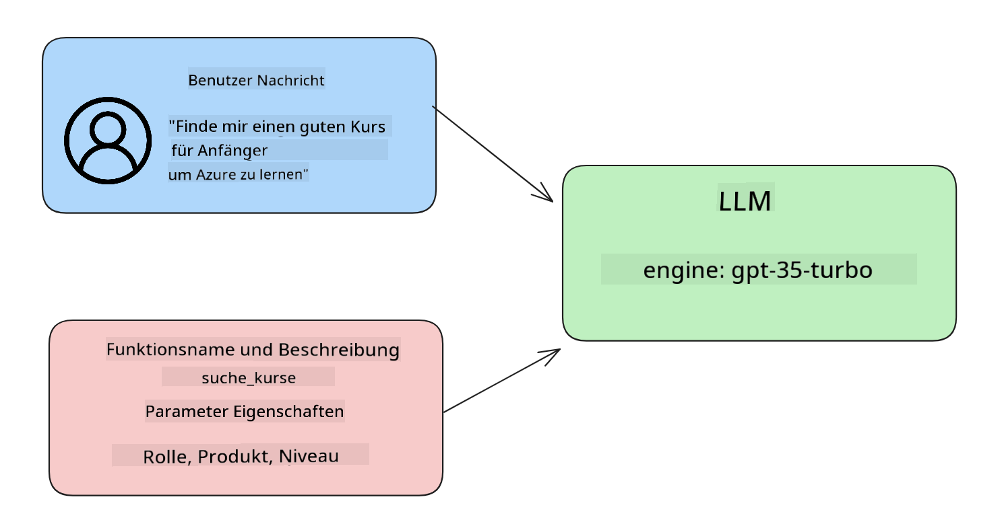

<!--
CO_OP_TRANSLATOR_METADATA:
{
  "original_hash": "77a48a201447be19aa7560706d6f93a0",
  "translation_date": "2025-07-09T14:22:28+00:00",
  "source_file": "11-integrating-with-function-calling/README.md",
  "language_code": "de"
}
-->
# Integration mit Function Calling

[](https://aka.ms/gen-ai-lesson11-gh?WT.mc_id=academic-105485-koreyst)

Du hast in den vorherigen Lektionen schon einiges gelernt. Dennoch können wir uns weiter verbessern. Einige Punkte, die wir angehen können, sind, wie wir ein konsistenteres Antwortformat erhalten, um die Weiterverarbeitung der Antwort zu erleichtern. Außerdem möchten wir möglicherweise Daten aus anderen Quellen hinzufügen, um unsere Anwendung weiter anzureichern.

Die oben genannten Probleme werden in diesem Kapitel behandelt.

## Einführung

Diese Lektion behandelt:

- Erklärung, was Function Calling ist und wofür es verwendet wird.
- Erstellen eines Function Calls mit Azure OpenAI.
- Wie man einen Function Call in eine Anwendung integriert.

## Lernziele

Am Ende dieser Lektion wirst du in der Lage sein:

- Den Zweck von Function Calling zu erklären.
- Function Call mit dem Azure OpenAI Service einzurichten.
- Effektive Function Calls für den Anwendungsfall deiner App zu entwerfen.

## Szenario: Verbesserung unseres Chatbots mit Funktionen

Für diese Lektion wollen wir eine Funktion für unser Bildungs-Startup entwickeln, die es Nutzern ermöglicht, über einen Chatbot technische Kurse zu finden. Wir empfehlen Kurse, die zu ihrem Kenntnisstand, ihrer aktuellen Rolle und der gewünschten Technologie passen.

Um dieses Szenario umzusetzen, verwenden wir eine Kombination aus:

- `Azure OpenAI`, um eine Chat-Erfahrung für den Nutzer zu schaffen.
- `Microsoft Learn Catalog API`, um Nutzern bei der Suche nach Kursen basierend auf ihrer Anfrage zu helfen.
- `Function Calling`, um die Nutzeranfrage an eine Funktion weiterzuleiten, die dann die API-Anfrage ausführt.

Um zu starten, schauen wir uns an, warum wir Function Calling überhaupt verwenden wollen:

## Warum Function Calling

Vor Function Calling waren Antworten von LLMs unstrukturiert und inkonsistent. Entwickler mussten komplexen Validierungscode schreiben, um mit jeder möglichen Antwortvariante umgehen zu können. Nutzer konnten keine Antworten auf Fragen wie „Wie ist das aktuelle Wetter in Stockholm?“ erhalten, da die Modelle nur auf den Trainingszeitraum begrenzte Daten hatten.

Function Calling ist eine Funktion des Azure OpenAI Service, die folgende Einschränkungen überwindet:

- **Konsistentes Antwortformat**. Wenn wir das Antwortformat besser steuern können, lässt sich die Antwort leichter in nachgelagerte Systeme integrieren.
- **Externe Daten**. Möglichkeit, Daten aus anderen Quellen einer Anwendung im Chat-Kontext zu verwenden.

## Das Problem anhand eines Szenarios verdeutlichen

> Wir empfehlen, das [beigefügte Notebook](../../../11-integrating-with-function-calling/python/aoai-assignment.ipynb) zu verwenden, wenn du das folgende Szenario selbst ausprobieren möchtest. Du kannst aber auch einfach weiterlesen, da wir hier ein Problem veranschaulichen wollen, bei dem Funktionen helfen können.

Schauen wir uns ein Beispiel an, das das Problem mit dem Antwortformat verdeutlicht:

Angenommen, wir wollen eine Datenbank mit Studentendaten erstellen, um ihnen passende Kurse vorschlagen zu können. Unten haben wir zwei Beschreibungen von Studenten, die sehr ähnliche Daten enthalten.

1. Erstelle eine Verbindung zu unserer Azure OpenAI-Ressource:

   ```python
   import os
   import json
   from openai import AzureOpenAI
   from dotenv import load_dotenv
   load_dotenv()

   client = AzureOpenAI(
   api_key=os.environ['AZURE_OPENAI_API_KEY'],  # this is also the default, it can be omitted
   api_version = "2023-07-01-preview"
   )

   deployment=os.environ['AZURE_OPENAI_DEPLOYMENT']
   ```

   Unten ist ein Python-Code, der unsere Verbindung zu Azure OpenAI konfiguriert, wobei wir `api_type`, `api_base`, `api_version` und `api_key` setzen.

1. Erstelle zwei Studentenbeschreibungen mit den Variablen `student_1_description` und `student_2_description`.

   ```python
   student_1_description="Emily Johnson is a sophomore majoring in computer science at Duke University. She has a 3.7 GPA. Emily is an active member of the university's Chess Club and Debate Team. She hopes to pursue a career in software engineering after graduating."

   student_2_description = "Michael Lee is a sophomore majoring in computer science at Stanford University. He has a 3.8 GPA. Michael is known for his programming skills and is an active member of the university's Robotics Club. He hopes to pursue a career in artificial intelligence after finishing his studies."
   ```

   Wir wollen die oben genannten Studentenbeschreibungen an ein LLM senden, um die Daten zu parsen. Diese Daten können später in unserer Anwendung verwendet, an eine API gesendet oder in einer Datenbank gespeichert werden.

1. Erstelle zwei identische Prompts, in denen wir das LLM anweisen, welche Informationen wir benötigen:

   ```python
   prompt1 = f'''
   Please extract the following information from the given text and return it as a JSON object:

   name
   major
   school
   grades
   club

   This is the body of text to extract the information from:
   {student_1_description}
   '''

   prompt2 = f'''
   Please extract the following information from the given text and return it as a JSON object:

   name
   major
   school
   grades
   club

   This is the body of text to extract the information from:
   {student_2_description}
   '''
   ```

   Die obigen Prompts fordern das LLM auf, Informationen zu extrahieren und die Antwort im JSON-Format zurückzugeben.

1. Nachdem wir die Prompts und die Verbindung zu Azure OpenAI eingerichtet haben, senden wir die Prompts mit `openai.ChatCompletion`. Wir speichern den Prompt in der Variable `messages` und weisen die Rolle `user` zu. So wird eine Nachricht eines Nutzers an einen Chatbot simuliert.

   ```python
   # response from prompt one
   openai_response1 = client.chat.completions.create(
   model=deployment,
   messages = [{'role': 'user', 'content': prompt1}]
   )
   openai_response1.choices[0].message.content

   # response from prompt two
   openai_response2 = client.chat.completions.create(
   model=deployment,
   messages = [{'role': 'user', 'content': prompt2}]
   )
   openai_response2.choices[0].message.content
   ```

Jetzt können wir beide Anfragen an das LLM senden und die Antwort untersuchen, indem wir sie so abrufen: `openai_response1['choices'][0]['message']['content']`.

1. Schließlich können wir die Antwort mit `json.loads` in ein JSON-Format umwandeln:

   ```python
   # Loading the response as a JSON object
   json_response1 = json.loads(openai_response1.choices[0].message.content)
   json_response1
   ```

   Antwort 1:

   ```json
   {
     "name": "Emily Johnson",
     "major": "computer science",
     "school": "Duke University",
     "grades": "3.7",
     "club": "Chess Club"
   }
   ```

   Antwort 2:

   ```json
   {
     "name": "Michael Lee",
     "major": "computer science",
     "school": "Stanford University",
     "grades": "3.8 GPA",
     "club": "Robotics Club"
   }
   ```

   Obwohl die Prompts gleich sind und die Beschreibungen ähnlich, sehen wir, dass die Werte der Eigenschaft `Grades` unterschiedlich formatiert sind, z. B. `3.7` oder `3.7 GPA`.

   Dieses Ergebnis entsteht, weil das LLM unstrukturierte Daten in Form des geschriebenen Prompts erhält und ebenfalls unstrukturierte Daten zurückgibt. Wir brauchen ein strukturiertes Format, damit wir wissen, was wir erwarten können, wenn wir diese Daten speichern oder verwenden.

Wie lösen wir also das Formatierungsproblem? Mit Function Calling können wir sicherstellen, dass wir strukturierte Daten zurückbekommen. Beim Function Calling ruft das LLM keine Funktionen auf oder führt sie aus. Stattdessen erstellen wir eine Struktur, der das LLM für seine Antworten folgen soll. Diese strukturierten Antworten nutzen wir dann, um zu wissen, welche Funktion in unserer Anwendung ausgeführt werden soll.



Wir können dann das Ergebnis der Funktion nehmen und zurück an das LLM senden. Das LLM antwortet dann in natürlicher Sprache, um die Nutzeranfrage zu beantworten.

## Anwendungsfälle für Function Calls

Es gibt viele verschiedene Anwendungsfälle, bei denen Function Calls deine App verbessern können, z. B.:

- **Aufruf externer Tools**. Chatbots sind gut darin, Fragen von Nutzern zu beantworten. Mit Function Calling können Chatbots Nutzeranfragen nutzen, um bestimmte Aufgaben zu erledigen. Zum Beispiel kann ein Student den Chatbot bitten: „Schick eine E-Mail an meinen Dozenten und sag, dass ich mehr Unterstützung bei diesem Thema brauche.“ Das kann einen Funktionsaufruf an `send_email(to: string, body: string)` auslösen.

- **Erstellen von API- oder Datenbankabfragen**. Nutzer können Informationen in natürlicher Sprache anfragen, die in eine formatierte Abfrage oder API-Anfrage umgewandelt wird. Ein Beispiel wäre ein Lehrer, der fragt: „Wer hat die letzte Aufgabe abgeschlossen?“, was eine Funktion `get_completed(student_name: string, assignment: int, current_status: string)` aufruft.

- **Erstellen strukturierter Daten**. Nutzer können einen Textblock oder CSV verwenden und das LLM wichtige Informationen daraus extrahieren lassen. Zum Beispiel kann ein Student einen Wikipedia-Artikel über Friedensabkommen in KI-Lernkarten umwandeln. Das kann mit einer Funktion `get_important_facts(agreement_name: string, date_signed: string, parties_involved: list)` geschehen.

## Erstellen deines ersten Function Calls

Der Prozess zum Erstellen eines Function Calls umfasst 3 Hauptschritte:

1. **Aufruf** der Chat Completions API mit einer Liste deiner Funktionen und einer Nutzeranfrage.
2. **Auswertung** der Antwort des Modells, um eine Aktion auszuführen, z. B. eine Funktion oder API aufzurufen.
3. **Erneuter Aufruf** der Chat Completions API mit der Antwort deiner Funktion, um damit eine Antwort für den Nutzer zu erstellen.



### Schritt 1 – Nachrichten erstellen

Der erste Schritt ist, eine Nutzer-Nachricht zu erstellen. Diese kann dynamisch durch einen Texteingabewert gesetzt werden oder du kannst hier einen Wert festlegen. Wenn du zum ersten Mal mit der Chat Completions API arbeitest, müssen wir die `role` und den `content` der Nachricht definieren.

Die `role` kann `system` (Regeln erstellen), `assistant` (das Modell) oder `user` (der Endnutzer) sein. Für Function Calling setzen wir sie auf `user` und geben eine Beispielanfrage an.

```python
messages= [ {"role": "user", "content": "Find me a good course for a beginner student to learn Azure."} ]
```

Durch die Zuweisung verschiedener Rollen wird dem LLM klar, ob es sich um eine Systemnachricht oder eine Nutzeranfrage handelt, was hilft, einen Gesprächsverlauf aufzubauen, auf dem das LLM aufbauen kann.

### Schritt 2 – Funktionen erstellen

Als nächstes definieren wir eine Funktion und deren Parameter. Hier verwenden wir nur eine Funktion namens `search_courses`, aber du kannst auch mehrere Funktionen erstellen.

> **Wichtig**: Funktionen werden in der Systemnachricht an das LLM übergeben und zählen zu den verfügbaren Tokens.

Unten erstellen wir die Funktionen als Array von Objekten. Jedes Objekt ist eine Funktion mit den Eigenschaften `name`, `description` und `parameters`:

```python
functions = [
   {
      "name":"search_courses",
      "description":"Retrieves courses from the search index based on the parameters provided",
      "parameters":{
         "type":"object",
         "properties":{
            "role":{
               "type":"string",
               "description":"The role of the learner (i.e. developer, data scientist, student, etc.)"
            },
            "product":{
               "type":"string",
               "description":"The product that the lesson is covering (i.e. Azure, Power BI, etc.)"
            },
            "level":{
               "type":"string",
               "description":"The level of experience the learner has prior to taking the course (i.e. beginner, intermediate, advanced)"
            }
         },
         "required":[
            "role"
         ]
      }
   }
]
```

Beschreiben wir die einzelnen Eigenschaften der Funktion etwas genauer:

- `name` – Der Name der Funktion, die aufgerufen werden soll.
- `description` – Beschreibung, wie die Funktion funktioniert. Hier ist es wichtig, klar und präzise zu sein.
- `parameters` – Eine Liste von Werten und Formaten, die das Modell in seiner Antwort liefern soll. Das Parameter-Array besteht aus Objekten mit folgenden Eigenschaften:
  1. `type` – Der Datentyp, in dem die Eigenschaften gespeichert werden.
  2. `properties` – Liste der spezifischen Werte, die das Modell in der Antwort verwenden soll.
     1. `name` – Der Schlüsselname der Eigenschaft, z. B. `product`.
     2. `type` – Der Datentyp dieser Eigenschaft, z. B. `string`.
     3. `description` – Beschreibung der Eigenschaft.

Es gibt auch eine optionale Eigenschaft `required` – Pflichtfelder, die für den Funktionsaufruf benötigt werden.

### Schritt 3 – Den Funktionsaufruf durchführen

Nachdem wir eine Funktion definiert haben, müssen wir sie in den Aufruf der Chat Completion API einbinden. Das machen wir, indem wir `functions` zur Anfrage hinzufügen, also `functions=functions`.

Es gibt auch die Option, `function_call` auf `auto` zu setzen. Das bedeutet, dass das LLM selbst entscheidet, welche Funktion basierend auf der Nutzeranfrage aufgerufen wird, anstatt dass wir das vorgeben.

Hier ein Beispielcode, in dem wir `ChatCompletion.create` aufrufen, wobei wir `functions=functions` und `function_call="auto"` setzen und dem LLM so die Wahl lassen, wann es die Funktionen aufruft:

```python
response = client.chat.completions.create(model=deployment,
                                        messages=messages,
                                        functions=functions,
                                        function_call="auto")

print(response.choices[0].message)
```

Die Antwort sieht dann etwa so aus:

```json
{
  "role": "assistant",
  "function_call": {
    "name": "search_courses",
    "arguments": "{\n  \"role\": \"student\",\n  \"product\": \"Azure\",\n  \"level\": \"beginner\"\n}"
  }
}
```

Hier sehen wir, wie die Funktion `search_courses` aufgerufen wurde und mit welchen Argumenten, die in der Eigenschaft `arguments` der JSON-Antwort aufgelistet sind.

Das LLM konnte die Daten so extrahieren, dass sie zu den Argumenten der Funktion passen, da es die Werte aus dem `messages`-Parameter im Chat Completion-Aufruf entnommen hat. Unten zur Erinnerung der Wert von `messages`:

```python
messages= [ {"role": "user", "content": "Find me a good course for a beginner student to learn Azure."} ]
```

Wie du siehst, wurden `student`, `Azure` und `beginner` aus `messages` extrahiert und als Eingabe an die Funktion übergeben. Funktionen auf diese Weise zu nutzen, ist eine großartige Methode, um Informationen aus einem Prompt zu extrahieren, aber auch um dem LLM Struktur zu geben und wiederverwendbare Funktionalität zu schaffen.

Als Nächstes schauen wir, wie wir das in unserer App verwenden können.

## Integration von Function Calls in eine Anwendung

Nachdem wir die formatierte Antwort des LLM getestet haben, können wir diese nun in eine Anwendung integrieren.

### Ablauf steuern

Um das in unsere Anwendung zu integrieren, gehen wir wie folgt vor:

1. Zuerst rufen wir den OpenAI-Service auf und speichern die Nachricht in einer Variablen namens `response_message`.

   ```python
   response_message = response.choices[0].message
   ```

1. Nun definieren wir die Funktion, die die Microsoft Learn API aufruft, um eine Liste von Kursen zu erhalten:

   ```python
   import requests

   def search_courses(role, product, level):
     url = "https://learn.microsoft.com/api/catalog/"
     params = {
        "role": role,
        "product": product,
        "level": level
     }
     response = requests.get(url, params=params)
     modules = response.json()["modules"]
     results = []
     for module in modules[:5]:
        title = module["title"]
        url = module["url"]
        results.append({"title": title, "url": url})
     return str(results)
   ```

   Beachte, dass wir jetzt eine echte Python-Funktion erstellen, die den Funktionsnamen aus der `functions`-Variable zuordnet. Außerdem führen wir echte externe API-Aufrufe aus, um die benötigten Daten abzurufen. In diesem Fall greifen wir auf die Microsoft Learn API zu, um Trainingsmodule zu suchen.

Okay, wir haben die `functions`-Variable und eine entsprechende Python-Funktion erstellt – wie sagen wir dem LLM, wie es diese beiden zusammenbringen soll, damit unsere Python-Funktion aufgerufen wird?

1. Um zu prüfen, ob wir eine Python-Funktion aufrufen müssen, schauen wir in die Antwort des LLM, ob `function_call` darin enthalten ist, und rufen dann die angegebene Funktion auf. So kannst du die Prüfung durchführen:

   ```python
   # Check if the model wants to call a function
   if response_message.function_call.name:
    print("Recommended Function call:")
    print(response_message.function_call.name)
    print()

    # Call the function.
    function_name = response_message.function_call.name

    available_functions = {
            "search_courses": search_courses,
    }
    function_to_call = available_functions[function_name]

    function_args = json.loads(response_message.function_call.arguments)
    function_response = function_to_call(**function_args)

    print("Output of function call:")
    print(function_response)
    print(type(function_response))


    # Add the assistant response and function response to the messages
    messages.append( # adding assistant response to messages
        {
            "role": response_message.role,
            "function_call": {
                "name": function_name,
                "arguments": response_message.function_call.arguments,
            },
            "content": None
        }
    )
    messages.append( # adding function response to messages
        {
            "role": "function",
            "name": function_name,
            "content":function_response,
        }
    )
   ```

   Diese drei Zeilen sorgen dafür, dass wir den Funktionsnamen und die Argumente extrahieren und den Aufruf ausführen:

   ```python
   function_to_call = available_functions[function_name]

   function_args = json.loads(response_message.function_call.arguments)
   function_response = function_to_call(**function_args)
   ```

   Unten siehst du die Ausgabe unseres Codes:

   **Ausgabe**

   ```Recommended Function call:
   {
     "name": "search_courses",
     "arguments": "{\n  \"role\": \"student\",\n  \"product\": \"Azure\",\n  \"level\": \"beginner\"\n}"
   }

   Output of function call:
   [{'title': 'Describe concepts of cryptography', 'url': 'https://learn.microsoft.com/training/modules/describe-concepts-of-cryptography/?
   WT.mc_id=api_CatalogApi'}, {'title': 'Introduction to audio classification with TensorFlow', 'url': 'https://learn.microsoft.com/en-
   us/training/modules/intro-audio-classification-tensorflow/?WT.mc_id=api_CatalogApi'}, {'title': 'Design a Performant Data Model in Azure SQL
   Database with Azure Data Studio', 'url': 'https://learn.microsoft.com/training/modules/design-a-data-model-with-ads/?
   WT.mc_id=api_CatalogApi'}, {'title': 'Getting started with the Microsoft Cloud Adoption Framework for Azure', 'url':
   'https://learn.microsoft.com/training/modules/cloud-adoption-framework-getting-started/?WT.mc_id=api_CatalogApi'}, {'title': 'Set up the
   Rust development environment', 'url': 'https://learn.microsoft.com/training/modules/rust-set-up-environment/?WT.mc_id=api_CatalogApi'}]
   <class 'str'>
   ```

1. Jetzt senden wir die aktualisierte Nachricht `messages` an das LLM, damit wir eine Antwort in natürlicher Sprache erhalten, anstatt eine API-Antwort im JSON-Format.

   ```python
   print("Messages in next request:")
   print(messages)
   print()

   second_response = client.chat.completions.create(
      messages=messages,
      model=deployment,
      function_call="auto",
      functions=functions,
      temperature=0
         )  # get a new response from GPT where it can see the function response


   print(second_response.choices[0].message)
   ```

   **Ausgabe**

   ```python
   {
     "role": "assistant",
     "content": "I found some good courses for beginner students to learn Azure:\n\n1. [Describe concepts of cryptography] (https://learn.microsoft.com/training/modules/describe-concepts-of-cryptography/?WT.mc_id=api_CatalogApi)\n2. [Introduction to audio classification with TensorFlow](https://learn.microsoft.com/training/modules/intro-audio-classification-tensorflow/?WT.mc_id=api_CatalogApi)\n3. [Design a Performant Data Model in Azure SQL Database with Azure Data Studio](https://learn.microsoft.com/training/modules/design-a-data-model-with-ads/?WT.mc_id=api_CatalogApi)\n4. [Getting started with the Microsoft Cloud Adoption Framework for Azure](https://learn.microsoft.com/training/modules/cloud-adoption-framework-getting-started/?WT.mc_id=api_CatalogApi)\n5. [Set up the Rust development environment](https://learn.microsoft.com/training/modules/rust-set-up-environment/?WT.mc_id=api_CatalogApi)\n\nYou can click on the links to access the courses."
   }

   ```

## Aufgabe

Um dein Wissen zu Azure OpenAI Function Calling weiter zu vertiefen, kannst du folgendes umsetzen:

- Weitere Parameter für die Funktion hinzufügen, die Lernenden helfen, mehr Kurse zu finden.
- Einen weiteren Function Call erstellen, der mehr Informationen vom Lernenden abfragt, z. B. deren Muttersprache.
- Fehlerbehandlung implementieren, falls der Funktionsaufruf und/oder API-Aufruf keine passenden Kurse zurückliefert.
Hinweis: Folgen Sie der [Learn API reference documentation](https://learn.microsoft.com/training/support/catalog-api-developer-reference?WT.mc_id=academic-105485-koreyst), um zu sehen, wie und wo diese Daten verfügbar sind.

## Großartige Arbeit! Setze die Reise fort

Nachdem du diese Lektion abgeschlossen hast, schau dir unsere [Generative AI Learning collection](https://aka.ms/genai-collection?WT.mc_id=academic-105485-koreyst) an, um dein Wissen über Generative KI weiter auszubauen!

Gehe zu Lektion 12, in der wir uns ansehen, wie man [UX für KI-Anwendungen gestaltet](../12-designing-ux-for-ai-applications/README.md?WT.mc_id=academic-105485-koreyst)!

**Haftungsausschluss**:  
Dieses Dokument wurde mit dem KI-Übersetzungsdienst [Co-op Translator](https://github.com/Azure/co-op-translator) übersetzt. Obwohl wir uns um Genauigkeit bemühen, beachten Sie bitte, dass automatisierte Übersetzungen Fehler oder Ungenauigkeiten enthalten können. Das Originaldokument in seiner Ursprungssprache gilt als maßgebliche Quelle. Für wichtige Informationen wird eine professionelle menschliche Übersetzung empfohlen. Wir übernehmen keine Haftung für Missverständnisse oder Fehlinterpretationen, die aus der Nutzung dieser Übersetzung entstehen.