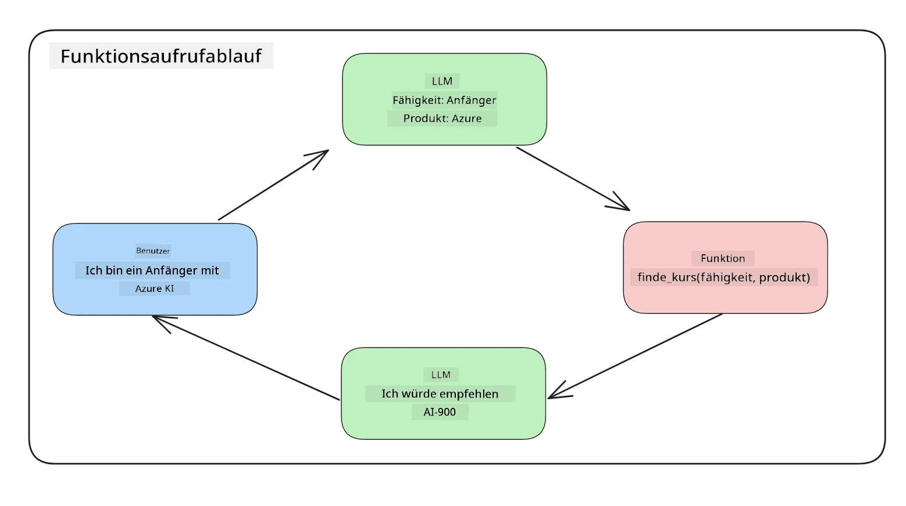
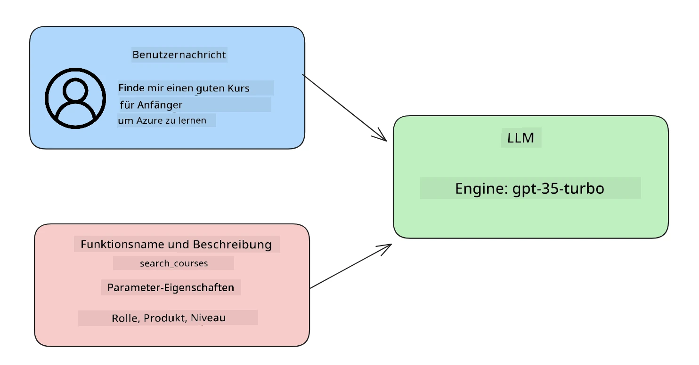

# Integration mit Funktionsaufrufen

[](https://youtu.be/DgUdCLX8qYQ?si=f1ouQU5HQx6F8Gl2)

Du hast bisher in den vorherigen Lektionen schon einiges gelernt. Wir können uns jedoch noch weiter verbessern. Einige Dinge, die wir angehen können, sind, wie wir ein konsistenteres Antwortformat erhalten, um die weitere Verarbeitung der Antwort zu erleichtern. Außerdem möchten wir möglicherweise Daten aus anderen Quellen hinzufügen, um unsere Anwendung weiter anzureichern.

Die oben genannten Probleme werden in diesem Kapitel behandelt.

## Einführung

Diese Lektion behandelt:

- Erläuterung, was Funktionsaufrufe sind und zu welchen Anwendungsfällen sie dienen.
- Erstellung eines Funktionsaufrufs mit Azure OpenAI.
- Wie man einen Funktionsaufruf in eine Anwendung integriert.

## Lernziele

Am Ende dieser Lektion wirst du in der Lage sein:

- Den Zweck von Funktionsaufrufen zu erklären.
- Einen Funktionsaufruf mit dem Azure OpenAI Service einzurichten.
- Effektive Funktionsaufrufe für den Anwendungsfall deiner App zu gestalten.

## Szenario: Verbesserung unseres Chatbots mit Funktionen

Für diese Lektion möchten wir ein Feature für unser EdTech-Startup bauen, das es Nutzern ermöglicht, mit einem Chatbot technische Kurse zu finden. Wir empfehlen Kurse, die ihrem Fähigkeitsniveau, ihrer aktuellen Rolle und der Technologie, die sie interessiert, entsprechen.

Um dieses Szenario umzusetzen, verwenden wir eine Kombination aus:

- `Azure OpenAI`, um ein Chat-Erlebnis für den Nutzer zu schaffen.
- `Microsoft Learn Catalog API`, um Nutzern bei der Kursfindung basierend auf ihrer Anfrage zu helfen.
- `Funktionsaufrufe`, um die Anfrage des Nutzers an eine Funktion zu übergeben, die dann die API anfragt.

Um zu beginnen, sehen wir uns an, warum wir überhaupt Funktionsaufrufe nutzen möchten:

## Warum Funktionsaufrufe

Vor den Funktionsaufrufen waren Antworten von LLMs unstrukturiert und inkonsistent. Entwickler mussten komplexen Validierungscode schreiben, um jede mögliche Antwortvariante zu handhaben. Nutzer konnten keine Antworten auf Fragen wie „Wie ist das aktuelle Wetter in Stockholm?“ erhalten, da die Modelle nur auf den Trainingszeitraum der Daten beschränkt waren.

Funktionsaufrufe sind eine Funktion des Azure OpenAI Service, um folgende Einschränkungen zu überwinden:

- **Konsistentes Antwortformat**. Wenn wir das Antwortformat besser steuern können, lässt sich die Antwort leichter weiterverarbeiten und in andere Systeme integrieren.
- **Externe Daten**. Möglichkeit, Daten aus anderen Quellen einer Anwendung im Chat-Kontext zu nutzen.

## Veranschaulichung des Problems anhand eines Szenarios

> Wir empfehlen dir, das [beigefügte Notebook](./python/aoai-assignment.ipynb?WT.mc_id=academic-105485-koreyst) zu verwenden, wenn du das folgende Szenario ausprobieren möchtest. Du kannst auch einfach mitlesen, während wir versuchen, ein Problem zu veranschaulichen, bei dem Funktionsaufrufe helfen können.

Sehen wir uns das Beispiel an, das das Problem mit dem Antwortformat illustriert:

Angenommen, wir wollen eine Datenbank mit Studentendaten erstellen, um ihnen den richtigen Kurs vorzuschlagen. Unten haben wir zwei Beschreibungen von Studenten, die sehr ähnlich in den enthaltenen Daten sind.

1. Erstelle eine Verbindung zu unserer Azure OpenAI-Ressource:

   ```python
   import os
   import json
   from openai import OpenAI
   from dotenv import load_dotenv
   load_dotenv()

   # Die Responses API wird vom Azure OpenAI (Microsoft Foundry) v1-Endpunkt bereitgestellt,
   # daher richten wir den OpenAI-Client auf <your-endpoint>/openai/v1/ aus.
   endpoint = os.environ['AZURE_OPENAI_ENDPOINT']
   client = OpenAI(
   api_key=os.environ['AZURE_OPENAI_API_KEY'],
   base_url=f"{endpoint.rstrip('/')}/openai/v1/",
   )

   deployment=os.environ['AZURE_OPENAI_DEPLOYMENT']
   ```

   Unten findest du Python-Code zur Konfiguration unserer Verbindung zu Azure OpenAI. Da wir den v1-Endpunkt verwenden, müssen wir nur `api_key` und `base_url` setzen (keine `api_version` erforderlich).

1. Erstelle zwei Studentenbeschreibungen mit den Variablen `student_1_description` und `student_2_description`.

   ```python
   student_1_description="Emily Johnson is a sophomore majoring in computer science at Duke University. She has a 3.7 GPA. Emily is an active member of the university's Chess Club and Debate Team. She hopes to pursue a career in software engineering after graduating."

   student_2_description = "Michael Lee is a sophomore majoring in computer science at Stanford University. He has a 3.8 GPA. Michael is known for his programming skills and is an active member of the university's Robotics Club. He hopes to pursue a career in artificial intelligence after finishing his studies."
   ```

   Wir wollen die obigen Studentenbeschreibungen an ein LLM senden, um die Daten zu parsen. Diese Daten können später in unserer Anwendung verwendet, an eine API gesendet oder in einer Datenbank gespeichert werden.

1. Erstelle zwei identische Prompts, in denen wir dem LLM mitteilen, welche Informationen wir interessieren:

   ```python
   prompt1 = f'''
   Please extract the following information from the given text and return it as a JSON object:

   name
   major
   school
   grades
   club

   This is the body of text to extract the information from:
   {student_1_description}
   '''

   prompt2 = f'''
   Please extract the following information from the given text and return it as a JSON object:

   name
   major
   school
   grades
   club

   This is the body of text to extract the information from:
   {student_2_description}
   '''
   ```

   Obige Prompts weisen das LLM an, Informationen zu extrahieren und die Antwort im JSON-Format zurückzugeben.

1. Nachdem wir die Prompts und die Verbindung zu Azure OpenAI eingerichtet haben, senden wir die Prompts mit `client.responses.create` an das LLM. Wir speichern den Prompt in der Variable `input` und setzen die Rolle auf `user`. So wird eine Nachricht eines Nutzers an den Chatbot simuliert.

   ```python
   # Antwort auf Aufforderung eins
   openai_response1 = client.responses.create(
   model=deployment,
   input = [{'role': 'user', 'content': prompt1}],
   store=False,
   )
   openai_response1.output_text

   # Antwort auf Aufforderung zwei
   openai_response2 = client.responses.create(
   model=deployment,
   input = [{'role': 'user', 'content': prompt2}],
   store=False,
   )
   openai_response2.output_text
   ```

Jetzt können wir beide Anfragen an das LLM senden und die Antwort prüfen, die wir mit `openai_response1.output_text` erhalten.

1. Zuletzt können wir die Antwort mit `json.loads` in JSON umwandeln:

   ```python
   # Die Antwort als JSON-Objekt laden
   json_response1 = json.loads(openai_response1.output_text)
   json_response1
   ```

   Antwort 1:

   ```json
   {
     "name": "Emily Johnson",
     "major": "computer science",
     "school": "Duke University",
     "grades": "3.7",
     "club": "Chess Club"
   }
   ```

   Antwort 2:

   ```json
   {
     "name": "Michael Lee",
     "major": "computer science",
     "school": "Stanford University",
     "grades": "3.8 GPA",
     "club": "Robotics Club"
   }
   ```

   Obwohl die Prompts gleich und die Beschreibungen ähnlich sind, sehen wir, dass die Werte der Eigenschaft `Grades` unterschiedlich formatiert sind. Manchmal erhalten wir das Format `3.7`, manchmal `3.7 GPA`.

   Dieses Ergebnis liegt daran, dass das LLM unstrukturierte Daten in Form des geschriebenen Prompts übernimmt und ebenfalls unstrukturierte Daten zurückliefert. Wir benötigen ein strukturiertes Format, um zu wissen, was wir erwarten, wenn wir die Daten speichern oder verwenden.

Wie lösen wir das Formatproblem also? Durch Funktionsaufrufe können wir sicherstellen, dass wir strukturierte Daten zurückerhalten. Beim Funktionsaufruf ruft oder führt das LLM keine Funktionen tatsächlich aus. Stattdessen legen wir eine Struktur fest, der das LLM in seinen Antworten folgen soll. Diese strukturierten Antworten verwenden wir dann, um zu wissen, welche Funktion in unseren Anwendungen ausgeführt werden soll.



Wir können dann das, was von der Funktion zurückkommt, nehmen und an das LLM zurücksenden. Das LLM antwortet dann mit natürlicher Sprache, um die Anfrage des Nutzers zu beantworten.

## Anwendungsfälle für Funktionsaufrufe

Es gibt viele verschiedene Anwendungsfälle, bei denen Funktionsaufrufe deine App verbessern können, wie zum Beispiel:

- **Externe Werkzeuge aufrufen**. Chatbots sind hervorragend darin, Fragen von Nutzern zu beantworten. Durch Funktionsaufrufe können Chatbots Nachrichten von Nutzern nutzen, um bestimmte Aufgaben auszuführen. Zum Beispiel kann ein Student den Chatbot bitten: „Schicke eine E-Mail an meinen Dozenten und sage, dass ich mehr Hilfe zu diesem Thema benötige“. Dies kann einen Funktionsaufruf an `send_email(to: string, body: string)` auslösen.

- **API- oder Datenbankabfragen erstellen**. Nutzer können Informationen in natürlicher Sprache anfragen, die in eine formatierte Abfrage oder API-Anfrage umgewandelt wird. Ein Beispiel wäre ein Lehrer, der fragt „Wer sind die Studenten, die die letzte Aufgabe abgeschlossen haben“, was eine Funktion namens `get_completed(student_name: string, assignment: int, current_status: string)` aufruft.

- **Strukturierte Daten erstellen**. Nutzer können einen Textblock oder eine CSV nehmen und mit dem LLM wichtige Informationen extrahieren lassen. Zum Beispiel kann ein Student einen Wikipedia-Artikel über Friedensverträge nehmen, um KI-Lernkarten zu erstellen. Dies kann mit einer Funktion namens `get_important_facts(agreement_name: string, date_signed: string, parties_involved: list)` umgesetzt werden.

## Erstellen deines ersten Funktionsaufrufs

Der Prozess zur Erstellung eines Funktionsaufrufs umfasst 3 Hauptschritte:

1. **Aufruf** der Responses-API mit einer Liste deiner Funktionen (Werkzeuge) und einer Nutzer-Nachricht.
2. **Auswertung** der Antwort des Modells, um eine Aktion durchzuführen, z. B. eine Funktion oder API aufzurufen.
3. **Einen weiteren Aufruf** an die Responses-API machen mit der Antwort aus deiner Funktion, um damit eine Antwort an den Nutzer zu erstellen.



### Schritt 1 - Nachrichten erstellen

Der erste Schritt ist, eine Nutzer-Nachricht zu erstellen. Diese kann dynamisch gesetzt werden, indem der Wert eines Texteingabefeldes genommen wird, oder du kannst hier einen Wert setzen. Wenn du zum ersten Mal mit der Responses-API arbeitest, müssen wir die `role` und den `content` der Nachricht definieren.

Die `role` kann entweder `system` (Regeln erstellen), `assistant` (das Modell) oder `user` (Endnutzer) sein. Für Funktionsaufrufe setzen wir diese auf `user` und eine Beispiel-Frage.

```python
messages= [ {"role": "user", "content": "Find me a good course for a beginner student to learn Azure."} ]
```

Durch das Zuordnen verschiedener Rollen wird dem LLM klar gemacht, ob das System etwas sagt oder der Nutzer, was hilft, eine Gesprächshistorie aufzubauen, auf der das LLM aufbauen kann.

### Schritt 2 - Funktionen erstellen

Als Nächstes definieren wir eine Funktion und die Parameter dieser Funktion. Wir nutzen hier nur eine Funktion namens `search_courses`, du kannst jedoch auch mehrere Funktionen erstellen.

> **Wichtig**: Funktionen sind in der Systemnachricht an das LLM enthalten und zählen zu den verfügbaren Tokens, die du hast.

Unten erstellen wir die Funktionen als ein Array von Items. Jedes Item ist ein Werkzeug im flachen Responses-API-Format mit den Eigenschaften `type`, `name`, `description` und `parameters`:

```python
functions = [
   {
      "type":"function",
      "name":"search_courses",
      "description":"Retrieves courses from the search index based on the parameters provided",
      "parameters":{
         "type":"object",
         "properties":{
            "role":{
               "type":"string",
               "description":"The role of the learner (i.e. developer, data scientist, student, etc.)"
            },
            "product":{
               "type":"string",
               "description":"The product that the lesson is covering (i.e. Azure, Power BI, etc.)"
            },
            "level":{
               "type":"string",
               "description":"The level of experience the learner has prior to taking the course (i.e. beginner, intermediate, advanced)"
            }
         },
         "required":[
            "role"
         ]
      }
   }
]
```

Lassen Sie uns jedes Funktions-Element im Detail beschreiben:

- `name` – Der Name der Funktion, die aufgerufen werden soll.
- `description` – Eine Beschreibung, wie die Funktion funktioniert. Hier ist es wichtig, spezifisch und klar zu sein.
- `parameters` – Eine Liste von Werten und dem Format, das du vom Modell in der Antwort erwarten möchtest. Das Parameter-Array besteht aus Items, die folgende Eigenschaften haben:
  1. `type` – Der Datentyp, in dem die Eigenschaften gespeichert werden.
  2. `properties` – Liste der spezifischen Werte, die das Modell für seine Antwort verwendet.
      1. `name` – Der Schlüsselname der Eigenschaft, die das Modell in seiner formatierten Antwort verwenden wird, z.B. `product`.
      2. `type` – Der Datentyp dieser Eigenschaft, z.B. `string`.
      3. `description` – Beschreibung dieser Eigenschaft.

Es gibt auch eine optionale Eigenschaft `required` – erforderliche Eigenschaft, damit der Funktionsaufruf erfolgreich abgeschlossen werden kann.

### Schritt 3 - Den Funktionsaufruf ausführen

Nachdem wir eine Funktion definiert haben, müssen wir sie nun im Aufruf der Responses-API einbinden. Das machen wir, indem wir `tools` zur Anfrage hinzufügen. In diesem Fall `tools=functions`.

Es gibt auch die Option, `tool_choice` auf `auto` zu setzen. Das bedeutet, dass wir das LLM entscheiden lassen, welche Funktion aufgrund der Nutzer-Nachricht aufgerufen wird, anstatt es selbst festzulegen.

Unten siehst du etwas Code, bei dem wir `client.responses.create` aufrufen. Beachte, wie wir `tools=functions` und `tool_choice="auto"` setzen und damit dem LLM die Wahl geben, wann es die uns bereitgestellten Funktionen aufruft:

```python
response = client.responses.create(model=deployment,
                                        input=messages,
                                        tools=functions,
                                        tool_choice="auto",
                                        store=False)

print(response.output)
```

Die zurückkommende Antwort enthält jetzt ein `function_call`-Element in `response.output`, das so aussieht:

```json
{
  "type": "function_call",
  "name": "search_courses",
  "call_id": "call_abc123",
  "arguments": "{\n  \"role\": \"student\",\n  \"product\": \"Azure\",\n  \"level\": \"beginner\"\n}"
}
```

Hier sehen wir, wie die Funktion `search_courses` aufgerufen wurde und mit welchen Argumenten, wie im `arguments`-Feld der JSON-Antwort aufgeführt.

Die Schlussfolgerung ist, dass das LLM die Daten gefunden hat, um die Argumente der Funktion zu füllen, da es die Werte aus dem `input`-Parameter des Responses-API-Aufrufs extrahiert hat. Unten zur Erinnerung die `messages`-Variable:

```python
messages= [ {"role": "user", "content": "Find me a good course for a beginner student to learn Azure."} ]
```

Wie du sehen kannst, wurden `student`, `Azure` und `beginner` aus den `messages` extrahiert und als Eingabe an die Funktion übergeben. Die Verwendung von Funktionen auf diese Weise ist eine gute Methode, Informationen aus einem Prompt zu extrahieren, zugleich aber auch dem LLM Struktur zu geben und wiederverwendbare Funktionen bereitzustellen.

Als Nächstes schauen wir, wie wir dies in unsere App integrieren können.

## Integration von Funktionsaufrufen in eine Anwendung

Nachdem wir das formatierte Antwortformat des LLM getestet haben, können wir dies nun in eine Anwendung integrieren.

### Steuerung des Ablaufs

Um dies in unserer Anwendung zu integrieren, gehen wir wie folgt vor:

1. Als Erstes tätigen wir den Aufruf an den OpenAI-Service und extrahieren die Funktionsaufruf-Elemente aus der Antwort `output`.

   ```python
   response_items = response.output
   tool_calls = [item for item in response_items if item.type == "function_call"]
   ```

1. Jetzt definieren wir die Funktion, die die Microsoft Learn-API aufruft, um eine Liste von Kursen zu erhalten:

   ```python
   import requests

   def search_courses(role, product, level):
     url = "https://learn.microsoft.com/api/catalog/"
     params = {
        "role": role,
        "product": product,
        "level": level
     }
     response = requests.get(url, params=params)
     modules = response.json()["modules"]
     results = []
     for module in modules[:5]:
        title = module["title"]
        url = module["url"]
        results.append({"title": title, "url": url})
     return str(results)
   ```

   Achte darauf, wie wir jetzt eine tatsächliche Python-Funktion erstellen, die den Funktionsnamen aus der `functions`-Variable zuordnet. Wir führen auch echte externe API-Aufrufe aus, um die benötigten Daten abzurufen. In diesem Fall greifen wir auf die Microsoft Learn API zu, um Trainingsmodule zu suchen.

Okay, wir haben `functions`-Variablen erstellt und eine entsprechende Python-Funktion, wie teilen wir dem LLM mit, wie diese beiden zusammengeführt werden, damit unsere Python-Funktion aufgerufen wird?

1. Um zu prüfen, ob wir eine Python-Funktion aufrufen müssen, schauen wir in die LLM-Antwort, ob ein `function_call`-Element vorhanden ist, und rufen die entsprechende Funktion auf. So kannst du die erwähnte Prüfung durchführen:

   ```python
   # Überprüfen, ob das Modell eine Funktion aufrufen möchte
   if tool_calls:
    for tool_call in tool_calls:
     print("Recommended Function call:")
     print(tool_call.name)
     print()

     # Rufe die Funktion auf.
     function_name = tool_call.name

     available_functions = {
             "search_courses": search_courses,
     }
     function_to_call = available_functions[function_name]

     function_args = json.loads(tool_call.arguments)
     function_response = function_to_call(**function_args)

     print("Output of function call:")
     print(function_response)
     print(type(function_response))

     # Füge den Funktionsaufruf und dessen Ergebnis wieder zum Gespräch hinzu.
     # Das function_call-Element des Modells muss vor seiner Ausgabe angehängt werden.
     messages.append(tool_call)  # das function_call-Element des Assistenten
     messages.append( # das Funktionsergebnis
         {
             "type": "function_call_output",
             "call_id": tool_call.call_id,
             "output": function_response,
         }
     )
   ```

   Diese drei Zeilen sorgen dafür, dass der Funktionsname, die Argumente extrahiert und die Funktion aufgerufen wird:

   ```python
   function_to_call = available_functions[function_name]

   function_args = json.loads(tool_call.arguments)
   function_response = function_to_call(**function_args)
   ```

   Unten siehst du die Ausgabe beim Ausführen unseres Codes:

   **Ausgabe**

   ```Recommended Function call:
   {
     "name": "search_courses",
     "arguments": "{\n  \"role\": \"student\",\n  \"product\": \"Azure\",\n  \"level\": \"beginner\"\n}"
   }

   Output of function call:
   [{'title': 'Describe concepts of cryptography', 'url': 'https://learn.microsoft.com/training/modules/describe-concepts-of-cryptography/?
   WT.mc_id=api_CatalogApi'}, {'title': 'Introduction to audio classification with TensorFlow', 'url': 'https://learn.microsoft.com/en-
   us/training/modules/intro-audio-classification-tensorflow/?WT.mc_id=api_CatalogApi'}, {'title': 'Design a Performant Data Model in Azure SQL
   Database with Azure Data Studio', 'url': 'https://learn.microsoft.com/training/modules/design-a-data-model-with-ads/?
   WT.mc_id=api_CatalogApi'}, {'title': 'Getting started with the Microsoft Cloud Adoption Framework for Azure', 'url':
   'https://learn.microsoft.com/training/modules/cloud-adoption-framework-getting-started/?WT.mc_id=api_CatalogApi'}, {'title': 'Set up the
   Rust development environment', 'url': 'https://learn.microsoft.com/training/modules/rust-set-up-environment/?WT.mc_id=api_CatalogApi'}]
   <class 'str'>
   ```

1. Nun senden wir die aktualisierte Nachricht, `messages`, an das LLM, damit wir eine Antwort in natürlicher Sprache erhalten anstatt einer API-Antwort im JSON-Format.

   ```python
   print("Messages in next request:")
   print(messages)
   print()

   second_response = client.responses.create(
      input=messages,
      model=deployment,
      tool_choice="auto",
      tools=functions,
      temperature=0,
      store=False,
         )  # Erhalte eine neue Antwort vom Modell, bei der es die Funktionsantwort sehen kann


   print(second_response.output_text)
   ```

   **Ausgabe**

   ```text
   I found some good courses for beginner students to learn Azure:

   1. [Describe concepts of cryptography](https://learn.microsoft.com/training/modules/describe-concepts-of-cryptography/?WT.mc_id=api_CatalogApi)
   2. [Introduction to audio classification with TensorFlow](https://learn.microsoft.com/training/modules/intro-audio-classification-tensorflow/?WT.mc_id=api_CatalogApi)
   3. [Design a Performant Data Model in Azure SQL Database with Azure Data Studio](https://learn.microsoft.com/training/modules/design-a-data-model-with-ads/?WT.mc_id=api_CatalogApi)
   4. [Getting started with the Microsoft Cloud Adoption Framework for Azure](https://learn.microsoft.com/training/modules/cloud-adoption-framework-getting-started/?WT.mc_id=api_CatalogApi)
   5. [Set up the Rust development environment](https://learn.microsoft.com/training/modules/rust-set-up-environment/?WT.mc_id=api_CatalogApi)

   You can click on the links to access the courses.
   ```

## Aufgabe

Um deine Kenntnisse zu Azure OpenAI Funktionsaufrufen weiter auszubauen, kannst du bauen:

- Mehr Parameter für die Funktion, die Lernenden helfen können, mehr Kurse zu finden.

- Erstellen Sie einen weiteren Funktionsaufruf, der mehr Informationen vom Lernenden wie seine Muttersprache übernimmt
- Erstellen Sie eine Fehlerbehandlung, wenn der Funktionsaufruf und/oder API-Aufruf keine geeigneten Kurse zurückgibt

Hinweis: Folgen Sie der [Learn API-Referenzdokumentation](https://learn.microsoft.com/training/support/catalog-api-developer-reference?WT.mc_id=academic-105485-koreyst), um zu sehen, wie und wo diese Daten verfügbar sind.

## Tolle Arbeit! Setzen Sie die Reise fort

Nach Abschluss dieser Lektion schauen Sie sich unsere [Generative AI Learning Sammlung](https://aka.ms/genai-collection?WT.mc_id=academic-105485-koreyst) an, um Ihr Wissen über Generative KI weiter zu vertiefen!

Gehen Sie zu Lektion 12, wo wir uns ansehen, wie man [UX für KI-Anwendungen gestaltet](../12-designing-ux-for-ai-applications/README.md?WT.mc_id=academic-105485-koreyst)!

---

<!-- CO-OP TRANSLATOR DISCLAIMER START -->
**Haftungsausschluss**:
Dieses Dokument wurde mit dem KI-Übersetzungsdienst [Co-op Translator](https://github.com/Azure/co-op-translator) übersetzt. Obwohl wir uns um Genauigkeit bemühen, beachten Sie bitte, dass automatisierte Übersetzungen Fehler oder Ungenauigkeiten enthalten können. Das Originaldokument in seiner Ursprungssprache gilt als maßgebliche Quelle. Bei kritischen Informationen wird eine professionelle menschliche Übersetzung empfohlen. Wir übernehmen keine Haftung für Missverständnisse oder Fehlinterpretationen, die aus der Verwendung dieser Übersetzung entstehen.
<!-- CO-OP TRANSLATOR DISCLAIMER END -->