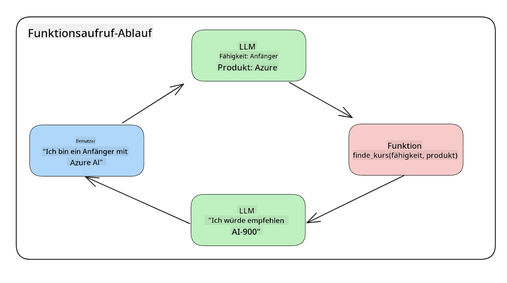
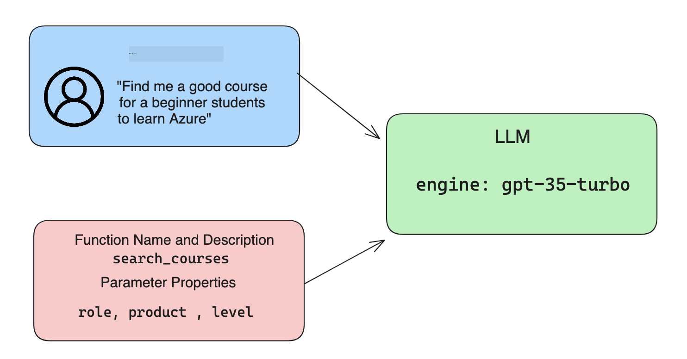

<!--
CO_OP_TRANSLATOR_METADATA:
{
  "original_hash": "f6f84f9ef2d066cd25850cab93580a50",
  "translation_date": "2025-10-17T22:54:22+00:00",
  "source_file": "11-integrating-with-function-calling/README.md",
  "language_code": "de"
}
-->
# Integration mit Funktionsaufrufen

[](https://youtu.be/DgUdCLX8qYQ?si=f1ouQU5HQx6F8Gl2)

Du hast in den vorherigen Lektionen bereits einiges gelernt. Dennoch gibt es noch Raum für Verbesserungen. Einige Punkte, die wir angehen können, sind beispielsweise, wie wir ein konsistenteres Antwortformat erhalten, um die Weiterverarbeitung der Antworten zu erleichtern. Außerdem könnten wir Daten aus anderen Quellen hinzufügen, um unsere Anwendung weiter zu bereichern.

Die oben genannten Probleme sind das Hauptthema dieses Kapitels.

## Einführung

In dieser Lektion behandeln wir:

- Was Funktionsaufrufe sind und ihre Anwendungsfälle.
- Erstellen eines Funktionsaufrufs mit Azure OpenAI.
- Integration eines Funktionsaufrufs in eine Anwendung.

## Lernziele

Am Ende dieser Lektion wirst du in der Lage sein:

- Den Zweck von Funktionsaufrufen zu erklären.
- Funktionsaufrufe mit dem Azure OpenAI Service einzurichten.
- Effektive Funktionsaufrufe für die Anforderungen deiner Anwendung zu entwerfen.

## Szenario: Verbesserung unseres Chatbots mit Funktionen

In dieser Lektion möchten wir eine Funktion für unser Bildungs-Startup entwickeln, die es Nutzern ermöglicht, technische Kurse über einen Chatbot zu finden. Wir werden Kurse empfehlen, die zu ihrem Fähigkeitsniveau, ihrer aktuellen Rolle und ihrem Interessensgebiet passen.

Um dieses Szenario umzusetzen, verwenden wir eine Kombination aus:

- `Azure OpenAI`, um eine Chat-Erfahrung für den Nutzer zu schaffen.
- `Microsoft Learn Catalog API`, um Nutzern Kurse basierend auf ihrer Anfrage zu empfehlen.
- `Funktionsaufrufen`, um die Anfrage des Nutzers zu verarbeiten und an eine Funktion weiterzuleiten, die die API-Anfrage ausführt.

Beginnen wir damit, warum wir überhaupt Funktionsaufrufe verwenden möchten:

## Warum Funktionsaufrufe?

Vor der Einführung von Funktionsaufrufen waren die Antworten eines LLM unstrukturiert und inkonsistent. Entwickler mussten komplexen Validierungscode schreiben, um sicherzustellen, dass sie jede Variation einer Antwort verarbeiten konnten. Nutzer konnten keine Antworten auf Fragen wie "Wie ist das aktuelle Wetter in Stockholm?" erhalten, da die Modelle auf Daten beschränkt waren, die bis zu einem bestimmten Zeitpunkt trainiert wurden.

Funktionsaufrufe sind eine Funktion des Azure OpenAI Service, die folgende Einschränkungen überwindet:

- **Konsistentes Antwortformat**. Wenn wir das Antwortformat besser kontrollieren können, können wir die Antwort einfacher in andere Systeme integrieren.
- **Externe Daten**. Die Möglichkeit, Daten aus anderen Quellen einer Anwendung in einem Chat-Kontext zu verwenden.

## Das Problem anhand eines Szenarios veranschaulichen

> Wir empfehlen dir, das [beigefügte Notebook](./python/aoai-assignment.ipynb?WT.mc_id=academic-105485-koreyst) zu verwenden, wenn du das untenstehende Szenario ausführen möchtest. Du kannst auch einfach mitlesen, da wir versuchen, ein Problem zu veranschaulichen, bei dem Funktionen helfen können, es zu lösen.

Schauen wir uns ein Beispiel an, das das Problem des Antwortformats veranschaulicht:

Angenommen, wir möchten eine Datenbank mit Studentendaten erstellen, um ihnen die passenden Kurse vorzuschlagen. Unten haben wir zwei Beschreibungen von Studenten, die sehr ähnliche Daten enthalten.

1. Verbindung zu unserer Azure OpenAI-Ressource herstellen:

   ```python
   import os
   import json
   from openai import AzureOpenAI
   from dotenv import load_dotenv
   load_dotenv()

   client = AzureOpenAI(
   api_key=os.environ['AZURE_OPENAI_API_KEY'],  # this is also the default, it can be omitted
   api_version = "2023-07-01-preview"
   )

   deployment=os.environ['AZURE_OPENAI_DEPLOYMENT']
   ```

   Unten findest du Python-Code zur Konfiguration unserer Verbindung zu Azure OpenAI, bei dem wir `api_type`, `api_base`, `api_version` und `api_key` festlegen.

1. Zwei Studentenbeschreibungen mit den Variablen `student_1_description` und `student_2_description` erstellen.

   ```python
   student_1_description="Emily Johnson is a sophomore majoring in computer science at Duke University. She has a 3.7 GPA. Emily is an active member of the university's Chess Club and Debate Team. She hopes to pursue a career in software engineering after graduating."

   student_2_description = "Michael Lee is a sophomore majoring in computer science at Stanford University. He has a 3.8 GPA. Michael is known for his programming skills and is an active member of the university's Robotics Club. He hopes to pursue a career in artificial intelligence after finishing his studies."
   ```

   Wir möchten die oben genannten Studentenbeschreibungen an ein LLM senden, um die Daten zu analysieren. Diese Daten können später in unserer Anwendung verwendet und an eine API gesendet oder in einer Datenbank gespeichert werden.

1. Zwei identische Prompts erstellen, in denen wir das LLM anweisen, welche Informationen uns interessieren:

   ```python
   prompt1 = f'''
   Please extract the following information from the given text and return it as a JSON object:

   name
   major
   school
   grades
   club

   This is the body of text to extract the information from:
   {student_1_description}
   '''

   prompt2 = f'''
   Please extract the following information from the given text and return it as a JSON object:

   name
   major
   school
   grades
   club

   This is the body of text to extract the information from:
   {student_2_description}
   '''
   ```

   Die obigen Prompts weisen das LLM an, Informationen zu extrahieren und die Antwort im JSON-Format zurückzugeben.

1. Nachdem die Prompts und die Verbindung zu Azure OpenAI eingerichtet sind, senden wir die Prompts an das LLM, indem wir `openai.ChatCompletion` verwenden. Wir speichern das Prompt in der Variable `messages` und weisen die Rolle `user` zu. Dies simuliert eine Nachricht, die ein Nutzer an einen Chatbot schreibt.

   ```python
   # response from prompt one
   openai_response1 = client.chat.completions.create(
   model=deployment,
   messages = [{'role': 'user', 'content': prompt1}]
   )
   openai_response1.choices[0].message.content

   # response from prompt two
   openai_response2 = client.chat.completions.create(
   model=deployment,
   messages = [{'role': 'user', 'content': prompt2}]
   )
   openai_response2.choices[0].message.content
   ```

Nun können wir beide Anfragen an das LLM senden und die erhaltene Antwort untersuchen, indem wir sie wie folgt finden: `openai_response1['choices'][0]['message']['content']`.

1. Schließlich können wir die Antwort in JSON-Format konvertieren, indem wir `json.loads` aufrufen:

   ```python
   # Loading the response as a JSON object
   json_response1 = json.loads(openai_response1.choices[0].message.content)
   json_response1
   ```

   Antwort 1:

   ```json
   {
     "name": "Emily Johnson",
     "major": "computer science",
     "school": "Duke University",
     "grades": "3.7",
     "club": "Chess Club"
   }
   ```

   Antwort 2:

   ```json
   {
     "name": "Michael Lee",
     "major": "computer science",
     "school": "Stanford University",
     "grades": "3.8 GPA",
     "club": "Robotics Club"
   }
   ```

   Obwohl die Prompts gleich und die Beschreibungen ähnlich sind, sehen wir, dass die Werte der Eigenschaft `Grades` unterschiedlich formatiert sind, z. B. `3.7` oder `3.7 GPA`.

   Dieses Ergebnis entsteht, weil das LLM unstrukturierte Daten in Form des geschriebenen Prompts entgegennimmt und ebenfalls unstrukturierte Daten zurückgibt. Wir benötigen ein strukturiertes Format, damit wir wissen, was uns erwartet, wenn wir diese Daten speichern oder verwenden.

Wie lösen wir also das Formatierungsproblem? Durch die Verwendung von Funktionsaufrufen können wir sicherstellen, dass wir strukturierte Daten zurückerhalten. Bei der Verwendung von Funktionsaufrufen ruft oder führt das LLM tatsächlich keine Funktionen aus. Stattdessen erstellen wir eine Struktur, der das LLM bei seinen Antworten folgen soll. Wir verwenden diese strukturierten Antworten, um zu wissen, welche Funktion in unseren Anwendungen ausgeführt werden soll.



Wir können dann das, was von der Funktion zurückgegeben wird, an das LLM zurücksenden. Das LLM wird dann in natürlicher Sprache antworten, um die Anfrage des Nutzers zu beantworten.

## Anwendungsfälle für Funktionsaufrufe

Es gibt viele verschiedene Anwendungsfälle, bei denen Funktionsaufrufe deine App verbessern können, wie zum Beispiel:

- **Externe Tools aufrufen**. Chatbots sind großartig darin, Antworten auf Fragen von Nutzern zu geben. Durch die Verwendung von Funktionsaufrufen können Chatbots Nachrichten von Nutzern verwenden, um bestimmte Aufgaben zu erledigen. Zum Beispiel könnte ein Student den Chatbot bitten: "Sende eine E-Mail an meinen Lehrer, dass ich mehr Unterstützung bei diesem Thema benötige". Dies könnte einen Funktionsaufruf an `send_email(to: string, body: string)` auslösen.

- **API- oder Datenbankabfragen erstellen**. Nutzer können Informationen mithilfe natürlicher Sprache finden, die in eine formatierte Abfrage oder API-Anfrage umgewandelt wird. Ein Beispiel hierfür könnte ein Lehrer sein, der fragt: "Welche Schüler haben die letzte Aufgabe abgeschlossen?", was eine Funktion namens `get_completed(student_name: string, assignment: int, current_status: string)` aufrufen könnte.

- **Strukturierte Daten erstellen**. Nutzer können einen Textblock oder eine CSV-Datei verwenden und das LLM wichtige Informationen daraus extrahieren lassen. Zum Beispiel könnte ein Student einen Wikipedia-Artikel über Friedensabkommen in KI-Lernkarten umwandeln. Dies könnte durch die Verwendung einer Funktion namens `get_important_facts(agreement_name: string, date_signed: string, parties_involved: list)` erfolgen.

## Deinen ersten Funktionsaufruf erstellen

Der Prozess zur Erstellung eines Funktionsaufrufs umfasst drei Hauptschritte:

1. **Aufrufen** der Chat Completions API mit einer Liste deiner Funktionen und einer Nutzernachricht.
2. **Lesen** der Antwort des Modells, um eine Aktion auszuführen, z. B. eine Funktion oder API-Anfrage ausführen.
3. **Erneutes Aufrufen** der Chat Completions API mit der Antwort deiner Funktion, um diese Informationen zu verwenden und eine Antwort für den Nutzer zu erstellen.



### Schritt 1 - Nachrichten erstellen

Der erste Schritt besteht darin, eine Nutzernachricht zu erstellen. Diese kann dynamisch durch den Wert einer Texteingabe zugewiesen werden, oder du kannst hier einen Wert zuweisen. Wenn dies dein erster Kontakt mit der Chat Completions API ist, müssen wir die `role` und den `content` der Nachricht definieren.

Die `role` kann entweder `system` (Regeln erstellen), `assistant` (das Modell) oder `user` (der Endnutzer) sein. Für Funktionsaufrufe weisen wir dies als `user` zu und geben eine Beispiel-Frage an.

```python
messages= [ {"role": "user", "content": "Find me a good course for a beginner student to learn Azure."} ]
```

Durch die Zuweisung unterschiedlicher Rollen wird dem LLM klar gemacht, ob es sich um eine Aussage des Systems oder des Nutzers handelt, was hilft, eine Gesprächshistorie aufzubauen, auf der das LLM aufbauen kann.

### Schritt 2 - Funktionen erstellen

Als Nächstes definieren wir eine Funktion und die Parameter dieser Funktion. Wir verwenden hier nur eine Funktion namens `search_courses`, aber du kannst mehrere Funktionen erstellen.

> **Wichtig**: Funktionen werden in die Systemnachricht an das LLM aufgenommen und zählen zu den verfügbaren Tokens, die dir zur Verfügung stehen.

Unten erstellen wir die Funktionen als ein Array von Elementen. Jedes Element ist eine Funktion und hat die Eigenschaften `name`, `description` und `parameters`:

```python
functions = [
   {
      "name":"search_courses",
      "description":"Retrieves courses from the search index based on the parameters provided",
      "parameters":{
         "type":"object",
         "properties":{
            "role":{
               "type":"string",
               "description":"The role of the learner (i.e. developer, data scientist, student, etc.)"
            },
            "product":{
               "type":"string",
               "description":"The product that the lesson is covering (i.e. Azure, Power BI, etc.)"
            },
            "level":{
               "type":"string",
               "description":"The level of experience the learner has prior to taking the course (i.e. beginner, intermediate, advanced)"
            }
         },
         "required":[
            "role"
         ]
      }
   }
]
```

Lass uns jede Funktion genauer beschreiben:

- `name` - Der Name der Funktion, die wir aufrufen möchten.
- `description` - Die Beschreibung, wie die Funktion funktioniert. Hier ist es wichtig, spezifisch und klar zu sein.
- `parameters` - Eine Liste von Werten und Formaten, die das Modell für seine Antwort verwenden soll. Das Parameter-Array besteht aus Elementen, bei denen die Elemente die folgenden Eigenschaften haben:
  1.  `type` - Der Datentyp, in dem die Eigenschaften gespeichert werden.
  1.  `properties` - Liste der spezifischen Werte, die das Modell für seine Antwort verwenden wird.
      1. `name` - Der Schlüssel ist der Name der Eigenschaft, die das Modell in seiner formatierten Antwort verwenden wird, z. B. `product`.
      1. `type` - Der Datentyp dieser Eigenschaft, z. B. `string`.
      1. `description` - Beschreibung der spezifischen Eigenschaft.

Es gibt auch eine optionale Eigenschaft `required` - erforderliche Eigenschaft, damit der Funktionsaufruf abgeschlossen werden kann.

### Schritt 3 - Den Funktionsaufruf ausführen

Nachdem wir eine Funktion definiert haben, müssen wir sie nun in den Aufruf der Chat Completion API einfügen. Dies tun wir, indem wir `functions` zur Anfrage hinzufügen. In diesem Fall `functions=functions`.

Es gibt auch die Möglichkeit, `function_call` auf `auto` zu setzen. Das bedeutet, dass wir dem LLM überlassen, welche Funktion basierend auf der Nutzernachricht aufgerufen werden soll, anstatt sie selbst zuzuweisen.

Hier ist ein Codebeispiel, in dem wir `ChatCompletion.create` aufrufen. Beachte, wie wir `functions=functions` und `function_call="auto"` setzen und dem LLM damit die Wahl überlassen, wann die bereitgestellten Funktionen aufgerufen werden sollen:

```python
response = client.chat.completions.create(model=deployment,
                                        messages=messages,
                                        functions=functions,
                                        function_call="auto")

print(response.choices[0].message)
```

Die Antwort sieht nun wie folgt aus:

```json
{
  "role": "assistant",
  "function_call": {
    "name": "search_courses",
    "arguments": "{\n  \"role\": \"student\",\n  \"product\": \"Azure\",\n  \"level\": \"beginner\"\n}"
  }
}
```

Hier sehen wir, wie die Funktion `search_courses` aufgerufen wurde und mit welchen Argumenten, wie im `arguments`-Eigenschaft des JSON-Antwortformats aufgeführt.

Das LLM konnte die Daten finden, die zu den Argumenten der Funktion passen, indem es sie aus dem Wert extrahierte, der dem Parameter `messages` im Chat Completion-Aufruf zugewiesen wurde. Unten ist eine Erinnerung an den Wert von `messages`:

```python
messages= [ {"role": "user", "content": "Find me a good course for a beginner student to learn Azure."} ]
```

Wie du sehen kannst, wurden `student`, `Azure` und `beginner` aus `messages` extrahiert und als Eingabe für die Funktion festgelegt. Die Verwendung von Funktionen auf diese Weise ist eine großartige Möglichkeit, Informationen aus einem Prompt zu extrahieren, aber auch, um dem LLM Struktur zu geben und wiederverwendbare Funktionalität zu schaffen.

Als Nächstes müssen wir sehen, wie wir dies in unserer App verwenden können.

## Funktionsaufrufe in eine Anwendung integrieren

Nachdem wir die formatierte Antwort des LLM getestet haben, können wir dies nun in eine Anwendung integrieren.

### Den Ablauf verwalten

Um dies in unsere Anwendung zu integrieren, gehen wir wie folgt vor:

1. Zuerst rufen wir die OpenAI-Dienste auf und speichern die Nachricht in einer Variable namens `response_message`.

   ```python
   response_message = response.choices[0].message
   ```

1. Nun definieren wir die Funktion, die die Microsoft Learn API aufruft, um eine Liste von Kursen zu erhalten:

   ```python
   import requests

   def search_courses(role, product, level):
     url = "https://learn.microsoft.com/api/catalog/"
     params = {
        "role": role,
        "product": product,
        "level": level
     }
     response = requests.get(url, params=params)
     modules = response.json()["modules"]
     results = []
     for module in modules[:5]:
        title = module["title"]
        url = module["url"]
        results.append({"title": title, "url": url})
     return str(results)
   ```

   Beachte, wie wir jetzt eine tatsächliche Python-Funktion erstellen, die den Funktionsnamen in der `functions`-Variable zuordnet. Wir führen auch echte externe API-Aufrufe durch, um die benötigten Daten abzurufen. In diesem Fall greifen wir auf die Microsoft Learn API zu, um Trainingsmodule zu suchen.

Ok, wir haben die `functions`-Variablen und eine entsprechende Python-Funktion erstellt. Wie teilen wir dem LLM mit, wie diese beiden miteinander verknüpft werden, damit unsere Python-Funktion aufgerufen wird?

1. Um zu sehen, ob wir eine Python-Funktion aufrufen müssen, müssen wir die LLM-Antwort überprüfen und sehen, ob `function_call` Teil davon ist, und die angegebene Funktion aufrufen. Hier ist, wie du die erwähnte Überprüfung durchführen kannst:

   ```python
   # Check if the model wants to call a function
   if response_message.function_call.name:
    print("Recommended Function call:")
    print(response_message.function_call.name)
    print()

    # Call the function.
    function_name = response_message.function_call.name

    available_functions = {
            "search_courses": search_courses,
    }
    function_to_call = available_functions[function_name]

    function_args = json.loads(response_message.function_call.arguments)
    function_response = function_to_call(**function_args)

    print("Output of function call:")
    print(function_response)
    print(type(function_response))


    # Add the assistant response and function response to the messages
    messages.append( # adding assistant response to messages
        {
            "role": response_message.role,
            "function_call": {
                "name": function_name,
                "arguments": response_message.function_call.arguments,
            },
            "content": None
        }
    )
    messages.append( # adding function response to messages
        {
            "role": "function",
            "name": function_name,
            "content":function_response,
        }
    )
   ```

   Diese drei Zeilen stellen sicher, dass wir den Funktionsnamen, die Argumente extrahieren und den Aufruf ausführen:

   ```python
   function_to_call = available_functions[function_name]

   function_args = json.loads(response_message.function_call.arguments)
   function_response = function_to_call(**function_args)
   ```

   Unten ist die Ausgabe unseres Codes:

   **Ausgabe**

   ```Recommended Function call:
   {
     "name": "search_courses",
     "arguments": "{\n  \"role\": \"student\",\n  \"product\": \"Azure\",\n  \"level\": \"beginner\"\n}"
   }

   Output of function call:
   [{'title': 'Describe concepts of cryptography', 'url': 'https://learn.microsoft.com/training/modules/describe-concepts-of-cryptography/?
   WT.mc_id=api_CatalogApi'}, {'title': 'Introduction to audio classification with TensorFlow', 'url': 'https://learn.microsoft.com/en-
   us/training/modules/intro-audio-classification-tensorflow/?WT.mc_id=api_CatalogApi'}, {'title': 'Design a Performant Data Model in Azure SQL
   Database with Azure Data Studio', 'url': 'https://learn.microsoft.com/training/modules/design-a-data-model-with-ads/?
   WT.mc_id=api_CatalogApi'}, {'title': 'Getting started with the Microsoft Cloud Adoption Framework for Azure', 'url':
   'https://learn.microsoft.com/training/modules/cloud-adoption-framework-getting-started/?WT.mc_id=api_CatalogApi'}, {'title': 'Set up the
   Rust development environment', 'url': 'https://learn.microsoft.com/training/modules/rust-set-up-environment/?WT.mc_id=api_CatalogApi'}]
   <class 'str'>
   ```

1. Nun senden wir die aktualisierte Nachricht, `messages`, an das LLM, damit wir eine Antwort in natürlicher Sprache anstelle einer API-JSON-formatierten Antwort erhalten.

   ```python
   print("Messages in next request:")
   print(messages)
   print()

   second_response = client.chat.completions.create(
      messages=messages,
      model=deployment,
      function_call="auto",
      functions=functions,
      temperature=0
         )  # get a new response from GPT where it can see the function response


   print(second_response.choices[0].message)
   ```

   **Ausgabe**

   ```python
   {
     "role": "assistant",
     "content": "I found some good courses for beginner students to learn Azure:\n\n1. [Describe concepts of cryptography] (https://learn.microsoft.com/training/modules/describe-concepts-of-cryptography/?WT.mc_id=api_CatalogApi)\n2. [Introduction to audio classification with TensorFlow](https://learn.microsoft.com/training/modules/intro-audio-classification-tensorflow/?WT.mc_id=api_CatalogApi)\n3. [Design a Performant Data Model in Azure SQL Database with Azure Data Studio](https://learn.microsoft.com/training/modules/design-a-data-model-with-ads/?WT.mc_id=api_CatalogApi)\n4. [Getting started with the Microsoft Cloud Adoption Framework for Azure](https://learn.microsoft.com/training/modules/cloud-adoption-framework-getting-started/?WT.mc_id=api_CatalogApi)\n5. [Set up the Rust development environment](https://learn.microsoft.com/training/modules/rust-set-up-environment/?WT.mc_id=api_CatalogApi)\n\nYou can click on the links to access the courses."
   }

   ```

## Aufgabe

Um dein Wissen über Azure OpenAI Funktionsaufrufe weiter zu vertiefen, kannst du Folgendes erstellen:

- Weitere Parameter für die Funktion, die Lernenden helfen könnten, mehr Kurse zu finden.
- Einen weiteren Funktionsaufruf, der mehr Informationen vom Lernenden wie seine Muttersprache berücksichtigt.
- Erstellen Sie eine Fehlerbehandlung, wenn der Funktionsaufruf und/oder API-Aufruf keine geeigneten Kurse zurückgibt.

Hinweis: Folgen Sie der [Learn API-Referenzdokumentation](https://learn.microsoft.com/training/support/catalog-api-developer-reference?WT.mc_id=academic-105485-koreyst), um zu sehen, wie und wo diese Daten verfügbar sind.

## Großartige Arbeit! Setzen Sie Ihre Reise fort

Nachdem Sie diese Lektion abgeschlossen haben, schauen Sie sich unsere [Generative AI Learning Collection](https://aka.ms/genai-collection?WT.mc_id=academic-105485-koreyst) an, um Ihr Wissen über Generative KI weiter auszubauen!

Gehen Sie zu Lektion 12, wo wir uns ansehen, wie man [UX für KI-Anwendungen gestaltet](../12-designing-ux-for-ai-applications/README.md?WT.mc_id=academic-105485-koreyst)!

---

**Haftungsausschluss**:  
Dieses Dokument wurde mit dem KI-Übersetzungsdienst [Co-op Translator](https://github.com/Azure/co-op-translator) übersetzt. Obwohl wir uns um Genauigkeit bemühen, beachten Sie bitte, dass automatisierte Übersetzungen Fehler oder Ungenauigkeiten enthalten können. Das Originaldokument in seiner ursprünglichen Sprache sollte als maßgebliche Quelle betrachtet werden. Für kritische Informationen wird eine professionelle menschliche Übersetzung empfohlen. Wir übernehmen keine Haftung für Missverständnisse oder Fehlinterpretationen, die sich aus der Nutzung dieser Übersetzung ergeben.