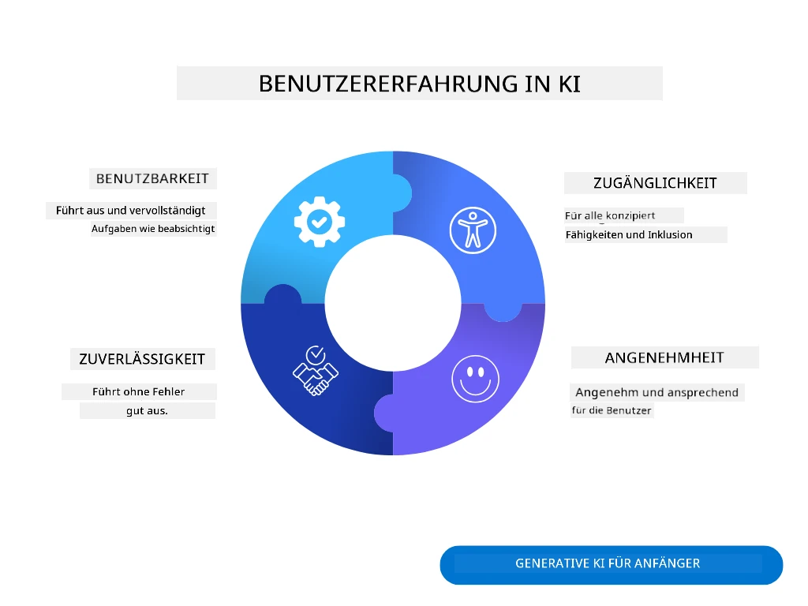
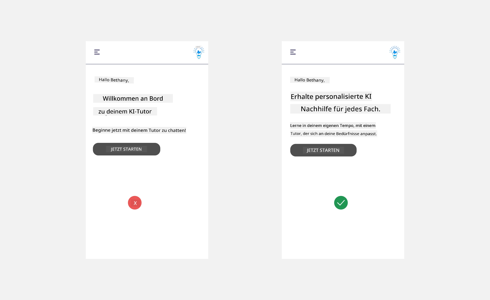
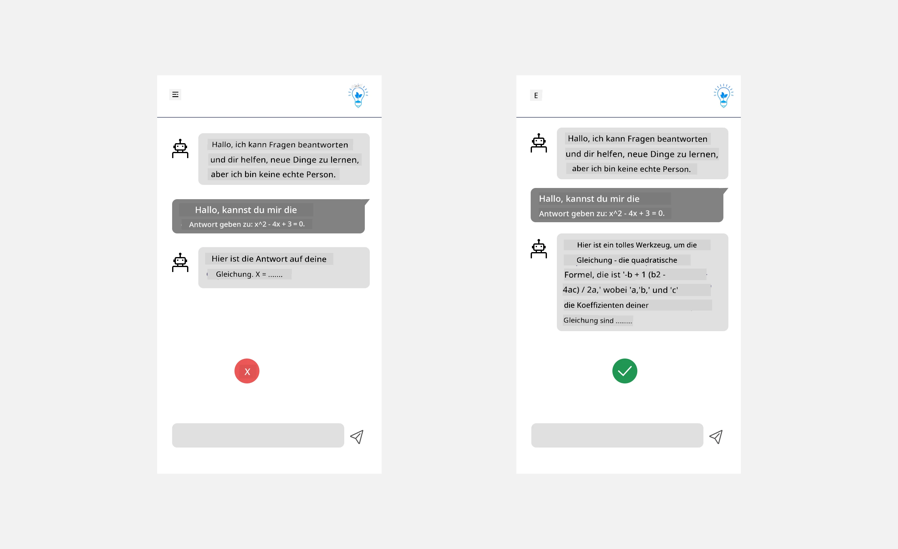
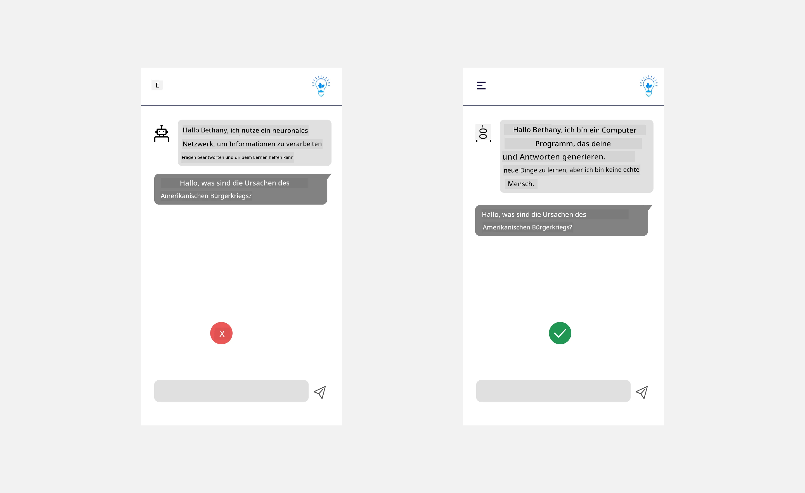
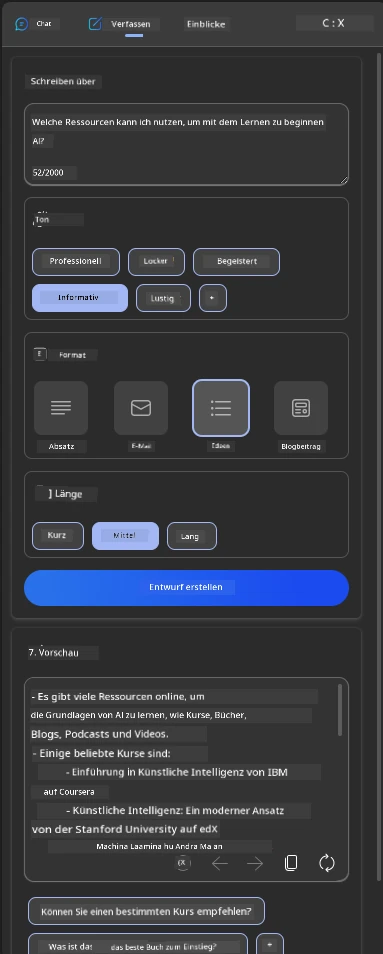
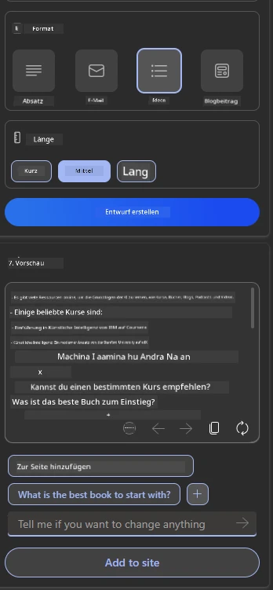

# Gestaltung der Benutzererfahrung (UX) für KI-Anwendungen

> _(Klicken Sie auf das obige Bild, um das Video zu dieser Lektion anzusehen)_

Die Benutzererfahrung ist ein sehr wichtiger Aspekt beim Erstellen von Anwendungen. Benutzer müssen Ihre Anwendung effizient nutzen können, um Aufgaben auszuführen. Effizient zu sein ist eine Sache, aber Sie müssen Anwendungen auch so gestalten, dass sie von allen genutzt werden können, um sie _barrierefrei_ zu machen. Dieses Kapitel konzentriert sich auf diesen Bereich, damit Sie hoffentlich eine Anwendung entwerfen, die Menschen nutzen können und wollen.

## Einführung

Die Benutzererfahrung beschreibt, wie ein Benutzer mit einem bestimmten Produkt oder einer Dienstleistung interagiert und diese nutzt, sei es ein System, Werkzeug oder Design. Bei der Entwicklung von KI-Anwendungen konzentrieren sich Entwickler nicht nur darauf, sicherzustellen, dass die Benutzererfahrung effektiv ist, sondern auch ethisch. In dieser Lektion behandeln wir, wie man Künstliche Intelligenz (KI)-Anwendungen entwickelt, die die Bedürfnisse der Nutzer ansprechen.

Die Lektion umfasst die folgenden Bereiche:

- Einführung in Benutzererfahrung und Verstehen der Nutzerbedürfnisse
- Gestaltung von KI-Anwendungen für Vertrauen und Transparenz
- Gestaltung von KI-Anwendungen für Zusammenarbeit und Feedback

## Lernziele

Nach Absolvieren dieser Lektion werden Sie in der Lage sein:

- Zu verstehen, wie KI-Anwendungen entwickelt werden, die den Nutzerbedürfnissen entsprechen.
- KI-Anwendungen zu gestalten, die Vertrauen und Zusammenarbeit fördern.

### Voraussetzung

Nehmen Sie sich Zeit und lesen Sie mehr über [Benutzererfahrung und Design Thinking.](https://learn.microsoft.com/training/modules/ux-design?WT.mc_id=academic-105485-koreyst)

## Einführung in Benutzererfahrung und Verstehen der Nutzerbedürfnisse

In unserem fiktiven Bildungs-Startup haben wir zwei Hauptnutzer: Lehrer und Schüler. Jeder dieser beiden Nutzer hat einzigartige Bedürfnisse. Ein nutzerzentriertes Design stellt den Nutzer in den Vordergrund und sorgt dafür, dass Produkte relevant und nützlich für diejenigen sind, für die sie bestimmt sind.

Die Anwendung sollte **nützlich, zuverlässig, barrierefrei und angenehm** sein, um eine gute Benutzererfahrung zu bieten.

### Gebrauchstauglichkeit

Nützlich zu sein bedeutet, dass die Anwendung Funktionen bietet, die ihrem vorgesehenen Zweck entsprechen, z. B. die Automatisierung des Bewertungsprozesses oder das Erstellen von Karteikarten zur Wiederholung. Eine Anwendung, die den Bewertungsprozess automatisiert, sollte in der Lage sein, die Arbeiten der Schüler auf Grundlage vordefinierter Kriterien genau und effizient zu bewerten. Ebenso sollte eine Anwendung, die Karteikarten zur Wiederholung erstellt, relevante und vielfältige Fragen basierend auf ihren Daten generieren können.

### Zuverlässigkeit

Zuverlässig zu sein bedeutet, dass die Anwendung ihre Aufgaben konsistent und fehlerfrei ausführen kann. Allerdings ist KI, genau wie Menschen, nicht perfekt und kann Fehler machen. Die Anwendungen können auf Fehler oder unerwartete Situationen stoßen, die menschliches Eingreifen oder Korrektur erfordern. Wie gehen Sie mit Fehlern um? Im letzten Abschnitt dieser Lektion behandeln wir, wie KI-Systeme und -Anwendungen für Zusammenarbeit und Feedback gestaltet werden.

### Barrierefreiheit

Barrierefrei zu sein bedeutet, die Benutzererfahrung auf Nutzer mit unterschiedlichen Fähigkeiten auszuweiten, einschließlich Menschen mit Behinderungen, damit niemand ausgeschlossen wird. Durch das Befolgen von Richtlinien und Prinzipien zur Barrierefreiheit werden KI-Lösungen inklusiver, benutzbarer und für alle Nutzer vorteilhafter.

### Angenehm

Angenehm zu sein bedeutet, dass die Anwendung Spaß macht zu benutzen. Eine ansprechende Benutzererfahrung kann sich positiv auf den Nutzer auswirken, ihn motivieren, zur Anwendung zurückzukehren und so den Geschäftserfolg steigern.

Nicht jede Herausforderung lässt sich mit KI lösen. KI kommt ins Spiel, um Ihre Benutzererfahrung zu ergänzen, sei es durch Automatisierung manueller Aufgaben oder Personalisierung von Benutzererfahrungen.

## Gestaltung von KI-Anwendungen für Vertrauen und Transparenz

Vertrauen aufzubauen ist entscheidend bei der Gestaltung von KI-Anwendungen. Vertrauen sorgt dafür, dass ein Nutzer sicher ist, dass die Anwendung die Arbeit erledigt, konsistent Ergebnisse liefert und diese Ergebnisse den Bedürfnissen des Nutzers entsprechen. Ein Risiko in diesem Bereich ist Misstrauen und übermäßiges Vertrauen. Misstrauen entsteht, wenn ein Nutzer wenig oder gar kein Vertrauen in ein KI-System hat, was dazu führt, dass der Nutzer Ihre Anwendung ablehnt. Übervertrauen entsteht, wenn ein Nutzer die Fähigkeiten eines KI-Systems überschätzt, was dazu führt, dass Nutzer dem KI-System zu sehr vertrauen. Ein Beispiel: Ein automatisiertes Bewertungssystem könnte dazu führen, dass der Lehrer bei zu großem Vertrauen manche Arbeiten nicht mehr überprüft, um sicherzugehen, dass das Bewertungssystem gut funktioniert. Dies könnte zu unfairen oder ungenauen Noten für die Schüler oder verpassten Gelegenheiten für Feedback und Verbesserung führen.

Zwei Wege, um sicherzustellen, dass Vertrauen im Mittelpunkt des Designs steht, sind Erklärbarkeit und Kontrolle.

### Erklärbarkeit

Wenn KI dabei hilft, Entscheidungen zu treffen – wie zum Beispiel Wissen an zukünftige Generationen weiterzugeben – ist es wichtig, dass Lehrer und Eltern verstehen, wie KI-Entscheidungen getroffen werden. Das ist Erklärbarkeit – zu verstehen, wie KI-Anwendungen Entscheidungen fällen. Das Design für Erklärbarkeit umfasst das Hinzufügen von Details, die hervorheben, wie KI zum Ergebnis gekommen ist. Das Publikum muss sich bewusst sein, dass das Ergebnis von einer KI generiert wurde und nicht von einem Menschen. Zum Beispiel statt "Beginnen Sie jetzt mit Ihrem Tutor zu chatten" zu sagen, lieber "Verwenden Sie einen KI-Tutor, der sich an Ihre Bedürfnisse anpasst und Ihnen hilft, in Ihrem Tempo zu lernen."

Ein weiteres Beispiel ist die Nutzung von Nutzer- und personenbezogenen Daten durch KI. Ein Nutzer mit der Persona Schüler könnte bestimmte Einschränkungen haben, die auf dieser Persona basieren. Die KI darf eventuell keine Antworten auf Fragen offenlegen, kann aber dem Nutzer helfen, selbstständig zu überlegen, wie er ein Problem lösen kann.

Ein letzter wesentlicher Teil der Erklärbarkeit ist die Vereinfachung der Erklärungen. Schüler und Lehrer sind möglicherweise keine KI-Experten, deshalb sollten Erklärungen darüber, was die Anwendung kann oder nicht kann, vereinfacht und leicht verständlich sein.

### Kontrolle

Generative KI schafft eine Zusammenarbeit zwischen KI und Nutzer, wobei z. B. ein Nutzer Aufforderungen anpassen kann, um unterschiedliche Ergebnisse zu erhalten. Außerdem sollten Nutzer nach der Generierung eines Ergebnisses dieses modifizieren können, um ein Kontrollgefühl zu erhalten. Zum Beispiel können Sie bei der Verwendung von Microsoft Copilot (früher Bing Chat) Ihre Eingabeaufforderung anhand von Format, Ton und Länge anpassen. Außerdem können Sie Änderungen an Ihrem Ergebnis vornehmen und das Ergebnis wie unten gezeigt verändern:

Eine weitere Funktion in Microsoft Copilot, die dem Nutzer Kontrolle über die Anwendung gibt, ist die Möglichkeit, der Nutzung der Daten, die KI verwendet, zuzustimmen oder sie abzulehnen. Für eine Schul-App könnte ein Schüler seine eigenen Notizen sowie die Materialen der Lehrer als Lernmaterial nutzen wollen.

> Beim Entwerfen von KI-Anwendungen ist Absichtlichkeit entscheidend, um zu gewährleisten, dass Nutzer nicht übermäßig vertrauen und unrealistische Erwartungen an die Fähigkeiten der KI haben. Ein Weg, dies zu erreichen, ist das Einbringen von Reibung zwischen Eingaben und Ergebnissen. Den Nutzer daran zu erinnern, dass dies KI und kein Mensch ist.

## Gestaltung von KI-Anwendungen für Zusammenarbeit und Feedback

Wie bereits erwähnt, schafft generative KI eine Zusammenarbeit zwischen Nutzer und KI. Die meisten Interaktionen bestehen darin, dass ein Nutzer eine Eingabeaufforderung gibt und die KI ein Ergebnis generiert. Was passiert, wenn das Ergebnis falsch ist? Wie geht die Anwendung mit Fehlern um, falls sie auftreten? Gibt die KI dem Nutzer die Schuld oder nimmt sie sich Zeit, den Fehler zu erklären?

KI-Anwendungen sollten so gestaltet sein, dass sie Feedback erhalten und geben können. Das hilft nicht nur dem KI-System, sich zu verbessern, sondern baut auch Vertrauen bei den Nutzern auf. Eine Feedback-Schleife sollte in das Design integriert sein, zum Beispiel ein einfaches Daumen-hoch oder Daumen-runter für das Ergebnis.

Eine weitere Möglichkeit, damit umzugehen, ist es, die Fähigkeiten und Grenzen des Systems klar zu kommunizieren. Wenn ein Nutzer einen Fehler macht und etwas anfordert, das über die Fähigkeiten der KI hinausgeht, sollte es auch eine Möglichkeit geben, damit umzugehen, wie im Folgenden gezeigt.

Systemfehler sind bei Anwendungen üblich, bei denen der Nutzer möglicherweise Unterstützung mit Informationen außerhalb des KI-Fokus benötigt oder die Anwendung eine Begrenzung hat, wie viele Fragen/Fächer ein Nutzer zusammengefasst bekommen kann. Beispielsweise kann es sein, dass eine KI-Anwendung, die mit Daten zu begrenzten Themen wie Geschichte und Mathematik trainiert wurde, Fragen zur Geografie nicht bearbeiten kann. Um dem entgegenzuwirken, kann das KI-System eine Antwort geben wie: "Entschuldigung, unser Produkt wurde mit Daten zu den folgenden Fächern trainiert….., ich kann Ihre Frage leider nicht beantworten."

KI-Anwendungen sind nicht perfekt, daher werden sie Fehler machen. Beim Entwerfen Ihrer Anwendungen sollten Sie sicherstellen, dass Sie Raum für Nutzerfeedback und Fehlerbehandlung schaffen, die einfach und leicht erklärbar ist.

## Aufgabe

Nehmen Sie jede KI-Anwendung, die Sie bisher gebaut haben, und überlegen Sie, wie Sie die folgenden Schritte in Ihre Anwendung integrieren können:

- **Angenehm:** Überlegen Sie, wie Sie Ihre Anwendung angenehmer gestalten können. Fügen Sie Sie Erklärungen überall ein? Motivieren Sie den Nutzer zu explorieren? Wie formulieren Sie Ihre Fehlermeldungen?

- **Gebrauchstauglichkeit:** Bauen Sie eine Web-App. Stellen Sie sicher, dass Ihre Anwendung sowohl mit Maus als auch mit Tastatur navigierbar ist.

- **Vertrauen und Transparenz:** Vertrauen Sie der KI und ihren Ergebnissen nicht vollständig. Überlegen und implementieren Sie, wie ein Mensch den Output überprüfen kann. Ebenso überlegen und implementieren Sie weitere Wege, um Vertrauen und Transparenz zu erreichen.

- **Kontrolle:** Geben Sie dem Nutzer Kontrolle über die Daten, die er der Anwendung bereitstellt. Implementieren Sie eine Möglichkeit, dass Nutzer der Datensammlung in der KI-Anwendung zustimmen oder sie ablehnen können.

<!-- ## [Post-lecture quiz](../../../12-designing-ux-for-ai-applications/quiz-url) -->

## Setzen Sie Ihr Lernen fort!

Nach Abschluss dieser Lektion schauen Sie sich unsere [Generative KI Lernsammlung](https://aka.ms/genai-collection?WT.mc_id=academic-105485-koreyst) an, um Ihr Wissen zu Generativer KI weiter zu vertiefen!

Gehen Sie zu Lektion 13, in der wir uns damit befassen, wie man [KI-Anwendungen sichert](../13-securing-ai-applications/README.md?WT.mc_id=academic-105485-koreyst)!

---

<!-- CO-OP TRANSLATOR DISCLAIMER START -->
**Haftungsausschluss**:
Dieses Dokument wurde mit dem KI-Übersetzungsdienst [Co-op Translator](https://github.com/Azure/co-op-translator) übersetzt. Obwohl wir uns um Genauigkeit bemühen, beachten Sie bitte, dass automatisierte Übersetzungen Fehler oder Ungenauigkeiten enthalten können. Das Originaldokument in seiner Ursprungssprache gilt als maßgebliche Quelle. Bei kritischen Informationen wird eine professionelle menschliche Übersetzung empfohlen. Wir übernehmen keine Haftung für Missverständnisse oder Fehlinterpretationen, die aus der Verwendung dieser Übersetzung entstehen.
<!-- CO-OP TRANSLATOR DISCLAIMER END -->