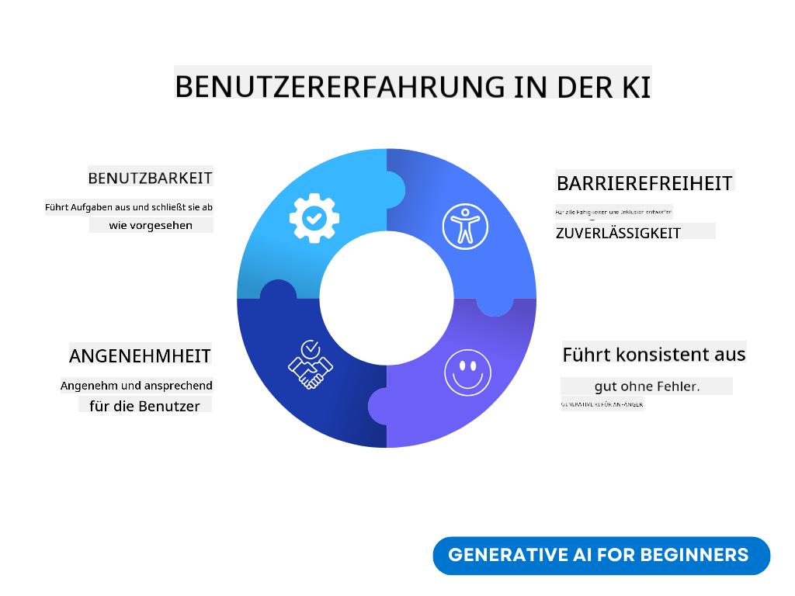
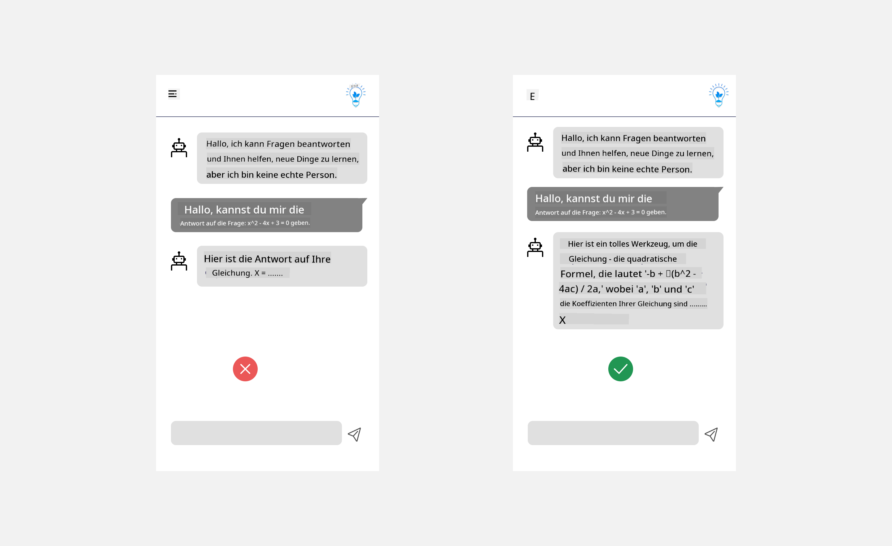
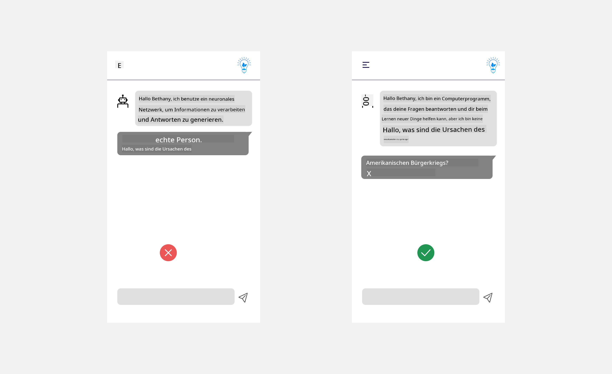
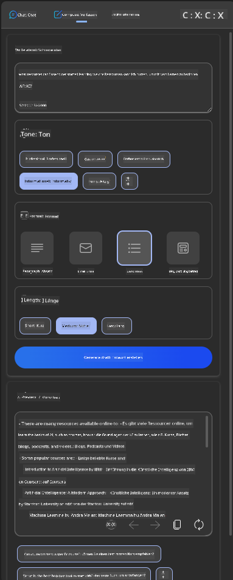
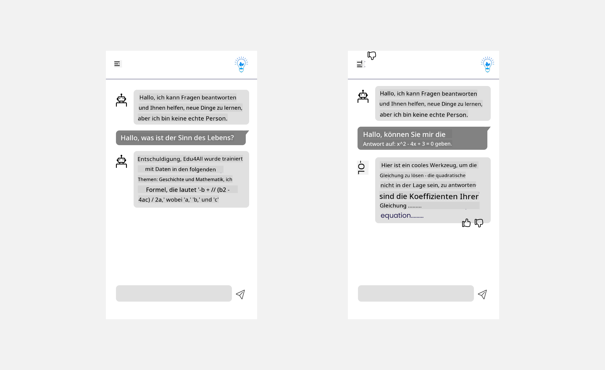

<!--
CO_OP_TRANSLATOR_METADATA:
{
  "original_hash": "ec385b41ee50579025d50cc03bfb3a25",
  "translation_date": "2025-06-25T20:09:26+00:00",
  "source_file": "12-designing-ux-for-ai-applications/README.md",
  "language_code": "de"
}
-->
# Gestaltung der Benutzererfahrung für KI-Anwendungen

> _(Klicken Sie auf das Bild oben, um das Video zu dieser Lektion anzusehen)_

Die Benutzererfahrung ist ein sehr wichtiger Aspekt beim Erstellen von Apps. Benutzer müssen in der Lage sein, Ihre App effizient zu nutzen, um Aufgaben zu erledigen. Effizient zu sein ist das eine, aber Sie müssen auch Apps so gestalten, dass sie von allen genutzt werden können, um sie _zugänglich_ zu machen. Dieses Kapitel konzentriert sich auf diesen Bereich, damit Sie hoffentlich eine App gestalten, die Menschen nutzen können und wollen.

## Einführung

Die Benutzererfahrung beschreibt, wie ein Benutzer mit einem bestimmten Produkt oder Dienst interagiert und es nutzt, sei es ein System, Werkzeug oder Design. Bei der Entwicklung von KI-Anwendungen konzentrieren sich Entwickler nicht nur darauf, sicherzustellen, dass die Benutzererfahrung effektiv ist, sondern auch ethisch. In dieser Lektion behandeln wir, wie man Anwendungen der Künstlichen Intelligenz (KI) entwickelt, die auf die Bedürfnisse der Benutzer eingehen.

Die Lektion behandelt folgende Bereiche:

- Einführung in die Benutzererfahrung und Verständnis der Benutzerbedürfnisse
- Gestaltung von KI-Anwendungen für Vertrauen und Transparenz
- Gestaltung von KI-Anwendungen für Zusammenarbeit und Feedback

## Lernziele

Nach dieser Lektion werden Sie in der Lage sein:

- Verstehen, wie man KI-Anwendungen entwickelt, die den Benutzerbedürfnissen gerecht werden.
- KI-Anwendungen gestalten, die Vertrauen und Zusammenarbeit fördern.

### Voraussetzungen

Nehmen Sie sich Zeit und lesen Sie mehr über [Benutzererfahrung und Design Thinking.](https://learn.microsoft.com/training/modules/ux-design?WT.mc_id=academic-105485-koreyst)

## Einführung in die Benutzererfahrung und Verständnis der Benutzerbedürfnisse

In unserem fiktiven Bildungs-Startup haben wir zwei Hauptnutzer, Lehrer und Schüler. Jeder der beiden Nutzer hat einzigartige Bedürfnisse. Ein nutzerzentriertes Design priorisiert den Benutzer und stellt sicher, dass die Produkte relevant und nützlich für diejenigen sind, für die sie bestimmt sind.

Die Anwendung sollte **nützlich, zuverlässig, zugänglich und angenehm** sein, um eine gute Benutzererfahrung zu bieten.

### Benutzerfreundlichkeit

Nützlich zu sein bedeutet, dass die Anwendung über Funktionen verfügt, die ihrem beabsichtigten Zweck entsprechen, wie zum Beispiel die Automatisierung des Bewertungsprozesses oder die Erstellung von Lernkarten für die Wiederholung. Eine Anwendung, die den Bewertungsprozess automatisiert, sollte in der Lage sein, Schülerarbeiten genau und effizient anhand vordefinierter Kriterien zu bewerten. Ebenso sollte eine Anwendung, die Lernkarten für die Wiederholung erstellt, relevante und vielfältige Fragen basierend auf ihren Daten generieren können.

### Zuverlässigkeit

Zuverlässig zu sein bedeutet, dass die Anwendung ihre Aufgabe konsistent und fehlerfrei ausführen kann. Allerdings ist KI, genau wie Menschen, nicht perfekt und kann anfällig für Fehler sein. Die Anwendungen können auf Fehler oder unerwartete Situationen stoßen, die menschliches Eingreifen oder Korrektur erfordern. Wie gehen Sie mit Fehlern um? Im letzten Abschnitt dieser Lektion werden wir behandeln, wie KI-Systeme und -Anwendungen für Zusammenarbeit und Feedback gestaltet werden.

### Zugänglichkeit

Zugänglich zu sein bedeutet, die Benutzererfahrung auf Benutzer mit unterschiedlichen Fähigkeiten, einschließlich Menschen mit Behinderungen, auszuweiten und sicherzustellen, dass niemand ausgeschlossen wird. Durch das Befolgen von Zugänglichkeitsrichtlinien und -prinzipien werden KI-Lösungen inklusiver, benutzbarer und nützlicher für alle Benutzer.

### Angenehm

Angenehm zu sein bedeutet, dass die Anwendung Spaß macht zu nutzen. Eine ansprechende Benutzererfahrung kann einen positiven Einfluss auf den Benutzer haben und ihn dazu ermutigen, zur Anwendung zurückzukehren, was den Geschäftserfolg steigern kann.

Nicht jede Herausforderung kann mit KI gelöst werden. KI kommt ins Spiel, um Ihre Benutzererfahrung zu erweitern, sei es durch die Automatisierung manueller Aufgaben oder die Personalisierung von Benutzererlebnissen.

## Gestaltung von KI-Anwendungen für Vertrauen und Transparenz

Vertrauen aufzubauen ist entscheidend bei der Gestaltung von KI-Anwendungen. Vertrauen stellt sicher, dass ein Benutzer zuversichtlich ist, dass die Anwendung die Arbeit erledigt, konsistent Ergebnisse liefert und die Ergebnisse das sind, was der Benutzer benötigt. Ein Risiko in diesem Bereich ist Misstrauen und Übervertrauen. Misstrauen tritt auf, wenn ein Benutzer wenig oder kein Vertrauen in ein KI-System hat, was dazu führt, dass der Benutzer Ihre Anwendung ablehnt. Übervertrauen tritt auf, wenn ein Benutzer die Fähigkeiten eines KI-Systems überschätzt und den KI-Systemen zu viel vertraut. Ein Beispiel dafür ist ein automatisiertes Bewertungssystem, das bei Übervertrauen dazu führen könnte, dass der Lehrer einige der Arbeiten nicht überprüft, um sicherzustellen, dass das Bewertungssystem gut funktioniert. Dies könnte zu unfairen oder ungenauen Noten für die Schüler führen oder zu verpassten Gelegenheiten für Feedback und Verbesserung.

Zwei Möglichkeiten, um sicherzustellen, dass Vertrauen im Mittelpunkt des Designs steht, sind Erklärbarkeit und Kontrolle.

### Erklärbarkeit

Wenn KI hilft, Entscheidungen zu treffen, wie zum Beispiel Wissen an zukünftige Generationen weiterzugeben, ist es entscheidend, dass Lehrer und Eltern verstehen, wie KI-Entscheidungen getroffen werden. Dies ist Erklärbarkeit - das Verständnis, wie KI-Anwendungen Entscheidungen treffen. Das Design für Erklärbarkeit umfasst das Hinzufügen von Details zu Beispielen dessen, was eine KI-Anwendung tun kann. Zum Beispiel könnte das System anstelle von "Mit KI-Lehrer starten" verwenden: "Fassen Sie Ihre Notizen für eine einfachere Wiederholung mit KI zusammen."

Ein weiteres Beispiel ist, wie KI Benutzer- und persönliche Daten verwendet. Zum Beispiel kann ein Benutzer mit der Persona "Schüler" Einschränkungen basierend auf seiner Persona haben. Die KI kann möglicherweise keine Antworten auf Fragen offenbaren, kann jedoch dem Benutzer helfen, darüber nachzudenken, wie er ein Problem lösen kann.

Ein letzter wichtiger Teil der Erklärbarkeit ist die Vereinfachung von Erklärungen. Schüler und Lehrer sind möglicherweise keine KI-Experten, daher sollten Erklärungen dessen, was die Anwendung kann oder nicht kann, vereinfacht und leicht verständlich sein.

### Kontrolle

Generative KI schafft eine Zusammenarbeit zwischen KI und dem Benutzer, bei der der Benutzer beispielsweise Eingaben für unterschiedliche Ergebnisse modifizieren kann. Sobald ein Output generiert wird, sollten Benutzer in der Lage sein, die Ergebnisse zu ändern, was ihnen ein Gefühl von Kontrolle gibt. Zum Beispiel können Sie bei der Nutzung von Bing Ihre Eingaben basierend auf Format, Ton und Länge anpassen. Darüber hinaus können Sie Änderungen an Ihrem Output vornehmen und den Output wie unten gezeigt modifizieren:

Ein weiteres Feature in Bing, das einem Benutzer Kontrolle über die Anwendung gibt, ist die Möglichkeit, sich für die von der KI verwendeten Daten an- oder abzumelden. Für eine Schul-Anwendung möchte ein Schüler möglicherweise seine Notizen sowie die Ressourcen des Lehrers als Lernmaterial verwenden.

> Beim Design von KI-Anwendungen ist es wichtig, sicherzustellen, dass Benutzer nicht übermäßig vertrauen und unrealistische Erwartungen an die Fähigkeiten der KI setzen. Eine Möglichkeit, dies zu erreichen, besteht darin, Reibung zwischen den Eingaben und den Ergebnissen zu erzeugen und den Benutzer daran zu erinnern, dass es sich um KI und nicht um einen Mitmenschen handelt.

## Gestaltung von KI-Anwendungen für Zusammenarbeit und Feedback

Wie bereits erwähnt, schafft generative KI eine Zusammenarbeit zwischen dem Benutzer und der KI. Die meisten Interaktionen bestehen darin, dass ein Benutzer eine Eingabe macht und die KI einen Output generiert. Was passiert, wenn der Output falsch ist? Wie geht die Anwendung mit Fehlern um, wenn sie auftreten? Gibt die KI dem Benutzer die Schuld oder nimmt sie sich Zeit, um den Fehler zu erklären?

KI-Anwendungen sollten so gestaltet sein, dass sie Feedback empfangen und geben. Dies hilft nicht nur dem KI-System, sich zu verbessern, sondern baut auch Vertrauen bei den Benutzern auf. Eine Feedback-Schleife sollte im Design enthalten sein, ein Beispiel könnte ein einfaches Daumen-hoch oder Daumen-runter für den Output sein.

Eine weitere Möglichkeit, dies zu handhaben, besteht darin, die Fähigkeiten und Einschränkungen des Systems klar zu kommunizieren. Wenn ein Benutzer einen Fehler macht und etwas außerhalb der Fähigkeiten der KI anfordert, sollte es auch eine Möglichkeit geben, dies zu handhaben, wie unten gezeigt.

Systemfehler sind bei Anwendungen üblich, bei denen der Benutzer möglicherweise Hilfe mit Informationen außerhalb des Anwendungsbereichs der KI benötigt oder die Anwendung ein Limit hat, wie viele Fragen/Fächer ein Benutzer Zusammenfassungen erstellen kann. Zum Beispiel kann eine KI-Anwendung, die mit Daten zu begrenzten Fächern wie Geschichte und Mathematik trainiert wurde, möglicherweise keine Fragen zu Geografie bearbeiten. Um dies zu entschärfen, kann das KI-System eine Antwort wie: "Entschuldigung, unser Produkt wurde mit Daten zu den folgenden Fächern trainiert....., ich kann die Frage, die Sie gestellt haben, nicht beantworten."

KI-Anwendungen sind nicht perfekt, daher sind sie dazu bestimmt, Fehler zu machen. Beim Design Ihrer Anwendungen sollten Sie sicherstellen, dass Sie Raum für Feedback von Benutzern schaffen und Fehler auf eine Weise handhaben, die einfach und leicht verständlich ist.

## Aufgabe

Nehmen Sie eine beliebige KI-App, die Sie bisher erstellt haben, und überlegen Sie, die folgenden Schritte in Ihrer App umzusetzen:

- **Angenehm:** Überlegen Sie, wie Sie Ihre App angenehmer gestalten können. Fügen Sie überall Erklärungen hinzu? Ermutigen Sie den Benutzer zur Erkundung? Wie formulieren Sie Ihre Fehlermeldungen?

- **Benutzerfreundlichkeit:** Erstellen Sie eine Web-App. Stellen Sie sicher, dass Ihre App sowohl mit Maus als auch mit Tastatur navigierbar ist.

- **Vertrauen und Transparenz:** Vertrauen Sie der KI und ihrem Output nicht vollständig, überlegen Sie, wie Sie einen Menschen in den Prozess einbinden würden, um den Output zu überprüfen. Berücksichtigen und implementieren Sie auch andere Möglichkeiten, Vertrauen und Transparenz zu erreichen.

- **Kontrolle:** Geben Sie dem Benutzer Kontrolle über die Daten, die er der Anwendung bereitstellt. Implementieren Sie eine Möglichkeit, wie ein Benutzer sich für die Datenerfassung in der KI-Anwendung an- oder abmelden kann.

## Setzen Sie Ihr Lernen fort!

Nachdem Sie diese Lektion abgeschlossen haben, schauen Sie sich unsere [Generative AI Learning Collection](https://aka.ms/genai-collection?WT.mc_id=academic-105485-koreyst) an, um Ihr Wissen über generative KI weiter auszubauen!

Gehen Sie weiter zu Lektion 13, wo wir uns ansehen, wie man [KI-Anwendungen sichert](../13-securing-ai-applications/README.md?WT.mc_id=academic-105485-koreyst)!

**Haftungsausschluss**:  
Dieses Dokument wurde mit dem KI-Übersetzungsdienst [Co-op Translator](https://github.com/Azure/co-op-translator) übersetzt. Obwohl wir uns um Genauigkeit bemühen, beachten Sie bitte, dass automatisierte Übersetzungen Fehler oder Ungenauigkeiten enthalten können. Das Originaldokument in seiner ursprünglichen Sprache sollte als maßgebliche Quelle betrachtet werden. Für kritische Informationen wird eine professionelle menschliche Übersetzung empfohlen. Wir haften nicht für Missverständnisse oder Fehlinterpretationen, die sich aus der Nutzung dieser Übersetzung ergeben.