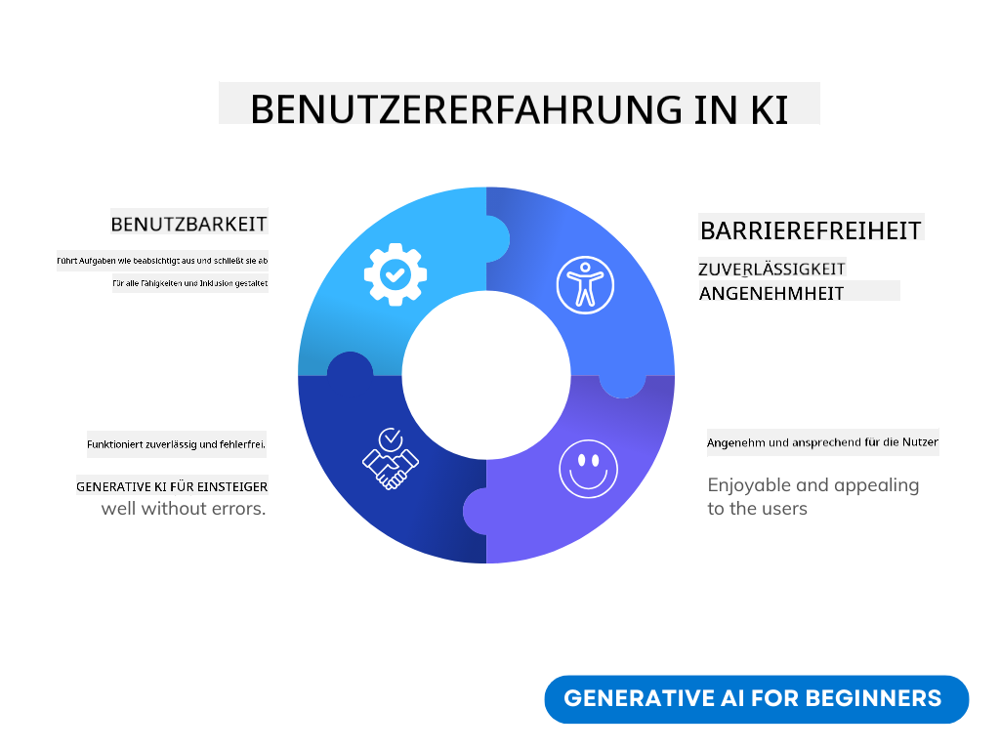
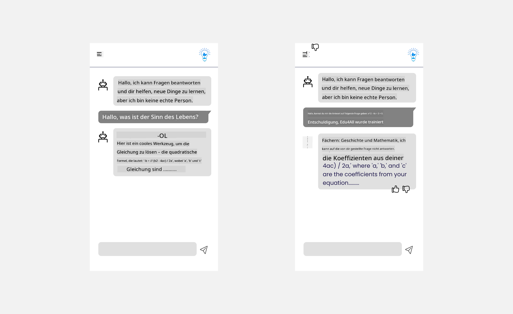

<!--
CO_OP_TRANSLATOR_METADATA:
{
  "original_hash": "78bbeed50fd4dc9fdee931f5daf98cb3",
  "translation_date": "2025-10-17T22:53:42+00:00",
  "source_file": "12-designing-ux-for-ai-applications/README.md",
  "language_code": "de"
}
-->
# Gestaltung der Benutzererfahrung für KI-Anwendungen

> _(Klicken Sie auf das obige Bild, um das Video zu dieser Lektion anzusehen)_

Die Benutzererfahrung ist ein sehr wichtiger Aspekt beim Erstellen von Apps. Benutzer müssen in der Lage sein, Ihre App effizient zu nutzen, um Aufgaben zu erledigen. Effizienz ist eine Sache, aber Sie müssen Apps auch so gestalten, dass sie von allen genutzt werden können, um sie _zugänglich_ zu machen. Dieses Kapitel konzentriert sich auf diesen Bereich, damit Sie hoffentlich eine App entwerfen, die Menschen nutzen können und wollen.

## Einführung

Die Benutzererfahrung beschreibt, wie ein Benutzer mit einem bestimmten Produkt oder einer Dienstleistung interagiert und diese nutzt, sei es ein System, ein Werkzeug oder ein Design. Bei der Entwicklung von KI-Anwendungen konzentrieren sich Entwickler nicht nur darauf, die Benutzererfahrung effektiv zu gestalten, sondern auch ethisch. In dieser Lektion behandeln wir, wie man Anwendungen der Künstlichen Intelligenz (KI) entwickelt, die die Bedürfnisse der Benutzer erfüllen.

Die Lektion behandelt die folgenden Bereiche:

- Einführung in die Benutzererfahrung und das Verständnis der Benutzerbedürfnisse
- Gestaltung von KI-Anwendungen für Vertrauen und Transparenz
- Gestaltung von KI-Anwendungen für Zusammenarbeit und Feedback

## Lernziele

Nach Abschluss dieser Lektion können Sie:

- Verstehen, wie man KI-Anwendungen entwickelt, die die Bedürfnisse der Benutzer erfüllen.
- KI-Anwendungen entwerfen, die Vertrauen und Zusammenarbeit fördern.

### Voraussetzung

Nehmen Sie sich Zeit und lesen Sie mehr über [Benutzererfahrung und Design Thinking.](https://learn.microsoft.com/training/modules/ux-design?WT.mc_id=academic-105485-koreyst)

## Einführung in die Benutzererfahrung und das Verständnis der Benutzerbedürfnisse

In unserem fiktiven Bildungs-Startup haben wir zwei Hauptbenutzer: Lehrer und Schüler. Jeder der beiden Benutzer hat einzigartige Bedürfnisse. Ein benutzerzentriertes Design priorisiert den Benutzer und stellt sicher, dass die Produkte relevant und nützlich für diejenigen sind, für die sie gedacht sind.

Die Anwendung sollte **nützlich, zuverlässig, zugänglich und angenehm** sein, um eine gute Benutzererfahrung zu bieten.

### Benutzerfreundlichkeit

Nützlich zu sein bedeutet, dass die Anwendung Funktionen hat, die ihrem vorgesehenen Zweck entsprechen, wie z. B. die Automatisierung des Bewertungsprozesses oder das Erstellen von Lernkarten für die Wiederholung. Eine Anwendung, die den Bewertungsprozess automatisiert, sollte in der Lage sein, Schülerarbeiten basierend auf vordefinierten Kriterien genau und effizient zu bewerten. Ebenso sollte eine Anwendung, die Lernkarten erstellt, relevante und vielfältige Fragen basierend auf ihren Daten generieren können.

### Zuverlässigkeit

Zuverlässig zu sein bedeutet, dass die Anwendung ihre Aufgabe konsistent und fehlerfrei ausführen kann. Allerdings ist KI, wie Menschen, nicht perfekt und kann anfällig für Fehler sein. Die Anwendungen können auf Fehler oder unerwartete Situationen stoßen, die menschliches Eingreifen oder Korrekturen erfordern. Wie gehen Sie mit Fehlern um? Im letzten Abschnitt dieser Lektion werden wir behandeln, wie KI-Systeme und -Anwendungen für Zusammenarbeit und Feedback gestaltet werden.

### Zugänglichkeit

Zugänglich zu sein bedeutet, die Benutzererfahrung auf Benutzer mit unterschiedlichen Fähigkeiten, einschließlich Menschen mit Behinderungen, auszudehnen, um sicherzustellen, dass niemand ausgeschlossen wird. Durch die Einhaltung von Richtlinien und Prinzipien zur Barrierefreiheit werden KI-Lösungen inklusiver, benutzerfreundlicher und nützlicher für alle Benutzer.

### Angenehm

Angenehm zu sein bedeutet, dass die Anwendung Spaß macht und gerne genutzt wird. Eine ansprechende Benutzererfahrung kann sich positiv auf den Benutzer auswirken, ihn dazu ermutigen, zur Anwendung zurückzukehren, und den Geschäftserfolg steigern.

Nicht jede Herausforderung kann mit KI gelöst werden. KI kommt ins Spiel, um Ihre Benutzererfahrung zu verbessern, sei es durch die Automatisierung manueller Aufgaben oder die Personalisierung von Benutzererfahrungen.

## Gestaltung von KI-Anwendungen für Vertrauen und Transparenz

Vertrauen aufzubauen ist entscheidend beim Entwerfen von KI-Anwendungen. Vertrauen stellt sicher, dass ein Benutzer darauf vertraut, dass die Anwendung die Arbeit erledigt, konsistente Ergebnisse liefert und die Ergebnisse den Bedürfnissen des Benutzers entsprechen. Ein Risiko in diesem Bereich ist Misstrauen und übermäßiges Vertrauen. Misstrauen tritt auf, wenn ein Benutzer wenig oder kein Vertrauen in ein KI-System hat, was dazu führt, dass der Benutzer Ihre Anwendung ablehnt. Übermäßiges Vertrauen tritt auf, wenn ein Benutzer die Fähigkeiten eines KI-Systems überschätzt und dem KI-System zu viel vertraut. Zum Beispiel könnte ein automatisiertes Bewertungssystem im Falle von übermäßigem Vertrauen dazu führen, dass der Lehrer einige der Arbeiten nicht überprüft, um sicherzustellen, dass das Bewertungssystem korrekt funktioniert. Dies könnte zu unfairen oder ungenauen Noten für die Schüler oder verpassten Gelegenheiten für Feedback und Verbesserung führen.

Zwei Möglichkeiten, um sicherzustellen, dass Vertrauen im Mittelpunkt des Designs steht, sind Erklärbarkeit und Kontrolle.

### Erklärbarkeit

Wenn KI Entscheidungen unterstützt, wie z. B. das Vermitteln von Wissen an zukünftige Generationen, ist es entscheidend, dass Lehrer und Eltern verstehen, wie KI-Entscheidungen getroffen werden. Das ist Erklärbarkeit – das Verständnis, wie KI-Anwendungen Entscheidungen treffen. Das Entwerfen für Erklärbarkeit umfasst das Hinzufügen von Details, die hervorheben, wie KI zu einem Ergebnis gekommen ist. Das Publikum muss sich bewusst sein, dass das Ergebnis von KI und nicht von einem Menschen generiert wurde. Zum Beispiel, anstatt zu sagen: "Beginnen Sie jetzt mit Ihrem Tutor zu chatten", sagen Sie: "Nutzen Sie den KI-Tutor, der sich an Ihre Bedürfnisse anpasst und Ihnen hilft, in Ihrem Tempo zu lernen."

Ein weiteres Beispiel ist, wie KI Benutzer- und persönliche Daten verwendet. Zum Beispiel könnte ein Benutzer mit der Persona "Schüler" Einschränkungen basierend auf seiner Persona haben. Die KI könnte nicht in der Lage sein, Antworten auf Fragen zu geben, aber sie könnte dem Benutzer helfen, darüber nachzudenken, wie er ein Problem lösen kann.

Ein letzter wichtiger Teil der Erklärbarkeit ist die Vereinfachung der Erklärungen. Schüler und Lehrer sind möglicherweise keine KI-Experten, daher sollten die Erklärungen darüber, was die Anwendung kann oder nicht kann, vereinfacht und leicht verständlich sein.

### Kontrolle

Generative KI schafft eine Zusammenarbeit zwischen KI und dem Benutzer, bei der ein Benutzer beispielsweise Eingabeaufforderungen für unterschiedliche Ergebnisse ändern kann. Darüber hinaus sollten Benutzer, sobald ein Ergebnis generiert wurde, die Möglichkeit haben, die Ergebnisse zu ändern, was ihnen ein Gefühl der Kontrolle gibt. Zum Beispiel können Sie bei der Nutzung von Bing Ihre Eingabeaufforderung basierend auf Format, Ton und Länge anpassen. Außerdem können Sie Änderungen an Ihrem Ergebnis vornehmen und es wie unten gezeigt modifizieren:

Eine weitere Funktion in Bing, die es einem Benutzer ermöglicht, Kontrolle über die Anwendung zu haben, ist die Möglichkeit, die Daten, die die KI verwendet, ein- und auszuschalten. Für eine Schul-App könnte ein Schüler beispielsweise seine Notizen sowie die Ressourcen des Lehrers als Lernmaterial verwenden wollen.

> Beim Entwerfen von KI-Anwendungen ist es wichtig, sicherzustellen, dass Benutzer nicht übermäßig vertrauen und unrealistische Erwartungen an die Fähigkeiten der KI haben. Eine Möglichkeit, dies zu erreichen, besteht darin, Reibung zwischen den Eingabeaufforderungen und den Ergebnissen zu schaffen. Erinnern Sie den Benutzer daran, dass dies KI ist und kein anderer Mensch.

## Gestaltung von KI-Anwendungen für Zusammenarbeit und Feedback

Wie bereits erwähnt, schafft generative KI eine Zusammenarbeit zwischen dem Benutzer und der KI. Die meisten Interaktionen bestehen darin, dass ein Benutzer eine Eingabeaufforderung eingibt und die KI ein Ergebnis generiert. Was passiert, wenn das Ergebnis falsch ist? Wie geht die Anwendung mit Fehlern um, wenn sie auftreten? Gibt die KI dem Benutzer die Schuld oder nimmt sich Zeit, den Fehler zu erklären?

KI-Anwendungen sollten so gestaltet sein, dass sie Feedback empfangen und geben können. Dies hilft nicht nur dem KI-System, sich zu verbessern, sondern baut auch Vertrauen bei den Benutzern auf. Eine Feedback-Schleife sollte in das Design integriert werden, ein Beispiel könnte ein einfacher Daumen hoch oder runter für das Ergebnis sein.

Eine weitere Möglichkeit, dies zu handhaben, besteht darin, die Fähigkeiten und Grenzen des Systems klar zu kommunizieren. Wenn ein Benutzer einen Fehler macht, indem er etwas außerhalb der Fähigkeiten der KI anfordert, sollte es auch eine Möglichkeit geben, dies zu handhaben, wie unten gezeigt.

Systemfehler sind bei Anwendungen häufig, bei denen der Benutzer möglicherweise Hilfe bei Informationen außerhalb des Umfangs der KI benötigt oder die Anwendung eine Begrenzung hat, wie viele Fragen/Fächer ein Benutzer Zusammenfassungen generieren kann. Zum Beispiel könnte eine KI-Anwendung, die mit Daten zu begrenzten Fächern wie Geschichte und Mathematik trainiert wurde, möglicherweise keine Fragen zu Geografie beantworten. Um dies zu mildern, könnte das KI-System eine Antwort wie diese geben: "Entschuldigung, unser Produkt wurde mit Daten zu den folgenden Fächern trainiert....., ich kann die Frage, die Sie gestellt haben, nicht beantworten."

KI-Anwendungen sind nicht perfekt, daher sind sie anfällig für Fehler. Beim Entwerfen Ihrer Anwendungen sollten Sie sicherstellen, dass Sie Raum für Feedback von Benutzern und eine einfache und leicht verständliche Fehlerbehandlung schaffen.

## Aufgabe

Nehmen Sie eine beliebige KI-App, die Sie bisher erstellt haben, und überlegen Sie, wie Sie die folgenden Schritte in Ihrer App umsetzen können:

- **Angenehm:** Überlegen Sie, wie Sie Ihre App angenehmer gestalten können. Fügen Sie überall Erklärungen hinzu? Ermutigen Sie den Benutzer, die App zu erkunden? Wie formulieren Sie Ihre Fehlermeldungen?

- **Benutzerfreundlichkeit:** Erstellen Sie eine Web-App. Stellen Sie sicher, dass Ihre App sowohl mit Maus als auch Tastatur navigierbar ist.

- **Vertrauen und Transparenz:** Vertrauen Sie der KI und ihren Ergebnissen nicht vollständig. Überlegen Sie, wie Sie einen Menschen in den Prozess einbinden könnten, um die Ergebnisse zu überprüfen. Überlegen Sie auch, wie Sie Vertrauen und Transparenz auf andere Weise erreichen können.

- **Kontrolle:** Geben Sie dem Benutzer Kontrolle über die Daten, die er der Anwendung zur Verfügung stellt. Implementieren Sie eine Möglichkeit, wie ein Benutzer die Datenerfassung in der KI-Anwendung aktivieren und deaktivieren kann.

<!-- ## [Quiz nach der Vorlesung](../../../12-designing-ux-for-ai-applications/quiz-url) -->

## Setzen Sie Ihr Lernen fort!

Nachdem Sie diese Lektion abgeschlossen haben, schauen Sie sich unsere [Generative AI Learning Collection](https://aka.ms/genai-collection?WT.mc_id=academic-105485-koreyst) an, um Ihr Wissen über generative KI weiter auszubauen!

Gehen Sie zu Lektion 13, in der wir uns mit dem Thema [Sicherung von KI-Anwendungen](../13-securing-ai-applications/README.md?WT.mc_id=academic-105485-koreyst) befassen!

---

**Haftungsausschluss**:  
Dieses Dokument wurde mit dem KI-Übersetzungsdienst [Co-op Translator](https://github.com/Azure/co-op-translator) übersetzt. Obwohl wir uns um Genauigkeit bemühen, beachten Sie bitte, dass automatisierte Übersetzungen Fehler oder Ungenauigkeiten enthalten können. Das Originaldokument in seiner ursprünglichen Sprache sollte als maßgebliche Quelle betrachtet werden. Für kritische Informationen wird eine professionelle menschliche Übersetzung empfohlen. Wir übernehmen keine Haftung für Missverständnisse oder Fehlinterpretationen, die sich aus der Nutzung dieser Übersetzung ergeben.