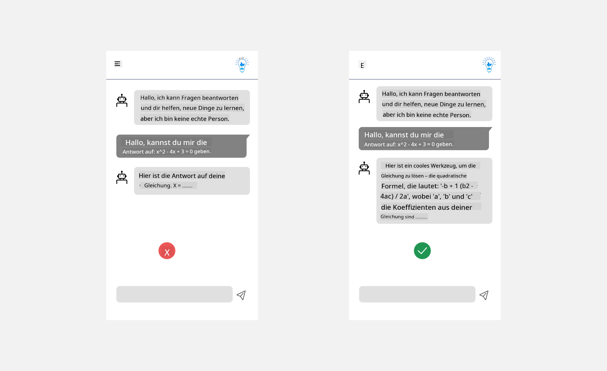
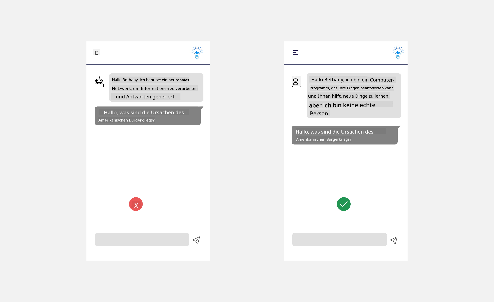

<!--
CO_OP_TRANSLATOR_METADATA:
{
  "original_hash": "ec385b41ee50579025d50cc03bfb3a25",
  "translation_date": "2025-07-09T14:48:47+00:00",
  "source_file": "12-designing-ux-for-ai-applications/README.md",
  "language_code": "de"
}
-->
# Gestaltung der UX für KI-Anwendungen

> _(Klicken Sie auf das Bild oben, um das Video zu dieser Lektion anzusehen)_

Die Benutzererfahrung ist ein sehr wichtiger Aspekt beim Erstellen von Apps. Nutzer müssen Ihre App effizient verwenden können, um Aufgaben zu erledigen. Effizienz ist das eine, aber Sie müssen Apps auch so gestalten, dass sie von allen genutzt werden können, also _barrierefrei_ sind. Dieses Kapitel konzentriert sich auf diesen Bereich, damit Sie hoffentlich eine App entwerfen, die Menschen gerne und problemlos verwenden.

## Einführung

Benutzererfahrung beschreibt, wie ein Nutzer mit einem bestimmten Produkt oder einer Dienstleistung interagiert und diese nutzt – sei es ein System, ein Werkzeug oder ein Design. Bei der Entwicklung von KI-Anwendungen achten Entwickler nicht nur darauf, dass die Benutzererfahrung effektiv ist, sondern auch ethisch. In dieser Lektion behandeln wir, wie man Künstliche Intelligenz (KI)-Anwendungen entwickelt, die auf die Bedürfnisse der Nutzer eingehen.

Die Lektion umfasst folgende Themen:

- Einführung in die Benutzererfahrung und das Verständnis der Nutzerbedürfnisse
- Gestaltung von KI-Anwendungen für Vertrauen und Transparenz
- Gestaltung von KI-Anwendungen für Zusammenarbeit und Feedback

## Lernziele

Nach dieser Lektion können Sie:

- Verstehen, wie man KI-Anwendungen entwickelt, die den Bedürfnissen der Nutzer entsprechen.
- KI-Anwendungen gestalten, die Vertrauen und Zusammenarbeit fördern.

### Voraussetzungen

Nehmen Sie sich Zeit und lesen Sie mehr über [Benutzererfahrung und Design Thinking.](https://learn.microsoft.com/training/modules/ux-design?WT.mc_id=academic-105485-koreyst)

## Einführung in die Benutzererfahrung und das Verständnis der Nutzerbedürfnisse

In unserem fiktiven Bildungs-Startup haben wir zwei Hauptnutzergruppen: Lehrkräfte und Schüler*innen. Jede dieser Gruppen hat unterschiedliche Bedürfnisse. Ein nutzerzentriertes Design stellt den Nutzer in den Mittelpunkt, um sicherzustellen, dass die Produkte relevant und nützlich für die Zielgruppe sind.

Die Anwendung sollte **nützlich, zuverlässig, barrierefrei und angenehm** sein, um eine gute Benutzererfahrung zu bieten.

### Benutzerfreundlichkeit

Nützlich zu sein bedeutet, dass die Anwendung Funktionen bietet, die ihrem Zweck entsprechen, wie z. B. die Automatisierung des Bewertungsprozesses oder das Erstellen von Lernkarten zur Wiederholung. Eine Anwendung, die den Bewertungsprozess automatisiert, sollte in der Lage sein, die Arbeiten der Schüler*innen anhand vordefinierter Kriterien genau und effizient zu bewerten. Ebenso sollte eine Anwendung, die Lernkarten generiert, relevante und vielfältige Fragen basierend auf ihren Daten erstellen können.

### Zuverlässigkeit

Zuverlässig zu sein bedeutet, dass die Anwendung ihre Aufgaben konsistent und fehlerfrei ausführt. Allerdings ist KI, wie Menschen auch, nicht perfekt und kann Fehler machen. Die Anwendungen können auf Fehler oder unerwartete Situationen stoßen, die menschliches Eingreifen oder Korrekturen erfordern. Wie gehen Sie mit Fehlern um? Im letzten Abschnitt dieser Lektion behandeln wir, wie KI-Systeme und Anwendungen für Zusammenarbeit und Feedback gestaltet werden.

### Barrierefreiheit

Barrierefreiheit bedeutet, die Benutzererfahrung auf Nutzer mit unterschiedlichen Fähigkeiten auszudehnen, einschließlich Menschen mit Behinderungen, damit niemand ausgeschlossen wird. Durch die Einhaltung von Barrierefreiheitsrichtlinien und -prinzipien werden KI-Lösungen inklusiver, nutzbarer und für alle Nutzer vorteilhafter.

### Angenehm

Angenehm zu sein bedeutet, dass die Anwendung Spaß macht und gerne genutzt wird. Eine ansprechende Benutzererfahrung kann sich positiv auf die Nutzer auswirken, sie dazu ermutigen, zur Anwendung zurückzukehren, und so den Geschäftserfolg steigern.

Nicht jede Herausforderung lässt sich mit KI lösen. KI ergänzt Ihre Benutzererfahrung, sei es durch Automatisierung manueller Aufgaben oder durch Personalisierung der Nutzererlebnisse.

## Gestaltung von KI-Anwendungen für Vertrauen und Transparenz

Vertrauen aufzubauen ist entscheidend bei der Gestaltung von KI-Anwendungen. Vertrauen sorgt dafür, dass Nutzer sicher sind, dass die Anwendung ihre Aufgaben zuverlässig erledigt, konsistente Ergebnisse liefert und diese Ergebnisse ihren Bedürfnissen entsprechen. Ein Risiko in diesem Bereich ist Misstrauen und Übervertrauen. Misstrauen entsteht, wenn Nutzer wenig oder kein Vertrauen in ein KI-System haben, was dazu führt, dass sie Ihre Anwendung ablehnen. Übervertrauen entsteht, wenn Nutzer die Fähigkeiten eines KI-Systems überschätzen und ihm zu sehr vertrauen. Zum Beispiel könnte ein automatisiertes Bewertungssystem bei Übervertrauen dazu führen, dass Lehrkräfte nicht mehr alle Arbeiten überprüfen, um sicherzustellen, dass das System korrekt bewertet. Das kann zu unfairen oder ungenauen Noten für die Schüler*innen oder verpassten Chancen für Feedback und Verbesserungen führen.

Zwei Wege, um Vertrauen in den Mittelpunkt des Designs zu stellen, sind Erklärbarkeit und Kontrolle.

### Erklärbarkeit

Wenn KI bei Entscheidungen hilft, wie z. B. beim Vermitteln von Wissen an zukünftige Generationen, ist es wichtig, dass Lehrkräfte und Eltern verstehen, wie KI-Entscheidungen getroffen werden. Das ist Erklärbarkeit – das Verständnis, wie KI-Anwendungen Entscheidungen fällen. Design für Erklärbarkeit beinhaltet, Beispiele dafür zu geben, was eine KI-Anwendung leisten kann. Statt „Starten Sie mit AI teacher“ könnte das System z. B. sagen: „Fasse deine Notizen für eine einfachere Wiederholung mit KI zusammen.“

Ein weiteres Beispiel ist, wie KI Nutzerdaten und persönliche Daten verwendet. Ein Nutzer mit der Persona „Schüler“ könnte Einschränkungen basierend auf seiner Persona haben. Die KI darf vielleicht keine Antworten auf Fragen geben, kann aber den Nutzer anleiten, selbst über Lösungen nachzudenken.

Ein letzter wichtiger Teil der Erklärbarkeit ist die Vereinfachung der Erklärungen. Schüler*innen und Lehrkräfte sind möglicherweise keine KI-Experten, daher sollten Erklärungen darüber, was die Anwendung kann oder nicht kann, einfach und verständlich sein.

### Kontrolle

Generative KI schafft eine Zusammenarbeit zwischen KI und Nutzer, bei der Nutzer z. B. Eingabeaufforderungen anpassen können, um unterschiedliche Ergebnisse zu erhalten. Außerdem sollten Nutzer nach der Ausgabe die Möglichkeit haben, die Ergebnisse zu verändern, um ein Gefühl von Kontrolle zu bekommen. Zum Beispiel können Sie bei Bing Ihre Eingabeaufforderung nach Format, Ton und Länge anpassen. Außerdem können Sie Änderungen an der Ausgabe vornehmen, wie unten gezeigt:

Eine weitere Funktion in Bing, die dem Nutzer Kontrolle über die Anwendung gibt, ist die Möglichkeit, der Nutzung der Daten durch die KI zuzustimmen oder sie abzulehnen. In einer Schul-App möchte ein Schüler vielleicht seine eigenen Notizen sowie die Materialien der Lehrkräfte als Lernmaterial verwenden.

> Beim Entwerfen von KI-Anwendungen ist Absichtlichkeit entscheidend, um zu verhindern, dass Nutzer der KI zu sehr vertrauen und unrealistische Erwartungen an ihre Fähigkeiten haben. Ein Weg, dies zu erreichen, ist, Reibung zwischen Eingabeaufforderungen und Ergebnissen zu schaffen. Erinnern Sie die Nutzer daran, dass dies KI ist und kein menschlicher Gesprächspartner.

## Gestaltung von KI-Anwendungen für Zusammenarbeit und Feedback

Wie bereits erwähnt, schafft generative KI eine Zusammenarbeit zwischen Nutzer und KI. Meistens gibt der Nutzer eine Eingabeaufforderung ein und die KI erzeugt eine Ausgabe. Was passiert, wenn die Ausgabe falsch ist? Wie geht die Anwendung mit Fehlern um, falls sie auftreten? Gibt die KI dem Nutzer die Schuld oder erklärt sie den Fehler?

KI-Anwendungen sollten so gestaltet sein, dass sie Feedback empfangen und geben können. Das hilft nicht nur dem KI-System, sich zu verbessern, sondern baut auch Vertrauen bei den Nutzern auf. Eine Feedback-Schleife sollte im Design enthalten sein, zum Beispiel ein einfaches Daumen-hoch- oder Daumen-runter-Symbol für die Ausgabe.

Eine weitere Möglichkeit ist, die Fähigkeiten und Grenzen des Systems klar zu kommunizieren. Wenn ein Nutzer eine Anfrage stellt, die über die Fähigkeiten der KI hinausgeht, sollte es auch eine Möglichkeit geben, damit umzugehen, wie im Folgenden gezeigt.

Systemfehler sind bei Anwendungen häufig, wenn Nutzer Unterstützung bei Informationen benötigen, die außerhalb des KI-Bereichs liegen, oder wenn die Anwendung eine Begrenzung hat, wie viele Fragen/Fächer ein Nutzer zusammenfassen kann. Zum Beispiel kann eine KI-Anwendung, die nur mit Daten zu bestimmten Fächern wie Geschichte und Mathematik trainiert wurde, keine Fragen zu Geografie beantworten. Um dem entgegenzuwirken, kann das KI-System eine Antwort geben wie: „Entschuldigung, unser Produkt wurde mit Daten zu folgenden Fächern trainiert..., ich kann Ihre Frage leider nicht beantworten.“

KI-Anwendungen sind nicht perfekt und werden Fehler machen. Beim Entwerfen Ihrer Anwendungen sollten Sie daher sicherstellen, dass Sie Raum für Nutzerfeedback und Fehlerbehandlung schaffen, die einfach und verständlich sind.

## Aufgabe

Nehmen Sie eine beliebige KI-App, die Sie bisher entwickelt haben, und überlegen Sie, wie Sie die folgenden Schritte in Ihrer App umsetzen können:

- **Angenehm:** Überlegen Sie, wie Sie Ihre App angenehmer gestalten können. Fügen Sie Sie Erklärungen überall hinzu? Ermutigen Sie die Nutzer, die App zu erkunden? Wie formulieren Sie Ihre Fehlermeldungen?

- **Benutzerfreundlichkeit:** Erstellen Sie eine Web-App. Stellen Sie sicher, dass Ihre App sowohl mit Maus als auch mit Tastatur navigierbar ist.

- **Vertrauen und Transparenz:** Vertrauen Sie der KI und ihren Ergebnissen nicht blind. Überlegen Sie, wie Sie einen Menschen in den Prozess einbinden können, um die Ergebnisse zu überprüfen. Denken Sie auch über weitere Möglichkeiten nach, Vertrauen und Transparenz zu fördern, und setzen Sie diese um.

- **Kontrolle:** Geben Sie den Nutzern Kontrolle über die Daten, die sie der Anwendung bereitstellen. Implementieren Sie eine Möglichkeit, dass Nutzer der Datenerfassung zustimmen oder widersprechen können.

## Lernen Sie weiter!

Nach Abschluss dieser Lektion schauen Sie sich unsere [Generative AI Learning collection](https://aka.ms/genai-collection?WT.mc_id=academic-105485-koreyst) an, um Ihr Wissen über Generative KI weiter zu vertiefen!

Gehen Sie zu Lektion 13, in der wir uns ansehen, wie man [KI-Anwendungen sichert](../13-securing-ai-applications/README.md?WT.mc_id=academic-105485-koreyst)!

**Haftungsausschluss**:  
Dieses Dokument wurde mit dem KI-Übersetzungsdienst [Co-op Translator](https://github.com/Azure/co-op-translator) übersetzt. Obwohl wir uns um Genauigkeit bemühen, beachten Sie bitte, dass automatisierte Übersetzungen Fehler oder Ungenauigkeiten enthalten können. Das Originaldokument in seiner Ursprungssprache ist als maßgebliche Quelle zu betrachten. Für wichtige Informationen wird eine professionelle menschliche Übersetzung empfohlen. Wir übernehmen keine Haftung für Missverständnisse oder Fehlinterpretationen, die aus der Nutzung dieser Übersetzung entstehen.