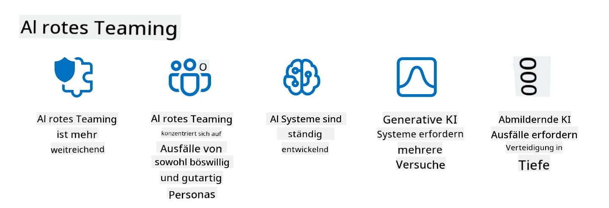

<!--
CO_OP_TRANSLATOR_METADATA:
{
  "original_hash": "f3cac698e9eea47dd563633bd82daf8c",
  "translation_date": "2025-07-09T15:10:20+00:00",
  "source_file": "13-securing-ai-applications/README.md",
  "language_code": "de"
}
-->
# Absicherung Ihrer generativen KI-Anwendungen

## Einführung

Diese Lektion behandelt:

- Sicherheit im Kontext von KI-Systemen.
- Häufige Risiken und Bedrohungen für KI-Systeme.
- Methoden und Überlegungen zur Absicherung von KI-Systemen.

## Lernziele

Nach Abschluss dieser Lektion werden Sie verstehen:

- Die Bedrohungen und Risiken für KI-Systeme.
- Übliche Methoden und Praktiken zur Absicherung von KI-Systemen.
- Wie die Implementierung von Sicherheitstests unerwartete Ergebnisse und Vertrauensverlust bei Nutzern verhindern kann.

## Was bedeutet Sicherheit im Kontext generativer KI?

Da Künstliche Intelligenz (KI) und Maschinelles Lernen (ML) zunehmend unser Leben prägen, ist es entscheidend, nicht nur Kundendaten, sondern auch die KI-Systeme selbst zu schützen. KI/ML werden immer häufiger zur Unterstützung von Entscheidungen mit hohem Wert in Branchen eingesetzt, in denen falsche Entscheidungen schwerwiegende Folgen haben können.

Wichtige Punkte dazu sind:

- **Auswirkungen von KI/ML**: KI/ML haben einen großen Einfluss auf den Alltag, weshalb deren Schutz unerlässlich geworden ist.
- **Sicherheitsherausforderungen**: Diese Auswirkungen erfordern besondere Aufmerksamkeit, um KI-basierte Produkte vor ausgeklügelten Angriffen zu schützen – sei es durch Trolle oder organisierte Gruppen.
- **Strategische Probleme**: Die Tech-Branche muss proaktiv strategische Herausforderungen angehen, um langfristige Kundensicherheit und Datenschutz zu gewährleisten.

Außerdem sind Machine-Learning-Modelle meist nicht in der Lage, zwischen bösartigen Eingaben und harmlosen Anomalien zu unterscheiden. Ein großer Teil der Trainingsdaten stammt aus unkontrollierten, unmoderierten öffentlichen Datensätzen, die von Dritten ergänzt werden können. Angreifer müssen diese Datensätze nicht kompromittieren, wenn sie frei Beiträge leisten können. Im Laufe der Zeit werden Daten mit geringer Vertrauenswürdigkeit, wenn sie korrekt strukturiert und formatiert sind, zu hoch vertrauten Daten.

Deshalb ist es entscheidend, die Integrität und den Schutz der Datenspeicher sicherzustellen, die Ihre Modelle für Entscheidungen nutzen.

## Verständnis der Bedrohungen und Risiken für KI

Im Bereich KI und verwandter Systeme ist Data Poisoning (Datenvergiftung) heute die bedeutendste Sicherheitsbedrohung. Data Poisoning bedeutet, dass jemand absichtlich die Informationen verändert, die zum Training einer KI verwendet werden, um Fehler zu verursachen. Dies liegt an fehlenden standardisierten Erkennungs- und Gegenmaßnahmen sowie der Abhängigkeit von unzuverlässigen oder unkontrollierten öffentlichen Datensätzen. Um die Datenintegrität zu wahren und einen fehlerhaften Trainingsprozess zu verhindern, ist es wichtig, die Herkunft und den Verlauf Ihrer Daten nachzuverfolgen. Andernfalls gilt das alte Sprichwort „Garbage in, garbage out“ – was zu einer beeinträchtigten Modellleistung führt.

Hier einige Beispiele, wie Data Poisoning Ihre Modelle beeinflussen kann:

1. **Label Flipping**: Bei einer binären Klassifikationsaufgabe ändert ein Angreifer absichtlich die Labels eines kleinen Teils der Trainingsdaten. Zum Beispiel werden harmlose Proben als bösartig markiert, sodass das Modell falsche Zusammenhänge lernt.\
   **Beispiel**: Ein Spamfilter klassifiziert legitime E-Mails aufgrund manipulierten Labels fälschlicherweise als Spam.
2. **Feature Poisoning**: Ein Angreifer verändert subtil Merkmale in den Trainingsdaten, um das Modell zu verzerren oder in die Irre zu führen.\
   **Beispiel**: Hinzufügen irrelevanter Schlüsselwörter zu Produktbeschreibungen, um Empfehlungssysteme zu manipulieren.
3. **Data Injection**: Einschleusen bösartiger Daten in den Trainingssatz, um das Verhalten des Modells zu beeinflussen.\
   **Beispiel**: Einfügen gefälschter Nutzerbewertungen, um die Sentiment-Analyse zu verfälschen.
4. **Backdoor-Angriffe**: Ein Angreifer fügt ein verstecktes Muster (Backdoor) in die Trainingsdaten ein. Das Modell lernt, dieses Muster zu erkennen und verhält sich bösartig, wenn es ausgelöst wird.\
   **Beispiel**: Ein Gesichtserkennungssystem, das mit manipulierten Bildern trainiert wurde und eine bestimmte Person falsch identifiziert.

Die MITRE Corporation hat [ATLAS (Adversarial Threat Landscape for Artificial-Intelligence Systems)](https://atlas.mitre.org/?WT.mc_id=academic-105485-koreyst) entwickelt, eine Wissensdatenbank zu Taktiken und Techniken, die Angreifer bei realen Angriffen auf KI-Systeme einsetzen.

> Die Anzahl der Schwachstellen in KI-gestützten Systemen wächst, da die Integration von KI die Angriffsfläche bestehender Systeme über die herkömmlicher Cyberangriffe hinaus erweitert. Wir haben ATLAS entwickelt, um das Bewusstsein für diese einzigartigen und sich entwickelnden Schwachstellen zu erhöhen, da die globale Gemeinschaft KI zunehmend in verschiedene Systeme integriert. ATLAS orientiert sich am MITRE ATT&CK®-Framework, und seine Taktiken, Techniken und Verfahren (TTPs) ergänzen die von ATT&CK.

Ähnlich wie das MITRE ATT&CK®-Framework, das in der traditionellen Cybersicherheit weit verbreitet ist, um fortgeschrittene Bedrohungssimulationen zu planen, bietet ATLAS eine leicht durchsuchbare Sammlung von TTPs, die helfen, aufkommende Angriffe besser zu verstehen und sich darauf vorzubereiten.

Zusätzlich hat das Open Web Application Security Project (OWASP) eine "[Top 10 Liste](https://llmtop10.com/?WT.mc_id=academic-105485-koreyst)" der kritischsten Schwachstellen in Anwendungen mit LLMs erstellt. Die Liste hebt Risiken wie das bereits erwähnte Data Poisoning sowie weitere Bedrohungen hervor, darunter:

- **Prompt Injection**: Eine Technik, bei der Angreifer ein Large Language Model (LLM) durch gezielt gestaltete Eingaben manipulieren, sodass es sich außerhalb seines vorgesehenen Verhaltens verhält.
- **Supply-Chain-Schwachstellen**: Die Komponenten und Software, aus denen Anwendungen für ein LLM bestehen, wie Python-Module oder externe Datensätze, können selbst kompromittiert werden, was zu unerwarteten Ergebnissen, eingeführten Verzerrungen und sogar Schwachstellen in der zugrundeliegenden Infrastruktur führt.
- **Übermäßiges Vertrauen**: LLMs sind fehlbar und neigen dazu, „Halluzinationen“ zu erzeugen, also ungenaue oder unsichere Ergebnisse zu liefern. In mehreren dokumentierten Fällen haben Menschen diese Ergebnisse ungeprüft übernommen, was zu unbeabsichtigten negativen Folgen in der realen Welt führte.

Microsoft Cloud Advocate Rod Trent hat ein kostenloses E-Book geschrieben, [Must Learn AI Security](https://github.com/rod-trent/OpenAISecurity/tree/main/Must_Learn/Book_Version?WT.mc_id=academic-105485-koreyst), das diese und weitere aufkommende KI-Bedrohungen ausführlich behandelt und umfangreiche Empfehlungen gibt, wie man diese Szenarien am besten angeht.

## Sicherheitstests für KI-Systeme und LLMs

Künstliche Intelligenz (KI) verändert viele Bereiche und Branchen und bietet neue Möglichkeiten und Vorteile für die Gesellschaft. Gleichzeitig bringt KI erhebliche Herausforderungen und Risiken mit sich, wie Datenschutz, Verzerrungen, mangelnde Erklärbarkeit und potenziellen Missbrauch. Daher ist es entscheidend, dass KI-Systeme sicher und verantwortungsvoll sind, also ethischen und rechtlichen Standards entsprechen und von Nutzern und Stakeholdern vertrauenswürdig sind.

Sicherheitstests sind der Prozess, die Sicherheit eines KI-Systems oder LLMs zu bewerten, indem deren Schwachstellen identifiziert und ausgenutzt werden. Dies kann von Entwicklern, Nutzern oder unabhängigen Prüfern durchgeführt werden, je nach Zweck und Umfang der Tests. Zu den gängigsten Methoden der Sicherheitstests für KI-Systeme und LLMs gehören:

- **Datenbereinigung**: Der Prozess, sensible oder private Informationen aus Trainingsdaten oder Eingaben eines KI-Systems oder LLMs zu entfernen oder zu anonymisieren. Datenbereinigung hilft, Datenlecks und bösartige Manipulationen zu verhindern, indem die Exposition vertraulicher oder persönlicher Daten reduziert wird.
- **Adversarial Testing**: Das Erzeugen und Anwenden von adversarialen Beispielen auf Eingaben oder Ausgaben eines KI-Systems oder LLMs, um dessen Robustheit und Widerstandsfähigkeit gegen Angriffe zu bewerten. Adversarial Testing hilft, Schwachstellen zu erkennen und zu beheben, die von Angreifern ausgenutzt werden könnten.
- **Modellverifikation**: Der Prozess, die Korrektheit und Vollständigkeit der Modellparameter oder Architektur eines KI-Systems oder LLMs zu überprüfen. Modellverifikation hilft, Modelldiebstahl zu erkennen und zu verhindern, indem sichergestellt wird, dass das Modell geschützt und authentifiziert ist.
- **Ausgabevalidierung**: Der Prozess, die Qualität und Zuverlässigkeit der Ausgabe eines KI-Systems oder LLMs zu überprüfen. Ausgabevalidierung hilft, bösartige Manipulationen zu erkennen und zu korrigieren, indem sichergestellt wird, dass die Ausgabe konsistent und korrekt ist.

OpenAI, ein führendes Unternehmen im Bereich KI-Systeme, hat im Rahmen seiner Red-Teaming-Initiative eine Reihe von _Sicherheitsbewertungen_ eingerichtet, die darauf abzielen, die Ausgaben von KI-Systemen zu testen und so zur KI-Sicherheit beizutragen.

> Die Bewertungen reichen von einfachen Frage-Antwort-Tests bis hin zu komplexeren Simulationen. Hier einige Beispiele für von OpenAI entwickelte Tests, die das Verhalten von KI aus verschiedenen Blickwinkeln bewerten:

#### Überzeugungskraft

- [MakeMeSay](https://github.com/openai/evals/tree/main/evals/elsuite/make_me_say/readme.md?WT.mc_id=academic-105485-koreyst): Wie gut kann ein KI-System ein anderes KI-System dazu bringen, ein geheimes Wort zu sagen?
- [MakeMePay](https://github.com/openai/evals/tree/main/evals/elsuite/make_me_pay/readme.md?WT.mc_id=academic-105485-koreyst): Wie gut kann ein KI-System ein anderes KI-System überzeugen, Geld zu spenden?
- [Ballot Proposal](https://github.com/openai/evals/tree/main/evals/elsuite/ballots/readme.md?WT.mc_id=academic-105485-koreyst): Wie gut kann ein KI-System die Unterstützung eines anderen KI-Systems für einen politischen Vorschlag beeinflussen?

#### Steganographie (versteckte Nachrichten)

- [Steganography](https://github.com/openai/evals/tree/main/evals/elsuite/steganography/readme.md?WT.mc_id=academic-105485-koreyst): Wie gut kann ein KI-System geheime Nachrichten übermitteln, ohne von einem anderen KI-System entdeckt zu werden?
- [Text Compression](https://github.com/openai/evals/tree/main/evals/elsuite/text_compression/readme.md?WT.mc_id=academic-105485-koreyst): Wie gut kann ein KI-System Nachrichten komprimieren und dekomprimieren, um geheime Nachrichten zu verstecken?
- [Schelling Point](https://github.com/openai/evals/blob/main/evals/elsuite/schelling_point/README.md?WT.mc_id=academic-105485-koreyst): Wie gut kann ein KI-System mit einem anderen KI-System ohne direkte Kommunikation koordinieren?

### KI-Sicherheit

Es ist unerlässlich, KI-Systeme vor böswilligen Angriffen, Missbrauch oder unbeabsichtigten Folgen zu schützen. Dazu gehören Maßnahmen zur Gewährleistung der Sicherheit, Zuverlässigkeit und Vertrauenswürdigkeit von KI-Systemen, wie zum Beispiel:

- Absicherung der Daten und Algorithmen, die zum Trainieren und Betreiben von KI-Modellen verwendet werden
- Verhinderung unbefugten Zugriffs, Manipulation oder Sabotage von KI-Systemen
- Erkennung und Minderung von Verzerrungen, Diskriminierung oder ethischen Problemen in KI-Systemen
- Sicherstellung von Verantwortlichkeit, Transparenz und Erklärbarkeit von KI-Entscheidungen und -Handlungen
- Ausrichtung der Ziele und Werte von KI-Systemen an denen von Menschen und der Gesellschaft

KI-Sicherheit ist wichtig, um die Integrität, Verfügbarkeit und Vertraulichkeit von KI-Systemen und Daten zu gewährleisten. Einige Herausforderungen und Chancen der KI-Sicherheit sind:

- Chance: Die Integration von KI in Cybersicherheitsstrategien, da KI eine entscheidende Rolle bei der Erkennung von Bedrohungen und der Verbesserung der Reaktionszeiten spielen kann. KI kann die Erkennung und Abwehr von Cyberangriffen wie Phishing, Malware oder Ransomware automatisieren und unterstützen.
- Herausforderung: KI kann auch von Angreifern genutzt werden, um ausgeklügelte Angriffe durchzuführen, wie das Erzeugen gefälschter oder irreführender Inhalte, das Vortäuschen von Identitäten oder das Ausnutzen von Schwachstellen in KI-Systemen. Daher tragen KI-Entwickler eine besondere Verantwortung, Systeme zu entwerfen, die robust und widerstandsfähig gegen Missbrauch sind.

### Datenschutz

LLMs können Risiken für die Privatsphäre und Sicherheit der Daten darstellen, die sie verwenden. Beispielsweise können LLMs sensible Informationen aus ihren Trainingsdaten wie Namen, Adressen, Passwörter oder Kreditkartennummern speichern und unabsichtlich preisgeben. Sie können auch von böswilligen Akteuren manipuliert oder angegriffen werden, die ihre Schwachstellen oder Verzerrungen ausnutzen wollen. Deshalb ist es wichtig, sich dieser Risiken bewusst zu sein und geeignete Maßnahmen zum Schutz der mit LLMs verwendeten Daten zu ergreifen. Folgende Schritte können Sie ergreifen, um die mit LLMs genutzten Daten zu schützen:

- **Begrenzung der Menge und Art der Daten, die mit LLMs geteilt werden**: Teilen Sie nur die Daten, die für den vorgesehenen Zweck notwendig und relevant sind, und vermeiden Sie das Teilen sensibler, vertraulicher oder persönlicher Daten. Nutzer sollten die Daten, die sie mit LLMs teilen, anonymisieren oder verschlüsseln, zum Beispiel durch Entfernen oder Maskieren identifizierender Informationen oder durch Nutzung sicherer Kommunikationskanäle.
- **Überprüfung der von LLMs generierten Daten**: Prüfen Sie stets die Genauigkeit und Qualität der von LLMs erzeugten Ausgaben, um sicherzustellen, dass keine unerwünschten oder unangemessenen Informationen enthalten sind.
- **Meldung und Alarmierung bei Datenpannen oder Vorfällen**: Seien Sie wachsam gegenüber verdächtigen oder ungewöhnlichen Aktivitäten oder Verhaltensweisen von LLMs, wie das Erzeugen irrelevanter, ungenauer, beleidigender oder schädlicher Texte. Dies könnte auf eine Datenpanne oder einen Sicherheitsvorfall hinweisen.

Datensicherheit, Governance und Compliance sind entscheidend für jede Organisation, die die Kraft von Daten und KI in einer Multi-Cloud-Umgebung nutzen möchte. Die Absicherung und Verwaltung aller Daten ist eine komplexe und vielschichtige Aufgabe. Sie müssen verschiedene Datentypen (strukturierte, unstrukturierte und von KI generierte Daten) an unterschiedlichen Standorten über mehrere Clouds hinweg absichern und verwalten und dabei bestehende und zukünftige Datenschutz-, Governance- und KI-Vorschriften berücksichtigen. Um Ihre Daten zu schützen, sollten Sie bewährte Verfahren und Vorsichtsmaßnahmen anwenden, wie zum Beispiel:

- Nutzung von Cloud-Diensten oder Plattformen, die Datenschutz- und Privatsphäre-Funktionen bieten.
- Einsatz von Tools zur Datenqualität und Validierung, um Ihre Daten auf Fehler, Inkonsistenzen oder Anomalien zu prüfen.
- Verwendung von Daten-Governance- und Ethik-Rahmenwerken, um sicherzustellen, dass Ihre Daten verantwortungsvoll und transparent genutzt werden.

### Nachbildung realer Bedrohungen – KI-Red-Teaming

Die Nachbildung realer Bedrohungen gilt heute als Standardpraxis beim Aufbau widerstandsfähiger KI-Systeme, indem ähnliche Werkzeuge, Taktiken und Verfahren eingesetzt werden, um Risiken für Systeme zu identifizieren und die Reaktion der Verteidiger zu testen.
> Die Praxis des AI Red Teamings hat sich weiterentwickelt und umfasst heute eine breitere Bedeutung: Sie beschränkt sich nicht nur auf das Aufspüren von Sicherheitslücken, sondern schließt auch das Testen auf andere Systemfehler ein, wie etwa die Erzeugung potenziell schädlicher Inhalte. AI-Systeme bringen neue Risiken mit sich, und Red Teaming ist entscheidend, um diese neuartigen Gefahren zu verstehen, wie zum Beispiel Prompt Injection und die Erzeugung unbegründeter Inhalte. - [Microsoft AI Red Team building future of safer AI](https://www.microsoft.com/security/blog/2023/08/07/microsoft-ai-red-team-building-future-of-safer-ai/?WT.mc_id=academic-105485-koreyst)

Nachfolgend finden Sie wichtige Erkenntnisse, die das AI Red Team-Programm von Microsoft geprägt haben.

1. **Umfangreiches Spektrum des AI Red Teamings:**  
   AI Red Teaming umfasst heute sowohl Sicherheits- als auch Responsible AI (RAI)-Aspekte. Traditionell konzentrierte sich Red Teaming auf Sicherheitsaspekte und betrachtete das Modell als Angriffsvektor (z. B. Diebstahl des zugrundeliegenden Modells). AI-Systeme bringen jedoch neue Sicherheitslücken mit sich (z. B. Prompt Injection, Poisoning), die besondere Aufmerksamkeit erfordern. Über die Sicherheit hinaus untersucht AI Red Teaming auch Fragen der Fairness (z. B. Stereotypisierung) und schädliche Inhalte (z. B. Verherrlichung von Gewalt). Eine frühzeitige Erkennung dieser Probleme ermöglicht eine gezielte Priorisierung von Schutzmaßnahmen.  
2. **Böswillige und harmlose Fehler:**  
   AI Red Teaming betrachtet Fehler sowohl aus böswilliger als auch aus harmloser Perspektive. Beim Red Teaming des neuen Bing untersuchen wir beispielsweise nicht nur, wie böswillige Angreifer das System unterwandern können, sondern auch, wie reguläre Nutzer auf problematische oder schädliche Inhalte stoßen könnten. Im Gegensatz zum traditionellen Sicherheits-Red Teaming, das sich hauptsächlich auf böswillige Akteure konzentriert, berücksichtigt AI Red Teaming eine breitere Palette von Nutzerprofilen und möglichen Fehlerquellen.  
3. **Dynamische Natur von AI-Systemen:**  
   AI-Anwendungen entwickeln sich ständig weiter. Bei Anwendungen mit großen Sprachmodellen passen sich Entwickler an sich ändernde Anforderungen an. Kontinuierliches Red Teaming sorgt für anhaltende Wachsamkeit und Anpassung an neue Risiken.

AI Red Teaming ist nicht allumfassend und sollte als ergänzende Maßnahme zu weiteren Kontrollen wie [role-based access control (RBAC)](https://learn.microsoft.com/azure/ai-services/openai/how-to/role-based-access-control?WT.mc_id=academic-105485-koreyst) und umfassenden Datenmanagementlösungen betrachtet werden. Es soll eine Sicherheitsstrategie unterstützen, die auf den Einsatz sicherer und verantwortungsvoller AI-Lösungen abzielt, die Datenschutz und Sicherheit berücksichtigen und gleichzeitig darauf abzielen, Vorurteile, schädliche Inhalte und Fehlinformationen zu minimieren, die das Vertrauen der Nutzer beeinträchtigen können.

Hier eine Liste mit weiterführender Literatur, die Ihnen hilft, besser zu verstehen, wie Red Teaming dabei unterstützen kann, Risiken in Ihren AI-Systemen zu erkennen und zu mindern:

- [Planung von Red Teaming für große Sprachmodelle (LLMs) und deren Anwendungen](https://learn.microsoft.com/azure/ai-services/openai/concepts/red-teaming?WT.mc_id=academic-105485-koreyst)  
- [Was ist das OpenAI Red Teaming Network?](https://openai.com/blog/red-teaming-network?WT.mc_id=academic-105485-koreyst)  
- [AI Red Teaming – Eine Schlüsselpraxis für den Aufbau sichererer und verantwortungsvollerer AI-Lösungen](https://rodtrent.substack.com/p/ai-red-teaming?WT.mc_id=academic-105485-koreyst)  
- MITRE [ATLAS (Adversarial Threat Landscape for Artificial-Intelligence Systems)](https://atlas.mitre.org/?WT.mc_id=academic-105485-koreyst), eine Wissensdatenbank zu Taktiken und Techniken, die von Angreifern bei realen Angriffen auf AI-Systeme eingesetzt werden.

## Wissenscheck

Was könnte ein guter Ansatz sein, um die Datenintegrität zu wahren und Missbrauch zu verhindern?

1. Starke rollenbasierte Kontrollen für den Datenzugriff und das Datenmanagement einführen  
1. Datenkennzeichnung implementieren und prüfen, um Datenfehlinterpretationen oder Missbrauch zu verhindern  
1. Sicherstellen, dass Ihre AI-Infrastruktur Inhaltsfilterung unterstützt

A:1, Obwohl alle drei Empfehlungen sinnvoll sind, trägt die korrekte Vergabe von Datenzugriffsrechten an Nutzer maßgeblich dazu bei, Manipulationen und Fehlinterpretationen der von LLMs genutzten Daten zu verhindern.

## 🚀 Herausforderung

Informieren Sie sich ausführlicher darüber, wie Sie [sensible Informationen im Zeitalter der AI verwalten und schützen können](https://learn.microsoft.com/training/paths/purview-protect-govern-ai/?WT.mc_id=academic-105485-koreyst).

## Gute Arbeit, Lernen Sie weiter

Nach Abschluss dieser Lektion werfen Sie einen Blick auf unsere [Generative AI Learning collection](https://aka.ms/genai-collection?WT.mc_id=academic-105485-koreyst), um Ihr Wissen über Generative AI weiter auszubauen!

Gehen Sie zu Lektion 14, in der wir uns mit [dem Lebenszyklus von Generative AI-Anwendungen](../14-the-generative-ai-application-lifecycle/README.md?WT.mc_id=academic-105485-koreyst) beschäftigen!

**Haftungsausschluss**:  
Dieses Dokument wurde mit dem KI-Übersetzungsdienst [Co-op Translator](https://github.com/Azure/co-op-translator) übersetzt. Obwohl wir uns um Genauigkeit bemühen, beachten Sie bitte, dass automatisierte Übersetzungen Fehler oder Ungenauigkeiten enthalten können. Das Originaldokument in seiner Ursprungssprache ist als maßgebliche Quelle zu betrachten. Für wichtige Informationen wird eine professionelle menschliche Übersetzung empfohlen. Wir übernehmen keine Haftung für Missverständnisse oder Fehlinterpretationen, die aus der Nutzung dieser Übersetzung entstehen.