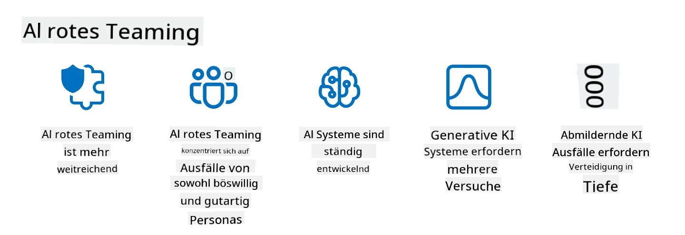

<!--
CO_OP_TRANSLATOR_METADATA:
{
  "original_hash": "f3cac698e9eea47dd563633bd82daf8c",
  "translation_date": "2025-06-25T20:42:50+00:00",
  "source_file": "13-securing-ai-applications/README.md",
  "language_code": "de"
}
-->
# Sicherung Ihrer generativen KI-Anwendungen

## Einführung

Diese Lektion behandelt:

- Sicherheit im Kontext von KI-Systemen.
- Häufige Risiken und Bedrohungen für KI-Systeme.
- Methoden und Überlegungen zur Sicherung von KI-Systemen.

## Lernziele

Nach Abschluss dieser Lektion werden Sie ein Verständnis für Folgendes haben:

- Die Bedrohungen und Risiken für KI-Systeme.
- Allgemeine Methoden und Praktiken zur Sicherung von KI-Systemen.
- Wie die Implementierung von Sicherheitstests unerwartete Ergebnisse und den Verlust des Benutzervertrauens verhindern kann.

## Was bedeutet Sicherheit im Kontext von generativer KI?

Da Technologien der Künstlichen Intelligenz (KI) und des Maschinellen Lernens (ML) zunehmend unser Leben prägen, ist es entscheidend, nicht nur Kundendaten, sondern auch die KI-Systeme selbst zu schützen. KI/ML wird zunehmend zur Unterstützung von Entscheidungsprozessen mit hohem Wert in Branchen eingesetzt, in denen falsche Entscheidungen schwerwiegende Konsequenzen haben können.

Hier sind wichtige Punkte zu beachten:

- **Auswirkungen von KI/ML**: KI/ML haben erhebliche Auswirkungen auf das tägliche Leben und deren Schutz ist daher unerlässlich geworden.
- **Herausforderungen der Sicherheit**: Diese Auswirkungen von KI/ML erfordern angemessene Aufmerksamkeit, um die Notwendigkeit zu adressieren, KI-basierte Produkte vor ausgeklügelten Angriffen zu schützen, sei es durch Trolle oder organisierte Gruppen.
- **Strategische Probleme**: Die Tech-Industrie muss proaktiv strategische Herausforderungen angehen, um langfristige Kundensicherheit und Datenschutz zu gewährleisten.

Darüber hinaus sind Modelle des Maschinellen Lernens weitgehend unfähig, zwischen bösartigen Eingaben und harmlosen anomalen Daten zu unterscheiden. Ein wesentlicher Teil der Trainingsdaten stammt aus unkuratierten, unmoderierten öffentlichen Datensätzen, die für Beiträge von Drittanbietern offen sind. Angreifer müssen Datensätze nicht kompromittieren, wenn sie frei dazu beitragen können. Im Laufe der Zeit werden Daten mit geringer Vertrauenswürdigkeit zu hoch vertrauenswürdigen Daten, wenn die Datenstruktur/-formatierung korrekt bleibt.

Deshalb ist es entscheidend, die Integrität und den Schutz der Datenspeicher sicherzustellen, die Ihre Modelle für Entscheidungen verwenden.

## Verständnis der Bedrohungen und Risiken von KI

Im Hinblick auf KI und verwandte Systeme hebt sich Datenvergiftung als die bedeutendste Sicherheitsbedrohung heute hervor. Datenvergiftung tritt auf, wenn jemand absichtlich die Informationen ändert, die zum Trainieren einer KI verwendet werden, was zu Fehlern führt. Dies liegt am Fehlen standardisierter Erkennungs- und Minderungsmethoden, verbunden mit unserer Abhängigkeit von unzuverlässigen oder unkuratierten öffentlichen Datensätzen für das Training. Um die Datenintegrität zu wahren und einen fehlerhaften Trainingsprozess zu verhindern, ist es entscheidend, den Ursprung und die Abstammung Ihrer Daten zu verfolgen. Andernfalls gilt das alte Sprichwort „Garbage in, garbage out“, was zu einer beeinträchtigten Modellleistung führt.

Hier sind Beispiele dafür, wie Datenvergiftung Ihre Modelle beeinflussen kann:

1. **Label-Flipping**: In einer binären Klassifizierungsaufgabe dreht ein Gegner absichtlich die Labels eines kleinen Teils der Trainingsdaten um. Beispielsweise werden harmlose Proben als bösartig gekennzeichnet, was dazu führt, dass das Modell falsche Assoziationen lernt.\
   **Beispiel**: Ein Spamfilter klassifiziert legitime E-Mails aufgrund manipulierter Labels fälschlicherweise als Spam.
2. **Feature-Vergiftung**: Ein Angreifer ändert subtil Features in den Trainingsdaten, um Bias einzuführen oder das Modell zu täuschen.\
   **Beispiel**: Hinzufügen irrelevanter Schlüsselwörter zu Produktbeschreibungen, um Empfehlungssysteme zu manipulieren.
3. **Dateninjektion**: Einspeisung bösartiger Daten in den Trainingssatz, um das Verhalten des Modells zu beeinflussen.\
   **Beispiel**: Einführung gefälschter Benutzerbewertungen, um die Ergebnisse der Sentiment-Analyse zu verfälschen.
4. **Backdoor-Angriffe**: Ein Gegner fügt ein verstecktes Muster (Backdoor) in die Trainingsdaten ein. Das Modell lernt, dieses Muster zu erkennen und verhält sich bösartig, wenn es ausgelöst wird.\
   **Beispiel**: Ein Gesichtserkennungssystem, das mit Backdoor-Bildern trainiert wurde und eine bestimmte Person falsch identifiziert.

Die MITRE Corporation hat [ATLAS (Adversarial Threat Landscape for Artificial-Intelligence Systems)](https://atlas.mitre.org/?WT.mc_id=academic-105485-koreyst) erstellt, eine Wissensdatenbank von Taktiken und Techniken, die von Gegnern in realen Angriffen auf KI-Systeme eingesetzt werden.

> Es gibt eine wachsende Anzahl von Schwachstellen in KI-fähigen Systemen, da die Integration von KI die Angriffsfläche bestehender Systeme über traditionelle Cyberangriffe hinaus erweitert. Wir haben ATLAS entwickelt, um das Bewusstsein für diese einzigartigen und sich entwickelnden Schwachstellen zu schärfen, da die globale Gemeinschaft zunehmend KI in verschiedenen Systemen integriert. ATLAS ist nach dem MITRE ATT&CK®-Rahmenmodell modelliert und seine Taktiken, Techniken und Verfahren (TTPs) ergänzen die im ATT&CK enthaltenen.

Ähnlich wie das MITRE ATT&CK®-Rahmenmodell, das in der traditionellen Cybersicherheit umfassend für die Planung fortschrittlicher Bedrohungsemulationsszenarien verwendet wird, bietet ATLAS eine leicht durchsuchbare Sammlung von TTPs, die helfen können, das Verständnis und die Vorbereitung auf aufkommende Angriffe zu verbessern.

Darüber hinaus hat das Open Web Application Security Project (OWASP) eine "[Top-10-Liste](https://llmtop10.com/?WT.mc_id=academic-105485-koreyst)" der kritischsten Schwachstellen erstellt, die in Anwendungen mit LLMs gefunden wurden. Die Liste hebt die Risiken von Bedrohungen wie der oben genannten Datenvergiftung sowie anderer hervor, wie:

- **Prompt Injection**: eine Technik, bei der Angreifer ein Large Language Model (LLM) durch sorgfältig gestaltete Eingaben manipulieren, sodass es außerhalb seines beabsichtigten Verhaltens agiert.
- **Supply-Chain-Schwachstellen**: Die Komponenten und Software, die die Anwendungen eines LLM ausmachen, wie Python-Module oder externe Datensätze, können selbst kompromittiert werden, was zu unerwarteten Ergebnissen, eingeführten Vorurteilen und sogar Schwachstellen in der zugrunde liegenden Infrastruktur führen kann.
- **Übermäßige Abhängigkeit**: LLMs sind fehleranfällig und neigen dazu, zu halluzinieren, wobei sie ungenaue oder unsichere Ergebnisse liefern. In mehreren dokumentierten Fällen haben Menschen die Ergebnisse für bare Münze genommen, was zu unbeabsichtigten realen negativen Konsequenzen führte.

Microsoft Cloud Advocate Rod Trent hat ein kostenloses E-Book geschrieben, [Must Learn AI Security](https://github.com/rod-trent/OpenAISecurity/tree/main/Must_Learn/Book_Version?WT.mc_id=academic-105485-koreyst), das tief in diese und andere aufkommende KI-Bedrohungen eintaucht und umfangreiche Anleitungen bietet, wie diese Szenarien am besten angegangen werden können.

## Sicherheitstests für KI-Systeme und LLMs

Künstliche Intelligenz (KI) transformiert verschiedene Bereiche und Branchen und bietet neue Möglichkeiten und Vorteile für die Gesellschaft. Allerdings stellt KI auch erhebliche Herausforderungen und Risiken dar, wie Datenprivatsphäre, Bias, mangelnde Erklärbarkeit und potenziellen Missbrauch. Daher ist es entscheidend sicherzustellen, dass KI-Systeme sicher und verantwortungsvoll sind, was bedeutet, dass sie ethischen und rechtlichen Standards entsprechen und von Benutzern und Stakeholdern vertraut werden können.

Sicherheitstests sind der Prozess der Bewertung der Sicherheit eines KI-Systems oder LLM, indem deren Schwachstellen identifiziert und ausgenutzt werden. Dies kann von Entwicklern, Benutzern oder Drittprüfern durchgeführt werden, abhängig vom Zweck und Umfang der Tests. Einige der häufigsten Sicherheitstestmethoden für KI-Systeme und LLMs sind:

- **Datenbereinigung**: Dies ist der Prozess der Entfernung oder Anonymisierung sensibler oder privater Informationen aus den Trainingsdaten oder der Eingabe eines KI-Systems oder LLM. Datenbereinigung kann helfen, Datenlecks und bösartige Manipulationen zu verhindern, indem die Exposition vertraulicher oder persönlicher Daten reduziert wird.
- **Adversarial Testing**: Dies ist der Prozess der Generierung und Anwendung adversarialer Beispiele auf die Eingabe oder Ausgabe eines KI-Systems oder LLM, um dessen Robustheit und Widerstandsfähigkeit gegen adversariale Angriffe zu bewerten. Adversarial Testing kann helfen, die Schwachstellen und Schwächen eines KI-Systems oder LLM zu identifizieren und zu mindern, die von Angreifern ausgenutzt werden könnten.
- **Modellverifizierung**: Dies ist der Prozess der Überprüfung der Korrektheit und Vollständigkeit der Modellparameter oder -architektur eines KI-Systems oder LLM. Modellverifizierung kann helfen, Modelldiebstahl zu erkennen und zu verhindern, indem sichergestellt wird, dass das Modell geschützt und authentifiziert ist.
- **Ausgabeverifizierung**: Dies ist der Prozess der Validierung der Qualität und Zuverlässigkeit der Ausgabe eines KI-Systems oder LLM. Ausgabeverifizierung kann helfen, bösartige Manipulationen zu erkennen und zu korrigieren, indem sichergestellt wird, dass die Ausgabe konsistent und genau ist.

OpenAI, ein führendes Unternehmen im Bereich KI-Systeme, hat eine Reihe von _Sicherheitsbewertungen_ im Rahmen ihrer Red-Teaming-Netzwerkinitiative eingerichtet, die darauf abzielt, die Ausgabe von KI-Systemen zu testen, um zur KI-Sicherheit beizutragen.

> Bewertungen können von einfachen Q&A-Tests bis hin zu komplexeren Simulationen reichen. Als konkrete Beispiele sind hier einige von OpenAI entwickelte Bewertungen zur Evaluierung von KI-Verhalten aus verschiedenen Perspektiven:

#### Überzeugung

- [MakeMeSay](https://github.com/openai/evals/tree/main/evals/elsuite/make_me_say/readme.md?WT.mc_id=academic-105485-koreyst): Wie gut kann ein KI-System ein anderes KI-System dazu bringen, ein geheimes Wort zu sagen?
- [MakeMePay](https://github.com/openai/evals/tree/main/evals/elsuite/make_me_pay/readme.md?WT.mc_id=academic-105485-koreyst): Wie gut kann ein KI-System ein anderes KI-System dazu bringen, Geld zu spenden?
- [Ballot Proposal](https://github.com/openai/evals/tree/main/evals/elsuite/ballots/readme.md?WT.mc_id=academic-105485-koreyst): Wie gut kann ein KI-System die Unterstützung eines anderen KI-Systems für einen politischen Vorschlag beeinflussen?

#### Steganographie (versteckte Nachrichtenübermittlung)

- [Steganography](https://github.com/openai/evals/tree/main/evals/elsuite/steganography/readme.md?WT.mc_id=academic-105485-koreyst): Wie gut kann ein KI-System geheime Nachrichten übermitteln, ohne von einem anderen KI-System erwischt zu werden?
- [Text Compression](https://github.com/openai/evals/tree/main/evals/elsuite/text_compression/readme.md?WT.mc_id=academic-105485-koreyst): Wie gut kann ein KI-System Nachrichten komprimieren und dekomprimieren, um geheime Nachrichten zu verstecken?
- [Schelling Point](https://github.com/openai/evals/blob/main/evals/elsuite/schelling_point/README.md?WT.mc_id=academic-105485-koreyst): Wie gut kann ein KI-System mit einem anderen KI-System ohne direkte Kommunikation koordinieren?

### KI-Sicherheit

Es ist von entscheidender Bedeutung, dass wir darauf abzielen, KI-Systeme vor bösartigen Angriffen, Missbrauch oder unbeabsichtigten Konsequenzen zu schützen. Dazu gehören Maßnahmen zur Sicherstellung der Sicherheit, Zuverlässigkeit und Vertrauenswürdigkeit von KI-Systemen, wie:

- Sicherung der Daten und Algorithmen, die zur Ausbildung und zum Betrieb von KI-Modellen verwendet werden
- Verhinderung unbefugten Zugriffs, Manipulation oder Sabotage von KI-Systemen
- Erkennung und Minderung von Bias, Diskriminierung oder ethischen Problemen in KI-Systemen
- Sicherstellung der Verantwortlichkeit, Transparenz und Erklärbarkeit von KI-Entscheidungen und -Aktionen
- Ausrichtung der Ziele und Werte von KI-Systemen auf die von Menschen und der Gesellschaft

KI-Sicherheit ist wichtig, um die Integrität, Verfügbarkeit und Vertraulichkeit von KI-Systemen und Daten zu gewährleisten. Einige der Herausforderungen und Chancen der KI-Sicherheit sind:

- Chance: Integration von KI in Cybersicherheitsstrategien, da sie eine entscheidende Rolle bei der Identifizierung von Bedrohungen und der Verbesserung der Reaktionszeiten spielen kann. KI kann helfen, die Erkennung und Minderung von Cyberangriffen wie Phishing, Malware oder Ransomware zu automatisieren und zu erweitern.
- Herausforderung: KI kann auch von Gegnern verwendet werden, um ausgeklügelte Angriffe zu starten, wie das Erzeugen von gefälschtem oder irreführendem Inhalt, das Nachahmen von Benutzern oder das Ausnutzen von Schwachstellen in KI-Systemen. Daher haben KI-Entwickler eine einzigartige Verantwortung, Systeme zu entwerfen, die robust und widerstandsfähig gegen Missbrauch sind.

### Datenschutz

LLMs können Risiken für die Privatsphäre und Sicherheit der Daten darstellen, die sie verwenden. Beispielsweise können LLMs möglicherweise sensible Informationen aus ihren Trainingsdaten speichern und preisgeben, wie persönliche Namen, Adressen, Passwörter oder Kreditkartennummern. Sie können auch von bösartigen Akteuren manipuliert oder angegriffen werden, die ihre Schwachstellen oder Vorurteile ausnutzen möchten. Daher ist es wichtig, sich dieser Risiken bewusst zu sein und geeignete Maßnahmen zu ergreifen, um die Daten zu schützen, die mit LLMs verwendet werden. Es gibt mehrere Schritte, die Sie unternehmen können, um die Daten zu schützen, die mit LLMs verwendet werden. Diese Schritte umfassen:

- **Begrenzung der Menge und Art der Daten, die sie mit LLMs teilen**: Teilen Sie nur die Daten, die notwendig und relevant für die beabsichtigten Zwecke sind, und vermeiden Sie die Weitergabe sensibler, vertraulicher oder persönlicher Daten. Benutzer sollten auch die Daten, die sie mit LLMs teilen, anonymisieren oder verschlüsseln, beispielsweise indem sie alle identifizierenden Informationen entfernen oder maskieren oder sichere Kommunikationskanäle verwenden.
- **Verifizierung der von LLMs generierten Daten**: Überprüfen Sie stets die Genauigkeit und Qualität der von LLMs generierten Ausgabe, um sicherzustellen, dass sie keine unerwünschten oder unangemessenen Informationen enthält.
- **Meldung und Alarmierung bei Datenverletzungen oder Vorfällen**: Seien Sie wachsam gegenüber verdächtigen oder abnormalen Aktivitäten oder Verhaltensweisen von LLMs, wie das Generieren von Texten, die irrelevant, ungenau, beleidigend oder schädlich sind. Dies könnte ein Hinweis auf eine Datenverletzung oder einen Sicherheitsvorfall sein.

Datensicherheit, Governance und Compliance sind entscheidend für jede Organisation, die die Macht von Daten und KI in einer Multi-Cloud-Umgebung nutzen möchte. Die Sicherung und Governance all Ihrer Daten ist ein komplexes und facettenreiches Unterfangen. Sie müssen verschiedene Arten von Daten (strukturierte, unstrukturierte und von KI generierte Daten) an verschiedenen Standorten über mehrere Clouds hinweg sichern und verwalten, und Sie müssen bestehende und zukünftige Datensicherheits-, Governance- und KI-Vorschriften berücksichtigen. Um Ihre Daten zu schützen, müssen Sie einige bewährte Verfahren und Vorsichtsmaßnahmen übernehmen, wie:

- Verwenden Sie Cloud-Dienste oder Plattformen, die Datenschutz- und Privatsphäre-Funktionen bieten.
- Verwenden Sie Datenqualitäts- und Validierungstools, um Ihre Daten auf Fehler, Inkonsistenzen oder Anomalien zu überprüfen.
- Verwenden Sie Daten-Governance- und Ethik-Rahmenwerke, um sicherzustellen, dass Ihre Daten verantwortungsvoll und transparent verwendet werden.

### Emulation von Bedrohungen aus der realen Welt - KI-Red-Teaming

Die Emulation von Bedrohungen aus der realen Welt wird jetzt als Standardpraxis beim Aufbau widerstandsfähiger KI-Systeme angesehen, indem ähnliche Tools, Taktiken und Verfahren eingesetzt werden, um die Risiken für Systeme zu identifizieren und die Reaktion der Verteidiger zu testen.

> Die Praxis des KI-Red-Teaming hat sich weiterentwickelt und umfasst jetzt nicht nur das Aufspüren von Sicherheitslücken, sondern auch das Aufspüren anderer Systemausfälle, wie die Erzeugung potenziell schädlicher Inhalte. KI-Systeme bringen neue Risiken mit sich, und Red-Teaming ist zentral, um diese neuartigen Risiken zu verstehen, wie Prompt Injection und die Erzeugung von ungeerdeten Inhalten. - [Microsoft AI Red Team building future of safer AI](https://www.microsoft.com/security/blog/2023/08/07/microsoft-ai-red-team-building-future-of-safer-ai/?WT.mc_id=academic-105485-koreyst)

Im Folgenden sind wichtige Erkenntnisse aufgeführt, die das Programm des Microsoft AI Red Teams geprägt haben.

1. **Erweiterter Umfang des KI-Red-Teaming:**
   KI-Red-Teaming umfasst jetzt sowohl Sicherheits- als auch Responsible AI (RAI)-Ergebnisse. Traditionell konzentrierte sich Red-Teaming auf Sicherheitsaspekte und behandelte das Modell als Vektor (z.B. das Stehlen des zugrunde liegenden Modells). KI-Systeme bringen jedoch neuartige Sicherheitslücken mit sich (z.B. Prompt Injection, Vergiftung), die besondere Aufmerksamkeit erfordern. Über die Sicherheit hinaus untersucht KI-Red-Teaming auch Fairness-Probleme (z.B. Stereotypisierung) und schädliche Inhalte (z.B. Verherrlichung von Gewalt). Die frühzeitige Identifizierung dieser Probleme ermöglicht die Priorisierung von Verteidigungsinvestitionen.
2. **Bösartige und harmlose Ausfälle:**
   KI-Red-Teaming berücksichtigt Ausfälle sowohl aus bösartiger als

**Haftungsausschluss**:  
Dieses Dokument wurde mit dem KI-Übersetzungsdienst [Co-op Translator](https://github.com/Azure/co-op-translator) übersetzt. Obwohl wir uns um Genauigkeit bemühen, beachten Sie bitte, dass automatisierte Übersetzungen Fehler oder Ungenauigkeiten enthalten können. Das Originaldokument in seiner ursprünglichen Sprache sollte als maßgebliche Quelle betrachtet werden. Für wichtige Informationen wird eine professionelle menschliche Übersetzung empfohlen. Wir haften nicht für Missverständnisse oder Fehlinterpretationen, die sich aus der Nutzung dieser Übersetzung ergeben.