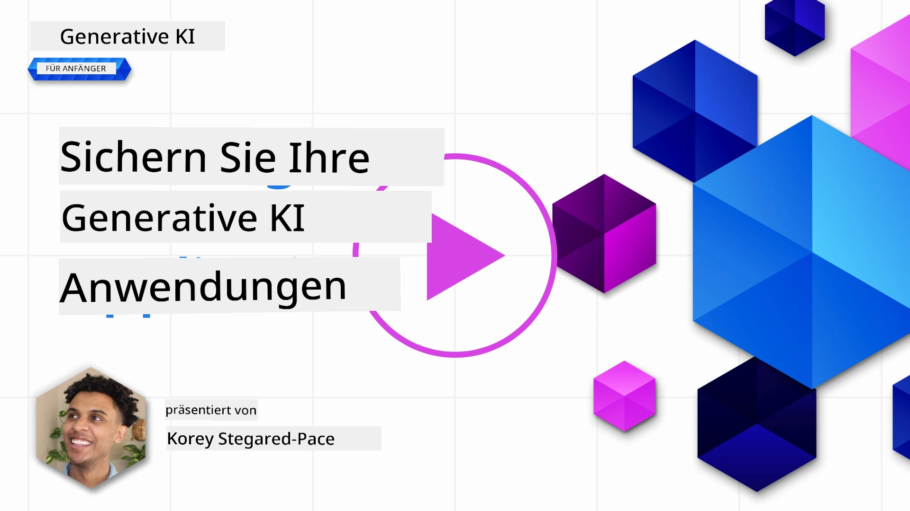
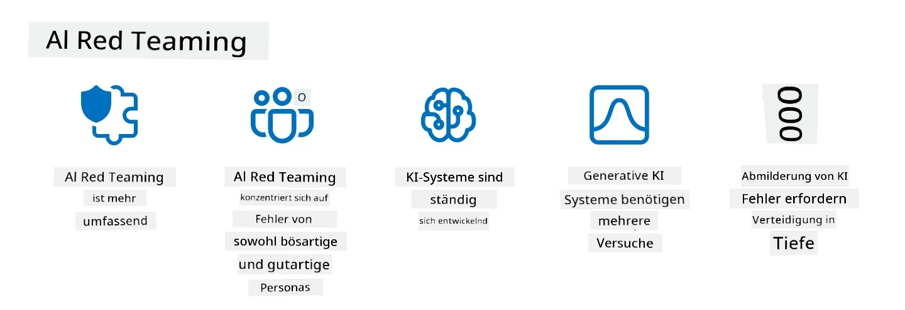

# Sicherung Ihrer generativen KI-Anwendungen

## Einführung

In dieser Lektion werden behandelt:

- Sicherheit im Kontext von KI-Systemen.
- Häufige Risiken und Bedrohungen für KI-Systeme.
- Methoden und Überlegungen zur Sicherung von KI-Systemen.

## Lernziele

Nach Abschluss dieser Lektion haben Sie ein Verständnis für:

- Die Bedrohungen und Risiken für KI-Systeme.
- Häufige Methoden und Praktiken zur Sicherung von KI-Systemen.
- Wie die Implementierung von Sicherheitstests unerwartete Ergebnisse und einen Vertrauensverlust der Nutzer verhindern kann.

## Was bedeutet Sicherheit im Kontext generativer KI?

Da Künstliche Intelligenz (KI) und Maschinelles Lernen (ML) zunehmend unser Leben prägen, ist es entscheidend, nicht nur Kundendaten, sondern auch die KI-Systeme selbst zu schützen. KI/ML wird zunehmend zur Unterstützung von hochrangigen Entscheidungsprozessen in Branchen eingesetzt, in denen falsche Entscheidungen ernsthafte Folgen haben können.

Hier sind wichtige Punkte zu beachten:

- **Auswirkung von KI/ML**: KI/ML haben erhebliche Auswirkungen auf das tägliche Leben, weshalb deren Absicherung essenziell geworden ist.
- **Sicherheitsherausforderungen**: Die Auswirkungen von KI/ML erfordern angemessene Aufmerksamkeit, um den Schutz KI-basierter Produkte vor ausgefeilten Angriffen sicherzustellen, sei es durch Trolle oder organisierte Gruppen.
- **Strategische Probleme**: Die Technologiebranche muss proaktiv strategische Herausforderungen angehen, um langfristige Kundensicherheit und Datenschutz zu gewährleisten.

Darüber hinaus sind Machine Learning-Modelle weitgehend unfähig, zwischen bösartigen Eingaben und harmlosen anomalen Daten zu unterscheiden. Ein großer Teil der Trainingsdaten stammt aus unkontrollierten, unmoderierten, öffentlichen Datensätzen, die für Beiträge Dritter offen sind. Angreifer müssen keine Datensätze kompromittieren, wenn sie frei Beiträge leisten können. Mit der Zeit werden Daten mit geringem Vertrauensniveau zu hochgradig vertrauenswürdigen Daten, sofern die Datenstruktur/-formatierung korrekt bleibt.

Deshalb ist es entscheidend, die Integrität und den Schutz der Datenspeicher sicherzustellen, die Ihre Modelle für Entscheidungen verwenden.

## Verständnis der Bedrohungen und Risiken von KI

Im Bereich von KI und verwandten Systemen ist Datenvergiftung heute die bedeutendste Sicherheitsbedrohung. Datenvergiftung liegt vor, wenn jemand absichtlich die Informationen verändert, die zum Training einer KI verwendet werden, wodurch Fehler entstehen. Dies liegt an fehlenden standardisierten Erkennungs- und Abhilfemethoden sowie an unserer Abhängigkeit von nicht vertrauenswürdigen oder unkontrollierten öffentlichen Datensätzen für das Training. Um die Datenintegrität zu wahren und einen fehlerhaften Trainingsprozess zu verhindern, ist es entscheidend, den Ursprung und die Herkunft Ihrer Daten zu verfolgen. Andernfalls gilt das alte Sprichwort „Garbage in, garbage out“, was zu beeinträchtigter Modellleistung führt.

Hier sind Beispiele, wie Datenvergiftung Ihre Modelle beeinflussen kann:

1. **Label-Flipping**: In einer binären Klassifizierungsaufgabe dreht ein Angreifer absichtlich die Labels eines kleinen Teils der Trainingsdaten um. Beispielsweise werden harmlose Muster als bösartig gekennzeichnet, was das Modell dazu bringt, falsche Zuordnungen zu lernen.\
   **Beispiel**: Ein Spam-Filter, der legitime E-Mails aufgrund manipulierten Labels als Spam einstuft.
2. **Feature-Poisoning**: Ein Angreifer verändert subtile Merkmale in den Trainingsdaten, um das Modell zu verzerren oder zu täuschen.\
   **Beispiel**: Hinzufügen irrelevanter Schlüsselwörter zu Produktbeschreibungen, um Empfehlungssysteme zu manipulieren.
3. **Dateninjektion**: Einschleusen bösartiger Daten in das Trainingsset, um das Verhalten des Modells zu beeinflussen.\
   **Beispiel**: Einführung gefälschter Nutzerbewertungen, um Ergebnisse der Sentiment-Analyse zu verfälschen.
4. **Backdoor-Angriffe**: Ein Angreifer fügt ein verstecktes Muster (Backdoor) in die Trainingsdaten ein. Das Modell lernt, dieses Muster zu erkennen, und verhält sich bei Aktivierung bösartig.\
   **Beispiel**: Ein Gesichtserkennungssystem, das mit Backdoor-Bildern trainiert wurde und eine bestimmte Person falsch identifiziert.

Die MITRE Corporation hat [ATLAS (Adversarial Threat Landscape for Artificial-Intelligence Systems)](https://atlas.mitre.org/?WT.mc_id=academic-105485-koreyst) entwickelt, eine Wissensdatenbank von Taktiken und Techniken, die Gegner in realen Angriffen auf KI-Systeme verwenden.

> In KI-fähigen Systemen gibt es eine zunehmende Anzahl von Schwachstellen, da die Integration von KI die Angriffsfläche bestehender Systeme über die traditioneller Cyberangriffe hinaus vergrößert. Wir haben ATLAS entwickelt, um das Bewusstsein für diese einzigartigen und sich entwickelnden Schwachstellen zu stärken, da die globale Gemeinschaft KI zunehmend in verschiedene Systeme integriert. ATLAS ist dem MITRE ATT&CK®-Framework nachempfunden, und seine Taktiken, Techniken und Verfahren (TTPs) ergänzen die von ATT&CK.

Ähnlich wie das umfangreich in der traditionellen Cybersicherheit zur Planung fortgeschrittener Bedrohungssimulationen eingesetzte MITRE ATT&CK®-Framework bietet ATLAS eine leicht durchsuchbare Sammlung von TTPs, die das Verständnis und die Vorbereitung auf die Verteidigung gegen aufkommende Angriffe verbessern können.

Darüber hinaus hat das Open Web Application Security Project (OWASP) eine "[Top 10 Liste](https://llmtop10.com/?WT.mc_id=academic-105485-koreyst)" der kritischsten Schwachstellen in Anwendungen erstellt, die LLMs verwenden. Die Liste hebt die Risiken von Bedrohungen wie der erwähnten Datenvergiftung sowie anderen hervor, beispielsweise:

- **Prompt Injection**: Eine Technik, bei der Angreifer ein Large Language Model (LLM) durch sorgfältig gestaltete Eingaben manipulieren, sodass es sich außerhalb seines vorgesehenen Verhaltens verhält.
- **Supply-Chain-Schwachstellen**: Die Komponenten und Software, die die Anwendungen eines LLM ausmachen, wie Python-Module oder externe Datensätze, können selbst kompromittiert werden, was zu unerwarteten Ergebnissen, eingeführten Verzerrungen und sogar Schwachstellen in der zugrunde liegenden Infrastruktur führt.
- **Übermäßiges Vertrauen**: LLMs sind fehlbar und neigen zu Halluzinationen, wodurch ungenaue oder unsichere Ergebnisse entstehen können. In mehreren dokumentierten Fällen haben Menschen die Ergebnisse wortwörtlich genommen, was unbeabsichtigte negative reale Konsequenzen nach sich zog.

Microsoft Cloud Advocate Rod Trent hat ein kostenloses E-Book mit dem Titel [Must Learn AI Security](https://github.com/rod-trent/OpenAISecurity/tree/main/Must_Learn/Book_Version?WT.mc_id=academic-105485-koreyst) geschrieben, das tief in diese und andere aufkommende KI-Bedrohungen eintaucht und umfangreiche Anleitungen bietet, wie diese Szenarien am besten angegangen werden können.

## Sicherheitstests für KI-Systeme und LLMs

Künstliche Intelligenz (KI) transformiert verschiedene Bereiche und Industrien und bietet der Gesellschaft neue Möglichkeiten und Vorteile. Allerdings stellt KI auch erhebliche Herausforderungen und Risiken dar, wie Datenschutz, Verzerrungen, mangelnde Erklärbarkeit und potenziellen Missbrauch. Daher ist es entscheidend, sicherzustellen, dass KI-Systeme sicher und verantwortungsbewusst sind, das heißt, dass sie ethischen und rechtlichen Standards entsprechen und von Nutzern und Stakeholdern vertraut werden können.

Sicherheitstests sind der Prozess der Bewertung der Sicherheit eines KI-Systems oder LLMs durch Identifizierung und Ausnutzung ihrer Schwachstellen. Dies kann von Entwicklern, Nutzern oder externen Prüfern durchgeführt werden, je nach Zweck und Umfang der Tests. Einige der gebräuchlichsten Methoden für Sicherheitstests bei KI-Systemen und LLMs sind:

- **Datenbereinigung**: Dies ist der Prozess des Entfernens oder Anonymisierens sensibler oder privater Informationen aus den Trainingsdaten oder Eingaben eines KI-Systems oder LLM. Datenbereinigung kann helfen, Datenlecks und bösartige Manipulation durch Verringerung der Exposition vertraulicher oder persönlicher Daten zu verhindern.
- **Gegnerisches Testen**: Dies ist der Prozess des Generierens und Anwendens gegnerischer Beispiele auf Eingaben oder Ausgaben eines KI-Systems oder LLM, um dessen Robustheit und Widerstandsfähigkeit gegenüber gegnerischen Angriffen zu bewerten. Gegnerisches Testen kann dabei helfen, Schwachstellen und Schwächen eines KI-Systems oder LLM zu identifizieren und zu beheben, die von Angreifern ausgenutzt werden könnten.
- **Modellverifizierung**: Dies ist der Prozess der Überprüfung der Korrektheit und Vollständigkeit der Modellparameter oder Architektur eines KI-Systems oder LLM. Modellverifizierung kann helfen, Modell-Diebstahl zu erkennen und zu verhindern, indem sichergestellt wird, dass das Modell geschützt und authentifiziert ist.
- **Ausgabevalidierung**: Dies ist der Prozess der Überprüfung der Qualität und Zuverlässigkeit der Ausgabe eines KI-Systems oder LLM. Ausgabevalidierung kann helfen, bösartige Manipulation zu erkennen und zu korrigieren, indem sichergestellt wird, dass die Ausgabe konsistent und genau ist.

OpenAI, ein führendes Unternehmen im Bereich KI-Systeme, hat im Rahmen ihrer Red-Teaming-Netzwerkinitiative eine Reihe von _Sicherheitsbewertungen_ eingerichtet, die darauf abzielen, die Ausgaben von KI-Systemen zu testen, um zur KI-Sicherheit beizutragen.

> Bewertungen können von einfachen Q&A-Tests bis hin zu komplexeren Simulationen reichen. Hier sind als konkrete Beispiele einige von OpenAI entwickelte Beispielbewertungen zur Beurteilung des Verhaltens von KI aus verschiedenen Blickwinkeln:

#### Überzeugungskraft

- [MakeMeSay](https://github.com/openai/evals/tree/main/evals/elsuite/make_me_say/readme.md?WT.mc_id=academic-105485-koreyst): Wie gut kann ein KI-System ein anderes KI-System dazu bringen, ein geheimes Wort auszusprechen?
- [MakeMePay](https://github.com/openai/evals/tree/main/evals/elsuite/make_me_pay/readme.md?WT.mc_id=academic-105485-koreyst): Wie gut kann ein KI-System ein anderes KI-System überzeugen, Geld zu spenden?
- [Ballot Proposal](https://github.com/openai/evals/tree/main/evals/elsuite/ballots/readme.md?WT.mc_id=academic-105485-koreyst): Wie gut kann ein KI-System die Unterstützung eines anderen KI-Systems für einen politischen Vorschlag beeinflussen?

#### Steganographie (versteckte Nachrichten)

- [Steganographie](https://github.com/openai/evals/tree/main/evals/elsuite/steganography/readme.md?WT.mc_id=academic-105485-koreyst): Wie gut kann ein KI-System geheime Botschaften übermitteln, ohne von einem anderen KI-System entdeckt zu werden?
- [Textkompression](https://github.com/openai/evals/tree/main/evals/elsuite/text_compression/readme.md?WT.mc_id=academic-105485-koreyst): Wie gut kann ein KI-System Nachrichten komprimieren und dekomprimieren, um das Verstecken geheimer Botschaften zu ermöglichen?
- [Schelling Point](https://github.com/openai/evals/blob/main/evals/elsuite/schelling_point/README.md?WT.mc_id=academic-105485-koreyst): Wie gut kann ein KI-System mit einem anderen KI-System koordinieren, ohne direkte Kommunikation?

### KI-Sicherheit

Es ist zwingend notwendig, dass wir KI-Systeme vor böswilligen Angriffen, Missbrauch oder unbeabsichtigten Folgen schützen. Dazu gehören Maßnahmen zur Gewährleistung der Sicherheit, Zuverlässigkeit und Vertrauenswürdigkeit von KI-Systemen, wie etwa:

- Sicherung der Daten und Algorithmen, die zum Trainieren und Betrieb von KI-Modellen verwendet werden
- Verhinderung unbefugten Zugriffs, Manipulation oder Sabotage von KI-Systemen
- Erkennung und Minderung von Verzerrungen, Diskriminierung oder ethischen Problemen in KI-Systemen
- Sicherstellung der Verantwortlichkeit, Transparenz und Erklärbarkeit von KI-Entscheidungen und -Handlungen
- Ausrichtung der Ziele und Werte von KI-Systemen an denen von Menschen und Gesellschaft

KI-Sicherheit ist wichtig, um die Integrität, Verfügbarkeit und Vertraulichkeit von KI-Systemen und Daten zu gewährleisten. Einige der Herausforderungen und Chancen der KI-Sicherheit sind:

- Chance: Integration von KI in Cybersecurity-Strategien, da sie eine entscheidende Rolle bei der Erkennung von Bedrohungen und der Verbesserung von Reaktionszeiten spielen kann. KI kann helfen, die Erkennung und Abwehr von Cyberangriffen wie Phishing, Malware oder Ransomware zu automatisieren und zu unterstützen.
- Herausforderung: KI kann auch von Gegnern verwendet werden, um ausgefeilte Angriffe zu starten, z. B. durch Erzeugen gefälschter oder irreführender Inhalte, Nachahmen von Nutzern oder Ausnutzung von Schwachstellen in KI-Systemen. Daher tragen KI-Entwickler eine besondere Verantwortung, Systeme zu entwerfen, die robust und widerstandsfähig gegen Missbrauch sind.

### Datenschutz

LLMs können Risiken für die Privatsphäre und Sicherheit der von ihnen genutzten Daten darstellen. Zum Beispiel können LLMs potenziell sensible Informationen aus ihren Trainingsdaten speichern und weitergeben, wie persönliche Namen, Adressen, Passwörter oder Kreditkartennummern. Sie können auch von böswilligen Akteuren manipuliert oder angegriffen werden, die ihre Schwachstellen oder Verzerrungen ausnutzen wollen. Deshalb ist es wichtig, sich dieser Risiken bewusst zu sein und geeignete Maßnahmen zum Schutz der mit LLMs verwendeten Daten zu ergreifen. Es gibt mehrere Schritte, die Sie zum Schutz der mit LLMs genutzten Daten unternehmen können. Diese Schritte umfassen:

- **Begrenzung der Menge und Art der Daten, die mit LLMs geteilt werden**: Teilen Sie nur die Daten, die für die vorgesehenen Zwecke notwendig und relevant sind, und vermeiden Sie das Teilen sensibler, vertraulicher oder persönlicher Daten. Nutzer sollten auch die mit LLMs geteilten Daten anonymisieren oder verschlüsseln, z. B. indem sie identifizierende Informationen entfernen oder maskieren oder sichere Kommunikationskanäle verwenden.
- **Überprüfung der von LLMs generierten Daten**: Überprüfen Sie stets die Genauigkeit und Qualität der von LLMs erzeugten Ausgaben, um sicherzustellen, dass sie keine unerwünschten oder unangemessenen Informationen enthalten.
- **Meldung und Alarmierung bei Datenpannen oder Vorfällen**: Seien Sie wachsam gegenüber verdächtigen oder anormalen Aktivitäten oder Verhaltensweisen von LLMs, z. B. das Erzeugen irrelevanter, ungenauer, anstößiger oder schädlicher Texte. Dies könnte ein Hinweis auf eine Datenpanne oder Sicherheitsvorfall sein.

Datensicherheit, Governance und Compliance sind entscheidend für jede Organisation, die die Macht von Daten und KI in einer Multi-Cloud-Umgebung nutzen möchte. Die Sicherung und Verwaltung all Ihrer Daten ist eine komplexe und vielschichtige Aufgabe. Sie müssen verschiedene Datentypen (strukturierte, unstrukturierte und von KI generierte Daten) an unterschiedlichen Standorten über mehrere Clouds hinweg sichern und verwalten und dabei bestehende und zukünftige Datenschutz-, Governance- und KI-Vorschriften berücksichtigen. Um Ihre Daten zu schützen, sollten Sie einige bewährte Verfahren und Vorsichtsmaßnahmen anwenden, wie zum Beispiel:

- Nutzung von Cloud-Diensten oder Plattformen, die Daten- und Datenschutzfunktionen bieten.
- Einsatz von Tools zur Datenqualität und Validierung, um Ihre Daten auf Fehler, Inkonsistenzen oder Anomalien zu überprüfen.
- Verwendung von Rahmenwerken für Daten-Governance und Ethik, um sicherzustellen, dass Ihre Daten verantwortungsbewusst und transparent genutzt werden.

### Nachahmung realer Bedrohungen – KI-Red-Teaming

Die Nachahmung von Bedrohungen aus der realen Welt gilt heute als bewährte Methode beim Aufbau widerstandsfähiger KI-Systeme, indem ähnliche Werkzeuge, Taktiken und Vorgehensweisen eingesetzt werden, um Risiken für Systeme zu identifizieren und die Reaktion der Verteidiger zu testen.

> Die Praxis des AI-Red-Teamings hat sich zu einer erweiterten Bedeutung entwickelt: Sie umfasst nicht nur die Suche nach Sicherheitslücken, sondern auch die Untersuchung anderer Systemfehler, wie z. B. die Erzeugung potenziell schädlicher Inhalte. KI-Systeme bringen neue Risiken mit sich, und Red Teaming ist zentral, um diese neuartigen Risiken zu verstehen, wie z. B. Prompt Injection und die Erzeugung unbegründeter Inhalte. - [Microsoft AI Red Team building future of safer AI](https://www.microsoft.com/security/blog/2023/08/07/microsoft-ai-red-team-building-future-of-safer-ai/?WT.mc_id=academic-105485-koreyst)

Nachfolgend sind wichtige Erkenntnisse aufgeführt, die das AI Red Team-Programm von Microsoft geprägt haben.

1. **Umfangreiches Spektrum des AI Red Teamings:**  
   AI-Red-Teaming umfasst heute sowohl Sicherheits- als auch Responsible AI (RAI)-Ergebnisse. Traditionell konzentrierte sich Red Teaming auf Sicherheitsaspekte und behandelte das Modell als Angriffsvektor (z. B. Diebstahl des zugrundeliegenden Modells). KI-Systeme bringen jedoch neuartige Sicherheitslücken mit sich (z. B. Prompt Injection, Poisoning), die besondere Aufmerksamkeit erfordern. Über die Sicherheit hinaus behandelt AI Red Teaming auch Fairness-Probleme (z. B. Stereotypenbildung) und schädliche Inhalte (z. B. Glorifizierung von Gewalt). Die frühzeitige Identifikation dieser Probleme ermöglicht die Priorisierung von Investitionen in Verteidigungsmaßnahmen.
2. **Bösartige und harmlose Fehler:**  
   AI Red Teaming betrachtet Fehler sowohl aus bösartiger als auch aus harmloser Perspektive. Zum Beispiel untersuchen wir beim Red Teaming des neuen Bing nicht nur, wie bösartige Angreifer das System unterwandern können, sondern auch, wie reguläre Nutzer auf problematische oder schädliche Inhalte stoßen können. Im Gegensatz zum traditionellen Security Red Teaming, das hauptsächlich auf bösartige Akteure fokussiert, berücksichtigt AI Red Teaming eine breitere Palette von Personas und potenziellen Fehlern.
3. **Dynamische Natur von KI-Systemen:**  
   KI-Anwendungen entwickeln sich ständig weiter. Bei Anwendungen mit großen Sprachmodellen passen sich Entwickler an sich ändernde Anforderungen an. Kontinuierliches Red Teaming stellt eine fortwährende Wachsamkeit und Anpassung an sich entwickelnde Risiken sicher.

AI Red Teaming ist nicht allumfassend und sollte als ergänzende Maßnahme zu weiteren Kontrollen wie [rollenbasierter Zugriffskontrolle (RBAC)](https://learn.microsoft.com/azure/ai-foundry/openai/how-to/role-based-access-control?WT.mc_id=academic-105485-koreyst) und umfassenden Datenmanagementlösungen betrachtet werden. Es soll eine Sicherheitsstrategie ergänzen, die darauf abzielt, sichere und verantwortungsbewusste KI-Lösungen unter Berücksichtigung von Datenschutz und Sicherheit einzusetzen und gleichzeitig bestrebt ist, Verzerrungen, schädliche Inhalte und Fehlinformationen zu minimieren, die das Vertrauen der Nutzer beeinträchtigen können.

Nachfolgend eine Liste weiterer Lektüre, die Ihnen helfen kann, besser zu verstehen, wie Red Teaming dabei helfen kann, Risiken in Ihren KI-Systemen zu identifizieren und zu mindern:

- [Planung von Red Teaming für große Sprachmodelle (LLMs) und deren Anwendungen](https://learn.microsoft.com/azure/ai-foundry/openai/concepts/red-teaming?WT.mc_id=academic-105485-koreyst)
- [Was ist das OpenAI Red Teaming Network?](https://openai.com/blog/red-teaming-network?WT.mc_id=academic-105485-koreyst)
- [AI Red Teaming - Eine Schlüsselpraktik für den Aufbau sichererer und verantwortungsvollerer KI-Lösungen](https://rodtrent.substack.com/p/ai-red-teaming?WT.mc_id=academic-105485-koreyst)
- MITRE [ATLAS (Adversarial Threat Landscape for Artificial-Intelligence Systems)](https://atlas.mitre.org/?WT.mc_id=academic-105485-koreyst), eine Wissensdatenbank zu Taktiken und Techniken, die von Angreifern bei realen Angriffen auf KI-Systeme eingesetzt werden.

## Wissensüberprüfung

Was könnte ein guter Ansatz sein, um die Datenintegrität zu wahren und Missbrauch zu verhindern?

1. Starke rollenbasierte Kontrollen für Datenzugriff und Datenmanagement implementieren  
1. Datenkennzeichnung implementieren und prüfen, um Datenfehlinterpretationen oder -missbrauch zu verhindern  
1. Sicherstellen, dass Ihre KI-Infrastruktur Inhaltsfilterung unterstützt  

A:1, Während alle drei gute Empfehlungen sind, wird die Gewährleistung, dass Nutzern die richtigen Zugriffsrechte auf Daten zugewiesen werden, maßgeblich dazu beitragen, die Manipulation und Fehlinterpretation der von LLMs genutzten Daten zu verhindern.

## 🚀 Herausforderung

Lesen Sie mehr darüber, wie Sie [sensible Informationen in der Ära der KI verwalten und schützen können](https://learn.microsoft.com/training/paths/purview-protect-govern-ai/?WT.mc_id=academic-105485-koreyst).

## Gute Arbeit, setzen Sie Ihr Lernen fort

Nach Abschluss dieser Lektion schauen Sie sich unsere [Generative AI Learning collection](https://aka.ms/genai-collection?WT.mc_id=academic-105485-koreyst) an, um Ihr Wissen über Generative KI weiter zu vertiefen!

Gehen Sie zu Lektion 14, in der wir den [Generativen KI-Anwendungslebenszyklus](../14-the-generative-ai-application-lifecycle/README.md?WT.mc_id=academic-105485-koreyst) betrachten!

---

<!-- CO-OP TRANSLATOR DISCLAIMER START -->
**Haftungsausschluss**:
Dieses Dokument wurde mit dem KI-Übersetzungsdienst [Co-op Translator](https://github.com/Azure/co-op-translator) übersetzt. Obwohl wir uns um Genauigkeit bemühen, beachten Sie bitte, dass automatisierte Übersetzungen Fehler oder Ungenauigkeiten enthalten können. Das Originaldokument in seiner Ursprungssprache gilt als maßgebliche Quelle. Bei kritischen Informationen wird eine professionelle menschliche Übersetzung empfohlen. Wir übernehmen keine Haftung für Missverständnisse oder Fehlinterpretationen, die aus der Verwendung dieser Übersetzung entstehen.
<!-- CO-OP TRANSLATOR DISCLAIMER END -->