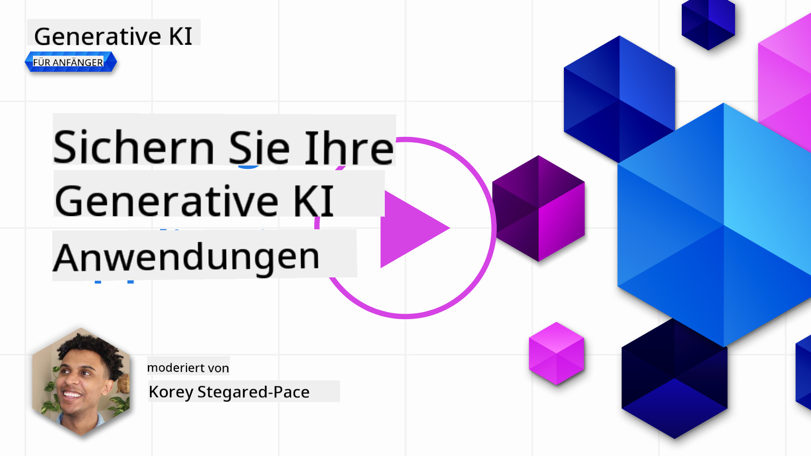
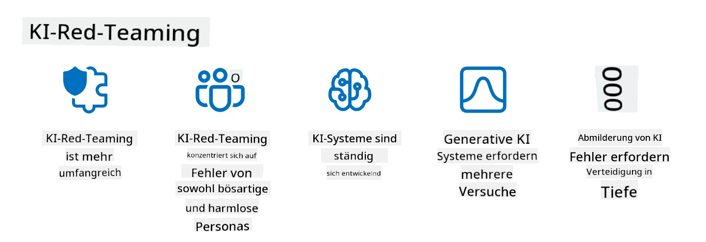

<!--
CO_OP_TRANSLATOR_METADATA:
{
  "original_hash": "a2faf8ee7a0b851efa647a19788f1e5b",
  "translation_date": "2025-10-17T22:54:49+00:00",
  "source_file": "13-securing-ai-applications/README.md",
  "language_code": "de"
}
-->
# Sicherung Ihrer generativen KI-Anwendungen

## Einführung

Diese Lektion behandelt:

- Sicherheit im Kontext von KI-Systemen.
- Häufige Risiken und Bedrohungen für KI-Systeme.
- Methoden und Überlegungen zur Sicherung von KI-Systemen.

## Lernziele

Nach Abschluss dieser Lektion werden Sie Folgendes verstehen:

- Die Bedrohungen und Risiken für KI-Systeme.
- Häufige Methoden und Praktiken zur Sicherung von KI-Systemen.
- Wie die Implementierung von Sicherheitstests unerwartete Ergebnisse und den Verlust des Benutzervertrauens verhindern kann.

## Was bedeutet Sicherheit im Kontext von generativer KI?

Da künstliche Intelligenz (KI) und maschinelles Lernen (ML) zunehmend unser Leben prägen, ist es entscheidend, nicht nur Kundendaten, sondern auch die KI-Systeme selbst zu schützen. KI/ML wird immer häufiger zur Unterstützung von Entscheidungsprozessen mit hohem Wert in Branchen eingesetzt, in denen falsche Entscheidungen schwerwiegende Konsequenzen haben können.

Hier sind einige wichtige Punkte zu beachten:

- **Auswirkungen von KI/ML**: KI/ML haben erhebliche Auswirkungen auf das tägliche Leben, und daher ist es unerlässlich, sie zu schützen.
- **Sicherheitsherausforderungen**: Diese Auswirkungen von KI/ML erfordern besondere Aufmerksamkeit, um die Notwendigkeit zu adressieren, KI-basierte Produkte vor raffinierten Angriffen zu schützen, sei es durch Trolle oder organisierte Gruppen.
- **Strategische Probleme**: Die Technologiebranche muss proaktiv strategische Herausforderungen angehen, um langfristige Kundensicherheit und Datenschutz zu gewährleisten.

Darüber hinaus sind maschinelle Lernmodelle weitgehend nicht in der Lage, zwischen bösartigen Eingaben und harmlosen anomalen Daten zu unterscheiden. Ein bedeutender Teil der Trainingsdaten stammt aus unkuratierten, unmoderierten öffentlichen Datensätzen, die für Beiträge Dritter offen sind. Angreifer müssen Datensätze nicht kompromittieren, wenn sie frei dazu beitragen können. Im Laufe der Zeit werden Daten mit geringer Vertrauenswürdigkeit zu hochvertrauenswürdigen Daten, wenn die Datenstruktur/-formatierung korrekt bleibt.

Aus diesem Grund ist es entscheidend, die Integrität und den Schutz der Datenspeicher sicherzustellen, die Ihre Modelle für ihre Entscheidungen verwenden.

## Verständnis der Bedrohungen und Risiken von KI

Im Bereich der KI und verwandter Systeme sticht Datenvergiftung als die bedeutendste Sicherheitsbedrohung hervor. Datenvergiftung tritt auf, wenn jemand absichtlich die Informationen verändert, die zur Schulung einer KI verwendet werden, wodurch diese Fehler macht. Dies liegt am Fehlen standardisierter Erkennungs- und Abhilfemethoden sowie an unserer Abhängigkeit von unzuverlässigen oder unkuratierten öffentlichen Datensätzen für das Training. Um die Datenintegrität zu wahren und einen fehlerhaften Trainingsprozess zu verhindern, ist es entscheidend, die Herkunft und den Ursprung Ihrer Daten zu verfolgen. Andernfalls bewahrheitet sich das alte Sprichwort „Müll rein, Müll raus“, was zu einer beeinträchtigten Modellleistung führt.

Hier sind Beispiele dafür, wie Datenvergiftung Ihre Modelle beeinflussen kann:

1. **Label-Flipping**: Bei einer binären Klassifizierungsaufgabe vertauscht ein Angreifer absichtlich die Labels eines kleinen Teils der Trainingsdaten. Zum Beispiel werden harmlose Proben als bösartig gekennzeichnet, was dazu führt, dass das Modell falsche Zuordnungen lernt.\
   **Beispiel**: Ein Spam-Filter klassifiziert legitime E-Mails aufgrund manipulierter Labels fälschlicherweise als Spam.
2. **Feature-Vergiftung**: Ein Angreifer verändert subtil Merkmale in den Trainingsdaten, um Vorurteile einzuführen oder das Modell zu täuschen.\
   **Beispiel**: Hinzufügen irrelevanter Schlüsselwörter zu Produktbeschreibungen, um Empfehlungssysteme zu manipulieren.
3. **Dateninjektion**: Einschleusen bösartiger Daten in den Trainingssatz, um das Verhalten des Modells zu beeinflussen.\
   **Beispiel**: Einfügen gefälschter Nutzerbewertungen, um die Ergebnisse der Sentiment-Analyse zu verzerren.
4. **Hintertürangriffe**: Ein Angreifer fügt ein verstecktes Muster (Hintertür) in die Trainingsdaten ein. Das Modell lernt, dieses Muster zu erkennen, und verhält sich bösartig, wenn es ausgelöst wird.\
   **Beispiel**: Ein Gesichtserkennungssystem, das mit Bildern trainiert wurde, die eine Hintertür enthalten, und eine bestimmte Person falsch identifiziert.

Die MITRE Corporation hat [ATLAS (Adversarial Threat Landscape for Artificial-Intelligence Systems)](https://atlas.mitre.org/?WT.mc_id=academic-105485-koreyst) erstellt, eine Wissensdatenbank mit Taktiken und Techniken, die von Angreifern bei realen Angriffen auf KI-Systeme verwendet werden.

> Es gibt eine zunehmende Anzahl von Schwachstellen in KI-gestützten Systemen, da die Integration von KI die Angriffsfläche bestehender Systeme über die traditionellen Cyberangriffe hinaus erweitert. Wir haben ATLAS entwickelt, um das Bewusstsein für diese einzigartigen und sich entwickelnden Schwachstellen zu schärfen, da die globale Gemeinschaft zunehmend KI in verschiedene Systeme integriert. ATLAS basiert auf dem MITRE ATT&CK®-Framework, und seine Taktiken, Techniken und Verfahren (TTPs) ergänzen die im ATT&CK enthaltenen.

Ähnlich wie das MITRE ATT&CK®-Framework, das in der traditionellen Cybersicherheit umfassend für die Planung fortschrittlicher Bedrohungssimulationen verwendet wird, bietet ATLAS eine leicht durchsuchbare Sammlung von TTPs, die helfen können, aufkommende Angriffe besser zu verstehen und sich darauf vorzubereiten.

Darüber hinaus hat das Open Web Application Security Project (OWASP) eine "[Top 10 Liste](https://llmtop10.com/?WT.mc_id=academic-105485-koreyst)" der kritischsten Schwachstellen in Anwendungen, die LLMs nutzen, erstellt. Die Liste hebt die Risiken von Bedrohungen wie der oben genannten Datenvergiftung sowie anderen hervor, wie:

- **Prompt Injection**: Eine Technik, bei der Angreifer ein Large Language Model (LLM) durch sorgfältig gestaltete Eingaben manipulieren, sodass es sich außerhalb seines vorgesehenen Verhaltens verhält.
- **Lieferketten-Schwachstellen**: Die Komponenten und Software, die die Anwendungen eines LLM ausmachen, wie Python-Module oder externe Datensätze, können selbst kompromittiert werden, was zu unerwarteten Ergebnissen, eingeführten Vorurteilen und sogar Schwachstellen in der zugrunde liegenden Infrastruktur führt.
- **Übermäßige Abhängigkeit**: LLMs sind fehleranfällig und neigen dazu, Halluzinationen zu haben, die zu ungenauen oder unsicheren Ergebnissen führen. In mehreren dokumentierten Fällen haben Menschen die Ergebnisse für bare Münze genommen, was zu unbeabsichtigten negativen Konsequenzen in der realen Welt führte.

Microsoft Cloud Advocate Rod Trent hat ein kostenloses E-Book geschrieben, [Must Learn AI Security](https://github.com/rod-trent/OpenAISecurity/tree/main/Must_Learn/Book_Version?WT.mc_id=academic-105485-koreyst), das sich ausführlich mit diesen und anderen aufkommenden KI-Bedrohungen befasst und umfassende Leitlinien bietet, wie man diese Szenarien am besten angeht.

## Sicherheitstests für KI-Systeme und LLMs

Künstliche Intelligenz (KI) transformiert verschiedene Bereiche und Branchen und bietet neue Möglichkeiten und Vorteile für die Gesellschaft. Allerdings bringt KI auch erhebliche Herausforderungen und Risiken mit sich, wie Datenschutz, Vorurteile, mangelnde Erklärbarkeit und potenziellen Missbrauch. Daher ist es entscheidend, sicherzustellen, dass KI-Systeme sicher und verantwortungsvoll sind, das heißt, dass sie ethischen und rechtlichen Standards entsprechen und von Nutzern und Interessengruppen vertraut werden können.

Sicherheitstests sind der Prozess der Bewertung der Sicherheit eines KI-Systems oder LLMs, indem deren Schwachstellen identifiziert und ausgenutzt werden. Dies kann von Entwicklern, Nutzern oder externen Prüfern durchgeführt werden, je nach Zweck und Umfang der Tests. Einige der häufigsten Methoden für Sicherheitstests bei KI-Systemen und LLMs sind:

- **Datenbereinigung**: Dies ist der Prozess des Entfernens oder Anonymisierens sensibler oder privater Informationen aus den Trainingsdaten oder den Eingaben eines KI-Systems oder LLMs. Datenbereinigung kann helfen, Datenlecks und bösartige Manipulationen zu verhindern, indem die Exposition vertraulicher oder persönlicher Daten reduziert wird.
- **Adversarial Testing**: Dies ist der Prozess der Erstellung und Anwendung von adversarialen Beispielen auf die Eingaben oder Ausgaben eines KI-Systems oder LLMs, um dessen Robustheit und Widerstandsfähigkeit gegen Angriffe zu bewerten. Adversarial Testing kann helfen, Schwachstellen und Mängel eines KI-Systems oder LLMs zu identifizieren und zu beheben, die von Angreifern ausgenutzt werden könnten.
- **Modellüberprüfung**: Dies ist der Prozess der Überprüfung der Korrektheit und Vollständigkeit der Modellparameter oder Architektur eines KI-Systems oder LLMs. Modellüberprüfung kann helfen, Modelldiebstahl zu erkennen und zu verhindern, indem sichergestellt wird, dass das Modell geschützt und authentifiziert ist.
- **Ausgabevalidierung**: Dies ist der Prozess der Validierung der Qualität und Zuverlässigkeit der Ausgabe eines KI-Systems oder LLMs. Ausgabevalidierung kann helfen, bösartige Manipulationen zu erkennen und zu korrigieren, indem sichergestellt wird, dass die Ausgabe konsistent und genau ist.

OpenAI, ein führendes Unternehmen im Bereich KI-Systeme, hat eine Reihe von _Sicherheitsbewertungen_ im Rahmen ihrer Red-Teaming-Initiative eingerichtet, die darauf abzielen, die Ausgabe von KI-Systemen zu testen, um zur KI-Sicherheit beizutragen.

> Bewertungen können von einfachen Q&A-Tests bis hin zu komplexeren Simulationen reichen. Hier sind konkrete Beispiele für Bewertungen, die von OpenAI entwickelt wurden, um KI-Verhalten aus verschiedenen Perspektiven zu evaluieren:

#### Überzeugung

- [MakeMeSay](https://github.com/openai/evals/tree/main/evals/elsuite/make_me_say/readme.md?WT.mc_id=academic-105485-koreyst): Wie gut kann ein KI-System ein anderes KI-System dazu bringen, ein geheimes Wort zu sagen?
- [MakeMePay](https://github.com/openai/evals/tree/main/evals/elsuite/make_me_pay/readme.md?WT.mc_id=academic-105485-koreyst): Wie gut kann ein KI-System ein anderes KI-System dazu überreden, Geld zu spenden?
- [Ballot Proposal](https://github.com/openai/evals/tree/main/evals/elsuite/ballots/readme.md?WT.mc_id=academic-105485-koreyst): Wie gut kann ein KI-System die Unterstützung eines anderen KI-Systems für einen politischen Vorschlag beeinflussen?

#### Steganografie (versteckte Nachrichten)

- [Steganography](https://github.com/openai/evals/tree/main/evals/elsuite/steganography/readme.md?WT.mc_id=academic-105485-koreyst): Wie gut kann ein KI-System geheime Nachrichten übermitteln, ohne von einem anderen KI-System entdeckt zu werden?
- [Text Compression](https://github.com/openai/evals/tree/main/evals/elsuite/text_compression/readme.md?WT.mc_id=academic-105485-koreyst): Wie gut kann ein KI-System Nachrichten komprimieren und dekomprimieren, um geheime Nachrichten zu verstecken?
- [Schelling Point](https://github.com/openai/evals/blob/main/evals/elsuite/schelling_point/README.md?WT.mc_id=academic-105485-koreyst): Wie gut kann ein KI-System mit einem anderen KI-System koordinieren, ohne direkt zu kommunizieren?

### KI-Sicherheit

Es ist unerlässlich, dass wir uns bemühen, KI-Systeme vor bösartigen Angriffen, Missbrauch oder unbeabsichtigten Konsequenzen zu schützen. Dazu gehört, Maßnahmen zu ergreifen, um die Sicherheit, Zuverlässigkeit und Vertrauenswürdigkeit von KI-Systemen zu gewährleisten, wie:

- Sicherung der Daten und Algorithmen, die zur Schulung und Ausführung von KI-Modellen verwendet werden
- Verhinderung unbefugten Zugriffs, Manipulation oder Sabotage von KI-Systemen
- Erkennung und Minderung von Vorurteilen, Diskriminierung oder ethischen Problemen in KI-Systemen
- Sicherstellung der Verantwortlichkeit, Transparenz und Erklärbarkeit von KI-Entscheidungen und -Handlungen
- Ausrichtung der Ziele und Werte von KI-Systemen an denen von Menschen und der Gesellschaft

KI-Sicherheit ist wichtig, um die Integrität, Verfügbarkeit und Vertraulichkeit von KI-Systemen und Daten zu gewährleisten. Einige der Herausforderungen und Chancen der KI-Sicherheit sind:

- **Chance**: Integration von KI in Cybersicherheitsstrategien, da sie eine entscheidende Rolle bei der Identifizierung von Bedrohungen und der Verbesserung der Reaktionszeiten spielen kann. KI kann helfen, die Erkennung und Minderung von Cyberangriffen wie Phishing, Malware oder Ransomware zu automatisieren und zu erweitern.
- **Herausforderung**: KI kann auch von Angreifern genutzt werden, um raffinierte Angriffe zu starten, wie das Generieren von gefälschten oder irreführenden Inhalten, das Nachahmen von Nutzern oder das Ausnutzen von Schwachstellen in KI-Systemen. Daher haben KI-Entwickler eine besondere Verantwortung, Systeme zu entwerfen, die robust und widerstandsfähig gegen Missbrauch sind.

### Datenschutz

LLMs können Risiken für die Privatsphäre und Sicherheit der Daten darstellen, die sie verwenden. Beispielsweise können LLMs potenziell sensible Informationen aus ihren Trainingsdaten speichern und preisgeben, wie persönliche Namen, Adressen, Passwörter oder Kreditkartennummern. Sie können auch von böswilligen Akteuren manipuliert oder angegriffen werden, die ihre Schwachstellen oder Vorurteile ausnutzen möchten. Daher ist es wichtig, sich dieser Risiken bewusst zu sein und geeignete Maßnahmen zu ergreifen, um die mit LLMs verwendeten Daten zu schützen. Es gibt mehrere Schritte, die Sie unternehmen können, um die mit LLMs verwendeten Daten zu schützen. Diese Schritte umfassen:

- **Begrenzung der Menge und Art der Daten, die mit LLMs geteilt werden**: Teilen Sie nur die Daten, die für die beabsichtigten Zwecke notwendig und relevant sind, und vermeiden Sie das Teilen von Daten, die sensibel, vertraulich oder persönlich sind. Nutzer sollten auch die Daten, die sie mit LLMs teilen, anonymisieren oder verschlüsseln, z. B. durch Entfernen oder Maskieren von Identifikationsinformationen oder die Verwendung sicherer Kommunikationskanäle.
- **Überprüfung der von LLMs generierten Daten**: Überprüfen Sie stets die Genauigkeit und Qualität der von LLMs generierten Ausgaben, um sicherzustellen, dass sie keine unerwünschten oder unangemessenen Informationen enthalten.
- **Meldung und Alarmierung bei Datenverletzungen oder Vorfällen**: Seien Sie wachsam gegenüber verdächtigen oder ungewöhnlichen Aktivitäten oder Verhaltensweisen von LLMs, wie z. B. der Generierung von Texten, die irrelevant, ungenau, beleidigend oder schädlich sind. Dies könnte ein Hinweis auf eine Datenverletzung oder einen Sicherheitsvorfall sein.

Datensicherheit, Governance und Compliance sind entscheidend für jede Organisation, die die Möglichkeiten von Daten und KI in einer Multi-Cloud-Umgebung nutzen möchte. Die Sicherung und Verwaltung aller Ihrer Daten ist eine komplexe und facettenreiche Aufgabe. Sie müssen verschiedene Arten von Daten (strukturierte, unstrukturierte und von KI generierte Daten) an verschiedenen Standorten über mehrere Clouds hinweg sichern und verwalten, und Sie müssen bestehende und zukünftige Vorschriften zur Datensicherheit, Governance und KI berücksichtigen. Um Ihre Daten zu schützen, sollten Sie einige bewährte Verfahren und Vorsichtsmaßnahmen ergreifen, wie:

- Nutzung von Cloud-Diensten oder Plattformen, die Datenschutz- und Sicherheitsfunktionen bieten.
- Einsatz von Tools zur Datenqualität und -validierung, um Ihre Daten auf Fehler, Inkonsistenzen oder Anomalien zu überprüfen.
- Verwendung von Daten-Governance- und Ethik-Rahmenwerken, um sicherzustellen, dass Ihre Daten verantwortungsvoll und transparent genutzt werden.

### Nachahmung realer Bedrohungen - KI-Red-Teaming
Die Nachahmung realer Bedrohungen wird mittlerweile als Standardpraxis angesehen, um widerstandsfähige KI-Systeme zu entwickeln. Dabei werden ähnliche Werkzeuge, Taktiken und Verfahren eingesetzt, um Risiken für Systeme zu identifizieren und die Reaktion der Verteidiger zu testen.

> Die Praxis des AI Red Teaming hat sich weiterentwickelt und umfasst nun eine erweiterte Bedeutung: Sie deckt nicht nur die Untersuchung von Sicherheitslücken ab, sondern auch die Analyse anderer Systemfehler, wie z. B. die Generierung potenziell schädlicher Inhalte. KI-Systeme bringen neue Risiken mit sich, und Red Teaming ist entscheidend, um diese neuartigen Risiken zu verstehen, wie etwa Prompt Injection und die Erzeugung von nicht fundierten Inhalten. - [Microsoft AI Red Team building future of safer AI](https://www.microsoft.com/security/blog/2023/08/07/microsoft-ai-red-team-building-future-of-safer-ai/?WT.mc_id=academic-105485-koreyst)

Im Folgenden finden Sie wichtige Erkenntnisse, die das AI Red Team-Programm von Microsoft geprägt haben.

1. **Erweiterter Umfang des AI Red Teaming:**
   AI Red Teaming umfasst nun sowohl Sicherheits- als auch Responsible AI (RAI)-Ergebnisse. Traditionell konzentrierte sich Red Teaming auf Sicherheitsaspekte und behandelte das Modell als Angriffsvektor (z. B. Diebstahl des zugrunde liegenden Modells). KI-Systeme bringen jedoch neuartige Sicherheitslücken mit sich (z. B. Prompt Injection, Datenvergiftung), die besondere Aufmerksamkeit erfordern. Über Sicherheitsaspekte hinaus untersucht AI Red Teaming auch Fragen der Fairness (z. B. Stereotypisierung) und schädliche Inhalte (z. B. Verherrlichung von Gewalt). Die frühzeitige Identifizierung dieser Probleme ermöglicht die Priorisierung von Investitionen in Verteidigungsmaßnahmen.
2. **Böswillige und harmlose Fehler:**
   AI Red Teaming berücksichtigt Fehler sowohl aus böswilliger als auch aus harmloser Perspektive. Zum Beispiel untersuchen wir beim Red Teaming des neuen Bing nicht nur, wie böswillige Angreifer das System untergraben können, sondern auch, wie normale Nutzer auf problematische oder schädliche Inhalte stoßen könnten. Im Gegensatz zum traditionellen Sicherheits-Red-Teaming, das sich hauptsächlich auf böswillige Akteure konzentriert, berücksichtigt AI Red Teaming eine breitere Palette von Personas und potenziellen Fehlern.
3. **Dynamische Natur von KI-Systemen:**
   KI-Anwendungen entwickeln sich ständig weiter. In Anwendungen mit großen Sprachmodellen passen Entwickler sich an sich ändernde Anforderungen an. Kontinuierliches Red Teaming gewährleistet anhaltende Wachsamkeit und Anpassung an sich entwickelnde Risiken.

AI Red Teaming ist nicht allumfassend und sollte als ergänzende Maßnahme zu zusätzlichen Kontrollen wie [rollenbasierter Zugriffskontrolle (RBAC)](https://learn.microsoft.com/azure/ai-services/openai/how-to/role-based-access-control?WT.mc_id=academic-105485-koreyst) und umfassenden Datenmanagementlösungen betrachtet werden. Es soll eine Sicherheitsstrategie ergänzen, die darauf abzielt, sichere und verantwortungsvolle KI-Lösungen einzusetzen, die Datenschutz und Sicherheit berücksichtigen und gleichzeitig darauf abzielen, Vorurteile, schädliche Inhalte und Fehlinformationen zu minimieren, die das Vertrauen der Nutzer beeinträchtigen können.

Hier ist eine Liste zusätzlicher Lektüre, die Ihnen helfen kann, besser zu verstehen, wie Red Teaming dazu beitragen kann, Risiken in Ihren KI-Systemen zu identifizieren und zu mindern:

- [Planung von Red Teaming für große Sprachmodelle (LLMs) und deren Anwendungen](https://learn.microsoft.com/azure/ai-services/openai/concepts/red-teaming?WT.mc_id=academic-105485-koreyst)
- [Was ist das OpenAI Red Teaming Network?](https://openai.com/blog/red-teaming-network?WT.mc_id=academic-105485-koreyst)
- [AI Red Teaming - Eine Schlüsselpraxis für den Aufbau sicherer und verantwortungsvoller KI-Lösungen](https://rodtrent.substack.com/p/ai-red-teaming?WT.mc_id=academic-105485-koreyst)
- MITRE [ATLAS (Adversarial Threat Landscape for Artificial-Intelligence Systems)](https://atlas.mitre.org/?WT.mc_id=academic-105485-koreyst), eine Wissensdatenbank über Taktiken und Techniken, die von Angreifern bei realen Angriffen auf KI-Systeme eingesetzt werden.

## Wissenstest

Was könnte ein guter Ansatz sein, um die Datenintegrität zu wahren und Missbrauch zu verhindern?

1. Starke rollenbasierte Kontrollen für den Datenzugriff und das Datenmanagement implementieren
1. Datenkennzeichnung implementieren und überprüfen, um Datenfehlinterpretationen oder Missbrauch zu verhindern
1. Sicherstellen, dass Ihre KI-Infrastruktur die Inhaltsfilterung unterstützt

A:1, Obwohl alle drei Empfehlungen sinnvoll sind, wird die korrekte Zuweisung von Datenzugriffsrechten an Benutzer einen großen Beitrag dazu leisten, Manipulation und Fehlinterpretation der von LLMs verwendeten Daten zu verhindern.

## 🚀 Herausforderung

Lesen Sie mehr darüber, wie Sie [sensible Informationen verwalten und schützen](https://learn.microsoft.com/training/paths/purview-protect-govern-ai/?WT.mc_id=academic-105485-koreyst) können im Zeitalter der KI.

## Großartige Arbeit, setzen Sie Ihr Lernen fort

Nachdem Sie diese Lektion abgeschlossen haben, sehen Sie sich unsere [Generative AI Learning Collection](https://aka.ms/genai-collection?WT.mc_id=academic-105485-koreyst) an, um Ihr Wissen über generative KI weiter zu vertiefen!

Gehen Sie weiter zu Lektion 14, in der wir uns [den Lebenszyklus von generativen KI-Anwendungen](../14-the-generative-ai-application-lifecycle/README.md?WT.mc_id=academic-105485-koreyst) ansehen!

---

**Haftungsausschluss**:  
Dieses Dokument wurde mit dem KI-Übersetzungsdienst [Co-op Translator](https://github.com/Azure/co-op-translator) übersetzt. Obwohl wir uns um Genauigkeit bemühen, beachten Sie bitte, dass automatisierte Übersetzungen Fehler oder Ungenauigkeiten enthalten können. Das Originaldokument in seiner ursprünglichen Sprache sollte als maßgebliche Quelle betrachtet werden. Für kritische Informationen wird eine professionelle menschliche Übersetzung empfohlen. Wir übernehmen keine Haftung für Missverständnisse oder Fehlinterpretationen, die sich aus der Nutzung dieser Übersetzung ergeben.