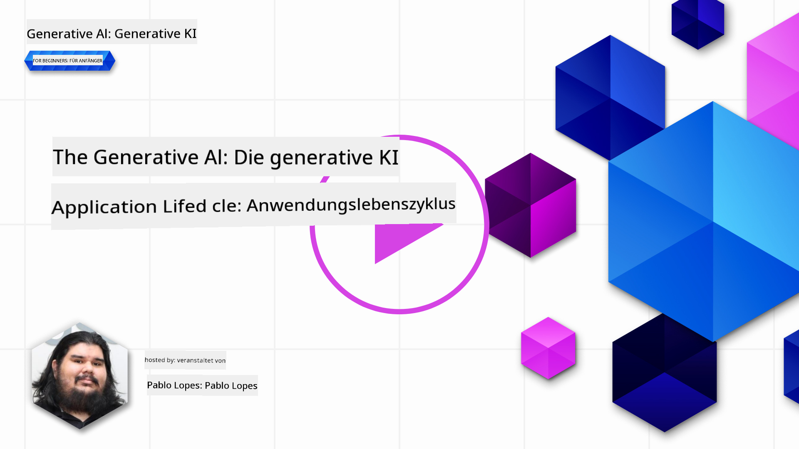
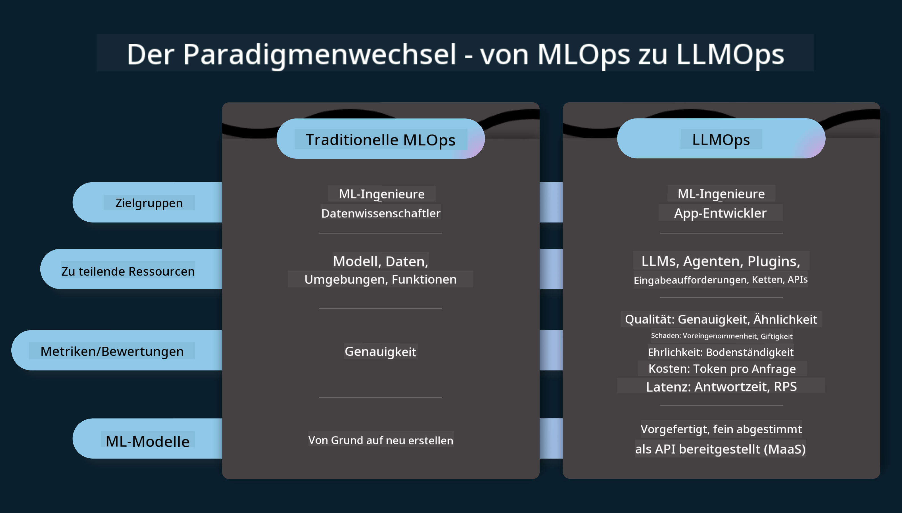
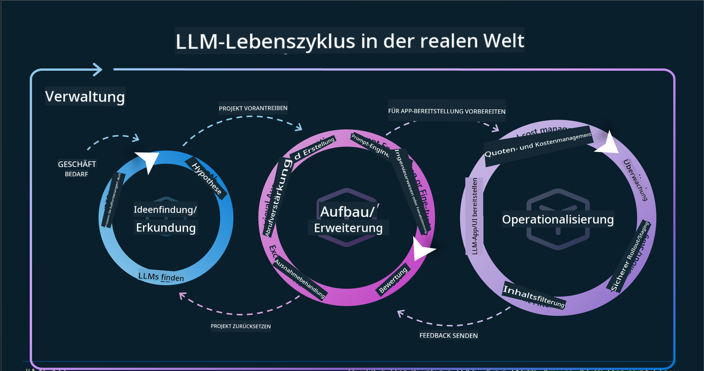
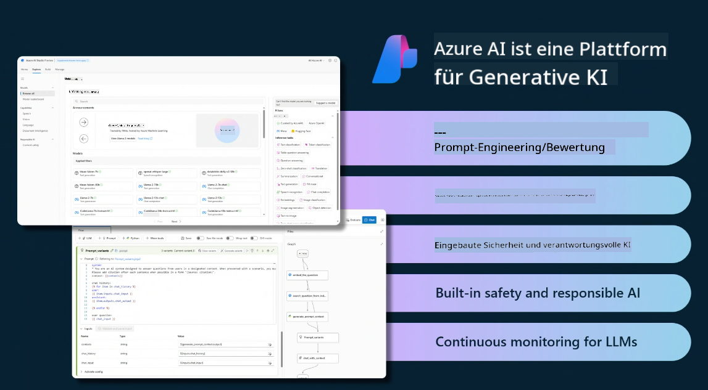
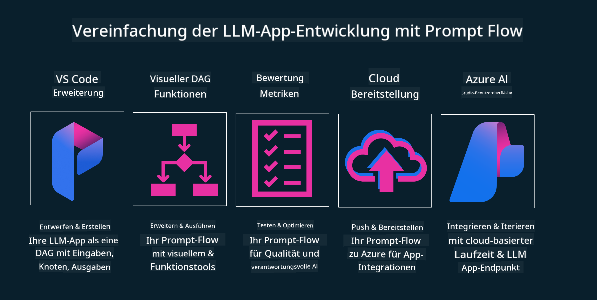

<!--
CO_OP_TRANSLATOR_METADATA:
{
  "original_hash": "27a5347a5022d5ef0a72ab029b03526a",
  "translation_date": "2025-05-19T23:18:45+00:00",
  "source_file": "14-the-generative-ai-application-lifecycle/README.md",
  "language_code": "de"
}
-->

# Der Lebenszyklus einer generativen KI-Anwendung

Eine wichtige Frage für alle KI-Anwendungen ist die Relevanz der KI-Funktionen, da KI ein sich schnell entwickelndes Feld ist. Um sicherzustellen, dass Ihre Anwendung relevant, zuverlässig und robust bleibt, müssen Sie sie kontinuierlich überwachen, bewerten und verbessern. Hier kommt der Lebenszyklus der generativen KI ins Spiel.

Der Lebenszyklus der generativen KI ist ein Rahmenwerk, das Sie durch die Phasen der Entwicklung, Bereitstellung und Wartung einer generativen KI-Anwendung führt. Es hilft Ihnen, Ihre Ziele zu definieren, Ihre Leistung zu messen, Ihre Herausforderungen zu identifizieren und Ihre Lösungen umzusetzen. Es hilft Ihnen auch, Ihre Anwendung mit den ethischen und rechtlichen Standards Ihres Bereichs und Ihrer Interessengruppen in Einklang zu bringen. Indem Sie dem Lebenszyklus der generativen KI folgen, können Sie sicherstellen, dass Ihre Anwendung immer einen Mehrwert liefert und Ihre Benutzer zufriedenstellt.

## Einführung

In diesem Kapitel werden Sie:

- Den Paradigmenwechsel von MLOps zu LLMOps verstehen
- Den LLM-Lebenszyklus kennenlernen
- Lebenszyklus-Tooling erkunden
- Lebenszyklus-Metrik und Bewertung analysieren

## Den Paradigmenwechsel von MLOps zu LLMOps verstehen

LLMs sind ein neues Werkzeug im Arsenal der Künstlichen Intelligenz. Sie sind unglaublich leistungsfähig bei Analyse- und Generierungsaufgaben für Anwendungen. Diese Macht hat jedoch einige Konsequenzen für die Rationalisierung von KI- und klassischen maschinellen Lernaufgaben.

Daher benötigen wir ein neues Paradigma, um dieses Werkzeug dynamisch und mit den richtigen Anreizen anzupassen. Wir können ältere KI-Apps als "ML-Apps" und neuere KI-Apps als "GenAI-Apps" oder einfach "AI-Apps" kategorisieren, was die zu der Zeit genutzte Mainstream-Technologie und -Techniken widerspiegelt. Dies verändert unsere Erzählweise auf verschiedene Weise. Betrachten Sie den folgenden Vergleich.

Beachten Sie, dass wir uns bei LLMOps mehr auf die App-Entwickler konzentrieren, indem wir Integrationen als Schlüsselpunkt nutzen, "Models-as-a-Service" verwenden und an die folgenden Punkte für Metriken denken.

- Qualität: Antwortqualität
- Schaden: Verantwortungsvolle KI
- Ehrlichkeit: Fundiertheit der Antwort (Ergibt das Sinn? Ist es korrekt?)
- Kosten: Budget der Lösung
- Latenz: Durchschnittszeit für Token-Antwort

## Der LLM-Lebenszyklus

Um den Lebenszyklus und die Änderungen zu verstehen, betrachten wir zunächst die folgende Infografik.

Wie Sie vielleicht bemerken, unterscheidet sich dies von den üblichen Lebenszyklen von MLOps. LLMs haben viele neue Anforderungen, wie Prompting, verschiedene Techniken zur Qualitätsverbesserung (Feinabstimmung, RAG, Meta-Prompts), unterschiedliche Bewertung und Verantwortung mit verantwortungsvoller KI, und schließlich neue Bewertungsmetriken (Qualität, Schaden, Ehrlichkeit, Kosten und Latenz).

Zum Beispiel schauen Sie sich an, wie wir Ideen entwickeln. Wir verwenden Prompt-Engineering, um mit verschiedenen LLMs zu experimentieren und Möglichkeiten zu erkunden, um zu testen, ob ihre Hypothesen korrekt sein könnten.

Beachten Sie, dass dies nicht linear ist, sondern integrierte Schleifen, iterativ und mit einem übergreifenden Zyklus.

Wie könnten wir diese Schritte erkunden? Lassen Sie uns im Detail betrachten, wie wir einen Lebenszyklus aufbauen könnten.

Dies mag etwas kompliziert erscheinen, konzentrieren wir uns zunächst auf die drei großen Schritte.

1. Ideenfindung/Erkundung: Exploration, hier können wir entsprechend unseren Geschäftsbedürfnissen erkunden. Prototyping, Erstellen eines [PromptFlow](https://microsoft.github.io/promptflow/index.html?WT.mc_id=academic-105485-koreyst) und Testen, ob es effizient genug für unsere Hypothese ist.
2. Aufbau/Erweiterung: Implementierung, jetzt beginnen wir mit der Bewertung für größere Datensätze und implementieren Techniken wie Feinabstimmung und RAG, um die Robustheit unserer Lösung zu überprüfen. Wenn dies nicht der Fall ist, könnte die erneute Implementierung, das Hinzufügen neuer Schritte in unserem Fluss oder die Umstrukturierung der Daten helfen. Nach dem Testen unseres Flusses und unserer Skalierung, wenn es funktioniert und unsere Metriken überprüft, ist es bereit für den nächsten Schritt.
3. Operationalisierung: Integration, jetzt fügen wir Überwachungs- und Alarmsysteme zu unserem System hinzu, Bereitstellung und Anwendungsintegration in unsere Anwendung.

Dann haben wir den übergreifenden Zyklus des Managements, der sich auf Sicherheit, Compliance und Governance konzentriert.

Herzlichen Glückwunsch, jetzt ist Ihre KI-App bereit und betriebsbereit. Für eine praktische Erfahrung werfen Sie einen Blick auf die [Contoso Chat Demo.](https://nitya.github.io/contoso-chat/?WT.mc_id=academic-105485-koreys)

Welche Tools könnten wir nun verwenden?

## Lebenszyklus-Tooling

Für Tooling stellt Microsoft die [Azure AI Platform](https://azure.microsoft.com/solutions/ai/?WT.mc_id=academic-105485-koreys) und [PromptFlow](https://microsoft.github.io/promptflow/index.html?WT.mc_id=academic-105485-koreyst) bereit, um Ihren Zyklus einfach zu implementieren und startklar zu machen.

Die [Azure AI Platform](https://azure.microsoft.com/solutions/ai/?WT.mc_id=academic-105485-koreys) ermöglicht es Ihnen, [AI Studio](https://ai.azure.com/?WT.mc_id=academic-105485-koreys) zu nutzen. AI Studio ist ein Webportal, das es Ihnen ermöglicht, Modelle, Beispiele und Tools zu erkunden. Verwalten Sie Ihre Ressourcen, UI-Entwicklungsflüsse und SDK/CLI-Optionen für Code-First-Entwicklung.

Azure AI ermöglicht es Ihnen, mehrere Ressourcen zu nutzen, um Ihre Operationen, Dienste, Projekte, Vektorsuche und Datenbankanforderungen zu verwalten.

Erstellen Sie von Proof-of-Concept(POC) bis hin zu groß angelegten Anwendungen mit PromptFlow:

- Entwerfen und Erstellen von Apps aus VS Code, mit visuellen und funktionalen Tools
- Testen und Feinabstimmen Ihrer Apps für hochwertige KI, mit Leichtigkeit.
- Verwenden Sie Azure AI Studio, um mit der Cloud zu integrieren und zu iterieren, Push und Deploy für eine schnelle Integration.

## Großartig! Setzen Sie Ihr Lernen fort!

Fantastisch, lernen Sie jetzt mehr darüber, wie wir eine Anwendung strukturieren, um die Konzepte mit der [Contoso Chat App](https://nitya.github.io/contoso-chat/?WT.mc_id=academic-105485-koreyst) zu nutzen, um zu sehen, wie Cloud Advocacy diese Konzepte in Demonstrationen einbringt. Für mehr Inhalte schauen Sie sich unsere [Ignite Breakout-Session an!
](https://www.youtube.com/watch?v=DdOylyrTOWg)

Schauen Sie sich nun Lektion 15 an, um zu verstehen, wie [Retrieval Augmented Generation und Vektordatenbanken](../15-rag-and-vector-databases/README.md?WT.mc_id=academic-105485-koreyst) die Generative KI beeinflussen und um ansprechendere Anwendungen zu erstellen!

**Haftungsausschluss**:  
Dieses Dokument wurde mit dem KI-Übersetzungsdienst [Co-op Translator](https://github.com/Azure/co-op-translator) übersetzt. Obwohl wir uns um Genauigkeit bemühen, beachten Sie bitte, dass automatisierte Übersetzungen Fehler oder Ungenauigkeiten enthalten können. Das Originaldokument in seiner ursprünglichen Sprache sollte als maßgebliche Quelle betrachtet werden. Für kritische Informationen wird eine professionelle menschliche Übersetzung empfohlen. Wir haften nicht für Missverständnisse oder Fehlinterpretationen, die sich aus der Nutzung dieser Übersetzung ergeben.