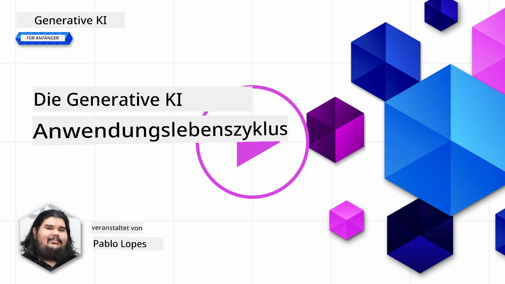
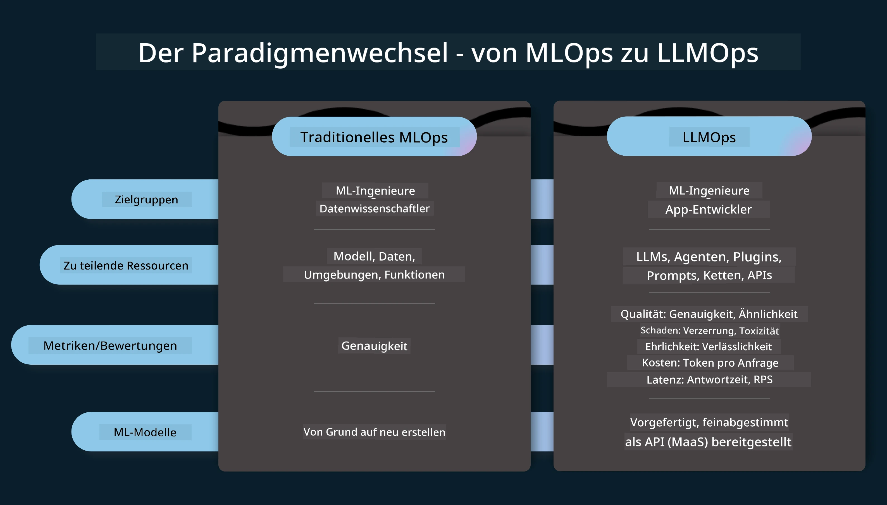
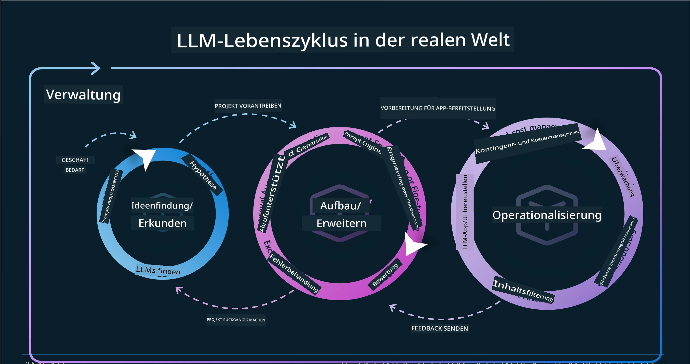
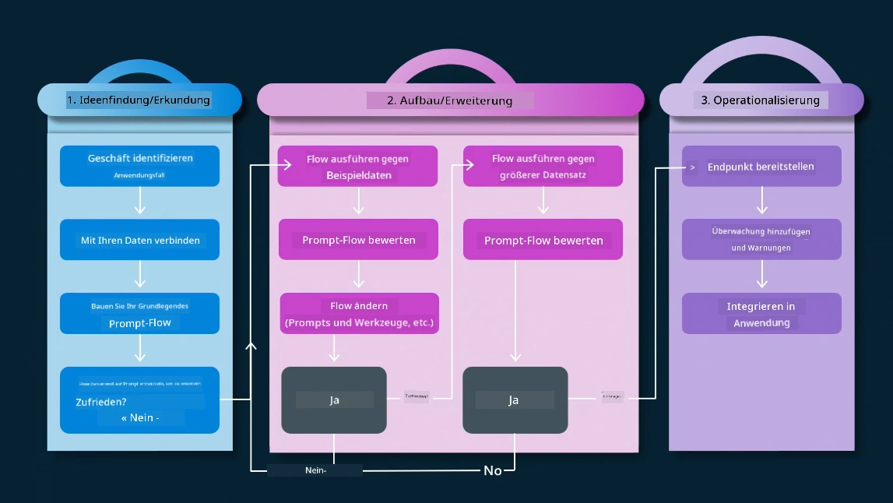
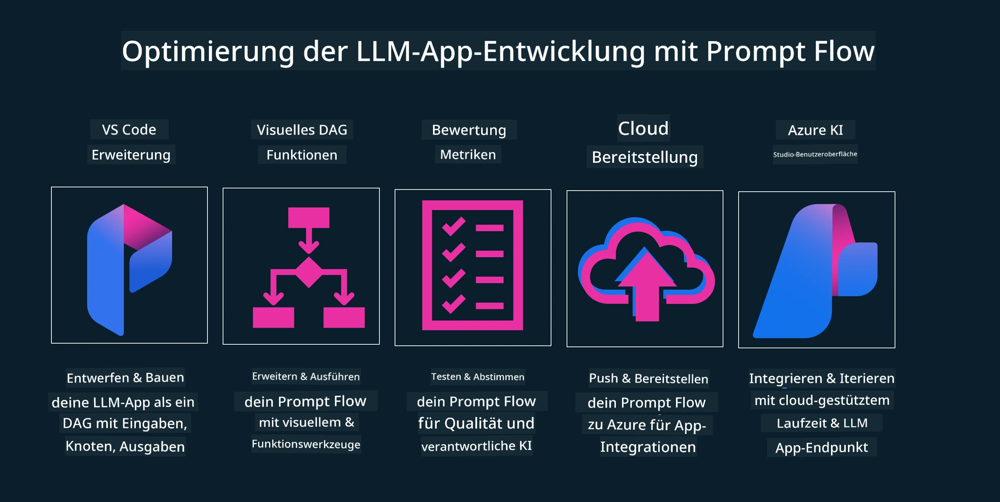

# Der Lebenszyklus von generativen KI-Anwendungen

Eine wichtige Frage für alle KI-Anwendungen ist die Relevanz von KI-Funktionen, da KI ein sich schnell entwickelndes Feld ist. Um sicherzustellen, dass Ihre Anwendung relevant, zuverlässig und robust bleibt, müssen Sie sie kontinuierlich überwachen, bewerten und verbessern. Hier kommt der Lebenszyklus der generativen KI ins Spiel.

Der Lebenszyklus der generativen KI ist ein Framework, das Sie durch die Phasen der Entwicklung, Bereitstellung und Wartung einer generativen KI-Anwendung führt. Es hilft Ihnen, Ihre Ziele zu definieren, Ihre Leistung zu messen, Ihre Herausforderungen zu identifizieren und Ihre Lösungen umzusetzen. Es unterstützt Sie auch dabei, Ihre Anwendung mit den ethischen und rechtlichen Standards Ihrer Domäne und Ihrer Stakeholder in Einklang zu bringen. Durch das Befolgen des Lebenszyklus der generativen KI können Sie sicherstellen, dass Ihre Anwendung stets Werte liefert und Ihre Nutzer zufriedenstellt.

## Einführung

In diesem Kapitel werden Sie:

- Den Paradigmenwechsel von MLOps zu LLMOps verstehen
- Den LLM-Lebenszyklus kennenlernen
- Lifecycle-Tools kennenlernen
- Die Metrifizierung und Bewertung des Lebenszyklus verstehen

## Den Paradigmenwechsel von MLOps zu LLMOps verstehen

LLMs sind ein neues Werkzeug im Arsenal der Künstlichen Intelligenz. Sie sind unglaublich leistungsfähig bei Analyse- und Generierungsaufgaben für Anwendungen, aber diese Leistung hat einige Konsequenzen hinsichtlich der Vereinfachung von KI- und klassischen Machine-Learning-Aufgaben.

Daher benötigen wir ein neues Paradigma, um dieses Werkzeug dynamisch mit den richtigen Anreizen anzupassen. Wir können ältere KI-Anwendungen als „ML Apps“ und neuere KI-Anwendungen als „GenAI Apps“ oder einfach „AI Apps“ kategorisieren, um die zu ihrer Zeit eingesetzte Mainstream-Technologie und -Techniken widerzuspiegeln. Dies verschiebt unsere Erzählweise auf verschiedene Weise, siehe den folgenden Vergleich.

Beachten Sie, dass wir bei LLMOps stärker auf die App-Entwickler fokussieren, Integrationen als Schlüsselpunkte nutzen, „Models-as-a-Service“ verwenden und die folgenden Punkte für Metriken berücksichtigen.

- Qualität: Antwortqualität
- Schaden: Verantwortungsbewusste KI
- Ehrlichkeit: Grundlegung der Antwort (Ergibt es Sinn? Ist es korrekt?)
- Kosten: Budget für die Lösung
- Latenz: Durchschnittliche Zeit pro Token-Antwort

## Der LLM-Lebenszyklus

Zuerst, um den Lebenszyklus und die Änderungen zu verstehen, beachten wir die folgende Infografik.

Wie Sie vielleicht bemerken, unterscheidet sich dieser von den üblichen Lebenszyklen von MLOps. LLMs haben viele neue Anforderungen, wie Prompting, verschiedene Techniken zur Qualitätsverbesserung (Fine-Tuning, RAG, Meta-Prompts), unterschiedliche Bewertung und Verantwortung im Sinne von verantwortungsvoller KI und schließlich neue Bewertungsmetriken (Qualität, Schaden, Ehrlichkeit, Kosten und Latenz).

Sehen Sie sich zum Beispiel an, wie wir Ideen entwickeln. Mithilfe von Prompt-Engineering experimentieren wir mit verschiedenen LLMs, um Möglichkeiten zu erkunden und zu testen, ob ihre Hypothesen korrekt sein könnten.

Beachten Sie, dass dies nicht linear, sondern integrierte Schleifen sind, iterativ und mit einem übergeordneten Zyklus.

Wie können wir diese Schritte erkunden? Lassen Sie uns im Detail betrachten, wie wir einen Lebenszyklus aufbauen könnten.

Das mag etwas kompliziert aussehen, konzentrieren wir uns zunächst auf die drei großen Schritte.

1. Ideenfindung/Erkundung: Exploration, hier können wir entsprechend unseren Geschäftsbedürfnissen erkunden, Prototypen erstellen, einen [PromptFlow](https://microsoft.github.io/promptflow/index.html?WT.mc_id=academic-105485-koreyst) anlegen und testen, ob er für unsere Hypothese effizient genug ist.
1. Aufbau/Erweiterung: Implementierung, jetzt beginnen wir damit, größere Datensätze zu bewerten, Techniken wie Fine-Tuning und RAG einzusetzen, um die Robustheit unserer Lösung zu prüfen. Falls nicht, kann eine Neuimplementierung, das Hinzufügen neuer Schritte im Flow oder eine Umstrukturierung der Daten helfen. Nach dem Testen unseres Ablaufs und unserer Skalierung, wenn es funktioniert und unsere Metriken stimmen, ist es bereit für den nächsten Schritt.
1. Operationalisierung: Integration, nun fügen wir unserem System Überwachungs- und Alarmsysteme hinzu, Deployment und Anwendungsintegration in unsere Applikation.

Dann haben wir den übergeordneten Management-Zyklus, der sich auf Sicherheit, Compliance und Governance konzentriert.

Herzlichen Glückwunsch, jetzt ist Ihre KI-Anwendung startklar und betriebsbereit. Für praktische Erfahrungen werfen Sie einen Blick auf die [Contoso Chat Demo.](https://nitya.github.io/contoso-chat/?WT.mc_id=academic-105485-koreyst)

Welche Werkzeuge können wir nun verwenden?

## Lifecycle-Tools

Für Tools bietet Microsoft die [Azure AI Platform](https://azure.microsoft.com/solutions/ai/?WT.mc_id=academic-105485-koreyst) und [PromptFlow](https://microsoft.github.io/promptflow/index.html?WT.mc_id=academic-105485-koreyst), die Ihren Zyklus erleichtern und einfach implementierbar machen.

Die [Azure AI Platform](https://azure.microsoft.com/solutions/ai/?WT.mc_id=academic-105485-koreyst) ermöglicht Ihnen die Nutzung von [AI Studio](https://ai.azure.com/?WT.mc_id=academic-105485-koreyst). AI Studio ist ein Webportal, das Ihnen das Erkunden von Modellen, Beispielen und Tools erlaubt. Verwaltung Ihrer Ressourcen, Entwicklung von UI-Workflows und SDK/CLI-Optionen für Code-First-Entwicklung.

Azure AI ermöglicht den Zugriff auf zahlreiche Ressourcen zur Verwaltung Ihrer Operationen, Dienste, Projekte, Vektorsuche und Datenbanken.

Bauen Sie Anwendungen vom Proof-of-Concept (PoC) bis hin zu großskaligen Anwendungen mit PromptFlow:

- Entwerfen und Entwickeln von Apps aus VS Code heraus, mit visuellen und funktionellen Tools
- Testen und Feintunen Ihrer Apps für qualitativ hochwertige KI, mit Leichtigkeit.
- Nutzen Sie Azure AI Studio zur Integration und Iteration mit Cloud, Push und Deployment für schnelle Integration.

## Großartig! Setzen Sie Ihr Lernen fort!

Fantastisch, lernen Sie jetzt mehr darüber, wie wir eine Anwendung strukturieren, um die Konzepte mit der [Contoso Chat App](https://nitya.github.io/contoso-chat/?WT.mc_id=academic-105485-koreyst) anzuwenden, und sehen Sie, wie Cloud Advocacy diese Konzepte in Demonstrationen einsetzt. Für weitere Inhalte sehen Sie sich unsere [Ignite Breakout-Session!](https://www.youtube.com/watch?v=DdOylyrTOWg) an.

Schauen Sie nun Lektion 15 an, um zu verstehen, wie [Retrieval Augmented Generation und Vektordatenbanken](../15-rag-and-vector-databases/README.md?WT.mc_id=academic-105485-koreyst) die generative KI beeinflussen und um ansprechendere Anwendungen zu erstellen!

---

<!-- CO-OP TRANSLATOR DISCLAIMER START -->
**Haftungsausschluss**:  
Dieses Dokument wurde mithilfe des KI-Übersetzungsdienstes [Co-op Translator](https://github.com/Azure/co-op-translator) übersetzt. Obwohl wir um Genauigkeit bemüht sind, sollten Sie beachten, dass automatisierte Übersetzungen Fehler oder Ungenauigkeiten enthalten können. Das Originaldokument in seiner Ursprungssprache gilt als maßgebliche Quelle. Für wichtige Informationen wird eine professionelle menschliche Übersetzung empfohlen. Wir übernehmen keine Haftung für Missverständnisse oder Fehlinterpretationen, die sich aus der Nutzung dieser Übersetzung ergeben.
<!-- CO-OP TRANSLATOR DISCLAIMER END -->