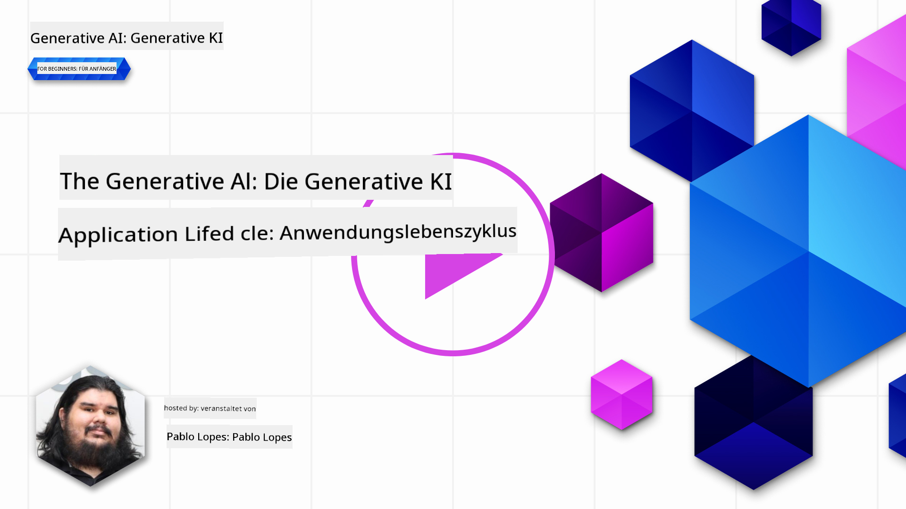
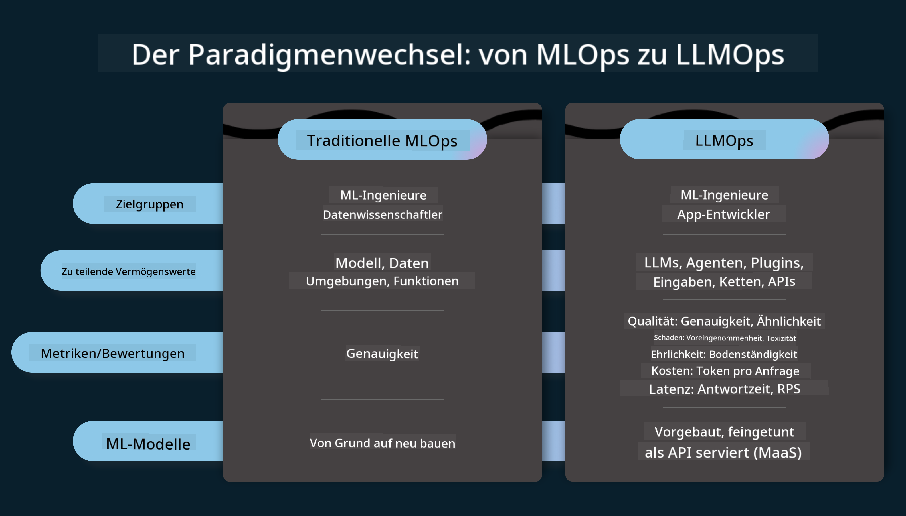
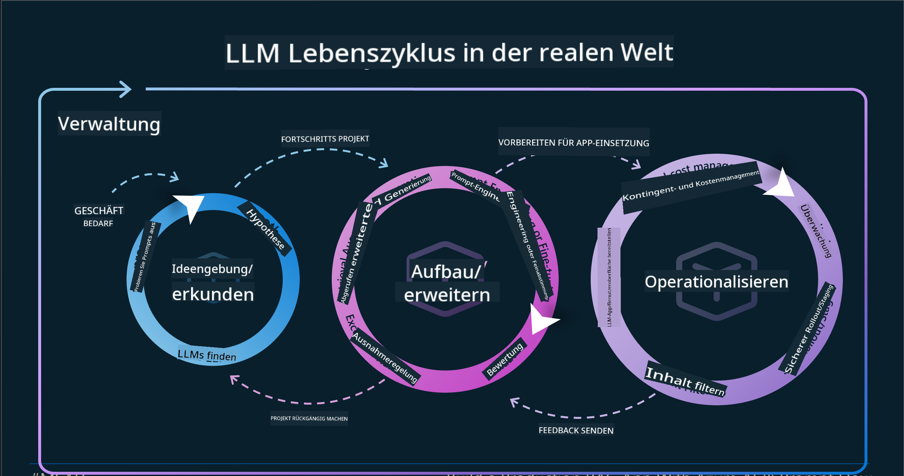
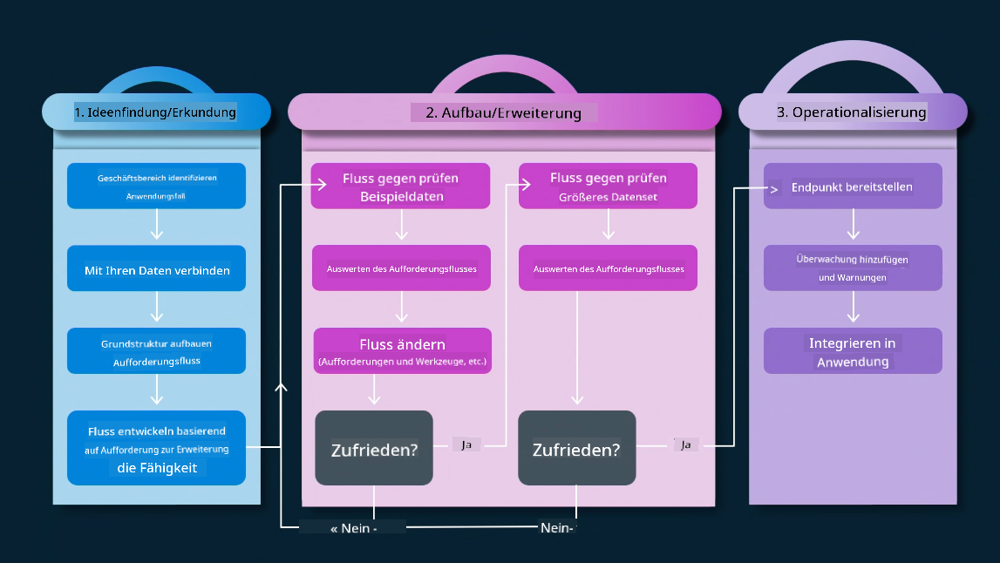
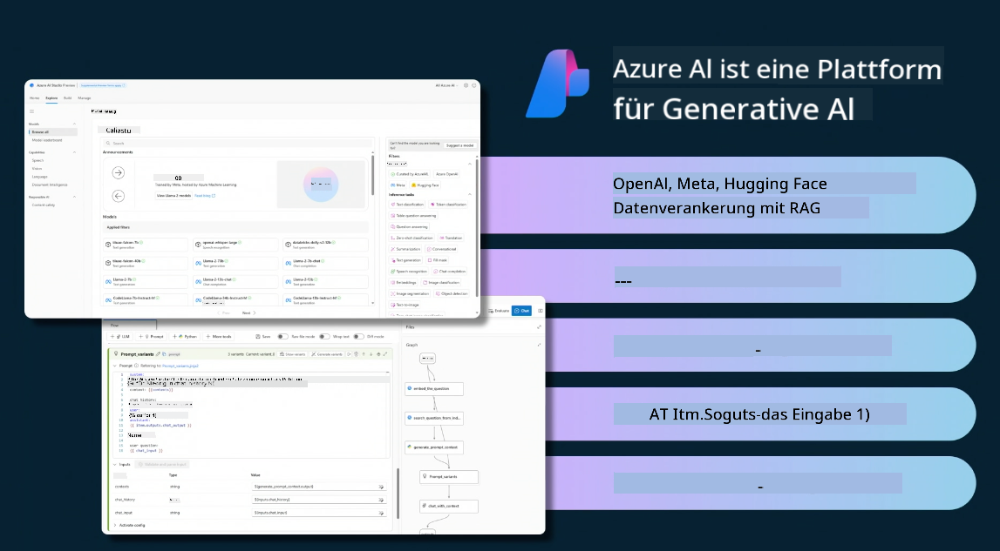
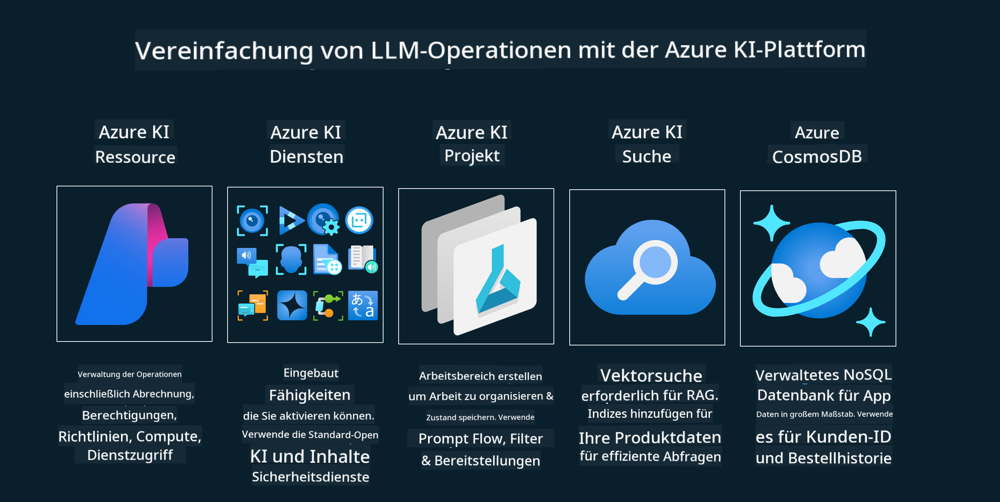
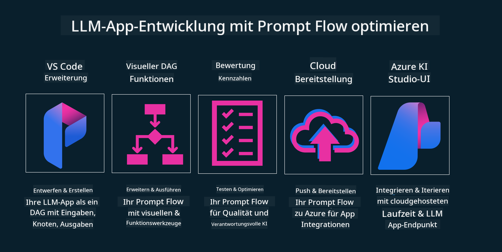

<!--
CO_OP_TRANSLATOR_METADATA:
{
  "original_hash": "27a5347a5022d5ef0a72ab029b03526a",
  "translation_date": "2025-06-25T21:54:18+00:00",
  "source_file": "14-the-generative-ai-application-lifecycle/README.md",
  "language_code": "de"
}
-->

# Der Lebenszyklus einer generativen KI-Anwendung

Eine wichtige Frage für alle KI-Anwendungen ist die Relevanz von KI-Funktionen, da KI ein sich schnell entwickelndes Feld ist. Um sicherzustellen, dass Ihre Anwendung relevant, zuverlässig und robust bleibt, müssen Sie sie kontinuierlich überwachen, bewerten und verbessern. Hier kommt der Lebenszyklus der generativen KI ins Spiel.

Der Lebenszyklus der generativen KI ist ein Rahmenwerk, das Sie durch die Phasen der Entwicklung, Bereitstellung und Wartung einer generativen KI-Anwendung führt. Es hilft Ihnen, Ihre Ziele zu definieren, Ihre Leistung zu messen, Ihre Herausforderungen zu identifizieren und Ihre Lösungen umzusetzen. Es hilft Ihnen auch, Ihre Anwendung mit den ethischen und rechtlichen Standards Ihres Fachgebiets und Ihrer Stakeholder in Einklang zu bringen. Indem Sie dem Lebenszyklus der generativen KI folgen, können Sie sicherstellen, dass Ihre Anwendung stets Mehrwert liefert und Ihre Nutzer zufriedenstellt.

## Einführung

In diesem Kapitel werden Sie:

- Den Paradigmenwechsel von MLOps zu LLMOps verstehen
- Den LLM-Lebenszyklus
- Werkzeuge für den Lebenszyklus
- Metrifizierung und Bewertung des Lebenszyklus

## Den Paradigmenwechsel von MLOps zu LLMOps verstehen

LLMs sind ein neues Werkzeug im Arsenal der Künstlichen Intelligenz. Sie sind unglaublich leistungsfähig bei Analyse- und Generierungsaufgaben für Anwendungen, jedoch hat diese Macht einige Konsequenzen, wie wir KI- und klassische maschinelle Lernaufgaben optimieren.

Daher benötigen wir ein neues Paradigma, um dieses Werkzeug dynamisch mit den richtigen Anreizen anzupassen. Wir können ältere KI-Apps als "ML Apps" und neuere KI-Apps als "GenAI Apps" oder einfach "AI Apps" kategorisieren, was die Mainstream-Technologie und -Techniken der jeweiligen Zeit widerspiegelt. Dies verändert unsere Erzählweise in mehrfacher Hinsicht, siehe folgenden Vergleich.

Beachten Sie, dass wir uns bei LLMOps mehr auf die App-Entwickler konzentrieren, Integrationen als Schlüsselpunkt verwenden, "Models-as-a-Service" nutzen und die folgenden Punkte für Metriken in Betracht ziehen.

- Qualität: Antwortqualität
- Schaden: Verantwortliche KI
- Ehrlichkeit: Begründetheit der Antwort (Ergibt es Sinn? Ist es korrekt?)
- Kosten: Lösungsbudget
- Latenz: Durchschnittliche Zeit für Token-Antwort

## Der LLM-Lebenszyklus

Zunächst, um den Lebenszyklus und die Modifikationen zu verstehen, beachten wir die nächste Infografik.

Wie Sie vielleicht bemerken, unterscheidet sich dies von den üblichen Lebenszyklen von MLOps. LLMs haben viele neue Anforderungen, wie Prompting, verschiedene Techniken zur Verbesserung der Qualität (Feinabstimmung, RAG, Meta-Prompts), unterschiedliche Bewertung und Verantwortung mit verantwortlicher KI, schließlich neue Bewertungsmetriken (Qualität, Schaden, Ehrlichkeit, Kosten und Latenz).

Zum Beispiel, schauen Sie sich an, wie wir Ideen entwickeln. Mit Prompt-Engineering experimentieren wir mit verschiedenen LLMs, um Möglichkeiten zu erkunden und zu testen, ob ihre Hypothese korrekt sein könnte.

Beachten Sie, dass dies nicht linear ist, sondern integrierte Schleifen, iterativ und mit einem übergeordneten Zyklus.

Wie könnten wir diese Schritte erkunden? Lassen Sie uns im Detail darauf eingehen, wie wir einen Lebenszyklus aufbauen könnten.

Dies mag etwas kompliziert erscheinen, konzentrieren wir uns zunächst auf die drei großen Schritte.

1. Ideenfindung/Erkundung: Erkundung, hier können wir entsprechend unseren geschäftlichen Bedürfnissen erkunden. Prototyping, Erstellen eines [PromptFlow](https://microsoft.github.io/promptflow/index.html?WT.mc_id=academic-105485-koreyst) und testen, ob es effizient genug für unsere Hypothese ist.
2. Aufbau/Erweiterung: Implementierung, jetzt beginnen wir mit der Bewertung größerer Datensätze und implementieren Techniken wie Feinabstimmung und RAG, um die Robustheit unserer Lösung zu überprüfen. Wenn dies nicht der Fall ist, könnte eine erneute Implementierung, das Hinzufügen neuer Schritte in unserem Ablauf oder die Umstrukturierung der Daten helfen. Nach dem Testen unseres Ablaufs und unserer Skalierung, wenn es funktioniert und wir unsere Metriken überprüfen, ist es bereit für den nächsten Schritt.
3. Operationalisierung: Integration, jetzt fügen wir unserem System Überwachungs- und Alarmsysteme hinzu, die Bereitstellung und Anwendungsintegration in unsere Anwendung.

Dann haben wir den übergeordneten Zyklus des Managements, der sich auf Sicherheit, Compliance und Governance konzentriert.

Herzlichen Glückwunsch, jetzt ist Ihre KI-App einsatzbereit und betriebsbereit. Für eine praktische Erfahrung werfen Sie einen Blick auf die [Contoso Chat Demo.](https://nitya.github.io/contoso-chat/?WT.mc_id=academic-105485-koreys)

Welche Werkzeuge könnten wir jetzt verwenden?

## Werkzeuge für den Lebenszyklus

Für Werkzeuge stellt Microsoft die [Azure AI Plattform](https://azure.microsoft.com/solutions/ai/?WT.mc_id=academic-105485-koreys) und [PromptFlow](https://microsoft.github.io/promptflow/index.html?WT.mc_id=academic-105485-koreyst) bereit, um Ihren Zyklus einfach zu implementieren und einsatzbereit zu machen.

Die [Azure AI Plattform](https://azure.microsoft.com/solutions/ai/?WT.mc_id=academic-105485-koreys) ermöglicht es Ihnen, [AI Studio](https://ai.azure.com/?WT.mc_id=academic-105485-koreys) zu nutzen. AI Studio ist ein Webportal, das Ihnen ermöglicht, Modelle, Beispiele und Werkzeuge zu erkunden. Verwaltung Ihrer Ressourcen, UI-Entwicklungsabläufe und SDK/CLI-Optionen für Code-First-Entwicklung.

Azure AI ermöglicht es Ihnen, mehrere Ressourcen zu nutzen, um Ihre Operationen, Dienstleistungen, Projekte, Vektorsuche und Datenbankbedürfnisse zu verwalten.

Konstruieren Sie von Proof-of-Concept (POC) bis hin zu groß angelegten Anwendungen mit PromptFlow:

- Entwerfen und Erstellen Sie Apps aus VS Code mit visuellen und funktionalen Tools
- Testen und optimieren Sie Ihre Apps für qualitativ hochwertige KI mit Leichtigkeit.
- Verwenden Sie Azure AI Studio zur Integration und Iteration mit der Cloud, Push und Bereitstellung für eine schnelle Integration.

## Großartig! Setzen Sie Ihr Lernen fort!

Erstaunlich, lernen Sie nun mehr darüber, wie wir eine Anwendung strukturieren, um die Konzepte mit der [Contoso Chat App](https://nitya.github.io/contoso-chat/?WT.mc_id=academic-105485-koreyst) zu verwenden, um zu sehen, wie Cloud Advocacy diese Konzepte in Demonstrationen einbringt. Für mehr Inhalte, schauen Sie sich unsere [Ignite-Breakout-Session an!
](https://www.youtube.com/watch?v=DdOylyrTOWg)

Schauen Sie sich nun Lektion 15 an, um zu verstehen, wie [Retrieval Augmented Generation und Vektordatenbanken](../15-rag-and-vector-databases/README.md?WT.mc_id=academic-105485-koreyst) die Generative KI beeinflussen und ansprechendere Anwendungen schaffen können!

**Haftungsausschluss**:  
Dieses Dokument wurde mit dem KI-Übersetzungsdienst [Co-op Translator](https://github.com/Azure/co-op-translator) übersetzt. Obwohl wir uns um Genauigkeit bemühen, beachten Sie bitte, dass automatisierte Übersetzungen Fehler oder Ungenauigkeiten enthalten können. Das Originaldokument in seiner ursprünglichen Sprache sollte als maßgebliche Quelle betrachtet werden. Für kritische Informationen wird eine professionelle menschliche Übersetzung empfohlen. Wir übernehmen keine Haftung für Missverständnisse oder Fehlinterpretationen, die sich aus der Nutzung dieser Übersetzung ergeben.