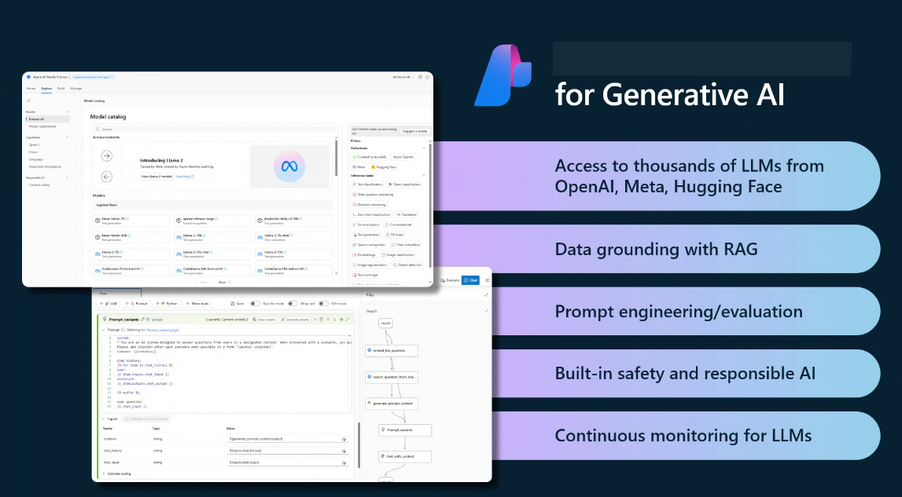

<!--
CO_OP_TRANSLATOR_METADATA:
{
  "original_hash": "df44972d5575ea8cef3c52ee31696d04",
  "translation_date": "2025-12-19T12:44:52+00:00",
  "source_file": "14-the-generative-ai-application-lifecycle/README.md",
  "language_code": "de"
}
-->

# Der Lebenszyklus von Generativen KI-Anwendungen

Eine wichtige Frage für alle KI-Anwendungen ist die Relevanz von KI-Funktionen, da KI ein sich schnell entwickelndes Feld ist. Um sicherzustellen, dass Ihre Anwendung relevant, zuverlässig und robust bleibt, müssen Sie sie kontinuierlich überwachen, bewerten und verbessern. Hier kommt der Lebenszyklus der generativen KI ins Spiel.

Der Lebenszyklus der generativen KI ist ein Rahmenwerk, das Sie durch die Phasen der Entwicklung, Bereitstellung und Wartung einer generativen KI-Anwendung führt. Er hilft Ihnen, Ihre Ziele zu definieren, Ihre Leistung zu messen, Ihre Herausforderungen zu identifizieren und Ihre Lösungen umzusetzen. Er hilft Ihnen auch, Ihre Anwendung mit den ethischen und rechtlichen Standards Ihres Bereichs und Ihrer Stakeholder in Einklang zu bringen. Indem Sie dem Lebenszyklus der generativen KI folgen, können Sie sicherstellen, dass Ihre Anwendung stets Wert liefert und Ihre Nutzer zufriedenstellt.

## Einführung

In diesem Kapitel werden Sie:

- Den Paradigmenwechsel von MLOps zu LLMOps verstehen
- Den LLM-Lebenszyklus kennenlernen
- Werkzeuge für den Lebenszyklus kennenlernen
- Metrifizierung und Bewertung des Lebenszyklus verstehen

## Den Paradigmenwechsel von MLOps zu LLMOps verstehen

LLMs sind ein neues Werkzeug im Arsenal der Künstlichen Intelligenz, sie sind unglaublich leistungsfähig bei Analyse- und Generierungsaufgaben für Anwendungen, jedoch hat diese Macht einige Konsequenzen dafür, wie wir KI- und klassische Machine-Learning-Aufgaben optimieren.

Daher benötigen wir ein neues Paradigma, um dieses Werkzeug dynamisch mit den richtigen Anreizen anzupassen. Wir können ältere KI-Anwendungen als „ML-Apps“ und neuere KI-Anwendungen als „GenAI-Apps“ oder einfach „KI-Apps“ kategorisieren, was die damals verwendete Mainstream-Technologie und -Techniken widerspiegelt. Dies verändert unsere Erzählweise auf vielfältige Weise, siehe den folgenden Vergleich.

Beachten Sie, dass wir bei LLMOps stärker auf die App-Entwickler fokussiert sind, Integrationen als Schlüsselpunkt nutzen, „Models-as-a-Service“ verwenden und bei den Metriken an folgende Punkte denken.

- Qualität: Antwortqualität
- Schaden: Verantwortungsvolle KI
- Ehrlichkeit: Fundiertheit der Antwort (Ergibt das Sinn? Ist es korrekt?)
- Kosten: Lösungskosten
- Latenz: Durchschnittliche Zeit für Token-Antwort

## Der LLM-Lebenszyklus

Zuerst, um den Lebenszyklus und die Änderungen zu verstehen, beachten wir die folgende Infografik.

Wie Sie vielleicht bemerken, unterscheidet sich dies von den üblichen Lebenszyklen bei MLOps. LLMs haben viele neue Anforderungen, wie Prompting, verschiedene Techniken zur Qualitätsverbesserung (Fine-Tuning, RAG, Meta-Prompts), unterschiedliche Bewertung und Verantwortung mit verantwortungsvoller KI, zuletzt neue Bewertungsmetriken (Qualität, Schaden, Ehrlichkeit, Kosten und Latenz).

Zum Beispiel sehen Sie, wie wir Ideen entwickeln. Mithilfe von Prompt Engineering experimentieren wir mit verschiedenen LLMs, um Möglichkeiten zu erkunden und zu testen, ob ihre Hypothese korrekt sein könnte.

Beachten Sie, dass dies nicht linear, sondern integrierte Schleifen, iterativ und mit einem übergeordneten Zyklus ist.

Wie könnten wir diese Schritte erkunden? Lassen Sie uns im Detail betrachten, wie wir einen Lebenszyklus aufbauen könnten.

Das mag etwas kompliziert erscheinen, konzentrieren wir uns zunächst auf die drei großen Schritte.

1. Ideenfindung/Erkundung: Exploration, hier können wir entsprechend unseren Geschäftsanforderungen erkunden. Prototyping, Erstellen eines [PromptFlow](https://microsoft.github.io/promptflow/index.html?WT.mc_id=academic-105485-koreyst) und testen, ob es für unsere Hypothese effizient genug ist.
1. Aufbau/Erweiterung: Implementierung, jetzt beginnen wir, größere Datensätze zu bewerten, Techniken wie Fine-Tuning und RAG anzuwenden, um die Robustheit unserer Lösung zu prüfen. Wenn dies nicht funktioniert, kann eine Neuimplementierung, das Hinzufügen neuer Schritte in unserem Ablauf oder die Umstrukturierung der Daten helfen. Nach dem Testen unseres Ablaufs und unserer Skalierung, wenn es funktioniert und unsere Metriken überprüft sind, ist es bereit für den nächsten Schritt.
1. Operationalisierung: Integration, jetzt fügen wir Überwachungs- und Alarmsysteme zu unserem System hinzu, Deployment und Anwendungsintegration in unsere Anwendung.

Dann haben wir den übergeordneten Management-Zyklus, der sich auf Sicherheit, Compliance und Governance konzentriert.

Herzlichen Glückwunsch, jetzt ist Ihre KI-App einsatzbereit und betriebsbereit. Für eine praktische Erfahrung werfen Sie einen Blick auf die [Contoso Chat Demo.](https://nitya.github.io/contoso-chat/?WT.mc_id=academic-105485-koreys)

Welche Werkzeuge könnten wir nun verwenden?

## Werkzeuge für den Lebenszyklus

Für Werkzeuge stellt Microsoft die [Azure AI Plattform](https://azure.microsoft.com/solutions/ai/?WT.mc_id=academic-105485-koreys) und [PromptFlow](https://microsoft.github.io/promptflow/index.html?WT.mc_id=academic-105485-koreyst) bereit, die Ihren Zyklus erleichtern und einfach umsetzbar machen.

Die [Azure AI Plattform](https://azure.microsoft.com/solutions/ai/?WT.mc_id=academic-105485-koreys) ermöglicht Ihnen die Nutzung von [AI Studio](https://ai.azure.com/?WT.mc_id=academic-105485-koreys). AI Studio ist ein Webportal, das Ihnen erlaubt, Modelle, Beispiele und Werkzeuge zu erkunden. Verwaltung Ihrer Ressourcen, UI-Entwicklungsabläufe und SDK/CLI-Optionen für Code-First-Entwicklung.

Azure AI ermöglicht Ihnen die Nutzung mehrerer Ressourcen, um Ihre Operationen, Dienste, Projekte, Vektorsuche und Datenbankbedürfnisse zu verwalten.

Erstellen Sie von Proof-of-Concept (POC) bis hin zu groß angelegten Anwendungen mit PromptFlow:

- Entwerfen und bauen Sie Apps aus VS Code mit visuellen und funktionalen Werkzeugen
- Testen und optimieren Sie Ihre Apps für qualitativ hochwertige KI mit Leichtigkeit.
- Nutzen Sie Azure AI Studio, um mit Cloud zu integrieren und zu iterieren, Push und Deployment für schnelle Integration.

## Großartig! Setzen Sie Ihr Lernen fort!

Fantastisch, lernen Sie jetzt mehr darüber, wie wir eine Anwendung strukturieren, um die Konzepte mit der [Contoso Chat App](https://nitya.github.io/contoso-chat/?WT.mc_id=academic-105485-koreyst) anzuwenden, um zu sehen, wie Cloud Advocacy diese Konzepte in Demonstrationen einbringt. Für mehr Inhalte sehen Sie sich unsere [Ignite Breakout-Session!](https://www.youtube.com/watch?v=DdOylyrTOWg) an.

Sehen Sie sich nun Lektion 15 an, um zu verstehen, wie [Retrieval Augmented Generation und Vektordatenbanken](../15-rag-and-vector-databases/README.md?WT.mc_id=academic-105485-koreyst) die Generative KI beeinflussen und um ansprechendere Anwendungen zu erstellen!

---

<!-- CO-OP TRANSLATOR DISCLAIMER START -->
**Haftungsausschluss**:  
Dieses Dokument wurde mit dem KI-Übersetzungsdienst [Co-op Translator](https://github.com/Azure/co-op-translator) übersetzt. Obwohl wir uns um Genauigkeit bemühen, beachten Sie bitte, dass automatisierte Übersetzungen Fehler oder Ungenauigkeiten enthalten können. Das Originaldokument in seiner Ursprungssprache ist als maßgebliche Quelle zu betrachten. Für wichtige Informationen wird eine professionelle menschliche Übersetzung empfohlen. Wir übernehmen keine Haftung für Missverständnisse oder Fehlinterpretationen, die aus der Nutzung dieser Übersetzung entstehen.
<!-- CO-OP TRANSLATOR DISCLAIMER END -->