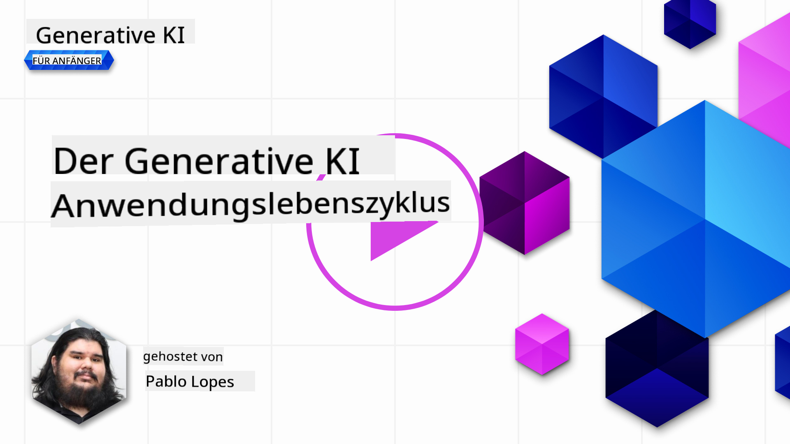

<!--
CO_OP_TRANSLATOR_METADATA:
{
  "original_hash": "27a5347a5022d5ef0a72ab029b03526a",
  "translation_date": "2025-07-09T15:46:56+00:00",
  "source_file": "14-the-generative-ai-application-lifecycle/README.md",
  "language_code": "de"
}
-->

# Der Lebenszyklus von Generativen KI-Anwendungen

Eine wichtige Frage für alle KI-Anwendungen ist die Relevanz der KI-Funktionen, da KI ein sich schnell entwickelndes Feld ist. Um sicherzustellen, dass Ihre Anwendung relevant, zuverlässig und robust bleibt, müssen Sie sie kontinuierlich überwachen, bewerten und verbessern. Hier kommt der Lebenszyklus der generativen KI ins Spiel.

Der Lebenszyklus der generativen KI ist ein Rahmenwerk, das Sie durch die Phasen der Entwicklung, Bereitstellung und Wartung einer generativen KI-Anwendung führt. Er hilft Ihnen, Ihre Ziele zu definieren, Ihre Leistung zu messen, Herausforderungen zu erkennen und Lösungen umzusetzen. Außerdem unterstützt er Sie dabei, Ihre Anwendung mit den ethischen und rechtlichen Standards Ihres Fachgebiets und Ihrer Stakeholder in Einklang zu bringen. Indem Sie dem Lebenszyklus der generativen KI folgen, stellen Sie sicher, dass Ihre Anwendung stets Mehrwert liefert und Ihre Nutzer zufriedenstellt.

## Einführung

In diesem Kapitel werden Sie:

- Den Paradigmenwechsel von MLOps zu LLMOps verstehen
- Den LLM-Lebenszyklus kennenlernen
- Werkzeuge für den Lebenszyklus kennenlernen
- Metriken und Bewertung im Lebenszyklus verstehen

## Den Paradigmenwechsel von MLOps zu LLMOps verstehen

LLMs sind ein neues Werkzeug im Arsenal der Künstlichen Intelligenz. Sie sind unglaublich leistungsfähig bei Analyse- und Generierungsaufgaben für Anwendungen, doch diese Kraft hat Auswirkungen darauf, wie wir KI- und klassische Machine-Learning-Aufgaben optimieren.

Daher brauchen wir ein neues Paradigma, um dieses Werkzeug dynamisch und mit den richtigen Anreizen einzusetzen. Ältere KI-Anwendungen können wir als „ML Apps“ bezeichnen, neuere als „GenAI Apps“ oder einfach „AI Apps“, was die damals verwendeten Technologien und Techniken widerspiegelt. Das verändert unsere Sichtweise auf verschiedene Weise – sehen Sie sich den folgenden Vergleich an.

Beachten Sie, dass bei LLMOps der Fokus stärker auf den App-Entwicklern liegt, wobei Integrationen ein zentraler Punkt sind, „Models-as-a-Service“ genutzt werden und folgende Metriken im Vordergrund stehen:

- Qualität: Antwortqualität
- Schaden: Verantwortungsvolle KI
- Ehrlichkeit: Fundiertheit der Antwort (Ergibt das Sinn? Ist es korrekt?)
- Kosten: Budget der Lösung
- Latenz: Durchschnittliche Antwortzeit pro Token

## Der LLM-Lebenszyklus

Zunächst, um den Lebenszyklus und die Änderungen zu verstehen, beachten wir die folgende Infografik.

Wie Sie sehen, unterscheidet sich dieser von den üblichen Lebenszyklen im MLOps. LLMs haben viele neue Anforderungen, wie Prompting, verschiedene Techniken zur Qualitätsverbesserung (Fine-Tuning, RAG, Meta-Prompts), andere Bewertungs- und Verantwortungsaspekte im Rahmen von verantwortungsvoller KI und schließlich neue Evaluationsmetriken (Qualität, Schaden, Ehrlichkeit, Kosten und Latenz).

Zum Beispiel sehen Sie, wie wir Ideen entwickeln: Mithilfe von Prompt Engineering experimentieren wir mit verschiedenen LLMs, um Möglichkeiten zu erkunden und zu testen, ob unsere Hypothesen korrekt sein könnten.

Beachten Sie, dass dies kein linearer Prozess ist, sondern integrierte Schleifen, iterativ und mit einem übergeordneten Zyklus.

Wie könnten wir diese Schritte erkunden? Schauen wir uns im Detail an, wie wir einen Lebenszyklus aufbauen können.

Das sieht vielleicht etwas kompliziert aus, konzentrieren wir uns zunächst auf die drei großen Schritte.

1. Ideenfindung/Erkundung: Exploration, hier können wir entsprechend unserer Geschäftsanforderungen erkunden. Prototyping, Erstellen eines [PromptFlow](https://microsoft.github.io/promptflow/index.html?WT.mc_id=academic-105485-koreyst) und testen, ob es für unsere Hypothese effizient genug ist.
1. Aufbau/Erweiterung: Implementierung, jetzt beginnen wir, größere Datensätze zu bewerten, Techniken wie Fine-Tuning und RAG anzuwenden, um die Robustheit unserer Lösung zu prüfen. Falls nicht zufriedenstellend, kann eine Neuimplementierung, das Hinzufügen neuer Schritte im Ablauf oder eine Umstrukturierung der Daten helfen. Nach dem Testen unseres Ablaufs und der Skalierung, wenn alles funktioniert und die Metriken stimmen, ist der nächste Schritt bereit.
1. Operationalisierung: Integration, nun fügen wir Überwachungs- und Alarmsysteme hinzu, Deployment und Anwendungsintegration in unsere Applikation.

Darüber hinaus gibt es den übergeordneten Management-Zyklus, der sich auf Sicherheit, Compliance und Governance konzentriert.

Herzlichen Glückwunsch, Ihre KI-Anwendung ist jetzt einsatzbereit und betriebsfähig. Für eine praktische Erfahrung werfen Sie einen Blick auf die [Contoso Chat Demo.](https://nitya.github.io/contoso-chat/?WT.mc_id=academic-105485-koreys)

Welche Werkzeuge können wir nun verwenden?

## Werkzeuge für den Lebenszyklus

Für Werkzeuge stellt Microsoft die [Azure AI Platform](https://azure.microsoft.com/solutions/ai/?WT.mc_id=academic-105485-koreys) und [PromptFlow](https://microsoft.github.io/promptflow/index.html?WT.mc_id=academic-105485-koreyst) bereit, die Ihren Zyklus erleichtern und schnell einsatzbereit machen.

Die [Azure AI Platform](https://azure.microsoft.com/solutions/ai/?WT.mc_id=academic-105485-koreys) ermöglicht die Nutzung von [AI Studio](https://ai.azure.com/?WT.mc_id=academic-105485-koreys). AI Studio ist ein Webportal, das Ihnen erlaubt, Modelle, Beispiele und Werkzeuge zu erkunden, Ihre Ressourcen zu verwalten, UI-Entwicklungsabläufe zu steuern und SDK/CLI-Optionen für Code-First-Entwicklung zu nutzen.

Azure AI erlaubt Ihnen, verschiedene Ressourcen zu verwenden, um Ihre Operationen, Services, Projekte, Vektorsuchen und Datenbankanforderungen zu verwalten.

Mit PromptFlow können Sie von Proof-of-Concept (POC) bis hin zu groß angelegten Anwendungen konstruieren:

- Apps in VS Code entwerfen und bauen, mit visuellen und funktionalen Werkzeugen
- Ihre Apps einfach testen und für hochwertige KI feinabstimmen
- Azure AI Studio nutzen, um mit der Cloud zu integrieren, iterieren, pushen und schnell zu deployen

## Super! Setzen Sie Ihr Lernen fort!

Fantastisch, lernen Sie jetzt mehr darüber, wie wir eine Anwendung strukturieren, um die Konzepte mit der [Contoso Chat App](https://nitya.github.io/contoso-chat/?WT.mc_id=academic-105485-koreyst) anzuwenden und zu sehen, wie Cloud Advocacy diese Konzepte in Demonstrationen einsetzt. Für weitere Inhalte sehen Sie sich unsere [Ignite Breakout Session!](https://www.youtube.com/watch?v=DdOylyrTOWg) an.

Schauen Sie sich nun Lektion 15 an, um zu verstehen, wie [Retrieval Augmented Generation und Vektordatenbanken](../15-rag-and-vector-databases/README.md?WT.mc_id=academic-105485-koreyst) die Generative KI beeinflussen und wie Sie damit noch ansprechendere Anwendungen erstellen können!

**Haftungsausschluss**:  
Dieses Dokument wurde mit dem KI-Übersetzungsdienst [Co-op Translator](https://github.com/Azure/co-op-translator) übersetzt. Obwohl wir uns um Genauigkeit bemühen, beachten Sie bitte, dass automatisierte Übersetzungen Fehler oder Ungenauigkeiten enthalten können. Das Originaldokument in seiner Ursprungssprache gilt als maßgebliche Quelle. Für wichtige Informationen wird eine professionelle menschliche Übersetzung empfohlen. Wir übernehmen keine Haftung für Missverständnisse oder Fehlinterpretationen, die aus der Nutzung dieser Übersetzung entstehen.