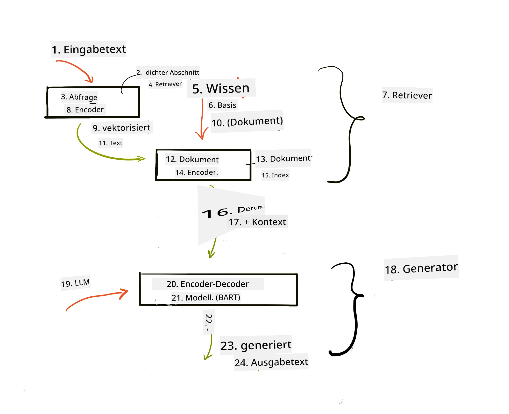

# Retrieval Augmented Generation (RAG) und Vektor-Datenbanken

[](https://youtu.be/4l8zhHUBeyI?si=BmvDmL1fnHtgQYkL)

In der Lektion zu Suchanwendungen haben wir kurz gelernt, wie man eigene Daten in Large Language Models (LLMs) integriert. In dieser Lektion werden wir tiefer in die Konzepte des Groundings Ihrer Daten in Ihrer LLM-Anwendung eintauchen, die Mechanik des Prozesses und die Methoden zur Speicherung von Daten, einschließlich sowohl Einbettungen als auch Text.

> **Video demnächst verfügbar**

## Einführung

In dieser Lektion behandeln wir Folgendes:

- Eine Einführung in RAG, was es ist und warum es in der KI (künstliche Intelligenz) verwendet wird.

- Verständnis, was Vektor-Datenbanken sind und wie man eine für unsere Anwendung erstellt.

- Ein praktisches Beispiel, wie man RAG in eine Anwendung integriert.

## Lernziele

Nach Abschluss dieser Lektion werden Sie in der Lage sein:

- Die Bedeutung von RAG bei der Datenabfrage und -verarbeitung zu erklären.

- Eine RAG-Anwendung einzurichten und Ihre Daten an ein LLM zu binden.

- Effektive Integration von RAG und Vektor-Datenbanken in LLM-Anwendungen.

## Unser Szenario: Verbesserung unserer LLMs mit unseren eigenen Daten

Für diese Lektion möchten wir unsere eigenen Notizen in das Bildungs-Startup einfügen, sodass der Chatbot mehr Informationen zu den verschiedenen Themen erhält. Mit den Notizen, die wir haben, können Lernende besser lernen und die verschiedenen Themen besser verstehen, was das Wiederholen für ihre Prüfungen erleichtert. Um unser Szenario zu erstellen, werden wir verwenden:

- `Azure OpenAI:` das LLM, das wir zur Erstellung unseres Chatbots nutzen

- `AI for beginners' lesson on Neural Networks`: dies wird die Datenbasis sein, auf der wir unser LLM aufbauen

- `Azure AI Search` und `Azure Cosmos DB:` Vektor-Datenbank zum Speichern unserer Daten und zur Erstellung eines Suchindex

Benutzer können Übungsquiz aus ihren Notizen erstellen, Lernkarten zur Wiederholung anlegen und diese zu prägnanten Übersichten zusammenfassen. Um zu beginnen, betrachten wir, was RAG ist und wie es funktioniert:

## Retrieval Augmented Generation (RAG)

Ein von einem LLM unterstützter Chatbot verarbeitet Benutzeranfragen, um Antworten zu generieren. Er ist so gestaltet, dass er interaktiv ist und sich mit Benutzern über eine Vielzahl von Themen austauscht. Seine Antworten sind jedoch auf den bereitgestellten Kontext und seine grundlegenden Trainingsdaten beschränkt. Beispielsweise endet das Wissensfenster von GPT-4 im September 2021, das heißt, es fehlen Kenntnisse über Ereignisse, die nach diesem Zeitpunkt stattgefunden haben. Außerdem schließen die zum Trainieren von LLMs verwendeten Daten vertrauliche Informationen wie persönliche Notizen oder ein Produkt-Handbuch eines Unternehmens aus.

### Wie RAGs (Retrieval Augmented Generation) funktionieren


Angenommen, Sie möchten einen Chatbot bereitstellen, der Quizfragen aus Ihren Notizen erstellt, benötigen Sie eine Verbindung zur Wissensdatenbank. Hier kommt RAG ins Spiel. RAGs funktionieren wie folgt:

- **Wissensdatenbank:** Vor der Abfrage müssen diese Dokumente aufgenommen und vorverarbeitet werden, typischerweise indem große Dokumente in kleinere Abschnitte (Chunks) zerlegt, in Text-Einbettungen umgewandelt und in einer Datenbank gespeichert werden.

- **Benutzeranfrage:** Der Benutzer stellt eine Frage

- **Abruf (Retrieval):** Wenn ein Benutzer eine Frage stellt, ruft das Einbettungsmodell relevante Informationen aus unserer Wissensdatenbank ab, um mehr Kontext zu liefern, der in die Eingabeaufforderung integriert wird.

- **Erweiterte Generierung:** Das LLM verbessert seine Antwort basierend auf den abgerufenen Daten. Dadurch basiert die generierte Antwort nicht nur auf vortrainierten Daten, sondern auch auf relevanten Informationen aus dem hinzugefügten Kontext. Die abgerufenen Daten werden verwendet, um die Antworten des LLM zu ergänzen. Das LLM gibt dann eine Antwort auf die Frage des Benutzers zurück.



Die Architektur von RAGs wird mit Transformern implementiert, die aus zwei Teilen bestehen: einem Encoder und einem Decoder. Wenn ein Benutzer zum Beispiel eine Frage stellt, wird der Eingabetext in Vektoren „kodiert“, die die Bedeutung der Wörter erfassen, und die Vektoren werden „dekodiert“ in unseren Dokumentenindex und generieren neuen Text basierend auf der Benutzeranfrage. Das LLM verwendet ein Encoder-Decoder-Modell, um die Ausgabe zu erzeugen.

Laut dem vorgeschlagenen Paper: [Retrieval-Augmented Generation for Knowledge intensive NLP (natural language processing software) Tasks](https://arxiv.org/pdf/2005.11401.pdf?WT.mc_id=academic-105485-koreyst) gibt es zwei Ansätze für die Implementierung von RAG:

- **_RAG-Sequence_** nutzt abgerufene Dokumente, um die bestmögliche Antwort auf eine Benutzeranfrage vorherzusagen

- **RAG-Token** verwendet Dokumente, um das nächste Token zu generieren und ruft dann weitere ab, um die Benutzeranfrage zu beantworten

### Warum sollten Sie RAGs verwenden? 

- **Informationsfülle:** stellt sicher, dass Textantworten aktuell und auf dem neuesten Stand sind. Es verbessert daher die Leistung bei domänenspezifischen Aufgaben durch Zugriff auf die interne Wissensdatenbank.

- Reduziert Falschinformationen, indem es **überprüfbare Daten** in der Wissensdatenbank nutzt, um Kontext zu den Benutzeranfragen bereitzustellen.

- Es ist **kosteneffektiv**, da es günstiger ist als ein Feintuning eines LLM.

## Erstellen einer Wissensdatenbank

Unsere Anwendung basiert auf unseren persönlichen Daten, d.h. der Neural Network Lektion im AI For Beginners Curriculum.

### Vektor-Datenbanken

Eine Vektor-Datenbank ist, im Gegensatz zu traditionellen Datenbanken, eine spezialisierte Datenbank, die darauf ausgelegt ist, eingebettete Vektoren zu speichern, zu verwalten und zu durchsuchen. Sie speichert numerische Repräsentationen von Dokumenten. Die Aufschlüsselung von Daten in numerische Einbettungen macht es unserem KI-System leichter, die Daten zu verstehen und zu verarbeiten.

Wir speichern unsere Einbettungen in Vektor-Datenbanken, da LLMs eine Begrenzung der Anzahl an Token haben, die sie als Eingabe akzeptieren. Da Sie nicht die gesamten Einbettungen an ein LLM weitergeben können, müssen wir sie in Abschnitte (Chunks) aufteilen, und wenn ein Benutzer eine Frage stellt, werden die Einbettungen zurückgegeben, die der Frage am ähnlichsten sind. Das Chunking senkt auch die Kosten für die Anzahl der Token, die durch ein LLM laufen.

Einige beliebte Vektor-Datenbanken sind Azure Cosmos DB, Clarifyai, Pinecone, Chromadb, ScaNN, Qdrant und DeepLake. Sie können ein Azure Cosmos DB-Modell mit Azure CLI mit folgendem Befehl erstellen:

```bash
az login
az group create -n <resource-group-name> -l <location>
az cosmosdb create -n <cosmos-db-name> -r <resource-group-name>
az cosmosdb list-keys -n <cosmos-db-name> -g <resource-group-name>
```

### Vom Text zu den Einbettungen

Bevor wir unsere Daten speichern, müssen wir sie in Vektor-Einbettungen umwandeln, bevor sie in der Datenbank abgelegt werden. Wenn Sie mit großen Dokumenten oder langen Texten arbeiten, können Sie diese entsprechend der erwarteten Anfragen in Abschnitte aufteilen. Das Chunking kann auf Satz- oder Absatzebene erfolgen. Da beim Chunking die Bedeutung auch aus den umliegenden Wörtern abgeleitet wird, können Sie einem Chunk weiteren Kontext hinzufügen, z.B. durch Hinzufügen des Dokumenttitels oder Einbeziehen von Text vor oder nach dem Chunk. Sie können die Daten folgendermaßen chunkieren:

```python
def split_text(text, max_length, min_length):
    words = text.split()
    chunks = []
    current_chunk = []

    for word in words:
        current_chunk.append(word)
        if len(' '.join(current_chunk)) < max_length and len(' '.join(current_chunk)) > min_length:
            chunks.append(' '.join(current_chunk))
            current_chunk = []

    # Wenn das letzte Stück nicht die Mindestlänge erreicht hat, füge es trotzdem hinzu
    if current_chunk:
        chunks.append(' '.join(current_chunk))

    return chunks
```

Nach dem Chunking können wir dann unseren Text mit verschiedenen Einbettungsmodellen einbetten. Einige Modelle, die Sie verwenden können, sind: word2vec, ada-002 von OpenAI, Azure Computer Vision und viele mehr. Die Auswahl eines Modells hängt von den verwendeten Sprachen, dem codierten Inhaltstyp (Text/Bilder/Audio), der Eingabegröße, die es kodieren kann, und der Länge der Einbettungsausgabe ab.

Ein Beispiel für eingbetteten Text mit OpenAIs `text-embedding-ada-002` Modell ist:


## Retrieval und Vektorsuche

Wenn ein Benutzer eine Frage stellt, wandelt der Retriever sie mithilfe des Query-Encoders in einen Vektor um, durchsucht dann unseren Dokumentensuchindex nach relevanten Vektoren, die im Dokument mit der Eingabe zusammenhängen. Nach Abschluss konvertiert er sowohl den Eingabevektor als auch die Dokumentenvektoren zurück in Text und gibt sie an das LLM weiter.

### Abruf

Retrieval findet statt, wenn das System versucht, schnell die Dokumente aus dem Index zu finden, die die Suchkriterien erfüllen. Das Ziel des Retrievers ist es, Dokumente zu holen, die verwendet werden, um Kontext bereitzustellen und das LLM auf Ihre Daten zu gründen.

Es gibt verschiedene Möglichkeiten, innerhalb unserer Datenbank zu suchen, z.B.:

- **Schlüsselwortsuche** – wird für Textsuchen verwendet

- **Vektorsuche** – wandelt Dokumente von Text in Vektorrepräsentationen mit Einbettungsmodellen um, was eine **semantische Suche** auf Basis der Bedeutung der Wörter ermöglicht. Der Abruf erfolgt durch Abfragen der Dokumente, deren Vektorrepräsentationen dem Benutzerfragevektor am nächsten sind.

- **Hybrid** – eine Kombination aus Schlüsselwort- und Vektorsuche.

Eine Herausforderung beim Abruf besteht darin, dass es keine ähnliche Antwort auf die Anfrage in der Datenbank gibt. Das System gibt dann die bestmöglichen Informationen zurück. Sie können jedoch Taktiken verwenden, wie das Einrichten einer maximalen Relevanzdistanz oder Nutzung der hybriden Suche, die Schlüsselwort- und Vektorsuche kombiniert. In dieser Lektion verwenden wir hybride Suche, eine Kombination aus Vektor- und Schlüsselwortsuche. Wir speichern unsere Daten in einem DataFrame mit Spalten, die die Chunks sowie die Einbettungen enthalten.

### Vektorähnlichkeit

Der Retriever durchsucht die Wissensdatenbank nach Einbettungen, die nahe beieinanderliegen, also den nächsten Nachbarn, da es sich um ähnliche Texte handelt. Wenn ein Benutzer eine Anfrage stellt, wird diese zuerst eingebettet und dann mit ähnlichen Einbettungen abgeglichen. Das gebräuchlichste Maß zur Bestimmung der Ähnlichkeit zwischen Vektoren ist die Kosinus-Ähnlichkeit, die auf dem Winkel zwischen zwei Vektoren basiert.

Wir können die Ähnlichkeit auch mit anderen Alternativen messen, die wir verwenden können, wie dem euklidischen Abstand, der die Gerade zwischen den Endpunkten zweier Vektoren misst, oder dem Skalarprodukt, welches die Summe der Produkte der korrespondierenden Elemente zweier Vektoren angibt.

### Suchindex

Beim Abruf müssen wir vor der Suche einen Suchindex für unsere Wissensdatenbank erstellen. Ein Index speichert unsere Einbettungen und kann selbst in einer großen Datenbank die ähnlichsten Chunks schnell abrufen. Wir können unseren Index lokal erstellen mit:

```python
from sklearn.neighbors import NearestNeighbors

embeddings = flattened_df['embeddings'].to_list()

# Erstellen Sie den Suchindex
nbrs = NearestNeighbors(n_neighbors=5, algorithm='ball_tree').fit(embeddings)

# Um den Index abzufragen, können Sie die Methode kneighbors verwenden
distances, indices = nbrs.kneighbors(embeddings)
```

### Neu-Rangierung

Nachdem Sie die Datenbank abgefragt haben, müssen Sie möglicherweise die Ergebnisse nach Relevanz sortieren. Ein neu-rangierendes LLM nutzt maschinelles Lernen, um die Relevanz der Suchergebnisse zu verbessern, indem es die Ergebnisse nach der Wichtigkeit sortiert. Mit Azure AI Search wird die Neu-Rangierung automatisch für Sie durch einen semantischen Neu-Ranger erledigt. Ein Beispiel, wie Neu-Rangierung mit nächsten Nachbarn funktioniert:

```python
# Finde die ähnlichsten Dokumente
distances, indices = nbrs.kneighbors([query_vector])

index = []
# Drucke die ähnlichsten Dokumente
for i in range(3):
    index = indices[0][i]
    for index in indices[0]:
        print(flattened_df['chunks'].iloc[index])
        print(flattened_df['path'].iloc[index])
        print(flattened_df['distances'].iloc[index])
    else:
        print(f"Index {index} not found in DataFrame")
```

## Alles zusammenfügen

Der letzte Schritt ist, unser LLM einzubinden, um Antworten zu erhalten, die auf unseren Daten basieren. Wir können es wie folgt implementieren:

```python
user_input = "what is a perceptron?"

def chatbot(user_input):
    # Konvertiere die Frage in einen Abfragevektor
    query_vector = create_embeddings(user_input)

    # Finde die ähnlichsten Dokumente
    distances, indices = nbrs.kneighbors([query_vector])

    # Füge Dokumente zur Abfrage hinzu, um Kontext bereitzustellen
    history = []
    for index in indices[0]:
        history.append(flattened_df['chunks'].iloc[index])

    # Kombiniere die Historie und die Benutzereingabe
    history.append(user_input)

    # Erstelle ein Nachrichtenobjekt
    messages=[
        {"role": "system", "content": "You are an AI assistant that helps with AI questions."},
        {"role": "user", "content": "\n\n".join(history) }
    ]

    # Nutze Chat Completion, um eine Antwort zu generieren
    response = openai.chat.completions.create(
        model="gpt-4",
        temperature=0.7,
        max_tokens=800,
        messages=messages
    )

    return response.choices[0].message

chatbot(user_input)
```

## Evaluation unserer Anwendung

### Evaluationsmetriken

- Qualität der gelieferten Antworten: Sie sollen natürlich, flüssig und menschenähnlich klingen

- Groundedness der Daten: Bewertung, ob die Antwort aus den bereitgestellten Dokumenten stammt

- Relevanz: Bewertung, ob die Antwort zur gestellten Frage passt und in Beziehung steht

- Flüssigkeit – ob die Antwort grammatikalisch sinnvoll ist

## Anwendungsfälle für RAG (Retrieval Augmented Generation) und Vektor-Datenbanken

Es gibt viele verschiedene Anwendungsfälle, bei denen Funktionsaufrufe Ihre App verbessern können, wie zum Beispiel:

- Frage-Antwort-Systeme: Ihr Unternehmenswissen an einen Chat binden, der von Mitarbeitern zur Beantwortung von Fragen verwendet wird.

- Empfehlungssysteme: Sie können ein System erstellen, das die ähnlichsten Werte z.B. Filme, Restaurants und viele weitere abgleicht.

- Chatbot-Dienste: Sie können den Chatverlauf speichern und das Gespräch basierend auf Benutzerdaten personalisieren.

- Bildsuche basierend auf Vektoreinbettungen, nützlich bei der Bilderkennung und Anomalieerkennung.

## Zusammenfassung

Wir haben die grundlegenden Bereiche von RAG abgedeckt, von der Hinzufügung unserer Daten zur Anwendung über die Benutzeranfrage bis hin zur Ausgabe. Zur Vereinfachung der Erstellung von RAG können Sie Frameworks wie Semanti Kernel, Langchain oder Autogen verwenden.

## Aufgabe

Um Ihr Wissen zu Retrieval Augmented Generation (RAG) weiter zu vertiefen, können Sie:

- Ein Frontend für die Anwendung unter Verwendung eines Frameworks Ihrer Wahl erstellen

- Ein Framework wie LangChain oder Semantic Kernel verwenden und Ihre Anwendung nachbauen.

Herzlichen Glückwunsch zum Abschluss der Lektion 👏.

## Lernen endet hier nicht, setzen Sie die Reise fort

Nach Abschluss dieser Lektion schauen Sie sich unsere [Generative AI Lernsammlung](https://aka.ms/genai-collection?WT.mc_id=academic-105485-koreyst) an, um Ihre Kenntnisse in Generativer KI weiter auszubauen!

---

<!-- CO-OP TRANSLATOR DISCLAIMER START -->
**Haftungsausschluss**:  
Dieses Dokument wurde mit dem KI-Übersetzungsdienst [Co-op Translator](https://github.com/Azure/co-op-translator) übersetzt. Zwar bemühen wir uns um Genauigkeit, dennoch können automatisierte Übersetzungen Fehler oder Ungenauigkeiten enthalten. Das Originaldokument in seiner Ursprungssprache ist als maßgebliche Quelle zu betrachten. Für wichtige Informationen wird eine professionelle menschliche Übersetzung empfohlen. Wir übernehmen keine Haftung für Missverständnisse oder Fehlinterpretationen, die durch die Nutzung dieser Übersetzung entstehen.
<!-- CO-OP TRANSLATOR DISCLAIMER END -->