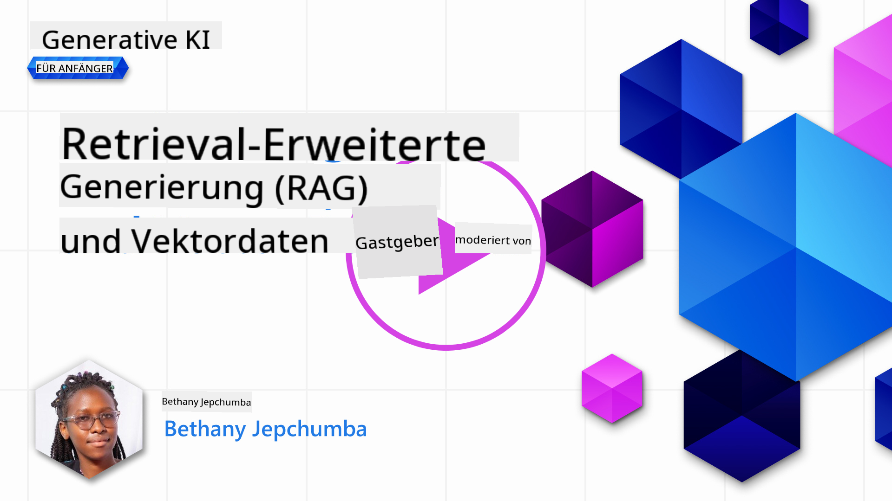
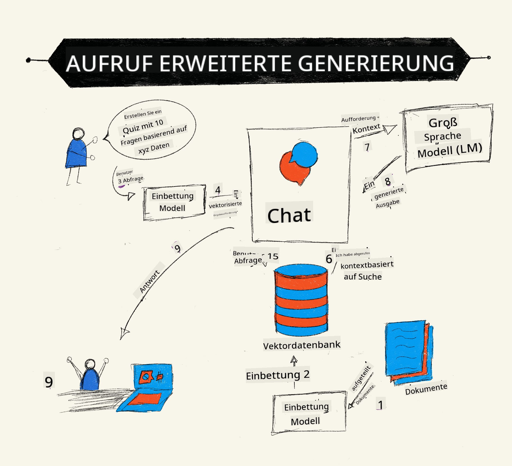
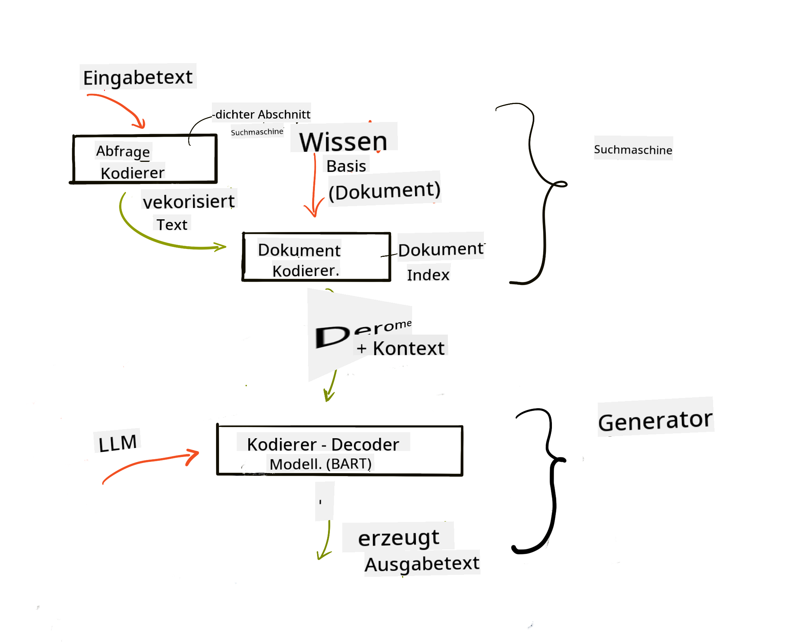
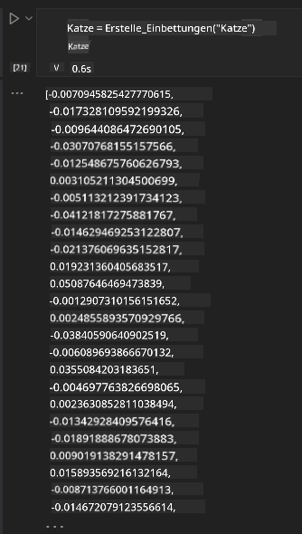

<!--
CO_OP_TRANSLATOR_METADATA:
{
  "original_hash": "e2861bbca91c0567ef32bc77fe054f9e",
  "translation_date": "2025-05-20T01:00:19+00:00",
  "source_file": "15-rag-and-vector-databases/README.md",
  "language_code": "de"
}
-->
# Retrieval Augmented Generation (RAG) und Vektordatenbanken

[](https://aka.ms/gen-ai-lesson15-gh?WT.mc_id=academic-105485-koreyst)

In der Lektion zu Suchanwendungen haben wir kurz gelernt, wie man eigene Daten in Large Language Models (LLMs) integriert. In dieser Lektion werden wir weiter in die Konzepte des Verankerns Ihrer Daten in Ihrer LLM-Anwendung eintauchen, die Mechanik des Prozesses und die Methoden zur Speicherung von Daten, einschließlich Embeddings und Text.

> **Video kommt bald**

## Einführung

In dieser Lektion behandeln wir Folgendes:

- Eine Einführung in RAG, was es ist und warum es in der KI (künstliche Intelligenz) verwendet wird.

- Verständnis, was Vektordatenbanken sind und wie man eine für unsere Anwendung erstellt.

- Ein praktisches Beispiel, wie man RAG in eine Anwendung integriert.

## Lernziele

Nach Abschluss dieser Lektion werden Sie in der Lage sein:

- Die Bedeutung von RAG bei der Datenabfrage und -verarbeitung zu erklären.

- Eine RAG-Anwendung einzurichten und Ihre Daten an ein LLM zu verankern.

- Effektive Integration von RAG und Vektordatenbanken in LLM-Anwendungen.

## Unser Szenario: Verbesserung unserer LLMs mit unseren eigenen Daten

Für diese Lektion möchten wir unsere eigenen Notizen in das Bildungs-Startup einfügen, wodurch der Chatbot mehr Informationen zu den verschiedenen Themen erhält. Mithilfe der Notizen, die wir haben, können Lernende besser lernen und die verschiedenen Themen verstehen, was das Überarbeiten für ihre Prüfungen erleichtert. Um unser Szenario zu erstellen, werden wir verwenden:

- `Azure OpenAI:` das LLM, das wir verwenden werden, um unseren Chatbot zu erstellen

- `AI for beginners' lesson on Neural Networks`: Dies werden die Daten sein, auf denen wir unser LLM verankern

- `Azure AI Search` und `Azure Cosmos DB:` Vektordatenbank, um unsere Daten zu speichern und einen Suchindex zu erstellen

Nutzer können aus ihren Notizen Übungsquiz erstellen, Lernkarten zur Wiederholung und diese zu prägnanten Übersichten zusammenfassen. Um zu beginnen, schauen wir uns an, was RAG ist und wie es funktioniert:

## Retrieval Augmented Generation (RAG)

Ein LLM-gesteuerter Chatbot verarbeitet Benutzeranfragen, um Antworten zu generieren. Er ist darauf ausgelegt, interaktiv zu sein und sich mit Nutzern zu einer Vielzahl von Themen auszutauschen. Seine Antworten sind jedoch auf den bereitgestellten Kontext und seine grundlegenden Trainingsdaten beschränkt. Zum Beispiel ist der Wissensstopp von GPT-4 im September 2021, was bedeutet, dass ihm Kenntnisse über Ereignisse fehlen, die nach diesem Zeitraum aufgetreten sind. Darüber hinaus schließen die Daten, die zur Schulung von LLMs verwendet werden, vertrauliche Informationen wie persönliche Notizen oder das Produkthandbuch eines Unternehmens aus.

### Wie RAGs (Retrieval Augmented Generation) funktionieren



Angenommen, Sie möchten einen Chatbot bereitstellen, der Quiz aus Ihren Notizen erstellt, dann benötigen Sie eine Verbindung zur Wissensdatenbank. Hier kommt RAG zur Rettung. RAGs funktionieren wie folgt:

- **Wissensdatenbank:** Vor der Abfrage müssen diese Dokumente aufgenommen und vorverarbeitet werden, in der Regel durch Aufteilung großer Dokumente in kleinere Abschnitte, Umwandlung in Text-Embeddings und Speicherung in einer Datenbank.

- **Benutzeranfrage:** Der Benutzer stellt eine Frage.

- **Abfrage:** Wenn ein Benutzer eine Frage stellt, ruft das Embedding-Modell relevante Informationen aus unserer Wissensdatenbank ab, um mehr Kontext bereitzustellen, der in die Eingabeaufforderung aufgenommen wird.

- **Erweiterte Generierung:** Das LLM verbessert seine Antwort basierend auf den abgerufenen Daten. Es ermöglicht, dass die generierte Antwort nicht nur auf vortrainierten Daten, sondern auch auf relevanten Informationen aus dem hinzugefügten Kontext basiert. Die abgerufenen Daten werden verwendet, um die Antworten des LLMs zu erweitern. Das LLM gibt dann eine Antwort auf die Frage des Benutzers zurück.



Die Architektur für RAGs wird unter Verwendung von Transformatoren implementiert, die aus zwei Teilen bestehen: einem Encoder und einem Decoder. Zum Beispiel, wenn ein Benutzer eine Frage stellt, wird der Eingabetext in Vektoren „kodiert“, die die Bedeutung der Wörter erfassen, und die Vektoren werden in unseren Dokumentenindex „dekodiert“ und generieren neuen Text basierend auf der Benutzeranfrage. Das LLM verwendet sowohl ein Encoder-Decoder-Modell, um die Ausgabe zu generieren.

Zwei Ansätze bei der Implementierung von RAG gemäß dem vorgeschlagenen Papier: [Retrieval-Augmented Generation for Knowledge intensive NLP (natural language processing software) Tasks](https://arxiv.org/pdf/2005.11401.pdf?WT.mc_id=academic-105485-koreyst) sind:

- **_RAG-Sequence_** Verwendung abgerufener Dokumente, um die bestmögliche Antwort auf eine Benutzeranfrage vorherzusagen

- **RAG-Token** Verwendung von Dokumenten, um das nächste Token zu generieren, und sie dann abzurufen, um die Benutzeranfrage zu beantworten

### Warum würden Sie RAGs verwenden? 

- **Informationsreichtum:** stellt sicher, dass Textantworten aktuell und aktuell sind. Es verbessert daher die Leistung bei domänenspezifischen Aufgaben durch Zugriff auf die interne Wissensdatenbank.

- Reduziert Erfindungen, indem **überprüfbare Daten** in der Wissensdatenbank genutzt werden, um den Benutzeranfragen Kontext zu bieten.

- Es ist **kosteneffektiv**, da sie wirtschaftlicher sind als das Feintuning eines LLM

## Erstellen einer Wissensdatenbank

Unsere Anwendung basiert auf unseren persönlichen Daten, d.h. der Lektion über Neuronale Netze im AI For Beginners-Lehrplan.

### Vektordatenbanken

Eine Vektordatenbank, im Gegensatz zu herkömmlichen Datenbanken, ist eine spezialisierte Datenbank, die zum Speichern, Verwalten und Suchen eingebetteter Vektoren entwickelt wurde. Sie speichert numerische Darstellungen von Dokumenten. Das Zerlegen von Daten in numerische Embeddings erleichtert es unserem KI-System, die Daten zu verstehen und zu verarbeiten.

Wir speichern unsere Embeddings in Vektordatenbanken, da LLMs eine Begrenzung der Anzahl von Tokens haben, die sie als Eingabe akzeptieren. Da Sie nicht die gesamten Embeddings an ein LLM übergeben können, müssen wir sie in Abschnitte unterteilen, und wenn ein Benutzer eine Frage stellt, werden die Embeddings, die der Frage am ähnlichsten sind, zusammen mit der Eingabeaufforderung zurückgegeben. Das Zerlegen reduziert auch die Kosten für die Anzahl der Tokens, die durch ein LLM geleitet werden.

Einige beliebte Vektordatenbanken sind Azure Cosmos DB, Clarifyai, Pinecone, Chromadb, ScaNN, Qdrant und DeepLake. Sie können ein Azure Cosmos DB-Modell mit dem Azure CLI mit folgendem Befehl erstellen:

```bash
az login
az group create -n <resource-group-name> -l <location>
az cosmosdb create -n <cosmos-db-name> -r <resource-group-name>
az cosmosdb list-keys -n <cosmos-db-name> -g <resource-group-name>
```

### Vom Text zu Embeddings

Bevor wir unsere Daten speichern, müssen wir sie in Vektor-Embeddings umwandeln, bevor sie in der Datenbank gespeichert werden. Wenn Sie mit großen Dokumenten oder langen Texten arbeiten, können Sie sie basierend auf den erwarteten Abfragen unterteilen. Die Unterteilung kann auf Satzebene oder auf Absatzebene erfolgen. Da die Unterteilung Bedeutungen aus den Wörtern um sie herum ableitet, können Sie einem Abschnitt zusätzlichen Kontext hinzufügen, indem Sie beispielsweise den Dokumenttitel hinzufügen oder Text vor oder nach dem Abschnitt einfügen. Sie können die Daten wie folgt unterteilen:

```python
def split_text(text, max_length, min_length):
    words = text.split()
    chunks = []
    current_chunk = []

    for word in words:
        current_chunk.append(word)
        if len(' '.join(current_chunk)) < max_length and len(' '.join(current_chunk)) > min_length:
            chunks.append(' '.join(current_chunk))
            current_chunk = []

    # If the last chunk didn't reach the minimum length, add it anyway
    if current_chunk:
        chunks.append(' '.join(current_chunk))

    return chunks
```

Sobald sie unterteilt sind, können wir unseren Text mit verschiedenen Embedding-Modellen einbetten. Einige Modelle, die Sie verwenden können, sind: word2vec, ada-002 von OpenAI, Azure Computer Vision und viele mehr. Die Auswahl eines Modells hängt von den verwendeten Sprachen, der Art des kodierten Inhalts (Text/Bilder/Audio), der Größe der Eingabe, die es kodieren kann, und der Länge der Embedding-Ausgabe ab.

Ein Beispiel für eingebetteten Text mit dem `text-embedding-ada-002`-Modell von OpenAI ist:


## Abfrage und Vektorsuche

Wenn ein Benutzer eine Frage stellt, verwandelt der Retriever sie mithilfe des Abfrage-Encoders in einen Vektor, durchsucht dann unseren Dokumentensuchindex nach relevanten Vektoren im Dokument, die mit der Eingabe zusammenhängen. Sobald dies geschehen ist, konvertiert er sowohl den Eingabevektor als auch die Dokumentenvektoren in Text und leitet sie durch das LLM.

### Abfrage

Die Abfrage erfolgt, wenn das System versucht, schnell die Dokumente aus dem Index zu finden, die die Suchkriterien erfüllen. Das Ziel des Retrievers ist es, Dokumente zu erhalten, die verwendet werden, um Kontext bereitzustellen und das LLM auf Ihre Daten zu verankern.

Es gibt mehrere Möglichkeiten, innerhalb unserer Datenbank zu suchen, wie zum Beispiel:

- **Schlüsselwortsuche** - verwendet für Textsuchen

- **Semantische Suche** - nutzt die semantische Bedeutung von Wörtern

- **Vektorsuche** - wandelt Dokumente von Text in Vektordarstellungen mithilfe von Embedding-Modellen um. Die Abfrage erfolgt durch Abfragen der Dokumente, deren Vektordarstellungen der Benutzerfrage am nächsten kommen.

- **Hybrid** - eine Kombination aus Schlüsselwort- und Vektorsuche.

Eine Herausforderung bei der Abfrage besteht darin, dass es in der Datenbank keine ähnliche Antwort auf die Abfrage gibt. Das System wird dann die besten Informationen zurückgeben, die es finden kann. Sie können jedoch Taktiken wie das Festlegen der maximalen Distanz für Relevanz oder die Verwendung einer hybriden Suche, die sowohl Schlüsselwörter als auch Vektorsuche kombiniert, verwenden. In dieser Lektion verwenden wir die hybride Suche, eine Kombination aus Vektor- und Schlüsselwortsuche. Wir speichern unsere Daten in einem Datenrahmen mit Spalten, die die Abschnitte sowie die Embeddings enthalten.

### Vektorsimilarität

Der Retriever wird die Wissensdatenbank nach Embeddings durchsuchen, die nahe beieinander liegen, der nächste Nachbar, da es sich um Texte handelt, die ähnlich sind. In dem Szenario, in dem ein Benutzer eine Abfrage stellt, wird diese zuerst eingebettet und dann mit ähnlichen Embeddings abgeglichen. Das übliche Maß, das verwendet wird, um die Ähnlichkeit verschiedener Vektoren zu finden, ist die Kosinus-Ähnlichkeit, die auf dem Winkel zwischen zwei Vektoren basiert.

Wir können die Ähnlichkeit mit anderen Alternativen messen, die wir verwenden können, wie der euklidischen Distanz, die die gerade Linie zwischen den Endpunkten der Vektoren ist, und dem Skalarprodukt, das die Summe der Produkte der entsprechenden Elemente von zwei Vektoren misst.

### Suchindex

Bei der Abfrage müssen wir einen Suchindex für unsere Wissensdatenbank erstellen, bevor wir die Suche durchführen. Ein Index speichert unsere Embeddings und kann schnell die ähnlichsten Abschnitte auch in einer großen Datenbank abrufen. Wir können unseren Index lokal erstellen mit:

```python
from sklearn.neighbors import NearestNeighbors

embeddings = flattened_df['embeddings'].to_list()

# Create the search index
nbrs = NearestNeighbors(n_neighbors=5, algorithm='ball_tree').fit(embeddings)

# To query the index, you can use the kneighbors method
distances, indices = nbrs.kneighbors(embeddings)
```

### Re-Ranking

Sobald Sie die Datenbank abgefragt haben, müssen Sie möglicherweise die Ergebnisse nach den relevantesten sortieren. Ein Re-Ranking-LLM nutzt maschinelles Lernen, um die Relevanz der Suchergebnisse zu verbessern, indem es sie von den relevantesten sortiert. Mit Azure AI Search wird das Re-Ranking automatisch für Sie mit einem semantischen Re-Ranker durchgeführt. Ein Beispiel, wie Re-Ranking mit nächsten Nachbarn funktioniert:

```python
# Find the most similar documents
distances, indices = nbrs.kneighbors([query_vector])

index = []
# Print the most similar documents
for i in range(3):
    index = indices[0][i]
    for index in indices[0]:
        print(flattened_df['chunks'].iloc[index])
        print(flattened_df['path'].iloc[index])
        print(flattened_df['distances'].iloc[index])
    else:
        print(f"Index {index} not found in DataFrame")
```

## Alles zusammenbringen

Der letzte Schritt besteht darin, unser LLM in die Mischung einzufügen, um Antworten zu erhalten, die auf unseren Daten basieren. Wir können es wie folgt implementieren:

```python
user_input = "what is a perceptron?"

def chatbot(user_input):
    # Convert the question to a query vector
    query_vector = create_embeddings(user_input)

    # Find the most similar documents
    distances, indices = nbrs.kneighbors([query_vector])

    # add documents to query  to provide context
    history = []
    for index in indices[0]:
        history.append(flattened_df['chunks'].iloc[index])

    # combine the history and the user input
    history.append(user_input)

    # create a message object
    messages=[
        {"role": "system", "content": "You are an AI assistant that helps with AI questions."},
        {"role": "user", "content": history[-1]}
    ]

    # use chat completion to generate a response
    response = openai.chat.completions.create(
        model="gpt-4",
        temperature=0.7,
        max_tokens=800,
        messages=messages
    )

    return response.choices[0].message

chatbot(user_input)
```

## Bewertung unserer Anwendung

### Bewertungsmetriken

- Qualität der bereitgestellten Antworten, die sicherstellen, dass sie natürlich, fließend und menschenähnlich klingen

- Verankerung der Daten: Bewertung, ob die Antwort aus den bereitgestellten Dokumenten stammt

- Relevanz: Bewertung, ob die Antwort zur gestellten Frage passt und mit ihr zusammenhängt

- Flüssigkeit - ob die Antwort grammatikalisch Sinn macht

## Anwendungsfälle für die Verwendung von RAG (Retrieval Augmented Generation) und Vektordatenbanken

Es gibt viele verschiedene Anwendungsfälle, in denen Funktionsaufrufe Ihre App verbessern können, wie:

- Frage- und Antwortsysteme: Verankerung Ihrer Unternehmensdaten an einen Chat, der von Mitarbeitern genutzt werden kann, um Fragen zu stellen.

- Empfehlungssysteme: wo Sie ein System erstellen können, das die ähnlichsten Werte abgleicht, z.B. Filme, Restaurants und vieles mehr.

- Chatbot-Dienste: Sie können den Chatverlauf speichern und das Gespräch basierend auf den Benutzerdaten personalisieren.

- Bildsuche basierend auf Vektorembeddings, nützlich bei der Bilderkennung und Anomalieerkennung.

## Zusammenfassung

Wir haben die grundlegenden Bereiche von RAG behandelt, vom Hinzufügen unserer Daten zur Anwendung, der Benutzerabfrage und der Ausgabe. Um die Erstellung von RAG zu vereinfachen, können Sie Frameworks wie Semanti Kernel, Langchain oder Autogen verwenden.

## Aufgabe

Um Ihr Lernen über Retrieval Augmented Generation (RAG) fortzusetzen, können Sie Folgendes erstellen:

- Erstellen Sie ein Front-End für die Anwendung mit dem Framework Ihrer Wahl.

- Nutzen Sie ein Framework, entweder LangChain oder Semantic Kernel, und erstellen Sie Ihre Anwendung neu.

Herzlichen Glückwunsch zum Abschluss der Lektion 👏.

## Das Lernen hört hier nicht auf, setzen Sie die Reise fort

Nach Abschluss dieser Lektion schauen Sie sich unsere [Generative AI Learning Collection](https://aka.ms/genai-collection?WT.mc_id=academic-105485-koreyst) an, um Ihr Wissen über Generative KI weiter zu vertiefen!

**Haftungsausschluss**:  
Dieses Dokument wurde mit dem KI-Übersetzungsdienst [Co-op Translator](https://github.com/Azure/co-op-translator) übersetzt. Obwohl wir uns um Genauigkeit bemühen, beachten Sie bitte, dass automatisierte Übersetzungen Fehler oder Ungenauigkeiten enthalten können. Das Originaldokument in seiner ursprünglichen Sprache sollte als maßgebliche Quelle betrachtet werden. Für kritische Informationen wird eine professionelle menschliche Übersetzung empfohlen. Wir haften nicht für Missverständnisse oder Fehlinterpretationen, die sich aus der Nutzung dieser Übersetzung ergeben.