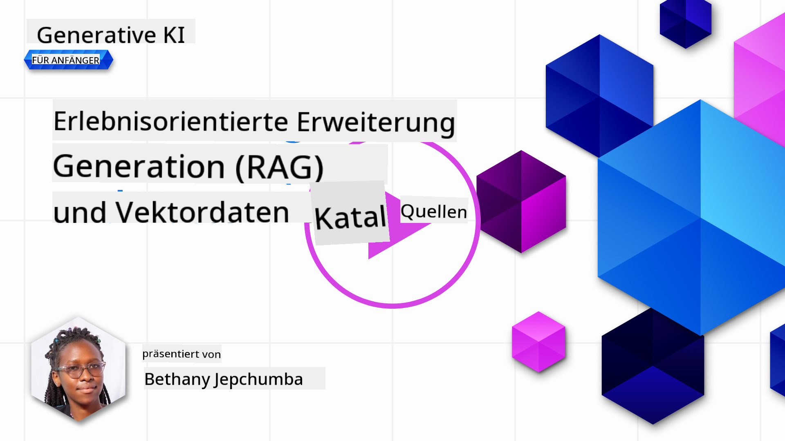
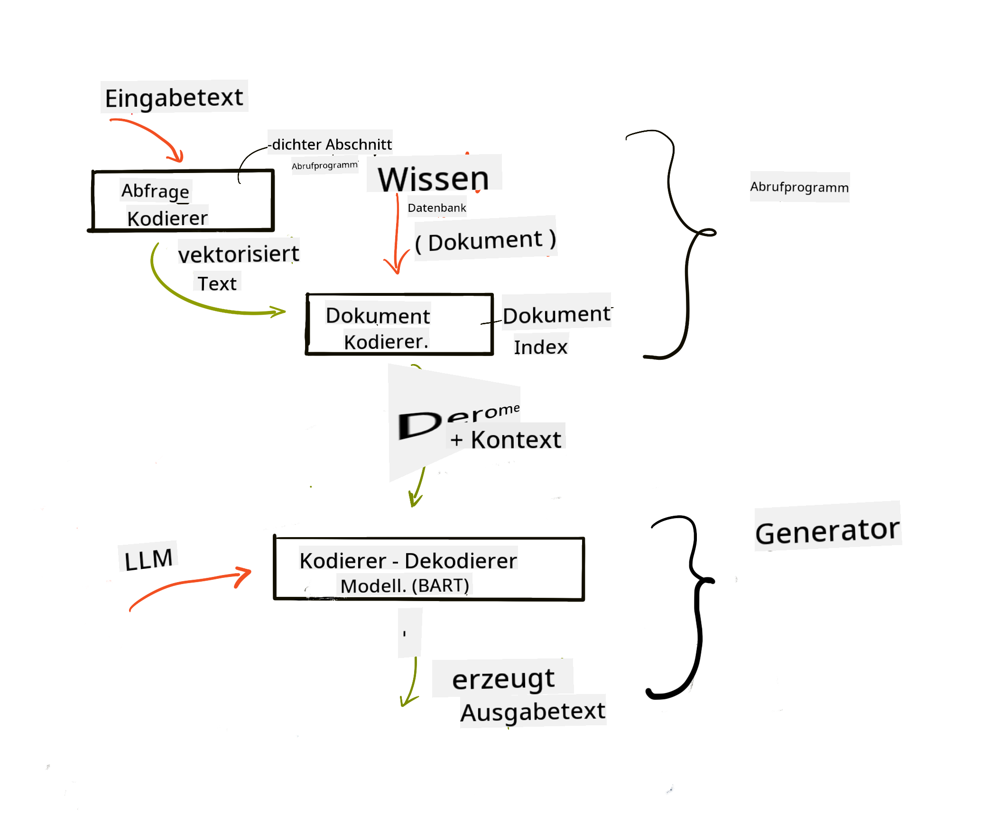

<!--
CO_OP_TRANSLATOR_METADATA:
{
  "original_hash": "e2861bbca91c0567ef32bc77fe054f9e",
  "translation_date": "2025-07-09T16:02:08+00:00",
  "source_file": "15-rag-and-vector-databases/README.md",
  "language_code": "de"
}
-->
# Retrieval Augmented Generation (RAG) und Vektordatenbanken

[](https://aka.ms/gen-ai-lesson15-gh?WT.mc_id=academic-105485-koreyst)

In der Lektion zu Suchanwendungen haben wir kurz gelernt, wie man eigene Daten in Large Language Models (LLMs) integriert. In dieser Lektion gehen wir tiefer auf die Konzepte ein, wie man seine Daten in einer LLM-Anwendung verankert, wie der Prozess funktioniert und welche Methoden es zur Speicherung von Daten gibt – sowohl Embeddings als auch Text.

> **Video folgt in Kürze**

## Einführung

In dieser Lektion behandeln wir Folgendes:

- Eine Einführung in RAG, was es ist und warum es in der KI (künstlichen Intelligenz) verwendet wird.

- Verständnis, was Vektordatenbanken sind und wie man eine für unsere Anwendung erstellt.

- Ein praktisches Beispiel, wie man RAG in eine Anwendung integriert.

## Lernziele

Nach Abschluss dieser Lektion wirst du in der Lage sein:

- Die Bedeutung von RAG bei der Datenabfrage und -verarbeitung zu erklären.

- Eine RAG-Anwendung einzurichten und deine Daten in ein LLM einzubinden.

- RAG und Vektordatenbanken effektiv in LLM-Anwendungen zu integrieren.

## Unser Szenario: Unsere LLMs mit eigenen Daten erweitern

Für diese Lektion möchten wir eigene Notizen in das Bildungs-Startup einfügen, damit der Chatbot mehr Informationen zu verschiedenen Themen erhält. Mit den vorhandenen Notizen können Lernende besser lernen und die unterschiedlichen Themen besser verstehen, was das Lernen für Prüfungen erleichtert. Für unser Szenario verwenden wir:

- `Azure OpenAI:` das LLM, das wir für unseren Chatbot nutzen

- `AI for beginners' lesson on Neural Networks:` die Daten, auf denen wir unser LLM aufbauen

- `Azure AI Search` und `Azure Cosmos DB:` Vektordatenbank zur Speicherung unserer Daten und zur Erstellung eines Suchindexes

Nutzer können Übungsquizze aus ihren Notizen erstellen, Lernkarten zum Wiederholen anfertigen und Zusammenfassungen in übersichtliche Übersichten umwandeln. Um zu starten, schauen wir uns an, was RAG ist und wie es funktioniert:

## Retrieval Augmented Generation (RAG)

Ein von einem LLM unterstützter Chatbot verarbeitet Nutzereingaben, um Antworten zu generieren. Er ist interaktiv gestaltet und kann mit Nutzern über eine Vielzahl von Themen kommunizieren. Seine Antworten sind jedoch auf den bereitgestellten Kontext und die zugrundeliegenden Trainingsdaten beschränkt. Zum Beispiel endet das Wissen von GPT-4 im September 2021, das heißt, es kennt keine Ereignisse, die danach passiert sind. Außerdem schließen die Trainingsdaten von LLMs vertrauliche Informationen wie persönliche Notizen oder Handbücher von Unternehmen aus.

### Wie RAGs (Retrieval Augmented Generation) funktionieren


Angenommen, du möchtest einen Chatbot bereitstellen, der Quizze aus deinen Notizen erstellt, dann benötigst du eine Verbindung zur Wissensdatenbank. Hier kommt RAG ins Spiel. RAGs funktionieren folgendermaßen:

- **Wissensdatenbank:** Vor der Abfrage müssen die Dokumente aufgenommen und vorverarbeitet werden, typischerweise indem große Dokumente in kleinere Abschnitte zerlegt, in Text-Embeddings umgewandelt und in einer Datenbank gespeichert werden.

- **Nutzeranfrage:** Der Nutzer stellt eine Frage.

- **Abruf:** Wenn der Nutzer eine Frage stellt, holt das Embedding-Modell relevante Informationen aus unserer Wissensdatenbank, um mehr Kontext zu liefern, der in die Eingabeaufforderung einfließt.

- **Erweiterte Generierung:** Das LLM verbessert seine Antwort basierend auf den abgerufenen Daten. So basiert die Antwort nicht nur auf den vortrainierten Daten, sondern auch auf relevanten Informationen aus dem hinzugefügten Kontext. Die abgerufenen Daten werden genutzt, um die Antworten des LLM zu erweitern. Das LLM gibt dann eine Antwort auf die Nutzerfrage zurück.



Die Architektur von RAGs wird mit Transformern umgesetzt, die aus zwei Teilen bestehen: einem Encoder und einem Decoder. Wenn ein Nutzer beispielsweise eine Frage stellt, wird der Eingabetext in Vektoren „kodiert“, die die Bedeutung der Wörter erfassen. Diese Vektoren werden dann in unserem Dokumentenindex „dekodiert“ und generieren neuen Text basierend auf der Nutzeranfrage. Das LLM verwendet ein Encoder-Decoder-Modell, um die Ausgabe zu erzeugen.

Laut dem vorgeschlagenen Paper [Retrieval-Augmented Generation for Knowledge intensive NLP (natural language processing software) Tasks](https://arxiv.org/pdf/2005.11401.pdf?WT.mc_id=academic-105485-koreyst) gibt es zwei Ansätze zur Implementierung von RAG:

- **_RAG-Sequence_** verwendet abgerufene Dokumente, um die bestmögliche Antwort auf eine Nutzeranfrage vorherzusagen

- **RAG-Token** nutzt Dokumente, um das nächste Token zu generieren und ruft sie dann ab, um die Nutzeranfrage zu beantworten

### Warum sollte man RAGs verwenden?

- **Informationsvielfalt:** sorgt dafür, dass Textantworten aktuell und auf dem neuesten Stand sind. Dadurch wird die Leistung bei domänenspezifischen Aufgaben verbessert, indem auf die interne Wissensdatenbank zugegriffen wird.

- Reduziert Falschinformationen, indem **überprüfbare Daten** aus der Wissensdatenbank genutzt werden, um Kontext für Nutzeranfragen zu liefern.

- Es ist **kosteneffizient**, da es günstiger ist als das Feintuning eines LLM.

## Erstellen einer Wissensdatenbank

Unsere Anwendung basiert auf unseren persönlichen Daten, z.B. der Lektion zu Neural Networks aus dem AI For Beginners Curriculum.

### Vektordatenbanken

Eine Vektordatenbank ist im Gegensatz zu traditionellen Datenbanken eine spezialisierte Datenbank, die darauf ausgelegt ist, eingebettete Vektoren zu speichern, zu verwalten und zu durchsuchen. Sie speichert numerische Repräsentationen von Dokumenten. Die Umwandlung von Daten in numerische Embeddings erleichtert es unserem KI-System, die Daten zu verstehen und zu verarbeiten.

Wir speichern unsere Embeddings in Vektordatenbanken, da LLMs eine Begrenzung der Anzahl von Tokens haben, die sie als Eingabe akzeptieren. Da man nicht alle Embeddings auf einmal an ein LLM übergeben kann, müssen wir sie in Abschnitte aufteilen. Wenn ein Nutzer eine Frage stellt, werden die Embeddings, die der Frage am ähnlichsten sind, zusammen mit der Eingabeaufforderung zurückgegeben. Das Aufteilen in Abschnitte reduziert auch die Kosten für die Anzahl der Tokens, die durch ein LLM laufen.

Beliebte Vektordatenbanken sind Azure Cosmos DB, Clarifyai, Pinecone, Chromadb, ScaNN, Qdrant und DeepLake. Du kannst ein Azure Cosmos DB-Modell mit Azure CLI mit folgendem Befehl erstellen:

```bash
az login
az group create -n <resource-group-name> -l <location>
az cosmosdb create -n <cosmos-db-name> -r <resource-group-name>
az cosmosdb list-keys -n <cosmos-db-name> -g <resource-group-name>
```

### Von Text zu Embeddings

Bevor wir unsere Daten speichern, müssen wir sie in Vektor-Embeddings umwandeln. Wenn du mit großen Dokumenten oder langen Texten arbeitest, kannst du sie basierend auf den erwarteten Anfragen in Abschnitte unterteilen. Das Chunking kann auf Satz- oder Absatzebene erfolgen. Da die Bedeutung eines Abschnitts aus den umliegenden Wörtern abgeleitet wird, kannst du dem Abschnitt zusätzlichen Kontext hinzufügen, z.B. den Dokumenttitel oder etwas Text vor oder nach dem Abschnitt. Du kannst die Daten wie folgt aufteilen:

```python
def split_text(text, max_length, min_length):
    words = text.split()
    chunks = []
    current_chunk = []

    for word in words:
        current_chunk.append(word)
        if len(' '.join(current_chunk)) < max_length and len(' '.join(current_chunk)) > min_length:
            chunks.append(' '.join(current_chunk))
            current_chunk = []

    # If the last chunk didn't reach the minimum length, add it anyway
    if current_chunk:
        chunks.append(' '.join(current_chunk))

    return chunks
```

Nach dem Chunking können wir unseren Text mit verschiedenen Embedding-Modellen einbetten. Einige Modelle, die du verwenden kannst, sind: word2vec, ada-002 von OpenAI, Azure Computer Vision und viele mehr. Die Wahl des Modells hängt von den verwendeten Sprachen, dem Inhaltstyp (Text/Bilder/Audio), der Eingabegröße und der Länge des Embedding-Ausgangs ab.

Ein Beispiel für eingebetteten Text mit OpenAIs `text-embedding-ada-002` Modell ist:


## Abruf und Vektorsuche

Wenn ein Nutzer eine Frage stellt, wandelt der Retriever diese mit dem Query-Encoder in einen Vektor um und durchsucht dann unseren Dokumentensuchindex nach relevanten Vektoren, die mit der Eingabe zusammenhängen. Anschließend werden sowohl der Eingabevektor als auch die Dokumentvektoren in Text umgewandelt und an das LLM übergeben.

### Abruf

Der Abruf findet statt, wenn das System versucht, schnell die Dokumente aus dem Index zu finden, die den Suchkriterien entsprechen. Das Ziel des Retrievers ist es, Dokumente zu erhalten, die genutzt werden, um Kontext zu liefern und das LLM auf deine Daten zu verankern.

Es gibt verschiedene Möglichkeiten, innerhalb unserer Datenbank zu suchen, z.B.:

- **Schlüsselwortsuche** – für Textsuchen

- **Semantische Suche** – nutzt die semantische Bedeutung von Wörtern

- **Vektorsuche** – wandelt Dokumente von Text in Vektor-Repräsentationen mit Embedding-Modellen um. Die Suche erfolgt durch Abfragen der Dokumente, deren Vektor-Repräsentationen der Nutzerfrage am nächsten sind.

- **Hybrid** – eine Kombination aus Schlüsselwort- und Vektorsuche.

Eine Herausforderung beim Abruf entsteht, wenn keine ähnliche Antwort auf die Anfrage in der Datenbank vorhanden ist. Das System gibt dann die bestmöglichen Informationen zurück. Du kannst jedoch Taktiken verwenden, wie z.B. die maximale Distanz für Relevanz festzulegen oder eine Hybridsuche zu nutzen, die sowohl Schlüsselwörter als auch Vektorsuche kombiniert. In dieser Lektion verwenden wir die Hybridsuche, eine Kombination aus Vektor- und Schlüsselwortsuche. Wir speichern unsere Daten in einem Dataframe mit Spalten, die sowohl die Abschnitte als auch die Embeddings enthalten.

### Vektorähnlichkeit

Der Retriever sucht in der Wissensdatenbank nach Embeddings, die nah beieinander liegen, also die nächsten Nachbarn, da es sich um ähnliche Texte handelt. Wenn ein Nutzer eine Anfrage stellt, wird diese zuerst eingebettet und dann mit ähnlichen Embeddings abgeglichen. Die gängige Messgröße, um die Ähnlichkeit verschiedener Vektoren zu bestimmen, ist die Kosinusähnlichkeit, die auf dem Winkel zwischen zwei Vektoren basiert.

Alternativ können wir auch andere Maße verwenden, wie die euklidische Distanz, die die direkte Linie zwischen den Endpunkten der Vektoren misst, oder das Skalarprodukt, das die Summe der Produkte der entsprechenden Elemente zweier Vektoren berechnet.

### Suchindex

Für den Abruf müssen wir vor der Suche einen Suchindex für unsere Wissensdatenbank erstellen. Ein Index speichert unsere Embeddings und kann auch in großen Datenbanken schnell die ähnlichsten Abschnitte abrufen. Wir können unseren Index lokal mit folgendem Befehl erstellen:

```python
from sklearn.neighbors import NearestNeighbors

embeddings = flattened_df['embeddings'].to_list()

# Create the search index
nbrs = NearestNeighbors(n_neighbors=5, algorithm='ball_tree').fit(embeddings)

# To query the index, you can use the kneighbors method
distances, indices = nbrs.kneighbors(embeddings)
```

### Neu-Rangierung

Nachdem du die Datenbank abgefragt hast, musst du die Ergebnisse möglicherweise nach Relevanz sortieren. Ein Neu-Rangierungs-LLM nutzt maschinelles Lernen, um die Relevanz der Suchergebnisse zu verbessern, indem es sie vom relevantesten zum weniger relevanten ordnet. Mit Azure AI Search erfolgt die Neu-Rangierung automatisch durch einen semantischen Neu-Ranker. Ein Beispiel, wie Neu-Rangierung mit den nächsten Nachbarn funktioniert:

```python
# Find the most similar documents
distances, indices = nbrs.kneighbors([query_vector])

index = []
# Print the most similar documents
for i in range(3):
    index = indices[0][i]
    for index in indices[0]:
        print(flattened_df['chunks'].iloc[index])
        print(flattened_df['path'].iloc[index])
        print(flattened_df['distances'].iloc[index])
    else:
        print(f"Index {index} not found in DataFrame")
```

## Alles zusammenführen

Der letzte Schritt ist, unser LLM einzubinden, um Antworten zu erhalten, die auf unseren Daten basieren. Wir können es wie folgt implementieren:

```python
user_input = "what is a perceptron?"

def chatbot(user_input):
    # Convert the question to a query vector
    query_vector = create_embeddings(user_input)

    # Find the most similar documents
    distances, indices = nbrs.kneighbors([query_vector])

    # add documents to query  to provide context
    history = []
    for index in indices[0]:
        history.append(flattened_df['chunks'].iloc[index])

    # combine the history and the user input
    history.append(user_input)

    # create a message object
    messages=[
        {"role": "system", "content": "You are an AI assistant that helps with AI questions."},
        {"role": "user", "content": history[-1]}
    ]

    # use chat completion to generate a response
    response = openai.chat.completions.create(
        model="gpt-4",
        temperature=0.7,
        max_tokens=800,
        messages=messages
    )

    return response.choices[0].message

chatbot(user_input)
```

## Bewertung unserer Anwendung

### Bewertungsmetriken

- Qualität der gelieferten Antworten, die natürlich, flüssig und menschenähnlich klingen sollen

- Verankerung der Daten: Bewertung, ob die Antwort aus den bereitgestellten Dokumenten stammt

- Relevanz: Bewertung, ob die Antwort zur gestellten Frage passt und inhaltlich zusammenhängt

- Flüssigkeit – ob die Antwort grammatikalisch sinnvoll ist

## Anwendungsfälle für RAG (Retrieval Augmented Generation) und Vektordatenbanken

Es gibt viele verschiedene Anwendungsfälle, bei denen Funktionsaufrufe deine App verbessern können, z.B.:

- Frage-Antwort-Systeme: Verankerung deiner Firmendaten in einem Chat, der von Mitarbeitenden für Fragen genutzt werden kann.

- Empfehlungssysteme: Erstellung eines Systems, das die ähnlichsten Werte abgleicht, z.B. Filme, Restaurants und vieles mehr.

- Chatbot-Dienste: Speicherung des Chatverlaufs und Personalisierung der Unterhaltung basierend auf Nutzerdaten.

- Bildsuche basierend auf Vektor-Embeddings, nützlich bei Bilderkennung und Anomalieerkennung.

## Zusammenfassung

Wir haben die grundlegenden Bereiche von RAG behandelt – vom Hinzufügen unserer Daten zur Anwendung, über die Nutzeranfrage bis hin zur Ausgabe. Zur Vereinfachung der Erstellung von RAG kannst du Frameworks wie Semantic Kernel, Langchain oder Autogen verwenden.

## Aufgabe

Um dein Wissen zu Retrieval Augmented Generation (RAG) weiter zu vertiefen, kannst du:

- Ein Frontend für die Anwendung mit dem Framework deiner Wahl erstellen

- Ein Framework wie LangChain oder Semantic Kernel nutzen und deine Anwendung neu aufbauen.

Herzlichen Glückwunsch zum Abschluss der Lektion 👏.

## Lernen hört hier nicht auf – setze deine Reise fort

Nach Abschluss dieser Lektion schau dir unsere [Generative AI Learning collection](https://aka.ms/genai-collection?WT.mc_id=academic-105485-koreyst) an, um dein Wissen im Bereich Generative AI weiter auszubauen!

**Haftungsausschluss**:  
Dieses Dokument wurde mit dem KI-Übersetzungsdienst [Co-op Translator](https://github.com/Azure/co-op-translator) übersetzt. Obwohl wir uns um Genauigkeit bemühen, beachten Sie bitte, dass automatisierte Übersetzungen Fehler oder Ungenauigkeiten enthalten können. Das Originaldokument in seiner Ursprungssprache gilt als maßgebliche Quelle. Für wichtige Informationen wird eine professionelle menschliche Übersetzung empfohlen. Wir übernehmen keine Haftung für Missverständnisse oder Fehlinterpretationen, die aus der Nutzung dieser Übersetzung entstehen.