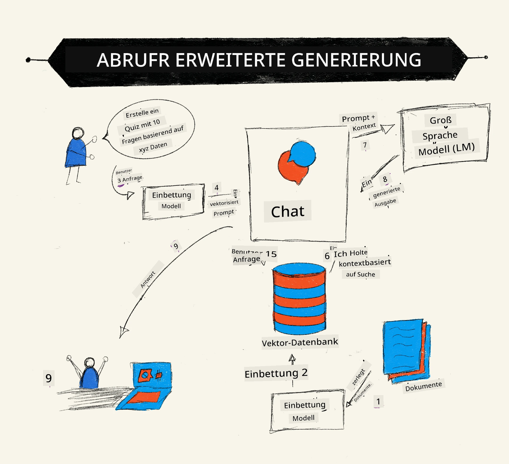
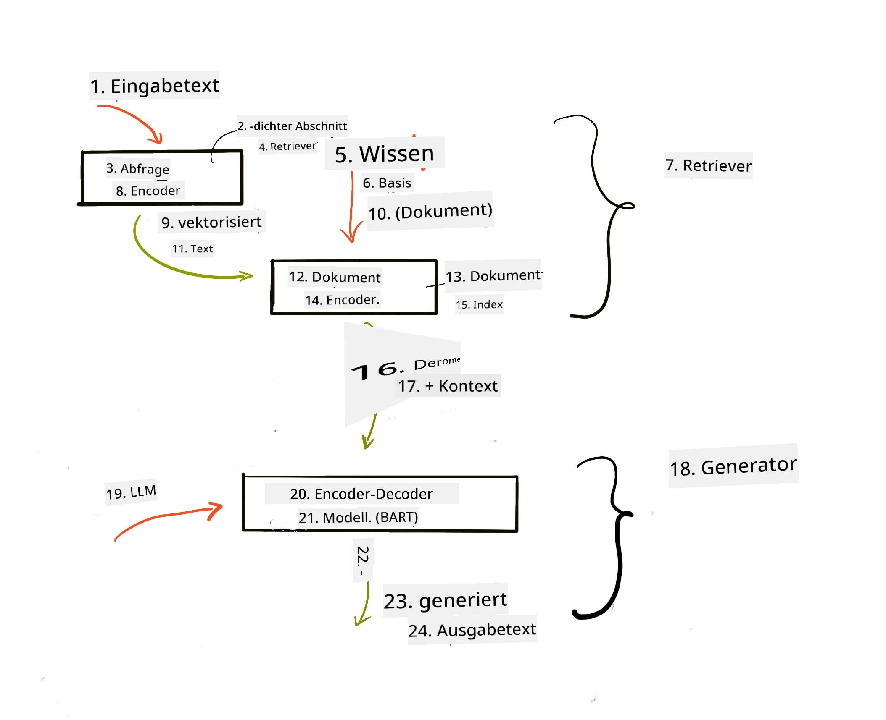

# Retrieval Augmented Generation (RAG) und Vektor-Datenbanken

[](https://youtu.be/4l8zhHUBeyI?si=BmvDmL1fnHtgQYkL)

In der Lektion zu Suchanwendungen haben wir kurz gelernt, wie man eigene Daten in Large Language Models (LLMs) integriert. In dieser Lektion werden wir tiefer in die Konzepte der Verankerung Ihrer Daten in Ihrer LLM-Anwendung eintauchen, die Mechanik des Prozesses und Methoden zur Speicherung von Daten, einschließlich sowohl Embeddings als auch Text.

> **Video folgt in Kürze**

## Einführung

In dieser Lektion behandeln wir Folgendes:

- Eine Einführung in RAG, was es ist und warum es in KI (künstlicher Intelligenz) verwendet wird.

- Verstehen, was Vektor-Datenbanken sind und wie man eine für unsere Anwendung erstellt.

- Ein praktisches Beispiel, wie man RAG in eine Anwendung integriert.

## Lernziele

Nach Abschluss dieser Lektion werden Sie in der Lage sein:

- Die Bedeutung von RAG im Datenabruf und der Datenverarbeitung zu erklären.

- Eine RAG-Anwendung einzurichten und Ihre Daten gegenüber einem LLM zu verankern

- Effektive Integration von RAG und Vektor-Datenbanken in LLM-Anwendungen.

## Unser Szenario: Verbesserung unserer LLMs mit eigenen Daten

Für diese Lektion möchten wir unsere eigenen Notizen in das Bildungs-Startup einfügen, damit der Chatbot mehr Informationen zu den verschiedenen Themen erhält. Mit den vorhandenen Notizen können Lernende besser lernen und die unterschiedlichen Themen verstehen, was das Lernen für Prüfungen erleichtert. Für unser Szenario verwenden wir:

- `Azure OpenAI:` das LLM, das wir für unseren Chatbot verwenden

- `AI for beginners' lesson on Neural Networks`: dies sind die Daten, auf denen wir unser LLM verankern

- `Azure AI Search` und `Azure Cosmos DB:` Vektor-Datenbank zur Speicherung unserer Daten und Erstellung eines Suchindexes

Benutzer können Übungsquiz, Lernkarten zur Wiederholung und Zusammenfassungen aus ihren Notizen erstellen. Um zu beginnen, schauen wir uns an, was RAG ist und wie es funktioniert:

## Retrieval Augmented Generation (RAG)

Ein durch ein LLM angetriebener Chatbot verarbeitet Nutzeranfragen, um Antworten zu generieren. Er ist darauf ausgelegt, interaktiv zu sein und mit Nutzern über eine Vielzahl von Themen zu kommunizieren. Allerdings sind seine Antworten auf den bereitgestellten Kontext und die zugrundeliegenden Trainingsdaten beschränkt. Zum Beispiel endet das Wissen von GPT-4 im September 2021, was bedeutet, dass keine Kenntnisse über Ereignisse danach vorhanden sind. Zudem schließen die Trainingsdaten vertrauliche Informationen wie persönliche Notizen oder ein Firmenhandbuch aus.

### Wie RAGs (Retrieval Augmented Generation) funktionieren



Angenommen, Sie möchten einen Chatbot bereitstellen, der aus Ihren Notizen Quizfragen erstellt, benötigen Sie eine Verbindung zur Wissensdatenbank. Hier kommt RAG ins Spiel. RAGs arbeiten folgendermaßen:

- **Wissensdatenbank:** Vor dem Abruf müssen diese Dokumente aufgenommen und vorverarbeitet werden, typischerweise indem große Dokumente in kleinere Teile zerlegt, in Text-Embeddings umgewandelt und in einer Datenbank gespeichert werden.

- **Benutzeranfrage:** der Benutzer stellt eine Frage

- **Abruf:** Wenn eine Benutzerfrage eingeht, ruft das Embedding-Modell relevante Informationen aus unserer Wissensdatenbank ab, um mehr Kontext bereitzustellen, der in die Eingabeaufforderung eingearbeitet wird.

- **Erweiterte Generierung:** das LLM verbessert seine Antwort basierend auf den abgerufenen Daten. Dies ermöglicht, dass die Antwort nicht nur auf vortrainierten Daten basiert, sondern auch auf relevanten Informationen aus dem hinzugefügten Kontext. Die abgerufenen Daten werden verwendet, um die Antworten des LLM zu erweitern. Das LLM gibt dann eine Antwort auf die Benutzerfrage zurück.



Die Architektur für RAGs wird mithilfe von Transformern umgesetzt, die aus zwei Teilen bestehen: einem Encoder und einem Decoder. Zum Beispiel wird, wenn ein Benutzer eine Frage stellt, der Eingabetext in Vektoren „kodiert“, die die Bedeutung von Wörtern erfassen, und die Vektoren werden in unserem Dokumentenindex „dekodiert“ und generieren neuen Text basierend auf der Benutzeranfrage. Das LLM verwendet ein Encoder-Decoder-Modell zur Generierung der Ausgabe.

Zwei Ansätze zur Implementierung von RAG laut dem vorgeschlagenen Papier: [Retrieval-Augmented Generation for Knowledge intensive NLP (natural language processing software) Tasks](https://arxiv.org/pdf/2005.11401.pdf?WT.mc_id=academic-105485-koreyst) sind:

- **_RAG-Sequence_**: Verwendung abgerufener Dokumente, um die bestmögliche Antwort auf eine Benutzeranfrage vorherzusagen

- **RAG-Token**: Verwendung von Dokumenten zur Generierung des nächsten Tokens, dann Abruf dieser, um die Benutzeranfrage zu beantworten

### Warum sollte man RAGs verwenden?  

- **Informationsvielfalt:** Sicherstellung, dass Textantworten aktuell und zeitgemäß sind. Es verbessert somit die Leistung bei domänenspezifischen Aufgaben durch Zugriff auf die interne Wissensdatenbank.

- Reduziert Falschinformationen durch Nutzung von **überprüfbaren Daten** in der Wissensdatenbank zur Bereitstellung von Kontext für Benutzeranfragen.

- Es ist **kosteneffektiv**, da es wirtschaftlicher ist im Vergleich zur Feinabstimmung eines LLM.

## Erstellen einer Wissensdatenbank

Unsere Anwendung basiert auf unseren persönlichen Daten, nämlich der Lektion über Neuronale Netzwerke im Curriculum „KI für Anfänger“.

### Vektor-Datenbanken

Eine Vektor-Datenbank ist im Gegensatz zu traditionellen Datenbanken eine spezialisierte Datenbank, die embedded Vektoren speichert, verwaltet und durchsucht. Sie speichert numerische Repräsentationen von Dokumenten. Das Zerlegen von Daten in numerische Embeddings erleichtert unserem KI-System das Verstehen und Verarbeiten der Daten.

Wir speichern unsere Embeddings in Vektor-Datenbanken, da LLMs eine Begrenzung der Anzahl von Tokens haben, die sie als Eingabe akzeptieren. Da man nicht die gesamten Embeddings an ein LLM übergeben kann, müssen wir sie in Teile aufteilen, und wenn ein Benutzer eine Frage stellt, werden die Embeddings, die der Frage am ähnlichsten sind, zusammen mit der Eingabeaufforderung zurückgegeben. Durch das Chunking werden auch die Kosten für die Anzahl der durch das LLM geleiteten Tokens gesenkt.

Einige beliebte Vektor-Datenbanken sind Azure Cosmos DB, Clarifyai, Pinecone, Chromadb, ScaNN, Qdrant und DeepLake. Sie können ein Azure Cosmos DB-Modell mit dem Azure CLI Befehl erstellen:

```bash
az login
az group create -n <resource-group-name> -l <location>
az cosmosdb create -n <cosmos-db-name> -r <resource-group-name>
az cosmosdb list-keys -n <cosmos-db-name> -g <resource-group-name>
```

### Von Text zu Embeddings

Bevor wir unsere Daten speichern, müssen wir sie zuerst in Vektor-Embeddings umwandeln, bevor sie in der Datenbank abgelegt werden. Wenn Sie mit großen Dokumenten oder langen Texten arbeiten, können Sie diese basierend auf den erwarteten Anfragen aufteilen. Das Chunking kann auf Satz- oder Absatzebene erfolgen. Da Chunking Bedeutungen aus den umliegenden Wörtern ableitet, können Sie einem Chunk weiteren Kontext hinzufügen, z. B. den Dokumenttitel oder Text davor oder danach einbeziehen. Sie können die Daten folgendermaßen chunkieren:

```python
def split_text(text, max_length, min_length):
    words = text.split()
    chunks = []
    current_chunk = []

    for word in words:
        current_chunk.append(word)
        if len(' '.join(current_chunk)) < max_length and len(' '.join(current_chunk)) > min_length:
            chunks.append(' '.join(current_chunk))
            current_chunk = []

    # Wenn das letzte Segment die Mindestlänge nicht erreicht hat, füge es trotzdem hinzu
    if current_chunk:
        chunks.append(' '.join(current_chunk))

    return chunks
```

Sobald die Daten gechunkt sind, können wir unseren Text mit verschiedenen Embedding-Modellen einbetten. Einige Modelle sind: word2vec, ada-002 von OpenAI, Azure Computer Vision und viele mehr. Die Auswahl des Modells hängt von den verwendeten Sprachen, der Art des Inhalts (Text/Bilder/Audio), der Größe der Eingabe und der Länge des Embedding-Ausgangs ab.

Ein Beispiel für eingebetteten Text mit OpenAIs Modell `text-embedding-ada-002` ist:


## Abruf und Vektor-Suche

Wenn ein Benutzer eine Frage stellt, wandelt der Retriever diese mit dem Query Encoder in einen Vektor um, sucht dann in unserem Dokumentensuchindex nach relevanten Vektoren, die mit der Eingabe zusammenhängen. Danach wandelt er sowohl den Eingabevektor als auch die Dokumentvektoren in Text um und übergibt sie an das LLM.

### Abruf

Der Abruf findet statt, wenn das System versucht, schnell Dokumente aus dem Index zu finden, die die Suchkriterien erfüllen. Ziel des Retrievers ist es, Dokumente zu holen, die verwendet werden, um Kontext zu liefern und das LLM auf Ihre Daten zu verankern.

Es gibt mehrere Möglichkeiten, innerhalb unserer Datenbank zu suchen, wie zum Beispiel:

- **Schlüsselwortsuche** - für Textsuchen verwendet

- **Vektorsuche** - wandelt Dokumente von Text in Vektor-Repräsentationen mit Embedding-Modellen um, erlaubt somit eine **semantische Suche** basierend auf der Bedeutung von Wörtern. Der Abruf erfolgt, indem die Dokumente abgefragt werden, deren Vektor-Repräsentationen der Benutzerfrage am nächsten sind.

- **Hybrid** - eine Kombination aus Schlüsselwort- und Vektorsuche.

Eine Herausforderung bei der Suche besteht darin, dass keine ähnliche Antwort auf die Anfrage in der Datenbank vorhanden ist. Das System gibt dann die bestmöglichen Informationen zurück. Sie können jedoch Taktiken anwenden, wie das Festlegen der maximalen Distanz für Relevanz oder die Verwendung der hybriden Suche, die Schlüsselwort- und Vektorsuche kombiniert. In dieser Lektion verwenden wir die hybride Suche, eine Kombination aus Vektor- und Schlüsselwortsuche. Unsere Daten speichern wir in einem Dataframe mit Spalten, die die Chunks sowie Embeddings enthalten.

### Vektor-Ähnlichkeit

Der Retriever sucht in der Wissensdatenbank nach Embeddings, die nahe beieinanderliegen – die nächsten Nachbarn –, da sie ähnliche Texte darstellen. Wenn ein Benutzer eine Frage stellt, wird diese zuerst eingebettet und dann mit ähnlichen Embeddings abgeglichen. Die übliche Messgröße zur Bestimmung der Ähnlichkeit verschiedener Vektoren ist die Kosinus-Ähnlichkeit, die auf dem Winkel zwischen zwei Vektoren basiert.

Als Alternativen zur Messung der Ähnlichkeit können wir die euklidische Distanz verwenden, die die gerade Linie zwischen den Vektorendpunkten ist, und das Skalarprodukt, das die Summe der Produkte der korrespondierenden Elemente zweier Vektoren misst.

### Suchindex

Für den Abruf müssen wir vor der Suche einen Suchindex für unsere Wissensdatenbank erstellen. Ein Index speichert unsere Embeddings und kann auch in einer großen Datenbank schnell die ähnlichsten Chunks abrufen. Wir können unseren Index lokal mit folgendem Befehl erstellen:

```python
from sklearn.neighbors import NearestNeighbors

embeddings = flattened_df['embeddings'].to_list()

# Erstellen Sie den Suchindex
nbrs = NearestNeighbors(n_neighbors=5, algorithm='ball_tree').fit(embeddings)

# Um den Index abzufragen, können Sie die Methode kneighbors verwenden
distances, indices = nbrs.kneighbors(embeddings)
```

### Neuordnung

Nachdem Sie die Datenbank abgefragt haben, müssen Sie die Ergebnisse möglicherweise nach Relevanz sortieren. Ein Reranking-LLM nutzt Machine Learning, um die Relevanz der Suchergebnisse zu verbessern, indem es sie nach Relevanz sortiert. Mit Azure AI Search erfolgt dieses Reranking automatisch für Sie über einen semantischen Reranker. Ein Beispiel, wie Reranking mit nächsten Nachbarn funktioniert:

```python
# Finde die ähnlichsten Dokumente
distances, indices = nbrs.kneighbors([query_vector])

index = []
# Drucke die ähnlichsten Dokumente
for i in range(3):
    index = indices[0][i]
    for index in indices[0]:
        print(flattened_df['chunks'].iloc[index])
        print(flattened_df['path'].iloc[index])
        print(flattened_df['distances'].iloc[index])
    else:
        print(f"Index {index} not found in DataFrame")
```

## Alles zusammenführen

Der letzte Schritt ist, unser LLM einzubinden, um Antworten zu erhalten, die auf unseren Daten basieren. Wir können es wie folgt implementieren:

```python
user_input = "what is a perceptron?"

def chatbot(user_input):
    # Konvertiere die Frage in einen Abfragevektor
    query_vector = create_embeddings(user_input)

    # Finde die ähnlichsten Dokumente
    distances, indices = nbrs.kneighbors([query_vector])

    # Füge Dokumente zur Abfrage hinzu, um Kontext bereitzustellen
    history = []
    for index in indices[0]:
        history.append(flattened_df['chunks'].iloc[index])

    # Kombiniere den Verlauf und die Benutzereingabe
    history.append(user_input)

    # Erstelle ein Nachrichtenobjekt
    messages=[
        {"role": "system", "content": "You are an AI assistant that helps with AI questions."},
        {"role": "user", "content": "\n\n".join(history) }
    ]

    # Verwende die Responses-API, um eine Antwort zu generieren
    response = client.responses.create(
        model="gpt-4o-mini",
        temperature=0.7,
        max_output_tokens=800,
        input=messages,
        store=False,
    )

    return response.output_text

chatbot(user_input)
```

## Bewertung unserer Anwendung

### Bewertungsmetriken

- Qualität der gelieferten Antworten, die natürlich, flüssig und menschenähnlich klingen sollen

- Verankerung der Daten: Auswertung, ob die Antwort tatsächlich aus den bereitgestellten Dokumenten stammt

- Relevanz: Bewertung, ob die Antwort zur gestellten Frage passt und in Beziehung steht

- Flüssigkeit – ob die Antwort grammatikalisch sinnvoll ist

## Anwendungsfälle für die Verwendung von RAG (Retrieval Augmented Generation) und Vektor-Datenbanken

Es gibt viele unterschiedliche Anwendungsfälle, bei denen Funktionsaufrufe Ihre App verbessern können, wie zum Beispiel:

- Frage- und Antwortsysteme: Verankerung Ihrer Unternehmensdaten in einem Chat, den Mitarbeiter zum Stellen von Fragen nutzen können.

- Empfehlungssysteme: Erstellen eines Systems, das die ähnlichsten Werte abgleicht, z. B. Filme, Restaurants und viele mehr.

- Chatbot-Dienste: Speichern des Chatverlaufs und Personalisierung des Gesprächs basierend auf Benutzerdaten.

- Bildsuche auf Basis von Vektor-Embeddings, nützlich für Bilderkennung und Anomalieerkennung.

## Zusammenfassung

Wir haben die grundlegenden Bereiche von RAG behandelt, vom Hinzufügen unserer Daten zur Anwendung, der Benutzeranfrage bis zur Ausgabe. Zur Vereinfachung der Erstellung von RAG können Sie Frameworks wie Semantic Kernel, Langchain oder Autogen verwenden.

## Aufgabe

Um Ihr Lernen zu Retrieval Augmented Generation (RAG) fortzusetzen, können Sie:

- Eine Frontend-Anwendung mit dem Framework Ihrer Wahl erstellen

- Ein Framework wie LangChain oder Semantic Kernel nutzen und Ihre Anwendung neu erstellen.

Glückwunsch zum Abschluss der Lektion 👏.

## Lernen hört hier nicht auf, setzen Sie Ihre Reise fort

Nach Abschluss dieser Lektion sehen Sie sich unsere [Generative AI Learning collection](https://aka.ms/genai-collection?WT.mc_id=academic-105485-koreyst) an, um Ihr Wissen zu generativer KI weiter auszubauen!

---

<!-- CO-OP TRANSLATOR DISCLAIMER START -->
**Haftungsausschluss**:
Dieses Dokument wurde mit dem KI-Übersetzungsdienst [Co-op Translator](https://github.com/Azure/co-op-translator) übersetzt. Obwohl wir uns um Genauigkeit bemühen, beachten Sie bitte, dass automatisierte Übersetzungen Fehler oder Ungenauigkeiten enthalten können. Das Originaldokument in seiner Ursprungssprache gilt als maßgebliche Quelle. Bei kritischen Informationen wird eine professionelle menschliche Übersetzung empfohlen. Wir übernehmen keine Haftung für Missverständnisse oder Fehlinterpretationen, die aus der Verwendung dieser Übersetzung entstehen.
<!-- CO-OP TRANSLATOR DISCLAIMER END -->