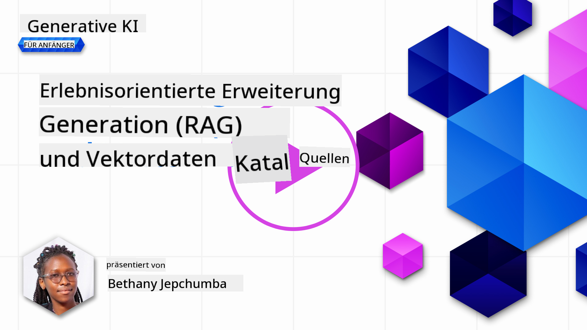
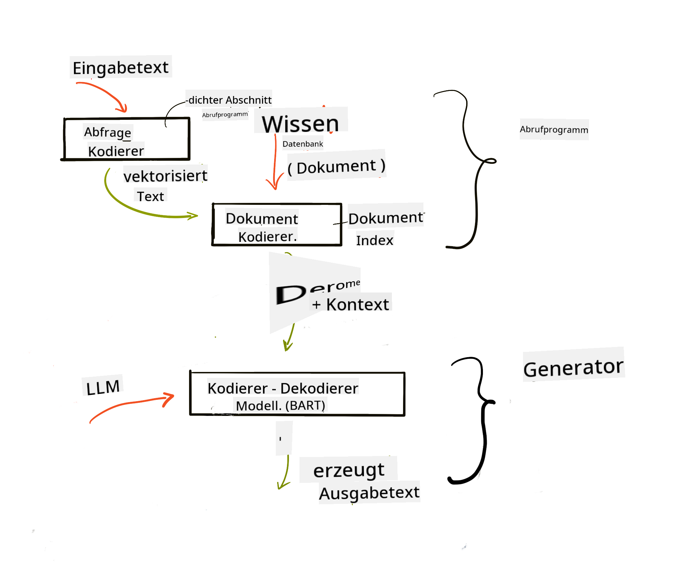
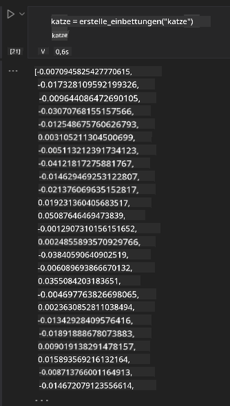

<!--
CO_OP_TRANSLATOR_METADATA:
{
  "original_hash": "e2861bbca91c0567ef32bc77fe054f9e",
  "translation_date": "2025-06-25T22:16:13+00:00",
  "source_file": "15-rag-and-vector-databases/README.md",
  "language_code": "de"
}
-->
# Retrieval Augmented Generation (RAG) und Vektordatenbanken

[](https://aka.ms/gen-ai-lesson15-gh?WT.mc_id=academic-105485-koreyst)

In der Lektion zu Suchanwendungen haben wir kurz gelernt, wie man eigene Daten in große Sprachmodelle (LLMs) integriert. In dieser Lektion werden wir weiter auf die Konzepte eingehen, wie man Daten in Ihrer LLM-Anwendung verankert, die Mechanik des Prozesses und die Methoden zur Datenspeicherung, einschließlich Einbettungen und Text.

> **Video kommt bald**

## Einführung

In dieser Lektion behandeln wir Folgendes:

- Eine Einführung in RAG, was es ist und warum es in der KI (künstliche Intelligenz) verwendet wird.

- Verständnis, was Vektordatenbanken sind und wie man eine für unsere Anwendung erstellt.

- Ein praktisches Beispiel, wie man RAG in eine Anwendung integriert.

## Lernziele

Nach Abschluss dieser Lektion werden Sie in der Lage sein:

- Die Bedeutung von RAG bei der Datenabfrage und -verarbeitung zu erklären.

- Eine RAG-Anwendung einzurichten und Ihre Daten an ein LLM zu binden.

- Effektive Integration von RAG und Vektordatenbanken in LLM-Anwendungen.

## Unser Szenario: Verbesserung unserer LLMs mit unseren eigenen Daten

Für diese Lektion möchten wir unsere eigenen Notizen in das Bildungs-Startup einfügen, das es dem Chatbot ermöglicht, mehr Informationen zu den verschiedenen Themen zu erhalten. Mit den Notizen, die wir haben, können Lernende besser studieren und die verschiedenen Themen verstehen, was es einfacher macht, für ihre Prüfungen zu lernen. Um unser Szenario zu erstellen, werden wir verwenden:

- `Azure OpenAI:` das LLM, das wir verwenden werden, um unseren Chatbot zu erstellen

- `AI for beginners' lesson on Neural Networks`: dies werden die Daten sein, auf die wir unser LLM stützen

- `Azure AI Search` und `Azure Cosmos DB:` Vektordatenbank, um unsere Daten zu speichern und einen Suchindex zu erstellen

Benutzer können Übungsquizze aus ihren Notizen erstellen, Wiederholungs-Flashcards erstellen und sie zu prägnanten Übersichten zusammenfassen. Um loszulegen, schauen wir uns an, was RAG ist und wie es funktioniert:

## Retrieval Augmented Generation (RAG)

Ein LLM-gestützter Chatbot verarbeitet Benutzeranfragen, um Antworten zu generieren. Er ist darauf ausgelegt, interaktiv zu sein und sich mit Benutzern zu einer Vielzahl von Themen zu beschäftigen. Seine Antworten sind jedoch auf den bereitgestellten Kontext und seine grundlegenden Trainingsdaten beschränkt. Zum Beispiel ist der Wissensstand von GPT-4 auf September 2021 begrenzt, was bedeutet, dass es kein Wissen über Ereignisse hat, die nach diesem Zeitraum stattgefunden haben. Darüber hinaus schließen die Daten, die zur Schulung von LLMs verwendet werden, vertrauliche Informationen wie persönliche Notizen oder ein Firmenprodukt-Handbuch aus.

### Wie RAGs (Retrieval Augmented Generation) funktionieren


Angenommen, Sie möchten einen Chatbot bereitstellen, der Quizze aus Ihren Notizen erstellt, benötigen Sie eine Verbindung zur Wissensbasis. Hier kommt RAG zur Rettung. RAGs arbeiten wie folgt:

- **Wissensbasis:** Vor der Abfrage müssen diese Dokumente aufgenommen und vorverarbeitet werden, indem große Dokumente typischerweise in kleinere Stücke zerlegt, in Texteingebettungen umgewandelt und in einer Datenbank gespeichert werden.

- **Benutzeranfrage:** Der Benutzer stellt eine Frage

- **Abfrage:** Wenn ein Benutzer eine Frage stellt, ruft das Einbettungsmodell relevante Informationen aus unserer Wissensbasis ab, um mehr Kontext bereitzustellen, der in die Eingabeaufforderung integriert wird.

- **Erweiterte Generierung:** Das LLM verbessert seine Antwort basierend auf den abgerufenen Daten. Es ermöglicht, dass die generierte Antwort nicht nur auf vortrainierten Daten, sondern auch auf relevanten Informationen aus dem hinzugefügten Kontext basiert. Die abgerufenen Daten werden verwendet, um die Antworten des LLM zu erweitern. Das LLM gibt dann eine Antwort auf die Frage des Benutzers zurück.



Die Architektur für RAGs wird unter Verwendung von Transformatoren implementiert, die aus zwei Teilen bestehen: einem Encoder und einem Decoder. Zum Beispiel, wenn ein Benutzer eine Frage stellt, wird der Eingabetext in Vektoren "kodiert", die die Bedeutung von Wörtern erfassen, und die Vektoren werden in unseren Dokumentenindex "dekodiert" und generieren neuen Text basierend auf der Benutzeranfrage. Das LLM verwendet sowohl ein Encoder-Decoder-Modell, um die Ausgabe zu generieren.

Zwei Ansätze bei der Implementierung von RAG gemäß dem vorgeschlagenen Papier: [Retrieval-Augmented Generation for Knowledge intensive NLP (natural language processing software) Tasks](https://arxiv.org/pdf/2005.11401.pdf?WT.mc_id=academic-105485-koreyst) sind:

- **_RAG-Sequence_** Verwendung abgerufener Dokumente, um die bestmögliche Antwort auf eine Benutzeranfrage vorherzusagen

- **RAG-Token** Verwendung von Dokumenten, um das nächste Token zu generieren, dann sie abzurufen, um die Benutzeranfrage zu beantworten

### Warum sollten Sie RAGs verwenden?

- **Informationsreichtum:** stellt sicher, dass Textantworten aktuell und zeitgemäß sind. Es verbessert daher die Leistung bei domänenspezifischen Aufgaben, indem es auf die interne Wissensbasis zugreift.

- Reduziert Fälschungen durch die Nutzung von **überprüfbaren Daten** in der Wissensbasis, um den Benutzern Kontext zu bieten.

- Es ist **kosteneffektiv**, da sie wirtschaftlicher sind im Vergleich zum Feinabstimmen eines LLM.

## Erstellen einer Wissensbasis

Unsere Anwendung basiert auf unseren persönlichen Daten, d.h. der Lektion über neuronale Netze im AI For Beginners-Curriculum.

### Vektordatenbanken

Eine Vektordatenbank ist im Gegensatz zu traditionellen Datenbanken eine spezialisierte Datenbank, die zum Speichern, Verwalten und Suchen von eingebetteten Vektoren entwickelt wurde. Sie speichert numerische Darstellungen von Dokumenten. Die Aufschlüsselung von Daten in numerische Einbettungen erleichtert es unserem KI-System, die Daten zu verstehen und zu verarbeiten.

Wir speichern unsere Einbettungen in Vektordatenbanken, da LLMs eine Begrenzung der Anzahl von Tokens haben, die sie als Eingabe akzeptieren. Da Sie nicht die gesamten Einbettungen an ein LLM übergeben können, müssen wir sie in Stücke aufteilen und wenn ein Benutzer eine Frage stellt, werden die Einbettungen, die der Frage am ähnlichsten sind, zusammen mit der Eingabeaufforderung zurückgegeben. Das Aufteilen reduziert auch die Kosten für die Anzahl der durch ein LLM geleiteten Tokens.

Einige beliebte Vektordatenbanken sind Azure Cosmos DB, Clarifyai, Pinecone, Chromadb, ScaNN, Qdrant und DeepLake. Sie können ein Azure Cosmos DB-Modell mit dem Azure CLI mit folgendem Befehl erstellen:

```bash
az login
az group create -n <resource-group-name> -l <location>
az cosmosdb create -n <cosmos-db-name> -r <resource-group-name>
az cosmosdb list-keys -n <cosmos-db-name> -g <resource-group-name>
```

### Vom Text zu Einbettungen

Bevor wir unsere Daten speichern, müssen wir sie in Vektoreinbettungen umwandeln, bevor sie in der Datenbank gespeichert werden. Wenn Sie mit großen Dokumenten oder langen Texten arbeiten, können Sie sie basierend auf den erwarteten Abfragen in Stücke aufteilen. Das Aufteilen kann auf Satzebene oder auf Absatzeebene erfolgen. Da das Aufteilen Bedeutungen aus den umgebenden Wörtern ableitet, können Sie einem Stück einige andere Kontexte hinzufügen, z.B. durch Hinzufügen des Dokumenttitels oder durch Einfügen von Text vor oder nach dem Stück. Sie können die Daten wie folgt aufteilen:

```python
def split_text(text, max_length, min_length):
    words = text.split()
    chunks = []
    current_chunk = []

    for word in words:
        current_chunk.append(word)
        if len(' '.join(current_chunk)) < max_length and len(' '.join(current_chunk)) > min_length:
            chunks.append(' '.join(current_chunk))
            current_chunk = []

    # If the last chunk didn't reach the minimum length, add it anyway
    if current_chunk:
        chunks.append(' '.join(current_chunk))

    return chunks
```

Sobald aufgeteilt, können wir dann unseren Text mit verschiedenen Einbettungsmodellen einbetten. Einige Modelle, die Sie verwenden können, sind: word2vec, ada-002 von OpenAI, Azure Computer Vision und viele mehr. Die Auswahl eines Modells hängt von den verwendeten Sprachen, der Art des kodierten Inhalts (Text/Bilder/Audio), der Größe der Eingabe, die es kodieren kann, und der Länge der Einbettungsausgabe ab.

Ein Beispiel für eingebetteten Text mit dem `text-embedding-ada-002` Modell von OpenAI ist:


## Abfrage und Vektorsuche

Wenn ein Benutzer eine Frage stellt, wandelt der Abruf die Frage mithilfe des Abfrageencoders in einen Vektor um, durchsucht dann unseren Dokumentensuchindex nach relevanten Vektoren im Dokument, die mit der Eingabe in Zusammenhang stehen. Sobald dies erledigt ist, wandelt es sowohl den Eingabevektor als auch die Dokumentenvektoren in Text um und leitet sie durch das LLM.

### Abfrage

Die Abfrage erfolgt, wenn das System versucht, schnell die Dokumente aus dem Index zu finden, die die Suchkriterien erfüllen. Das Ziel des Abrufers ist es, Dokumente zu erhalten, die verwendet werden, um Kontext bereitzustellen und das LLM auf Ihren Daten zu verankern.

Es gibt mehrere Möglichkeiten, innerhalb unserer Datenbank zu suchen, wie zum Beispiel:

- **Schlüsselwortsuche** - wird für Textsuchen verwendet

- **Semantische Suche** - nutzt die semantische Bedeutung von Wörtern

- **Vektorsuche** - wandelt Dokumente von Text in Vektordarstellungen mithilfe von Einbettungsmodellen um. Die Abfrage erfolgt durch Abfragen der Dokumente, deren Vektordarstellungen am nächsten zur Benutzerfrage sind.

- **Hybrid** - eine Kombination aus Schlüsselwort- und Vektorsuche.

Eine Herausforderung bei der Abfrage tritt auf, wenn keine ähnliche Antwort auf die Abfrage in der Datenbank vorhanden ist, das System wird dann die beste Information zurückgeben, die es finden kann, jedoch können Sie Taktiken wie das Einrichten der maximalen Distanz für Relevanz verwenden oder die Hybridsuche verwenden, die sowohl Schlüsselwörter als auch Vektorsuche kombiniert. In dieser Lektion verwenden wir die Hybridsuche, eine Kombination aus Vektor- und Schlüsselwortsuche. Wir werden unsere Daten in ein Datenframe mit Spalten speichern, die die Stücke sowie Einbettungen enthalten.

### Vektorähnlichkeit

Der Abrufer durchsucht die Wissensdatenbank nach Einbettungen, die nahe beieinander liegen, den nächsten Nachbarn, da sie Texte sind, die ähnlich sind. In dem Szenario, in dem ein Benutzer eine Abfrage stellt, wird diese zuerst eingebettet und dann mit ähnlichen Einbettungen abgeglichen. Die übliche Messung, die verwendet wird, um zu bestimmen, wie ähnlich verschiedene Vektoren sind, ist die Kosinusähnlichkeit, die auf dem Winkel zwischen zwei Vektoren basiert.

Wir können Ähnlichkeit mit anderen Alternativen messen, die wir verwenden können, wie der euklidischen Distanz, die die gerade Linie zwischen Vektorendpunkten ist, und dem Skalarprodukt, das die Summe der Produkte der entsprechenden Elemente zweier Vektoren misst.

### Suchindex

Beim Abrufen müssen wir einen Suchindex für unsere Wissensbasis erstellen, bevor wir die Suche durchführen. Ein Index speichert unsere Einbettungen und kann schnell die ähnlichsten Stücke auch in einer großen Datenbank abrufen. Wir können unseren Index lokal erstellen mit:

```python
from sklearn.neighbors import NearestNeighbors

embeddings = flattened_df['embeddings'].to_list()

# Create the search index
nbrs = NearestNeighbors(n_neighbors=5, algorithm='ball_tree').fit(embeddings)

# To query the index, you can use the kneighbors method
distances, indices = nbrs.kneighbors(embeddings)
```

### Neuordnung

Nachdem Sie die Datenbank abgefragt haben, müssen Sie möglicherweise die Ergebnisse von den relevantesten sortieren. Ein Neuordnungs-LLM nutzt maschinelles Lernen, um die Relevanz von Suchergebnissen zu verbessern, indem es sie von den relevantesten anordnet. Bei der Verwendung von Azure AI Search wird die Neuordnung automatisch für Sie mithilfe eines semantischen Neuordners durchgeführt. Ein Beispiel, wie die Neuordnung mit den nächsten Nachbarn funktioniert:

```python
# Find the most similar documents
distances, indices = nbrs.kneighbors([query_vector])

index = []
# Print the most similar documents
for i in range(3):
    index = indices[0][i]
    for index in indices[0]:
        print(flattened_df['chunks'].iloc[index])
        print(flattened_df['path'].iloc[index])
        print(flattened_df['distances'].iloc[index])
    else:
        print(f"Index {index} not found in DataFrame")
```

## Alles zusammenbringen

Der letzte Schritt ist, unser LLM in die Mischung einzufügen, um Antworten zu erhalten, die auf unseren Daten basieren. Wir können es wie folgt implementieren:

```python
user_input = "what is a perceptron?"

def chatbot(user_input):
    # Convert the question to a query vector
    query_vector = create_embeddings(user_input)

    # Find the most similar documents
    distances, indices = nbrs.kneighbors([query_vector])

    # add documents to query  to provide context
    history = []
    for index in indices[0]:
        history.append(flattened_df['chunks'].iloc[index])

    # combine the history and the user input
    history.append(user_input)

    # create a message object
    messages=[
        {"role": "system", "content": "You are an AI assistant that helps with AI questions."},
        {"role": "user", "content": history[-1]}
    ]

    # use chat completion to generate a response
    response = openai.chat.completions.create(
        model="gpt-4",
        temperature=0.7,
        max_tokens=800,
        messages=messages
    )

    return response.choices[0].message

chatbot(user_input)
```

## Bewertung unserer Anwendung

### Bewertungsmetriken

- Qualität der bereitgestellten Antworten, sicherzustellen, dass sie natürlich, flüssig und menschenähnlich klingen

- Verankerung der Daten: Bewertung, ob die Antwort aus den bereitgestellten Dokumenten stammt

- Relevanz: Bewertung, ob die Antwort mit der gestellten Frage übereinstimmt und in Zusammenhang steht

- Flüssigkeit - ob die Antwort grammatikalisch sinnvoll ist

## Anwendungsfälle für die Verwendung von RAG (Retrieval Augmented Generation) und Vektordatenbanken

Es gibt viele verschiedene Anwendungsfälle, bei denen Funktionsaufrufe Ihre App verbessern können, wie:

- Frage und Antwort: Verankerung Ihrer Unternehmensdaten in einem Chat, der von Mitarbeitern genutzt werden kann, um Fragen zu stellen.

- Empfehlungssysteme: wo Sie ein System erstellen können, das die ähnlichsten Werte abgleicht, z.B. Filme, Restaurants und vieles mehr.

- Chatbot-Dienste: Sie können den Chatverlauf speichern und das Gespräch basierend auf den Benutzerdaten personalisieren.

- Bildsuche basierend auf Vektoreinbettungen, nützlich bei der Bilderkennung und Anomalieerkennung.

## Zusammenfassung

Wir haben die grundlegenden Bereiche von RAG behandelt, von der Hinzufügung unserer Daten zur Anwendung, der Benutzeranfrage und der Ausgabe. Um die Erstellung von RAG zu vereinfachen, können Sie Frameworks wie Semanti Kernel, Langchain oder Autogen verwenden.

## Aufgabe

Um Ihr Lernen von Retrieval Augmented Generation (RAG) fortzusetzen, können Sie:

- Eine Front-End-Anwendung mit dem Framework Ihrer Wahl erstellen

- Ein Framework verwenden, entweder LangChain oder Semantic Kernel, und Ihre Anwendung neu erstellen.

Herzlichen Glückwunsch zum Abschluss der Lektion 👏.

## Lernen hört hier nicht auf, setzen Sie die Reise fort

Nachdem Sie diese Lektion abgeschlossen haben, schauen Sie sich unsere [Generative AI Learning Collection](https://aka.ms/genai-collection?WT.mc_id=academic-105485-koreyst) an, um Ihr Wissen über generative KI weiter zu vertiefen!

**Haftungsausschluss**:  
Dieses Dokument wurde mit dem KI-Übersetzungsdienst [Co-op Translator](https://github.com/Azure/co-op-translator) übersetzt. Obwohl wir uns um Genauigkeit bemühen, beachten Sie bitte, dass automatisierte Übersetzungen Fehler oder Ungenauigkeiten enthalten können. Das Originaldokument in seiner ursprünglichen Sprache sollte als maßgebliche Quelle betrachtet werden. Für kritische Informationen wird eine professionelle menschliche Übersetzung empfohlen. Wir haften nicht für Missverständnisse oder Fehlinterpretationen, die sich aus der Nutzung dieser Übersetzung ergeben.