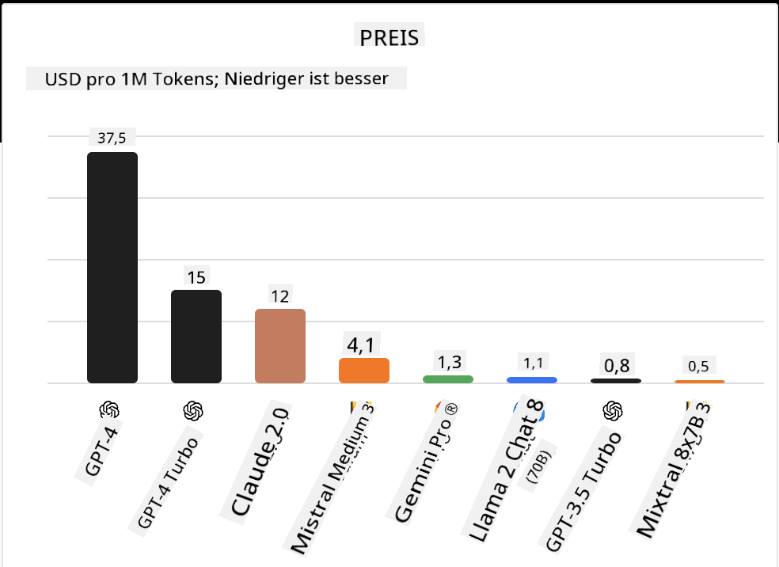

<!--
CO_OP_TRANSLATOR_METADATA:
{
  "original_hash": "0bba96e53ab841d99db731892a51fab8",
  "translation_date": "2025-05-20T06:46:13+00:00",
  "source_file": "16-open-source-models/README.md",
  "language_code": "de"
}
-->

## Einführung

Die Welt der Open-Source-LLMs ist spannend und entwickelt sich ständig weiter. Diese Lektion zielt darauf ab, einen tiefen Einblick in Open-Source-Modelle zu geben. Wenn Sie Informationen darüber suchen, wie proprietäre Modelle im Vergleich zu Open-Source-Modellen abschneiden, besuchen Sie die Lektion ["Exploring and Comparing Different LLMs"](../02-exploring-and-comparing-different-llms/README.md?WT.mc_id=academic-105485-koreyst). Diese Lektion wird auch das Thema Fine-Tuning behandeln, aber eine ausführlichere Erklärung finden Sie in der Lektion ["Fine-Tuning LLMs"](../18-fine-tuning/README.md?WT.mc_id=academic-105485-koreyst).

## Lernziele

- Ein Verständnis für Open-Source-Modelle gewinnen
- Die Vorteile der Arbeit mit Open-Source-Modellen verstehen
- Die verfügbaren Open-Modelle auf Hugging Face und im Azure AI Studio erkunden

## Was sind Open-Source-Modelle?

Open-Source-Software hat eine entscheidende Rolle im Wachstum der Technologie in verschiedenen Bereichen gespielt. Die Open Source Initiative (OSI) hat [10 Kriterien für Software](https://web.archive.org/web/20241126001143/https://opensource.org/osd?WT.mc_id=academic-105485-koreyst) definiert, um als Open Source klassifiziert zu werden. Der Quellcode muss unter einer von der OSI anerkannten Lizenz offen geteilt werden.

Während die Entwicklung von LLMs ähnliche Elemente wie die Softwareentwicklung hat, ist der Prozess nicht genau derselbe. Dies hat in der Gemeinschaft viel Diskussion über die Definition von Open Source im Kontext von LLMs gebracht. Damit ein Modell mit der traditionellen Definition von Open Source übereinstimmt, sollten die folgenden Informationen öffentlich verfügbar sein:

- Datensätze, die zum Trainieren des Modells verwendet wurden.
- Vollständige Modellgewichte als Teil des Trainings.
- Der Evaluierungscode.
- Der Fine-Tuning-Code.
- Vollständige Modellgewichte und Trainingsmetriken.

Derzeit gibt es nur wenige Modelle, die diesen Kriterien entsprechen. Das [OLMo-Modell, erstellt vom Allen Institute for Artificial Intelligence (AllenAI)](https://huggingface.co/allenai/OLMo-7B?WT.mc_id=academic-105485-koreyst), ist eines, das in diese Kategorie passt.

Für diese Lektion werden wir die Modelle als "offene Modelle" bezeichnen, da sie möglicherweise zum Zeitpunkt des Schreibens nicht den oben genannten Kriterien entsprechen.

## Vorteile von offenen Modellen

**Hochgradig anpassbar** - Da offene Modelle mit detaillierten Trainingsinformationen veröffentlicht werden, können Forscher und Entwickler die Interna des Modells ändern. Dies ermöglicht die Erstellung hochspezialisierter Modelle, die für eine bestimmte Aufgabe oder ein Studiengebiet feinabgestimmt sind. Einige Beispiele dafür sind Codegenerierung, mathematische Operationen und Biologie.

**Kosten** - Die Kosten pro Token für die Nutzung und Bereitstellung dieser Modelle sind niedriger als bei proprietären Modellen. Bei der Erstellung von Generative AI-Anwendungen sollte die Leistung im Vergleich zum Preis bei der Arbeit mit diesen Modellen für Ihren Anwendungsfall betrachtet werden.

  
Quelle: Artificial Analysis

**Flexibilität** - Die Arbeit mit offenen Modellen ermöglicht es Ihnen, flexibel in Bezug auf die Nutzung verschiedener Modelle oder deren Kombination zu sein. Ein Beispiel dafür sind die [HuggingChat Assistants](https://huggingface.co/chat?WT.mc_id=academic-105485-koreyst), bei denen ein Benutzer das verwendete Modell direkt in der Benutzeroberfläche auswählen kann:

## Verschiedene offene Modelle erkunden

### Llama 2

[LLama2](https://huggingface.co/meta-llama?WT.mc_id=academic-105485-koreyst), entwickelt von Meta, ist ein offenes Modell, das für chatbasierte Anwendungen optimiert ist. Dies liegt an seiner Fine-Tuning-Methode, die eine große Menge an Dialogen und menschlichem Feedback einschloss. Mit dieser Methode liefert das Modell mehr Ergebnisse, die den menschlichen Erwartungen entsprechen, was eine bessere Benutzererfahrung bietet.

Einige Beispiele für feinabgestimmte Versionen von Llama sind [Japanese Llama](https://huggingface.co/elyza/ELYZA-japanese-Llama-2-7b?WT.mc_id=academic-105485-koreyst), das sich auf Japanisch spezialisiert hat, und [Llama Pro](https://huggingface.co/TencentARC/LLaMA-Pro-8B?WT.mc_id=academic-105485-koreyst), eine verbesserte Version des Basismodells.

### Mistral

[Mistral](https://huggingface.co/mistralai?WT.mc_id=academic-105485-koreyst) ist ein offenes Modell mit starkem Fokus auf hohe Leistung und Effizienz. Es verwendet den Mixture-of-Experts-Ansatz, der eine Gruppe spezialisierter Expertenmodelle zu einem System kombiniert, bei dem je nach Eingabe bestimmte Modelle ausgewählt werden. Dies macht die Berechnung effektiver, da Modelle nur die Eingaben adressieren, in denen sie spezialisiert sind.

Einige Beispiele für feinabgestimmte Versionen von Mistral sind [BioMistral](https://huggingface.co/BioMistral/BioMistral-7B?text=Mon+nom+est+Thomas+et+mon+principal?WT.mc_id=academic-105485-koreyst), das sich auf den medizinischen Bereich konzentriert, und [OpenMath Mistral](https://huggingface.co/nvidia/OpenMath-Mistral-7B-v0.1-hf?WT.mc_id=academic-105485-koreyst), das mathematische Berechnungen durchführt.

### Falcon

[Falcon](https://huggingface.co/tiiuae?WT.mc_id=academic-105485-koreyst) ist ein LLM, das vom Technology Innovation Institute (**TII**) erstellt wurde. Der Falcon-40B wurde mit 40 Milliarden Parametern trainiert, was gezeigt hat, dass er besser als GPT-3 mit weniger Rechenbudget abschneidet. Dies liegt an seiner Verwendung des FlashAttention-Algorithmus und der Multiquery-Aufmerksamkeit, die es ihm ermöglicht, die Speicheranforderungen zur Inferenzzeit zu reduzieren. Mit dieser verkürzten Inferenzzeit ist der Falcon-40B für Chat-Anwendungen geeignet.

Einige Beispiele für feinabgestimmte Versionen von Falcon sind der [OpenAssistant](https://huggingface.co/OpenAssistant/falcon-40b-sft-top1-560?WT.mc_id=academic-105485-koreyst), ein auf offenen Modellen basierender Assistent, und [GPT4ALL](https://huggingface.co/nomic-ai/gpt4all-falcon?WT.mc_id=academic-105485-koreyst), der eine höhere Leistung als das Basismodell liefert.

## Wie man auswählt

Es gibt keine einzige Antwort darauf, wie man ein offenes Modell auswählt. Ein guter Ausgangspunkt ist die Verwendung der Filterfunktion nach Aufgabe im Azure AI Studio. Dies wird Ihnen helfen zu verstehen, für welche Arten von Aufgaben das Modell trainiert wurde. Hugging Face pflegt auch ein LLM Leaderboard, das Ihnen die besten Modelle basierend auf bestimmten Metriken zeigt.

Wenn Sie LLMs über die verschiedenen Typen hinweg vergleichen möchten, ist [Artificial Analysis](https://artificialanalysis.ai/?WT.mc_id=academic-105485-koreyst) eine weitere großartige Ressource:

  
Quelle: Artificial Analysis

Wenn Sie an einem spezifischen Anwendungsfall arbeiten, kann die Suche nach feinabgestimmten Versionen, die auf demselben Bereich fokussiert sind, effektiv sein. Das Experimentieren mit mehreren offenen Modellen, um zu sehen, wie sie gemäß Ihren und den Erwartungen Ihrer Benutzer abschneiden, ist eine weitere gute Praxis.

## Nächste Schritte

Der beste Teil an offenen Modellen ist, dass Sie schnell mit ihnen arbeiten können. Schauen Sie sich den [Azure AI Studio Model Catalog](https://ai.azure.com?WT.mc_id=academic-105485-koreyst) an, der eine spezielle Hugging Face-Sammlung mit den hier besprochenen Modellen bietet.

## Lernen hört hier nicht auf, setzen Sie die Reise fort

Nachdem Sie diese Lektion abgeschlossen haben, schauen Sie sich unsere [Generative AI Learning collection](https://aka.ms/genai-collection?WT.mc_id=academic-105485-koreyst) an, um Ihr Wissen über Generative AI weiter zu vertiefen!

**Haftungsausschluss**: 
Dieses Dokument wurde mit dem KI-Übersetzungsdienst [Co-op Translator](https://github.com/Azure/co-op-translator) übersetzt. Obwohl wir uns um Genauigkeit bemühen, beachten Sie bitte, dass automatisierte Übersetzungen Fehler oder Ungenauigkeiten enthalten können. Das Originaldokument in seiner ursprünglichen Sprache sollte als maßgebliche Quelle angesehen werden. Für kritische Informationen wird eine professionelle menschliche Übersetzung empfohlen. Wir übernehmen keine Haftung für Missverständnisse oder Fehlinterpretationen, die sich aus der Verwendung dieser Übersetzung ergeben.