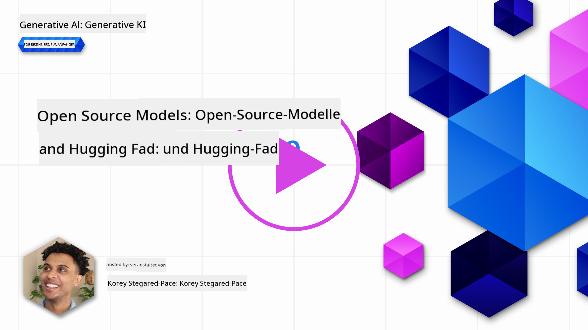
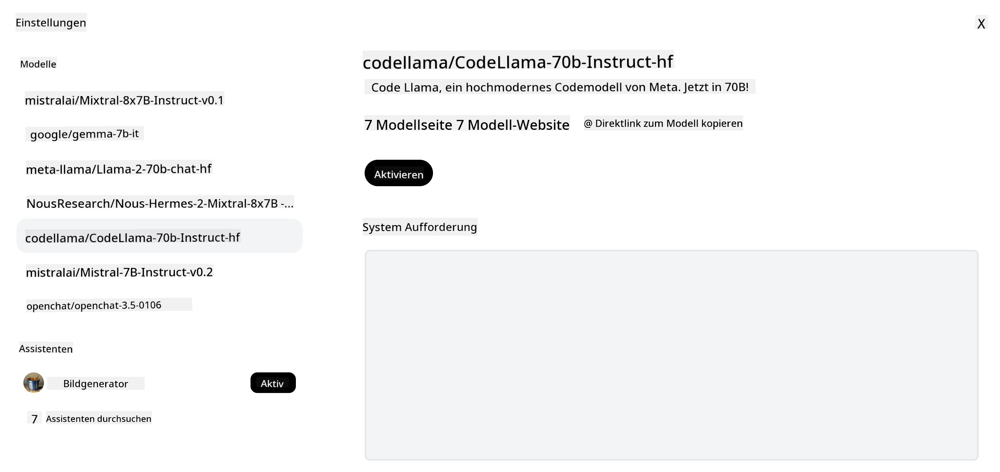
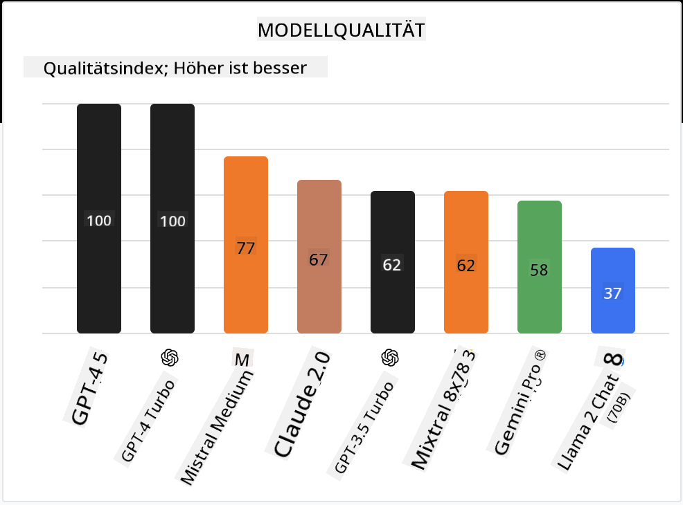

<!--
CO_OP_TRANSLATOR_METADATA:
{
  "original_hash": "0bba96e53ab841d99db731892a51fab8",
  "translation_date": "2025-07-09T17:03:22+00:00",
  "source_file": "16-open-source-models/README.md",
  "language_code": "de"
}
-->

## Einführung

Die Welt der Open-Source-LLMs ist spannend und entwickelt sich ständig weiter. Diese Lektion bietet einen tiefgehenden Einblick in Open-Source-Modelle. Wenn Sie Informationen darüber suchen, wie sich proprietäre Modelle im Vergleich zu Open-Source-Modellen verhalten, gehen Sie zur ["Exploring and Comparing Different LLMs"-Lektion](../02-exploring-and-comparing-different-llms/README.md?WT.mc_id=academic-105485-koreyst). Diese Lektion behandelt auch das Thema Fine-Tuning, eine ausführlichere Erklärung finden Sie jedoch in der ["Fine-Tuning LLMs"-Lektion](../18-fine-tuning/README.md?WT.mc_id=academic-105485-koreyst).

## Lernziele

- Verständnis für Open-Source-Modelle gewinnen  
- Die Vorteile der Arbeit mit Open-Source-Modellen verstehen  
- Die auf Hugging Face und im Azure AI Studio verfügbaren Open-Modelle erkunden  

## Was sind Open-Source-Modelle?

Open-Source-Software hat eine entscheidende Rolle beim Wachstum der Technologie in verschiedenen Bereichen gespielt. Die Open Source Initiative (OSI) hat [10 Kriterien für Software](https://web.archive.org/web/20241126001143/https://opensource.org/osd?WT.mc_id=academic-105485-koreyst) definiert, damit diese als Open Source eingestuft werden kann. Der Quellcode muss unter einer von der OSI genehmigten Lizenz offen zugänglich sein.

Obwohl die Entwicklung von LLMs Ähnlichkeiten mit der Softwareentwicklung aufweist, ist der Prozess nicht identisch. Dies hat in der Community zu vielen Diskussionen über die Definition von Open Source im Kontext von LLMs geführt. Damit ein Modell der traditionellen Definition von Open Source entspricht, sollten folgende Informationen öffentlich zugänglich sein:

- Datensätze, die zum Training des Modells verwendet wurden  
- Vollständige Modellgewichte als Teil des Trainings  
- Der Evaluierungscode  
- Der Fine-Tuning-Code  
- Vollständige Modellgewichte und Trainingsmetriken  

Derzeit gibt es nur wenige Modelle, die diese Kriterien erfüllen. Das [OLMo-Modell, erstellt vom Allen Institute for Artificial Intelligence (AllenAI)](https://huggingface.co/allenai/OLMo-7B?WT.mc_id=academic-105485-koreyst), ist eines, das in diese Kategorie fällt.

Für diese Lektion werden wir die Modelle künftig als „Open Models“ bezeichnen, da sie zum Zeitpunkt der Erstellung möglicherweise nicht alle oben genannten Kriterien erfüllen.

## Vorteile von Open Models

**Hohe Anpassbarkeit** – Da Open Models mit detaillierten Trainingsinformationen veröffentlicht werden, können Forscher und Entwickler die internen Strukturen des Modells verändern. So lassen sich hochspezialisierte Modelle erstellen, die für eine bestimmte Aufgabe oder ein Fachgebiet feinabgestimmt sind. Beispiele hierfür sind Code-Generierung, mathematische Operationen und Biologie.

**Kosten** – Die Kosten pro Token für die Nutzung und den Einsatz dieser Modelle sind niedriger als bei proprietären Modellen. Beim Aufbau von Generative-AI-Anwendungen sollte man daher Leistung und Preis im Hinblick auf den eigenen Anwendungsfall vergleichen.

  
Quelle: Artificial Analysis

**Flexibilität** – Die Arbeit mit Open Models ermöglicht es, flexibel verschiedene Modelle zu verwenden oder zu kombinieren. Ein Beispiel dafür sind die [HuggingChat Assistants](https://huggingface.co/chat?WT.mc_id=academic-105485-koreyst), bei denen Nutzer das verwendete Modell direkt in der Benutzeroberfläche auswählen können:

## Verschiedene Open Models erkunden

### Llama 2

[LLama2](https://huggingface.co/meta-llama?WT.mc_id=academic-105485-koreyst), entwickelt von Meta, ist ein Open Model, das für chatbasierte Anwendungen optimiert wurde. Dies liegt an der Fine-Tuning-Methode, die eine große Menge an Dialogen und menschlichem Feedback einbezog. Dadurch liefert das Modell Ergebnisse, die stärker an menschlichen Erwartungen ausgerichtet sind, was die Nutzererfahrung verbessert.

Einige Beispiele für feinabgestimmte Versionen von Llama sind [Japanese Llama](https://huggingface.co/elyza/ELYZA-japanese-Llama-2-7b?WT.mc_id=academic-105485-koreyst), spezialisiert auf Japanisch, und [Llama Pro](https://huggingface.co/TencentARC/LLaMA-Pro-8B?WT.mc_id=academic-105485-koreyst), eine erweiterte Version des Basismodells.

### Mistral

[Mistral](https://huggingface.co/mistralai?WT.mc_id=academic-105485-koreyst) ist ein Open Model mit starkem Fokus auf hohe Leistung und Effizienz. Es verwendet den Mixture-of-Experts-Ansatz, bei dem eine Gruppe spezialisierter Expertenmodelle zu einem System kombiniert wird, bei dem je nach Eingabe bestimmte Modelle ausgewählt werden. Das macht die Berechnung effektiver, da Modelle nur die Eingaben bearbeiten, auf die sie spezialisiert sind.

Einige Beispiele für feinabgestimmte Versionen von Mistral sind [BioMistral](https://huggingface.co/BioMistral/BioMistral-7B?text=Mon+nom+est+Thomas+et+mon+principal?WT.mc_id=academic-105485-koreyst), das sich auf den medizinischen Bereich konzentriert, und [OpenMath Mistral](https://huggingface.co/nvidia/OpenMath-Mistral-7B-v0.1-hf?WT.mc_id=academic-105485-koreyst), das mathematische Berechnungen durchführt.

### Falcon

[Falcon](https://huggingface.co/tiiuae?WT.mc_id=academic-105485-koreyst) ist ein LLM, das vom Technology Innovation Institute (**TII**) entwickelt wurde. Der Falcon-40B wurde mit 40 Milliarden Parametern trainiert und zeigt eine bessere Leistung als GPT-3 bei geringerem Rechenaufwand. Dies ist auf den Einsatz des FlashAttention-Algorithmus und Multiquery-Attention zurückzuführen, die den Speicherbedarf zur Inferenzzeit reduzieren. Durch die verkürzte Inferenzzeit eignet sich der Falcon-40B besonders für Chat-Anwendungen.

Einige Beispiele für feinabgestimmte Versionen von Falcon sind der [OpenAssistant](https://huggingface.co/OpenAssistant/falcon-40b-sft-top1-560?WT.mc_id=academic-105485-koreyst), ein auf Open Models basierender Assistent, und [GPT4ALL](https://huggingface.co/nomic-ai/gpt4all-falcon?WT.mc_id=academic-105485-koreyst), der eine höhere Leistung als das Basismodell bietet.

## Wie wählt man aus?

Es gibt keine allgemeingültige Antwort darauf, wie man ein Open Model auswählt. Ein guter Startpunkt ist die Filterfunktion nach Aufgaben im Azure AI Studio. Diese hilft dabei zu verstehen, für welche Aufgaben das Modell trainiert wurde. Hugging Face pflegt außerdem ein LLM-Leaderboard, das die leistungsstärksten Modelle anhand bestimmter Metriken zeigt.

Wenn Sie LLMs verschiedener Typen vergleichen möchten, ist [Artificial Analysis](https://artificialanalysis.ai/?WT.mc_id=academic-105485-koreyst) eine weitere hervorragende Ressource:

  
Quelle: Artificial Analysis

Wenn Sie an einem spezifischen Anwendungsfall arbeiten, kann es sinnvoll sein, nach feinabgestimmten Versionen zu suchen, die sich auf denselben Bereich konzentrieren. Es ist auch eine gute Praxis, mehrere Open Models auszuprobieren, um zu sehen, wie sie im Hinblick auf Ihre und die Erwartungen Ihrer Nutzer abschneiden.

## Nächste Schritte

Das Beste an Open Models ist, dass Sie schnell mit der Arbeit beginnen können. Schauen Sie sich den [Azure AI Studio Model Catalog](https://ai.azure.com?WT.mc_id=academic-105485-koreyst) an, der eine spezielle Hugging Face-Sammlung mit den hier besprochenen Modellen enthält.

## Lernen hört hier nicht auf – setzen Sie Ihre Reise fort

Nach Abschluss dieser Lektion werfen Sie einen Blick auf unsere [Generative AI Learning collection](https://aka.ms/genai-collection?WT.mc_id=academic-105485-koreyst), um Ihr Wissen im Bereich Generative AI weiter auszubauen!

**Haftungsausschluss**:  
Dieses Dokument wurde mit dem KI-Übersetzungsdienst [Co-op Translator](https://github.com/Azure/co-op-translator) übersetzt. Obwohl wir uns um Genauigkeit bemühen, beachten Sie bitte, dass automatisierte Übersetzungen Fehler oder Ungenauigkeiten enthalten können. Das Originaldokument in seiner Ursprungssprache gilt als maßgebliche Quelle. Für wichtige Informationen wird eine professionelle menschliche Übersetzung empfohlen. Wir übernehmen keine Haftung für Missverständnisse oder Fehlinterpretationen, die aus der Nutzung dieser Übersetzung entstehen.