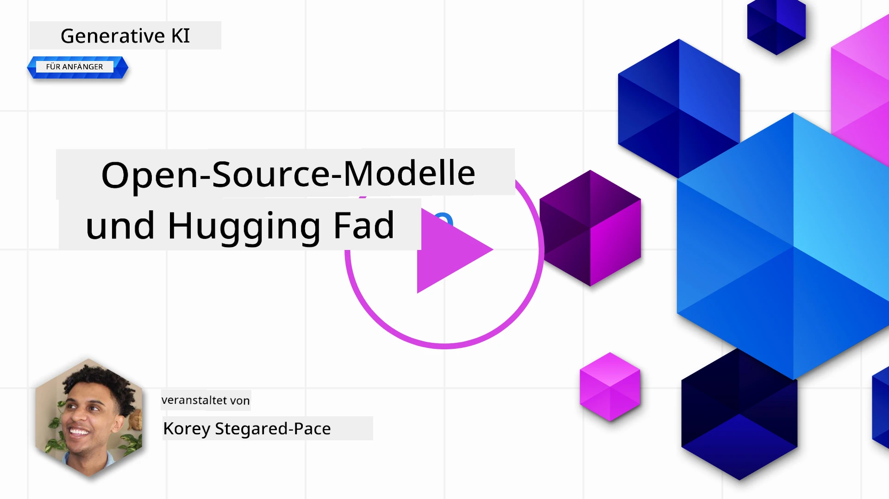
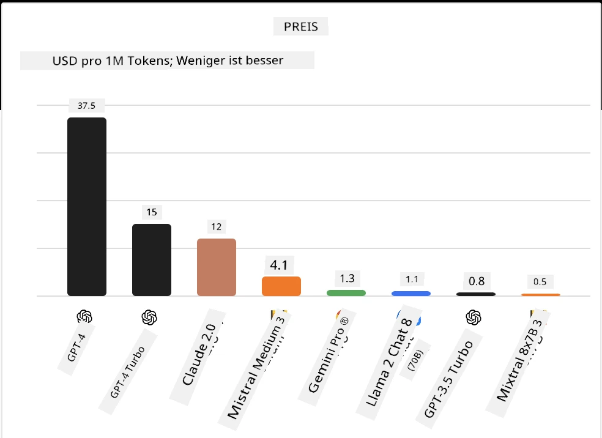
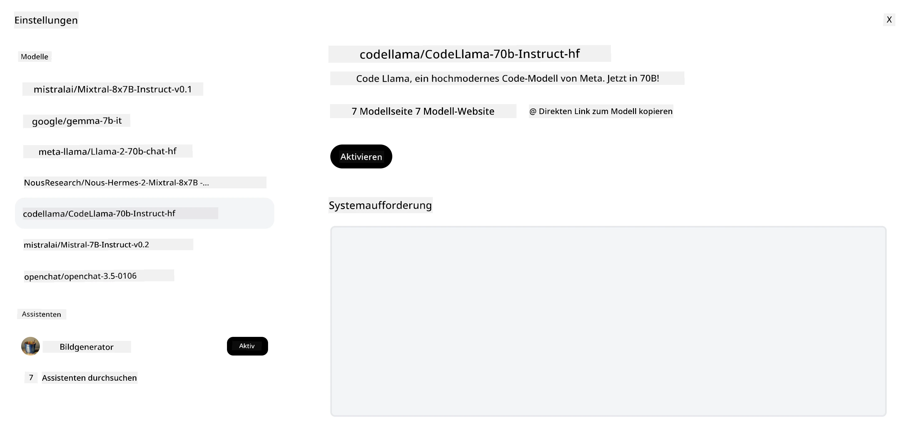
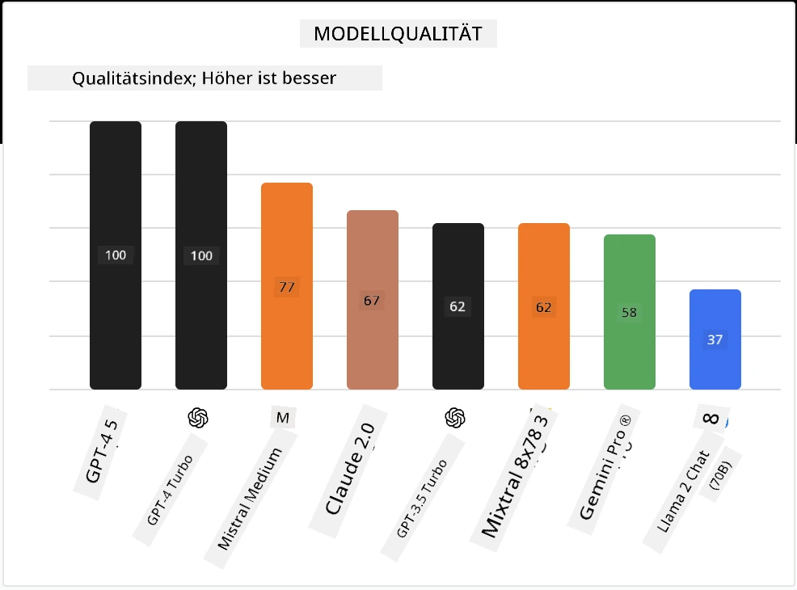

## Einführung

Die Welt der Open-Source-LLMs ist spannend und entwickelt sich ständig weiter. Diese Lektion bietet einen tiefgehenden Einblick in Open-Source-Modelle. Wenn Sie Informationen darüber suchen, wie sich proprietäre Modelle mit Open-Source-Modellen vergleichen, gehen Sie zur ["Erkunden und Vergleich verschiedener LLMs"-Lektion](../02-exploring-and-comparing-different-llms/README.md?WT.mc_id=academic-105485-koreyst). Diese Lektion behandelt auch das Thema Feinabstimmung, eine ausführlichere Erklärung finden Sie in der ["Feinabstimmung von LLMs"-Lektion](../18-fine-tuning/README.md?WT.mc_id=academic-105485-koreyst).

## Lernziele

- Verständnis von Open-Source-Modellen gewinnen
- Verständnis der Vorteile der Arbeit mit Open-Source-Modellen
- Erkundung der verfügbaren offenen Modelle auf Hugging Face und im Microsoft Foundry Modellkatalog

## Was sind Open-Source-Modelle?

Open-Source-Software hat eine entscheidende Rolle im technologischen Fortschritt in verschiedenen Bereichen gespielt. Die Open Source Initiative (OSI) hat [10 Kriterien für Software](https://web.archive.org/web/20241126001143/https://opensource.org/osd?WT.mc_id=academic-105485-koreyst) definiert, die als Open Source klassifiziert werden kann. Der Quellcode muss unter einer von der OSI genehmigten Lizenz offen geteilt werden.

Obwohl die Entwicklung von LLMs Ähnlichkeiten mit der Softwareentwicklung aufweist, ist der Prozess nicht genau derselbe. Dies hat zu vielen Diskussionen in der Community über die Definition von Open Source im Kontext von LLMs geführt. Damit ein Modell der traditionellen Definition von Open Source entspricht, sollten folgende Informationen öffentlich verfügbar sein:

- Datensätze, die zum Trainieren des Modells verwendet wurden.
- Komplette Modellgewichte als Teil des Trainings.
- Der Bewertungs-Code.
- Der Feinabstimmungs-Code.
- Vollständige Modellgewichte und Trainingsmetriken.

Derzeit gibt es nur wenige Modelle, die diesem Kriterium entsprechen. Das [OLMo-Modell, erstellt vom Allen Institute for Artificial Intelligence (AllenAI)](https://huggingface.co/allenai/OLMo-7B?WT.mc_id=academic-105485-koreyst), ist eines, das in diese Kategorie fällt.

Für diese Lektion bezeichnen wir die Modelle im Folgenden als „offene Modelle“, da sie möglicherweise zum Zeitpunkt des Schreibens nicht vollständig den obigen Kriterien entsprechen.

## Vorteile offener Modelle

**Hochgradig anpassbar** – Da offene Modelle mit detaillierten Trainingsinformationen veröffentlicht werden, können Forscher und Entwickler die internen Strukturen des Modells modifizieren. Dies ermöglicht die Erstellung hochspezialisierter Modelle, die für eine bestimmte Aufgabe oder ein Fachgebiet feinabgestimmt sind. Beispiele dafür sind Codegenerierung, mathematische Operationen und Biologie.

**Kosten** – Die Kosten pro Token für die Nutzung und Bereitstellung dieser Modelle sind niedriger als bei proprietären Modellen. Beim Erstellen von Generativen KI-Anwendungen sollten Leistung und Preis in Bezug auf Ihren Anwendungsfall berücksichtigt werden.

Quelle: Artificial Analysis

**Flexibilität** – Die Arbeit mit offenen Modellen ermöglicht es, flexibel zu sein, indem verschiedene Modelle verwendet oder kombiniert werden können. Ein Beispiel dafür sind die [HuggingChat Assistenten](https://huggingface.co/chat?WT.mc_id=academic-105485-koreyst), bei denen Nutzer das verwendete Modell direkt in der Benutzeroberfläche auswählen können:

## Erkundung verschiedener offener Modelle

### Llama 2

[Llama2](https://huggingface.co/meta-llama?WT.mc_id=academic-105485-koreyst), entwickelt von Meta, ist ein offenes Modell, das für chatbasierte Anwendungen optimiert ist. Dies ist auf seine Feinabstimmungsmethode zurückzuführen, die eine große Menge Dialoge und menschliches Feedback umfasst. Mit dieser Methode erzeugt das Modell Ergebnisse, die stärker an menschlichen Erwartungen ausgerichtet sind, was eine bessere Nutzererfahrung bietet.

Einige Beispiele feinabgestimmter Versionen von Llama sind [Japanese Llama](https://huggingface.co/elyza/ELYZA-japanese-Llama-2-7b?WT.mc_id=academic-105485-koreyst), spezialisiert auf Japanisch, und [Llama Pro](https://huggingface.co/TencentARC/LLaMA-Pro-8B?WT.mc_id=academic-105485-koreyst), eine verbesserte Version des Basismodells.

### Mistral

[Mistral](https://huggingface.co/mistralai?WT.mc_id=academic-105485-koreyst) ist ein offenes Modell mit starkem Fokus auf hohe Leistung und Effizienz. Es verwendet den Mixture-of-Experts-Ansatz, der eine Gruppe spezialisierter Expertenmodelle in einem System kombiniert, bei dem je nach Eingabe bestimmte Modelle ausgewählt werden. Dies macht die Berechnung effektiver, da Modelle nur die Eingaben bearbeiten, auf die sie spezialisiert sind.

Einige Beispiele feinabgestimmter Versionen von Mistral sind [BioMistral](https://huggingface.co/BioMistral/BioMistral-7B?text=Mon+nom+est+Thomas+et+mon+principal?WT.mc_id=academic-105485-koreyst), das sich auf den medizinischen Bereich konzentriert, und [OpenMath Mistral](https://huggingface.co/nvidia/OpenMath-Mistral-7B-v0.1-hf?WT.mc_id=academic-105485-koreyst), das mathematische Berechnungen durchführt.

### Falcon

[Falcon](https://huggingface.co/tiiuae?WT.mc_id=academic-105485-koreyst) ist ein LLM, das vom Technology Innovation Institute (**TII**) erstellt wurde. Der Falcon-40B wurde mit 40 Milliarden Parametern trainiert und hat sich als leistungsfähiger erwiesen als GPT-3 bei geringerem Rechenaufwand. Dies ist auf die Nutzung des FlashAttention-Algorithmus und Multiquery Attention zurückzuführen, die den Speicherbedarf zur Inferenzzeit reduzieren. Dank dieser verkürzten Inferenzzeit eignet sich der Falcon-40B für Chat-Anwendungen.

Einige Beispiele feinabgestimmter Versionen von Falcon sind der [OpenAssistant](https://huggingface.co/OpenAssistant/falcon-40b-sft-top1-560?WT.mc_id=academic-105485-koreyst), ein auf offenen Modellen basierender Assistent, und [GPT4ALL](https://huggingface.co/nomic-ai/gpt4all-falcon?WT.mc_id=academic-105485-koreyst), der eine höhere Leistung als das Basismodell bietet.

## Wie wählt man aus

Es gibt keine einfache Antwort, wenn es darum geht, ein offenes Modell auszuwählen. Ein guter Startpunkt ist die Filterfunktion nach Aufgabe im Microsoft Foundry Modellkatalog. Dies hilft zu verstehen, für welche Aufgabentypen das Modell trainiert wurde. Hugging Face pflegt auch ein LLM-Ranking, das die am besten performenden Modelle basierend auf bestimmten Metriken zeigt.

Wenn Sie LLMs über verschiedene Typen hinweg vergleichen möchten, ist [Artificial Analysis](https://artificialanalysis.ai/?WT.mc_id=academic-105485-koreyst) eine weitere großartige Ressource:

Quelle: Artificial Analysis

Wenn Sie an einem spezifischen Anwendungsfall arbeiten, kann die Suche nach feinabgestimmten Modellen, die auf denselben Bereich fokussieren, effektiv sein. Das Experimentieren mit mehreren offenen Modellen, um zu sehen, wie sie gemäß Ihren und den Erwartungen Ihrer Nutzer abschneiden, ist eine weitere gute Praxis.

## Nächste Schritte

Das Beste an offenen Modellen ist, dass Sie ziemlich schnell mit ihnen arbeiten können. Schauen Sie sich den [Microsoft Foundry Modellkatalog](https://ai.azure.com?WT.mc_id=academic-105485-koreyst) an, der eine besondere Sammlung von Hugging Face mit den hier besprochenen Modellen bietet.

## Lernen endet hier nicht, setze die Reise fort

Nach Abschluss dieser Lektion sehen Sie sich unsere [Generative AI Lernsammlung](https://aka.ms/genai-collection?WT.mc_id=academic-105485-koreyst) an, um Ihr Wissen über Generative KI weiter zu vertiefen!

---

<!-- CO-OP TRANSLATOR DISCLAIMER START -->
**Haftungsausschluss**:
Dieses Dokument wurde mit dem KI-Übersetzungsdienst [Co-op Translator](https://github.com/Azure/co-op-translator) übersetzt. Obwohl wir uns um Genauigkeit bemühen, beachten Sie bitte, dass automatisierte Übersetzungen Fehler oder Ungenauigkeiten enthalten können. Das Originaldokument in seiner Ursprungssprache gilt als maßgebliche Quelle. Bei kritischen Informationen wird eine professionelle menschliche Übersetzung empfohlen. Wir übernehmen keine Haftung für Missverständnisse oder Fehlinterpretationen, die aus der Verwendung dieser Übersetzung entstehen.
<!-- CO-OP TRANSLATOR DISCLAIMER END -->