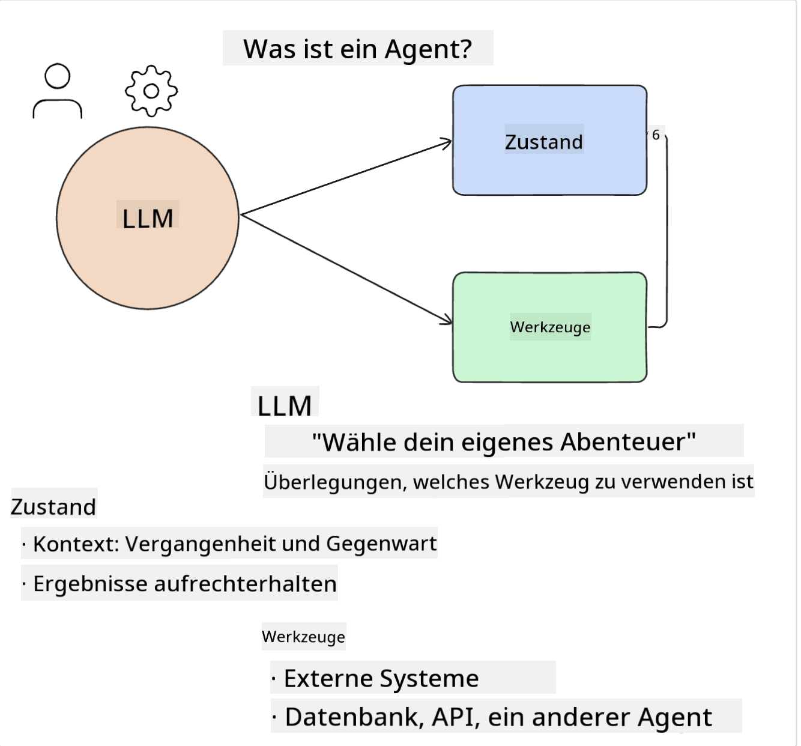
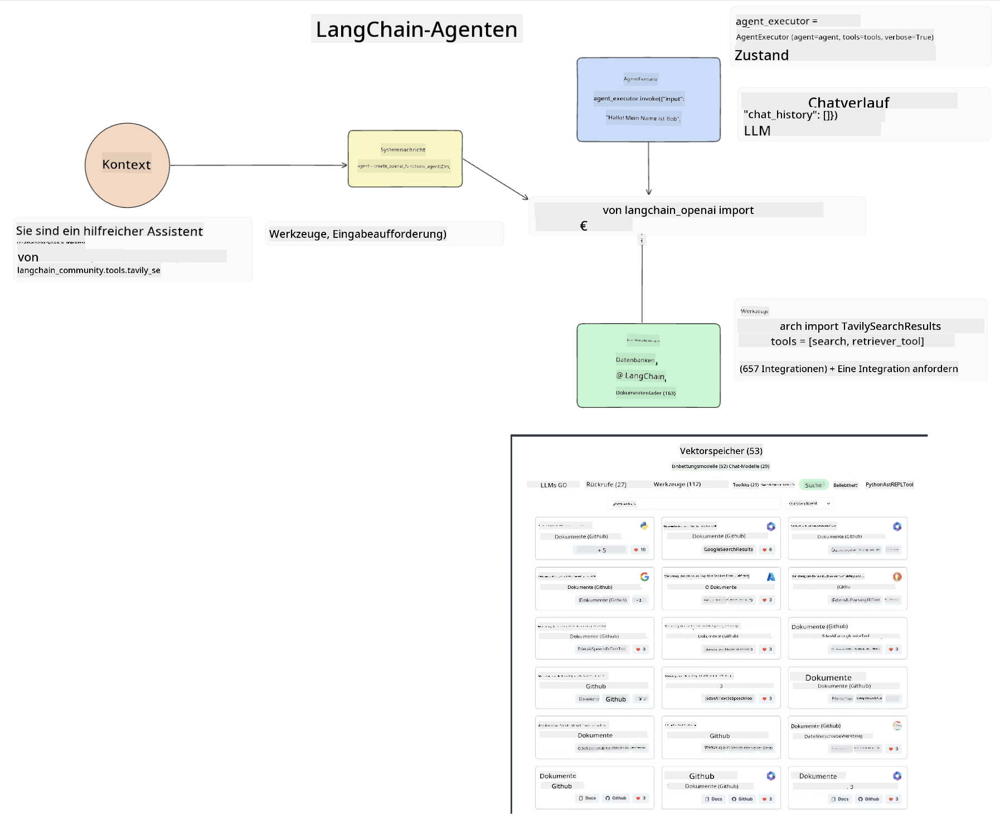
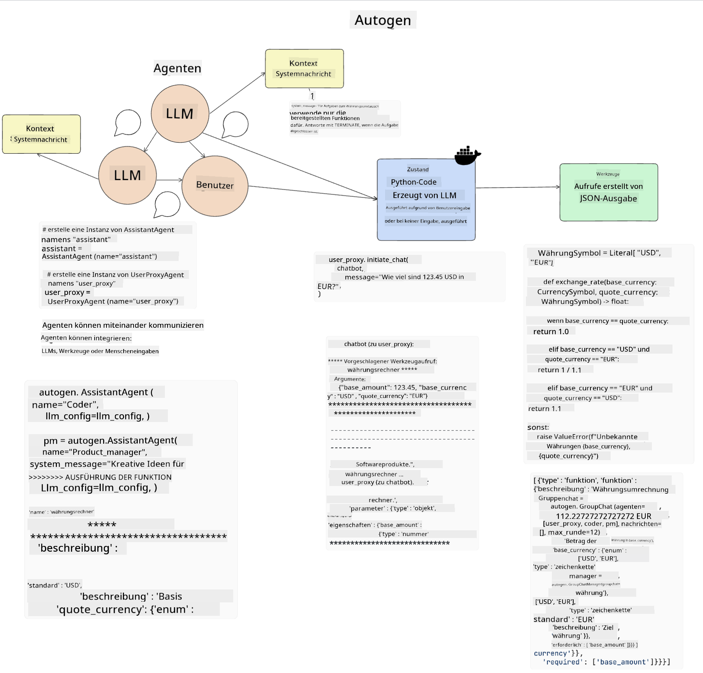
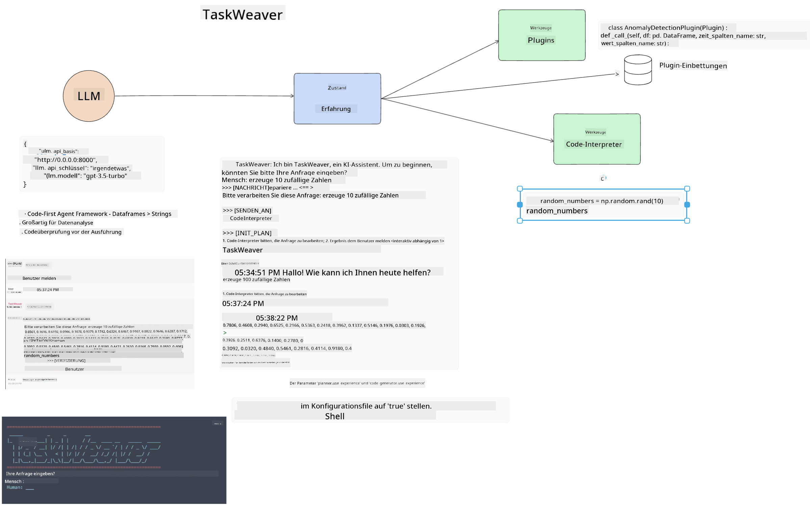

<!--
CO_OP_TRANSLATOR_METADATA:
{
  "original_hash": "11f03c81f190d9cbafd0f977dcbede6c",
  "translation_date": "2025-05-20T07:07:35+00:00",
  "source_file": "17-ai-agents/README.md",
  "language_code": "de"
}
-->
[](https://aka.ms/gen-ai-lesson17-gh?WT.mc_id=academic-105485-koreyst)

## Einführung

KI-Agenten stellen eine spannende Entwicklung im Bereich der Generativen KI dar und ermöglichen es großen Sprachmodellen (LLMs), sich von Assistenten zu Agenten zu entwickeln, die Aktionen ausführen können. KI-Agenten-Frameworks ermöglichen es Entwicklern, Anwendungen zu erstellen, die LLMs Zugang zu Werkzeugen und Zustandsverwaltung geben. Diese Frameworks verbessern auch die Sichtbarkeit, sodass Benutzer und Entwickler die von LLMs geplanten Aktionen überwachen können, was das Erlebnismanagement verbessert.

Die Lektion wird die folgenden Bereiche abdecken:

- Verständnis, was ein KI-Agent ist - Was genau ist ein KI-Agent?
- Erforschung von vier verschiedenen KI-Agenten-Frameworks - Was macht sie einzigartig?
- Anwendung dieser KI-Agenten auf verschiedene Anwendungsfälle - Wann sollten wir KI-Agenten verwenden?

## Lernziele

Nach Abschluss dieser Lektion wirst du in der Lage sein:

- Erklären, was KI-Agenten sind und wie sie verwendet werden können.
- Ein Verständnis für die Unterschiede zwischen einigen der beliebten KI-Agenten-Frameworks haben und wie sie sich unterscheiden.
- Verstehen, wie KI-Agenten funktionieren, um Anwendungen mit ihnen zu erstellen.

## Was sind KI-Agenten?

KI-Agenten sind ein sehr spannendes Feld in der Welt der Generativen KI. Mit dieser Begeisterung kommt manchmal eine Verwirrung der Begriffe und ihrer Anwendung. Um die Dinge einfach und inklusiv für die meisten der Tools zu halten, die sich auf KI-Agenten beziehen, werden wir diese Definition verwenden:

KI-Agenten ermöglichen es großen Sprachmodellen (LLMs), Aufgaben auszuführen, indem sie ihnen Zugang zu einem **Zustand** und **Werkzeugen** geben.



Lassen Sie uns diese Begriffe definieren:

**Große Sprachmodelle** - Dies sind die Modelle, die in diesem Kurs erwähnt werden, wie GPT-3.5, GPT-4, Llama-2 usw.

**Zustand** - Dies bezieht sich auf den Kontext, in dem das LLM arbeitet. Das LLM nutzt den Kontext seiner vergangenen Aktionen und den aktuellen Kontext, um seine Entscheidungsfindung für nachfolgende Aktionen zu leiten. KI-Agenten-Frameworks ermöglichen es Entwicklern, diesen Kontext leichter zu pflegen.

**Werkzeuge** - Um die Aufgabe zu erfüllen, die der Benutzer angefordert hat und die das LLM geplant hat, benötigt das LLM Zugang zu Werkzeugen. Einige Beispiele für Werkzeuge können eine Datenbank, eine API, eine externe Anwendung oder sogar ein anderes LLM sein!

Diese Definitionen sollen Ihnen hoffentlich eine gute Grundlage geben, während wir uns ansehen, wie sie implementiert werden. Lassen Sie uns einige verschiedene KI-Agenten-Frameworks erkunden:

## LangChain-Agenten

[LangChain-Agenten](https://python.langchain.com/docs/how_to/#agents?WT.mc_id=academic-105485-koreyst) sind eine Implementierung der oben bereitgestellten Definitionen.

Um den **Zustand** zu verwalten, verwendet es eine eingebaute Funktion namens `AgentExecutor`. Diese akzeptiert die definierten `agent` und die `tools`, die ihm zur Verfügung stehen.

Der `Agent Executor` speichert auch den Chatverlauf, um den Kontext des Chats bereitzustellen.



LangChain bietet einen [Katalog von Werkzeugen](https://integrations.langchain.com/tools?WT.mc_id=academic-105485-koreyst), die in Ihre Anwendung importiert werden können, in der das LLM Zugang erhalten kann. Diese werden von der Community und dem LangChain-Team erstellt.

Sie können dann diese Werkzeuge definieren und an den `Agent Executor` übergeben.

Sichtbarkeit ist ein weiterer wichtiger Aspekt, wenn es um KI-Agenten geht. Es ist wichtig für Anwendungsentwickler zu verstehen, welches Werkzeug das LLM verwendet und warum. Dafür hat das Team von LangChain LangSmith entwickelt.

## AutoGen

Das nächste KI-Agenten-Framework, das wir besprechen werden, ist [AutoGen](https://microsoft.github.io/autogen/?WT.mc_id=academic-105485-koreyst). Der Hauptfokus von AutoGen liegt auf Gesprächen. Agenten sind sowohl **gesprächsfähig** als auch **anpassbar**.

**Gesprächsfähig -** LLMs können ein Gespräch mit einem anderen LLM beginnen und fortsetzen, um eine Aufgabe zu erfüllen. Dies wird durch das Erstellen von `AssistantAgents` und das Geben einer spezifischen Systemnachricht erreicht.

```python

autogen.AssistantAgent( name="Coder", llm_config=llm_config, ) pm = autogen.AssistantAgent( name="Product_manager", system_message="Creative in software product ideas.", llm_config=llm_config, )

```

**Anpassbar** - Agenten können nicht nur als LLMs definiert werden, sondern auch als Benutzer oder Werkzeug. Als Entwickler können Sie einen `UserProxyAgent` definieren, der dafür verantwortlich ist, mit dem Benutzer für Feedback bei der Erfüllung einer Aufgabe zu interagieren. Dieses Feedback kann entweder die Ausführung der Aufgabe fortsetzen oder stoppen.

```python
user_proxy = UserProxyAgent(name="user_proxy")
```

### Zustand und Werkzeuge

Um den Zustand zu ändern und zu verwalten, generiert ein Assistent-Agent Python-Code, um die Aufgabe zu erfüllen.

Hier ist ein Beispiel für den Prozess:



#### LLM definiert mit einer Systemnachricht

```python
system_message="For weather related tasks, only use the functions you have been provided with. Reply TERMINATE when the task is done."
```

Diese Systemnachricht weist dieses spezifische LLM darauf hin, welche Funktionen für seine Aufgabe relevant sind. Denken Sie daran, dass Sie mit AutoGen mehrere definierte AssistantAgents mit unterschiedlichen Systemnachrichten haben können.

#### Chat wird vom Benutzer initiiert

```python
user_proxy.initiate_chat( chatbot, message="I am planning a trip to NYC next week, can you help me pick out what to wear? ", )

```

Diese Nachricht vom user_proxy (Mensch) ist das, was den Prozess des Agenten starten wird, um die möglichen Funktionen zu erkunden, die er ausführen sollte.

#### Funktion wird ausgeführt

```bash
chatbot (to user_proxy):

***** Suggested tool Call: get_weather ***** Arguments: {"location":"New York City, NY","time_periond:"7","temperature_unit":"Celsius"} ******************************************************** --------------------------------------------------------------------------------

>>>>>>>> EXECUTING FUNCTION get_weather... user_proxy (to chatbot): ***** Response from calling function "get_weather" ***** 112.22727272727272 EUR ****************************************************************

```

Sobald der anfängliche Chat verarbeitet ist, wird der Agent das vorgeschlagene Werkzeug senden, um es aufzurufen. In diesem Fall ist es eine Funktion namens `get_weather`. Depending on your configuration, this function can be automatically executed and read by the Agent or can be executed based on user input.

You can find a list of [AutoGen code samples](https://microsoft.github.io/autogen/docs/Examples/?WT.mc_id=academic-105485-koreyst) to further explore how to get started building.

## Taskweaver

The next agent framework we will explore is [Taskweaver](https://microsoft.github.io/TaskWeaver/?WT.mc_id=academic-105485-koreyst). It is known as a "code-first" agent because instead of working strictly with `strings` , it can work with DataFrames in Python. This becomes extremely useful for data analysis and generation tasks. This can be things like creating graphs and charts or generating random numbers.

### State and Tools

To manage the state of the conversation, TaskWeaver uses the concept of a `Planner`. The `Planner` is a LLM that takes the request from the users and maps out the tasks that need to be completed to fulfill this request.

To complete the tasks the `Planner` is exposed to the collection of tools called `Plugins`. Dies können Python-Klassen oder ein allgemeiner Code-Interpreter sein. Diese Plugins werden als Einbettungen gespeichert, damit das LLM besser nach dem richtigen Plugin suchen kann.



Hier ist ein Beispiel für ein Plugin zur Behandlung der Anomalieerkennung:

```python
class AnomalyDetectionPlugin(Plugin): def __call__(self, df: pd.DataFrame, time_col_name: str, value_col_name: str):
```

Der Code wird vor der Ausführung überprüft. Eine weitere Funktion zur Verwaltung des Kontexts in Taskweaver ist `experience`. Experience allows for the context of a conversation to be stored over to the long term in a YAML file. This can be configured so that the LLM improves over time on certain tasks given that it is exposed to prior conversations.

## JARVIS

The last agent framework we will explore is [JARVIS](https://github.com/microsoft/JARVIS?tab=readme-ov-file?WT.mc_id=academic-105485-koreyst). What makes JARVIS unique is that it uses an LLM to manage the `state` des Gesprächs und die `tools` sind andere KI-Modelle. Jedes der KI-Modelle sind spezialisierte Modelle, die bestimmte Aufgaben wie Objekterkennung, Transkription oder Bildunterschriftenerstellung ausführen.


Das LLM, als allgemeines Modell, erhält die Anfrage vom Benutzer und identifiziert die spezifische Aufgabe und alle Argumente/Daten, die benötigt werden, um die Aufgabe zu erfüllen.

```python
[{"task": "object-detection", "id": 0, "dep": [-1], "args": {"image": "e1.jpg" }}]
```

Das LLM formatiert dann die Anfrage in einer Weise, die das spezialisierte KI-Modell interpretieren kann, wie JSON. Sobald das KI-Modell seine Vorhersage basierend auf der Aufgabe zurückgegeben hat, erhält das LLM die Antwort.

Wenn mehrere Modelle benötigt werden, um die Aufgabe zu erfüllen, wird es auch die Antwort dieser Modelle interpretieren, bevor es sie zusammenführt, um die Antwort an den Benutzer zu generieren.

Das untenstehende Beispiel zeigt, wie dies funktionieren würde, wenn ein Benutzer eine Beschreibung und Anzahl der Objekte in einem Bild anfordert:

## Aufgabe

Um Ihr Lernen über KI-Agenten fortzusetzen, können Sie mit AutoGen bauen:

- Eine Anwendung, die ein Geschäftstreffen mit verschiedenen Abteilungen eines Bildungs-Startups simuliert.
- Erstellen Sie Systemnachrichten, die LLMs dabei helfen, verschiedene Persönlichkeiten und Prioritäten zu verstehen, und ermöglichen Sie dem Benutzer, eine neue Produktidee vorzustellen.
- Das LLM sollte dann Folgefragen von jeder Abteilung generieren, um den Pitch und die Produktidee zu verfeinern und zu verbessern.

## Lernen hört hier nicht auf, setzen Sie die Reise fort

Nachdem Sie diese Lektion abgeschlossen haben, schauen Sie sich unsere [Generative AI Learning Collection](https://aka.ms/genai-collection?WT.mc_id=academic-105485-koreyst) an, um Ihr Wissen über Generative KI weiter zu vertiefen!

**Haftungsausschluss**:  
Dieses Dokument wurde mit dem KI-Übersetzungsdienst [Co-op Translator](https://github.com/Azure/co-op-translator) übersetzt. Obwohl wir uns um Genauigkeit bemühen, beachten Sie bitte, dass automatisierte Übersetzungen Fehler oder Ungenauigkeiten enthalten können. Das Originaldokument in seiner ursprünglichen Sprache sollte als maßgebliche Quelle betrachtet werden. Für kritische Informationen wird eine professionelle menschliche Übersetzung empfohlen. Wir haften nicht für Missverständnisse oder Fehlinterpretationen, die sich aus der Verwendung dieser Übersetzung ergeben.