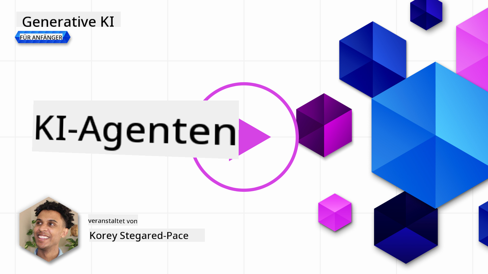
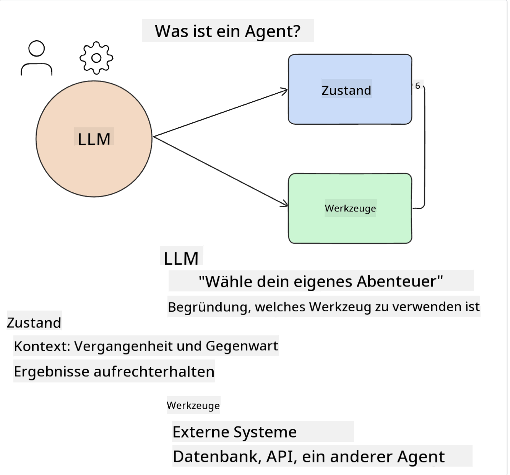
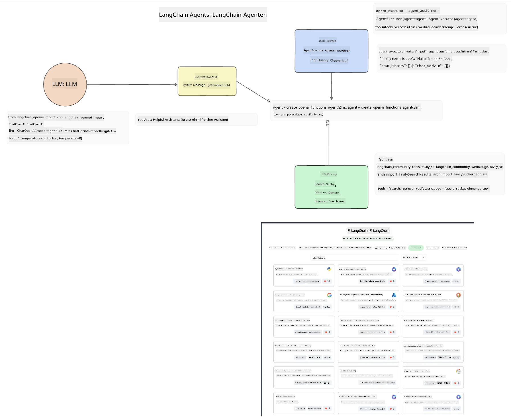
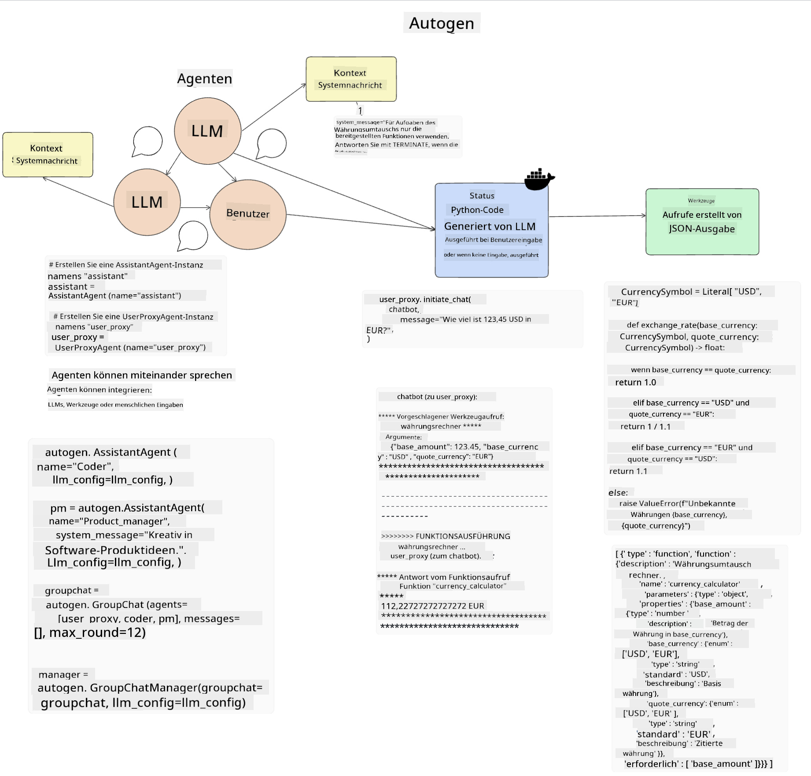
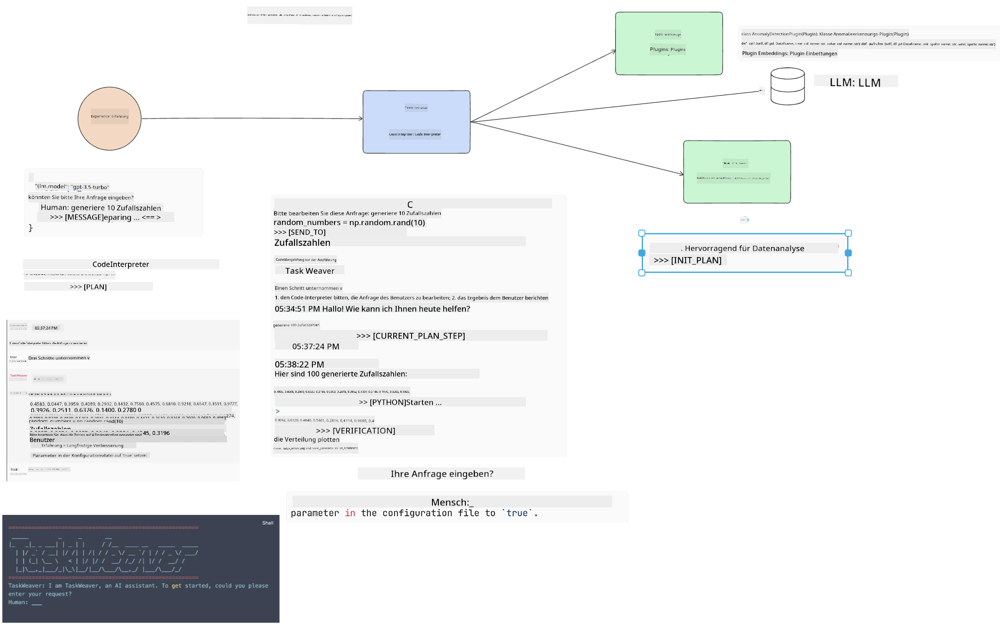
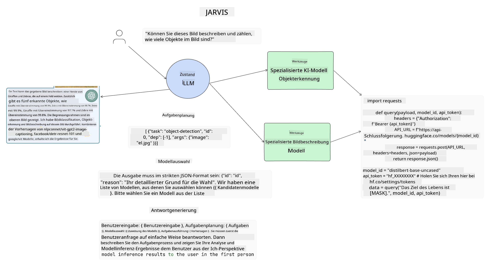

<!--
CO_OP_TRANSLATOR_METADATA:
{
  "original_hash": "11f03c81f190d9cbafd0f977dcbede6c",
  "translation_date": "2025-07-09T17:18:12+00:00",
  "source_file": "17-ai-agents/README.md",
  "language_code": "de"
}
-->
[](https://aka.ms/gen-ai-lesson17-gh?WT.mc_id=academic-105485-koreyst)

## Einführung

AI Agents stellen eine spannende Entwicklung im Bereich der Generativen KI dar, die es Large Language Models (LLMs) ermöglicht, sich von reinen Assistenten zu Agenten zu entwickeln, die eigenständig handeln können. AI Agent Frameworks erlauben Entwicklern, Anwendungen zu erstellen, die LLMs den Zugriff auf Werkzeuge und Zustandsverwaltung ermöglichen. Diese Frameworks verbessern zudem die Transparenz, sodass Nutzer und Entwickler die von LLMs geplanten Aktionen überwachen können, was das Erlebnismanagement verbessert.

Die Lektion behandelt folgende Themen:

- Verstehen, was ein AI Agent ist – Was genau ist ein AI Agent?
- Vorstellung von vier verschiedenen AI Agent Frameworks – Was macht sie einzigartig?
- Anwendung dieser AI Agents in verschiedenen Anwendungsfällen – Wann sollten wir AI Agents einsetzen?

## Lernziele

Nach Abschluss dieser Lektion wirst du in der Lage sein:

- Zu erklären, was AI Agents sind und wie sie eingesetzt werden können.
- Die Unterschiede zwischen einigen der populären AI Agent Frameworks zu verstehen und wie sie sich unterscheiden.
- Zu verstehen, wie AI Agents funktionieren, um Anwendungen mit ihnen zu entwickeln.

## Was sind AI Agents?

AI Agents sind ein sehr spannendes Gebiet in der Welt der Generativen KI. Mit dieser Begeisterung geht manchmal auch eine Verwirrung über Begriffe und deren Anwendung einher. Um es einfach zu halten und die meisten Tools, die sich auf AI Agents beziehen, einzubeziehen, verwenden wir folgende Definition:

AI Agents ermöglichen es Large Language Models (LLMs), Aufgaben auszuführen, indem sie Zugriff auf einen **Zustand** und **Werkzeuge** erhalten.



Lass uns diese Begriffe definieren:

**Large Language Models** – Das sind die Modelle, die in diesem Kurs verwendet werden, wie GPT-3.5, GPT-4, Llama-2 usw.

**Zustand** – Dies bezieht sich auf den Kontext, in dem das LLM arbeitet. Das LLM nutzt den Kontext seiner bisherigen Aktionen und den aktuellen Kontext, um seine Entscheidungen für folgende Aktionen zu steuern. AI Agent Frameworks erleichtern Entwicklern die Verwaltung dieses Kontexts.

**Werkzeuge** – Um die vom Nutzer angeforderte und vom LLM geplante Aufgabe zu erfüllen, benötigt das LLM Zugriff auf Werkzeuge. Beispiele für Werkzeuge können eine Datenbank, eine API, eine externe Anwendung oder sogar ein weiteres LLM sein!

Diese Definitionen sollen dir eine gute Grundlage geben, wenn wir uns ansehen, wie sie umgesetzt werden. Schauen wir uns einige verschiedene AI Agent Frameworks an:

## LangChain Agents

[LangChain Agents](https://python.langchain.com/docs/how_to/#agents?WT.mc_id=academic-105485-koreyst) sind eine Umsetzung der oben genannten Definitionen.

Zur Verwaltung des **Zustands** verwendet es eine eingebaute Funktion namens `AgentExecutor`. Diese akzeptiert den definierten `agent` und die verfügbaren `tools`.

Der `AgentExecutor` speichert außerdem den Chatverlauf, um den Kontext des Gesprächs bereitzustellen.



LangChain bietet einen [Werkzeugkatalog](https://integrations.langchain.com/tools?WT.mc_id=academic-105485-koreyst), der in deine Anwendung importiert werden kann und auf den das LLM zugreifen kann. Diese Werkzeuge werden von der Community und dem LangChain-Team erstellt.

Du kannst diese Werkzeuge dann definieren und an den `AgentExecutor` übergeben.

Transparenz ist ein weiterer wichtiger Aspekt bei AI Agents. Es ist wichtig, dass Anwendungsentwickler verstehen, welches Werkzeug das LLM verwendet und warum. Dafür hat das Team von LangChain LangSmith entwickelt.

## AutoGen

Das nächste AI Agent Framework, das wir besprechen, ist [AutoGen](https://microsoft.github.io/autogen/?WT.mc_id=academic-105485-koreyst). Der Hauptfokus von AutoGen liegt auf Konversationen. Agenten sind sowohl **konversationsfähig** als auch **anpassbar**.

**Konversationsfähig –** LLMs können ein Gespräch mit einem anderen LLM beginnen und fortsetzen, um eine Aufgabe zu erfüllen. Dies geschieht durch das Erstellen von `AssistantAgents` und das Zuweisen einer spezifischen Systemnachricht.

```python

autogen.AssistantAgent( name="Coder", llm_config=llm_config, ) pm = autogen.AssistantAgent( name="Product_manager", system_message="Creative in software product ideas.", llm_config=llm_config, )

```

**Anpassbar** – Agenten können nicht nur als LLMs definiert werden, sondern auch als Nutzer oder Werkzeug. Als Entwickler kannst du einen `UserProxyAgent` definieren, der für die Interaktion mit dem Nutzer zur Rückmeldung bei der Erfüllung einer Aufgabe zuständig ist. Dieses Feedback kann entweder die Ausführung der Aufgabe fortsetzen oder stoppen.

```python
user_proxy = UserProxyAgent(name="user_proxy")
```

### Zustand und Werkzeuge

Um den Zustand zu ändern und zu verwalten, generiert ein Assistant Agent Python-Code, um die Aufgabe zu erfüllen.

Hier ein Beispiel für den Ablauf:



#### LLM mit Systemnachricht definiert

```python
system_message="For weather related tasks, only use the functions you have been provided with. Reply TERMINATE when the task is done."
```

Diese Systemnachricht weist das spezifische LLM an, welche Funktionen für seine Aufgabe relevant sind. Denk daran, dass du mit AutoGen mehrere AssistantAgents mit unterschiedlichen Systemnachrichten definieren kannst.

#### Chat wird vom Nutzer initiiert

```python
user_proxy.initiate_chat( chatbot, message="I am planning a trip to NYC next week, can you help me pick out what to wear? ", )

```

Diese Nachricht vom user_proxy (Mensch) startet den Prozess, bei dem der Agent die möglichen Funktionen erkundet, die er ausführen soll.

#### Funktion wird ausgeführt

```bash
chatbot (to user_proxy):

***** Suggested tool Call: get_weather ***** Arguments: {"location":"New York City, NY","time_periond:"7","temperature_unit":"Celsius"} ******************************************************** --------------------------------------------------------------------------------

>>>>>>>> EXECUTING FUNCTION get_weather... user_proxy (to chatbot): ***** Response from calling function "get_weather" ***** 112.22727272727272 EUR ****************************************************************

```

Sobald der erste Chat verarbeitet ist, sendet der Agent den Vorschlag, welches Werkzeug aufgerufen werden soll. In diesem Fall ist es eine Funktion namens `get_weather`. Je nach Konfiguration kann diese Funktion automatisch vom Agent ausgeführt und gelesen werden oder basierend auf Nutzereingaben ausgeführt werden.

Eine Liste von [AutoGen Code-Beispielen](https://microsoft.github.io/autogen/docs/Examples/?WT.mc_id=academic-105485-koreyst) findest du, um den Einstieg ins Bauen zu erleichtern.

## Taskweaver

Das nächste Agent Framework, das wir uns ansehen, ist [Taskweaver](https://microsoft.github.io/TaskWeaver/?WT.mc_id=academic-105485-koreyst). Es wird als „code-first“ Agent bezeichnet, weil es statt ausschließlich mit `strings` auch mit DataFrames in Python arbeiten kann. Das ist besonders nützlich für Datenanalyse- und Generierungsaufgaben, wie das Erstellen von Grafiken und Diagrammen oder das Generieren von Zufallszahlen.

### Zustand und Werkzeuge

Zur Verwaltung des Gesprächszustands verwendet TaskWeaver das Konzept eines `Planner`. Der `Planner` ist ein LLM, das die Anfragen der Nutzer entgegennimmt und die Aufgaben plant, die zur Erfüllung dieser Anfragen notwendig sind.

Um die Aufgaben zu erfüllen, hat der `Planner` Zugriff auf eine Sammlung von Werkzeugen, die `Plugins` genannt werden. Das können Python-Klassen oder ein allgemeiner Code-Interpreter sein. Diese Plugins werden als Embeddings gespeichert, damit das LLM besser nach dem passenden Plugin suchen kann.



Hier ein Beispiel für ein Plugin zur Anomalieerkennung:

```python
class AnomalyDetectionPlugin(Plugin): def __call__(self, df: pd.DataFrame, time_col_name: str, value_col_name: str):
```

Der Code wird vor der Ausführung überprüft. Eine weitere Funktion zur Kontextverwaltung in Taskweaver ist `experience`. Experience ermöglicht es, den Kontext eines Gesprächs langfristig in einer YAML-Datei zu speichern. Dies kann so konfiguriert werden, dass das LLM im Laufe der Zeit bei bestimmten Aufgaben besser wird, da es auf frühere Gespräche zurückgreifen kann.

## JARVIS

Das letzte Agent Framework, das wir betrachten, ist [JARVIS](https://github.com/microsoft/JARVIS?tab=readme-ov-file?WT.mc_id=academic-105485-koreyst). Was JARVIS einzigartig macht, ist, dass es ein LLM verwendet, um den `Zustand` des Gesprächs zu verwalten, während die `tools` andere spezialisierte KI-Modelle sind. Jedes dieser KI-Modelle ist auf bestimmte Aufgaben spezialisiert, wie Objekterkennung, Transkription oder Bildbeschriftung.



Das LLM, als General-Purpose-Modell, erhält die Anfrage vom Nutzer, identifiziert die spezifische Aufgabe und alle Argumente/Daten, die zur Erfüllung der Aufgabe benötigt werden.

```python
[{"task": "object-detection", "id": 0, "dep": [-1], "args": {"image": "e1.jpg" }}]
```

Das LLM formatiert die Anfrage dann so, dass das spezialisierte KI-Modell sie interpretieren kann, beispielsweise als JSON. Sobald das KI-Modell seine Vorhersage basierend auf der Aufgabe zurückgibt, erhält das LLM die Antwort.

Wenn mehrere Modelle zur Erfüllung der Aufgabe benötigt werden, interpretiert das LLM auch die Antworten dieser Modelle, bevor es sie zusammenführt, um die Antwort an den Nutzer zu generieren.

Das folgende Beispiel zeigt, wie das funktioniert, wenn ein Nutzer eine Beschreibung und Zählung der Objekte in einem Bild anfragt:

## Aufgabe

Um dein Wissen über AI Agents weiter zu vertiefen, kannst du mit AutoGen Folgendes bauen:

- Eine Anwendung, die ein Geschäftstreffen mit verschiedenen Abteilungen eines Bildungs-Startups simuliert.
- Erstelle Systemnachrichten, die LLMs dabei helfen, verschiedene Personas und Prioritäten zu verstehen, und ermögliche dem Nutzer, eine neue Produktidee vorzustellen.
- Das LLM soll anschließend Folgefragen aus jeder Abteilung generieren, um die Präsentation und die Produktidee zu verfeinern und zu verbessern.

## Lernen hört hier nicht auf – setze deine Reise fort

Nach Abschluss dieser Lektion schau dir unsere [Generative AI Learning collection](https://aka.ms/genai-collection?WT.mc_id=academic-105485-koreyst) an, um dein Wissen über Generative KI weiter auszubauen!

**Haftungsausschluss**:  
Dieses Dokument wurde mit dem KI-Übersetzungsdienst [Co-op Translator](https://github.com/Azure/co-op-translator) übersetzt. Obwohl wir uns um Genauigkeit bemühen, beachten Sie bitte, dass automatisierte Übersetzungen Fehler oder Ungenauigkeiten enthalten können. Das Originaldokument in seiner Ursprungssprache gilt als maßgebliche Quelle. Für wichtige Informationen wird eine professionelle menschliche Übersetzung empfohlen. Wir übernehmen keine Haftung für Missverständnisse oder Fehlinterpretationen, die aus der Nutzung dieser Übersetzung entstehen.