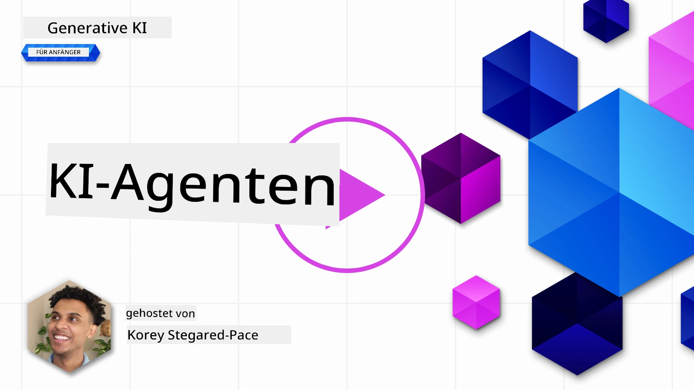
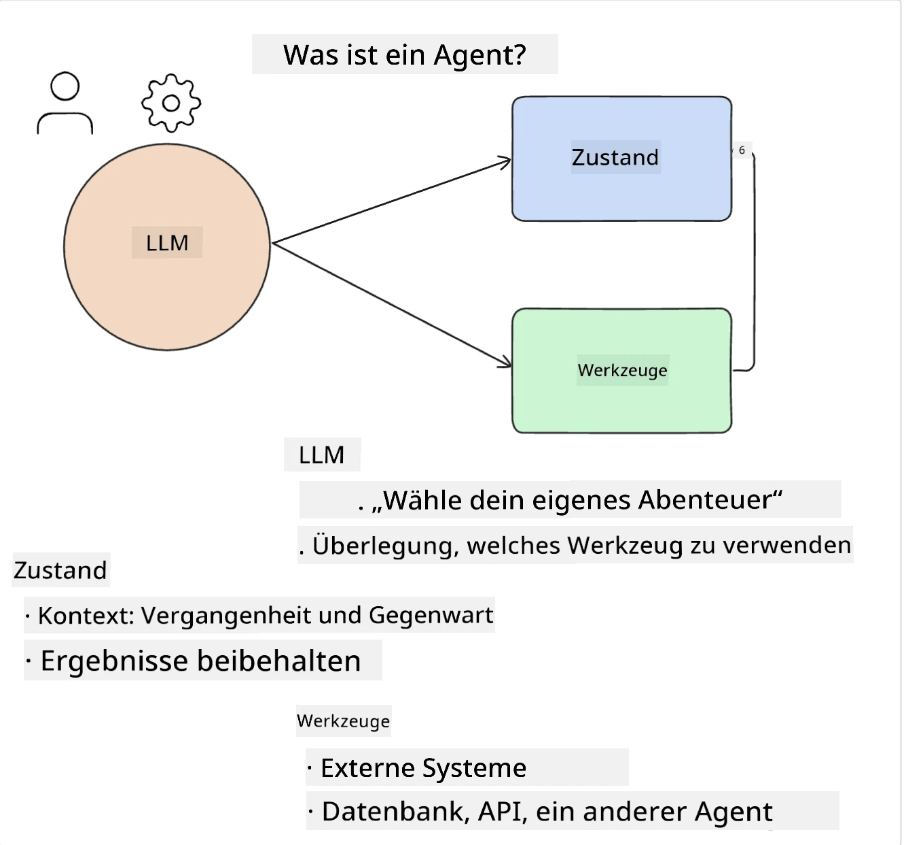
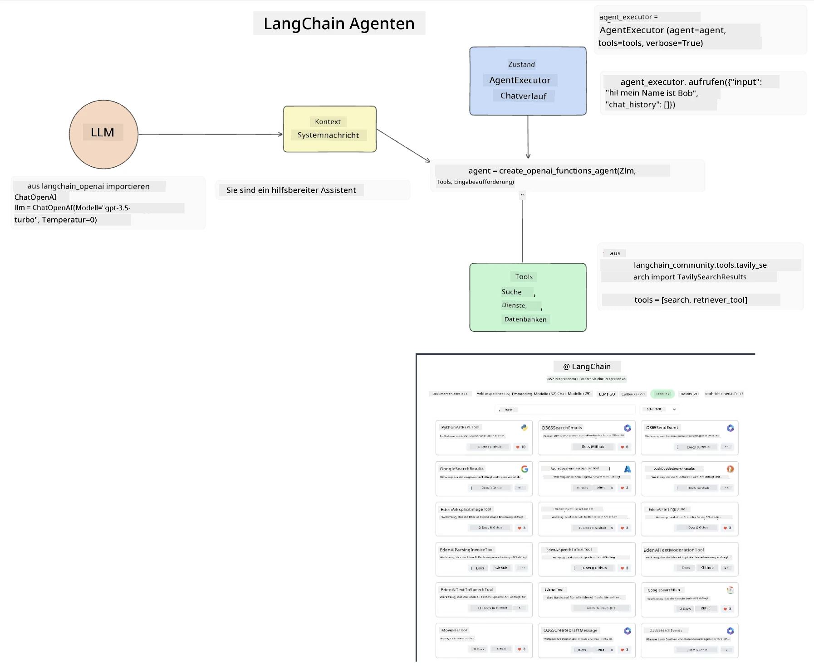
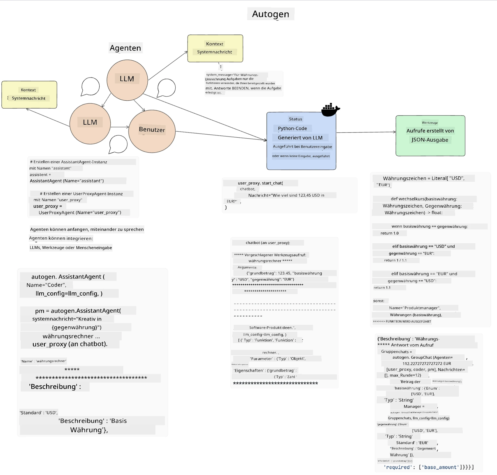
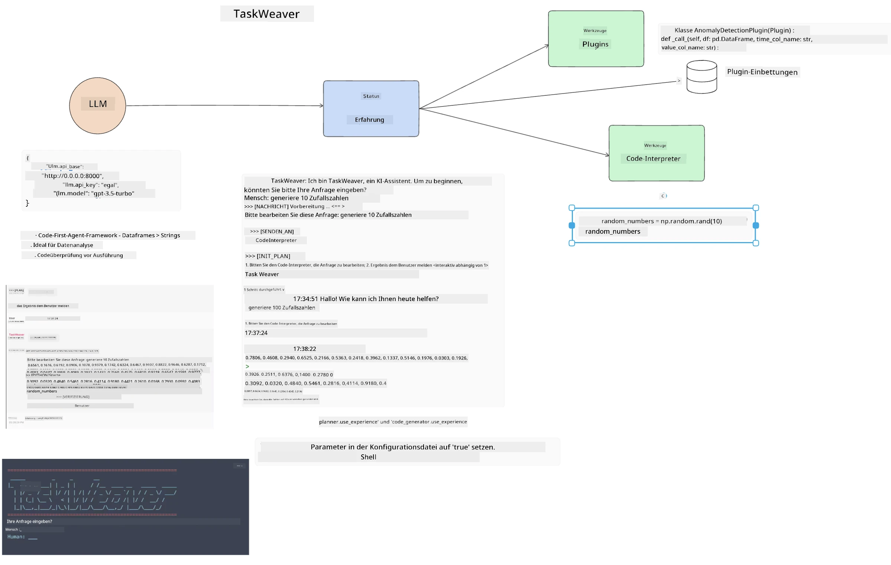
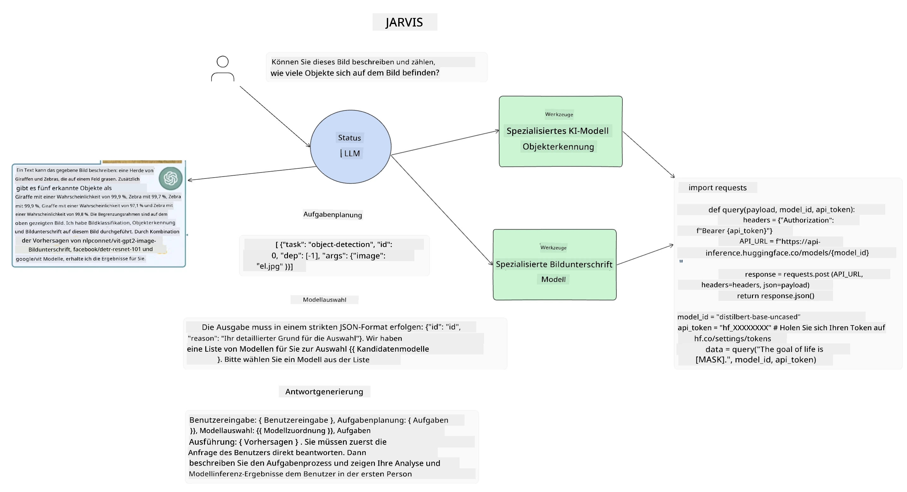

[](https://youtu.be/yAXVW-lUINc?si=bOtW9nL6jc3XJgOM)

## Einführung

KI-Agenten stellen eine spannende Entwicklung im Bereich der Generativen KI dar und ermöglichen es großen Sprachmodellen (LLMs), sich von Assistenten zu Agenten zu entwickeln, die fähig sind, eigenständig Aktionen durchzuführen. KI-Agenten-Frameworks erlauben Entwicklern, Anwendungen zu erstellen, die LLMs Zugang zu Werkzeugen und Zustandsverwaltung geben. Diese Frameworks verbessern auch die Transparenz, sodass Benutzer und Entwickler die vom LLM geplanten Aktionen überwachen können, was die Erfahrung besser steuerbar macht.

Die Lektion behandelt folgende Themen:

- Verstehen, was ein KI-Agent ist – Was genau ist ein KI-Agent?
- Vorstellung von vier verschiedenen KI-Agenten-Frameworks – Was macht sie einzigartig?
- Anwendung dieser KI-Agenten auf verschiedene Anwendungsfälle – Wann sollten wir KI-Agenten verwenden?

## Lernziele

Nach dieser Lektion werden Sie in der Lage sein:

- Zu erklären, was KI-Agenten sind und wie sie verwendet werden können.
- Die Unterschiede zwischen einigen beliebten KI-Agenten-Frameworks zu verstehen und wie sie sich unterscheiden.
- Zu verstehen, wie KI-Agenten funktionieren, um Anwendungen mit ihnen zu erstellen.

## Was sind KI-Agenten?

KI-Agenten sind ein sehr spannendes Feld in der Welt der Generativen KI. Mit dieser Begeisterung geht manchmal eine Verwirrung über Begriffe und deren Anwendung einher. Um die Dinge einfach zu halten und die meisten Tools, die sich auf KI-Agenten beziehen, einzubeziehen, verwenden wir folgende Definition:

KI-Agenten ermöglichen es großen Sprachmodellen (LLMs), Aufgaben auszuführen, indem sie ihnen Zugriff auf einen **Zustand** und **Werkzeuge** geben.



Lassen Sie uns diese Begriffe definieren:

**Große Sprachmodelle** – Das sind die Modelle, die in diesem Kurs verwendet werden, wie GPT-3.5, GPT-4, Llama-2 etc.

**Zustand** – Dies bezeichnet den Kontext, in dem das LLM arbeitet. Das LLM nutzt den Kontext seiner vergangenen Aktionen und den aktuellen Kontext, um seine Entscheidungsfindung für folgende Aktionen zu steuern. KI-Agenten-Frameworks ermöglichen Entwicklern, diesen Kontext leichter zu verwalten.

**Werkzeuge** – Um die Aufgabe zu erfüllen, die der Nutzer angefragt hat und die das LLM geplant hat, benötigt das LLM Zugang zu Werkzeugen. Beispiele für Werkzeuge können eine Datenbank, eine API, eine externe Anwendung oder sogar ein weiteres LLM sein!

Diese Definitionen sollen Ihnen eine gute Grundlage geben, wenn wir uns ansehen, wie sie implementiert werden. Lassen Sie uns einige verschiedene KI-Agenten-Frameworks erkunden:

## LangChain Agents

[LangChain Agents](https://python.langchain.com/docs/how_to/#agents?WT.mc_id=academic-105485-koreyst) sind eine Umsetzung der oben genannten Definitionen.

Zur Verwaltung des **Zustands** verwendet es eine eingebaute Funktion namens `AgentExecutor`. Diese akzeptiert den definierten `agent` und die verfügbaren `tools`.

Der `Agent Executor` speichert auch den Chat-Verlauf, um den Kontext des Chats bereitzustellen.



LangChain bietet einen [Katalog von Werkzeugen](https://integrations.langchain.com/tools?WT.mc_id=academic-105485-koreyst), die in Ihre Anwendung importiert werden können, auf die das LLM dann zugreifen kann. Diese werden von der Community und dem LangChain-Team erstellt.

Sie können diese Werkzeuge dann definieren und an den `Agent Executor` übergeben.

Transparenz ist ein weiterer wichtiger Aspekt beim Thema KI-Agenten. Es ist wichtig für Anwendungsentwickler zu verstehen, welches Werkzeug das LLM verwendet und warum. Dafür hat das Team von LangChain LangSmith entwickelt.

## AutoGen

Das nächste KI-Agenten-Framework, das wir besprechen, ist [AutoGen](https://microsoft.github.io/autogen/?WT.mc_id=academic-105485-koreyst). Der Hauptfokus von AutoGen liegt auf Konversationen. Agenten sind sowohl **konversationsfähig** als auch **anpassbar**.

**Konversationsfähig –** LLMs können ein Gespräch mit einem anderen LLM beginnen und fortsetzen, um eine Aufgabe zu erfüllen. Dies geschieht durch die Erstellung von `AssistantAgents` und das Übergeben einer spezifischen Systemnachricht.

```python

autogen.AssistantAgent( name="Coder", llm_config=llm_config, ) pm = autogen.AssistantAgent( name="Product_manager", system_message="Creative in software product ideas.", llm_config=llm_config, )

```

**Anpassbar** – Agenten können nicht nur als LLMs definiert werden, sondern auch als Nutzer oder Werkzeug. Als Entwickler können Sie einen `UserProxyAgent` definieren, der für die Interaktion mit dem Nutzer zur Rückmeldung bei der Erfüllung einer Aufgabe zuständig ist. Diese Rückmeldung kann entweder die Ausführung der Aufgabe fortsetzen oder sie stoppen.

```python
user_proxy = UserProxyAgent(name="user_proxy")
```

### Zustand und Werkzeuge

Um den Zustand zu ändern und zu verwalten, generiert ein Assistenz-Agent Python-Code zur Ausführung der Aufgabe.

Hier ist ein Beispiel für den Prozess:



#### LLM wird mit einer Systemnachricht definiert

```python
system_message="For weather related tasks, only use the functions you have been provided with. Reply TERMINATE when the task is done."
```

Diese Systemnachricht weist dieses spezifische LLM an, welche Funktionen für seine Aufgabe relevant sind. Denken Sie daran, bei AutoGen können mehrere definierte AssistantAgents mit unterschiedlichen Systemnachrichten existieren.

#### Chat wird vom Nutzer initiiert

```python
user_proxy.initiate_chat( chatbot, message="I am planning a trip to NYC next week, can you help me pick out what to wear? ", )

```

Diese Nachricht vom user_proxy (Mensch) startet den Prozess, bei dem der Agent mögliche Funktionen ausloten soll, die er ausführen sollte.

#### Funktion wird ausgeführt

```bash
chatbot (to user_proxy):

***** Suggested tool Call: get_weather ***** Arguments: {"location":"New York City, NY","time_periond:"7","temperature_unit":"Celsius"} ******************************************************** --------------------------------------------------------------------------------

>>>>>>>> EXECUTING FUNCTION get_weather... user_proxy (to chatbot): ***** Response from calling function "get_weather" ***** 112.22727272727272 EUR ****************************************************************

```

Nachdem der erste Chat verarbeitet wurde, wird das vorgeschlagene Werkzeug aufgerufen. In diesem Fall ist es eine Funktion namens `get_weather`. Je nach Konfiguration kann diese Funktion automatisch ausgeführt und vom Agent ausgelesen werden oder durch Nutzereingabe ausgeführt werden.

Sie finden eine Liste mit [AutoGen-Codebeispielen](https://microsoft.github.io/autogen/docs/Examples/?WT.mc_id=academic-105485-koreyst), um weiter zu erkunden, wie der Einstieg ins Bauen gelingt.

## Taskweaver

Das nächste Agenten-Framework, das wir untersuchen, ist [Taskweaver](https://microsoft.github.io/TaskWeaver/?WT.mc_id=academic-105485-koreyst). Es ist bekannt als ein "code-first"-Agent, da es statt strikt mit `strings` auch mit DataFrames in Python arbeiten kann. Dies ist besonders nützlich für Aufgaben der Datenanalyse und -erstellung. Dazu gehören Dinge wie das Erstellen von Graphen und Diagrammen oder das Generieren von Zufallszahlen.

### Zustand und Werkzeuge

Um den Zustand des Gesprächs zu verwalten, verwendet TaskWeaver das Konzept eines `Planner`. Der `Planner` ist ein LLM, das die Nutzeranfrage erhält und die Aufgaben skizziert, die zur Erfüllung dieser Anfrage erledigt werden müssen.

Um die Aufgaben zu erfüllen, hat der `Planner` Zugriff auf eine Sammlung von Werkzeugen namens `Plugins`. Dies können Python-Klassen oder ein allgemeiner Code-Interpreter sein. Diese Plugins werden als Embeddings gespeichert, damit das LLM besser nach dem richtigen Plugin suchen kann.



Hier ist ein Beispiel für ein Plugin zur Anomalieerkennung:

```python
class AnomalyDetectionPlugin(Plugin): def __call__(self, df: pd.DataFrame, time_col_name: str, value_col_name: str):
```

Der Code wird vor der Ausführung überprüft. Ein weiteres Feature zur Kontextverwaltung in Taskweaver ist `experience`. Experience erlaubt es, den Kontext eines Gesprächs langfristig in einer YAML-Datei zu speichern. Dies kann so konfiguriert werden, dass das LLM im Laufe der Zeit bei bestimmten Aufgaben verbessert wird, sofern es auf vorherige Gespräche zugreifen kann.

## JARVIS

Das letzte Agenten-Framework, das wir erkunden, ist [JARVIS](https://github.com/microsoft/JARVIS?tab=readme-ov-file&WT.mc_id=academic-105485-koreyst). Was JARVIS einzigartig macht, ist, dass ein LLM den `Zustand` des Gesprächs verwaltet und die `Werkzeuge` andere KI-Modelle sind. Jedes dieser KI-Modelle ist ein spezialisiertes Modell, das bestimmte Aufgaben durchführt, wie Objekterkennung, Transkription oder Bildbeschriftung.



Das LLM, als General-Purpose-Modell, erhält die Nutzereingabe und identifiziert die spezifische Aufgabe sowie alle erforderlichen Argumente/Daten zur Erfüllung der Aufgabe.

```python
[{"task": "object-detection", "id": 0, "dep": [-1], "args": {"image": "e1.jpg" }}]
```

Das LLM formatiert die Anforderung dann in einer Form, die das spezialisierte KI-Modell interpretieren kann, wie JSON. Sobald das KI-Modell seine Vorhersage basierend auf der Aufgabe zurückgegeben hat, empfängt das LLM die Antwort.

Sind mehrere Modelle zur Erfüllung der Aufgabe notwendig, interpretiert das LLM auch die Antworten dieser Modelle, bevor es sie zusammenführt, um die Antwort an den Nutzer zu generieren.

Das untenstehende Beispiel zeigt, wie dies funktioniert, wenn ein Nutzer eine Beschreibung und Zählung der Objekte in einem Bild anfragt:

## Aufgabe

Um Ihr Lernen über KI-Agenten mit AutoGen fortzusetzen, können Sie bauen:

- Eine Anwendung, die ein Geschäftstreffen mit verschiedenen Abteilungen eines Bildungsstartups simuliert.
- Erstellen Sie Systemnachrichten, die LLMs anleiten, verschiedene Personas und Prioritäten zu verstehen, und ermöglichen Sie dem Nutzer, eine neue Produktidee zu präsentieren.
- Das LLM sollte dann Folgefragen aus jeder Abteilung generieren, um die Präsentation und die Produktidee zu verfeinern und zu verbessern.

## Lernen hört hier nicht auf – setzen Sie die Reise fort

Nach Abschluss dieser Lektion schauen Sie sich unsere [Generative AI Learning collection](https://aka.ms/genai-collection?WT.mc_id=academic-105485-koreyst) an, um Ihr Wissen über Generative KI weiter zu vertiefen!

---

<!-- CO-OP TRANSLATOR DISCLAIMER START -->
**Haftungsausschluss**:  
Dieses Dokument wurde mit dem KI-Übersetzungsdienst [Co-op Translator](https://github.com/Azure/co-op-translator) übersetzt. Obwohl wir uns um Genauigkeit bemühen, weisen wir darauf hin, dass automatisierte Übersetzungen Fehler oder Ungenauigkeiten enthalten können. Das Originaldokument in seiner Ursprungssprache ist als maßgebliche Quelle zu betrachten. Für kritische Informationen wird eine professionelle menschliche Übersetzung empfohlen. Wir übernehmen keine Haftung für Missverständnisse oder Fehlinterpretationen, die durch die Verwendung dieser Übersetzung entstehen.
<!-- CO-OP TRANSLATOR DISCLAIMER END -->