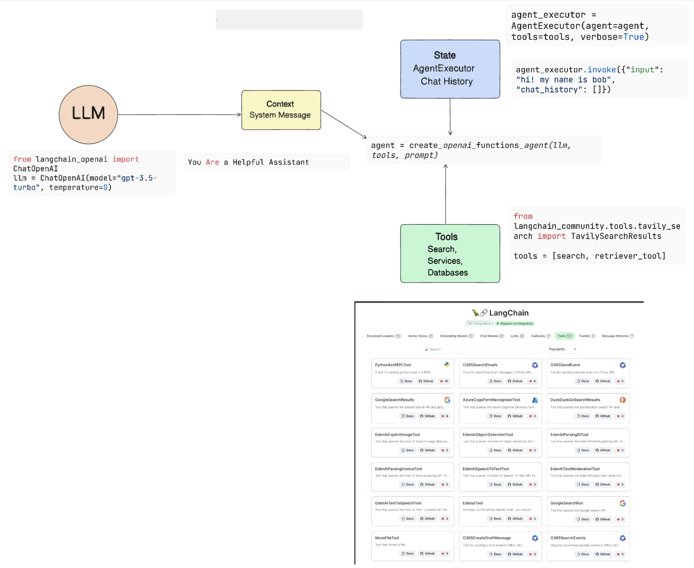
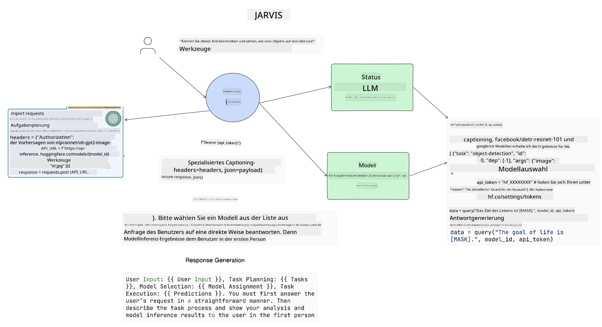

<!--
CO_OP_TRANSLATOR_METADATA:
{
  "original_hash": "8e8d1f6a63da606af7176a87ff8e92b6",
  "translation_date": "2025-10-17T23:00:45+00:00",
  "source_file": "17-ai-agents/README.md",
  "language_code": "de"
}
-->
[](https://youtu.be/yAXVW-lUINc?si=bOtW9nL6jc3XJgOM)

## Einführung

KI-Agenten stellen eine spannende Entwicklung im Bereich der generativen KI dar, da sie es großen Sprachmodellen (LLMs) ermöglichen, sich von Assistenten zu Akteuren zu entwickeln, die eigenständig handeln können. Frameworks für KI-Agenten ermöglichen es Entwicklern, Anwendungen zu erstellen, die LLMs Zugang zu Werkzeugen und Zustandsverwaltung bieten. Diese Frameworks verbessern auch die Transparenz, indem sie Nutzern und Entwicklern ermöglichen, die von LLMs geplanten Aktionen zu überwachen und so das Erlebnismanagement zu optimieren.

Die Lektion behandelt folgende Themen:

- Verstehen, was ein KI-Agent ist – Was genau ist ein KI-Agent?
- Untersuchung von vier verschiedenen Frameworks für KI-Agenten – Was macht sie einzigartig?
- Anwendung dieser KI-Agenten auf verschiedene Anwendungsfälle – Wann sollten wir KI-Agenten einsetzen?

## Lernziele

Nach Abschluss dieser Lektion wirst du in der Lage sein:

- Zu erklären, was KI-Agenten sind und wie sie verwendet werden können.
- Ein Verständnis für die Unterschiede zwischen einigen der populären Frameworks für KI-Agenten zu haben und wie sie sich unterscheiden.
- Zu verstehen, wie KI-Agenten funktionieren, um Anwendungen mit ihnen zu erstellen.

## Was sind KI-Agenten?

KI-Agenten sind ein sehr spannendes Feld in der Welt der generativen KI. Mit dieser Begeisterung geht manchmal eine Verwirrung über Begriffe und deren Anwendung einher. Um die Dinge einfach zu halten und die meisten Tools, die sich auf KI-Agenten beziehen, einzubeziehen, verwenden wir diese Definition:

KI-Agenten ermöglichen es großen Sprachmodellen (LLMs), Aufgaben auszuführen, indem sie ihnen Zugang zu einem **Zustand** und **Werkzeugen** geben.


Lass uns diese Begriffe definieren:

**Große Sprachmodelle** – Dies sind die Modelle, die in diesem Kurs erwähnt werden, wie GPT-3.5, GPT-4, Llama-2 usw.

**Zustand** – Dies bezieht sich auf den Kontext, in dem das LLM arbeitet. Das LLM nutzt den Kontext seiner vergangenen Aktionen und den aktuellen Kontext, um seine Entscheidungsfindung für nachfolgende Aktionen zu leiten. Frameworks für KI-Agenten ermöglichen es Entwicklern, diesen Kontext einfacher zu verwalten.

**Werkzeuge** – Um die vom Nutzer angeforderte und vom LLM geplante Aufgabe zu erfüllen, benötigt das LLM Zugang zu Werkzeugen. Einige Beispiele für Werkzeuge können eine Datenbank, eine API, eine externe Anwendung oder sogar ein anderes LLM sein!

Diese Definitionen sollen dir hoffentlich eine gute Grundlage bieten, während wir uns ansehen, wie sie implementiert werden. Lass uns einige verschiedene Frameworks für KI-Agenten erkunden:

## LangChain Agents

[LangChain Agents](https://python.langchain.com/docs/how_to/#agents?WT.mc_id=academic-105485-koreyst) ist eine Implementierung der oben genannten Definitionen.

Um den **Zustand** zu verwalten, wird eine integrierte Funktion namens `AgentExecutor` verwendet. Diese akzeptiert den definierten `agent` und die ihm zur Verfügung stehenden `tools`.

Der `AgentExecutor` speichert auch den Chatverlauf, um den Kontext des Gesprächs bereitzustellen.



LangChain bietet einen [Katalog von Werkzeugen](https://integrations.langchain.com/tools?WT.mc_id=academic-105485-koreyst), die in deine Anwendung importiert werden können, damit das LLM darauf zugreifen kann. Diese werden von der Community und dem LangChain-Team erstellt.

Du kannst diese Werkzeuge dann definieren und an den `AgentExecutor` übergeben.

Transparenz ist ein weiterer wichtiger Aspekt, wenn es um KI-Agenten geht. Es ist wichtig, dass Anwendungsentwickler verstehen, welches Werkzeug das LLM verwendet und warum. Dafür hat das Team von LangChain LangSmith entwickelt.

## AutoGen

Das nächste Framework für KI-Agenten, das wir besprechen, ist [AutoGen](https://microsoft.github.io/autogen/?WT.mc_id=academic-105485-koreyst). Der Hauptfokus von AutoGen liegt auf Gesprächen. Agenten sind sowohl **kommunikativ** als auch **anpassbar**.

**Kommunikativ –** LLMs können ein Gespräch mit einem anderen LLM beginnen und fortsetzen, um eine Aufgabe zu erfüllen. Dies geschieht durch die Erstellung von `AssistantAgents` und die Zuweisung einer spezifischen Systemnachricht.

```python

autogen.AssistantAgent( name="Coder", llm_config=llm_config, ) pm = autogen.AssistantAgent( name="Product_manager", system_message="Creative in software product ideas.", llm_config=llm_config, )

```

**Anpassbar** – Agenten können nicht nur als LLMs definiert werden, sondern auch als Nutzer oder Werkzeug. Als Entwickler kannst du einen `UserProxyAgent` definieren, der für die Interaktion mit dem Nutzer verantwortlich ist, um Feedback zur Erfüllung einer Aufgabe zu erhalten. Dieses Feedback kann entweder die Ausführung der Aufgabe fortsetzen oder stoppen.

```python
user_proxy = UserProxyAgent(name="user_proxy")
```

### Zustand und Werkzeuge

Um den Zustand zu ändern und zu verwalten, generiert ein AssistantAgent Python-Code, um die Aufgabe zu erfüllen.

Hier ist ein Beispiel für den Prozess:


#### LLM definiert mit einer Systemnachricht

```python
system_message="For weather related tasks, only use the functions you have been provided with. Reply TERMINATE when the task is done."
```

Diese Systemnachricht weist dieses spezifische LLM an, welche Funktionen für seine Aufgabe relevant sind. Denke daran, dass du mit AutoGen mehrere definierte AssistantAgents mit unterschiedlichen Systemnachrichten haben kannst.

#### Chat wird vom Nutzer initiiert

```python
user_proxy.initiate_chat( chatbot, message="I am planning a trip to NYC next week, can you help me pick out what to wear? ", )

```

Diese Nachricht vom user_proxy (Mensch) ist der Auslöser für den Agenten, die möglichen Funktionen zu erkunden, die er ausführen sollte.

#### Funktion wird ausgeführt

```bash
chatbot (to user_proxy):

***** Suggested tool Call: get_weather ***** Arguments: {"location":"New York City, NY","time_periond:"7","temperature_unit":"Celsius"} ******************************************************** --------------------------------------------------------------------------------

>>>>>>>> EXECUTING FUNCTION get_weather... user_proxy (to chatbot): ***** Response from calling function "get_weather" ***** 112.22727272727272 EUR ****************************************************************

```

Sobald der erste Chat verarbeitet wurde, schlägt der Agent das Werkzeug vor, das aufgerufen werden soll. In diesem Fall handelt es sich um eine Funktion namens `get_weather`. Abhängig von deiner Konfiguration kann diese Funktion automatisch vom Agenten ausgeführt und gelesen werden oder basierend auf der Eingabe des Nutzers ausgeführt werden.

Du findest eine Liste von [AutoGen-Codebeispielen](https://microsoft.github.io/autogen/docs/Examples/?WT.mc_id=academic-105485-koreyst), um weiter zu erkunden, wie du mit dem Aufbau beginnen kannst.

## Taskweaver

Das nächste Framework für Agenten, das wir erkunden, ist [Taskweaver](https://microsoft.github.io/TaskWeaver/?WT.mc_id=academic-105485-koreyst). Es wird als "code-first"-Agent bezeichnet, da es anstelle von ausschließlich `strings` auch mit DataFrames in Python arbeiten kann. Dies ist besonders nützlich für Aufgaben der Datenanalyse und -generierung. Dazu gehören Dinge wie das Erstellen von Diagrammen und Grafiken oder das Generieren von Zufallszahlen.

### Zustand und Werkzeuge

Um den Zustand des Gesprächs zu verwalten, verwendet TaskWeaver das Konzept eines `Planner`. Der `Planner` ist ein LLM, das die Anfrage der Nutzer entgegennimmt und die Aufgaben plant, die zur Erfüllung dieser Anfrage erledigt werden müssen.

Um die Aufgaben zu erfüllen, hat der `Planner` Zugriff auf eine Sammlung von Werkzeugen, die als `Plugins` bezeichnet werden. Dies können Python-Klassen oder ein allgemeiner Code-Interpreter sein. Diese Plugins werden als Embeddings gespeichert, damit das LLM besser nach dem richtigen Plugin suchen kann.


Hier ist ein Beispiel für ein Plugin zur Anomalieerkennung:

```python
class AnomalyDetectionPlugin(Plugin): def __call__(self, df: pd.DataFrame, time_col_name: str, value_col_name: str):
```

Der Code wird vor der Ausführung überprüft. Eine weitere Funktion zur Verwaltung des Kontexts in TaskWeaver ist `experience`. Mit Experience kann der Kontext eines Gesprächs langfristig in einer YAML-Datei gespeichert werden. Dies kann so konfiguriert werden, dass sich das LLM im Laufe der Zeit bei bestimmten Aufgaben verbessert, da es vorherigen Gesprächen ausgesetzt war.

## JARVIS

Das letzte Framework für Agenten, das wir erkunden, ist [JARVIS](https://github.com/microsoft/JARVIS?tab=readme-ov-file?WT.mc_id=academic-105485-koreyst). Was JARVIS einzigartig macht, ist, dass es ein LLM verwendet, um den `Zustand` des Gesprächs zu verwalten, und die `Werkzeuge` sind andere KI-Modelle. Jedes der KI-Modelle ist ein spezialisiertes Modell, das bestimmte Aufgaben wie Objekterkennung, Transkription oder Bildbeschreibung ausführt.



Das LLM, als allgemeines Modell, erhält die Anfrage vom Nutzer und identifiziert die spezifische Aufgabe sowie alle Argumente/Daten, die zur Erfüllung der Aufgabe benötigt werden.

```python
[{"task": "object-detection", "id": 0, "dep": [-1], "args": {"image": "e1.jpg" }}]
```

Das LLM formatiert dann die Anfrage so, dass das spezialisierte KI-Modell sie interpretieren kann, beispielsweise als JSON. Sobald das KI-Modell seine Vorhersage basierend auf der Aufgabe zurückgegeben hat, erhält das LLM die Antwort.

Wenn mehrere Modelle erforderlich sind, um die Aufgabe zu erfüllen, interpretiert es auch die Antworten dieser Modelle, bevor es sie zusammenführt, um die Antwort für den Nutzer zu generieren.

Das folgende Beispiel zeigt, wie dies funktioniert, wenn ein Nutzer eine Beschreibung und Anzahl der Objekte in einem Bild anfordert:

## Aufgabe

Um dein Wissen über KI-Agenten weiter zu vertiefen, kannst du mit AutoGen Folgendes erstellen:

- Eine Anwendung, die ein Geschäftstreffen mit verschiedenen Abteilungen eines Bildungs-Startups simuliert.
- Erstelle Systemnachrichten, die LLMs dabei helfen, verschiedene Persönlichkeiten und Prioritäten zu verstehen, und ermögliche dem Nutzer, eine neue Produktidee vorzustellen.
- Das LLM sollte dann Folgefragen von jeder Abteilung generieren, um die Präsentation und die Produktidee zu verfeinern und zu verbessern.

## Lernen hört hier nicht auf, setze deine Reise fort

Nach Abschluss dieser Lektion kannst du unsere [Generative AI Learning Collection](https://aka.ms/genai-collection?WT.mc_id=academic-105485-koreyst) besuchen, um dein Wissen über generative KI weiter zu vertiefen!

---

**Haftungsausschluss**:  
Dieses Dokument wurde mit dem KI-Übersetzungsdienst [Co-op Translator](https://github.com/Azure/co-op-translator) übersetzt. Obwohl wir uns um Genauigkeit bemühen, beachten Sie bitte, dass automatisierte Übersetzungen Fehler oder Ungenauigkeiten enthalten können. Das Originaldokument in seiner ursprünglichen Sprache sollte als maßgebliche Quelle betrachtet werden. Für kritische Informationen wird eine professionelle menschliche Übersetzung empfohlen. Wir übernehmen keine Haftung für Missverständnisse oder Fehlinterpretationen, die sich aus der Nutzung dieser Übersetzung ergeben.