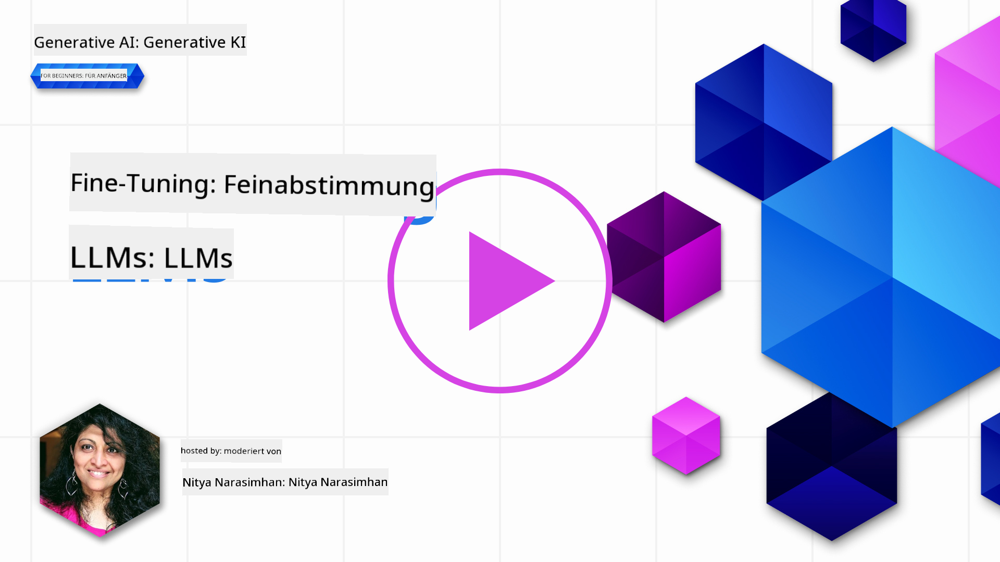

<!--
CO_OP_TRANSLATOR_METADATA:
{
  "original_hash": "68664f7e754a892ae1d8d5e2b7bd2081",
  "translation_date": "2025-07-09T17:34:55+00:00",
  "source_file": "18-fine-tuning/README.md",
  "language_code": "de"
}
-->

# Feinabstimmung Ihres LLM

Die Nutzung großer Sprachmodelle zum Erstellen generativer KI-Anwendungen bringt neue Herausforderungen mit sich. Ein zentrales Thema ist die Sicherstellung der Antwortqualität (Genauigkeit und Relevanz) bei den vom Modell generierten Inhalten für eine bestimmte Nutzeranfrage. In vorherigen Lektionen haben wir Techniken wie Prompt Engineering und Retrieval-Augmented Generation besprochen, die versuchen, das Problem durch _Anpassung der Eingabeaufforderung_ an das bestehende Modell zu lösen.

In der heutigen Lektion behandeln wir eine dritte Methode, die **Feinabstimmung**, bei der die Herausforderung durch _das erneute Training des Modells selbst_ mit zusätzlichen Daten angegangen wird. Tauchen wir in die Details ein.

## Lernziele

Diese Lektion führt in das Konzept der Feinabstimmung vortrainierter Sprachmodelle ein, beleuchtet die Vorteile und Herausforderungen dieses Ansatzes und gibt Hinweise, wann und wie Feinabstimmung eingesetzt werden kann, um die Leistung Ihrer generativen KI-Modelle zu verbessern.

Am Ende dieser Lektion sollten Sie folgende Fragen beantworten können:

- Was ist Feinabstimmung bei Sprachmodellen?
- Wann und warum ist Feinabstimmung sinnvoll?
- Wie kann ich ein vortrainiertes Modell feinabstimmen?
- Welche Einschränkungen hat die Feinabstimmung?

Bereit? Dann legen wir los.

## Illustrierter Leitfaden

Möchten Sie einen Überblick darüber bekommen, was wir behandeln, bevor wir tiefer einsteigen? Schauen Sie sich diesen illustrierten Leitfaden an, der die Lernreise dieser Lektion beschreibt – vom Verständnis der Kernkonzepte und Motivation für Feinabstimmung bis hin zum Prozess und den Best Practices für die Durchführung der Feinabstimmung. Das ist ein spannendes Thema, also vergessen Sie nicht, auch die [Ressourcen](./RESOURCES.md?WT.mc_id=academic-105485-koreyst) Seite für weitere Links zu Ihrer selbstgesteuerten Lernreise zu besuchen!

## Was ist Feinabstimmung bei Sprachmodellen?

Große Sprachmodelle sind per Definition _vortrainiert_ auf großen Mengen von Texten aus verschiedenen Quellen, darunter das Internet. Wie wir in vorherigen Lektionen gelernt haben, benötigen wir Techniken wie _Prompt Engineering_ und _Retrieval-Augmented Generation_, um die Qualität der Antworten des Modells auf Nutzeranfragen („Prompts“) zu verbessern.

Eine beliebte Technik im Prompt Engineering besteht darin, dem Modell mehr Hinweise zu geben, was in der Antwort erwartet wird, entweder durch _Anweisungen_ (explizite Anleitung) oder _einige Beispiele_ (implizite Anleitung). Dies wird als _Few-Shot-Lernen_ bezeichnet, hat aber zwei Einschränkungen:

- Die Token-Limits des Modells begrenzen die Anzahl der Beispiele, die Sie geben können, und schränken die Wirksamkeit ein.
- Die Token-Kosten können es teuer machen, Beispiele zu jeder Eingabeaufforderung hinzuzufügen, und schränken die Flexibilität ein.

Feinabstimmung ist eine gängige Praxis in maschinellen Lernsystemen, bei der ein vortrainiertes Modell mit neuen Daten erneut trainiert wird, um seine Leistung für eine bestimmte Aufgabe zu verbessern. Im Kontext von Sprachmodellen können wir das vortrainierte Modell _mit einer kuratierten Menge von Beispielen für eine bestimmte Aufgabe oder Anwendungsdomäne_ feinabstimmen, um ein **kundenspezifisches Modell** zu erstellen, das für diese spezielle Aufgabe oder Domäne genauer und relevanter ist. Ein Nebeneffekt der Feinabstimmung ist, dass sie auch die Anzahl der für Few-Shot-Lernen benötigten Beispiele reduzieren kann – was den Token-Verbrauch und die damit verbundenen Kosten senkt.

## Wann und warum sollten wir Modelle feinabstimmen?

In _diesem_ Kontext sprechen wir bei Feinabstimmung von **überwachter** Feinabstimmung, bei der das erneute Training durch **Hinzufügen neuer Daten** erfolgt, die nicht Teil des ursprünglichen Trainingsdatensatzes waren. Dies unterscheidet sich von einem unüberwachten Feinabstimmungsansatz, bei dem das Modell mit den ursprünglichen Daten, aber mit anderen Hyperparametern erneut trainiert wird.

Wichtig ist, dass Feinabstimmung eine fortgeschrittene Technik ist, die ein gewisses Maß an Fachwissen erfordert, um die gewünschten Ergebnisse zu erzielen. Wird sie falsch durchgeführt, kann sie die erwarteten Verbesserungen ausbleiben lassen oder sogar die Leistung des Modells für Ihre Ziel-Domäne verschlechtern.

Bevor Sie also lernen, „wie“ man Sprachmodelle feinabstimmt, sollten Sie wissen, „warum“ Sie diesen Weg gehen sollten und „wann“ Sie mit dem Feinabstimmungsprozess beginnen sollten. Stellen Sie sich dazu folgende Fragen:

- **Anwendungsfall**: Was ist Ihr _Anwendungsfall_ für die Feinabstimmung? Welchen Aspekt des aktuellen vortrainierten Modells möchten Sie verbessern?
- **Alternativen**: Haben Sie _andere Techniken_ ausprobiert, um die gewünschten Ergebnisse zu erzielen? Nutzen Sie diese als Vergleichsbasis.
  - Prompt Engineering: Probieren Sie Techniken wie Few-Shot-Prompting mit Beispielen relevanter Antworten. Bewerten Sie die Qualität der Antworten.
  - Retrieval Augmented Generation: Versuchen Sie, Prompts mit Suchergebnissen aus Ihren Daten zu ergänzen. Bewerten Sie die Qualität der Antworten.
- **Kosten**: Haben Sie die Kosten für die Feinabstimmung ermittelt?
  - Feinabstimmfähigkeit – ist das vortrainierte Modell für Feinabstimmung verfügbar?
  - Aufwand – für die Vorbereitung der Trainingsdaten, Bewertung und Verfeinerung des Modells.
  - Rechenleistung – für das Ausführen der Feinabstimmungsjobs und das Bereitstellen des feinabgestimmten Modells.
  - Daten – Zugang zu ausreichend hochwertigen Beispielen für eine wirkungsvolle Feinabstimmung.
- **Nutzen**: Haben Sie den Nutzen der Feinabstimmung bestätigt?
  - Qualität – hat das feinabgestimmte Modell die Basislinie übertroffen?
  - Kosten – reduziert es den Token-Verbrauch durch vereinfachte Prompts?
  - Erweiterbarkeit – können Sie das Basismodell für neue Domänen wiederverwenden?

Wenn Sie diese Fragen beantworten, können Sie entscheiden, ob Feinabstimmung der richtige Ansatz für Ihren Anwendungsfall ist. Idealerweise ist der Ansatz nur dann sinnvoll, wenn der Nutzen die Kosten überwiegt. Sobald Sie sich entschieden haben, ist es Zeit, darüber nachzudenken, _wie_ Sie das vortrainierte Modell feinabstimmen können.

Möchten Sie mehr Einblicke in den Entscheidungsprozess? Sehen Sie sich [To fine-tune or not to fine-tune](https://www.youtube.com/watch?v=0Jo-z-MFxJs) an.

## Wie können wir ein vortrainiertes Modell feinabstimmen?

Um ein vortrainiertes Modell feinabzustimmen, benötigen Sie:

- ein vortrainiertes Modell zur Feinabstimmung
- einen Datensatz für die Feinabstimmung
- eine Trainingsumgebung, um den Feinabstimmungsjob auszuführen
- eine Hosting-Umgebung, um das feinabgestimmte Modell bereitzustellen

## Feinabstimmung in der Praxis

Die folgenden Ressourcen bieten Schritt-für-Schritt-Anleitungen, die Sie durch ein praktisches Beispiel mit einem ausgewählten Modell und einem kuratierten Datensatz führen. Um diese Tutorials durchzuarbeiten, benötigen Sie ein Konto beim jeweiligen Anbieter sowie Zugriff auf das relevante Modell und die Datensätze.

| Anbieter    | Tutorial                                                                                                                                                                       | Beschreibung                                                                                                                                                                                                                                                                                                                                                                                                                        |
| ----------- | ------------------------------------------------------------------------------------------------------------------------------------------------------------------------------ | ---------------------------------------------------------------------------------------------------------------------------------------------------------------------------------------------------------------------------------------------------------------------------------------------------------------------------------------------------------------------------------------------------------------------------------- |
| OpenAI      | [How to fine-tune chat models](https://github.com/openai/openai-cookbook/blob/main/examples/How_to_finetune_chat_models.ipynb?WT.mc_id=academic-105485-koreyst)                | Lernen Sie, wie Sie ein `gpt-35-turbo` für eine bestimmte Domäne („Rezeptassistent“) feinabstimmen, indem Sie Trainingsdaten vorbereiten, den Feinabstimmungsjob ausführen und das feinabgestimmte Modell für Inferenz verwenden.                                                                                                                                                                                                 |
| Azure OpenAI| [GPT 3.5 Turbo fine-tuning tutorial](https://learn.microsoft.com/azure/ai-services/openai/tutorials/fine-tune?tabs=python-new%2Ccommand-line?WT.mc_id=academic-105485-koreyst) | Lernen Sie, wie Sie ein `gpt-35-turbo-0613` Modell **auf Azure** feinabstimmen, indem Sie Trainingsdaten erstellen und hochladen, den Feinabstimmungsjob ausführen sowie das neue Modell bereitstellen und verwenden.                                                                                                                                                                                                                 |
| Hugging Face| [Fine-tuning LLMs with Hugging Face](https://www.philschmid.de/fine-tune-llms-in-2024-with-trl?WT.mc_id=academic-105485-koreyst)                                               | Dieser Blogbeitrag zeigt, wie man ein _offenes LLM_ (z. B. `CodeLlama 7B`) mit der [transformers](https://huggingface.co/docs/transformers/index?WT.mc_id=academic-105485-koreyst) Bibliothek und [Transformer Reinforcement Learning (TRL)](https://huggingface.co/docs/trl/index?WT.mc_id=academic-105485-koreyst) sowie offenen [Datensätzen](https://huggingface.co/docs/datasets/index?WT.mc_id=academic-105485-koreyst) auf Hugging Face feinabstimmt. |
|             |                                                                                                                                                                                |                                                                                                                                                                                                                                                                                                                                                                                                                                    |
| 🤗 AutoTrain| [Fine-tuning LLMs with AutoTrain](https://github.com/huggingface/autotrain-advanced/?WT.mc_id=academic-105485-koreyst)                                                         | AutoTrain (oder AutoTrain Advanced) ist eine von Hugging Face entwickelte Python-Bibliothek, die Feinabstimmung für viele verschiedene Aufgaben, einschließlich LLM-Feinabstimmung, ermöglicht. AutoTrain ist eine No-Code-Lösung und die Feinabstimmung kann in Ihrer eigenen Cloud, auf Hugging Face Spaces oder lokal durchgeführt werden. Es unterstützt eine webbasierte GUI, CLI und Training über YAML-Konfigurationsdateien.                          |
|             |                                                                                                                                                                                |                                                                                                                                                                                                                                                                                                                                                                                                                                    |

## Aufgabe

Wählen Sie eines der oben genannten Tutorials aus und arbeiten Sie es durch. _Wir könnten eine Version dieser Tutorials in Jupyter Notebooks in diesem Repository zur Referenz bereitstellen. Bitte nutzen Sie die Originalquellen direkt, um die aktuellsten Versionen zu erhalten_.

## Gute Arbeit! Setzen Sie Ihr Lernen fort.

Nach Abschluss dieser Lektion schauen Sie sich unsere [Generative AI Learning collection](https://aka.ms/genai-collection?WT.mc_id=academic-105485-koreyst) an, um Ihr Wissen über generative KI weiter zu vertiefen!

Herzlichen Glückwunsch!! Sie haben die letzte Lektion der v2-Serie dieses Kurses abgeschlossen! Hören Sie nicht auf zu lernen und zu bauen. \*\*Besuchen Sie die [RESOURCES](RESOURCES.md?WT.mc_id=academic-105485-koreyst) Seite für eine Liste zusätzlicher Empfehlungen speziell zu diesem Thema.

Unsere v1-Lektionsreihe wurde ebenfalls mit weiteren Aufgaben und Konzepten aktualisiert. Nehmen Sie sich also eine Minute Zeit, um Ihr Wissen aufzufrischen – und bitte [teilen Sie Ihre Fragen und Ihr Feedback](https://github.com/microsoft/generative-ai-for-beginners/issues?WT.mc_id=academic-105485-koreyst), um uns zu helfen, diese Lektionen für die Community zu verbessern.

**Haftungsausschluss**:  
Dieses Dokument wurde mit dem KI-Übersetzungsdienst [Co-op Translator](https://github.com/Azure/co-op-translator) übersetzt. Obwohl wir uns um Genauigkeit bemühen, beachten Sie bitte, dass automatisierte Übersetzungen Fehler oder Ungenauigkeiten enthalten können. Das Originaldokument in seiner Ursprungssprache ist als maßgebliche Quelle zu betrachten. Für wichtige Informationen wird eine professionelle menschliche Übersetzung empfohlen. Wir übernehmen keine Haftung für Missverständnisse oder Fehlinterpretationen, die aus der Nutzung dieser Übersetzung entstehen.