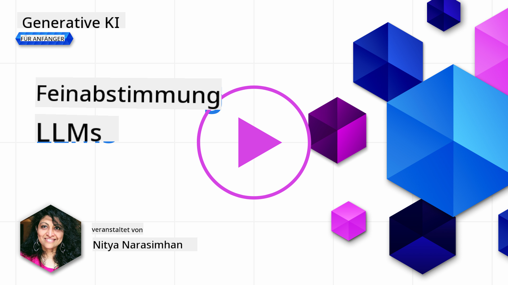

<!--
CO_OP_TRANSLATOR_METADATA:
{
  "original_hash": "68664f7e754a892ae1d8d5e2b7bd2081",
  "translation_date": "2025-05-20T07:35:25+00:00",
  "source_file": "18-fine-tuning/README.md",
  "language_code": "de"
}
-->

# Feinabstimmung Ihres LLM

Der Einsatz großer Sprachmodelle zum Aufbau generativer KI-Anwendungen bringt neue Herausforderungen mit sich. Ein zentrales Problem ist die Sicherstellung der Antwortqualität (Genauigkeit und Relevanz) in den vom Modell generierten Inhalten für eine bestimmte Benutzeranfrage. In den vorherigen Lektionen haben wir Techniken wie Prompt-Engineering und Retrieval-augmented Generation besprochen, die versuchen, das Problem zu lösen, indem sie die _Eingabeaufforderung_ des bestehenden Modells _modifizieren_.

In der heutigen Lektion besprechen wir eine dritte Technik, die **Feinabstimmung**, die versucht, die Herausforderung zu bewältigen, indem das Modell selbst mit zusätzlichen Daten _neu trainiert_ wird. Lassen Sie uns in die Details eintauchen.

## Lernziele

Diese Lektion führt in das Konzept der Feinabstimmung für vortrainierte Sprachmodelle ein, untersucht die Vorteile und Herausforderungen dieses Ansatzes und gibt Hinweise darauf, wann und wie Sie die Feinabstimmung verwenden können, um die Leistung Ihrer generativen KI-Modelle zu verbessern.

Am Ende dieser Lektion sollten Sie folgende Fragen beantworten können:

- Was ist Feinabstimmung für Sprachmodelle?
- Wann und warum ist Feinabstimmung nützlich?
- Wie kann ich ein vortrainiertes Modell feinabstimmen?
- Welche Einschränkungen hat die Feinabstimmung?

Bereit? Lassen Sie uns beginnen.

## Illustrierter Leitfaden

Möchten Sie einen Überblick darüber erhalten, was wir behandeln werden, bevor wir eintauchen? Schauen Sie sich diesen illustrierten Leitfaden an, der die Lernreise für diese Lektion beschreibt - von der Erlernung der Kernkonzepte und Motivation für die Feinabstimmung bis hin zum Verständnis des Prozesses und der besten Praktiken für die Durchführung der Feinabstimmungsaufgabe. Dies ist ein faszinierendes Thema zur Erkundung, also vergessen Sie nicht, die [Ressourcenseite](./RESOURCES.md?WT.mc_id=academic-105485-koreyst) für zusätzliche Links zu besuchen, die Ihre selbstgesteuerte Lernreise unterstützen!

## Was ist Feinabstimmung für Sprachmodelle?

Per Definition sind große Sprachmodelle _vortrainiert_ auf großen Mengen von Texten aus verschiedenen Quellen, einschließlich des Internets. Wie wir in den vorherigen Lektionen gelernt haben, benötigen wir Techniken wie _Prompt-Engineering_ und _Retrieval-augmented Generation_, um die Qualität der Antworten des Modells auf die Fragen des Benutzers ("Prompts") zu verbessern.

Eine beliebte Prompt-Engineering-Technik besteht darin, dem Modell mehr Anleitung zu geben, was in der Antwort erwartet wird, entweder durch _Anweisungen_ (explizite Anleitung) oder _einige Beispiele_ (implizite Anleitung). Dies wird als _Few-shot-Lernen_ bezeichnet, hat jedoch zwei Einschränkungen:

- Modell-Token-Grenzen können die Anzahl der Beispiele einschränken, die Sie geben können, und die Effektivität begrenzen.
- Modell-Token-Kosten können es teuer machen, Beispiele zu jeder Eingabeaufforderung hinzuzufügen, und die Flexibilität einschränken.

Die Feinabstimmung ist eine gängige Praxis in maschinellen Lernsystemen, bei der wir ein vortrainiertes Modell nehmen und es mit neuen Daten neu trainieren, um seine Leistung bei einer bestimmten Aufgabe zu verbessern. Im Kontext von Sprachmodellen können wir das vortrainierte Modell _mit einer kuratierten Sammlung von Beispielen für eine bestimmte Aufgabe oder Anwendungsdomäne_ feinabstimmen, um ein **benutzerdefiniertes Modell** zu erstellen, das möglicherweise genauer und relevanter für diese spezifische Aufgabe oder Domäne ist. Ein Nebeneffekt der Feinabstimmung ist, dass sie auch die Anzahl der benötigten Beispiele für das Few-shot-Lernen reduzieren kann - wodurch der Token-Verbrauch und die damit verbundenen Kosten reduziert werden.

## Wann und warum sollten wir Modelle feinabstimmen?

In _diesem_ Kontext sprechen wir von **überwachter** Feinabstimmung, bei der das Neutraining durch **Hinzufügen neuer Daten** erfolgt, die nicht Teil des ursprünglichen Trainingsdatensatzes waren. Dies unterscheidet sich von einem unüberwachten Feinabstimmungsansatz, bei dem das Modell auf den ursprünglichen Daten, jedoch mit unterschiedlichen Hyperparametern neu trainiert wird.

Das Wichtigste, was Sie beachten sollten, ist, dass die Feinabstimmung eine fortgeschrittene Technik ist, die ein gewisses Maß an Fachwissen erfordert, um die gewünschten Ergebnisse zu erzielen. Wenn sie falsch durchgeführt wird, kann sie möglicherweise nicht die erwarteten Verbesserungen bieten und sogar die Leistung des Modells für Ihre Ziel-Domäne verschlechtern.

Bevor Sie also lernen, "wie" Sie Sprachmodelle feinabstimmen, müssen Sie wissen, "warum" Sie diesen Weg einschlagen sollten und "wann" Sie mit dem Prozess der Feinabstimmung beginnen sollten. Stellen Sie sich zunächst diese Fragen:

- **Anwendungsfall**: Was ist Ihr _Anwendungsfall_ für die Feinabstimmung? Welchen Aspekt des aktuellen vortrainierten Modells möchten Sie verbessern?
- **Alternativen**: Haben Sie _andere Techniken_ ausprobiert, um die gewünschten Ergebnisse zu erzielen? Verwenden Sie sie, um eine Vergleichsbasis zu schaffen.
  - Prompt-Engineering: Probieren Sie Techniken wie Few-shot-Prompting mit Beispielen relevanter Eingabeaufforderungsantworten aus. Bewerten Sie die Qualität der Antworten.
  - Retrieval Augmented Generation: Versuchen Sie, Eingabeaufforderungen mit Abfrageergebnissen zu ergänzen, die durch die Suche in Ihren Daten abgerufen werden. Bewerten Sie die Qualität der Antworten.
- **Kosten**: Haben Sie die Kosten für die Feinabstimmung identifiziert?
  - Abstimmungsfähigkeit - Ist das vortrainierte Modell für die Feinabstimmung verfügbar?
  - Aufwand - für die Vorbereitung von Trainingsdaten, die Bewertung und Verfeinerung des Modells.
  - Rechenleistung - für das Ausführen von Feinabstimmungsjobs und das Bereitstellen des feinabgestimmten Modells.
  - Daten - Zugang zu genügend qualitativ hochwertigen Beispielen für den Feinabstimmungsaufwand.
- **Vorteile**: Haben Sie die Vorteile der Feinabstimmung bestätigt?
  - Qualität - Hat das feinabgestimmte Modell die Vergleichsbasis übertroffen?
  - Kosten - Reduziert es den Token-Verbrauch durch Vereinfachung der Eingabeaufforderungen?
  - Erweiterbarkeit - Können Sie das Basismodell für neue Domänen umnutzen?

Durch die Beantwortung dieser Fragen sollten Sie entscheiden können, ob die Feinabstimmung der richtige Ansatz für Ihren Anwendungsfall ist. Idealerweise ist der Ansatz nur gültig, wenn die Vorteile die Kosten überwiegen. Sobald Sie sich entschieden haben, fortzufahren, ist es an der Zeit, darüber nachzudenken, _wie_ Sie das vortrainierte Modell feinabstimmen können.

Möchten Sie weitere Einblicke in den Entscheidungsprozess erhalten? Sehen Sie sich [Feinabstimmen oder nicht feinabstimmen](https://www.youtube.com/watch?v=0Jo-z-MFxJs) an.

## Wie können wir ein vortrainiertes Modell feinabstimmen?

Um ein vortrainiertes Modell feinabzustimmen, benötigen Sie:

- ein vortrainiertes Modell zur Feinabstimmung
- einen Datensatz zur Verwendung für die Feinabstimmung
- eine Trainingsumgebung, um den Feinabstimmungsjob auszuführen
- eine Hosting-Umgebung, um das feinabgestimmte Modell bereitzustellen

## Feinabstimmung in Aktion

Die folgenden Ressourcen bieten Schritt-für-Schritt-Tutorials, die Sie durch ein echtes Beispiel mit einem ausgewählten Modell und einem kuratierten Datensatz führen. Um diese Tutorials durchzuarbeiten, benötigen Sie ein Konto beim jeweiligen Anbieter sowie Zugang zu dem relevanten Modell und den Datensätzen.

| Anbieter     | Tutorial                                                                                                                                                                       | Beschreibung                                                                                                                                                                                                                                                                                                                                                                                                                        |
| ------------ | ------------------------------------------------------------------------------------------------------------------------------------------------------------------------------ | ---------------------------------------------------------------------------------------------------------------------------------------------------------------------------------------------------------------------------------------------------------------------------------------------------------------------------------------------------------------------------------------------------------------------------------- |
| OpenAI       | [Wie man Chat-Modelle feinabstimmt](https://github.com/openai/openai-cookbook/blob/main/examples/How_to_finetune_chat_models.ipynb?WT.mc_id=academic-105485-koreyst)                | Lernen Sie, ein `gpt-35-turbo` für eine bestimmte Domäne ("Rezeptassistent") zu feinabstimmen, indem Sie Trainingsdaten vorbereiten, den Feinabstimmungsjob ausführen und das feinabgestimmte Modell für Inferenz verwenden.                                                                                                                                                                                                                                              |
| Azure OpenAI | [GPT 3.5 Turbo Feinabstimmungstutorial](https://learn.microsoft.com/azure/ai-services/openai/tutorials/fine-tune?tabs=python-new%2Ccommand-line?WT.mc_id=academic-105485-koreyst) | Lernen Sie, ein `gpt-35-turbo-0613` Modell **auf Azure** zu feinabstimmen, indem Sie Schritte unternehmen, um Trainingsdaten zu erstellen und hochzuladen, den Feinabstimmungsjob auszuführen. Stellen Sie das neue Modell bereit und verwenden Sie es.                                                                                                                                                                                                                                                                 |
| Hugging Face | [Feinabstimmung von LLMs mit Hugging Face](https://www.philschmid.de/fine-tune-llms-in-2024-with-trl?WT.mc_id=academic-105485-koreyst)                                               | Dieser Blogbeitrag führt Sie durch die Feinabstimmung eines _offenen LLM_ (z.B. `CodeLlama 7B`) mit der [transformers](https://huggingface.co/docs/transformers/index?WT.mc_id=academic-105485-koreyst) Bibliothek & [Transformer Reinforcement Learning (TRL)](https://huggingface.co/docs/trl/index?WT.mc_id=academic-105485-koreyst]) mit offenen [Datensätzen](https://huggingface.co/docs/datasets/index?WT.mc_id=academic-105485-koreyst) auf Hugging Face. |
|              |                                                                                                                                                                                |                                                                                                                                                                                                                                                                                                                                                                                                                                    |
| 🤗 AutoTrain | [Feinabstimmung von LLMs mit AutoTrain](https://github.com/huggingface/autotrain-advanced/?WT.mc_id=academic-105485-koreyst)                                                         | AutoTrain (oder AutoTrain Advanced) ist eine Python-Bibliothek, die von Hugging Face entwickelt wurde und die Feinabstimmung für viele verschiedene Aufgaben einschließlich LLM-Feinabstimmung ermöglicht. AutoTrain ist eine No-Code-Lösung und die Feinabstimmung kann in Ihrer eigenen Cloud, auf Hugging Face Spaces oder lokal durchgeführt werden. Es unterstützt sowohl eine webbasierte GUI, CLI als auch das Training über YAML-Konfigurationsdateien.                                                                               |
|              |                                                                                                                                                                                |                                                                                                                                                                                                                                                                                                                                                                                                                                    |

## Aufgabe

Wählen Sie eines der oben genannten Tutorials aus und gehen Sie es durch. _Wir können eine Version dieser Tutorials in Jupyter Notebooks in diesem Repository zur Referenz replizieren. Bitte verwenden Sie die Originalquellen direkt, um die neuesten Versionen zu erhalten_.

## Großartige Arbeit! Setzen Sie Ihr Lernen fort.

Nachdem Sie diese Lektion abgeschlossen haben, schauen Sie sich unsere [Generative AI Learning Sammlung](https://aka.ms/genai-collection?WT.mc_id=academic-105485-koreyst) an, um Ihr Wissen über Generative KI weiter zu vertiefen!

Herzlichen Glückwunsch!! Sie haben die letzte Lektion aus der v2-Serie für diesen Kurs abgeschlossen! Hören Sie nicht auf zu lernen und zu bauen. \*\*Schauen Sie sich die [RESSOURCEN](RESOURCES.md?WT.mc_id=academic-105485-koreyst) Seite für eine Liste zusätzlicher Vorschläge zu diesem Thema an.

Unsere v1-Serie von Lektionen wurde ebenfalls mit mehr Aufgaben und Konzepten aktualisiert. Nehmen Sie sich also einen Moment, um Ihr Wissen aufzufrischen - und bitte [teilen Sie Ihre Fragen und Ihr Feedback](https://github.com/microsoft/generative-ai-for-beginners/issues?WT.mc_id=academic-105485-koreyst), um uns zu helfen, diese Lektionen für die Community zu verbessern.

**Haftungsausschluss**:  
Dieses Dokument wurde mit dem KI-Übersetzungsdienst [Co-op Translator](https://github.com/Azure/co-op-translator) übersetzt. Obwohl wir uns um Genauigkeit bemühen, beachten Sie bitte, dass automatisierte Übersetzungen Fehler oder Ungenauigkeiten enthalten können. Das Originaldokument in seiner ursprünglichen Sprache sollte als maßgebliche Quelle betrachtet werden. Für kritische Informationen wird eine professionelle menschliche Übersetzung empfohlen. Wir haften nicht für Missverständnisse oder Fehlinterpretationen, die sich aus der Nutzung dieser Übersetzung ergeben.