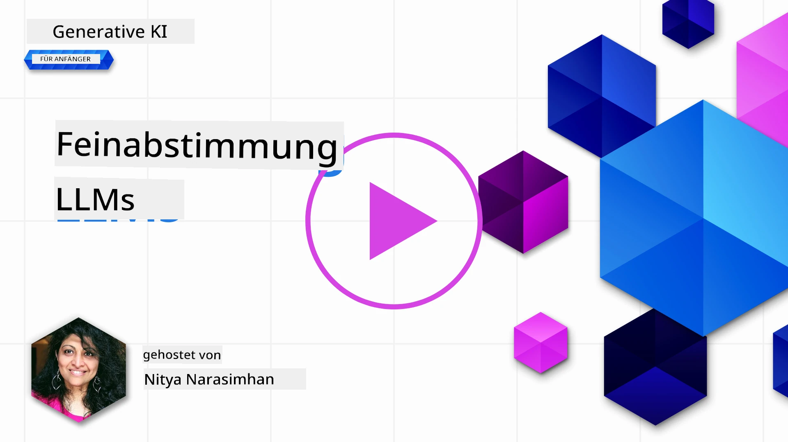

# Feinabstimmung Ihres LLM

Die Verwendung großer Sprachmodelle zur Erstellung generativer KI-Anwendungen bringt neue Herausforderungen mit sich. Ein zentrales Problem ist die Sicherstellung der Antwortqualität (Genauigkeit und Relevanz) bei vom Modell generierten Inhalten für eine gegebene Benutzeranfrage. In früheren Lektionen haben wir Techniken wie Prompt-Engineering und retrieval-augmentierte Generierung besprochen, die versuchen, das Problem durch _Anpassen der Eingabeaufforderung_ an das bestehende Modell zu lösen.

In der heutigen Lektion besprechen wir eine dritte Technik, die **Feinabstimmung**, die versucht, die Herausforderung durch _Neutraining des Modells selbst_ mit zusätzlichen Daten zu bewältigen. Lassen Sie uns in die Details eintauchen.

## Lernziele

Diese Lektion führt in das Konzept der Feinabstimmung für vortrainierte Sprachmodelle ein, untersucht die Vorteile und Herausforderungen dieses Ansatzes und gibt Hinweise, wann und wie Sie die Feinabstimmung einsetzen können, um die Leistung Ihrer generativen KI-Modelle zu verbessern.

Am Ende dieser Lektion sollten Sie in der Lage sein, folgende Fragen zu beantworten:

- Was ist Feinabstimmung bei Sprachmodellen?
- Wann und warum ist Feinabstimmung nützlich?
- Wie kann ich ein vortrainiertes Modell feinabstimmen?
- Was sind die Einschränkungen der Feinabstimmung?

Bereit? Dann legen wir los.

## Illustrierter Leitfaden

Möchten Sie einen Überblick darüber bekommen, was wir behandeln, bevor wir ins Detail gehen? Schauen Sie sich diesen illustrierten Leitfaden an, der die Lernreise dieser Lektion beschreibt – vom Erlernen der Kernkonzepte und Motivation für die Feinabstimmung bis zum Verständnis des Prozesses und der Best Practices für die Durchführung der Feinabstimmung. Dies ist ein faszinierendes Thema zur Erkundung, vergessen Sie nicht, die [Ressourcen](./RESOURCES.md?WT.mc_id=academic-105485-koreyst) Seite für zusätzliche Links zu Ihrer selbstgesteuerten Lernreise zu besuchen!

## Was ist Feinabstimmung bei Sprachmodellen?

Definitiongemäß sind große Sprachmodelle auf großen Mengen von Text aus vielfältigen Quellen, einschließlich des Internets, _vortrainiert_. Wie wir in früheren Lektionen gelernt haben, benötigen wir Techniken wie _Prompt-Engineering_ und _retrieval-augmentierte Generierung_, um die Qualität der Antworten des Modells auf Benutzeranfragen („Prompts“) zu verbessern.

Eine beliebte Technik des Prompt-Engineerings besteht darin, dem Modell mehr Anleitung darüber zu geben, was in der Antwort erwartet wird, entweder durch _Anweisungen_ (explizite Anleitung) oder durch _einige Beispiele_ (implizite Anleitung). Dies wird als _Few-Shot-Lernen_ bezeichnet, hat jedoch zwei Einschränkungen:

- Token-Limits des Modells können die Anzahl der Beispiele einschränken, die Sie geben können, und die Effektivität begrenzen.
- Token-Kosten für das Modell können es teuer machen, jedes Prompt mit Beispielen zu erweitern, und schränken die Flexibilität ein.

Feinabstimmung ist eine gängige Praxis in maschinellen Lernsystemen, bei der wir ein vortrainiertes Modell nehmen und es mit neuen Daten erneut trainieren, um dessen Leistung bei einer bestimmten Aufgabe zu verbessern. Im Kontext von Sprachmodellen können wir das vortrainierte Modell _mit einem kuratierten Satz von Beispielen für eine gegebene Aufgabe oder Anwendungsdomäne_ feinabstimmen, um ein **benutzerdefiniertes Modell** zu erstellen, das für diese spezifische Aufgabe oder Domäne genauer und relevanter sein kann. Ein Nebeneffekt der Feinabstimmung ist, dass sie auch die Anzahl der für das Few-Shot-Lernen benötigten Beispiele reduzieren kann – wodurch der Tokenverbrauch und die damit verbundenen Kosten gesenkt werden.

## Wann und warum sollten wir Modelle feinabstimmen?

In _diesem_ Kontext sprechen wir bei Feinabstimmung von **überwachter** Feinabstimmung, bei der das Neutraining durch **Hinzufügen neuer Daten** erfolgt, die nicht Teil des ursprünglichen Trainingsdatensatzes waren. Dies unterscheidet sich von einem unüberwachten Feinabstimmungsansatz, bei dem das Modell mit den ursprünglichen Daten, aber mit anderen Hyperparametern erneut trainiert wird.

Das Wichtigste ist, sich daran zu erinnern, dass Feinabstimmung eine fortgeschrittene Technik ist, die ein gewisses Maß an Fachwissen erfordert, um die gewünschten Ergebnisse zu erzielen. Wenn sie falsch durchgeführt wird, kann sie die erwarteten Verbesserungen nicht bringen und sogar die Leistung des Modells für Ihre Ziel-Domäne verschlechtern.

Bevor Sie also lernen, „wie“ man Sprachmodelle feinabstimmt, sollten Sie wissen, „warum“ Sie diesen Weg wählen sollten und „wann“ Sie mit dem Feinabstimmungsprozess beginnen sollten. Beginnen Sie damit, sich folgende Fragen zu stellen:

- **Anwendungsfall**: Was ist Ihr _Anwendungsfall_ für die Feinabstimmung? Welchen Aspekt des aktuellen vortrainierten Modells möchten Sie verbessern?
- **Alternativen**: Haben Sie _andere Techniken_ ausprobiert, um die gewünschten Ergebnisse zu erzielen? Verwenden Sie diese, um eine Basislinie zum Vergleich zu erstellen.
  - Prompt-Engineering: Versuchen Sie Techniken wie Few-Shot-Prompting mit Beispielen zu relevanten Prompt-Antworten. Bewerten Sie die Qualität der Antworten.
  - Retrieval Augmented Generation: Versuchen Sie, Prompts mit Suchergebnissen zu ergänzen, indem Sie Ihre Daten durchsuchen. Bewerten Sie die Qualität der Antworten.
- **Kosten**: Haben Sie die Kosten für die Feinabstimmung ermittelt?
  - Feinabstimmbarkeit – Ist das vortrainierte Modell für Feinabstimmung verfügbar?
  - Aufwand – für die Vorbereitung der Trainingsdaten, Evaluierung und Optimierung des Modells.
  - Rechenleistung – für das Ausführen der Feinabstimmungsjobs und das Bereitstellen des feinabgestimmten Modells.
  - Daten – Zugang zu genügend hochwertigen Beispielen für einen wirkungsvollen Feinabstimmungsprozess.
- **Vorteile**: Haben Sie die Vorteile der Feinabstimmung bestätigt?
  - Qualität – Hat das feinabgestimmte Modell die Basislinie übertroffen?
  - Kosten – Reduziert es den Tokenverbrauch durch Vereinfachung der Prompts?
  - Erweiterbarkeit – Können Sie das Basismodell für neue Domänen wiederverwenden?

Durch die Beantwortung dieser Fragen sollten Sie entscheiden können, ob Feinabstimmung der richtige Ansatz für Ihren Anwendungsfall ist. Idealerweise ist der Ansatz nur dann sinnvoll, wenn die Vorteile die Kosten überwiegen. Sobald Sie sich entschieden haben, ist es Zeit, darüber nachzudenken, _wie_ Sie das vortrainierte Modell feinabstimmen können.

Möchten Sie mehr Einblicke in den Entscheidungsprozess? Sehen Sie sich [Feinabstimmen oder nicht feinabstimmen](https://www.youtube.com/watch?v=0Jo-z-MFxJs) an.

## Wie können wir ein vortrainiertes Modell feinabstimmen?

Um ein vortrainiertes Modell feinabstimmen zu können, benötigen Sie:

- ein vortrainiertes Modell zum Feinabstimmen
- einen Datensatz zur Verwendung für die Feinabstimmung
- eine Trainingsumgebung, um den Feinabstimmungsjob auszuführen
- eine Hosting-Umgebung, um das feinabgestimmte Modell bereitzustellen

## Feinabstimmung in der Praxis

Die folgenden Ressourcen bieten Schritt-für-Schritt-Tutorials, die Sie durch ein konkretes Beispiel mit einem ausgewählten Modell und einem kuratierten Datensatz führen. Um diese Tutorials durchzuarbeiten, benötigen Sie ein Konto bei dem jeweiligen Anbieter sowie Zugriff auf das entsprechende Modell und die Datensätze.

| Anbieter    | Tutorial                                                                                                                                                                       | Beschreibung                                                                                                                                                                                                                                                                                                                                                                                                                       |
| ----------- | ------------------------------------------------------------------------------------------------------------------------------------------------------------------------------ | --------------------------------------------------------------------------------------------------------------------------------------------------------------------------------------------------------------------------------------------------------------------------------------------------------------------------------------------------------------------------------------------------------------------------------- |
| OpenAI      | [Wie man Chat-Modelle feinabstimmt](https://github.com/openai/openai-cookbook/blob/main/examples/How_to_finetune_chat_models.ipynb?WT.mc_id=academic-105485-koreyst)            | Lernen Sie, wie man `gpt-35-turbo` für eine bestimmte Domäne („Rezept-Assistent“) feinabstimmt, indem Sie Trainingsdaten vorbereiten, den Feinabstimmungsjob ausführen und das feinabgestimmte Modell für die Inferenz verwenden.                                                                                                                                                                                                   |
| Azure OpenAI| [Tutorial zur Feinabstimmung von GPT 3.5 Turbo](https://learn.microsoft.com/azure/ai-services/openai/tutorials/fine-tune?tabs=python-new%2Ccommand-line&WT.mc_id=academic-105485-koreyst) | Lernen Sie, wie man ein `gpt-35-turbo-0613` Modell **auf Azure** feinabstimmt, indem Sie die Schritte zur Erstellung und zum Hochladen der Trainingsdaten durchführen, den Feinabstimmungsjob ausführen sowie das neue Modell bereitstellen und verwenden.                                                                                                                                                                             |
| Hugging Face| [Feinabstimmung von LLMs mit Hugging Face](https://www.philschmid.de/fine-tune-llms-in-2024-with-trl?WT.mc_id=academic-105485-koreyst)                                         | Dieser Blogbeitrag führt Sie durch die Feinabstimmung eines _offenen LLM_ (z. B. `CodeLlama 7B`) mithilfe der [transformers](https://huggingface.co/docs/transformers/index?WT.mc_id=academic-105485-koreyst) Bibliothek & [Transformer Reinforcement Learning (TRL)](https://huggingface.co/docs/trl/index?WT.mc_id=academic-105485-koreyst) mit offenen [Datensätzen](https://huggingface.co/docs/datasets/index?WT.mc_id=academic-105485-koreyst) auf Hugging Face. |
|             |                                                                                                                                                                                |                                                                                                                                                                                                                                                                                                                                                                                                                                   |
| 🤗 AutoTrain | [Feinabstimmung von LLMs mit AutoTrain](https://github.com/huggingface/autotrain-advanced/?WT.mc_id=academic-105485-koreyst)                                                   | AutoTrain (oder AutoTrain Advanced) ist eine Python-Bibliothek von Hugging Face, die die Feinabstimmung bei vielen verschiedenen Aufgaben, einschließlich LLM-Feinabstimmung, ermöglicht. AutoTrain ist eine No-Code-Lösung, die Feinabstimmung kann in Ihrer eigenen Cloud, auf Hugging Face Spaces oder lokal durchgeführt werden. Unterstützt wird eine Web-GUI, CLI und Training über YAML-Konfigurationsdateien.                                                  |
|             |                                                                                                                                                                                |                                                                                                                                                                                                                                                                                                                                                                                                                                   |
| 🦥 Unsloth   | [Feinabstimmung von LLMs mit Unsloth](https://github.com/unslothai/unsloth)                                                                                                    | Unsloth ist ein Open-Source-Framework, das LLM-Feinabstimmung und Reinforcement Learning (RL) unterstützt. Unsloth vereinfacht lokales Training, Evaluation und Deployment mit einsatzbereiten [Notebooks](https://github.com/unslothai/notebooks). Es unterstützt auch Text-to-Speech (TTS), BERT und multimodale Modelle. Zum Einstieg lesen Sie deren Schritt-für-Schritt [Feinabstimmungs-Leitfaden](https://docs.unsloth.ai/get-started/fine-tuning-llms-guide).                                                                       |
|             |                                                                                                                                                                                |                                                                                                                                                                                                                                                                                                                                                                                                                                   |
## Aufgabe

Wählen Sie eines der oben genannten Tutorials aus und arbeiten Sie es durch. _Wir könnten eine Version dieser Tutorials als Jupyter-Notebooks in diesem Repo nur zur Referenz replizieren. Bitte nutzen Sie die Originalquellen direkt, um die neuesten Versionen zu erhalten_.

## Großartige Arbeit! Setzen Sie Ihr Lernen fort.

Nach Abschluss dieser Lektion besuchen Sie unsere [Generative AI Learning Sammlung](https://aka.ms/genai-collection?WT.mc_id=academic-105485-koreyst), um Ihr Wissen über Generative AI weiter zu vertiefen!

Herzlichen Glückwunsch!! Sie haben die letzte Lektion der v2-Serie dieses Kurses abgeschlossen! Hören Sie nicht auf zu lernen und zu bauen. \*\*Besuchen Sie die [RESSOURCEN](RESOURCES.md?WT.mc_id=academic-105485-koreyst) Seite für eine Liste zusätzlicher Vorschläge zu genau diesem Thema.

Unsere v1-Lektionsserie wurde ebenfalls mit weiteren Aufgaben und Konzepten aktualisiert. Nehmen Sie sich also eine Minute Zeit, um Ihr Wissen aufzufrischen – und bitte [teilen Sie Ihre Fragen und Ihr Feedback](https://github.com/microsoft/generative-ai-for-beginners/issues?WT.mc_id=academic-105485-koreyst), um uns bei der Verbesserung dieser Lektionen für die Community zu helfen.

---

<!-- CO-OP TRANSLATOR DISCLAIMER START -->
**Haftungsausschluss**:  
Dieses Dokument wurde mit dem KI-Übersetzungsdienst [Co-op Translator](https://github.com/Azure/co-op-translator) übersetzt. Obwohl wir uns um Genauigkeit bemühen, weisen wir darauf hin, dass automatisierte Übersetzungen Fehler oder Ungenauigkeiten enthalten können. Das Originaldokument in seiner Originalsprache ist als maßgebliche Quelle zu betrachten. Für kritische Informationen wird eine professionelle menschliche Übersetzung empfohlen. Wir übernehmen keine Haftung für Missverständnisse oder Fehlinterpretationen, die durch die Nutzung dieser Übersetzung entstehen.
<!-- CO-OP TRANSLATOR DISCLAIMER END -->