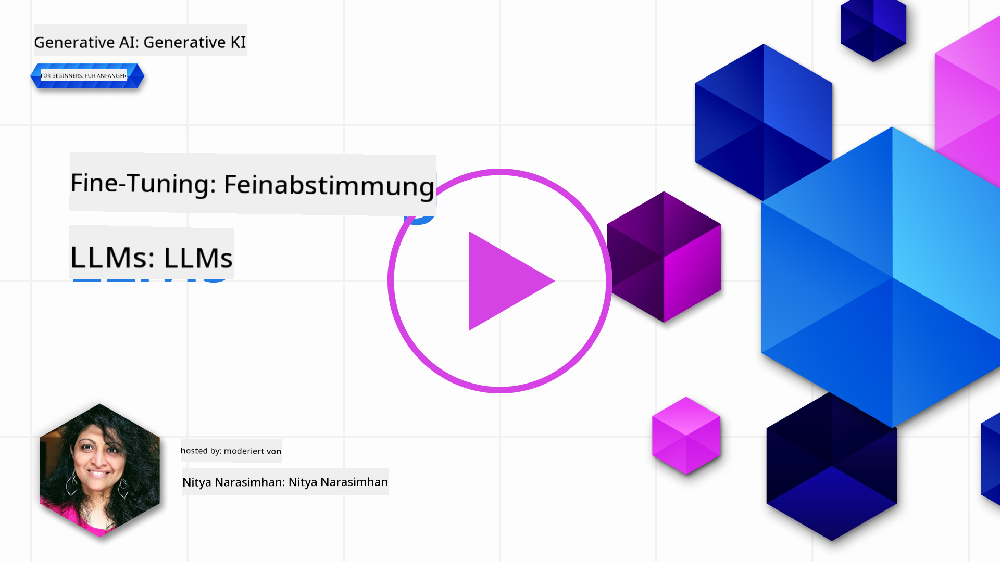

<!--
CO_OP_TRANSLATOR_METADATA:
{
  "original_hash": "68664f7e754a892ae1d8d5e2b7bd2081",
  "translation_date": "2025-06-26T00:30:10+00:00",
  "source_file": "18-fine-tuning/README.md",
  "language_code": "de"
}
-->

# Feinabstimmung Ihres LLM

Die Verwendung großer Sprachmodelle zum Erstellen generativer KI-Anwendungen bringt neue Herausforderungen mit sich. Ein zentrales Problem ist die Sicherstellung der Antwortqualität (Genauigkeit und Relevanz) in den vom Modell für eine bestimmte Benutzeranfrage generierten Inhalten. In den vorherigen Lektionen haben wir Techniken wie Prompt Engineering und Retrieval-Augmented Generation besprochen, die versuchen, das Problem zu lösen, indem sie _den Eingabeprompt_ des vorhandenen Modells _modifizieren_.

In der heutigen Lektion besprechen wir eine dritte Technik, **Feinabstimmung**, die versucht, die Herausforderung zu bewältigen, indem _das Modell selbst mit zusätzlichen Daten neu trainiert_ wird. Lassen Sie uns in die Details eintauchen.

## Lernziele

Diese Lektion führt das Konzept der Feinabstimmung für vortrainierte Sprachmodelle ein, untersucht die Vorteile und Herausforderungen dieses Ansatzes und gibt Anleitungen, wann und wie Feinabstimmung verwendet werden kann, um die Leistung Ihrer generativen KI-Modelle zu verbessern.

Am Ende dieser Lektion sollten Sie folgende Fragen beantworten können:

- Was ist Feinabstimmung für Sprachmodelle?
- Wann und warum ist Feinabstimmung nützlich?
- Wie kann ich ein vortrainiertes Modell feinabstimmen?
- Was sind die Einschränkungen der Feinabstimmung?

Bereit? Los geht's.

## Illustrierte Anleitung

Möchten Sie einen Überblick darüber bekommen, was wir behandeln werden, bevor wir eintauchen? Schauen Sie sich diese illustrierte Anleitung an, die die Lernreise für diese Lektion beschreibt - von der Erlernung der Kernkonzepte und der Motivation für die Feinabstimmung bis hin zum Verständnis des Prozesses und der Best Practices für die Durchführung der Feinabstimmungsaufgabe. Dies ist ein faszinierendes Thema zur Erkundung, also vergessen Sie nicht, die [Ressourcen](./RESOURCES.md?WT.mc_id=academic-105485-koreyst) Seite für zusätzliche Links zu besuchen, um Ihre selbstgeführte Lernreise zu unterstützen!

## Was ist Feinabstimmung für Sprachmodelle?

Per Definition sind große Sprachmodelle _vortrainiert_ auf großen Mengen an Text, der aus verschiedenen Quellen, einschließlich des Internets, stammt. Wie wir in den vorherigen Lektionen gelernt haben, benötigen wir Techniken wie _Prompt Engineering_ und _Retrieval-Augmented Generation_, um die Qualität der Antworten des Modells auf die Fragen des Benutzers ("Prompts") zu verbessern.

Eine beliebte Prompt-Engineering-Technik besteht darin, dem Modell mehr Anleitung zu geben, was in der Antwort erwartet wird, entweder durch _Anweisungen_ (explizite Anleitung) oder _indem man ihm einige Beispiele gibt_ (implizite Anleitung). Dies wird als _Few-Shot-Learning_ bezeichnet, hat aber zwei Einschränkungen:

- Modell-Token-Limits können die Anzahl der Beispiele einschränken, die Sie geben können, und die Effektivität begrenzen.
- Modell-Token-Kosten können es teuer machen, Beispiele zu jedem Prompt hinzuzufügen, und die Flexibilität einschränken.

Feinabstimmung ist eine gängige Praxis in maschinellen Lernsystemen, bei der wir ein vortrainiertes Modell nehmen und es mit neuen Daten neu trainieren, um seine Leistung bei einer bestimmten Aufgabe zu verbessern. Im Kontext von Sprachmodellen können wir das vortrainierte Modell _mit einer kuratierten Menge von Beispielen für eine bestimmte Aufgabe oder Anwendungsdomäne_ feinabstimmen, um ein **benutzerdefiniertes Modell** zu erstellen, das für diese spezifische Aufgabe oder Domäne möglicherweise genauer und relevanter ist. Ein Nebeneffekt der Feinabstimmung ist, dass sie auch die Anzahl der für Few-Shot-Learning benötigten Beispiele reduzieren kann - was den Tokenverbrauch und die damit verbundenen Kosten senkt.

## Wann und warum sollten wir Modelle feinabstimmen?

In _diesem_ Kontext, wenn wir von Feinabstimmung sprechen, beziehen wir uns auf die **überwachte** Feinabstimmung, bei der das Nachtraining durch **Hinzufügen neuer Daten** erfolgt, die nicht Teil des ursprünglichen Trainingsdatensatzes waren. Dies unterscheidet sich von einem unüberwachten Feinabstimmungsansatz, bei dem das Modell auf den ursprünglichen Daten, aber mit unterschiedlichen Hyperparametern neu trainiert wird.

Das Wichtigste, das man beachten sollte, ist, dass Feinabstimmung eine fortgeschrittene Technik ist, die ein gewisses Maß an Fachwissen erfordert, um die gewünschten Ergebnisse zu erzielen. Wenn sie falsch durchgeführt wird, kann sie möglicherweise nicht die erwarteten Verbesserungen bringen und sogar die Leistung des Modells für Ihre Ziel-Domäne verschlechtern.

Bevor Sie also lernen, "wie" man Sprachmodelle feinabstimmt, müssen Sie wissen, "warum" Sie diesen Weg einschlagen sollten und "wann" Sie mit dem Prozess der Feinabstimmung beginnen sollten. Beginnen Sie damit, sich diese Fragen zu stellen:

- **Anwendungsfall**: Was ist Ihr _Anwendungsfall_ für die Feinabstimmung? Welchen Aspekt des aktuellen vortrainierten Modells möchten Sie verbessern?
- **Alternativen**: Haben Sie _andere Techniken_ ausprobiert, um die gewünschten Ergebnisse zu erzielen? Verwenden Sie sie, um eine Basislinie für den Vergleich zu erstellen.
  - Prompt Engineering: Probieren Sie Techniken wie Few-Shot-Prompting mit Beispielen relevanter Prompt-Antworten aus. Bewerten Sie die Qualität der Antworten.
  - Retrieval Augmented Generation: Versuchen Sie, Prompts mit Abfrageergebnissen zu ergänzen, die durch das Durchsuchen Ihrer Daten abgerufen wurden. Bewerten Sie die Qualität der Antworten.
- **Kosten**: Haben Sie die Kosten für die Feinabstimmung identifiziert?
  - Abstimmfähigkeit - ist das vortrainierte Modell für die Feinabstimmung verfügbar?
  - Aufwand - für die Vorbereitung von Trainingsdaten, die Bewertung und Verfeinerung des Modells.
  - Rechenleistung - für das Ausführen von Feinabstimmungsjobs und das Bereitstellen des feinabgestimmten Modells
  - Daten - Zugang zu ausreichend qualitativ hochwertigen Beispielen für den Feinabstimmungseffekt
- **Vorteile**: Haben Sie die Vorteile der Feinabstimmung bestätigt?
  - Qualität - hat das feinabgestimmte Modell die Basislinie übertroffen?
  - Kosten - reduziert es den Tokenverbrauch durch die Vereinfachung von Prompts?
  - Erweiterbarkeit - können Sie das Basismodell für neue Domänen umfunktionieren?

Indem Sie diese Fragen beantworten, sollten Sie entscheiden können, ob Feinabstimmung der richtige Ansatz für Ihren Anwendungsfall ist. Idealerweise ist der Ansatz nur dann gültig, wenn die Vorteile die Kosten überwiegen. Sobald Sie sich entschieden haben, fortzufahren, ist es an der Zeit, darüber nachzudenken, _wie_ Sie das vortrainierte Modell feinabstimmen können.

Möchten Sie mehr Einblicke in den Entscheidungsprozess erhalten? Sehen Sie sich [To fine-tune or not to fine-tune](https://www.youtube.com/watch?v=0Jo-z-MFxJs) an.

## Wie können wir ein vortrainiertes Modell feinabstimmen?

Um ein vortrainiertes Modell feinabzustimmen, benötigen Sie:

- ein vortrainiertes Modell zur Feinabstimmung
- einen Datensatz zur Feinabstimmung
- eine Trainingsumgebung, um den Feinabstimmungsjob auszuführen
- eine Hosting-Umgebung, um das feinabgestimmte Modell bereitzustellen

## Feinabstimmung in Aktion

Die folgenden Ressourcen bieten Schritt-für-Schritt-Tutorials, um Sie durch ein reales Beispiel mit einem ausgewählten Modell und einem kuratierten Datensatz zu führen. Um diese Tutorials durchzuarbeiten, benötigen Sie ein Konto beim jeweiligen Anbieter sowie Zugriff auf das relevante Modell und die Datensätze.

| Anbieter     | Tutorial                                                                                                                                                                       | Beschreibung                                                                                                                                                                                                                                                                                                                                                                                                                        |
| ------------ | ------------------------------------------------------------------------------------------------------------------------------------------------------------------------------ | ---------------------------------------------------------------------------------------------------------------------------------------------------------------------------------------------------------------------------------------------------------------------------------------------------------------------------------------------------------------------------------------------------------------------------------- |
| OpenAI       | [How to fine-tune chat models](https://github.com/openai/openai-cookbook/blob/main/examples/How_to_finetune_chat_models.ipynb?WT.mc_id=academic-105485-koreyst)                | Lernen Sie, ein `gpt-35-turbo` für eine bestimmte Domäne ("Rezept-Assistent") feinabzustimmen, indem Sie Trainingsdaten vorbereiten, den Feinabstimmungsjob ausführen und das feinabgestimmte Modell für Inferenz verwenden.                                                                                                                                                                                                                                              |
| Azure OpenAI | [GPT 3.5 Turbo fine-tuning tutorial](https://learn.microsoft.com/azure/ai-services/openai/tutorials/fine-tune?tabs=python-new%2Ccommand-line?WT.mc_id=academic-105485-koreyst) | Lernen Sie, ein `gpt-35-turbo-0613` Modell **auf Azure** feinabzustimmen, indem Sie Schritte unternehmen, um Trainingsdaten zu erstellen und hochzuladen, den Feinabstimmungsjob auszuführen. Bereitstellen und Verwenden des neuen Modells.                                                                                                                                                                                                                                                                 |
| Hugging Face | [Fine-tuning LLMs with Hugging Face](https://www.philschmid.de/fine-tune-llms-in-2024-with-trl?WT.mc_id=academic-105485-koreyst)                                               | Dieser Blog-Beitrag führt Sie durch die Feinabstimmung eines _offenen LLM_ (z.B. `CodeLlama 7B`) mit der [transformers](https://huggingface.co/docs/transformers/index?WT.mc_id=academic-105485-koreyst) Bibliothek & [Transformer Reinforcement Learning (TRL)](https://huggingface.co/docs/trl/index?WT.mc_id=academic-105485-koreyst]) mit offenen [Datensätzen](https://huggingface.co/docs/datasets/index?WT.mc_id=academic-105485-koreyst) auf Hugging Face. |
|              |                                                                                                                                                                                |                                                                                                                                                                                                                                                                                                                                                                                                                                    |
| 🤗 AutoTrain | [Fine-tuning LLMs with AutoTrain](https://github.com/huggingface/autotrain-advanced/?WT.mc_id=academic-105485-koreyst)                                                         | AutoTrain (oder AutoTrain Advanced) ist eine von Hugging Face entwickelte Python-Bibliothek, die Feinabstimmung für viele verschiedene Aufgaben, einschließlich der Feinabstimmung von LLMs, ermöglicht. AutoTrain ist eine No-Code-Lösung und die Feinabstimmung kann in Ihrer eigenen Cloud, auf Hugging Face Spaces oder lokal durchgeführt werden. Es unterstützt sowohl eine webbasierte GUI, CLI als auch das Training über YAML-Konfigurationsdateien.                                                                               |
|              |                                                                                                                                                                                |                                                                                                                                                                                                                                                                                                                                                                                                                                    |

## Aufgabe

Wählen Sie eines der obigen Tutorials aus und arbeiten Sie es durch. _Wir können eine Version dieser Tutorials in Jupyter Notebooks in diesem Repository nur zu Referenzzwecken replizieren. Bitte verwenden Sie die Originalquellen direkt, um die neuesten Versionen zu erhalten_.

## Großartige Arbeit! Setzen Sie Ihr Lernen fort.

Nachdem Sie diese Lektion abgeschlossen haben, schauen Sie sich unsere [Generative AI Learning Sammlung](https://aka.ms/genai-collection?WT.mc_id=academic-105485-koreyst) an, um Ihr Wissen über generative KI weiter zu vertiefen!

Herzlichen Glückwunsch!! Sie haben die letzte Lektion aus der v2-Serie dieses Kurses abgeschlossen! Hören Sie nicht auf zu lernen und zu bauen. \*\*Schauen Sie sich die [RESSOURCEN](RESOURCES.md?WT.mc_id=academic-105485-koreyst) Seite für eine Liste zusätzlicher Vorschläge zu diesem Thema an.

Unsere v1-Serie von Lektionen wurde ebenfalls mit mehr Aufgaben und Konzepten aktualisiert. Nehmen Sie sich also einen Moment Zeit, um Ihr Wissen aufzufrischen - und bitte [teilen Sie Ihre Fragen und Ihr Feedback](https://github.com/microsoft/generative-ai-for-beginners/issues?WT.mc_id=academic-105485-koreyst), um uns zu helfen, diese Lektionen für die Community zu verbessern.

**Haftungsausschluss**:  
Dieses Dokument wurde mit dem KI-Übersetzungsdienst [Co-op Translator](https://github.com/Azure/co-op-translator) übersetzt. Obwohl wir uns um Genauigkeit bemühen, beachten Sie bitte, dass automatisierte Übersetzungen Fehler oder Ungenauigkeiten enthalten können. Das Originaldokument in seiner Originalsprache sollte als maßgebliche Quelle betrachtet werden. Für kritische Informationen wird eine professionelle menschliche Übersetzung empfohlen. Wir haften nicht für Missverständnisse oder Fehlinterpretationen, die sich aus der Verwendung dieser Übersetzung ergeben.