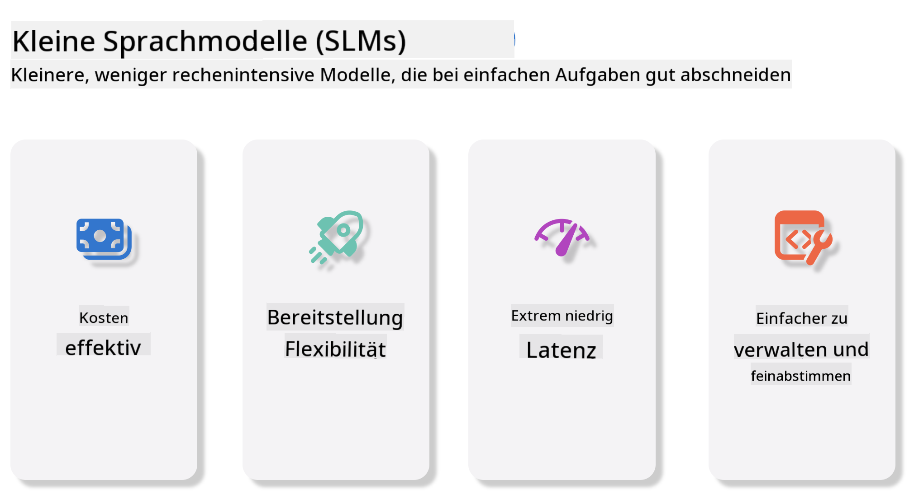
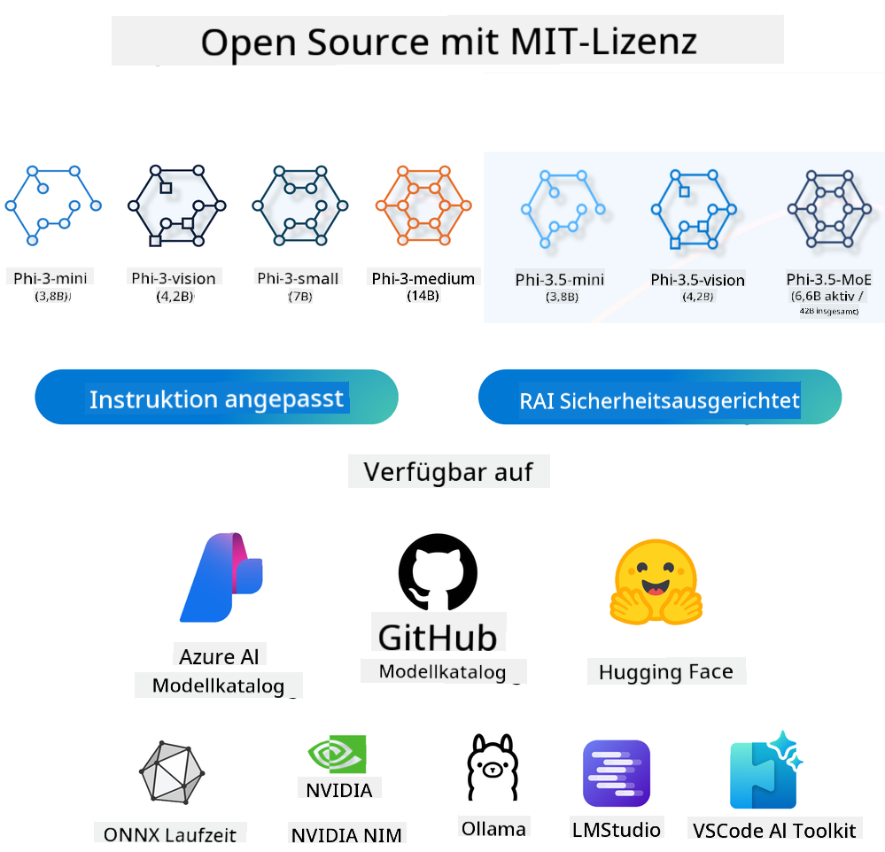
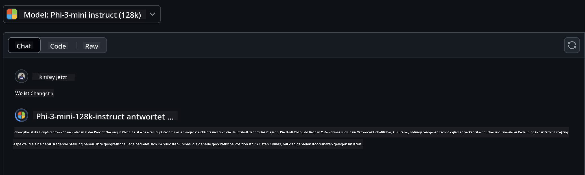
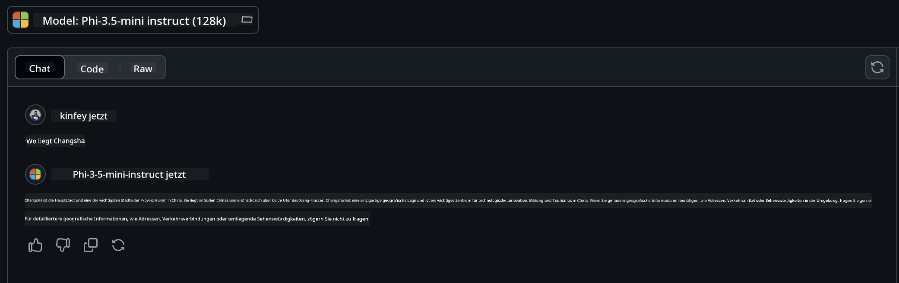

<!--
CO_OP_TRANSLATOR_METADATA:
{
  "original_hash": "124ad36cfe96f74038811b6e2bb93e9d",
  "translation_date": "2025-05-20T09:00:10+00:00",
  "source_file": "19-slm/README.md",
  "language_code": "de"
}
-->
# Einführung in kleine Sprachmodelle für generative KI für Anfänger

Generative KI ist ein faszinierendes Gebiet der künstlichen Intelligenz, das sich auf die Schaffung von Systemen konzentriert, die in der Lage sind, neue Inhalte zu generieren. Diese Inhalte können von Text und Bildern bis hin zu Musik und sogar ganzen virtuellen Umgebungen reichen. Eine der spannendsten Anwendungen der generativen KI liegt im Bereich der Sprachmodelle.

## Was sind kleine Sprachmodelle?

Ein kleines Sprachmodell (Small Language Model, SLM) stellt eine verkleinerte Variante eines großen Sprachmodells (Large Language Model, LLM) dar, das viele der architektonischen Prinzipien und Techniken von LLMs nutzt, während es einen deutlich reduzierten Rechenaufwand aufweist. SLMs sind eine Untergruppe von Sprachmodellen, die darauf ausgelegt sind, menschenähnlichen Text zu generieren. Im Gegensatz zu ihren größeren Gegenstücken, wie GPT-4, sind SLMs kompakter und effizienter, was sie ideal für Anwendungen macht, bei denen die Rechenressourcen begrenzt sind. Trotz ihrer kleineren Größe können sie immer noch eine Vielzahl von Aufgaben ausführen. Typischerweise werden SLMs durch Komprimierung oder Destillation von LLMs konstruiert, mit dem Ziel, einen wesentlichen Teil der ursprünglichen Funktionalität und sprachlichen Fähigkeiten des Modells zu erhalten. Diese Reduzierung der Modellgröße verringert die Gesamtkomplexität und macht SLMs sowohl in Bezug auf den Speicherbedarf als auch auf die Rechenanforderungen effizienter. Trotz dieser Optimierungen können SLMs immer noch ein breites Spektrum an Aufgaben der natürlichen Sprachverarbeitung (NLP) ausführen:

- Textgenerierung: Erstellen kohärenter und kontextuell relevanter Sätze oder Absätze.
- Textvervollständigung: Vorhersagen und Vervollständigen von Sätzen basierend auf einem gegebenen Prompt.
- Übersetzung: Umwandeln von Texten von einer Sprache in eine andere.
- Zusammenfassung: Verkürzen langer Texte zu kürzeren, leichter verdaulichen Zusammenfassungen.

Dies geschieht jedoch mit einigen Kompromissen in Bezug auf Leistung oder Tiefe des Verständnisses im Vergleich zu ihren größeren Gegenstücken.

## Wie funktionieren kleine Sprachmodelle?

SLMs werden mit großen Mengen an Textdaten trainiert. Während des Trainings lernen sie die Muster und Strukturen der Sprache, was es ihnen ermöglicht, Texte zu generieren, die sowohl grammatikalisch korrekt als auch kontextuell angemessen sind. Der Trainingsprozess umfasst:

- Datensammlung: Sammeln großer Datensätze von Texten aus verschiedenen Quellen.
- Vorverarbeitung: Bereinigen und Organisieren der Daten, um sie für das Training geeignet zu machen.
- Training: Verwenden von maschinellen Lernalgorithmen, um dem Modell beizubringen, wie es Text versteht und generiert.
- Feinabstimmung: Anpassen des Modells, um seine Leistung bei spezifischen Aufgaben zu verbessern.

Die Entwicklung von SLMs entspricht dem zunehmenden Bedarf an Modellen, die in ressourcenbeschränkten Umgebungen eingesetzt werden können, wie z.B. mobilen Geräten oder Edge-Computing-Plattformen, wo vollwertige LLMs aufgrund ihres hohen Ressourcenbedarfs unpraktisch sein können. Durch den Fokus auf Effizienz balancieren SLMs Leistung mit Zugänglichkeit, was eine breitere Anwendung in verschiedenen Bereichen ermöglicht.



## Lernziele

In dieser Lektion hoffen wir, das Wissen über SLM zu vermitteln und es mit Microsoft Phi-3 zu kombinieren, um verschiedene Szenarien in Textinhalten, Vision und MoE zu lernen. Am Ende dieser Lektion sollten Sie in der Lage sein, folgende Fragen zu beantworten:

- Was ist SLM
- Was ist der Unterschied zwischen SLM und LLM
- Was ist die Microsoft Phi-3/3.5 Familie
- Wie man Microsoft Phi-3/3.5 Familie schlussfolgert

Bereit? Lassen Sie uns beginnen.

## Die Unterschiede zwischen großen Sprachmodellen (LLMs) und kleinen Sprachmodellen (SLMs)

Sowohl LLMs als auch SLMs basieren auf den grundlegenden Prinzipien des probabilistischen maschinellen Lernens und folgen ähnlichen Ansätzen in ihrem architektonischen Design, ihren Trainingsmethoden, ihren Datenherstellungsprozessen und ihren Modellevaluierungstechniken. Es gibt jedoch mehrere Schlüsselfaktoren, die diese beiden Arten von Modellen unterscheiden.

## Anwendungen von kleinen Sprachmodellen

SLMs haben ein breites Anwendungsspektrum, darunter:

- Chatbots: Bereitstellung von Kundensupport und Interaktion mit Benutzern in einer gesprächsorientierten Weise.
- Inhaltserstellung: Unterstützung von Autoren durch Generierung von Ideen oder sogar das Verfassen ganzer Artikel.
- Bildung: Unterstützung von Schülern bei Schreibaufgaben oder beim Erlernen neuer Sprachen.
- Barrierefreiheit: Erstellung von Werkzeugen für Menschen mit Behinderungen, wie z.B. Text-zu-Sprache-Systeme.

**Größe**

Ein wesentlicher Unterschied zwischen LLMs und SLMs liegt im Umfang der Modelle. LLMs, wie ChatGPT (GPT-4), können schätzungsweise 1,76 Billionen Parameter umfassen, während Open-Source-SLMs wie Mistral 7B mit deutlich weniger Parametern – etwa 7 Milliarden – konzipiert sind. Diese Diskrepanz ist hauptsächlich auf Unterschiede in der Modellarchitektur und den Trainingsprozessen zurückzuführen. Beispielsweise verwendet ChatGPT einen Selbstaufmerksamkeitsmechanismus innerhalb eines Encoder-Decoder-Frameworks, während Mistral 7B eine Schiebefensteraufmerksamkeit verwendet, die ein effizienteres Training innerhalb eines reinen Decoder-Modells ermöglicht. Diese architektonische Varianz hat tiefgreifende Auswirkungen auf die Komplexität und Leistung dieser Modelle.

**Verständnis**

SLMs sind typischerweise für die Leistung in spezifischen Domänen optimiert, was sie hochspezialisiert, aber möglicherweise eingeschränkt in ihrer Fähigkeit macht, ein breites kontextuelles Verständnis über mehrere Wissensbereiche hinweg zu bieten. Im Gegensatz dazu zielen LLMs darauf ab, menschenähnliche Intelligenz auf einer umfassenderen Ebene zu simulieren. Sie werden auf großen, vielfältigen Datensätzen trainiert und sind darauf ausgelegt, in einer Vielzahl von Domänen gut zu funktionieren, was ihnen größere Vielseitigkeit und Anpassungsfähigkeit verleiht. Folglich sind LLMs besser geeignet für ein breiteres Spektrum an nachgelagerten Aufgaben, wie z.B. natürliche Sprachverarbeitung und Programmierung.

**Rechenaufwand**

Das Training und der Einsatz von LLMs sind ressourcenintensive Prozesse, die oft erhebliche Recheninfrastruktur erfordern, einschließlich großskaliger GPU-Cluster. Zum Beispiel kann das Training eines Modells wie ChatGPT von Grund auf Tausende von GPUs über längere Zeiträume erfordern. Im Gegensatz dazu sind SLMs mit ihrer geringeren Parameteranzahl in Bezug auf die Rechenressourcen zugänglicher. Modelle wie Mistral 7B können auf lokalen Maschinen mit moderaten GPU-Fähigkeiten trainiert und ausgeführt werden, obwohl das Training dennoch mehrere Stunden auf mehreren GPUs erfordert.

**Bias**

Bias ist ein bekanntes Problem in LLMs, hauptsächlich aufgrund der Natur der Trainingsdaten. Diese Modelle stützen sich oft auf rohe, frei verfügbare Daten aus dem Internet, die bestimmte Gruppen möglicherweise unterrepräsentieren oder falsch darstellen, fehlerhafte Etikettierungen einführen oder sprachliche Vorurteile widerspiegeln, die durch Dialekte, geografische Variationen und grammatikalische Regeln beeinflusst werden. Darüber hinaus kann die Komplexität der LLM-Architekturen Bias unabsichtlich verschärfen, was ohne sorgfältige Feinabstimmung unbemerkt bleiben kann. Andererseits sind SLMs, die auf stärker eingeschränkten, domänenspezifischen Datensätzen trainiert werden, von Natur aus weniger anfällig für solche Vorurteile, obwohl sie nicht völlig immun dagegen sind.

**Schlussfolgerung**

Die reduzierte Größe von SLMs verschafft ihnen einen erheblichen Vorteil in Bezug auf die Inferenzgeschwindigkeit, da sie in der Lage sind, Ausgaben effizient auf lokaler Hardware zu erzeugen, ohne dass umfangreiche parallele Verarbeitung erforderlich ist. Im Gegensatz dazu erfordern LLMs aufgrund ihrer Größe und Komplexität häufig erhebliche parallele Rechenressourcen, um akzeptable Inferenzzeiten zu erreichen. Die Anwesenheit mehrerer gleichzeitiger Benutzer verlangsamt die Reaktionszeiten von LLMs weiter, insbesondere wenn sie in großem Maßstab eingesetzt werden.

Zusammenfassend lässt sich sagen, dass LLMs und SLMs zwar eine gemeinsame Grundlage im maschinellen Lernen haben, sie sich jedoch erheblich in Bezug auf Modellgröße, Ressourcenanforderungen, kontextuelles Verständnis, Anfälligkeit für Bias und Inferenzgeschwindigkeit unterscheiden. Diese Unterschiede spiegeln ihre jeweilige Eignung für verschiedene Anwendungsfälle wider, wobei LLMs vielseitiger, aber ressourcenintensiver sind und SLMs eine spezifischere Effizienz mit reduzierten Rechenanforderungen bieten.

***Hinweis: In diesem Kapitel werden wir SLM am Beispiel von Microsoft Phi-3 / 3.5 vorstellen.***

## Einführung in die Phi-3 / Phi-3.5 Familie

Die Phi-3 / 3.5 Familie zielt hauptsächlich auf Text-, Bild- und Agenten (MoE) Anwendungsszenarien ab:

### Phi-3 / 3.5 Instruct

Hauptsächlich für Textgenerierung, Chat-Vervollständigung und Inhaltsextraktion usw.

**Phi-3-mini**

Das 3.8B Sprachmodell ist auf Microsoft Azure AI Studio, Hugging Face und Ollama verfügbar. Phi-3-Modelle übertreffen Sprachmodelle gleicher und größerer Größe bei wichtigen Benchmarks erheblich (siehe Benchmark-Zahlen unten, höhere Zahlen sind besser). Phi-3-mini übertrifft Modelle, die doppelt so groß sind, während Phi-3-small und Phi-3-medium größere Modelle, einschließlich GPT-3.5, übertreffen.

**Phi-3-small & medium**

Mit nur 7B Parametern schlägt Phi-3-small GPT-3.5T in einer Vielzahl von Sprach-, Denk-, Programmier- und Mathematik-Benchmarks. Das Phi-3-medium mit 14B Parametern setzt diesen Trend fort und übertrifft das Gemini 1.0 Pro.

**Phi-3.5-mini**

Wir können es als Upgrade von Phi-3-mini betrachten. Während die Parameter unverändert bleiben, verbessert es die Fähigkeit, mehrere Sprachen zu unterstützen (Unterstützung von über 20 Sprachen: Arabisch, Chinesisch, Tschechisch, Dänisch, Niederländisch, Englisch, Finnisch, Französisch, Deutsch, Hebräisch, Ungarisch, Italienisch, Japanisch, Koreanisch, Norwegisch, Polnisch, Portugiesisch, Russisch, Spanisch, Schwedisch, Thailändisch, Türkisch, Ukrainisch) und fügt eine stärkere Unterstützung für lange Kontexte hinzu. Phi-3.5-mini mit 3.8B Parametern übertrifft Sprachmodelle gleicher Größe und ist mit Modellen vergleichbar, die doppelt so groß sind.

### Phi-3 / 3.5 Vision

Wir können das Instruct-Modell von Phi-3/3.5 als die Fähigkeit von Phi betrachten, zu verstehen, und Vision ist das, was Phi Augen gibt, um die Welt zu verstehen.

**Phi-3-Vision**

Phi-3-vision, mit nur 4.2B Parametern, setzt diesen Trend fort und übertrifft größere Modelle wie Claude-3 Haiku und Gemini 1.0 Pro V bei allgemeinen visuellen Denkaufgaben, OCR und Tabellen- und Diagrammverständnisaufgaben.

**Phi-3.5-Vision**

Phi-3.5-Vision ist ebenfalls ein Upgrade von Phi-3-Vision und fügt Unterstützung für mehrere Bilder hinzu. Sie können es als Verbesserung der Vision betrachten, nicht nur Bilder zu sehen, sondern auch Videos. Phi-3.5-vision übertrifft größere Modelle wie Claude-3.5 Sonnet und Gemini 1.5 Flash bei OCR, Tabellen- und Diagrammverständnisaufgaben und ist gleichwertig bei allgemeinen visuellen Wissensdenkaufgaben. Unterstützung für mehrbildige Eingaben, d.h. Schlussfolgerung auf mehreren Eingabebildern durchführen.

### Phi-3.5-MoE

***Mixture of Experts (MoE)*** ermöglicht es Modellen, mit weit weniger Rechenleistung vortrainiert zu werden, was bedeutet, dass Sie das Modell- oder Datensatzvolumen mit demselben Rechenbudget wie ein dichtes Modell dramatisch skalieren können. Insbesondere sollte ein MoE-Modell die gleiche Qualität wie sein dichtes Gegenstück viel schneller während des Vortrainings erreichen. Phi-3.5-MoE umfasst 16x3.8B Expertenmodule. Phi-3.5-MoE mit nur 6.6B aktiven Parametern erreicht ein ähnliches Niveau an Denkvermögen, Sprachverständnis und Mathematik wie viel größere Modelle.

Wir können das Phi-3/3.5 Familienmodell basierend auf verschiedenen Szenarien verwenden. Im Gegensatz zu LLM können Sie Phi-3/3.5-mini oder Phi-3/3.5-Vision auf Edge-Geräten bereitstellen.

## Wie man Phi-3/3.5 Familienmodelle verwendet

Wir hoffen, Phi-3/3.5 in verschiedenen Szenarien zu verwenden. Als nächstes werden wir Phi-3/3.5 basierend auf verschiedenen Szenarien verwenden.



### Unterschied bei der Inferenz

Cloud's API **GitHub Modelle** GitHub
Modelle sind der direkteste Weg. Sie können schnell auf das Phi-3/3.5-Instruct-Modell über GitHub-Modelle zugreifen. In Kombination mit dem Azure AI Inference SDK / OpenAI SDK können Sie über Code auf die API zugreifen, um den Phi-3/3.5-Instruct-Aufruf abzuschließen. Sie können auch verschiedene Effekte über Playground testen. - Demo: Vergleich der Effekte von Phi-3-mini und Phi-3.5-mini in chinesischen Szenarien   **Azure AI Studio** Oder wenn wir die Vision- und MoE-Modelle verwenden möchten, können Sie Azure AI Studio verwenden, um den Aufruf abzuschließen. Wenn Sie interessiert sind, können Sie das Phi-3-Kochbuch lesen, um zu lernen, wie Sie Phi-3/3.5 Instruct, Vision, MoE über Azure AI Studio aufrufen [Klicken Sie auf diesen Link](https://github.com/microsoft/Phi-3CookBook/blob/main/md/02.QuickStart/AzureAIStudio_QuickStart.md?WT.mc_id=academic-105485-koreyst) **NVIDIA NIM** Zusätzlich zu den cloudbasierten Modellkataloglösungen, die von Azure und GitHub bereitgestellt werden, können Sie auch [Nivida NIM](https://developer.nvidia.com/nim?WT.mc_id=academic-105485-koreyst) verwenden, um verwandte Aufrufe abzuschließen. Sie können NIVIDA NIM besuchen, um die API-Aufrufe der Phi-3/3.5-Familie abzuschließen. NVIDIA NIM (NVIDIA Inference Microservices) ist eine Reihe von beschleunigten Inferenz-Microservices, die Entwicklern helfen sollen, KI-Modelle effizient in verschiedenen Umgebungen bereitzustellen, einschließlich Clouds, Rechenzentren und Workstations. Hier sind einige Hauptmerkmale von NVIDIA NIM: - **Einfache Bereitstellung:** NIM ermöglicht die Bereitstellung von KI-Modellen mit einem einzigen Befehl, was die Integration in bestehende Workflows vereinfacht. - **Optimierte Leistung:** Es nutzt NVIDIA’s voroptimierte Inferenz-Engines wie TensorRT und TensorRT-LLM, um niedrige Latenz und hohe Durchsatzrate zu gewährleisten. - **Skalierbarkeit:** NIM unterstützt die automatische Skalierung auf Kubernetes, wodurch es in der Lage ist, unterschiedlichste Arbeitslasten effektiv zu bewältigen. - **Sicherheit und Kontrolle:** Organisationen können die Kontrolle über ihre Daten und Anwendungen behalten, indem sie NIM-Microservices auf ihrer eigenen verwalteten Infrastruktur selbst hosten. - **Standard-APIs:** NIM bietet branchenübliche APIs, die es einfach machen, KI-Anwendungen wie Chatbots, KI-Assistenten und mehr zu entwickeln und zu integrieren. NIM ist Teil von NVIDIA AI Enterprise, das darauf abzielt, die Bereitstellung und Operationalisierung von KI-Modellen zu vereinfachen und sicherzustellen, dass sie effizient auf NVIDIA GPUs laufen. - Demo: Verwendung von Nividia NIM zum Aufruf der Phi-3.5-Vision-API [[Klicken Sie auf diesen Link](../../../19-slm/python/Phi-3-Vision-Nividia-NIM.ipynb)] ### Inferenz Phi-3/3.5 in lokaler Umgebung Inferenz in Bezug auf Phi-3 oder jedes Sprachmodell wie GPT-3 bezieht sich auf den Prozess der Generierung von Antworten oder Vorhersagen basierend auf den Eingaben, die es erhält. Wenn Sie einen Prompt oder eine Frage an Phi-3 geben, verwendet es sein trainiertes neuronales Netzwerk, um die wahrscheinlichste und relevanteste Antwort zu erschließen, indem es Muster und Beziehungen in den Daten analysiert, auf denen es trainiert wurde. **Hugging Face Transformer** Hugging Face Transformers ist eine leistungsstarke Bibliothek, die für die Verarbeitung natürlicher Sprache (NLP) und andere Aufgaben des maschinellen Lernens entwickelt wurde. Hier sind einige wichtige Punkte darüber: 1. **Vortrainierte Modelle**: Es bietet Tausende von vortrainierten Modellen, die für verschiedene Aufgaben wie Textklassifizierung, Erkennung benannter Entitäten, Fragenbeantwortung, Zusammenfassung, Übersetzung und Textgenerierung verwendet werden können. 2. **Framework-Interoperabilität**: Die Bibliothek unterstützt mehrere Deep-Learning-Frameworks, einschließlich PyTorch, TensorFlow und JAX. Dies ermöglicht es Ihnen, ein Modell in einem Framework zu trainieren und in einem anderen zu verwenden. 3. **Multimodale Fähigkeiten**: Neben NLP unterstützt Hugging Face Transformers auch Aufgaben in der Computer Vision (z. B. Bildklassifizierung, Objekterkennung) und Audioverarbeitung (z. B. Spracherkennung, Audioklassifizierung). 4. **Benutzerfreundlichkeit**: Die Bibliothek bietet APIs und Tools, um Modelle einfach herunterzuladen und zu optimieren, was sie sowohl für Anfänger als auch Experten zugänglich macht. 5. **Community und Ressourcen**: Hugging Face hat eine lebendige Community und umfangreiche Dokumentation, Tutorials und Anleitungen, um Benutzern den Einstieg zu erleichtern und das Beste aus der Bibliothek herauszuholen. [offizielle Dokumentation](https://huggingface.co/docs/transformers/index?WT.mc_id=academic-105485-koreyst) oder ihr [GitHub-Repository](https://github.com/huggingface/transformers?WT.mc_id=academic-105485-koreyst). Dies ist die am häufigsten verwendete Methode, erfordert jedoch auch GPU-Beschleunigung. Schließlich erfordern Szenen wie Vision und MoE viele Berechnungen, die auf der CPU sehr begrenzt wären, wenn sie nicht quantisiert sind. - Demo: Verwendung von Transformer zum Aufruf von Phi-3.5-Instuct [Klicken Sie auf diesen Link](../../../19-slm/python/phi35-instruct-demo.ipynb) - Demo: Verwendung von Transformer zum Aufruf von Phi-3.5-Vision [Klicken Sie auf diesen Link](../../../19-slm/python/phi35-vision-demo.ipynb) - Demo: Verwendung von Transformer zum Aufruf von Phi-3.5-MoE [Klicken Sie auf diesen Link](../../../19-slm/python/phi35_moe_demo.ipynb) **Ollama** [Ollama](https://ollama.com/?WT.mc_id=academic-105485-koreyst) ist eine Plattform, die darauf ausgelegt ist, es einfacher zu machen, große Sprachmodelle (LLMs) lokal auf Ihrem Computer auszuführen. Es unterstützt verschiedene Modelle wie Llama 3.1, Phi 3, Mistral und Gemma 2, unter anderem. Die Plattform vereinfacht den Prozess, indem sie Modellgewichte, Konfiguration und Daten in einem einzigen Paket bündelt, was es für Benutzer zugänglicher macht, ihre eigenen Modelle anzupassen und zu erstellen. Ollama ist verfügbar für macOS, Linux und Windows. Es ist ein großartiges Werkzeug, wenn Sie mit LLMs experimentieren oder diese bereitstellen möchten, ohne auf Cloud-Dienste angewiesen zu sein. Ollama ist der direkteste Weg, Sie müssen nur die folgende Anweisung ausführen. ```bash

ollama run phi3.5

``` **ONNX Runtime für GenAI** [ONNX Runtime](https://github.com/microsoft/onnxruntime-genai?WT.mc_id=academic-105485-koreyst) ist ein plattformübergreifender Inferenz- und Trainings-Beschleuniger für maschinelles Lernen. ONNX Runtime für Generative AI (GENAI) ist ein leistungsstarkes Werkzeug, das Ihnen hilft, generative KI-Modelle effizient auf verschiedenen Plattformen auszuführen. ## Was ist ONNX Runtime? ONNX Runtime ist ein Open-Source-Projekt, das hochleistungsfähige Inferenz von maschinellen Lernmodellen ermöglicht. Es unterstützt Modelle im Open Neural Network Exchange (ONNX)-Format, das einen Standard für die Darstellung von maschinellen Lernmodellen darstellt.ONNX Runtime-Inferenz kann schnellere Kundenerlebnisse und niedrigere Kosten ermöglichen, unterstützt Modelle von Deep-Learning-Frameworks wie PyTorch und TensorFlow/Keras sowie klassische maschinelle Lernbibliotheken wie scikit-learn, LightGBM, XGBoost usw. ONNX Runtime ist kompatibel mit verschiedenen Hardware, Treibern und Betriebssystemen und bietet optimale Leistung, indem es Hardwarebeschleuniger dort einsetzt, wo es anwendbar ist, neben Graph-Optimierungen und Transformationen. ## Was ist Generative AI? Generative AI bezieht sich auf KI-Systeme, die neue Inhalte wie Text, Bilder oder Musik basierend auf den Daten erzeugen können, auf denen sie trainiert wurden. Beispiele sind Sprachmodelle wie GPT-3 und Bildgenerierungsmodelle wie Stable Diffusion. Die ONNX Runtime für GenAI-Bibliothek bietet die generative KI-Schleife für ONNX-Modelle, einschließlich Inferenz mit ONNX Runtime, Logits-Verarbeitung, Suche und Sampling sowie KV-Cache-Management. ## ONNX Runtime für GENAI ONNX Runtime für GENAI erweitert die Fähigkeiten von ONNX Runtime, um generative KI-Modelle zu unterstützen. Hier sind einige Hauptmerkmale: - **Breite Plattformunterstützung:** Es funktioniert auf verschiedenen Plattformen, einschließlich Windows, Linux, macOS, Android und iOS. - **Modellunterstützung:** Es unterstützt viele beliebte generative KI-Modelle, wie LLaMA, GPT-Neo, BLOOM und mehr. - **Leistungsoptimierung:** Es enthält Optimierungen für verschiedene Hardwarebeschleuniger wie NVIDIA GPUs, AMD GPUs und mehr. - **Benutzerfreundlichkeit:** Es bietet APIs für eine einfache Integration in Anwendungen, sodass Sie Text, Bilder und andere Inhalte mit minimalem Code generieren können. - Benutzer können eine High-Level generate()-Methode aufrufen oder jede Iteration des Modells in einer Schleife ausführen, ein Token nach dem anderen generieren und optional die Generierungsparameter innerhalb der Schleife aktualisieren. - ONNX Runtime unterstützt auch Greedy/Beam-Suche und TopP-, TopK-Sampling zur Generierung von Token-Sequenzen und integrierte Logits-Verarbeitung wie Wiederholungsstrafen. Sie können auch einfach benutzerdefinierte Bewertungen hinzufügen. ## Erste Schritte Um mit ONNX Runtime für GENAI zu beginnen, können Sie die folgenden Schritte ausführen: ### Installieren Sie ONNX Runtime: ```Python
pip install onnxruntime
``` ### Installieren Sie die Erweiterungen für generative KI: ```Python
pip install onnxruntime-genai
``` ### Führen Sie ein Modell aus: Hier ist ein einfaches Beispiel in Python: ```Python
import onnxruntime_genai as og

model = og.Model('path_to_your_model.onnx')

tokenizer = og.Tokenizer(model)

input_text = "Hello, how are you?"

input_tokens = tokenizer.encode(input_text)

output_tokens = model.generate(input_tokens)

output_text = tokenizer.decode(output_tokens)

print(output_text) 
``` ### Demo: Verwendung von ONNX Runtime GenAI zum Aufruf von Phi-3.5-Vision ```python

import onnxruntime_genai as og

model_path = './Your Phi-3.5-vision-instruct ONNX Path'

img_path = './Your Image Path'

model = og.Model(model_path)

processor = model.create_multimodal_processor()

tokenizer_stream = processor.create_stream()

text = "Your Prompt"

prompt = "<|user|>\n"

prompt += "<|image_1|>\n"

prompt += f"{text}<|end|>\n"

prompt += "<|assistant|>\n"

image = og.Images.open(img_path)

inputs = processor(prompt, images=image)

params = og.GeneratorParams(model)

params.set_inputs(inputs)

params.set_search_options(max_length=3072)

generator = og.Generator(model, params)

while not generator.is_done():

    generator.compute_logits()
    
    generator.generate_next_token()

    new_token = generator.get_next_tokens()[0]
    
    code += tokenizer_stream.decode(new_token)
    
    print(tokenizer_stream.decode(new_token), end='', flush=True)

``` **Andere** Neben den ONNX Runtime- und Ollama-Referenzmethoden können wir auch die Referenz von quantitativen Modellen basierend auf den von verschiedenen Herstellern bereitgestellten Modellreferenzmethoden abschließen. Wie das Apple MLX-Framework mit Apple Metal, Qualcomm QNN mit NPU, Intel OpenVINO mit CPU/GPU usw. Sie können auch weitere Inhalte aus dem [Phi-3-Kochbuch](https://github.com/microsoft/phi-3cookbook?WT.mc_id=academic-105485-koreyst) erhalten. ## Mehr Wir haben die Grundlagen der Phi-3/3.5-Familie gelernt, aber um mehr über SLM zu erfahren, benötigen wir mehr Wissen. Sie können die Antworten im Phi-3-Kochbuch finden. Wenn Sie mehr erfahren möchten, besuchen Sie bitte das [Phi-3-Kochbuch](https://github.com/microsoft/phi-3cookbook?WT.mc_id=academic-105485-koreyst).

**Haftungsausschluss**:  
Dieses Dokument wurde mit dem KI-Übersetzungsdienst [Co-op Translator](https://github.com/Azure/co-op-translator) übersetzt. Obwohl wir uns um Genauigkeit bemühen, beachten Sie bitte, dass automatisierte Übersetzungen Fehler oder Ungenauigkeiten enthalten können. Das Originaldokument in seiner ursprünglichen Sprache sollte als maßgebliche Quelle angesehen werden. Für kritische Informationen wird eine professionelle menschliche Übersetzung empfohlen. Wir haften nicht für Missverständnisse oder Fehlinterpretationen, die sich aus der Nutzung dieser Übersetzung ergeben.