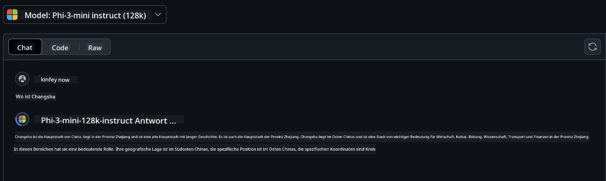
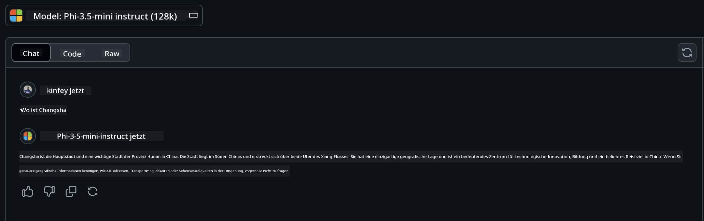

<!--
CO_OP_TRANSLATOR_METADATA:
{
  "original_hash": "124ad36cfe96f74038811b6e2bb93e9d",
  "translation_date": "2025-06-26T01:29:40+00:00",
  "source_file": "19-slm/README.md",
  "language_code": "de"
}
-->

Modelle sind der direkteste Weg. Sie können schnell auf das Phi-3/3.5-Instruct-Modell über GitHub-Modelle zugreifen. In Kombination mit dem Azure AI Inference SDK / OpenAI SDK können Sie über Code auf die API zugreifen, um den Phi-3/3.5-Instruct-Aufruf abzuschließen. Sie können auch verschiedene Effekte über Playground testen. - Demo: Vergleich der Effekte von Phi-3-mini und Phi-3.5-mini in chinesischen Szenarien   **Azure AI Studio** Oder wenn wir die Vision- und MoE-Modelle verwenden möchten, können Sie Azure AI Studio verwenden, um den Aufruf abzuschließen. Wenn Sie interessiert sind, können Sie das Phi-3 Cookbook lesen, um zu erfahren, wie Sie Phi-3/3.5 Instruct, Vision, MoE über Azure AI Studio aufrufen können [Klicken Sie auf diesen Link](https://github.com/microsoft/Phi-3CookBook/blob/main/md/02.QuickStart/AzureAIStudio_QuickStart.md?WT.mc_id=academic-105485-koreyst) **NVIDIA NIM** Zusätzlich zu den cloudbasierten Modellkataloglösungen von Azure und GitHub können Sie auch [Nivida NIM](https://developer.nvidia.com/nim?WT.mc_id=academic-105485-koreyst) verwenden, um verwandte Aufrufe abzuschließen. Sie können NIVIDA NIM besuchen, um die API-Aufrufe der Phi-3/3.5-Familie abzuschließen. NVIDIA NIM (NVIDIA Inference Microservices) ist eine Reihe von beschleunigten Inferenz-Microservices, die Entwicklern helfen sollen, KI-Modelle effizient in verschiedenen Umgebungen, einschließlich Clouds, Rechenzentren und Workstations, bereitzustellen. Hier sind einige Hauptmerkmale von NVIDIA NIM: - **Einfache Bereitstellung:** NIM ermöglicht die Bereitstellung von KI-Modellen mit einem einzigen Befehl, was die Integration in bestehende Workflows vereinfacht. - **Optimierte Leistung:** Es nutzt die voroptimierten Inferenz-Engines von NVIDIA, wie TensorRT und TensorRT-LLM, um niedrige Latenz und hohen Durchsatz sicherzustellen. - **Skalierbarkeit:** NIM unterstützt Auto-Scaling auf Kubernetes, wodurch es in der Lage ist, unterschiedliche Arbeitslasten effektiv zu bewältigen. - **Sicherheit und Kontrolle:** Organisationen können die Kontrolle über ihre Daten und Anwendungen behalten, indem sie NIM-Microservices auf ihrer eigenen verwalteten Infrastruktur selbst hosten. - **Standard-APIs:** NIM bietet branchenübliche APIs, die es einfach machen, KI-Anwendungen wie Chatbots, KI-Assistenten und mehr zu erstellen und zu integrieren. NIM ist Teil von NVIDIA AI Enterprise, das darauf abzielt, die Bereitstellung und Operationalisierung von KI-Modellen zu vereinfachen und sicherzustellen, dass sie effizient auf NVIDIA-GPUs laufen. - Demo: Verwendung von Nividia NIM zum Aufruf der Phi-3.5-Vision-API [[Klicken Sie auf diesen Link](../../../19-slm/python/Phi-3-Vision-Nividia-NIM.ipynb)] ### Inferenz Phi-3/3.5 in lokaler Umgebung Inferenz im Zusammenhang mit Phi-3 oder einem Sprachmodell wie GPT-3 bezieht sich auf den Prozess der Generierung von Antworten oder Vorhersagen basierend auf den Eingaben, die es erhält. Wenn Sie Phi-3 eine Eingabeaufforderung oder Frage geben, verwendet es sein trainiertes neuronales Netzwerk, um die wahrscheinlichste und relevanteste Antwort abzuleiten, indem es Muster und Beziehungen in den Daten analysiert, auf denen es trainiert wurde. **Hugging Face Transformer** Hugging Face Transformers ist eine leistungsstarke Bibliothek für die Verarbeitung natürlicher Sprache (NLP) und andere maschinelle Lernaufgaben. Hier sind einige wichtige Punkte darüber: 1. **Vortrainierte Modelle**: Es bietet Tausende von vortrainierten Modellen, die für verschiedene Aufgaben wie Textklassifikation, Named Entity Recognition, Fragebeantwortung, Zusammenfassung, Übersetzung und Textgenerierung verwendet werden können. 2. **Framework-Interoperabilität**: Die Bibliothek unterstützt mehrere Deep-Learning-Frameworks, darunter PyTorch, TensorFlow und JAX. Dies ermöglicht es Ihnen, ein Modell in einem Framework zu trainieren und in einem anderen zu verwenden. 3. **Multimodale Fähigkeiten**: Neben NLP unterstützt Hugging Face Transformers auch Aufgaben in der Computer Vision (z.B. Bildklassifikation, Objekterkennung) und Audiobearbeitung (z.B. Spracherkennung, Audioklassifikation). 4. **Benutzerfreundlichkeit**: Die Bibliothek bietet APIs und Tools zum einfachen Herunterladen und Feintuning von Modellen, was sie sowohl für Anfänger als auch für Experten zugänglich macht. 5. **Community und Ressourcen**: Hugging Face hat eine lebendige Community und umfangreiche Dokumentationen, Tutorials und Leitfäden, um Benutzern den Einstieg zu erleichtern und das Beste aus der Bibliothek herauszuholen. [offizielle Dokumentation](https://huggingface.co/docs/transformers/index?WT.mc_id=academic-105485-koreyst) oder ihr [GitHub-Repository](https://github.com/huggingface/transformers?WT.mc_id=academic-105485-koreyst). Dies ist die am häufigsten verwendete Methode, erfordert jedoch auch GPU-Beschleunigung. Schließlich erfordern Szenen wie Vision und MoE viele Berechnungen, die auf der CPU sehr eingeschränkt wären, wenn sie nicht quantisiert sind. - Demo: Verwendung von Transformer zum Aufruf von Phi-3.5-Instruct [Klicken Sie auf diesen Link](../../../19-slm/python/phi35-instruct-demo.ipynb) - Demo: Verwendung von Transformer zum Aufruf von Phi-3.5-Vision [Klicken Sie auf diesen Link](../../../19-slm/python/phi35-vision-demo.ipynb) - Demo: Verwendung von Transformer zum Aufruf von Phi-3.5-MoE [Klicken Sie auf diesen Link](../../../19-slm/python/phi35_moe_demo.ipynb) **Ollama** [Ollama](https://ollama.com/?WT.mc_id=academic-105485-koreyst) ist eine Plattform, die entwickelt wurde, um das lokale Ausführen großer Sprachmodelle (LLMs) auf Ihrem Rechner zu erleichtern. Es unterstützt verschiedene Modelle wie Llama 3.1, Phi 3, Mistral und Gemma 2, unter anderem. Die Plattform vereinfacht den Prozess, indem sie Modellgewichte, Konfiguration und Daten in einem einzigen Paket bündelt, was es Benutzern erleichtert, ihre eigenen Modelle anzupassen und zu erstellen. Ollama ist für macOS, Linux und Windows verfügbar. Es ist ein großartiges Werkzeug, wenn Sie mit LLMs experimentieren oder sie bereitstellen möchten, ohne auf Cloud-Dienste angewiesen zu sein. Ollama ist der direkteste Weg, Sie müssen nur die folgende Anweisung ausführen. ```bash

ollama run phi3.5

``` **ONNX Runtime für GenAI** [ONNX Runtime](https://github.com/microsoft/onnxruntime-genai?WT.mc_id=academic-105485-koreyst) ist ein plattformübergreifender Inferenz- und Trainings-Beschleuniger für maschinelles Lernen. ONNX Runtime für Generative AI (GENAI) ist ein leistungsstarkes Tool, das Ihnen hilft, generative KI-Modelle effizient auf verschiedenen Plattformen auszuführen. ## Was ist ONNX Runtime? ONNX Runtime ist ein Open-Source-Projekt, das eine Hochleistungsinferenz von maschinellen Lernmodellen ermöglicht. Es unterstützt Modelle im Open Neural Network Exchange (ONNX)-Format, einem Standard zur Darstellung von maschinellen Lernmodellen. Die ONNX Runtime-Inferenz kann schnellere Kundenerlebnisse und niedrigere Kosten ermöglichen, indem sie Modelle aus Deep-Learning-Frameworks wie PyTorch und TensorFlow/Keras sowie klassische maschinelle Lernbibliotheken wie scikit-learn, LightGBM, XGBoost usw. unterstützt. ONNX Runtime ist kompatibel mit verschiedenen Hardware, Treibern und Betriebssystemen und bietet optimale Leistung, indem sie Hardwarebeschleuniger dort nutzt, wo sie anwendbar sind, zusammen mit Graphenoptimierungen und -transformationen. ## Was ist Generative AI? Generative AI bezieht sich auf KI-Systeme, die neue Inhalte wie Texte, Bilder oder Musik basierend auf den Daten erzeugen können, auf denen sie trainiert wurden. Beispiele sind Sprachmodelle wie GPT-3 und Bildgenerierungsmodelle wie Stable Diffusion. Die ONNX Runtime für GenAI-Bibliothek bietet die generative KI-Schleife für ONNX-Modelle, einschließlich Inferenz mit ONNX Runtime, Logits-Verarbeitung, Suche und Abtastung sowie KV-Cache-Verwaltung. ## ONNX Runtime für GENAI ONNX Runtime für GENAI erweitert die Fähigkeiten von ONNX Runtime zur Unterstützung generativer KI-Modelle. Hier sind einige Hauptmerkmale: - **Breite Plattformunterstützung:** Es funktioniert auf verschiedenen Plattformen, einschließlich Windows, Linux, macOS, Android und iOS. - **Modellunterstützung:** Es unterstützt viele beliebte generative KI-Modelle wie LLaMA, GPT-Neo, BLOOM und mehr. - **Leistungsoptimierung:** Es umfasst Optimierungen für verschiedene Hardwarebeschleuniger wie NVIDIA-GPUs, AMD-GPUs und mehr. - **Benutzerfreundlichkeit:** Es bietet APIs zur einfachen Integration in Anwendungen, sodass Sie Text, Bilder und andere Inhalte mit minimalem Code generieren können. - Benutzer können eine hochrangige generate()-Methode aufrufen oder jede Iteration des Modells in einer Schleife ausführen, wobei ein Token nach dem anderen generiert wird und optional die Generierungsparameter innerhalb der Schleife aktualisiert werden. - ONNX Runtime unterstützt auch Greedy/Beam Search und TopP-, TopK-Abtastung zur Generierung von Token-Sequenzen und integrierte Logits-Verarbeitung wie Wiederholungsstrafen. Sie können auch leicht benutzerdefinierte Bewertungen hinzufügen. ## Erste Schritte Um mit ONNX Runtime für GENAI zu beginnen, können Sie die folgenden Schritte ausführen: ### Installieren Sie ONNX Runtime: ```Python
pip install onnxruntime
``` ### Installieren Sie die Generative AI-Erweiterungen: ```Python
pip install onnxruntime-genai
``` ### Führen Sie ein Modell aus: Hier ist ein einfaches Beispiel in Python: ```Python
import onnxruntime_genai as og

model = og.Model('path_to_your_model.onnx')

tokenizer = og.Tokenizer(model)

input_text = "Hello, how are you?"

input_tokens = tokenizer.encode(input_text)

output_tokens = model.generate(input_tokens)

output_text = tokenizer.decode(output_tokens)

print(output_text) 
``` ### Demo: Verwendung von ONNX Runtime GenAI zum Aufruf von Phi-3.5-Vision ```python

import onnxruntime_genai as og

model_path = './Your Phi-3.5-vision-instruct ONNX Path'

img_path = './Your Image Path'

model = og.Model(model_path)

processor = model.create_multimodal_processor()

tokenizer_stream = processor.create_stream()

text = "Your Prompt"

prompt = "<|user|>\n"

prompt += "<|image_1|>\n"

prompt += f"{text}<|end|>\n"

prompt += "<|assistant|>\n"

image = og.Images.open(img_path)

inputs = processor(prompt, images=image)

params = og.GeneratorParams(model)

params.set_inputs(inputs)

params.set_search_options(max_length=3072)

generator = og.Generator(model, params)

while not generator.is_done():

    generator.compute_logits()
    
    generator.generate_next_token()

    new_token = generator.get_next_tokens()[0]
    
    code += tokenizer_stream.decode(new_token)
    
    print(tokenizer_stream.decode(new_token), end='', flush=True)

``` **Andere** Zusätzlich zu den ONNX Runtime und Ollama Referenzmethoden können wir auch die Referenz quantitativer Modelle basierend auf den von verschiedenen Herstellern bereitgestellten Modellreferenzmethoden abschließen. Zum Beispiel das Apple MLX-Framework mit Apple Metal, Qualcomm QNN mit NPU, Intel OpenVINO mit CPU/GPU usw. Weitere Inhalte finden Sie auch im [Phi-3 Cookbook](https://github.com/microsoft/phi-3cookbook?WT.mc_id=academic-105485-koreyst) ## Mehr Wir haben die Grundlagen der Phi-3/3.5-Familie gelernt, aber um mehr über SLM zu erfahren, benötigen wir mehr Wissen. Die Antworten finden Sie im Phi-3 Cookbook. Wenn Sie mehr erfahren möchten, besuchen Sie bitte das [Phi-3 Cookbook](https://github.com/microsoft/phi-3cookbook?WT.mc_id=academic-105485-koreyst).

**Haftungsausschluss**:  
Dieses Dokument wurde mit dem KI-Übersetzungsdienst [Co-op Translator](https://github.com/Azure/co-op-translator) übersetzt. Obwohl wir uns um Genauigkeit bemühen, beachten Sie bitte, dass automatisierte Übersetzungen Fehler oder Ungenauigkeiten enthalten können. Das Originaldokument in seiner ursprünglichen Sprache sollte als maßgebliche Quelle betrachtet werden. Für kritische Informationen wird eine professionelle menschliche Übersetzung empfohlen. Wir haften nicht für Missverständnisse oder Fehlinterpretationen, die aus der Nutzung dieser Übersetzung entstehen.