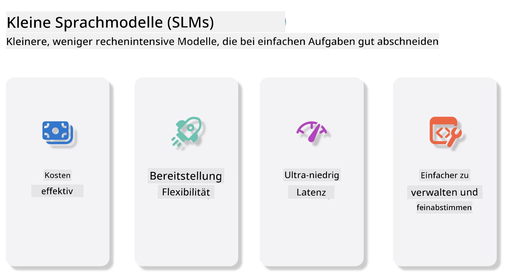
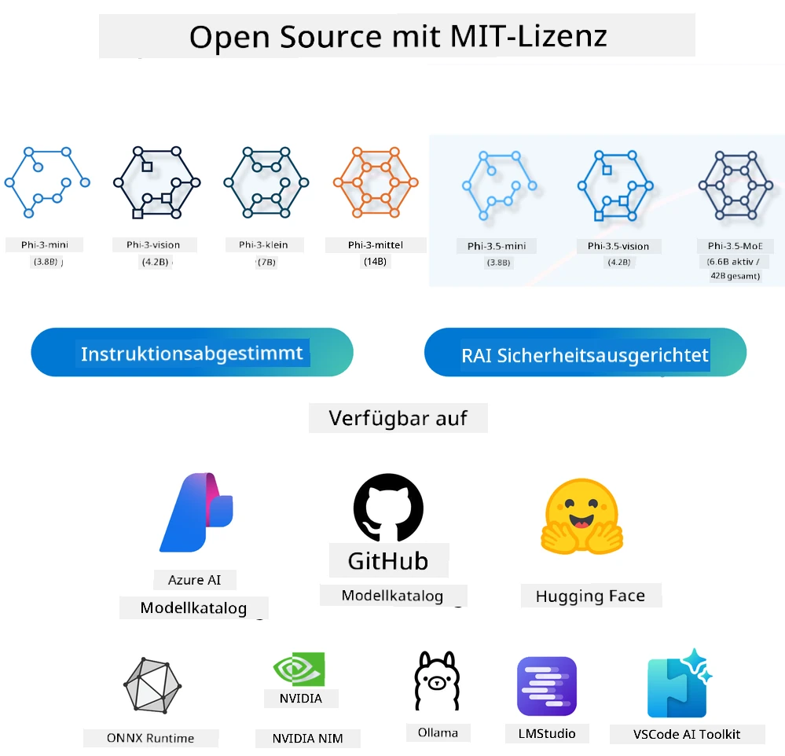
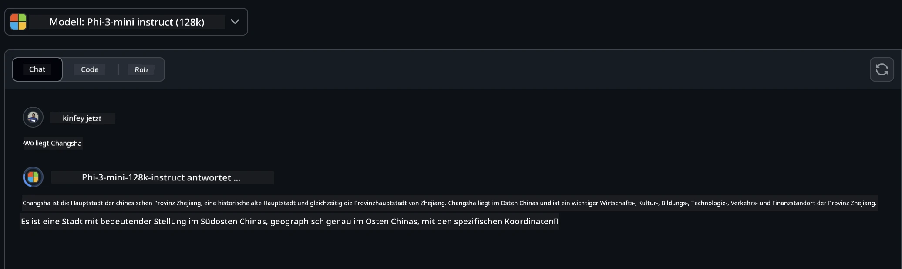
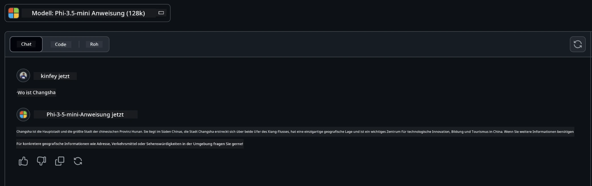

# Einführung in kleine Sprachmodelle für generative KI für Anfänger
Generative KI ist ein faszinierendes Feld der künstlichen Intelligenz, das sich darauf konzentriert, Systeme zu schaffen, die in der Lage sind, neue Inhalte zu generieren. Diese Inhalte können von Text und Bildern bis hin zu Musik und sogar ganzen virtuellen Umgebungen reichen. Eine der spannendsten Anwendungen generativer KI liegt im Bereich der Sprachmodelle.

## Was sind kleine Sprachmodelle?

Ein kleines Sprachmodell (SLM) stellt eine verkleinerte Variante eines großen Sprachmodells (LLM) dar, die viele der architektonischen Prinzipien und Techniken von LLMs nutzt, dabei jedoch einen deutlich reduzierten Rechenaufwand aufweist.

SLMs sind eine Untergruppe von Sprachmodellen, die darauf ausgelegt sind, menschenähnlichen Text zu generieren. Im Gegensatz zu ihren größeren Pendants wie GPT-4 sind SLMs kompakter und effizienter, was sie ideal für Anwendungen macht, bei denen Rechenressourcen begrenzt sind. Trotz ihrer kleineren Größe können sie eine Vielzahl von Aufgaben erfüllen. Typischerweise werden SLMs durch Komprimierung oder Destillation von LLMs konstruiert, mit dem Ziel, einen erheblichen Teil der Funktionalität und sprachlichen Fähigkeiten des Originalmodells zu erhalten. Diese Reduzierung der Modellgröße verringert die Komplexität insgesamt und macht SLMs sowohl speicher- als auch rechenintensiv effizienter. Trotz dieser Optimierungen können SLMs immer noch eine breite Palette von Aufgaben der natürlichen Sprachverarbeitung (NLP) ausführen:

- Textgenerierung: Erstellen kohärenter und kontextuell relevanter Sätze oder Absätze.
- Textvervollständigung: Vorhersage und Vervollständigung von Sätzen basierend auf einem gegebenen Prompt.
- Übersetzung: Umwandlung von Text von einer Sprache in eine andere.
- Zusammenfassung: Verdichtung langer Textabschnitte zu kürzeren, besser verdaulichen Zusammenfassungen.

All dies mit gewissen Kompromissen bei der Leistung oder Tiefe des Verständnisses im Vergleich zu ihren größeren Gegenstücken.

## Wie funktionieren kleine Sprachmodelle?
SLMs werden auf enorm großen Mengen an Textdaten trainiert. Während des Trainings lernen sie die Muster und Strukturen der Sprache, was es ihnen ermöglicht, Texte zu generieren, die sowohl grammatikalisch korrekt als auch kontextuell angemessen sind. Der Trainingsprozess umfasst:

- Datensammlung: Sammeln großer Datensätze von Texten aus verschiedenen Quellen.
- Vorverarbeitung: Bereinigen und Organisieren der Daten, um sie für das Training geeignet zu machen.
- Training: Einsatz von maschinellen Lernalgorithmen, um dem Modell das Verstehen und Generieren von Text beizubringen.
- Feinabstimmung: Anpassung des Modells zur Verbesserung der Leistung bei spezifischen Aufgaben.

Die Entwicklung von SLMs entspricht dem wachsenden Bedarf an Modellen, die in ressourcenbeschränkten Umgebungen eingesetzt werden können, wie z.B. Mobilgeräten oder Edge-Computing-Plattformen, wo groß angelegte LLMs aufgrund ihres hohen Ressourcenverbrauchs unpraktisch sind. Durch den Fokus auf Effizienz balancieren SLMs Leistung und Zugänglichkeit aus, was eine breitere Anwendung in verschiedenen Bereichen ermöglicht.



## Lernziele

In dieser Lektion möchten wir das Wissen über SLMs vermitteln und es mit Microsoft Phi-3 kombinieren, um verschiedene Szenarien im Textinhalt, in der Vision und im MoE zu erlernen.

Am Ende dieser Lektion sollten Sie in der Lage sein, folgende Fragen zu beantworten:

- Was ist ein SLM?
- Was ist der Unterschied zwischen SLM und LLM?
- Was ist die Microsoft Phi-3/3.5 Familie?
- Wie führt man Inferenz mit der Microsoft Phi-3/3.5 Familie durch?

Bereit? Los geht’s.

## Die Unterschiede zwischen großen Sprachmodellen (LLMs) und kleinen Sprachmodellen (SLMs)

Sowohl LLMs als auch SLMs basieren auf grundlegenden Prinzipien des probabilistischen maschinellen Lernens und folgen ähnlichen Ansätzen in ihrer architektonischen Gestaltung, Trainingsmethoden, Datenentstehungsprozessen und Modellauswertungstechniken. Dennoch unterscheiden sie sich in mehreren wesentlichen Aspekten.

## Anwendungsbereiche kleiner Sprachmodelle

SLMs haben ein breites Spektrum an Anwendungen, darunter:

- Chatbots: Bereitstellung von Kundensupport und Interaktion mit Nutzern in dialogischer Form.
- Inhaltserstellung: Unterstützung von Autoren durch Ideengenerierung oder sogar das Verfassen ganzer Artikel.
- Bildung: Hilfe für Schüler bei Schreibaufgaben oder beim Erlernen neuer Sprachen.
- Barrierefreiheit: Schaffung von Werkzeugen für Menschen mit Behinderungen, wie z.B. Text-to-Speech-Systeme.

**Größe**

Ein Hauptunterschied zwischen LLMs und SLMs liegt im Umfang der Modelle. LLMs, wie ChatGPT (GPT-4), können schätzungsweise 1,76 Billionen Parameter umfassen, während Open-Source-SLMs wie Mistral 7B mit deutlich weniger Parametern – etwa 7 Milliarden – konzipiert sind. Diese Diskrepanz beruht hauptsächlich auf Unterschieden in Architektur und Trainingsprozessen. Zum Beispiel nutzt ChatGPT einen Selbst-Attentionsmechanismus innerhalb eines Encoder-Decoder-Rahmens, während Mistral 7B Sliding-Window-Attention verwendet, was ein effizienteres Training in einem reinen Decoder-Modell ermöglicht. Diese architektonische Variation hat tiefgreifende Auswirkungen auf Komplexität und Leistung der Modelle.

**Verständnis**

SLMs sind typischerweise auf Leistungsoptimierung in spezifischen Domänen ausgerichtet, was sie hoch spezialisiert, aber potenziell eingeschränkt in ihrer Fähigkeit macht, breites kontextuelles Verständnis über mehrere Wissensgebiete hinweg bereitzustellen. LLMs hingegen zielen darauf ab, menschliche Intelligenz auf umfassenderem Niveau zu simulieren. Durch das Training an umfangreichen, vielfältigen Datensätzen sind LLMs darauf ausgelegt, in verschiedensten Domänen gute Leistungen zu erbringen und bieten daher größere Vielseitigkeit und Anpassungsfähigkeit. Folglich sind LLMs besser geeignet für ein breiteres Spektrum von Aufgaben, wie z.B. natürliche Sprachverarbeitung und Programmierung.

**Rechenleistung**

Das Training und der Einsatz von LLMs sind ressourcenintensive Prozesse, die oft umfassende Recheninfrastrukturen erfordern, einschließlich großer GPU-Cluster. Beispielsweise kann das Training eines Modells wie ChatGPT von Grund auf tausende GPUs über lange Zeiträume benötigen. Im Gegensatz dazu sind SLMs mit ihrer geringeren Anzahl an Parametern hinsichtlich Rechenressourcen zugänglicher. Modelle wie Mistral 7B können auf lokalen Maschinen mit moderater GPU-Leistung trainiert und betrieben werden, obwohl das Training trotzdem mehrere Stunden auf mehreren GPUs in Anspruch nimmt.

**Bias**

Bias ist ein bekanntes Problem bei LLMs, hauptsächlich aufgrund der Art der Trainingsdaten. Diese Modelle greifen oft auf Rohdaten aus dem Internet zurück, die bestimmte Gruppen unterrepräsentieren oder falsch darstellen können, fehlerhafte Label enthalten oder sprachliche Verzerrungen widerspiegeln, die durch Dialekte, geografische Unterschiede und Grammatikregeln bedingt sind. Zudem kann die Komplexität der LLM-Architekturen unbeabsichtigt Bias verstärken, was ohne sorgfältige Feinabstimmung unbemerkt bleiben kann. Hingegen sind SLMs, die auf stärker eingeschränkten, domänenspezifischen Datensätzen trainiert werden, grundsätzlich weniger anfällig für solche Verzerrungen, wenngleich sie nicht völlig frei davon sind.

**Inference**

Die reduzierte Größe von SLMs verschafft ihnen einen erheblichen Vorteil bezüglich Inferenzgeschwindigkeit, da sie Ausgaben effizient auf lokaler Hardware generieren können, ohne umfangreiche parallele Verarbeitung zu benötigen. LLMs hingegen erfordern aufgrund ihrer Größe und Komplexität häufig beträchtliche parallele Rechenressourcen, um akzeptable Inferenzzeiten zu erreichen. Die Anzahl gleichzeitiger Nutzer verlängert die Antwortzeiten bei LLMs insbesondere bei großskaliger Bereitstellung zusätzlich.

Zusammenfassend lässt sich sagen, dass LLMs und SLMs zwar auf einem gemeinsamen maschinellen Lernfundament beruhen, sich jedoch deutlich unterscheiden hinsichtlich Modellgröße, Ressourcenanforderungen, kontextuellem Verständnis, Anfälligkeit für Bias und Inferenzgeschwindigkeit. Diese Unterschiede spiegeln ihre jeweilige Eignung für verschiedene Anwendungsfälle wider: LLMs sind vielseitiger, jedoch ressourcenintensiv, während SLMs auf domänenspezifische Effizienz mit reduziertem Ressourcenverbrauch setzen.

***Hinweis: In dieser Lektion werden wir SLM anhand von Microsoft Phi-3 / 3.5 als Beispiel vorstellen.***

## Einführung in die Phi-3 / Phi-3.5 Familie

Die Phi-3 / 3.5 Familie zielt hauptsächlich auf Text-, Bild- und Agentenanwendungsfälle (MoE) ab:

### Phi-3 / 3.5 Instruct

Vor allem für Textgenerierung, Chatvervollständigung und Informationsentnahme aus Inhalten.

**Phi-3-mini**

Das 3,8B Sprachmodell ist auf Microsoft Azure AI Studio, Hugging Face und Ollama verfügbar. Phi-3 Modelle übertreffen Sprachmodelle gleicher und größerer Größe erheblich in wichtigen Benchmarks (siehe Benchmark-Zahlen unten, höhere Zahlen sind besser). Phi-3-mini übertrifft Modelle mit der doppelten Größe, während Phi-3-small und Phi-3-medium größere Modelle, einschließlich GPT-3.5, übertreffen.

**Phi-3-small & medium**

Mit nur 7 Milliarden Parametern schlägt Phi-3-small GPT-3.5T bei einer Vielzahl von Sprach-, Denk-, Programmier- und Mathematikbenchmarks.

Phi-3-medium mit 14 Milliarden Parametern setzt diesen Trend fort und übertrifft das Gemini 1.0 Pro.

**Phi-3.5-mini**

Man kann es als Upgrade von Phi-3-mini betrachten. Die Parameter bleiben unverändert, aber es verbessert die Unterstützung mehrerer Sprachen (unterstützt 20+ Sprachen: Arabisch, Chinesisch, Tschechisch, Dänisch, Niederländisch, Englisch, Finnisch, Französisch, Deutsch, Hebräisch, Ungarisch, Italienisch, Japanisch, Koreanisch, Norwegisch, Polnisch, Portugiesisch, Russisch, Spanisch, Schwedisch, Thai, Türkisch, Ukrainisch) und bietet stärkere Unterstützung für langen Kontext.

Phi-3.5-mini mit 3,8 Milliarden Parametern übertrifft Sprachmodelle gleicher Größe und ist auf Augenhöhe mit Modellen, die doppelt so groß sind.

### Phi-3 / 3.5 Vision

Man kann das Instruct-Modell von Phi-3/3.5 als Phis Fähigkeit zum Verstehen betrachten, und Vision verleiht Phi Augen, um die Welt zu verstehen.

**Phi-3-Vision**

Phi-3-Vision mit nur 4,2 Milliarden Parametern setzt diesen Trend fort und übertrifft größere Modelle wie Claude-3 Haiku und Gemini 1.0 Pro V bei allgemeinen visuellen Denkaufgaben, OCR sowie bei Tabellen- und Diagrammverständnis.

**Phi-3.5-Vision**

Phi-3.5-Vision ist ebenfalls ein Upgrade von Phi-3-Vision, das Unterstützung für mehrere Bilder hinzufügt. Man kann es als Verbesserung im Bereich Vision verstehen: Es kann nicht nur Bilder, sondern auch Videos sehen.

Phi-3.5-Vision übertrifft größere Modelle wie Claude-3.5 Sonnet und Gemini 1.5 Flash bei OCR-, Tabellen- und Diagrammunterstützungsaufgaben und ist gleichauf bei allgemeinen Aufgaben zum visuellen Wissen und Denken. Es unterstützt Multi-Frame Input, d.h. es kann auf mehreren Eingabebildern Schlussfolgerungen ziehen.

### Phi-3.5-MoE

***Mixture of Experts (MoE)*** ermöglicht es Modellen, mit deutlich weniger Rechenaufwand vortrainiert zu werden, was bedeutet, dass man die Modell- oder Datensatzgröße mit dem gleichen Rechenbudget wie bei einem dichten Modell dramatisch erhöhen kann. Insbesondere sollte ein MoE-Modell dieselbe Qualität wie sein dichtes Gegenstück wesentlich schneller während des Pretrainings erreichen.

Phi-3.5-MoE besteht aus 16x3,8B Expertenmodulen. Phi-3.5-MoE mit nur 6,6 Milliarden aktiven Parametern erreicht ein ähnliches Niveau an Denken, Sprachverständnis und Mathematik wie deutlich größere Modelle.

Wir können die Phi-3/3.5 Familienmodelle basierend auf unterschiedlichen Szenarien nutzen. Anders als LLMs können Sie Phi-3/3.5-mini oder Phi-3/3.5-Vision auf Edge-Geräten bereitstellen.

## Wie man Phi-3/3.5 Familienmodelle verwendet

Wir möchten Phi-3/3.5 in verschiedenen Szenarien nutzen. Im Folgenden zeigen wir, wie man Phi-3/3.5 je nach Szenario verwendet.



### Inferenz über Cloud-APIs

**GitHub Models**

GitHub Models ist der direkteste Weg. Sie können schnell auf das Phi-3/3.5-Instruct-Modell über GitHub Models zugreifen. In Kombination mit dem Azure AI Inference SDK / OpenAI SDK können Sie den API-Zugriff über Code realisieren, um den Phi-3/3.5-Instruct-Call durchzuführen. Sie können durch Playground auch verschiedene Effekte testen.

- Demo: Vergleich der Effekte von Phi-3-mini und Phi-3.5-mini in chinesischen Szenarien





**Azure AI Studio**

Wenn Sie die Vision- und MoE-Modelle nutzen möchten, können Sie Azure AI Studio für den Call verwenden. Wenn Sie interessiert sind, können Sie das Phi-3 Cookbook lesen, um zu erfahren, wie man Phi-3/3.5 Instruct, Vision und MoE über Azure AI Studio aufruft [Klicken Sie hier](https://github.com/microsoft/Phi-3CookBook/blob/main/md/02.QuickStart/AzureAIStudio_QuickStart.md?WT.mc_id=academic-105485-koreyst)

**NVIDIA NIM**

Zusätzlich zu den cloudbasierten Model-Katalog-Lösungen von Azure und GitHub können Sie auch [NVIDIA NIM](https://developer.nvidia.com/nim?WT.mc_id=academic-105485-koreyst) verwenden, um die entsprechenden Aufrufe durchzuführen. Sie können NVIDIA NIM besuchen, um API-Aufrufe der Phi-3/3.5 Familie auszuführen. NVIDIA NIM (NVIDIA Inference Microservices) ist eine Reihe beschleunigter Inferenz-Mikroservices, die Entwicklern helfen, KI-Modelle effizient in verschiedenen Umgebungen, einschließlich Clouds, Rechenzentren und Arbeitsstationen, bereitzustellen.

Hier sind einige Hauptmerkmale von NVIDIA NIM:
- **Einfache Bereitstellung:** NIM ermöglicht die Bereitstellung von KI-Modellen mit nur einem Befehl, wodurch die Integration in bestehende Workflows unkompliziert wird.  
- **Optimierte Leistung:** Es nutzt die voroptimierten Inferenz-Engines von NVIDIA, wie TensorRT und TensorRT-LLM, um niedrige Latenzzeiten und hohe Durchsatzraten zu gewährleisten.  
- **Skalierbarkeit:** NIM unterstützt Autoscaling auf Kubernetes, sodass es unterschiedliche Arbeitslasten effektiv bewältigen kann.  
- **Sicherheit und Kontrolle:** Organisationen können die Kontrolle über ihre Daten und Anwendungen behalten, indem sie die NIM-Mikroservices auf ihrer eigenen verwalteten Infrastruktur selbst hosten.  
- **Standardisierte APIs:** NIM stellt branchentypische APIs bereit, was den Aufbau und die Integration von KI-Anwendungen wie Chatbots, KI-Assistenten und mehr erleichtert.  

NIM ist Teil von NVIDIA AI Enterprise, das darauf abzielt, die Bereitstellung und Operationalisierung von KI-Modellen zu vereinfachen und deren effizienten Betrieb auf NVIDIA-GPUs sicherzustellen.  

- Demo: Verwendung von NVIDIA NIM zum Aufrufen der Phi-3.5-Vision-API  [[Klicken Sie auf diesen Link](./python/Phi-3-Vision-Nividia-NIM.ipynb?WT.mc_id=academic-105485-koreyst)]  


### Phi-3/3.5 lokal ausführen  
Inference im Zusammenhang mit Phi-3 oder einem beliebigen Sprachmodell wie GPT-3 bezieht sich auf den Prozess der Erzeugung von Antworten oder Vorhersagen basierend auf den Eingaben, die es erhält. Wenn Sie Phi-3 eine Eingabeaufforderung oder Frage geben, verwendet es sein trainiertes neuronales Netzwerk, um durch Analyse von Mustern und Beziehungen in den Trainingsdaten die wahrscheinlichste und relevanteste Antwort zu erstellen.  

**Hugging Face Transformer**  
Hugging Face Transformers ist eine leistungsfähige Bibliothek, die für die natürliche Sprachverarbeitung (NLP) und andere maschinelle Lernaufgaben entwickelt wurde. Hier einige wichtige Punkte dazu:  

1. **Vorgefertigte Modelle:** Sie stellt Tausende vortrainierte Modelle bereit, die für verschiedene Aufgaben wie Textklassifikation, Benannte-Entitäten-Erkennung, Fragebeantwortung, Zusammenfassung, Übersetzung und Textgenerierung verwendet werden können.  

2. **Framework-Interoperabilität:** Die Bibliothek unterstützt mehrere Deep-Learning-Frameworks, darunter PyTorch, TensorFlow und JAX. So können Sie ein Modell in einem Framework trainieren und in einem anderen verwenden.  

3. **Multimodale Fähigkeiten:** Neben NLP unterstützt Hugging Face Transformers auch Aufgaben in der Computer Vision (z. B. Bildklassifikation, Objekterkennung) und Audioverarbeitung (z. B. Spracherkennung, Audioklassifikation).  

4. **Benutzerfreundlichkeit:** Die Bibliothek bietet APIs und Werkzeuge zum einfachen Herunterladen und Feinabstimmen von Modellen, wodurch sie für Anfänger und Experten gleichermaßen zugänglich ist.  

5. **Community und Ressourcen:** Hugging Face hat eine lebendige Community und umfangreiche Dokumentation, Tutorials und Anleitungen, die Benutzern helfen, schnell einzusteigen und die Bibliothek effektiv zu nutzen.  
[offizielle Dokumentation](https://huggingface.co/docs/transformers/index?WT.mc_id=academic-105485-koreyst) oder deren [GitHub-Repository](https://github.com/huggingface/transformers?WT.mc_id=academic-105485-koreyst).  

Dies ist die am häufigsten genutzte Methode, aber sie benötigt auch GPU-Beschleunigung. Szenarien wie Vision und MoE erfordern viele Berechnungen, was auf der CPU sehr langsam wäre, sofern nicht quantisiert wird.  


- Demo: Verwendung von Transformer zum Aufrufen von Phi-3.5-Instruct [Klicken Sie auf diesen Link](./python/phi35-instruct-demo.ipynb?WT.mc_id=academic-105485-koreyst)  

- Demo: Verwendung von Transformer zum Aufrufen von Phi-3.5-Vision [Klicken Sie auf diesen Link](./python/phi35-vision-demo.ipynb?WT.mc_id=academic-105485-koreyst)  

- Demo: Verwendung von Transformer zum Aufrufen von Phi-3.5-MoE [Klicken Sie auf diesen Link](./python/phi35_moe_demo.ipynb?WT.mc_id=academic-105485-koreyst)  

**Ollama**  
[Ollama](https://ollama.com/?WT.mc_id=academic-105485-koreyst) ist eine Plattform, die es erleichtert, große Sprachmodelle (LLMs) lokal auf Ihrem Gerät auszuführen. Sie unterstützt verschiedene Modelle wie Llama 3.1, Phi 3, Mistral und Gemma 2, unter anderen. Die Plattform vereinfacht den Prozess, indem sie Modellgewichte, Konfiguration und Daten in einem Paket bündelt, sodass Nutzer leichter eigene Modelle anpassen und erstellen können. Ollama ist für macOS, Linux und Windows verfügbar. Es ist ein großartiges Werkzeug, wenn Sie LLMs ausprobieren oder bereitstellen möchten, ohne auf Cloud-Dienste angewiesen zu sein. Ollama ist der direkteste Weg, Sie müssen nur den folgenden Befehl ausführen.  

```bash

ollama run phi3.5

```
  

**ONNX Runtime für GenAI**  

[ONNX Runtime](https://github.com/microsoft/onnxruntime-genai?WT.mc_id=academic-105485-koreyst) ist ein plattformübergreifender Beschleuniger für Inferenz und Training von maschinellen Lernmodellen. ONNX Runtime für Generative AI (GENAI) ist ein leistungsfähiges Tool, das Ihnen hilft, generative KI-Modelle effizient auf verschiedenen Plattformen auszuführen.  

## Was ist ONNX Runtime?  
ONNX Runtime ist ein Open-Source-Projekt, das Hochleistungs-Inferenz von maschinellen Lernmodellen ermöglicht. Es unterstützt Modelle im Open Neural Network Exchange (ONNX)-Format, einem Standard zur Darstellung von ML-Modellen. ONNX Runtime-Inferenz kann schnellere Kundenerlebnisse ermöglichen und Kosten senken, indem es Modelle aus Deep-Learning-Frameworks wie PyTorch und TensorFlow/Keras ebenso unterstützt wie klassische ML-Bibliotheken wie scikit-learn, LightGBM, XGBoost usw. ONNX Runtime ist kompatibel mit verschiedenen Hardwareplattformen, Treibern und Betriebssystemen und bietet optimale Leistung durch Nutzung von Hardwarebeschleunigern sowie Graph-Optimierungen und Transformationen.  

## Was ist Generative AI?  
Generative AI bezieht sich auf KI-Systeme, die neue Inhalte wie Text, Bilder oder Musik erzeugen können, basierend auf den Daten, mit denen sie trainiert wurden. Beispiele sind Sprachmodelle wie GPT-3 und Bildgenerierungsmodelle wie Stable Diffusion. Die ONNX Runtime for GenAI-Bibliothek stellt die generative KI-Schleife für ONNX-Modelle bereit, einschließlich Inferenz mit ONNX Runtime, Logit-Verarbeitung, Suche und Sampling sowie Verwahrung des KV-Caches.  

## ONNX Runtime für GENAI  
ONNX Runtime für GENAI erweitert die Fähigkeiten von ONNX Runtime, um generative KI-Modelle zu unterstützen. Hier einige Hauptmerkmale:  

- **Breite Plattformunterstützung:** Es funktioniert auf verschiedenen Plattformen, darunter Windows, Linux, macOS, Android und iOS.  
- **Modellunterstützung:** Es unterstützt viele populäre generative KI-Modelle wie LLaMA, GPT-Neo, BLOOM und mehr.  
- **Leistungsoptimierung:** Es enthält Optimierungen für unterschiedliche Hardwarebeschleuniger wie NVIDIA GPUs, AMD GPUs und mehr.  
- **Benutzerfreundlichkeit:** Es stellt APIs zur einfachen Integration in Anwendungen bereit, wodurch Sie mit minimalem Code Text, Bilder und andere Inhalte generieren können.  
- Benutzer können eine höherstufige generate()-Methode aufrufen oder jede Iteration des Modells in einer Schleife ausführen, wobei jeweils ein Token generiert und optional die Generationsparameter innerhalb der Schleife angepasst werden.  
- ONNX Runtime unterstützt zudem Greedy-/Beam-Search und TopP-, TopK-Sampling zur Erzeugung von Token-Sequenzen sowie eingebaute Logit-Verarbeitung wie Wiederholungsstrafen. Eigene Bewertungsschemas lassen sich leicht hinzufügen.  

## Erste Schritte  
Um mit ONNX Runtime für GENAI zu starten, können Sie diese Schritte befolgen:  

### ONNX Runtime installieren:  
```Python
pip install onnxruntime
```
  
### Generative AI Extensions installieren:  
```Python
pip install onnxruntime-genai
```
  
### Ein Modell ausführen: Hier ein einfaches Beispiel in Python:  
```Python
import onnxruntime_genai as og

model = og.Model('path_to_your_model.onnx')

tokenizer = og.Tokenizer(model)

input_text = "Hello, how are you?"

input_tokens = tokenizer.encode(input_text)

output_tokens = model.generate(input_tokens)

output_text = tokenizer.decode(output_tokens)

print(output_text) 
```
  
### Demo: Verwendung von ONNX Runtime GenAI zum Aufrufen von Phi-3.5-Vision  

```python

import onnxruntime_genai as og

model_path = './Your Phi-3.5-vision-instruct ONNX Path'

img_path = './Your Image Path'

model = og.Model(model_path)

processor = model.create_multimodal_processor()

tokenizer_stream = processor.create_stream()

text = "Your Prompt"

prompt = "<|user|>\n"

prompt += "<|image_1|>\n"

prompt += f"{text}<|end|>\n"

prompt += "<|assistant|>\n"

image = og.Images.open(img_path)

inputs = processor(prompt, images=image)

params = og.GeneratorParams(model)

params.set_inputs(inputs)

params.set_search_options(max_length=3072)

generator = og.Generator(model, params)

while not generator.is_done():

    generator.compute_logits()
    
    generator.generate_next_token()

    new_token = generator.get_next_tokens()[0]
    
    output = tokenizer_stream.decode(new_token)
    
    print(tokenizer_stream.decode(new_token), end='', flush=True)

```
  

**Weitere**  

Neben ONNX Runtime und den Ollama-Referenzmethoden können wir auch die Referenzierung quantitativer Modelle vervollständigen, basierend auf den Modellreferenzmethoden der verschiedenen Hersteller. Zum Beispiel das Apple MLX-Framework mit Apple Metal, Qualcomm QNN mit NPU, Intel OpenVINO mit CPU/GPU usw. Mehr Inhalte finden Sie auch im [Phi-3 Cookbook](https://github.com/microsoft/phi-3cookbook?WT.mc_id=academic-105485-koreyst).  


## Mehr  

Wir haben die Grundlagen der Phi-3/3.5-Familie gelernt, aber um mehr über SLM zu erfahren, benötigen wir weiteres Wissen. Die Antworten finden Sie im Phi-3 Cookbook. Wenn Sie mehr lernen möchten, besuchen Sie bitte das [Phi-3 Cookbook](https://github.com/microsoft/phi-3cookbook?WT.mc_id=academic-105485-koreyst).

---

<!-- CO-OP TRANSLATOR DISCLAIMER START -->
**Haftungsausschluss**:  
Dieses Dokument wurde mithilfe des KI-Übersetzungsdienstes [Co-op Translator](https://github.com/Azure/co-op-translator) übersetzt. Obwohl wir uns um Genauigkeit bemühen, kann es bei automatischen Übersetzungen zu Fehlern oder Ungenauigkeiten kommen. Das Originaldokument in der Ursprungssprache gilt als maßgebliche Quelle. Für wichtige Informationen wird eine professionelle menschliche Übersetzung empfohlen. Wir übernehmen keine Haftung für Missverständnisse oder Fehlinterpretationen, die durch die Nutzung dieser Übersetzung entstehen.
<!-- CO-OP TRANSLATOR DISCLAIMER END -->