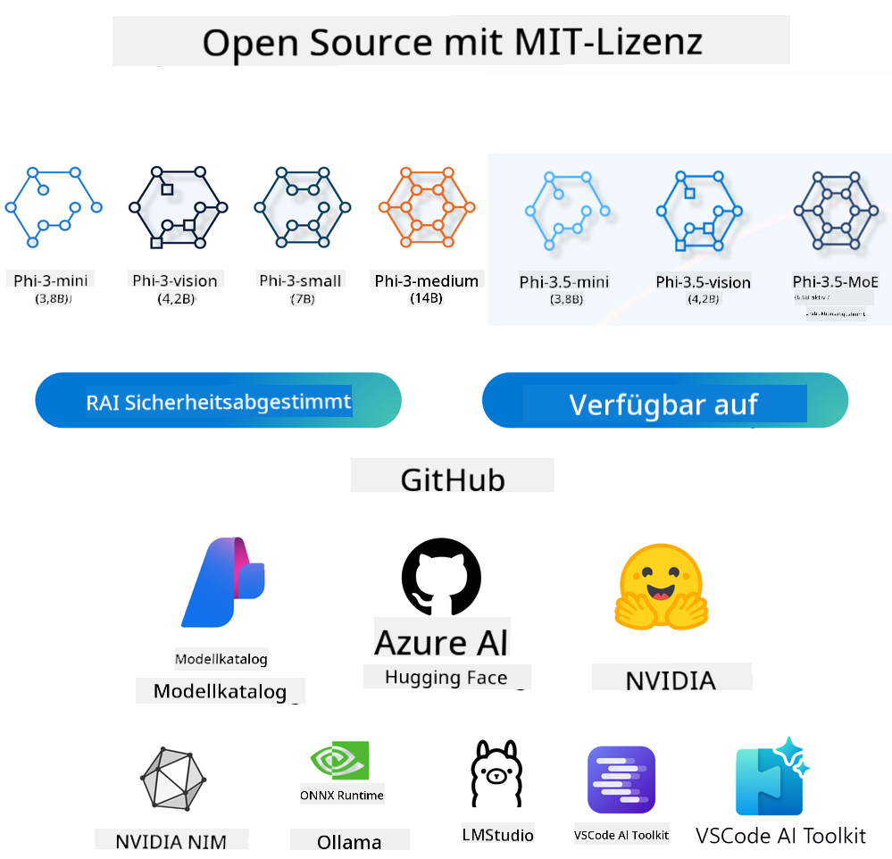
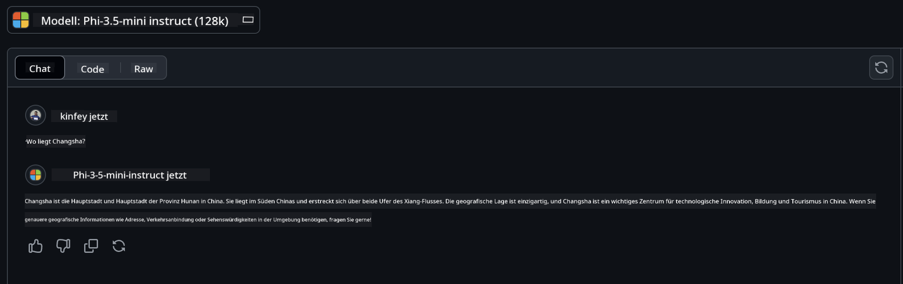

<!--
CO_OP_TRANSLATOR_METADATA:
{
  "original_hash": "124ad36cfe96f74038811b6e2bb93e9d",
  "translation_date": "2025-07-09T18:13:26+00:00",
  "source_file": "19-slm/README.md",
  "language_code": "de"
}
-->
# Einführung in kleine Sprachmodelle für generative KI für Einsteiger  
Generative KI ist ein faszinierendes Gebiet der künstlichen Intelligenz, das sich darauf konzentriert, Systeme zu entwickeln, die in der Lage sind, neue Inhalte zu erzeugen. Diese Inhalte können von Texten und Bildern über Musik bis hin zu kompletten virtuellen Umgebungen reichen. Eine der spannendsten Anwendungen generativer KI liegt im Bereich der Sprachmodelle.

## Was sind kleine Sprachmodelle?  

Ein kleines Sprachmodell (Small Language Model, SLM) ist eine verkleinerte Variante eines großen Sprachmodells (Large Language Model, LLM), die viele der architektonischen Prinzipien und Techniken von LLMs nutzt, dabei jedoch einen deutlich geringeren Rechenaufwand erfordert.

SLMs sind eine Untergruppe von Sprachmodellen, die darauf ausgelegt sind, menschenähnlichen Text zu erzeugen. Im Gegensatz zu ihren größeren Pendants wie GPT-4 sind SLMs kompakter und effizienter, was sie ideal für Anwendungen macht, bei denen die Rechenressourcen begrenzt sind. Trotz ihrer kleineren Größe können sie eine Vielzahl von Aufgaben erfüllen. Typischerweise werden SLMs durch Komprimierung oder Destillation von LLMs erstellt, mit dem Ziel, einen Großteil der Funktionalität und sprachlichen Fähigkeiten des ursprünglichen Modells zu erhalten. Diese Verkleinerung reduziert die Komplexität und macht SLMs sowohl im Speicherverbrauch als auch im Rechenaufwand effizienter. Trotz dieser Optimierungen können SLMs eine breite Palette von Aufgaben im Bereich der natürlichen Sprachverarbeitung (NLP) bewältigen:

- Textgenerierung: Erstellen kohärenter und kontextuell passender Sätze oder Absätze.  
- Textvervollständigung: Vorhersage und Ergänzung von Sätzen basierend auf einem gegebenen Prompt.  
- Übersetzung: Umwandlung von Texten von einer Sprache in eine andere.  
- Zusammenfassung: Verdichtung langer Texte in kürzere, leichter verständliche Zusammenfassungen.

Allerdings mit gewissen Kompromissen bei der Leistung oder dem Tiefgang des Verständnisses im Vergleich zu größeren Modellen.

## Wie funktionieren kleine Sprachmodelle?  
SLMs werden mit großen Mengen an Textdaten trainiert. Während des Trainings lernen sie Muster und Strukturen der Sprache, was ihnen ermöglicht, grammatikalisch korrekten und kontextuell passenden Text zu generieren. Der Trainingsprozess umfasst:

- Datensammlung: Zusammenstellung großer Textdatensätze aus verschiedenen Quellen.  
- Vorverarbeitung: Bereinigung und Organisation der Daten, um sie für das Training geeignet zu machen.  
- Training: Einsatz von Machine-Learning-Algorithmen, um dem Modell das Verstehen und Erzeugen von Text beizubringen.  
- Feinabstimmung: Anpassung des Modells zur Verbesserung der Leistung bei spezifischen Aufgaben.

Die Entwicklung von SLMs entspricht dem wachsenden Bedarf an Modellen, die in ressourcenbeschränkten Umgebungen eingesetzt werden können, wie etwa auf mobilen Geräten oder Edge-Computing-Plattformen, wo vollwertige LLMs aufgrund ihres hohen Ressourcenbedarfs oft unpraktisch sind. Durch den Fokus auf Effizienz schaffen SLMs eine Balance zwischen Leistung und Zugänglichkeit und ermöglichen so eine breitere Anwendung in verschiedenen Bereichen.


## Lernziele  

In dieser Lektion möchten wir Wissen über SLM vermitteln und es mit Microsoft Phi-3 kombinieren, um verschiedene Szenarien in Textinhalten, Vision und MoE kennenzulernen.

Am Ende dieser Lektion solltest du in der Lage sein, folgende Fragen zu beantworten:

- Was ist ein SLM?  
- Worin unterscheiden sich SLM und LLM?  
- Was ist die Microsoft Phi-3/3.5 Familie?  
- Wie führt man Inferenz mit der Microsoft Phi-3/3.5 Familie durch?

Bereit? Dann legen wir los.

## Unterschiede zwischen großen Sprachmodellen (LLMs) und kleinen Sprachmodellen (SLMs)  

Sowohl LLMs als auch SLMs basieren auf grundlegenden Prinzipien des probabilistischen maschinellen Lernens und folgen ähnlichen Ansätzen in Architektur, Trainingsmethoden, Datengenerierung und Modellevaluation. Dennoch gibt es einige wesentliche Unterschiede zwischen diesen beiden Modelltypen.

## Anwendungsbereiche kleiner Sprachmodelle  

SLMs finden in vielen Bereichen Anwendung, darunter:

- Chatbots: Kundenbetreuung und interaktive Nutzerkommunikation.  
- Inhaltserstellung: Unterstützung von Autoren durch Ideenfindung oder das Verfassen ganzer Artikel.  
- Bildung: Hilfe bei Schreibaufgaben oder beim Erlernen neuer Sprachen.  
- Barrierefreiheit: Entwicklung von Hilfsmitteln für Menschen mit Behinderungen, z. B. Text-zu-Sprache-Systeme.

**Größe**  

Ein Hauptunterschied zwischen LLMs und SLMs liegt in der Modellgröße. LLMs wie ChatGPT (GPT-4) können schätzungsweise 1,76 Billionen Parameter umfassen, während Open-Source-SLMs wie Mistral 7B deutlich weniger Parameter besitzen – etwa 7 Milliarden. Diese Diskrepanz resultiert vor allem aus Unterschieden in der Modellarchitektur und den Trainingsprozessen. Beispielsweise verwendet ChatGPT einen Self-Attention-Mechanismus innerhalb eines Encoder-Decoder-Frameworks, während Mistral 7B Sliding-Window-Attention nutzt, was ein effizienteres Training in einem reinen Decoder-Modell ermöglicht. Diese architektonischen Unterschiede haben erhebliche Auswirkungen auf Komplexität und Leistung der Modelle.

**Verständnis**  

SLMs sind meist auf bestimmte Anwendungsbereiche optimiert, was sie sehr spezialisiert, aber möglicherweise eingeschränkt in ihrem allgemeinen Kontextverständnis macht. LLMs hingegen zielen darauf ab, menschliche Intelligenz umfassender zu simulieren. Sie werden mit umfangreichen, vielfältigen Datensätzen trainiert und sind darauf ausgelegt, in verschiedenen Domänen gut zu funktionieren, was ihnen größere Vielseitigkeit und Anpassungsfähigkeit verleiht. Daher eignen sich LLMs besser für ein breiteres Spektrum an Aufgaben, wie natürliche Sprachverarbeitung und Programmierung.

**Rechenleistung**  

Das Training und der Einsatz von LLMs sind ressourcenintensive Prozesse, die oft umfangreiche Recheninfrastrukturen, einschließlich großer GPU-Cluster, erfordern. Beispielsweise kann das Training eines Modells wie ChatGPT von Grund auf Tausende von GPUs über lange Zeiträume benötigen. Im Gegensatz dazu sind SLMs mit ihrer geringeren Parameteranzahl in Bezug auf Rechenressourcen zugänglicher. Modelle wie Mistral 7B können auf lokalen Maschinen mit moderaten GPU-Kapazitäten trainiert und betrieben werden, wobei das Training dennoch mehrere Stunden auf mehreren GPUs in Anspruch nimmt.

**Bias**  

Bias ist ein bekanntes Problem bei LLMs, hauptsächlich bedingt durch die Art der Trainingsdaten. Diese Modelle basieren oft auf rohen, öffentlich zugänglichen Internetdaten, die bestimmte Gruppen unterrepräsentieren oder falsch darstellen können, fehlerhafte Kennzeichnungen enthalten oder sprachliche Verzerrungen durch Dialekte, geografische Unterschiede und Grammatikregeln widerspiegeln. Zudem kann die Komplexität der LLM-Architekturen unbeabsichtigt Bias verstärken, was ohne sorgfältige Feinabstimmung unbemerkt bleiben kann. SLMs, die auf enger gefassten, domänenspezifischen Datensätzen trainiert werden, sind zwar weniger anfällig für solche Verzerrungen, aber nicht vollständig frei davon.

**Inference**  

Die geringere Größe von SLMs verschafft ihnen einen deutlichen Vorteil bei der Inferenzgeschwindigkeit, da sie Ausgaben effizient auf lokaler Hardware erzeugen können, ohne umfangreiche parallele Verarbeitung zu benötigen. LLMs hingegen erfordern aufgrund ihrer Größe und Komplexität oft erhebliche parallele Rechenressourcen, um akzeptable Antwortzeiten zu erzielen. Die gleichzeitige Nutzung durch viele Anwender verlangsamt die Reaktionszeiten von LLMs insbesondere bei großflächiger Bereitstellung zusätzlich.

Zusammenfassend lässt sich sagen, dass LLMs und SLMs zwar auf denselben maschinellen Lernprinzipien basieren, sich jedoch deutlich in Modellgröße, Ressourcenbedarf, Kontextverständnis, Anfälligkeit für Bias und Inferenzgeschwindigkeit unterscheiden. Diese Unterschiede spiegeln ihre jeweilige Eignung für verschiedene Anwendungsfälle wider: LLMs sind vielseitiger, aber ressourcenintensiver, während SLMs eine domänenspezifischere Effizienz bei reduziertem Rechenaufwand bieten.

***Hinweis: In diesem Kapitel stellen wir SLM am Beispiel von Microsoft Phi-3 / 3.5 vor.***

## Vorstellung der Phi-3 / Phi-3.5 Familie  

Die Phi-3 / 3.5 Familie richtet sich hauptsächlich an Anwendungen in den Bereichen Text, Vision und Agent (MoE):

### Phi-3 / 3.5 Instruct  

Vor allem für Textgenerierung, Chatvervollständigung und Extraktion von Inhaltsinformationen.

**Phi-3-mini**  

Das 3,8 Milliarden Parameter umfassende Sprachmodell ist auf Microsoft Azure AI Studio, Hugging Face und Ollama verfügbar. Phi-3-Modelle übertreffen Sprachmodelle gleicher oder größerer Größe in wichtigen Benchmarks deutlich (siehe Benchmarkzahlen unten, höhere Werte sind besser). Phi-3-mini schlägt Modelle mit doppelter Größe, während Phi-3-small und Phi-3-medium sogar größere Modelle, einschließlich GPT-3.5, übertreffen.

**Phi-3-small & medium**  

Mit nur 7 Milliarden Parametern übertrifft Phi-3-small GPT-3.5T in verschiedenen Sprach-, Denk-, Programmier- und Mathematik-Benchmarks.

Phi-3-medium mit 14 Milliarden Parametern setzt diesen Trend fort und übertrifft Gemini 1.0 Pro.

**Phi-3.5-mini**  

Man kann es als Upgrade von Phi-3-mini betrachten. Die Parameterzahl bleibt gleich, aber die Fähigkeit zur Unterstützung mehrerer Sprachen wird verbessert (unterstützt über 20 Sprachen: Arabisch, Chinesisch, Tschechisch, Dänisch, Niederländisch, Englisch, Finnisch, Französisch, Deutsch, Hebräisch, Ungarisch, Italienisch, Japanisch, Koreanisch, Norwegisch, Polnisch, Portugiesisch, Russisch, Spanisch, Schwedisch, Thailändisch, Türkisch, Ukrainisch) und die Unterstützung für lange Kontexte wird gestärkt.

Phi-3.5-mini mit 3,8 Milliarden Parametern übertrifft Sprachmodelle gleicher Größe und ist auf Augenhöhe mit Modellen, die doppelt so groß sind.

### Phi-3 / 3.5 Vision  

Man kann das Instruct-Modell von Phi-3/3.5 als Phis Fähigkeit zum Verstehen betrachten, und Vision verleiht Phi die Augen, um die Welt zu erfassen.

**Phi-3-Vision**  

Phi-3-Vision mit nur 4,2 Milliarden Parametern setzt diesen Trend fort und übertrifft größere Modelle wie Claude-3 Haiku und Gemini 1.0 Pro V bei allgemeinen visuellen Denkaufgaben, OCR sowie bei der Erfassung von Tabellen und Diagrammen.

**Phi-3.5-Vision**  

Phi-3.5-Vision ist ebenfalls ein Upgrade von Phi-3-Vision und unterstützt mehrere Bilder. Man kann es als Verbesserung der visuellen Fähigkeiten sehen: Es kann nicht nur Bilder, sondern auch Videos „sehen“.

Phi-3.5-Vision übertrifft größere Modelle wie Claude-3.5 Sonnet und Gemini 1.5 Flash bei OCR, Tabellen- und Diagrammverständnis und ist gleichauf bei allgemeinen visuellen Wissens-Denkaufgaben. Unterstützt Multi-Frame-Eingaben, also das Schlussfolgern über mehrere Eingabebilder.

### Phi-3.5-MoE  

***Mixture of Experts (MoE)*** ermöglicht es, Modelle mit deutlich weniger Rechenaufwand vorzutrainieren, was bedeutet, dass man Modell- oder Datensatzgrößen mit demselben Rechenbudget wie bei einem dichten Modell drastisch skalieren kann. Insbesondere sollte ein MoE-Modell während des Vortrainings schneller die gleiche Qualität wie sein dichtes Pendant erreichen.

Phi-3.5-MoE besteht aus 16x3,8 Milliarden Expertenmodulen. Phi-3.5-MoE mit nur 6,6 Milliarden aktiven Parametern erreicht ein ähnliches Niveau in den Bereichen Denken, Sprachverständnis und Mathematik wie deutlich größere Modelle.

Wir können das Phi-3/3.5 Familienmodell je nach Szenario einsetzen. Im Gegensatz zu LLMs kann man Phi-3/3.5-mini oder Phi-3/3.5-Vision auch auf Edge-Geräten bereitstellen.

## Wie verwendet man Phi-3/3.5 Familienmodelle  

Wir möchten Phi-3/3.5 in verschiedenen Szenarien einsetzen. Im Folgenden zeigen wir, wie man Phi-3/3.5 je nach Anwendungsszenario nutzt.



### Unterschiedliche Inferenzmöglichkeiten über Cloud-APIs  

**GitHub Models**  

GitHub Models ist der direkteste Weg. Du kannst schnell auf das Phi-3/3.5-Instruct-Modell über GitHub Models zugreifen. In Kombination mit dem Azure AI Inference SDK / OpenAI SDK kannst du die API per Code ansprechen, um Phi-3/3.5-Instruct aufzurufen. Über Playground kannst du auch verschiedene Effekte testen.

- Demo: Vergleich der Ergebnisse von Phi-3-mini und Phi-3.5-mini in chinesischen Szenarien




**Azure AI Studio**  

Wenn du die Vision- und MoE-Modelle nutzen möchtest, kannst du Azure AI Studio verwenden, um die Aufrufe durchzuführen. Bei Interesse kannst du das Phi-3 Cookbook lesen, um zu erfahren, wie man Phi-3/3.5 Instruct, Vision und MoE über Azure AI Studio aufruft [Klicke hier](https://github.com/microsoft/Phi-3CookBook/blob/main/md/02.QuickStart/AzureAIStudio_QuickStart.md?WT.mc_id=academic-105485-koreyst)

**NVIDIA NIM**  

Neben den cloudbasierten Model Catalog-Lösungen von Azure und GitHub kannst du auch [NVIDIA NIM](https://developer.nvidia.com/nim?WT.mc_id=academic-105485-koreyst) nutzen, um entsprechende Aufrufe durchzuführen. NVIDIA NIM (NVIDIA Inference Microservices) ist eine Sammlung beschleunigter Inferenz-Microservices, die Entwicklern helfen, KI-Modelle effizient in verschiedenen Umgebungen bereitzustellen, darunter Clouds, Rechenzentren und Workstations.

Hier einige wichtige Merkmale von NVIDIA NIM:

- **Einfache Bereitstellung:** NIM ermöglicht die Bereitstellung von KI-Modellen mit nur einem Befehl, was die Integration in bestehende Workflows erleichtert.  
- **Optimierte Leistung:** Es nutzt voroptimierte Inferenz-Engines von NVIDIA, wie TensorRT und TensorRT-LLM, um niedrige Latenz und hohe Durchsatzraten sicherzustellen.  
- **Skalierbarkeit:** NIM unterstützt Autoscaling auf Kubernetes, wodurch es effektiv mit wechselnden Arbeitslasten umgehen kann.
- **Sicherheit und Kontrolle:** Organisationen können die Kontrolle über ihre Daten und Anwendungen behalten, indem sie NIM-Mikroservices auf ihrer eigenen verwalteten Infrastruktur selbst hosten.  
- **Standard-APIs:** NIM bietet branchenübliche APIs, die es einfach machen, KI-Anwendungen wie Chatbots, KI-Assistenten und mehr zu entwickeln und zu integrieren.

NIM ist Teil von NVIDIA AI Enterprise, das darauf abzielt, die Bereitstellung und den Betrieb von KI-Modellen zu vereinfachen und sicherzustellen, dass sie effizient auf NVIDIA-GPUs laufen.

- Demo: Verwendung von Nvidia NIM zum Aufrufen der Phi-3.5-Vision-API [[Klicken Sie hier](python/Phi-3-Vision-Nividia-NIM.ipynb)]


### Inferenz Phi-3/3.5 in der lokalen Umgebung  
Inference im Zusammenhang mit Phi-3 oder einem beliebigen Sprachmodell wie GPT-3 bezeichnet den Prozess, Antworten oder Vorhersagen basierend auf den eingegebenen Daten zu generieren. Wenn Sie Phi-3 eine Eingabe oder Frage geben, nutzt es sein trainiertes neuronales Netzwerk, um durch Analyse von Mustern und Zusammenhängen in den Trainingsdaten die wahrscheinlichste und relevanteste Antwort abzuleiten.

**Hugging Face Transformer**  
Hugging Face Transformers ist eine leistungsstarke Bibliothek für natürliche Sprachverarbeitung (NLP) und andere maschinelle Lernaufgaben. Hier einige wichtige Punkte:

1. **Vortrainierte Modelle:** Sie bietet Tausende vortrainierter Modelle für verschiedene Aufgaben wie Textklassifikation, Named Entity Recognition, Fragebeantwortung, Zusammenfassung, Übersetzung und Textgenerierung.

2. **Framework-Interoperabilität:** Die Bibliothek unterstützt mehrere Deep-Learning-Frameworks, darunter PyTorch, TensorFlow und JAX. So können Sie ein Modell in einem Framework trainieren und in einem anderen verwenden.

3. **Multimodale Fähigkeiten:** Neben NLP unterstützt Hugging Face Transformers auch Aufgaben in der Computer Vision (z. B. Bildklassifikation, Objekterkennung) und Audiobearbeitung (z. B. Spracherkennung, Audioklassifikation).

4. **Benutzerfreundlichkeit:** Die Bibliothek bietet APIs und Tools, um Modelle einfach herunterzuladen und feinzujustieren, was sie sowohl für Anfänger als auch Experten zugänglich macht.

5. **Community und Ressourcen:** Hugging Face verfügt über eine lebendige Community sowie umfangreiche Dokumentationen, Tutorials und Anleitungen, die den Einstieg erleichtern und die Nutzung der Bibliothek optimieren.  
[offizielle Dokumentation](https://huggingface.co/docs/transformers/index?WT.mc_id=academic-105485-koreyst) oder ihr [GitHub-Repository](https://github.com/huggingface/transformers?WT.mc_id=academic-105485-koreyst).

Dies ist die am häufigsten genutzte Methode, erfordert jedoch GPU-Beschleunigung. Szenarien wie Vision und MoE benötigen viele Berechnungen, die auf der CPU ohne Quantisierung stark eingeschränkt sind.


- Demo: Verwendung von Transformer zum Aufrufen von Phi-3.5-Instruct [Klicken Sie hier](python/phi35-instruct-demo.ipynb)

- Demo: Verwendung von Transformer zum Aufrufen von Phi-3.5-Vision [Klicken Sie hier](python/phi35-vision-demo.ipynb)

- Demo: Verwendung von Transformer zum Aufrufen von Phi-3.5-MoE [Klicken Sie hier](python/phi35_moe_demo.ipynb)

**Ollama**  
[Ollama](https://ollama.com/?WT.mc_id=academic-105485-koreyst) ist eine Plattform, die es erleichtert, große Sprachmodelle (LLMs) lokal auf dem eigenen Rechner auszuführen. Sie unterstützt verschiedene Modelle wie Llama 3.1, Phi 3, Mistral und Gemma 2, unter anderem. Die Plattform vereinfacht den Prozess, indem sie Modellgewichte, Konfiguration und Daten in einem Paket bündelt, was es Nutzern erleichtert, eigene Modelle anzupassen und zu erstellen. Ollama ist für macOS, Linux und Windows verfügbar. Es ist ein großartiges Tool, wenn Sie mit LLMs experimentieren oder sie bereitstellen möchten, ohne auf Cloud-Dienste angewiesen zu sein. Ollama ist der direkteste Weg, Sie müssen nur die folgende Anweisung ausführen.


```bash

ollama run phi3.5

```


**ONNX Runtime für GenAI**

[ONNX Runtime](https://github.com/microsoft/onnxruntime-genai?WT.mc_id=academic-105485-koreyst) ist ein plattformübergreifender Beschleuniger für Inferenz und Training von maschinellen Lernmodellen. ONNX Runtime für Generative AI (GENAI) ist ein leistungsstarkes Tool, das Ihnen hilft, generative KI-Modelle effizient auf verschiedenen Plattformen auszuführen.

## Was ist ONNX Runtime?  
ONNX Runtime ist ein Open-Source-Projekt, das eine hochperformante Inferenz von maschinellen Lernmodellen ermöglicht. Es unterstützt Modelle im Open Neural Network Exchange (ONNX)-Format, einem Standard zur Darstellung von ML-Modellen. Die ONNX Runtime-Inferenz kann schnellere Kundenerlebnisse und geringere Kosten ermöglichen und unterstützt Modelle aus Deep-Learning-Frameworks wie PyTorch und TensorFlow/Keras sowie klassische ML-Bibliotheken wie scikit-learn, LightGBM, XGBoost usw. ONNX Runtime ist kompatibel mit verschiedenen Hardwaretypen, Treibern und Betriebssystemen und bietet optimale Leistung durch Nutzung von Hardwarebeschleunigern sowie Graph-Optimierungen und Transformationen.

## Was ist Generative AI?  
Generative AI bezeichnet KI-Systeme, die neue Inhalte wie Texte, Bilder oder Musik basierend auf den Trainingsdaten erzeugen können. Beispiele sind Sprachmodelle wie GPT-3 und Bildgenerierungsmodelle wie Stable Diffusion. Die ONNX Runtime für GenAI-Bibliothek stellt die generative KI-Schleife für ONNX-Modelle bereit, einschließlich Inferenz mit ONNX Runtime, Logits-Verarbeitung, Suche und Sampling sowie KV-Cache-Verwaltung.

## ONNX Runtime für GENAI  
ONNX Runtime für GENAI erweitert die Fähigkeiten von ONNX Runtime, um generative KI-Modelle zu unterstützen. Hier einige wichtige Funktionen:

- **Breite Plattformunterstützung:** Funktioniert auf verschiedenen Plattformen wie Windows, Linux, macOS, Android und iOS.  
- **Modellunterstützung:** Unterstützt viele populäre generative KI-Modelle wie LLaMA, GPT-Neo, BLOOM und weitere.  
- **Leistungsoptimierung:** Enthält Optimierungen für verschiedene Hardwarebeschleuniger wie NVIDIA GPUs, AMD GPUs und mehr.  
- **Benutzerfreundlichkeit:** Bietet APIs für eine einfache Integration in Anwendungen, mit denen Sie Texte, Bilder und andere Inhalte mit minimalem Code generieren können.  
- Nutzer können eine hochstufige generate()-Methode aufrufen oder jede Iteration des Modells in einer Schleife ausführen, wobei jeweils ein Token generiert und optional die Generierungsparameter innerhalb der Schleife aktualisiert werden.  
- ONNX Runtime unterstützt außerdem Greedy-/Beam-Search und TopP-, TopK-Sampling zur Generierung von Token-Sequenzen sowie eingebaute Logits-Verarbeitung wie Wiederholungsstrafen. Eigene Scoring-Methoden lassen sich ebenfalls leicht hinzufügen.

## Erste Schritte  
Um mit ONNX Runtime für GENAI zu starten, können Sie folgende Schritte ausführen:

### ONNX Runtime installieren:  
```Python
pip install onnxruntime
```  
### Generative AI Extensions installieren:  
```Python
pip install onnxruntime-genai
```

### Ein Modell ausführen: Hier ein einfaches Beispiel in Python:  
```Python
import onnxruntime_genai as og

model = og.Model('path_to_your_model.onnx')

tokenizer = og.Tokenizer(model)

input_text = "Hello, how are you?"

input_tokens = tokenizer.encode(input_text)

output_tokens = model.generate(input_tokens)

output_text = tokenizer.decode(output_tokens)

print(output_text) 
```  
### Demo: Verwendung von ONNX Runtime GenAI zum Aufrufen von Phi-3.5-Vision  


```python

import onnxruntime_genai as og

model_path = './Your Phi-3.5-vision-instruct ONNX Path'

img_path = './Your Image Path'

model = og.Model(model_path)

processor = model.create_multimodal_processor()

tokenizer_stream = processor.create_stream()

text = "Your Prompt"

prompt = "<|user|>\n"

prompt += "<|image_1|>\n"

prompt += f"{text}<|end|>\n"

prompt += "<|assistant|>\n"

image = og.Images.open(img_path)

inputs = processor(prompt, images=image)

params = og.GeneratorParams(model)

params.set_inputs(inputs)

params.set_search_options(max_length=3072)

generator = og.Generator(model, params)

while not generator.is_done():

    generator.compute_logits()
    
    generator.generate_next_token()

    new_token = generator.get_next_tokens()[0]
    
    code += tokenizer_stream.decode(new_token)
    
    print(tokenizer_stream.decode(new_token), end='', flush=True)

```


**Weitere**

Neben ONNX Runtime und Ollama Referenzmethoden können wir auch die Referenz quantitativer Modelle basierend auf den Modellreferenzmethoden verschiedener Hersteller vervollständigen. Zum Beispiel Apple MLX Framework mit Apple Metal, Qualcomm QNN mit NPU, Intel OpenVINO mit CPU/GPU usw. Weitere Inhalte finden Sie auch im [Phi-3 Cookbook](https://github.com/microsoft/phi-3cookbook?WT.mc_id=academic-105485-koreyst).


## Mehr

Wir haben die Grundlagen der Phi-3/3.5-Familie kennengelernt, aber um mehr über SLM zu erfahren, benötigen wir weiteres Wissen. Die Antworten finden Sie im Phi-3 Cookbook. Wenn Sie mehr lernen möchten, besuchen Sie bitte das [Phi-3 Cookbook](https://github.com/microsoft/phi-3cookbook?WT.mc_id=academic-105485-koreyst).

**Haftungsausschluss**:  
Dieses Dokument wurde mit dem KI-Übersetzungsdienst [Co-op Translator](https://github.com/Azure/co-op-translator) übersetzt. Obwohl wir uns um Genauigkeit bemühen, beachten Sie bitte, dass automatisierte Übersetzungen Fehler oder Ungenauigkeiten enthalten können. Das Originaldokument in seiner Ursprungssprache gilt als maßgebliche Quelle. Für wichtige Informationen wird eine professionelle menschliche Übersetzung empfohlen. Wir übernehmen keine Haftung für Missverständnisse oder Fehlinterpretationen, die aus der Nutzung dieser Übersetzung entstehen.