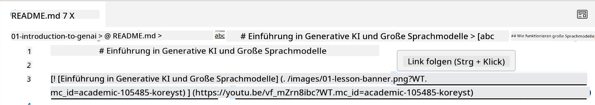
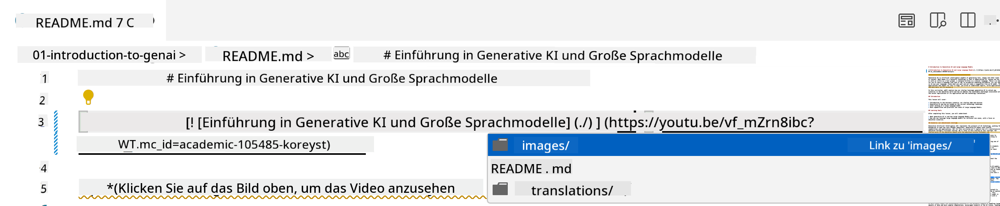
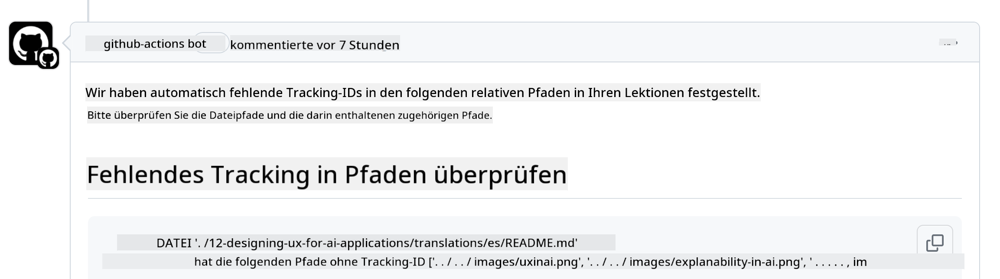
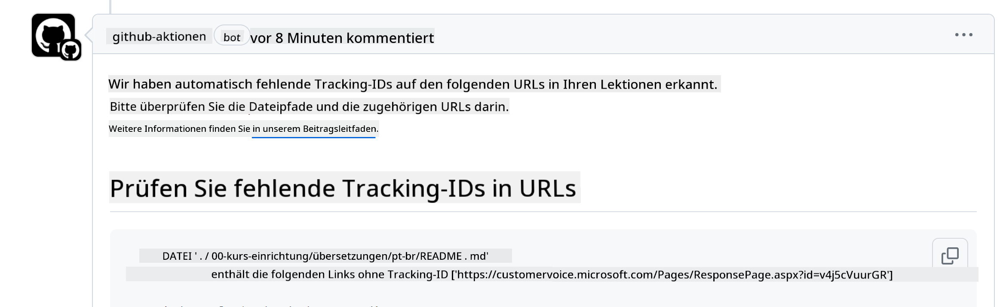
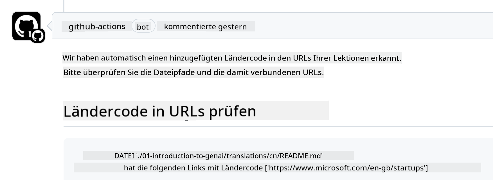

<!--
CO_OP_TRANSLATOR_METADATA:
{
  "original_hash": "57c41f2af71001a2cff9d8eb797cb843",
  "translation_date": "2025-05-19T08:42:13+00:00",
  "source_file": "CONTRIBUTING.md",
  "language_code": "de"
}
-->
# Beitragen

Dieses Projekt begrüßt Beiträge und Vorschläge. Die meisten Beiträge erfordern, dass Sie einem Contributor License Agreement (CLA) zustimmen, das erklärt, dass Sie das Recht haben, und tatsächlich die Rechte gewähren, um Ihren Beitrag zu nutzen. Weitere Details finden Sie unter <https://cla.microsoft.com>.

> Wichtig: Beim Übersetzen von Texten in diesem Repository bitte sicherstellen, dass keine maschinelle Übersetzung verwendet wird. Wir werden Übersetzungen durch die Community überprüfen, daher bitte nur freiwillig übersetzen, wenn Sie in der Sprache bewandert sind.

Wenn Sie einen Pull-Request einreichen, wird ein CLA-Bot automatisch bestimmen, ob Sie ein CLA bereitstellen müssen und den PR entsprechend dekorieren (z.B. Label, Kommentar). Folgen Sie einfach den Anweisungen des Bots. Dies müssen Sie nur einmal über alle Repositories hinweg tun, die unser CLA verwenden.

## Verhaltenskodex

Dieses Projekt hat den [Microsoft Open Source Code of Conduct](https://opensource.microsoft.com/codeofconduct/?WT.mc_id=academic-105485-koreyst) übernommen. Für weitere Informationen lesen Sie die [Code of Conduct FAQ](https://opensource.microsoft.com/codeofconduct/faq/?WT.mc_id=academic-105485-koreyst) oder kontaktieren Sie [opencode@microsoft.com](mailto:opencode@microsoft.com) bei weiteren Fragen oder Kommentaren.

## Frage oder Problem?

Bitte öffnen Sie keine GitHub-Issues für allgemeine Support-Fragen, da die GitHub-Liste für Funktionsanfragen und Fehlerberichte verwendet werden sollte. Auf diese Weise können wir tatsächliche Probleme oder Bugs aus dem Code leichter nachverfolgen und die allgemeine Diskussion vom eigentlichen Code trennen.

## Tippfehler, Probleme, Bugs und Beiträge

Wann immer Sie Änderungen am Repository "Generative AI for Beginners" einreichen, folgen Sie bitte diesen Empfehlungen.

* Forken Sie das Repository immer in Ihr eigenes Konto, bevor Sie Ihre Änderungen vornehmen
* Kombinieren Sie nicht mehrere Änderungen in einem Pull-Request. Beispielsweise sollten Bugfixes und Dokumentationsupdates in separaten PRs eingereicht werden
* Wenn Ihr Pull-Request Merge-Konflikte zeigt, stellen Sie sicher, dass Sie Ihr lokales Hauptverzeichnis auf einen Spiegel dessen aktualisieren, was im Haupt-Repository ist, bevor Sie Ihre Änderungen vornehmen
* Wenn Sie eine Übersetzung einreichen, erstellen Sie bitte einen PR für alle übersetzten Dateien, da wir keine Teilübersetzungen für den Inhalt akzeptieren
* Wenn Sie einen Tippfehler oder eine Dokumentationskorrektur einreichen, können Sie die Änderungen in einem einzigen PR kombinieren, wo es geeignet ist

## Allgemeine Hinweise zum Schreiben

- Stellen Sie sicher, dass alle Ihre URLs in eckigen Klammern gefolgt von einer Klammer ohne zusätzliche Leerzeichen darum oder darin eingewickelt sind ``.
- Stellen Sie sicher, dass jeder relative Link (d.h. Links zu anderen Dateien und Ordnern im Repository) mit einem `./` beginnt, der sich auf eine Datei oder einen Ordner im aktuellen Arbeitsverzeichnis bezieht, oder einem `../`, der sich auf eine Datei oder einen Ordner im übergeordneten Arbeitsverzeichnis bezieht.
- Stellen Sie sicher, dass jeder relative Link (d.h. Links zu anderen Dateien und Ordnern im Repository) eine Tracking-ID (d.h. `?` oder `&` dann `wt.mc_id=` oder `WT.mc_id=`) am Ende hat.
- Stellen Sie sicher, dass jede URL von den folgenden Domains _github.com, microsoft.com, visualstudio.com, aka.ms und azure.com_ eine Tracking-ID (d.h. `?` oder `&` dann `wt.mc_id=` oder `WT.mc_id=`) am Ende hat.
- Stellen Sie sicher, dass Ihre Links keine länderspezifische Locale enthalten (d.h. `/en-us/` oder `/en/`).
- Stellen Sie sicher, dass alle Bilder im `./images` Ordner gespeichert sind.
- Stellen Sie sicher, dass die Bilder beschreibende Namen mit englischen Zeichen, Zahlen und Bindestrichen im Namen Ihres Bildes haben.

## GitHub Workflows

Wenn Sie einen Pull-Request einreichen, werden vier verschiedene Workflows ausgelöst, um die vorherigen Regeln zu validieren. Folgen Sie einfach den hier aufgeführten Anweisungen, um die Workflow-Checks zu bestehen.

- [Check Broken Relative Paths](../..)
- [Check Paths Have Tracking](../..)
- [Check URLs Have Tracking](../..)
- [Check URLs Don't Have Locale](../..)

### Check Broken Relative Paths

Dieser Workflow stellt sicher, dass jeder relative Pfad in Ihren Dateien funktioniert. Dieses Repository wird auf GitHub Pages bereitgestellt, daher müssen Sie sehr vorsichtig sein, wenn Sie die Links eingeben, die alles zusammenfügen, um niemanden an den falschen Ort zu leiten.

Um sicherzustellen, dass Ihre Links richtig funktionieren, verwenden Sie einfach VS Code, um das zu überprüfen.

Zum Beispiel, wenn Sie über einen Link in Ihren Dateien schweben, werden Sie aufgefordert, dem Link zu folgen, indem Sie **ctrl + click** drücken.

Wenn Sie auf einen Link klicken und er lokal nicht funktioniert, wird er sicherlich den Workflow auslösen und auf GitHub nicht funktionieren.

Um dieses Problem zu beheben, versuchen Sie, den Link mit Hilfe von VS Code zu tippen.

Wenn Sie `./` oder `../` eingeben, wird VS Code Sie auffordern, aus den verfügbaren Optionen entsprechend dem, was Sie eingegeben haben, zu wählen.

Folgen Sie dem Pfad, indem Sie auf die gewünschte Datei oder den Ordner klicken, und Sie werden sicher sein, dass Ihr Pfad nicht gebrochen ist.

Sobald Sie den korrekten relativen Pfad hinzugefügt haben, speichern Sie und pushen Sie Ihre Änderungen, der Workflow wird erneut ausgelöst, um Ihre Änderungen zu überprüfen. Wenn Sie den Check bestehen, sind Sie bereit.

### Check Paths Have Tracking

Dieser Workflow stellt sicher, dass jeder relative Pfad ein Tracking hat. Dieses Repository wird auf GitHub Pages bereitgestellt, daher müssen wir die Bewegung zwischen den verschiedenen Dateien und Ordnern verfolgen.

Um sicherzustellen, dass Ihre relativen Pfade ein Tracking haben, überprüfen Sie einfach den folgenden Text `?wt.mc_id=` am Ende des Pfades. Wenn er an Ihre relativen Pfade angehängt ist, werden Sie diesen Check bestehen.

Wenn nicht, erhalten Sie möglicherweise den folgenden Fehler.

Um dieses Problem zu beheben, versuchen Sie, den Dateipfad zu öffnen, den der Workflow hervorgehoben hat, und fügen Sie die Tracking-ID am Ende der relativen Pfade hinzu.

Sobald Sie die Tracking-ID hinzugefügt haben, speichern Sie und pushen Sie Ihre Änderungen, der Workflow wird erneut ausgelöst, um Ihre Änderungen zu überprüfen. Wenn Sie den Check bestehen, sind Sie bereit.

### Check URLs Have Tracking

Dieser Workflow stellt sicher, dass jede Web-URL ein Tracking hat. Dieses Repository ist für jeden zugänglich, daher müssen Sie sicherstellen, dass Sie den Zugriff verfolgen, um zu wissen, woher der Traffic kommt.

Um sicherzustellen, dass Ihre URLs ein Tracking haben, überprüfen Sie einfach den folgenden Text `?wt.mc_id=` am Ende der URL. Wenn er an Ihre URLs angehängt ist, werden Sie diesen Check bestehen.

Wenn nicht, erhalten Sie möglicherweise den folgenden Fehler.

Um dieses Problem zu beheben, versuchen Sie, den Dateipfad zu öffnen, den der Workflow hervorgehoben hat, und fügen Sie die Tracking-ID am Ende der URLs hinzu.

Sobald Sie die Tracking-ID hinzugefügt haben, speichern Sie und pushen Sie Ihre Änderungen, der Workflow wird erneut ausgelöst, um Ihre Änderungen zu überprüfen. Wenn Sie den Check bestehen, sind Sie bereit.

### Check URLs Don't Have Locale

Dieser Workflow stellt sicher, dass keine Web-URL eine länderspezifische Locale enthält. Dieses Repository ist weltweit zugänglich, daher müssen Sie sicherstellen, dass Sie keine länderspezifische Locale in URLs einfügen.

Um sicherzustellen, dass Ihre URLs keine Länder-Locales enthalten, überprüfen Sie einfach den folgenden Text `/en-us/` oder `/en/` oder jede andere Sprach-Locale irgendwo in der URL. Wenn er in Ihren URLs nicht vorhanden ist, werden Sie diesen Check bestehen.

Wenn nicht, erhalten Sie möglicherweise den folgenden Fehler.

Um dieses Problem zu beheben, versuchen Sie, den Dateipfad zu öffnen, den der Workflow hervorgehoben hat, und entfernen Sie die Länder-Locales aus den URLs.

Sobald Sie die Länder-Locales entfernt haben, speichern Sie und pushen Sie Ihre Änderungen, der Workflow wird erneut ausgelöst, um Ihre Änderungen zu überprüfen. Wenn Sie den Check bestehen, sind Sie bereit.

Herzlichen Glückwunsch! Wir werden uns so schnell wie möglich mit Feedback zu Ihrem Beitrag bei Ihnen melden.

**Haftungsausschluss**:  
Dieses Dokument wurde mit dem KI-Übersetzungsdienst [Co-op Translator](https://github.com/Azure/co-op-translator) übersetzt. Obwohl wir uns um Genauigkeit bemühen, beachten Sie bitte, dass automatisierte Übersetzungen Fehler oder Ungenauigkeiten enthalten können. Das Originaldokument in seiner ursprünglichen Sprache sollte als maßgebliche Quelle angesehen werden. Für kritische Informationen wird eine professionelle menschliche Übersetzung empfohlen. Wir haften nicht für Missverständnisse oder Fehlinterpretationen, die sich aus der Nutzung dieser Übersetzung ergeben.