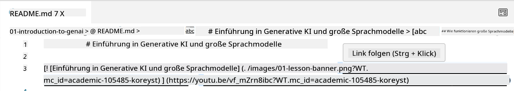
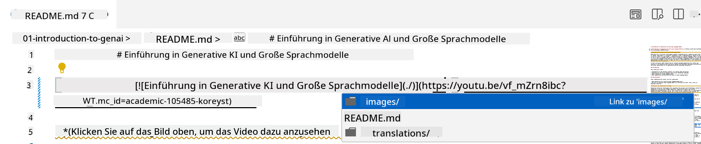
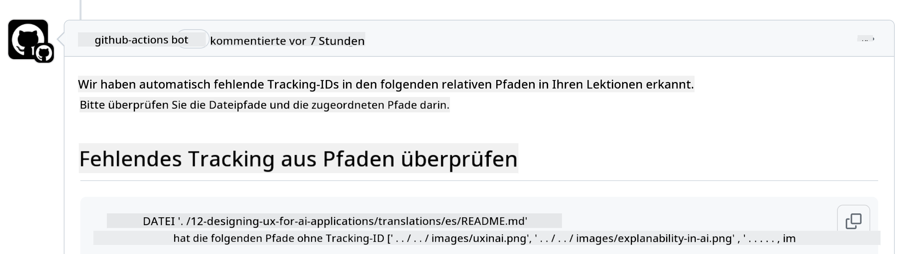
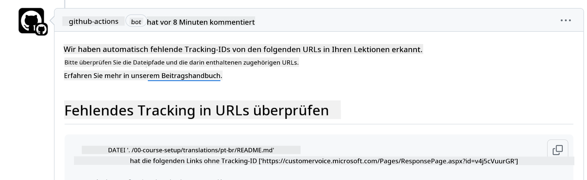
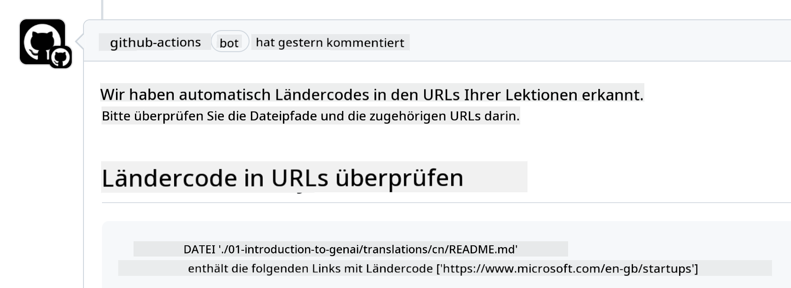

<!--
CO_OP_TRANSLATOR_METADATA:
{
  "original_hash": "57c41f2af71001a2cff9d8eb797cb843",
  "translation_date": "2025-06-25T06:59:25+00:00",
  "source_file": "CONTRIBUTING.md",
  "language_code": "de"
}
-->
# Mitwirken

Dieses Projekt begrüßt Beiträge und Vorschläge. Die meisten Beiträge erfordern, dass Sie einem Contributor License Agreement (CLA) zustimmen, das erklärt, dass Sie das Recht haben und uns tatsächlich die Rechte einräumen, Ihren Beitrag zu nutzen. Für weitere Details besuchen Sie <https://cla.microsoft.com>.

> Wichtig: Wenn Sie Text in diesem Repository übersetzen, stellen Sie bitte sicher, dass Sie keine maschinelle Übersetzung verwenden. Wir werden die Übersetzungen über die Community überprüfen, daher sollten Sie nur für Übersetzungen in Sprachen freiwillig tätig werden, in denen Sie versiert sind.

Wenn Sie einen Pull Request einreichen, ermittelt ein CLA-Bot automatisch, ob Sie ein CLA bereitstellen müssen, und kennzeichnet den PR entsprechend (z.B. Label, Kommentar). Folgen Sie einfach den Anweisungen des Bots. Dies müssen Sie nur einmal für alle Repositories tun, die unser CLA verwenden.

## Verhaltenskodex

Dieses Projekt hat den [Microsoft Open Source Code of Conduct](https://opensource.microsoft.com/codeofconduct/?WT.mc_id=academic-105485-koreyst) übernommen. Für weitere Informationen lesen Sie die [Code of Conduct FAQ](https://opensource.microsoft.com/codeofconduct/faq/?WT.mc_id=academic-105485-koreyst) oder kontaktieren Sie [opencode@microsoft.com](mailto:opencode@microsoft.com) bei weiteren Fragen oder Anmerkungen.

## Frage oder Problem?

Bitte eröffnen Sie keine GitHub-Issues für allgemeine Supportfragen, da die GitHub-Liste für Funktionsanfragen und Fehlerberichte verwendet werden sollte. Auf diese Weise können wir tatsächliche Probleme oder Fehler im Code leichter nachverfolgen und die allgemeine Diskussion vom eigentlichen Code trennen.

## Tippfehler, Probleme, Bugs und Beiträge

Wann immer Sie Änderungen am Generative AI for Beginners-Repository vornehmen, befolgen Sie bitte diese Empfehlungen.

* Forken Sie das Repository immer in Ihr eigenes Konto, bevor Sie Ihre Änderungen vornehmen
* Kombinieren Sie nicht mehrere Änderungen in einem Pull Request. Reichen Sie beispielsweise jede Fehlerbehebung und Dokumentationsaktualisierung in separaten PRs ein
* Wenn Ihr Pull Request Merge-Konflikte aufweist, stellen Sie sicher, dass Sie Ihr lokales Main aktualisieren, um ein Spiegelbild dessen zu sein, was sich im Hauptrepository befindet, bevor Sie Ihre Änderungen vornehmen
* Wenn Sie eine Übersetzung einreichen, erstellen Sie bitte einen PR für alle übersetzten Dateien, da wir keine Teilübersetzungen für den Inhalt akzeptieren
* Wenn Sie einen Tippfehler oder eine Dokumentationskorrektur einreichen, können Sie Änderungen in einem einzigen PR kombinieren, wo es angebracht ist

## Allgemeine Anleitung zum Schreiben

- Stellen Sie sicher, dass alle Ihre URLs in eckige Klammern gefasst sind, gefolgt von einer Klammer ohne zusätzliche Leerzeichen um sie herum oder darin ``.
- Stellen Sie sicher, dass jeder relative Link (d.h. Links zu anderen Dateien und Ordnern im Repository) mit einem `./` beginnt, der auf eine Datei oder einen Ordner im aktuellen Arbeitsverzeichnis verweist, oder einem `../`, der auf eine Datei oder einen Ordner im übergeordneten Arbeitsverzeichnis verweist.
- Stellen Sie sicher, dass jeder relative Link (d.h. Links zu anderen Dateien und Ordnern im Repository) eine Tracking-ID (d.h. `?` oder `&` dann `wt.mc_id=` oder `WT.mc_id=`) am Ende hat.
- Stellen Sie sicher, dass jede URL von den folgenden Domains _github.com, microsoft.com, visualstudio.com, aka.ms und azure.com_ eine Tracking-ID (d.h. `?` oder `&` dann `wt.mc_id=` oder `WT.mc_id=`) am Ende hat.
- Stellen Sie sicher, dass Ihre Links keine länderspezifische Locale enthalten (d.h. `/en-us/` oder `/en/`).
- Stellen Sie sicher, dass alle Bilder im Ordner `./images` gespeichert sind.
- Stellen Sie sicher, dass die Bilder beschreibende Namen mit englischen Zeichen, Zahlen und Bindestrichen im Namen Ihres Bildes haben.

## GitHub Workflows

Wenn Sie einen Pull Request einreichen, werden vier verschiedene Workflows ausgelöst, um die vorherigen Regeln zu validieren. Folgen Sie einfach den hier aufgeführten Anweisungen, um die Workflow-Checks zu bestehen.

- [Check Broken Relative Paths](../..)
- [Check Paths Have Tracking](../..)
- [Check URLs Have Tracking](../..)
- [Check URLs Don't Have Locale](../..)

### Check Broken Relative Paths

Dieser Workflow stellt sicher, dass jeder relative Pfad in Ihren Dateien funktioniert. Dieses Repository wird auf GitHub-Seiten bereitgestellt, daher müssen Sie sehr vorsichtig sein, wenn Sie die Links eingeben, die alles zusammenfügen, um niemanden an den falschen Ort zu führen.

Um sicherzustellen, dass Ihre Links ordnungsgemäß funktionieren, verwenden Sie einfach VS Code, um das zu überprüfen.

Wenn Sie beispielsweise über einen Link in Ihren Dateien fahren, werden Sie aufgefordert, dem Link zu folgen, indem Sie **Strg + Klick** drücken.

Wenn Sie auf einen Link klicken und er lokal nicht funktioniert, wird er sicherlich den Workflow auslösen und auf GitHub nicht funktionieren.

Um dieses Problem zu beheben, versuchen Sie, den Link mit Hilfe von VS Code einzugeben.

Wenn Sie `./` oder `../` eingeben, wird Ihnen VS Code auffordern, aus den verfügbaren Optionen gemäß dem, was Sie eingegeben haben, auszuwählen.

Folgen Sie dem Pfad, indem Sie auf die gewünschte Datei oder den gewünschten Ordner klicken, und Sie werden sicher sein, dass Ihr Pfad nicht gebrochen ist.

Sobald Sie den korrekten relativen Pfad hinzugefügt haben, speichern und pushen Sie Ihre Änderungen, und der Workflow wird erneut ausgelöst, um Ihre Änderungen zu überprüfen. Wenn Sie den Check bestehen, können Sie weitermachen.

### Check Paths Have Tracking

Dieser Workflow stellt sicher, dass jeder relative Pfad ein Tracking enthält. Dieses Repository wird auf GitHub-Seiten bereitgestellt, daher müssen wir die Bewegung zwischen den verschiedenen Dateien und Ordnern nachverfolgen.

Um sicherzustellen, dass Ihre relativen Pfade ein Tracking enthalten, überprüfen Sie einfach den folgenden Text `?wt.mc_id=` am Ende des Pfads. Wenn es an Ihre relativen Pfade angehängt ist, werden Sie diesen Check bestehen.

Andernfalls erhalten Sie möglicherweise den folgenden Fehler.

Um dieses Problem zu beheben, versuchen Sie, den Dateipfad zu öffnen, den der Workflow hervorgehoben hat, und fügen Sie die Tracking-ID am Ende der relativen Pfade hinzu.

Sobald Sie die Tracking-ID hinzugefügt haben, speichern und pushen Sie Ihre Änderungen, und der Workflow wird erneut ausgelöst, um Ihre Änderungen zu überprüfen. Wenn Sie den Check bestehen, können Sie weitermachen.

### Check URLs Have Tracking

Dieser Workflow stellt sicher, dass jede Web-URL ein Tracking enthält. Dieses Repository ist für alle zugänglich, daher müssen Sie sicherstellen, dass der Zugriff nachverfolgt wird, um zu wissen, woher der Traffic kommt.

Um sicherzustellen, dass Ihre URLs ein Tracking enthalten, überprüfen Sie einfach den folgenden Text `?wt.mc_id=` am Ende der URL. Wenn es an Ihre URLs angehängt ist, werden Sie diesen Check bestehen.

Andernfalls erhalten Sie möglicherweise den folgenden Fehler.

Um dieses Problem zu beheben, versuchen Sie, den Dateipfad zu öffnen, den der Workflow hervorgehoben hat, und fügen Sie die Tracking-ID am Ende der URLs hinzu.

Sobald Sie die Tracking-ID hinzugefügt haben, speichern und pushen Sie Ihre Änderungen, und der Workflow wird erneut ausgelöst, um Ihre Änderungen zu überprüfen. Wenn Sie den Check bestehen, können Sie weitermachen.

### Check URLs Don't Have Locale

Dieser Workflow stellt sicher, dass keine Web-URL eine länderspezifische Locale enthält. Dieses Repository ist weltweit für alle zugänglich, daher müssen Sie sicherstellen, dass Sie die Locale Ihres Landes nicht in URLs einfügen.

Um sicherzustellen, dass Ihre URLs keine Länder-Locale enthalten, überprüfen Sie einfach den folgenden Text `/en-us/` oder `/en/` oder eine andere Sprach-Locale irgendwo in der URL. Wenn es nicht in Ihren URLs vorhanden ist, werden Sie diesen Check bestehen.

Andernfalls erhalten Sie möglicherweise den folgenden Fehler.

Um dieses Problem zu beheben, versuchen Sie, den Dateipfad zu öffnen, den der Workflow hervorgehoben hat, und entfernen Sie die Länder-Locale aus den URLs.

Sobald Sie die Länder-Locale entfernt haben, speichern und pushen Sie Ihre Änderungen, und der Workflow wird erneut ausgelöst, um Ihre Änderungen zu überprüfen. Wenn Sie den Check bestehen, können Sie weitermachen.

Herzlichen Glückwunsch! Wir werden uns so schnell wie möglich mit Feedback zu Ihrem Beitrag bei Ihnen melden.

**Haftungsausschluss**:  
Dieses Dokument wurde mit dem KI-Übersetzungsdienst [Co-op Translator](https://github.com/Azure/co-op-translator) übersetzt. Obwohl wir uns um Genauigkeit bemühen, beachten Sie bitte, dass automatisierte Übersetzungen Fehler oder Ungenauigkeiten enthalten können. Das Originaldokument in seiner ursprünglichen Sprache sollte als maßgebliche Quelle betrachtet werden. Für kritische Informationen wird eine professionelle menschliche Übersetzung empfohlen. Wir haften nicht für Missverständnisse oder Fehlinterpretationen, die sich aus der Nutzung dieser Übersetzung ergeben.