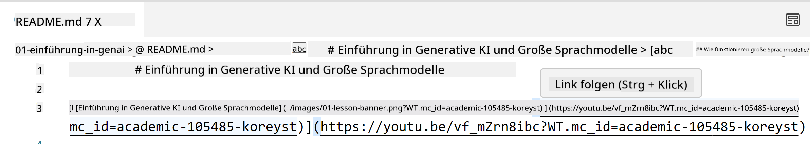
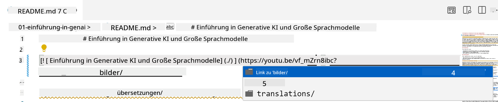
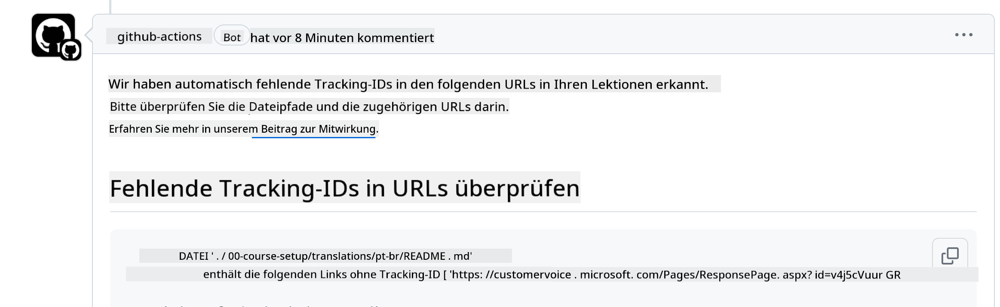
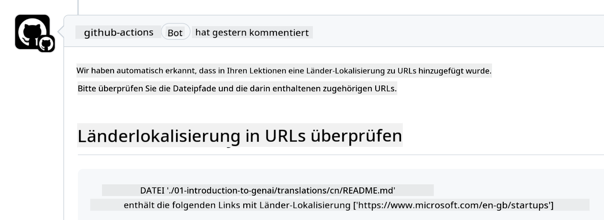

<!--
CO_OP_TRANSLATOR_METADATA:
{
  "original_hash": "57c41f2af71001a2cff9d8eb797cb843",
  "translation_date": "2025-07-09T05:47:59+00:00",
  "source_file": "CONTRIBUTING.md",
  "language_code": "de"
}
-->
# Mitwirken

Dieses Projekt freut sich über Beiträge und Vorschläge. Für die meisten Beiträge müssen Sie einer Contributor License Agreement (CLA) zustimmen, die bestätigt, dass Sie das Recht haben und tatsächlich die Rechte einräumen, Ihre Beiträge zu verwenden. Weitere Informationen finden Sie unter <https://cla.microsoft.com>.

> Wichtig: Bitte verwenden Sie bei der Übersetzung von Texten in diesem Repository keine maschinelle Übersetzung. Wir überprüfen Übersetzungen über die Community, daher sollten Sie nur Übersetzungen in Sprachen anbieten, in denen Sie sicher sind.

Wenn Sie eine Pull-Anfrage einreichen, prüft ein CLA-Bot automatisch, ob Sie eine CLA bereitstellen müssen, und versieht die PR entsprechend (z. B. mit Label oder Kommentar). Folgen Sie einfach den Anweisungen des Bots. Dies müssen Sie nur einmal für alle Repositories tun, die unsere CLA verwenden.

## Verhaltenskodex

Dieses Projekt hat den [Microsoft Open Source Code of Conduct](https://opensource.microsoft.com/codeofconduct/?WT.mc_id=academic-105485-koreyst) übernommen.  
Weitere Informationen finden Sie in den [Code of Conduct FAQ](https://opensource.microsoft.com/codeofconduct/faq/?WT.mc_id=academic-105485-koreyst) oder wenden Sie sich bei weiteren Fragen oder Anmerkungen an [opencode@microsoft.com](mailto:opencode@microsoft.com).

## Frage oder Problem?

Bitte eröffnen Sie keine GitHub-Issues für allgemeine Supportfragen, da die GitHub-Liste für Feature-Anfragen und Fehlerberichte gedacht ist. So können wir tatsächliche Probleme oder Bugs im Code besser verfolgen und die allgemeine Diskussion vom eigentlichen Code trennen.

## Tippfehler, Probleme, Bugs und Beiträge

Wenn Sie Änderungen am Generative AI for Beginners Repository einreichen, beachten Sie bitte folgende Empfehlungen:

* Forken Sie das Repository immer in Ihr eigenes Konto, bevor Sie Änderungen vornehmen  
* Fassen Sie nicht mehrere Änderungen in einer Pull-Anfrage zusammen. Reichen Sie z. B. Fehlerbehebungen und Dokumentationsupdates in separaten PRs ein  
* Wenn Ihre Pull-Anfrage Merge-Konflikte anzeigt, aktualisieren Sie bitte zuerst Ihren lokalen main-Branch, sodass er dem Hauptrepository entspricht, bevor Sie Änderungen vornehmen  
* Wenn Sie eine Übersetzung einreichen, erstellen Sie bitte eine PR für alle übersetzten Dateien, da wir keine Teilübersetzungen akzeptieren  
* Wenn Sie einen Tippfehler oder eine Dokumentationskorrektur einreichen, können Sie Änderungen bei Bedarf in einer einzigen PR zusammenfassen

## Allgemeine Hinweise zum Schreiben

- Stellen Sie sicher, dass alle Ihre URLs in eckigen Klammern stehen, gefolgt von runden Klammern ohne zusätzliche Leerzeichen dazwischen ``.  
- Stellen Sie sicher, dass relative Links (also Links zu anderen Dateien und Ordnern im Repository) mit `./` beginnen, wenn sie sich im aktuellen Arbeitsverzeichnis befinden, oder mit `../`, wenn sie sich im übergeordneten Verzeichnis befinden.  
- Stellen Sie sicher, dass relative Links eine Tracking-ID enthalten (also `?` oder `&` gefolgt von `wt.mc_id=` oder `WT.mc_id=`) am Ende.  
- Stellen Sie sicher, dass URLs von den Domains _github.com, microsoft.com, visualstudio.com, aka.ms und azure.com_ eine Tracking-ID am Ende haben.  
- Stellen Sie sicher, dass Ihre Links keine länderspezifischen Sprachcodes enthalten (z. B. `/en-us/` oder `/en/`).  
- Stellen Sie sicher, dass alle Bilder im Ordner `./images` gespeichert sind.  
- Stellen Sie sicher, dass die Bildnamen beschreibend sind und nur englische Buchstaben, Zahlen und Bindestriche enthalten.

## GitHub Workflows

Wenn Sie eine Pull-Anfrage einreichen, werden vier verschiedene Workflows ausgelöst, um die oben genannten Regeln zu überprüfen.  
Folgen Sie einfach den hier aufgeführten Anweisungen, um die Workflow-Prüfungen zu bestehen.

- [Check Broken Relative Paths](../..)  
- [Check Paths Have Tracking](../..)  
- [Check URLs Have Tracking](../..)  
- [Check URLs Don't Have Locale](../..)

### Check Broken Relative Paths

Dieser Workflow stellt sicher, dass alle relativen Pfade in Ihren Dateien funktionieren.  
Dieses Repository wird auf GitHub Pages bereitgestellt, daher müssen Sie sehr sorgfältig sein, wenn Sie Links eingeben, damit niemand an die falsche Stelle geleitet wird.

Um sicherzustellen, dass Ihre Links richtig funktionieren, verwenden Sie einfach VS Code zur Überprüfung.

Wenn Sie z. B. mit der Maus über einen Link in Ihren Dateien fahren, können Sie den Link mit **Strg + Klick** öffnen.

Wenn Sie auf einen Link klicken und dieser lokal nicht funktioniert, wird der Workflow ebenfalls fehlschlagen und der Link funktioniert auch auf GitHub nicht.

Um das Problem zu beheben, geben Sie den Link am besten mit Hilfe von VS Code ein.

Wenn Sie `./` oder `../` eingeben, schlägt VS Code Ihnen passende Optionen vor.

Wählen Sie den Pfad, indem Sie auf die gewünschte Datei oder den Ordner klicken, so stellen Sie sicher, dass Ihr Pfad nicht fehlerhaft ist.

Sobald Sie den korrekten relativen Pfad hinzugefügt, gespeichert und Ihre Änderungen gepusht haben, wird der Workflow erneut ausgelöst, um Ihre Änderungen zu überprüfen.  
Wenn Sie die Prüfung bestehen, können Sie loslegen.

### Check Paths Have Tracking

Dieser Workflow stellt sicher, dass alle relativen Pfade eine Tracking-ID enthalten.  
Da dieses Repository auf GitHub Pages bereitgestellt wird, müssen wir die Navigation zwischen den Dateien und Ordnern nachverfolgen.

Um sicherzustellen, dass Ihre relativen Pfade eine Tracking-ID enthalten, prüfen Sie, ob am Ende des Pfads `?wt.mc_id=` steht.  
Wenn dies der Fall ist, besteht Ihr Pfad die Prüfung.

Falls nicht, erhalten Sie möglicherweise folgenden Fehler.

Um das Problem zu beheben, öffnen Sie die vom Workflow markierte Datei und fügen Sie die Tracking-ID am Ende der relativen Pfade hinzu.

Sobald Sie die Tracking-ID hinzugefügt, gespeichert und Ihre Änderungen gepusht haben, wird der Workflow erneut ausgelöst, um Ihre Änderungen zu überprüfen.  
Wenn Sie die Prüfung bestehen, können Sie loslegen.

### Check URLs Have Tracking

Dieser Workflow stellt sicher, dass alle Web-URLs eine Tracking-ID enthalten.  
Da dieses Repository für alle zugänglich ist, müssen wir den Zugriff nachverfolgen, um zu wissen, woher der Traffic kommt.

Um sicherzustellen, dass Ihre URLs eine Tracking-ID enthalten, prüfen Sie, ob am Ende der URL `?wt.mc_id=` steht.  
Wenn dies der Fall ist, besteht Ihre URL die Prüfung.

Falls nicht, erhalten Sie möglicherweise folgenden Fehler.

Um das Problem zu beheben, öffnen Sie die vom Workflow markierte Datei und fügen Sie die Tracking-ID am Ende der URLs hinzu.

Sobald Sie die Tracking-ID hinzugefügt, gespeichert und Ihre Änderungen gepusht haben, wird der Workflow erneut ausgelöst, um Ihre Änderungen zu überprüfen.  
Wenn Sie die Prüfung bestehen, können Sie loslegen.

### Check URLs Don't Have Locale

Dieser Workflow stellt sicher, dass keine Web-URL einen länderspezifischen Sprachcode enthält.  
Da dieses Repository weltweit zugänglich ist, dürfen keine länderspezifischen Sprachcodes in URLs enthalten sein.

Um sicherzustellen, dass Ihre URLs keine länderspezifischen Sprachcodes enthalten, prüfen Sie, ob `/en-us/`, `/en/` oder andere Sprachcodes in der URL vorkommen.  
Wenn dies nicht der Fall ist, besteht Ihre URL die Prüfung.

Falls doch, erhalten Sie möglicherweise folgenden Fehler.

Um das Problem zu beheben, öffnen Sie die vom Workflow markierte Datei und entfernen Sie den länderspezifischen Sprachcode aus den URLs.

Sobald Sie den Sprachcode entfernt, gespeichert und Ihre Änderungen gepusht haben, wird der Workflow erneut ausgelöst, um Ihre Änderungen zu überprüfen.  
Wenn Sie die Prüfung bestehen, können Sie loslegen.

Herzlichen Glückwunsch! Wir melden uns so schnell wie möglich mit Feedback zu Ihrem Beitrag zurück.

**Haftungsausschluss**:  
Dieses Dokument wurde mit dem KI-Übersetzungsdienst [Co-op Translator](https://github.com/Azure/co-op-translator) übersetzt. Obwohl wir uns um Genauigkeit bemühen, beachten Sie bitte, dass automatisierte Übersetzungen Fehler oder Ungenauigkeiten enthalten können. Das Originaldokument in seiner Ursprungssprache ist als maßgebliche Quelle zu betrachten. Für wichtige Informationen wird eine professionelle menschliche Übersetzung empfohlen. Wir übernehmen keine Haftung für Missverständnisse oder Fehlinterpretationen, die aus der Nutzung dieser Übersetzung entstehen.