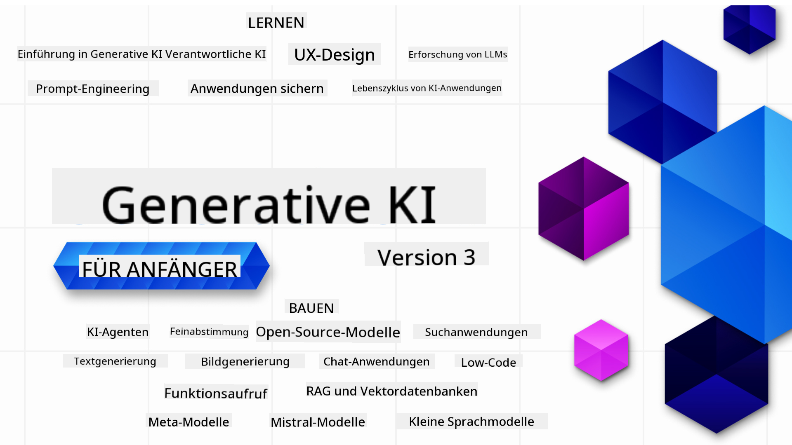

<!--
CO_OP_TRANSLATOR_METADATA:
{
  "original_hash": "ca2afa136ed9aca0634f39f51239746e",
  "translation_date": "2025-08-27T08:08:21+00:00",
  "source_file": "README.md",
  "language_code": "de"
}
-->

### 21 Lektionen, die alles vermitteln, was Sie wissen müssen, um mit dem Aufbau von Generative AI-Anwendungen zu beginnen

  
  
  
  
  

  
  
  

### 🌐 Mehrsprachige Unterstützung

#### Unterstützt durch GitHub Action (Automatisiert & Immer aktuell)

[Französisch](../fr/README.md) | [Spanisch](../es/README.md) | [Deutsch](./README.md) | [Russisch](../ru/README.md) | [Arabisch](../ar/README.md) | [Persisch (Farsi)](../fa/README.md) | [Urdu](../ur/README.md) | [Chinesisch (Vereinfacht)](../zh/README.md) | [Chinesisch (Traditionell, Macau)](../mo/README.md) | [Chinesisch (Traditionell, Hongkong)](../hk/README.md) | [Chinesisch (Traditionell, Taiwan)](../tw/README.md) | [Japanisch](../ja/README.md) | [Koreanisch](../ko/README.md) | [Hindi](../hi/README.md) | [Bengalisch](../bn/README.md) | [Marathi](../mr/README.md) | [Nepalesisch](../ne/README.md) | [Punjabi (Gurmukhi)](../pa/README.md) | [Portugiesisch (Portugal)](../pt/README.md) | [Portugiesisch (Brasilien)](../br/README.md) | [Italienisch](../it/README.md) | [Litauisch](../lt/README.md) | [Polnisch](../pl/README.md) | [Türkisch](../tr/README.md) | [Griechisch](../el/README.md) | [Thailändisch](../th/README.md) | [Schwedisch](../sv/README.md) | [Dänisch](../da/README.md) | [Norwegisch](../no/README.md) | [Finnisch](../fi/README.md) | [Niederländisch](../nl/README.md) | [Hebräisch](../he/README.md) | [Vietnamesisch](../vi/README.md) | [Indonesisch](../id/README.md) | [Malaiisch](../ms/README.md) | [Tagalog (Filipino)](../tl/README.md) | [Suaheli](../sw/README.md) | [Ungarisch](../hu/README.md) | [Tschechisch](../cs/README.md) | [Slowakisch](../sk/README.md) | [Rumänisch](../ro/README.md) | [Bulgarisch](../bg/README.md) | [Serbisch (Kyrillisch)](../sr/README.md) | [Kroatisch](../hr/README.md) | [Slowenisch](../sl/README.md) | [Ukrainisch](../uk/README.md) | [Birmanisch (Myanmar)](../my/README.md)

# Generative AI für Anfänger (Version 3) - Ein Kurs

Lernen Sie die Grundlagen des Aufbaus von Generative AI-Anwendungen mit unserem umfassenden 21-Lektionen-Kurs von Microsoft Cloud Advocates.

## 🌱 Erste Schritte

Dieser Kurs umfasst 21 Lektionen. Jede Lektion behandelt ein eigenes Thema, sodass Sie überall beginnen können!

Die Lektionen sind entweder als "Learn"-Lektionen gekennzeichnet, die ein Konzept der Generative AI erklären, oder als "Build"-Lektionen, die ein Konzept sowie Codebeispiele in **Python** und **TypeScript** (wenn möglich) erläutern.

Für .NET-Entwickler: Schauen Sie sich [Generative AI für Anfänger (.NET Edition)](https://github.com/microsoft/Generative-AI-for-beginners-dotnet?WT.mc_id=academic-105485-koreyst) an!

Jede Lektion enthält auch einen Abschnitt "Keep Learning" mit zusätzlichen Lernressourcen.

## Was Sie benötigen
### Um den Code dieses Kurses auszuführen, können Sie entweder verwenden: 
 - [Azure OpenAI Service](https://aka.ms/genai-beginners/azure-open-ai?WT.mc_id=academic-105485-koreyst) - **Lektionen:** "aoai-assignment"  
 - [GitHub Marketplace Model Catalog](https://aka.ms/genai-beginners/gh-models?WT.mc_id=academic-105485-koreyst) - **Lektionen:** "githubmodels"  
 - [OpenAI API](https://aka.ms/genai-beginners/open-ai?WT.mc_id=academic-105485-koreyst) - **Lektionen:** "oai-assignment"  

- Grundkenntnisse in Python oder TypeScript sind hilfreich - \*Für absolute Anfänger empfehlen wir diese [Python](https://aka.ms/genai-beginners/python?WT.mc_id=academic-105485-koreyst)- und [TypeScript](https://aka.ms/genai-beginners/typescript?WT.mc_id=academic-105485-koreyst)-Kurse  
- Ein GitHub-Konto, um [dieses gesamte Repository zu forken](https://aka.ms/genai-beginners/github?WT.mc_id=academic-105485-koreyst)  

Wir haben eine **[Kurs-Setup](./00-course-setup/README.md?WT.mc_id=academic-105485-koreyst)**-Lektion erstellt, um Ihnen beim Einrichten Ihrer Entwicklungsumgebung zu helfen.

Vergessen Sie nicht, [dieses Repository zu favorisieren (🌟)](https://docs.github.com/en/get-started/exploring-projects-on-github/saving-repositories-with-stars?WT.mc_id=academic-105485-koreyst), um es später leichter zu finden.

## 🧠 Bereit für den Einsatz?

Wenn Sie nach fortgeschritteneren Codebeispielen suchen, schauen Sie sich unsere [Sammlung von Generative AI-Codebeispielen](https://aka.ms/genai-beg-code?WT.mc_id=academic-105485-koreyst) in **Python** und **TypeScript** an.

## 🗣️ Treffen Sie andere Lernende, erhalten Sie Unterstützung

Treten Sie unserem [offiziellen Azure AI Foundry Discord-Server](https://aka.ms/genai-discord?WT.mc_id=academic-105485-koreyst) bei, um andere Lernende dieses Kurses zu treffen und sich zu vernetzen sowie Unterstützung zu erhalten.

Stellen Sie Fragen oder teilen Sie Produktfeedback in unserem [Azure AI Foundry Developer Forum](https://aka.ms/azureaifoundry/forum) auf GitHub.

## 🚀 Ein Startup gründen?

Besuchen Sie [Microsoft for Startups](https://www.microsoft.com/startups), um herauszufinden, wie Sie mit Azure-Guthaben heute starten können.

## 🙏 Möchten Sie helfen?

Haben Sie Vorschläge oder Rechtschreib- oder Codefehler gefunden? [Erstellen Sie ein Issue](https://github.com/microsoft/generative-ai-for-beginners/issues?WT.mc_id=academic-105485-koreyst) oder [erstellen Sie einen Pull-Request](https://github.com/microsoft/generative-ai-for-beginners/pulls?WT.mc_id=academic-105485-koreyst).

## 📂 Jede Lektion enthält:

- Eine kurze Videoeinführung in das Thema  
- Eine schriftliche Lektion im README  
- Python- und TypeScript-Codebeispiele, die Azure OpenAI und OpenAI API unterstützen  
- Links zu zusätzlichen Ressourcen, um Ihr Lernen fortzusetzen  

## 🗃️ Lektionen

| #   | **Lektionslink**                                                                                                                              | **Beschreibung**                                                                                 | **Video**                                                                   | **Zusätzliches Lernen**                                                        |
| --- | -------------------------------------------------------------------------------------------------------------------------------------------- | ----------------------------------------------------------------------------------------------- | --------------------------------------------------------------------------- | ------------------------------------------------------------------------------ |
| 00  | [Kurs-Setup](./00-course-setup/README.md?WT.mc_id=academic-105485-koreyst)                                                                    | **Lernen:** Wie Sie Ihre Entwicklungsumgebung einrichten                                         | Video folgt bald                                                             | [Mehr erfahren](https://aka.ms/genai-collection?WT.mc_id=academic-105485-koreyst) |
| 01  | [Einführung in Generative AI und LLMs](./01-introduction-to-genai/README.md?WT.mc_id=academic-105485-koreyst)                                 | **Lernen:** Verstehen, was Generative AI ist und wie Large Language Models (LLMs) funktionieren | [Video](https://aka.ms/gen-ai-lesson-1-gh?WT.mc_id=academic-105485-koreyst) | [Mehr erfahren](https://aka.ms/genai-collection?WT.mc_id=academic-105485-koreyst) |
| 02  | [Untersuchung und Vergleich verschiedener LLMs](./02-exploring-and-comparing-different-llms/README.md?WT.mc_id=academic-105485-koreyst)       | **Lernen:** Wie Sie das richtige Modell für Ihren Anwendungsfall auswählen                      | [Video](https://aka.ms/gen-ai-lesson2-gh?WT.mc_id=academic-105485-koreyst)  | [Mehr erfahren](https://aka.ms/genai-collection?WT.mc_id=academic-105485-koreyst) |
| 03  | [Verantwortungsvoller Einsatz von Generative AI](./03-using-generative-ai-responsibly/README.md?WT.mc_id=academic-105485-koreyst)             | **Lernen:** Wie man Generative AI-Anwendungen verantwortungsvoll entwickelt                     | [Video](https://aka.ms/gen-ai-lesson3-gh?WT.mc_id=academic-105485-koreyst)  | [Mehr erfahren](https://aka.ms/genai-collection?WT.mc_id=academic-105485-koreyst) |
| 04  | [Grundlagen des Prompt Engineerings verstehen](./04-prompt-engineering-fundamentals/README.md?WT.mc_id=academic-105485-koreyst)               | **Lernen:** Praktische Best Practices für Prompt Engineering                                    | [Video](https://aka.ms/gen-ai-lesson4-gh?WT.mc_id=academic-105485-koreyst)  | [Mehr erfahren](https://aka.ms/genai-collection?WT.mc_id=academic-105485-koreyst) |
| 05  | [Erstellung fortgeschrittener Prompts](./05-advanced-prompts/README.md?WT.mc_id=academic-105485-koreyst)                                      | **Lernen:** Wie man Techniken des Prompt Engineerings anwendet, um bessere Ergebnisse zu erzielen | [Video](https://aka.ms/gen-ai-lesson5-gh?WT.mc_id=academic-105485-koreyst)  | [Mehr erfahren](https://aka.ms/genai-collection?WT.mc_id=academic-105485-koreyst) |
| 06  | [Textgenerierungsanwendungen erstellen](./06-text-generation-apps/README.md?WT.mc_id=academic-105485-koreyst)                                | **Erstellen:** Eine Textgenerierungsanwendung mit Azure OpenAI / OpenAI API                                | [Video](https://aka.ms/gen-ai-lesson6-gh?WT.mc_id=academic-105485-koreyst)  | [Mehr erfahren](https://aka.ms/genai-collection?WT.mc_id=academic-105485-koreyst) |
| 07  | [Chat-Anwendungen erstellen](./07-building-chat-applications/README.md?WT.mc_id=academic-105485-koreyst)                                     | **Erstellen:** Techniken für die effiziente Erstellung und Integration von Chat-Anwendungen               | [Video](https://aka.ms/gen-ai-lessons7-gh?WT.mc_id=academic-105485-koreyst) | [Mehr erfahren](https://aka.ms/genai-collection?WT.mc_id=academic-105485-koreyst) |
| 08  | [Suchanwendungen mit Vektordatenbanken erstellen](./08-building-search-applications/README.md?WT.mc_id=academic-105485-koreyst)                        | **Erstellen:** Eine Suchanwendung, die Embeddings zur Datensuche verwendet                        | [Video](https://aka.ms/gen-ai-lesson8-gh?WT.mc_id=academic-105485-koreyst)  | [Mehr erfahren](https://aka.ms/genai-collection?WT.mc_id=academic-105485-koreyst) |
| 09  | [Bildgenerierungsanwendungen erstellen](./09-building-image-applications/README.md?WT.mc_id=academic-105485-koreyst)                        | **Erstellen:** Eine Bildgenerierungsanwendung                                                       | [Video](https://aka.ms/gen-ai-lesson9-gh?WT.mc_id=academic-105485-koreyst)  | [Mehr erfahren](https://aka.ms/genai-collection?WT.mc_id=academic-105485-koreyst) |
| 10  | [Low-Code KI-Anwendungen erstellen](./10-building-low-code-ai-applications/README.md?WT.mc_id=academic-105485-koreyst)                       | **Erstellen:** Eine generative KI-Anwendung mit Low-Code-Tools                                     | [Video](https://aka.ms/gen-ai-lesson10-gh?WT.mc_id=academic-105485-koreyst) | [Mehr erfahren](https://aka.ms/genai-collection?WT.mc_id=academic-105485-koreyst) |
| 11  | [Externe Anwendungen mit Funktionsaufrufen integrieren](./11-integrating-with-function-calling/README.md?WT.mc_id=academic-105485-koreyst) | **Erstellen:** Was Funktionsaufrufe sind und ihre Anwendungsfälle für Anwendungen                          | [Video](https://aka.ms/gen-ai-lesson11-gh?WT.mc_id=academic-105485-koreyst) | [Mehr erfahren](https://aka.ms/genai-collection?WT.mc_id=academic-105485-koreyst) |
| 12  | [UX für KI-Anwendungen gestalten](./12-designing-ux-for-ai-applications/README.md?WT.mc_id=academic-105485-koreyst)                         | **Lernen:** Wie man UX-Designprinzipien bei der Entwicklung generativer KI-Anwendungen anwendet         | [Video](https://aka.ms/gen-ai-lesson12-gh?WT.mc_id=academic-105485-koreyst) | [Mehr erfahren](https://aka.ms/genai-collection?WT.mc_id=academic-105485-koreyst) |
| 13  | [Generative KI-Anwendungen absichern](./13-securing-ai-applications/README.md?WT.mc_id=academic-105485-koreyst)                         | **Lernen:** Die Bedrohungen und Risiken für KI-Systeme und Methoden, um diese Systeme zu sichern             | [Video](https://aka.ms/gen-ai-lesson13-gh?WT.mc_id=academic-105485-koreyst) | [Mehr erfahren](https://aka.ms/genai-collection?WT.mc_id=academic-105485-koreyst) |
| 14  | [Der Lebenszyklus generativer KI-Anwendungen](./14-the-generative-ai-application-lifecycle/README.md?WT.mc_id=academic-105485-koreyst)           | **Lernen:** Die Werkzeuge und Metriken zur Verwaltung des LLM-Lebenszyklus und LLMOps                         | [Video](https://aka.ms/gen-ai-lesson14-gh?WT.mc_id=academic-105485-koreyst) | [Mehr erfahren](https://aka.ms/genai-collection?WT.mc_id=academic-105485-koreyst) |
| 15  | [Retrieval Augmented Generation (RAG) und Vektordatenbanken](./15-rag-and-vector-databases/README.md?WT.mc_id=academic-105485-koreyst)        | **Erstellen:** Eine Anwendung mit einem RAG-Framework, um Embeddings aus Vektordatenbanken abzurufen  | [Video](https://aka.ms/gen-ai-lesson15-gh?WT.mc_id=academic-105485-koreyst) | [Mehr erfahren](https://aka.ms/genai-collection?WT.mc_id=academic-105485-koreyst) |
| 16  | [Open-Source-Modelle und Hugging Face](./16-open-source-models/README.md?WT.mc_id=academic-105485-koreyst)                                    | **Erstellen:** Eine Anwendung mit Open-Source-Modellen, die auf Hugging Face verfügbar sind                    | [Video](https://aka.ms/gen-ai-lesson16-gh?WT.mc_id=academic-105485-koreyst) | [Mehr erfahren](https://aka.ms/genai-collection?WT.mc_id=academic-105485-koreyst) |
| 17  | [KI-Agenten](./17-ai-agents/README.md?WT.mc_id=academic-105485-koreyst)                                                                       | **Erstellen:** Eine Anwendung mit einem KI-Agenten-Framework                                           | [Video](https://aka.ms/gen-ai-lesson17-gh?WT.mc_id=academic-105485-koreyst) | [Mehr erfahren](https://aka.ms/genai-collection?WT.mc_id=academic-105485-koreyst) |
| 18  | [LLMs feinabstimmen](./18-fine-tuning/README.md?WT.mc_id=academic-105485-koreyst)                                                              | **Lernen:** Das Was, Warum und Wie der Feinabstimmung von LLMs                                            | [Video](https://aka.ms/gen-ai-lesson18-gh?WT.mc_id=academic-105485-koreyst) | [Mehr erfahren](https://aka.ms/genai-collection?WT.mc_id=academic-105485-koreyst) |
| 19  | [Mit SLMs arbeiten](./19-slm/README.md?WT.mc_id=academic-105485-koreyst)                                                              | **Lernen:** Die Vorteile der Arbeit mit Small Language Models                                            | Video kommt bald | [Mehr erfahren](https://aka.ms/genai-collection?WT.mc_id=academic-105485-koreyst) |
| 20  | [Mit Mistral-Modellen arbeiten](./20-mistral/README.md?WT.mc_id=academic-105485-koreyst)                                                              | **Lernen:** Die Eigenschaften und Unterschiede der Mistral-Modellfamilie                                           | Video kommt bald | [Mehr erfahren](https://aka.ms/genai-collection?WT.mc_id=academic-105485-koreyst) |
| 21  | [Mit Meta-Modellen arbeiten](./21-meta/README.md?WT.mc_id=academic-105485-koreyst)                                                              | **Lernen:** Die Eigenschaften und Unterschiede der Meta-Modellfamilie                                           | Video kommt bald | [Mehr erfahren](https://aka.ms/genai-collection?WT.mc_id=academic-105485-koreyst) |

### 🌟 Besonderer Dank

Besonderer Dank an [**John Aziz**](https://www.linkedin.com/in/john0isaac/) für die Erstellung aller GitHub Actions und Workflows.

[**Bernhard Merkle**](https://www.linkedin.com/in/bernhard-merkle-738b73/) für wichtige Beiträge zu jeder Lektion, um die Lernerfahrung und den Code zu verbessern.

## 🎒 Weitere Kurse

Unser Team produziert weitere Kurse! Schau dir folgende an:

- [**NEU** Model Context Protocol für Anfänger](https://github.com/microsoft/mcp-for-beginners)
- [KI-Agenten für Anfänger](https://github.com/microsoft/ai-agents-for-beginners)
- [Generative KI für Anfänger mit .NET](https://github.com/microsoft/Generative-AI-for-beginners-dotnet)
- [Generative KI für Anfänger mit JavaScript](https://aka.ms/genai-js-course)
- [Generative KI für Anfänger mit Java](https://aka.ms/genaijava)
- [ML für Anfänger](https://aka.ms/ml-beginners)
- [Datenwissenschaft für Anfänger](https://aka.ms/datascience-beginners)
- [KI für Anfänger](https://aka.ms/ai-beginners)
- [Cybersicherheit für Anfänger](https://github.com/microsoft/Security-101)
- [Webentwicklung für Anfänger](https://aka.ms/webdev-beginners)
- [IoT für Anfänger](https://aka.ms/iot-beginners)
- [XR-Entwicklung für Anfänger](https://github.com/microsoft/xr-development-for-beginners)
- [GitHub Copilot für KI-gestütztes Programmieren meistern](https://aka.ms/GitHubCopilotAI)
- [GitHub Copilot für C#/.NET-Entwickler meistern](https://github.com/microsoft/mastering-github-copilot-for-dotnet-csharp-developers)
- [Wähle dein eigenes Copilot-Abenteuer](https://github.com/microsoft/CopilotAdventures)

---

**Haftungsausschluss**:  
Dieses Dokument wurde mithilfe des KI-Übersetzungsdienstes [Co-op Translator](https://github.com/Azure/co-op-translator) übersetzt. Obwohl wir uns um Genauigkeit bemühen, weisen wir darauf hin, dass automatisierte Übersetzungen Fehler oder Ungenauigkeiten enthalten können. Das Originaldokument in seiner ursprünglichen Sprache sollte als maßgebliche Quelle betrachtet werden. Für kritische Informationen wird eine professionelle menschliche Übersetzung empfohlen. Wir übernehmen keine Haftung für Missverständnisse oder Fehlinterpretationen, die sich aus der Nutzung dieser Übersetzung ergeben.