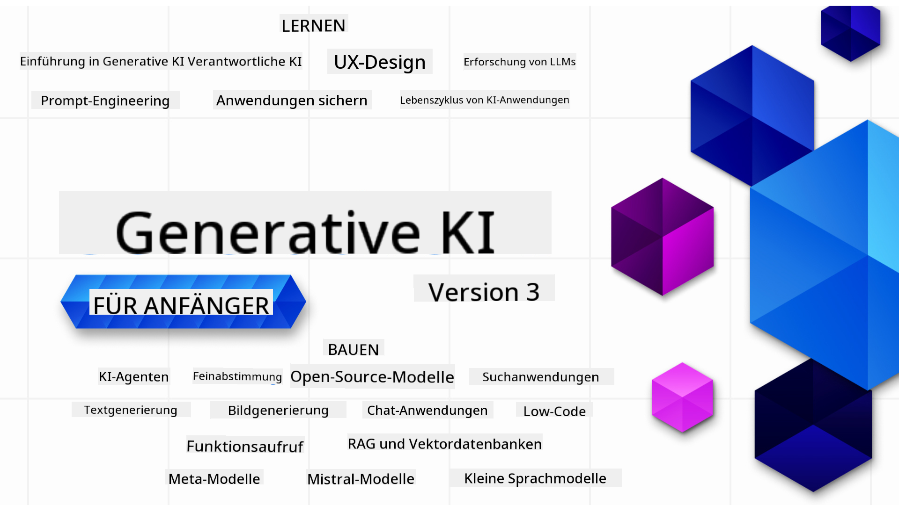

<!--
CO_OP_TRANSLATOR_METADATA:
{
  "original_hash": "6e3f4c8a4f323b8eab1cf11ded304b0f",
  "translation_date": "2025-06-25T07:28:38+00:00",
  "source_file": "README.md",
  "language_code": "de"
}
-->

### 21 Lektionen, die alles lehren, was Sie wissen müssen, um mit dem Erstellen von Generativen KI-Anwendungen zu beginnen

### 🌐 Mehrsprachige Unterstützung

#### Unterstützt durch GitHub Action (Automatisiert & Immer Aktuell)

# Generative KI für Anfänger (Version 3) - Ein Kurs

Lerne die Grundlagen des Aufbaus von Generative KI-Anwendungen mit unserem umfassenden 21-Lektionen-Kurs von Microsoft Cloud Advocates.

## 🌱 Erste Schritte

Dieser Kurs umfasst 21 Lektionen. Jede Lektion behandelt ein eigenes Thema, also starte, wo du möchtest!

Die Lektionen sind entweder als "Learn"-Lektionen gekennzeichnet, die ein Konzept der Generativen KI erklären, oder als "Build"-Lektionen, die ein Konzept und Codebeispiele in **Python** und **TypeScript** erläutern, wann immer möglich.

Für .NET-Entwickler gibt es [Generative KI für Anfänger (.NET Edition)](https://github.com/microsoft/Generative-AI-for-beginners-dotnet?WT.mc_id=academic-105485-koreyst)!

Jede Lektion enthält auch einen Abschnitt "Keep Learning" mit zusätzlichen Lernwerkzeugen.

## Was Du Brauchst
### Um den Code dieses Kurses auszuführen, kannst du entweder verwenden: 
 - [Azure OpenAI Service](https://aka.ms/genai-beginners/azure-open-ai?WT.mc_id=academic-105485-koreyst) - **Lektionen:** "aoai-assignment"
 - [GitHub Marketplace Model Catalog](https://aka.ms/genai-beginners/gh-models?WT.mc_id=academic-105485-koreyst) - **Lektionen:** "githubmodels"
 - [OpenAI API](https://aka.ms/genai-beginners/open-ai?WT.mc_id=academic-105485-koreyst) - **Lektionen:** "oai-assignment" 
   
- Grundkenntnisse in Python oder TypeScript sind hilfreich - \*Für absolute Anfänger gibt es diese [Python](https://aka.ms/genai-beginners/python?WT.mc_id=academic-105485-koreyst) und [TypeScript](https://aka.ms/genai-beginners/typescript?WT.mc_id=academic-105485-koreyst) Kurse
- Ein GitHub-Konto, um [dieses gesamte Repo zu forken](https://aka.ms/genai-beginners/github?WT.mc_id=academic-105485-koreyst) zu deinem eigenen GitHub-Konto

Wir haben eine **[Kurs-Einrichtung](./00-course-setup/README.md?WT.mc_id=academic-105485-koreyst)** Lektion erstellt, um dir bei der Einrichtung deiner Entwicklungsumgebung zu helfen.

Vergiss nicht, [dieses Repo zu favorisieren (🌟)](https://docs.github.com/en/get-started/exploring-projects-on-github/saving-repositories-with-stars?WT.mc_id=academic-105485-koreyst), um es später leichter zu finden.

## 🧠 Bereit für die Bereitstellung?

Wenn du auf der Suche nach fortgeschritteneren Codebeispielen bist, schau dir unsere [Sammlung von Generative KI-Codebeispielen](https://aka.ms/genai-beg-code?WT.mc_id=academic-105485-koreyst) in **Python** und **TypeScript** an.

## 🗣️ Andere Lernende treffen, Unterstützung erhalten

Tritt unserem [offiziellen Azure AI Foundry Discord-Server](https://aka.ms/genai-discord?WT.mc_id=academic-105485-koreyst) bei, um andere Lernende zu treffen und zu vernetzen, die diesen Kurs absolvieren, und Unterstützung zu erhalten.

Stelle Fragen oder teile Produktfeedback in unserem [Azure AI Foundry Developer Forum](https://aka.ms/azureaifoundry/forum) auf Github.

## 🚀 Ein Startup gründen?

Melde dich beim [Microsoft for Startups Founders Hub](https://aka.ms/genai-foundershub?WT.mc_id=academic-105485-koreyst) an, um **kostenlose OpenAI-Credits** und bis zu **150.000 $ für Azure-Credits zu erhalten, um über Azure OpenAI Services auf OpenAI-Modelle zuzugreifen**.

## 🙏 Möchtest du helfen?

Hast du Vorschläge oder Rechtschreib- oder Codefehler gefunden? [Ein Problem melden](https://github.com/microsoft/generative-ai-for-beginners/issues?WT.mc_id=academic-105485-koreyst) oder [Einen Pull-Request erstellen](https://github.com/microsoft/generative-ai-for-beginners/pulls?WT.mc_id=academic-105485-koreyst)

## 📂 Jede Lektion enthält:

- Eine kurze Videoeinführung zum Thema
- Eine schriftliche Lektion im README
- Python- und TypeScript-Codebeispiele, die Azure OpenAI und OpenAI API unterstützen
- Links zu zusätzlichen Ressourcen, um dein Lernen fortzusetzen

## 🗃️ Lektionen

| #   | **Link zur Lektion**                                                                                                                          | **Beschreibung**                                                                                 | **Video**                                                                   | **Zusätzliches Lernen**                                                        |
| --- | -------------------------------------------------------------------------------------------------------------------------------------------- | ----------------------------------------------------------------------------------------------- | --------------------------------------------------------------------------- | ------------------------------------------------------------------------------ |
| 00  | [Kurs-Einrichtung](./00-course-setup/README.md?WT.mc_id=academic-105485-koreyst)                                                              | **Learn:** Wie man seine Entwicklungsumgebung einrichtet                                         | Video kommt bald                                                             | [Mehr erfahren](https://aka.ms/genai-collection?WT.mc_id=academic-105485-koreyst) |
| 01  | [Einführung in Generative KI und LLMs](./01-introduction-to-genai/README.md?WT.mc_id=academic-105485-koreyst)                                | **Learn:** Verstehen, was Generative KI ist und wie große Sprachmodelle (LLMs) funktionieren     | [Video](https://aka.ms/gen-ai-lesson-1-gh?WT.mc_id=academic-105485-koreyst) | [Mehr erfahren](https://aka.ms/genai-collection?WT.mc_id=academic-105485-koreyst) |
| 02  | [Erkundung und Vergleich verschiedener LLMs](./02-exploring-and-comparing-different-llms/README.md?WT.mc_id=academic-105485-koreyst)         | **Learn:** Wie man das richtige Modell für seinen Anwendungsfall auswählt                        | [Video](https://aka.ms/gen-ai-lesson2-gh?WT.mc_id=academic-105485-koreyst)  | [Mehr erfahren](https://aka.ms/genai-collection?WT.mc_id=academic-105485-koreyst) |
| 03  | [Verantwortungsbewusste Nutzung von Generative KI](./03-using-generative-ai-responsibly/README.md?WT.mc_id=academic-105485-koreyst)          | **Learn:** Wie man Generative KI-Anwendungen verantwortungsbewusst erstellt                      | [Video](https://aka.ms/gen-ai-lesson3-gh?WT.mc_id=academic-105485-koreyst)  | [Mehr erfahren](https://aka.ms/genai-collection?WT.mc_id=academic-105485-koreyst) |
| 04  | [Grundlagen des Prompt Engineering verstehen](./04-prompt-engineering-fundamentals/README.md?WT.mc_id=academic-105485-koreyst)               | **Learn:** Praktische Best Practices im Prompt Engineering                                       | [Video](https://aka.ms/gen-ai-lesson4-gh?WT.mc_id=academic-105485-koreyst)  | [Mehr erfahren](https://aka.ms/genai-collection?WT.mc_id=academic-105485-koreyst) |
| 05  | [Erstellen von fortgeschrittenen Prompts](./05-advanced-prompts/README.md?WT.mc_id=academic-105485-koreyst)                                                | **Lernen:** Wie man Techniken des Prompt Engineerings anwendet, um die Ergebnisse Ihrer Prompts zu verbessern. | [Video](https://aka.ms/gen-ai-lesson5-gh?WT.mc_id=academic-105485-koreyst)  | [Mehr erfahren](https://aka.ms/genai-collection?WT.mc_id=academic-105485-koreyst) |
| 06  | [Erstellen von Textgenerierungsanwendungen](./06-text-generation-apps/README.md?WT.mc_id=academic-105485-koreyst)                                | **Erstellen:** Eine Textgenerierungs-App mit Azure OpenAI / OpenAI API                                | [Video](https://aka.ms/gen-ai-lesson6-gh?WT.mc_id=academic-105485-koreyst)  | [Mehr erfahren](https://aka.ms/genai-collection?WT.mc_id=academic-105485-koreyst) |
| 07  | [Erstellen von Chat-Anwendungen](./07-building-chat-applications/README.md?WT.mc_id=academic-105485-koreyst)                                     | **Erstellen:** Techniken zum effizienten Erstellen und Integrieren von Chat-Anwendungen.               | [Video](https://aka.ms/gen-ai-lessons7-gh?WT.mc_id=academic-105485-koreyst) | [Mehr erfahren](https://aka.ms/genai-collection?WT.mc_id=academic-105485-koreyst) |
| 08  | [Erstellen von Suchanwendungen mit Vektordatenbanken](./08-building-search-applications/README.md?WT.mc_id=academic-105485-koreyst)                        | **Erstellen:** Eine Suchanwendung, die Embeddings zur Datensuche verwendet.                        | [Video](https://aka.ms/gen-ai-lesson8-gh?WT.mc_id=academic-105485-koreyst)  | [Mehr erfahren](https://aka.ms/genai-collection?WT.mc_id=academic-105485-koreyst) |
| 09  | [Erstellen von Bildgenerierungsanwendungen](./09-building-image-applications/README.md?WT.mc_id=academic-105485-koreyst)                        | **Erstellen:** Eine Bildgenerierungsanwendung                                                       | [Video](https://aka.ms/gen-ai-lesson9-gh?WT.mc_id=academic-105485-koreyst)  | [Mehr erfahren](https://aka.ms/genai-collection?WT.mc_id=academic-105485-koreyst) |
| 10  | [Erstellen von Low-Code-KI-Anwendungen](./10-building-low-code-ai-applications/README.md?WT.mc_id=academic-105485-koreyst)                       | **Erstellen:** Eine generative KI-Anwendung mit Low-Code-Tools                                     | [Video](https://aka.ms/gen-ai-lesson10-gh?WT.mc_id=academic-105485-koreyst) | [Mehr erfahren](https://aka.ms/genai-collection?WT.mc_id=academic-105485-koreyst) |
| 11  | [Integrieren externer Anwendungen mit Funktionsaufrufen](./11-integrating-with-function-calling/README.md?WT.mc_id=academic-105485-koreyst) | **Erstellen:** Was ist Funktionsaufruf und seine Anwendungsfälle für Anwendungen                          | [Video](https://aka.ms/gen-ai-lesson11-gh?WT.mc_id=academic-105485-koreyst) | [Mehr erfahren](https://aka.ms/genai-collection?WT.mc_id=academic-105485-koreyst) |
| 12  | [Gestaltung von UX für KI-Anwendungen](./12-designing-ux-for-ai-applications/README.md?WT.mc_id=academic-105485-koreyst)                         | **Lernen:** Wie man UX-Design-Prinzipien bei der Entwicklung generativer KI-Anwendungen anwendet         | [Video](https://aka.ms/gen-ai-lesson12-gh?WT.mc_id=academic-105485-koreyst) | [Mehr erfahren](https://aka.ms/genai-collection?WT.mc_id=academic-105485-koreyst) |
| 13  | [Absichern Ihrer generativen KI-Anwendungen](./13-securing-ai-applications/README.md?WT.mc_id=academic-105485-koreyst)                         | **Lernen:** Die Bedrohungen und Risiken für KI-Systeme und Methoden, um diese Systeme zu sichern.             | [Video](https://aka.ms/gen-ai-lesson13-gh?WT.mc_id=academic-105485-koreyst) | [Mehr erfahren](https://aka.ms/genai-collection?WT.mc_id=academic-105485-koreyst) |
| 14  | [Der Lebenszyklus einer generativen KI-Anwendung](./14-the-generative-ai-application-lifecycle/README.md?WT.mc_id=academic-105485-koreyst)           | **Lernen:** Die Werkzeuge und Metriken zur Verwaltung des LLM-Lebenszyklus und LLMOps                         | [Video](https://aka.ms/gen-ai-lesson14-gh?WT.mc_id=academic-105485-koreyst) | [Mehr erfahren](https://aka.ms/genai-collection?WT.mc_id=academic-105485-koreyst) |
| 15  | [Retrieval Augmented Generation (RAG) und Vektordatenbanken](./15-rag-and-vector-databases/README.md?WT.mc_id=academic-105485-koreyst)        | **Erstellen:** Eine Anwendung mit einem RAG-Framework, um Einbettungen aus einer Vektordatenbank abzurufen  | [Video](https://aka.ms/gen-ai-lesson15-gh?WT.mc_id=academic-105485-koreyst) | [Mehr erfahren](https://aka.ms/genai-collection?WT.mc_id=academic-105485-koreyst) |
| 16  | [Open Source Modelle und Hugging Face](./16-open-source-models/README.md?WT.mc_id=academic-105485-koreyst)                                    | **Erstellen:** Eine Anwendung unter Verwendung von Open Source-Modellen, die auf Hugging Face verfügbar sind                    | [Video](https://aka.ms/gen-ai-lesson16-gh?WT.mc_id=academic-105485-koreyst) | [Mehr erfahren](https://aka.ms/genai-collection?WT.mc_id=academic-105485-koreyst) |
| 17  | [KI-Agenten](./17-ai-agents/README.md?WT.mc_id=academic-105485-koreyst)                                                                       | **Erstellen:** Eine Anwendung unter Verwendung eines KI-Agenten-Frameworks                                           | [Video](https://aka.ms/gen-ai-lesson17-gh?WT.mc_id=academic-105485-koreyst) | [Mehr erfahren](https://aka.ms/genai-collection?WT.mc_id=academic-105485-koreyst) |
| 18  | [Feinabstimmung von LLMs](./18-fine-tuning/README.md?WT.mc_id=academic-105485-koreyst)                                                              | **Lernen:** Das Was, Warum und Wie der Feinabstimmung von LLMs                                            | [Video](https://aka.ms/gen-ai-lesson18-gh?WT.mc_id=academic-105485-koreyst) | [Mehr erfahren](https://aka.ms/genai-collection?WT.mc_id=academic-105485-koreyst) |
| 19  | [Erstellen mit SLMs](./19-slm/README.md?WT.mc_id=academic-105485-koreyst)                                                              | **Lernen:** Die Vorteile des Erstellens mit kleinen Sprachmodellen                                            | Video kommt bald | [Mehr erfahren](https://aka.ms/genai-collection?WT.mc_id=academic-105485-koreyst) |
| 20  | [Erstellen mit Mistral-Modellen](./20-mistral/README.md?WT.mc_id=academic-105485-koreyst)                                                              | **Lernen:** Die Merkmale und Unterschiede der Mistral-Familienmodelle                                           | Video kommt bald | [Mehr erfahren](https://aka.ms/genai-collection?WT.mc_id=academic-105485-koreyst) |
| 21  | [Erstellen mit Meta-Modellen](./21-meta/README.md?WT.mc_id=academic-105485-koreyst)                                                              | **Lernen:** Die Merkmale und Unterschiede der Meta-Familienmodelle                                           | Video kommt bald | [Mehr erfahren](https://aka.ms/genai-collection?WT.mc_id=academic-105485-koreyst) |

### 🌟 Besonderer Dank

Besonderer Dank geht an [**John Aziz**](https://www.linkedin.com/in/john0isaac/) für die Erstellung aller GitHub-Aktionen und Workflows.

[**Bernhard Merkle**](https://www.linkedin.com/in/bernhard-merkle-738b73/) für seine wesentlichen Beiträge zu jeder Lektion, um das Lernerlebnis und die Code-Erfahrung zu verbessern.

## 🎒 Andere Kurse

Unser Team produziert weitere Kurse! Schauen Sie sich an:

- [**NEU** Modellkontextprotokoll für Anfänger](https://github.com/microsoft/mcp-for-beginners?WT.mc_id=academic-105485-koreyst)
- [KI-Agenten für Anfänger](https://github.com/microsoft/ai-agents-for-beginners?WT.mc_id=academic-105485-koreyst)
- [Generative KI für Anfänger mit .NET](https://github.com/microsoft/Generative-AI-for-beginners-dotnet?WT.mc_id=academic-105485-koreyst)
- [Generative KI für Anfänger mit JavaScript](https://aka.ms/genai-js-course?WT.mc_id=academic-105485-koreyst)
- [ML für Anfänger](https://aka.ms/ml-beginners?WT.mc_id=academic-105485-koreyst)
- [Datenwissenschaft für Anfänger](https://aka.ms/datascience-beginners?WT.mc_id=academic-105485-koreyst)
- [KI für Anfänger](https://aka.ms/ai-beginners?WT.mc_id=academic-105485-koreyst)
- [Cybersicherheit für Anfänger](https://github.com/microsoft/Security-101??WT.mc_id=academic-96948-sayoung)
- [Webentwicklung für Anfänger](https://aka.ms/webdev-beginners?WT.mc_id=academic-105485-koreyst)
- [IoT für Anfänger](https://aka.ms/iot-beginners?WT.mc_id=academic-105485-koreyst)
- [XR-Entwicklung für Anfänger](https://github.com/microsoft/xr-development-for-beginners?WT.mc_id=academic-105485-koreyst)
- [GitHub Copilot für KI-gestütztes Pair-Programming meistern](https://aka.ms/GitHubCopilotAI?WT.mc_id=academic-105485-koreyst)
- [GitHub Copilot für C#/.NET-Entwickler meistern](https://github.com/microsoft/mastering-github-copilot-for-dotnet-csharp-developers?WT.mc_id=academic-105485-koreyst)
- [Wähle dein eigenes Copilot-Abenteuer](https://github.com/microsoft/CopilotAdventures?WT.mc_id=academic-105485-koreyst)

**Haftungsausschluss**:  
Dieses Dokument wurde mit dem KI-Übersetzungsdienst [Co-op Translator](https://github.com/Azure/co-op-translator) übersetzt. Obwohl wir uns um Genauigkeit bemühen, beachten Sie bitte, dass automatisierte Übersetzungen Fehler oder Ungenauigkeiten enthalten können. Das Originaldokument in seiner ursprünglichen Sprache sollte als maßgebliche Quelle betrachtet werden. Für wichtige Informationen wird eine professionelle menschliche Übersetzung empfohlen. Wir haften nicht für Missverständnisse oder Fehlinterpretationen, die sich aus der Nutzung dieser Übersetzung ergeben.