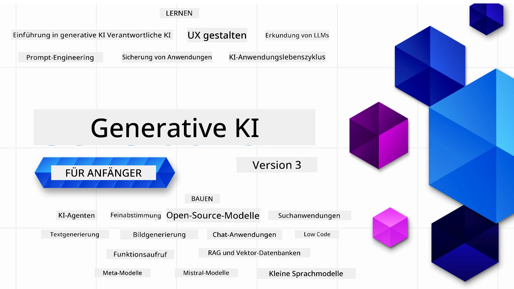

### 21 Lektionen, die alles vermitteln, was Sie wissen müssen, um generative KI-Anwendungen zu entwickeln

[](https://github.com/microsoft/Generative-AI-For-Beginners/blob/master/LICENSE?WT.mc_id=academic-105485-koreyst)
[](https://GitHub.com/microsoft/Generative-AI-For-Beginners/graphs/contributors/?WT.mc_id=academic-105485-koreyst)
[](https://GitHub.com/microsoft/Generative-AI-For-Beginners/issues/?WT.mc_id=academic-105485-koreyst)
[](https://GitHub.com/microsoft/Generative-AI-For-Beginners/pulls/?WT.mc_id=academic-105485-koreyst)
[](http://makeapullrequest.com?WT.mc_id=academic-105485-koreyst)

[](https://GitHub.com/microsoft/Generative-AI-For-Beginners/watchers/?WT.mc_id=academic-105485-koreyst)
[](https://GitHub.com/microsoft/Generative-AI-For-Beginners/network/?WT.mc_id=academic-105485-koreyst)
[](https://GitHub.com/microsoft/Generative-AI-For-Beginners/stargazers/?WT.mc_id=academic-105485-koreyst)

[](https://discord.gg/nTYy5BXMWG)

### 🌐 Mehrsprachige Unterstützung

#### Unterstützt über GitHub Action (Automatisiert & immer aktuell)

<!-- CO-OP TRANSLATOR LANGUAGES TABLE START -->
[Arabisch](../ar/README.md) | [Bengalisch](../bn/README.md) | [Bulgarisch](../bg/README.md) | [Birmanisch (Myanmar)](../my/README.md) | [Chinesisch (Vereinfacht)](../zh-CN/README.md) | [Chinesisch (Traditionell, Hongkong)](../zh-HK/README.md) | [Chinesisch (Traditionell, Macau)](../zh-MO/README.md) | [Chinesisch (Traditionell, Taiwan)](../zh-TW/README.md) | [Kroatisch](../hr/README.md) | [Tschechisch](../cs/README.md) | [Dänisch](../da/README.md) | [Niederländisch](../nl/README.md) | [Estnisch](../et/README.md) | [Finnisch](../fi/README.md) | [Französisch](../fr/README.md) | [Deutsch](./README.md) | [Griechisch](../el/README.md) | [Hebräisch](../he/README.md) | [Hindi](../hi/README.md) | [Ungarisch](../hu/README.md) | [Indonesisch](../id/README.md) | [Italienisch](../it/README.md) | [Japanisch](../ja/README.md) | [Kannada](../kn/README.md) | [Khmer](../km/README.md) | [Koreanisch](../ko/README.md) | [Litauisch](../lt/README.md) | [Malaiisch](../ms/README.md) | [Malayalam](../ml/README.md) | [Marathi](../mr/README.md) | [Nepalesisch](../ne/README.md) | [Nigerianisches Pidgin](../pcm/README.md) | [Norwegisch](../no/README.md) | [Persisch (Farsi)](../fa/README.md) | [Polnisch](../pl/README.md) | [Portugiesisch (Brasilien)](../pt-BR/README.md) | [Portugiesisch (Portugal)](../pt-PT/README.md) | [Punjabi (Gurmukhi)](../pa/README.md) | [Rumänisch](../ro/README.md) | [Russisch](../ru/README.md) | [Serbisch (Kyrillisch)](../sr/README.md) | [Slowakisch](../sk/README.md) | [Slowenisch](../sl/README.md) | [Spanisch](../es/README.md) | [Suaheli](../sw/README.md) | [Schwedisch](../sv/README.md) | [Tagalog (Filipino)](../tl/README.md) | [Tamil](../ta/README.md) | [Telugu](../te/README.md) | [Thailändisch](../th/README.md) | [Türkisch](../tr/README.md) | [Ukrainisch](../uk/README.md) | [Urdu](../ur/README.md) | [Vietnamesisch](../vi/README.md)

> **Möchten Sie lieber lokal klonen?**
>
> Dieses Repository enthält über 50 Sprachübersetzungen, wodurch die Downloadgröße erheblich steigt. Um ohne Übersetzungen zu klonen, verwenden Sie Sparse Checkout:
>
> **Bash / macOS / Linux:**
> ```bash
> git clone --filter=blob:none --sparse https://github.com/microsoft/generative-ai-for-beginners.git
> cd generative-ai-for-beginners
> git sparse-checkout set --no-cone '/*' '!translations' '!translated_images'
> ```
>
> **CMD (Windows):**
> ```cmd
> git clone --filter=blob:none --sparse https://github.com/microsoft/generative-ai-for-beginners.git
> cd generative-ai-for-beginners
> git sparse-checkout set --no-cone "/*" "!translations" "!translated_images"
> ```
>
> Damit erhalten Sie alles, was Sie benötigen, um den Kurs abzuschließen – mit einem viel schnelleren Download.
<!-- CO-OP TRANSLATOR LANGUAGES TABLE END -->

# Generative KI für Anfänger (Version 3) – Ein Kurs

Lernen Sie die Grundlagen des Aufbaus generativer KI-Anwendungen mit unserem umfassenden 21-Lektionen-Kurs von Microsoft Cloud Advocates.

## 🌱 Erste Schritte

Dieser Kurs hat 21 Lektionen. Jede Lektion behandelt ein eigenes Thema, starten Sie also, wo Sie möchten!

Die Lektionen sind entweder „Lern“-Lektionen, die ein Konzept der generativen KI erklären, oder „Baue“-Lektionen, die ein Konzept und Codebeispiele in **Python** und **TypeScript** erklären, wenn möglich.

Für .NET-Entwickler empfehlen wir [Generative AI for Beginners (.NET Edition)](https://github.com/microsoft/Generative-AI-for-beginners-dotnet?WT.mc_id=academic-105485-koreyst)!

Jede Lektion enthält auch einen Abschnitt „Weiter Lernen“ mit zusätzlichen Lernmitteln.

## Was Sie benötigen
### Um den Code dieses Kurses auszuführen, können Sie entweder nutzen: 
 - [Azure OpenAI Service](https://aka.ms/genai-beginners/azure-open-ai?WT.mc_id=academic-105485-koreyst) - **Lektionen:** "aoai-assignment"
 - [GitHub Marketplace Model Catalog](https://aka.ms/genai-beginners/gh-models?WT.mc_id=academic-105485-koreyst) - **Lektionen:** "githubmodels"
 - [OpenAI API](https://aka.ms/genai-beginners/open-ai?WT.mc_id=academic-105485-koreyst) - **Lektionen:** "oai-assignment" 
   
- Grundkenntnisse in Python oder TypeScript sind hilfreich – \*Für absolute Anfänger empfehlen wir diese [Python](https://aka.ms/genai-beginners/python?WT.mc_id=academic-105485-koreyst) und [TypeScript](https://aka.ms/genai-beginners/typescript?WT.mc_id=academic-105485-koreyst) Kurse
- Ein GitHub-Konto, um [dieses gesamte Repository zu forken](https://aka.ms/genai-beginners/github?WT.mc_id=academic-105485-koreyst) in Ihr eigenes GitHub-Konto

Wir haben eine **[Kurseinrichtungs-](./00-course-setup/README.md?WT.mc_id=academic-105485-koreyst)** Lektion erstellt, die Ihnen beim Einrichten Ihrer Entwicklungsumgebung hilft.

Vergessen Sie nicht, [dieses Repository zu bewerten (🌟)](https://docs.github.com/en/get-started/exploring-projects-on-github/saving-repositories-with-stars?WT.mc_id=academic-105485-koreyst), um es später leichter wiederzufinden.

## 🧠 Bereit zur Bereitstellung?

Wenn Sie nach fortgeschritteneren Codebeispielen suchen, schauen Sie sich unsere [Sammlung von generativen KI-Codebeispielen](https://aka.ms/genai-beg-code?WT.mc_id=academic-105485-koreyst) in **Python** und **TypeScript** an.

## 🗣️ Andere Lernende treffen, Support erhalten

Treten Sie unserem [offiziellen Azure AI Foundry Discord Server](https://aka.ms/genai-discord?WT.mc_id=academic-105485-koreyst) bei, um andere Lernende, die diesen Kurs absolvieren, zu treffen und sich zu vernetzen sowie Unterstützung zu erhalten.

Stellen Sie Fragen oder teilen Sie Produktfeedback in unserem [Azure AI Foundry Developer Forum](https://aka.ms/azureaifoundry/forum) auf Github.

## 🚀 Startup gründen?

Besuchen Sie [Microsoft for Startups](https://www.microsoft.com/startups), um zu erfahren, wie Sie noch heute mit Azure-Guthaben loslegen können.

## 🙏 Möchten Sie helfen?

Haben Sie Vorschläge oder Rechtschreib- oder Codefehler gefunden? [Erstellen Sie ein Issue](https://github.com/microsoft/generative-ai-for-beginners/issues?WT.mc_id=academic-105485-koreyst) oder [öffnen Sie einen Pull-Request](https://github.com/microsoft/generative-ai-for-beginners/pulls?WT.mc_id=academic-105485-koreyst)

## 📂 Jede Lektion beinhaltet:

- Eine kurze Videoeinführung zum Thema
- Eine schriftliche Lektion im README
- Python- und TypeScript-Codebeispiele, die Azure OpenAI und OpenAI API unterstützen
- Links zu zusätzlichen Ressourcen, um Ihr Lernen fortzusetzen

## 🗃️ Lektionen

| #   | **Lektionen-Link**                                                                                                                              | **Beschreibung**                                                                                 | **Video**                                                                   | **Zusätzliches Lernen**                                                          |
| --- | -------------------------------------------------------------------------------------------------------------------------------------------- | ----------------------------------------------------------------------------------------------- | --------------------------------------------------------------------------- | ------------------------------------------------------------------------------ |
| 00  | [Kurseinrichtung](./00-course-setup/README.md?WT.mc_id=academic-105485-koreyst)                                                                 | **Lernen:** Wie Sie Ihre Entwicklungsumgebung einrichten                                        | Video steht bald zur Verfügung                                                                 | [Mehr erfahren](https://aka.ms/genai-collection?WT.mc_id=academic-105485-koreyst) |
| 01  | [Einführung in Generative AI und LLMs](./01-introduction-to-genai/README.md?WT.mc_id=academic-105485-koreyst)                              | **Lernen:** Verstehen, was Generative KI ist und wie große Sprachmodelle (LLMs) funktionieren    | [Video](https://aka.ms/gen-ai-lesson-1-gh?WT.mc_id=academic-105485-koreyst) | [Mehr erfahren](https://aka.ms/genai-collection?WT.mc_id=academic-105485-koreyst) |
| 02  | [Unterschiedliche LLMs erkunden und vergleichen](./02-exploring-and-comparing-different-llms/README.md?WT.mc_id=academic-105485-koreyst)             | **Lernen:** Wie man das richtige Modell für den Anwendungsfall auswählt                          | [Video](https://aka.ms/gen-ai-lesson2-gh?WT.mc_id=academic-105485-koreyst)  | [Mehr erfahren](https://aka.ms/genai-collection?WT.mc_id=academic-105485-koreyst) |
| 03  | [Verantwortungsvoller Umgang mit Generativer KI](./03-using-generative-ai-responsibly/README.md?WT.mc_id=academic-105485-koreyst)                           | **Lernen:** Wie man Generative KI-Anwendungen verantwortungsvoll entwickelt                      | [Video](https://aka.ms/gen-ai-lesson3-gh?WT.mc_id=academic-105485-koreyst)  | [Mehr erfahren](https://aka.ms/genai-collection?WT.mc_id=academic-105485-koreyst) |
| 04  | [Grundlagen des Prompt Engineerings verstehen](./04-prompt-engineering-fundamentals/README.md?WT.mc_id=academic-105485-koreyst)             | **Lernen:** Praktische Best Practices im Prompt Engineering                                     | [Video](https://aka.ms/gen-ai-lesson4-gh?WT.mc_id=academic-105485-koreyst)  | [Mehr erfahren](https://aka.ms/genai-collection?WT.mc_id=academic-105485-koreyst) |
| 05  | [Fortgeschrittene Prompts erstellen](./05-advanced-prompts/README.md?WT.mc_id=academic-105485-koreyst)                                          | **Lernen:** Wie man Prompt Engineering Techniken anwendet, die das Ergebnis der Prompts verbessern | [Video](https://aka.ms/gen-ai-lesson5-gh?WT.mc_id=academic-105485-koreyst)  | [Mehr erfahren](https://aka.ms/genai-collection?WT.mc_id=academic-105485-koreyst) |
| 06  | [Textgenerierungsanwendungen erstellen](./06-text-generation-apps/README.md?WT.mc_id=academic-105485-koreyst)                                   | **Erstellen:** Eine Textgenerierungs-App mit Azure OpenAI / OpenAI API                         | [Video](https://aka.ms/gen-ai-lesson6-gh?WT.mc_id=academic-105485-koreyst)  | [Mehr erfahren](https://aka.ms/genai-collection?WT.mc_id=academic-105485-koreyst) |
| 07  | [Chat-Anwendungen erstellen](./07-building-chat-applications/README.md?WT.mc_id=academic-105485-koreyst)                                          | **Erstellen:** Techniken zum effizienten Erstellen und Integrieren von Chat-Anwendungen       | [Video](https://aka.ms/gen-ai-lessons7-gh?WT.mc_id=academic-105485-koreyst) | [Mehr erfahren](https://aka.ms/genai-collection?WT.mc_id=academic-105485-koreyst) |
| 08  | [Suchanwendungen mit Vektordatenbanken erstellen](./08-building-search-applications/README.md?WT.mc_id=academic-105485-koreyst)                 | **Erstellen:** Eine Suchanwendung, die Embeddings verwendet, um Daten zu suchen               | [Video](https://aka.ms/gen-ai-lesson8-gh?WT.mc_id=academic-105485-koreyst)  | [Mehr erfahren](https://aka.ms/genai-collection?WT.mc_id=academic-105485-koreyst) |
| 09  | [Bildgenerierungsanwendungen erstellen](./09-building-image-applications/README.md?WT.mc_id=academic-105485-koreyst)                             | **Erstellen:** Eine Anwendung zur Bildgenerierung                                            | [Video](https://aka.ms/gen-ai-lesson9-gh?WT.mc_id=academic-105485-koreyst)  | [Mehr erfahren](https://aka.ms/genai-collection?WT.mc_id=academic-105485-koreyst) |
| 10  | [Low-Code KI-Anwendungen erstellen](./10-building-low-code-ai-applications/README.md?WT.mc_id=academic-105485-koreyst)                           | **Erstellen:** Eine generative KI-Anwendung mit Low-Code-Tools                              | [Video](https://aka.ms/gen-ai-lesson10-gh?WT.mc_id=academic-105485-koreyst) | [Mehr erfahren](https://aka.ms/genai-collection?WT.mc_id=academic-105485-koreyst) |
| 11  | [Externe Anwendungen mit Function Calling integrieren](./11-integrating-with-function-calling/README.md?WT.mc_id=academic-105485-koreyst)        | **Erstellen:** Was ist Function Calling und Einsatzmöglichkeiten für Anwendungen             | [Video](https://aka.ms/gen-ai-lesson11-gh?WT.mc_id=academic-105485-koreyst) | [Mehr erfahren](https://aka.ms/genai-collection?WT.mc_id=academic-105485-koreyst) |
| 12  | [UX für KI-Anwendungen gestalten](./12-designing-ux-for-ai-applications/README.md?WT.mc_id=academic-105485-koreyst)                              | **Lernen:** Wie man UX-Design-Prinzipien bei der Entwicklung generativer KI-Anwendungen anwendet | [Video](https://aka.ms/gen-ai-lesson12-gh?WT.mc_id=academic-105485-koreyst) | [Mehr erfahren](https://aka.ms/genai-collection?WT.mc_id=academic-105485-koreyst) |
| 13  | [Sicherung Ihrer Generativen KI-Anwendungen](./13-securing-ai-applications/README.md?WT.mc_id=academic-105485-koreyst)                          | **Lernen:** Die Bedrohungen und Risiken für KI-Systeme und Methoden zu deren Absicherung       | [Video](https://aka.ms/gen-ai-lesson13-gh?WT.mc_id=academic-105485-koreyst) | [Mehr erfahren](https://aka.ms/genai-collection?WT.mc_id=academic-105485-koreyst) |
| 14  | [Der Lebenszyklus von Generativen KI-Anwendungen](./14-the-generative-ai-application-lifecycle/README.md?WT.mc_id=academic-105485-koreyst)      | **Lernen:** Werkzeuge und Kennzahlen zur Verwaltung des LLM-Lebenszyklus und LLMOps          | [Video](https://aka.ms/gen-ai-lesson14-gh?WT.mc_id=academic-105485-koreyst) | [Mehr erfahren](https://aka.ms/genai-collection?WT.mc_id=academic-105485-koreyst) |
| 15  | [Retrieval Augmented Generation (RAG) und Vektordatenbanken](./15-rag-and-vector-databases/README.md?WT.mc_id=academic-105485-koreyst)         | **Erstellen:** Eine Anwendung mit einem RAG-Framework, das Embeddings aus einer Vektordatenbank abruft | [Video](https://aka.ms/gen-ai-lesson15-gh?WT.mc_id=academic-105485-koreyst) | [Mehr erfahren](https://aka.ms/genai-collection?WT.mc_id=academic-105485-koreyst) |
| 16  | [Open Source Modelle und Hugging Face](./16-open-source-models/README.md?WT.mc_id=academic-105485-koreyst)                                       | **Erstellen:** Eine Anwendung unter Verwendung von Open Source Modellen auf Hugging Face     | [Video](https://aka.ms/gen-ai-lesson16-gh?WT.mc_id=academic-105485-koreyst) | [Mehr erfahren](https://aka.ms/genai-collection?WT.mc_id=academic-105485-koreyst) |
| 17  | [KI-Agenten](./17-ai-agents/README.md?WT.mc_id=academic-105485-koreyst)                                                                        | **Erstellen:** Eine Anwendung unter Verwendung eines KI-Agenten-Frameworks                   | [Video](https://aka.ms/gen-ai-lesson17-gh?WT.mc_id=academic-105485-koreyst) | [Mehr erfahren](https://aka.ms/genai-collection?WT.mc_id=academic-105485-koreyst) |
| 18  | [Feinabstimmung von LLMs](./18-fine-tuning/README.md?WT.mc_id=academic-105485-koreyst)                                                         | **Lernen:** Das Was, Warum und Wie der Feinabstimmung von LLMs                              | [Video](https://aka.ms/gen-ai-lesson18-gh?WT.mc_id=academic-105485-koreyst) | [Mehr erfahren](https://aka.ms/genai-collection?WT.mc_id=academic-105485-koreyst) |
| 19  | [Erstellen mit SLMs](./19-slm/README.md?WT.mc_id=academic-105485-koreyst)                                                                      | **Lernen:** Die Vorteile beim Erstellen mit Small Language Models                           | Video demnächst verfügbar | [Mehr erfahren](https://aka.ms/genai-collection?WT.mc_id=academic-105485-koreyst) |
| 20  | [Erstellen mit Mistral-Modellen](./20-mistral/README.md?WT.mc_id=academic-105485-koreyst)                                                      | **Lernen:** Die Merkmale und Unterschiede der Mistral-Familienmodelle                      | Video demnächst verfügbar | [Mehr erfahren](https://aka.ms/genai-collection?WT.mc_id=academic-105485-koreyst) |
| 21  | [Erstellen mit Meta-Modellen](./21-meta/README.md?WT.mc_id=academic-105485-koreyst)                                                            | **Lernen:** Die Merkmale und Unterschiede der Meta-Familienmodelle                         | Video demnächst verfügbar | [Mehr erfahren](https://aka.ms/genai-collection?WT.mc_id=academic-105485-koreyst) |

### 🌟 Besonderer Dank

Besonderer Dank an [**John Aziz**](https://www.linkedin.com/in/john0isaac/) für die Erstellung aller GitHub Actions und Workflows

[**Bernhard Merkle**](https://www.linkedin.com/in/bernhard-merkle-738b73/) für wichtige Beiträge zu jeder Lektion zur Verbesserung der Lern- und Codeerfahrung.

## 🎒 Andere Kurse

Unser Team produziert weitere Kurse! Schau dir an:

<!-- CO-OP TRANSLATOR OTHER COURSES START -->
### LangChain
[](https://aka.ms/langchain4j-for-beginners)
[](https://aka.ms/langchainjs-for-beginners?WT.mc_id=m365-94501-dwahlin)
[](https://github.com/microsoft/langchain-for-beginners?WT.mc_id=m365-94501-dwahlin)
---

### Azure / Edge / MCP / Agents
[](https://github.com/microsoft/AZD-for-beginners?WT.mc_id=academic-105485-koreyst)
[](https://github.com/microsoft/edgeai-for-beginners?WT.mc_id=academic-105485-koreyst)
[](https://github.com/microsoft/mcp-for-beginners?WT.mc_id=academic-105485-koreyst)
[](https://github.com/microsoft/ai-agents-for-beginners?WT.mc_id=academic-105485-koreyst)

---
 
### Generative KI-Reihe
[](https://github.com/microsoft/generative-ai-for-beginners?WT.mc_id=academic-105485-koreyst)
[-9333EA?style=for-the-badge&labelColor=E5E7EB&color=9333EA)](https://github.com/microsoft/Generative-AI-for-beginners-dotnet?WT.mc_id=academic-105485-koreyst)
[-C084FC?style=for-the-badge&labelColor=E5E7EB&color=C084FC)](https://github.com/microsoft/generative-ai-for-beginners-java?WT.mc_id=academic-105485-koreyst)
[-E879F9?style=for-the-badge&labelColor=E5E7EB&color=E879F9)](https://github.com/microsoft/generative-ai-with-javascript?WT.mc_id=academic-105485-koreyst)

---
 
### Kernlernen
[](https://aka.ms/ml-beginners?WT.mc_id=academic-105485-koreyst)
[](https://aka.ms/datascience-beginners?WT.mc_id=academic-105485-koreyst)
[](https://aka.ms/ai-beginners?WT.mc_id=academic-105485-koreyst)
[](https://github.com/microsoft/Security-101?WT.mc_id=academic-96948-sayoung)
[](https://aka.ms/webdev-beginners?WT.mc_id=academic-105485-koreyst)
[](https://aka.ms/iot-beginners?WT.mc_id=academic-105485-koreyst)
[](https://github.com/microsoft/xr-development-for-beginners?WT.mc_id=academic-105485-koreyst)

---
 
### Copilot-Reihe
[](https://aka.ms/GitHubCopilotAI?WT.mc_id=academic-105485-koreyst)
[](https://github.com/microsoft/mastering-github-copilot-for-dotnet-csharp-developers?WT.mc_id=academic-105485-koreyst)
[](https://github.com/microsoft/CopilotAdventures?WT.mc_id=academic-105485-koreyst)
<!-- CO-OP TRANSLATOR OTHER COURSES END -->

## Hilfe erhalten

Wenn Sie feststecken oder Fragen zum Erstellen von KI-Anwendungen haben. Treten Sie anderen Lernenden und erfahrenen Entwicklern bei und diskutieren Sie über MCP. Es ist eine unterstützende Gemeinschaft, in der Fragen willkommen sind und Wissen frei geteilt wird.

[](https://discord.gg/nTYy5BXMWG)

Wenn Sie Produkt-Feedback oder Fehler während der Entwicklung haben, besuchen Sie:

[](https://aka.ms/foundry/forum)

---

<!-- CO-OP TRANSLATOR DISCLAIMER START -->
**Haftungsausschluss**:  
Dieses Dokument wurde mithilfe des KI-Übersetzungsdienstes [Co-op Translator](https://github.com/Azure/co-op-translator) übersetzt. Obwohl wir bemüht sind, Genauigkeit zu gewährleisten, bitten wir um Verständnis, dass automatisierte Übersetzungen Fehler oder Ungenauigkeiten enthalten können. Das Originaldokument in der Ausgangssprache gilt als maßgebliche Quelle. Für wichtige Informationen wird eine professionelle menschliche Übersetzung empfohlen. Wir übernehmen keine Haftung für Missverständnisse oder Fehlinterpretationen, die aus der Nutzung dieser Übersetzung entstehen.
<!-- CO-OP TRANSLATOR DISCLAIMER END -->