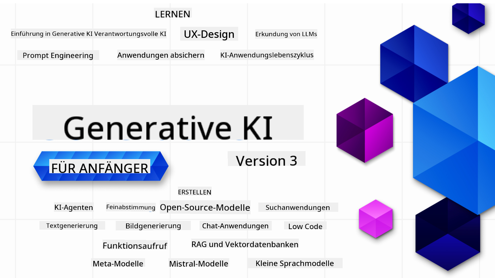

<!--
CO_OP_TRANSLATOR_METADATA:
{
<<<<<<< HEAD
  "original_hash": "2a9df8fbe03cf309776a6730cfb1d2a7",
  "translation_date": "2025-09-29T22:57:17+00:00",
=======
  "original_hash": "ca2afa136ed9aca0634f39f51239746e",
  "translation_date": "2025-08-27T08:08:21+00:00",
>>>>>>> 584a21c5 (Please enter the commit message for your changes. Lines starting)
  "source_file": "README.md",
  "language_code": "de"
}
-->
<<<<<<< HEAD

### 21 Lektionen, die alles lehren, was Sie wissen müssen, um mit dem Aufbau von Generative-KI-Anwendungen zu beginnen

=======

### 21 Lektionen, die alles vermitteln, was Sie wissen müssen, um mit dem Aufbau von Generative AI-Anwendungen zu beginnen

  
  
  
  
  

  
  
  
>>>>>>> 584a21c5 (Please enter the commit message for your changes. Lines starting)

### 🌐 Mehrsprachige Unterstützung

#### Unterstützt durch GitHub Action (Automatisiert & Immer aktuell)

<<<<<<< HEAD
[Französisch](../fr/README.md) | [Spanisch](../es/README.md) | [Deutsch](./README.md) | [Russisch](../ru/README.md) | [Arabisch](../ar/README.md) | [Persisch (Farsi)](../fa/README.md) | [Urdu](../ur/README.md) | [Chinesisch (Vereinfacht)](../zh/README.md) | [Chinesisch (Traditionell, Macau)](../mo/README.md) | [Chinesisch (Traditionell, Hongkong)](../hk/README.md) | [Chinesisch (Traditionell, Taiwan)](../tw/README.md) | [Japanisch](../ja/README.md) | [Koreanisch](../ko/README.md) | [Hindi](../hi/README.md) | [Bengalisch](../bn/README.md) | [Marathi](../mr/README.md) | [Nepalesisch](../ne/README.md) | [Punjabi (Gurmukhi)](../pa/README.md) | [Portugiesisch (Portugal)](../pt/README.md) | [Portugiesisch (Brasilien)](../br/README.md) | [Italienisch](../it/README.md) | [Litauisch](../lt/README.md) | [Polnisch](../pl/README.md) | [Türkisch](../tr/README.md) | [Griechisch](../el/README.md) | [Thailändisch](../th/README.md) | [Schwedisch](../sv/README.md) | [Dänisch](../da/README.md) | [Norwegisch](../no/README.md) | [Finnisch](../fi/README.md) | [Niederländisch](../nl/README.md) | [Hebräisch](../he/README.md) | [Vietnamesisch](../vi/README.md) | [Indonesisch](../id/README.md) | [Malaiisch](../ms/README.md) | [Tagalog (Filipino)](../tl/README.md) | [Swahili](../sw/README.md) | [Ungarisch](../hu/README.md) | [Tschechisch](../cs/README.md) | [Slowakisch](../sk/README.md) | [Rumänisch](../ro/README.md) | [Bulgarisch](../bg/README.md) | [Serbisch (Kyrillisch)](../sr/README.md) | [Kroatisch](../hr/README.md) | [Slowenisch](../sl/README.md) | [Ukrainisch](../uk/README.md) | [Birmanisch (Myanmar)](../my/README.md)

# Generative KI für Anfänger (Version 3) - Ein Kurs

Lernen Sie die Grundlagen des Aufbaus von Generative-KI-Anwendungen mit unserem umfassenden 21-Lektionen-Kurs von Microsoft Cloud Advocates.
=======
[Französisch](../fr/README.md) | [Spanisch](../es/README.md) | [Deutsch](./README.md) | [Russisch](../ru/README.md) | [Arabisch](../ar/README.md) | [Persisch (Farsi)](../fa/README.md) | [Urdu](../ur/README.md) | [Chinesisch (Vereinfacht)](../zh/README.md) | [Chinesisch (Traditionell, Macau)](../mo/README.md) | [Chinesisch (Traditionell, Hongkong)](../hk/README.md) | [Chinesisch (Traditionell, Taiwan)](../tw/README.md) | [Japanisch](../ja/README.md) | [Koreanisch](../ko/README.md) | [Hindi](../hi/README.md) | [Bengalisch](../bn/README.md) | [Marathi](../mr/README.md) | [Nepalesisch](../ne/README.md) | [Punjabi (Gurmukhi)](../pa/README.md) | [Portugiesisch (Portugal)](../pt/README.md) | [Portugiesisch (Brasilien)](../br/README.md) | [Italienisch](../it/README.md) | [Litauisch](../lt/README.md) | [Polnisch](../pl/README.md) | [Türkisch](../tr/README.md) | [Griechisch](../el/README.md) | [Thailändisch](../th/README.md) | [Schwedisch](../sv/README.md) | [Dänisch](../da/README.md) | [Norwegisch](../no/README.md) | [Finnisch](../fi/README.md) | [Niederländisch](../nl/README.md) | [Hebräisch](../he/README.md) | [Vietnamesisch](../vi/README.md) | [Indonesisch](../id/README.md) | [Malaiisch](../ms/README.md) | [Tagalog (Filipino)](../tl/README.md) | [Suaheli](../sw/README.md) | [Ungarisch](../hu/README.md) | [Tschechisch](../cs/README.md) | [Slowakisch](../sk/README.md) | [Rumänisch](../ro/README.md) | [Bulgarisch](../bg/README.md) | [Serbisch (Kyrillisch)](../sr/README.md) | [Kroatisch](../hr/README.md) | [Slowenisch](../sl/README.md) | [Ukrainisch](../uk/README.md) | [Birmanisch (Myanmar)](../my/README.md)

# Generative AI für Anfänger (Version 3) - Ein Kurs

Lernen Sie die Grundlagen des Aufbaus von Generative AI-Anwendungen mit unserem umfassenden 21-Lektionen-Kurs von Microsoft Cloud Advocates.
>>>>>>> 584a21c5 (Please enter the commit message for your changes. Lines starting)

## 🌱 Erste Schritte

Dieser Kurs umfasst 21 Lektionen. Jede Lektion behandelt ein eigenes Thema, sodass Sie überall beginnen können!

<<<<<<< HEAD
Die Lektionen sind entweder als "Learn"-Lektionen gekennzeichnet, die ein Konzept der Generative KI erklären, oder als "Build"-Lektionen, die ein Konzept sowie Codebeispiele in **Python** und **TypeScript** (wenn möglich) erläutern.
=======
Die Lektionen sind entweder als "Learn"-Lektionen gekennzeichnet, die ein Konzept der Generative AI erklären, oder als "Build"-Lektionen, die ein Konzept sowie Codebeispiele in **Python** und **TypeScript** (wenn möglich) erläutern.
>>>>>>> 584a21c5 (Please enter the commit message for your changes. Lines starting)

Für .NET-Entwickler: Schauen Sie sich [Generative AI für Anfänger (.NET Edition)](https://github.com/microsoft/Generative-AI-for-beginners-dotnet?WT.mc_id=academic-105485-koreyst) an!

Jede Lektion enthält auch einen Abschnitt "Keep Learning" mit zusätzlichen Lernressourcen.

## Was Sie benötigen
<<<<<<< HEAD
### Um den Code dieses Kurses auszuführen, können Sie Folgendes verwenden:
 - [Azure OpenAI Service](https://aka.ms/genai-beginners/azure-open-ai?WT.mc_id=academic-105485-koreyst) - **Lektionen:** "aoai-assignment"
 - [GitHub Marketplace Model Catalog](https://aka.ms/genai-beginners/gh-models?WT.mc_id=academic-105485-koreyst) - **Lektionen:** "githubmodels"
 - [OpenAI API](https://aka.ms/genai-beginners/open-ai?WT.mc_id=academic-105485-koreyst) - **Lektionen:** "oai-assignment" 
   
- Grundkenntnisse in Python oder TypeScript sind hilfreich - \*Für absolute Anfänger empfehlen wir diese [Python](https://aka.ms/genai-beginners/python?WT.mc_id=academic-105485-koreyst) und [TypeScript](https://aka.ms/genai-beginners/typescript?WT.mc_id=academic-105485-koreyst) Kurse
- Ein GitHub-Konto, um [dieses gesamte Repository zu forken](https://aka.ms/genai-beginners/github?WT.mc_id=academic-105485-koreyst) und in Ihrem eigenen GitHub-Konto zu speichern

Wir haben eine **[Kurs-Einrichtungslektion](./00-course-setup/README.md?WT.mc_id=academic-105485-koreyst)** erstellt, um Ihnen bei der Einrichtung Ihrer Entwicklungsumgebung zu helfen.

Vergessen Sie nicht, [dieses Repository zu favorisieren (🌟)](https://docs.github.com/en/get-started/exploring-projects-on-github/saving-repositories-with-stars?WT.mc_id=academic-105485-koreyst), um es später leichter zu finden.

## 🧠 Bereit für die Bereitstellung?

Wenn Sie nach fortgeschrittenen Codebeispielen suchen, schauen Sie sich unsere [Sammlung von Generative-KI-Codebeispielen](https://aka.ms/genai-beg-code?WT.mc_id=academic-105485-koreyst) in **Python** und **TypeScript** an.

## 🗣️ Treffen Sie andere Lernende, erhalten Sie Unterstützung

Treten Sie unserem [offiziellen Azure AI Foundry Discord-Server](https://aka.ms/genai-discord?WT.mc_id=academic-105485-koreyst) bei, um andere Lernende kennenzulernen, die diesen Kurs absolvieren, und Unterstützung zu erhalten.
=======
### Um den Code dieses Kurses auszuführen, können Sie entweder verwenden: 
 - [Azure OpenAI Service](https://aka.ms/genai-beginners/azure-open-ai?WT.mc_id=academic-105485-koreyst) - **Lektionen:** "aoai-assignment"  
 - [GitHub Marketplace Model Catalog](https://aka.ms/genai-beginners/gh-models?WT.mc_id=academic-105485-koreyst) - **Lektionen:** "githubmodels"  
 - [OpenAI API](https://aka.ms/genai-beginners/open-ai?WT.mc_id=academic-105485-koreyst) - **Lektionen:** "oai-assignment"  

- Grundkenntnisse in Python oder TypeScript sind hilfreich - \*Für absolute Anfänger empfehlen wir diese [Python](https://aka.ms/genai-beginners/python?WT.mc_id=academic-105485-koreyst)- und [TypeScript](https://aka.ms/genai-beginners/typescript?WT.mc_id=academic-105485-koreyst)-Kurse  
- Ein GitHub-Konto, um [dieses gesamte Repository zu forken](https://aka.ms/genai-beginners/github?WT.mc_id=academic-105485-koreyst)  

Wir haben eine **[Kurs-Setup](./00-course-setup/README.md?WT.mc_id=academic-105485-koreyst)**-Lektion erstellt, um Ihnen beim Einrichten Ihrer Entwicklungsumgebung zu helfen.

Vergessen Sie nicht, [dieses Repository zu favorisieren (🌟)](https://docs.github.com/en/get-started/exploring-projects-on-github/saving-repositories-with-stars?WT.mc_id=academic-105485-koreyst), um es später leichter zu finden.

## 🧠 Bereit für den Einsatz?

Wenn Sie nach fortgeschritteneren Codebeispielen suchen, schauen Sie sich unsere [Sammlung von Generative AI-Codebeispielen](https://aka.ms/genai-beg-code?WT.mc_id=academic-105485-koreyst) in **Python** und **TypeScript** an.

## 🗣️ Treffen Sie andere Lernende, erhalten Sie Unterstützung

Treten Sie unserem [offiziellen Azure AI Foundry Discord-Server](https://aka.ms/genai-discord?WT.mc_id=academic-105485-koreyst) bei, um andere Lernende dieses Kurses zu treffen und sich zu vernetzen sowie Unterstützung zu erhalten.
>>>>>>> 584a21c5 (Please enter the commit message for your changes. Lines starting)

Stellen Sie Fragen oder teilen Sie Produktfeedback in unserem [Azure AI Foundry Developer Forum](https://aka.ms/azureaifoundry/forum) auf GitHub.

## 🚀 Ein Startup gründen?

Besuchen Sie [Microsoft for Startups](https://www.microsoft.com/startups), um herauszufinden, wie Sie mit Azure-Guthaben heute starten können.

## 🙏 Möchten Sie helfen?

<<<<<<< HEAD
Haben Sie Vorschläge oder Fehler in Rechtschreibung oder Code gefunden? [Erstellen Sie ein Issue](https://github.com/microsoft/generative-ai-for-beginners/issues?WT.mc_id=academic-105485-koreyst) oder [reichen Sie einen Pull-Request ein](https://github.com/microsoft/generative-ai-for-beginners/pulls?WT.mc_id=academic-105485-koreyst).

## 📂 Jede Lektion enthält:

- Eine kurze Videoeinführung zum Thema
- Eine schriftliche Lektion im README
- Python- und TypeScript-Codebeispiele, die Azure OpenAI und OpenAI API unterstützen
- Links zu zusätzlichen Ressourcen, um Ihr Lernen fortzusetzen

## 🗃️ Lektionen

| #   | **Link zur Lektion**                                                                                                                          | **Beschreibung**                                                                                 | **Video**                                                                   | **Zusätzliches Lernen**                                                         |
| --- | -------------------------------------------------------------------------------------------------------------------------------------------- | ----------------------------------------------------------------------------------------------- | --------------------------------------------------------------------------- | ------------------------------------------------------------------------------ |
| 00  | [Kurs-Einrichtung](./00-course-setup/README.md?WT.mc_id=academic-105485-koreyst)                                                              | **Lernen:** Wie Sie Ihre Entwicklungsumgebung einrichten                                         | Video kommt bald                                                                 | [Mehr erfahren](https://aka.ms/genai-collection?WT.mc_id=academic-105485-koreyst) |
| 01  | [Einführung in Generative KI und LLMs](./01-introduction-to-genai/README.md?WT.mc_id=academic-105485-koreyst)                                 | **Lernen:** Verstehen, was Generative KI ist und wie Large Language Models (LLMs) funktionieren | [Video](https://aka.ms/gen-ai-lesson-1-gh?WT.mc_id=academic-105485-koreyst) | [Mehr erfahren](https://aka.ms/genai-collection?WT.mc_id=academic-105485-koreyst) |
| 02  | [Untersuchung und Vergleich verschiedener LLMs](./02-exploring-and-comparing-different-llms/README.md?WT.mc_id=academic-105485-koreyst)       | **Lernen:** Wie Sie das richtige Modell für Ihren Anwendungsfall auswählen                      | [Video](https://aka.ms/gen-ai-lesson2-gh?WT.mc_id=academic-105485-koreyst)  | [Mehr erfahren](https://aka.ms/genai-collection?WT.mc_id=academic-105485-koreyst) |
| 03  | [Generative KI verantwortungsvoll nutzen](./03-using-generative-ai-responsibly/README.md?WT.mc_id=academic-105485-koreyst)                    | **Lernen:** Wie man Generative-KI-Anwendungen verantwortungsvoll entwickelt                     | [Video](https://aka.ms/gen-ai-lesson3-gh?WT.mc_id=academic-105485-koreyst)  | [Mehr erfahren](https://aka.ms/genai-collection?WT.mc_id=academic-105485-koreyst) |
| 04  | [Grundlagen des Prompt Engineering verstehen](./04-prompt-engineering-fundamentals/README.md?WT.mc_id=academic-105485-koreyst)                | **Lernen:** Praktische Best Practices für Prompt Engineering                                    | [Video](https://aka.ms/gen-ai-lesson4-gh?WT.mc_id=academic-105485-koreyst)  | [Mehr erfahren](https://aka.ms/genai-collection?WT.mc_id=academic-105485-koreyst) |
| 05  | [Erstellung fortgeschrittener Prompts](./05-advanced-prompts/README.md?WT.mc_id=academic-105485-koreyst)                                      | **Lernen:** Wie man Techniken des Prompt Engineering anwendet, um die Ergebnisse zu verbessern  | [Video](https://aka.ms/gen-ai-lesson5-gh?WT.mc_id=academic-105485-koreyst)  | [Mehr erfahren](https://aka.ms/genai-collection?WT.mc_id=academic-105485-koreyst) |
| 06  | [Textgenerierungsanwendungen erstellen](./06-text-generation-apps/README.md?WT.mc_id=academic-105485-koreyst)                                | **Erstellen:** Eine Textgenerierungsanwendung mit Azure OpenAI / OpenAI API                     | [Video](https://aka.ms/gen-ai-lesson6-gh?WT.mc_id=academic-105485-koreyst)  | [Mehr erfahren](https://aka.ms/genai-collection?WT.mc_id=academic-105485-koreyst) |
| 07  | [Chat-Anwendungen erstellen](./07-building-chat-applications/README.md?WT.mc_id=academic-105485-koreyst)                                     | **Erstellen:** Techniken für effizientes Erstellen und Integrieren von Chat-Anwendungen         | [Video](https://aka.ms/gen-ai-lessons7-gh?WT.mc_id=academic-105485-koreyst) | [Mehr erfahren](https://aka.ms/genai-collection?WT.mc_id=academic-105485-koreyst) |
| 08  | [Suchanwendungen mit Vektordatenbanken erstellen](./08-building-search-applications/README.md?WT.mc_id=academic-105485-koreyst)              | **Erstellen:** Eine Suchanwendung, die Embeddings zur Datensuche verwendet                      | [Video](https://aka.ms/gen-ai-lesson8-gh?WT.mc_id=academic-105485-koreyst)  | [Mehr erfahren](https://aka.ms/genai-collection?WT.mc_id=academic-105485-koreyst) |
| 09  | [Bildgenerierungsanwendungen erstellen](./09-building-image-applications/README.md?WT.mc_id=academic-105485-koreyst)                         | **Erstellen:** Eine Bildgenerierungsanwendung                                                   | [Video](https://aka.ms/gen-ai-lesson9-gh?WT.mc_id=academic-105485-koreyst)  | [Mehr erfahren](https://aka.ms/genai-collection?WT.mc_id=academic-105485-koreyst) |
| 10  | [Low-Code KI-Anwendungen erstellen](./10-building-low-code-ai-applications/README.md?WT.mc_id=academic-105485-koreyst)                       | **Erstellen:** Eine generative KI-Anwendung mit Low-Code-Tools                                  | [Video](https://aka.ms/gen-ai-lesson10-gh?WT.mc_id=academic-105485-koreyst) | [Mehr erfahren](https://aka.ms/genai-collection?WT.mc_id=academic-105485-koreyst) |
| 11  | [Externe Anwendungen mit Funktionsaufrufen integrieren](./11-integrating-with-function-calling/README.md?WT.mc_id=academic-105485-koreyst)   | **Erstellen:** Was Funktionsaufrufe sind und ihre Anwendungsfälle                               | [Video](https://aka.ms/gen-ai-lesson11-gh?WT.mc_id=academic-105485-koreyst) | [Mehr erfahren](https://aka.ms/genai-collection?WT.mc_id=academic-105485-koreyst) |
| 12  | [UX für KI-Anwendungen gestalten](./12-designing-ux-for-ai-applications/README.md?WT.mc_id=academic-105485-koreyst)                          | **Lernen:** Wie man UX-Designprinzipien bei der Entwicklung generativer KI-Anwendungen anwendet | [Video](https://aka.ms/gen-ai-lesson12-gh?WT.mc_id=academic-105485-koreyst) | [Mehr erfahren](https://aka.ms/genai-collection?WT.mc_id=academic-105485-koreyst) |
| 13  | [Generative KI-Anwendungen absichern](./13-securing-ai-applications/README.md?WT.mc_id=academic-105485-koreyst)                              | **Lernen:** Bedrohungen und Risiken für KI-Systeme sowie Methoden zur Absicherung dieser Systeme | [Video](https://aka.ms/gen-ai-lesson13-gh?WT.mc_id=academic-105485-koreyst) | [Mehr erfahren](https://aka.ms/genai-collection?WT.mc_id=academic-105485-koreyst) |
| 14  | [Der Lebenszyklus generativer KI-Anwendungen](./14-the-generative-ai-application-lifecycle/README.md?WT.mc_id=academic-105485-koreyst)       | **Lernen:** Werkzeuge und Metriken zur Verwaltung des LLM-Lebenszyklus und LLMOps               | [Video](https://aka.ms/gen-ai-lesson14-gh?WT.mc_id=academic-105485-koreyst) | [Mehr erfahren](https://aka.ms/genai-collection?WT.mc_id=academic-105485-koreyst) |
| 15  | [Retrieval Augmented Generation (RAG) und Vektordatenbanken](./15-rag-and-vector-databases/README.md?WT.mc_id=academic-105485-koreyst)       | **Erstellen:** Eine Anwendung mit einem RAG-Framework zur Abfrage von Embeddings aus Vektordatenbanken | [Video](https://aka.ms/gen-ai-lesson15-gh?WT.mc_id=academic-105485-koreyst) | [Mehr erfahren](https://aka.ms/genai-collection?WT.mc_id=academic-105485-koreyst) |
| 16  | [Open-Source-Modelle und Hugging Face](./16-open-source-models/README.md?WT.mc_id=academic-105485-koreyst)                                   | **Erstellen:** Eine Anwendung mit Open-Source-Modellen von Hugging Face                         | [Video](https://aka.ms/gen-ai-lesson16-gh?WT.mc_id=academic-105485-koreyst) | [Mehr erfahren](https://aka.ms/genai-collection?WT.mc_id=academic-105485-koreyst) |
| 17  | [KI-Agenten](./17-ai-agents/README.md?WT.mc_id=academic-105485-koreyst)                                                                      | **Erstellen:** Eine Anwendung mit einem KI-Agenten-Framework                                    | [Video](https://aka.ms/gen-ai-lesson17-gh?WT.mc_id=academic-105485-koreyst) | [Mehr erfahren](https://aka.ms/genai-collection?WT.mc_id=academic-105485-koreyst) |
| 18  | [LLMs feinabstimmen](./18-fine-tuning/README.md?WT.mc_id=academic-105485-koreyst)                                                            | **Lernen:** Was, warum und wie man LLMs feinabstimmt                                            | [Video](https://aka.ms/gen-ai-lesson18-gh?WT.mc_id=academic-105485-koreyst) | [Mehr erfahren](https://aka.ms/genai-collection?WT.mc_id=academic-105485-koreyst) |
| 19  | [Mit SLMs arbeiten](./19-slm/README.md?WT.mc_id=academic-105485-koreyst)                                                                    | **Lernen:** Die Vorteile der Arbeit mit Small Language Models                                   | Video kommt bald | [Mehr erfahren](https://aka.ms/genai-collection?WT.mc_id=academic-105485-koreyst) |
| 20  | [Mit Mistral-Modellen arbeiten](./20-mistral/README.md?WT.mc_id=academic-105485-koreyst)                                                    | **Lernen:** Die Eigenschaften und Unterschiede der Mistral-Modellfamilie                       | Video kommt bald | [Mehr erfahren](https://aka.ms/genai-collection?WT.mc_id=academic-105485-koreyst) |
| 21  | [Mit Meta-Modellen arbeiten](./21-meta/README.md?WT.mc_id=academic-105485-koreyst)                                                          | **Lernen:** Die Eigenschaften und Unterschiede der Meta-Modellfamilie                          | Video kommt bald | [Mehr erfahren](https://aka.ms/genai-collection?WT.mc_id=academic-105485-koreyst) |
=======
Haben Sie Vorschläge oder Rechtschreib- oder Codefehler gefunden? [Erstellen Sie ein Issue](https://github.com/microsoft/generative-ai-for-beginners/issues?WT.mc_id=academic-105485-koreyst) oder [erstellen Sie einen Pull-Request](https://github.com/microsoft/generative-ai-for-beginners/pulls?WT.mc_id=academic-105485-koreyst).

## 📂 Jede Lektion enthält:

- Eine kurze Videoeinführung in das Thema  
- Eine schriftliche Lektion im README  
- Python- und TypeScript-Codebeispiele, die Azure OpenAI und OpenAI API unterstützen  
- Links zu zusätzlichen Ressourcen, um Ihr Lernen fortzusetzen  

## 🗃️ Lektionen

| #   | **Lektionslink**                                                                                                                              | **Beschreibung**                                                                                 | **Video**                                                                   | **Zusätzliches Lernen**                                                        |
| --- | -------------------------------------------------------------------------------------------------------------------------------------------- | ----------------------------------------------------------------------------------------------- | --------------------------------------------------------------------------- | ------------------------------------------------------------------------------ |
| 00  | [Kurs-Setup](./00-course-setup/README.md?WT.mc_id=academic-105485-koreyst)                                                                    | **Lernen:** Wie Sie Ihre Entwicklungsumgebung einrichten                                         | Video folgt bald                                                             | [Mehr erfahren](https://aka.ms/genai-collection?WT.mc_id=academic-105485-koreyst) |
| 01  | [Einführung in Generative AI und LLMs](./01-introduction-to-genai/README.md?WT.mc_id=academic-105485-koreyst)                                 | **Lernen:** Verstehen, was Generative AI ist und wie Large Language Models (LLMs) funktionieren | [Video](https://aka.ms/gen-ai-lesson-1-gh?WT.mc_id=academic-105485-koreyst) | [Mehr erfahren](https://aka.ms/genai-collection?WT.mc_id=academic-105485-koreyst) |
| 02  | [Untersuchung und Vergleich verschiedener LLMs](./02-exploring-and-comparing-different-llms/README.md?WT.mc_id=academic-105485-koreyst)       | **Lernen:** Wie Sie das richtige Modell für Ihren Anwendungsfall auswählen                      | [Video](https://aka.ms/gen-ai-lesson2-gh?WT.mc_id=academic-105485-koreyst)  | [Mehr erfahren](https://aka.ms/genai-collection?WT.mc_id=academic-105485-koreyst) |
| 03  | [Verantwortungsvoller Einsatz von Generative AI](./03-using-generative-ai-responsibly/README.md?WT.mc_id=academic-105485-koreyst)             | **Lernen:** Wie man Generative AI-Anwendungen verantwortungsvoll entwickelt                     | [Video](https://aka.ms/gen-ai-lesson3-gh?WT.mc_id=academic-105485-koreyst)  | [Mehr erfahren](https://aka.ms/genai-collection?WT.mc_id=academic-105485-koreyst) |
| 04  | [Grundlagen des Prompt Engineerings verstehen](./04-prompt-engineering-fundamentals/README.md?WT.mc_id=academic-105485-koreyst)               | **Lernen:** Praktische Best Practices für Prompt Engineering                                    | [Video](https://aka.ms/gen-ai-lesson4-gh?WT.mc_id=academic-105485-koreyst)  | [Mehr erfahren](https://aka.ms/genai-collection?WT.mc_id=academic-105485-koreyst) |
| 05  | [Erstellung fortgeschrittener Prompts](./05-advanced-prompts/README.md?WT.mc_id=academic-105485-koreyst)                                      | **Lernen:** Wie man Techniken des Prompt Engineerings anwendet, um bessere Ergebnisse zu erzielen | [Video](https://aka.ms/gen-ai-lesson5-gh?WT.mc_id=academic-105485-koreyst)  | [Mehr erfahren](https://aka.ms/genai-collection?WT.mc_id=academic-105485-koreyst) |
| 06  | [Textgenerierungsanwendungen erstellen](./06-text-generation-apps/README.md?WT.mc_id=academic-105485-koreyst)                                | **Erstellen:** Eine Textgenerierungsanwendung mit Azure OpenAI / OpenAI API                                | [Video](https://aka.ms/gen-ai-lesson6-gh?WT.mc_id=academic-105485-koreyst)  | [Mehr erfahren](https://aka.ms/genai-collection?WT.mc_id=academic-105485-koreyst) |
| 07  | [Chat-Anwendungen erstellen](./07-building-chat-applications/README.md?WT.mc_id=academic-105485-koreyst)                                     | **Erstellen:** Techniken für die effiziente Erstellung und Integration von Chat-Anwendungen               | [Video](https://aka.ms/gen-ai-lessons7-gh?WT.mc_id=academic-105485-koreyst) | [Mehr erfahren](https://aka.ms/genai-collection?WT.mc_id=academic-105485-koreyst) |
| 08  | [Suchanwendungen mit Vektordatenbanken erstellen](./08-building-search-applications/README.md?WT.mc_id=academic-105485-koreyst)                        | **Erstellen:** Eine Suchanwendung, die Embeddings zur Datensuche verwendet                        | [Video](https://aka.ms/gen-ai-lesson8-gh?WT.mc_id=academic-105485-koreyst)  | [Mehr erfahren](https://aka.ms/genai-collection?WT.mc_id=academic-105485-koreyst) |
| 09  | [Bildgenerierungsanwendungen erstellen](./09-building-image-applications/README.md?WT.mc_id=academic-105485-koreyst)                        | **Erstellen:** Eine Bildgenerierungsanwendung                                                       | [Video](https://aka.ms/gen-ai-lesson9-gh?WT.mc_id=academic-105485-koreyst)  | [Mehr erfahren](https://aka.ms/genai-collection?WT.mc_id=academic-105485-koreyst) |
| 10  | [Low-Code KI-Anwendungen erstellen](./10-building-low-code-ai-applications/README.md?WT.mc_id=academic-105485-koreyst)                       | **Erstellen:** Eine generative KI-Anwendung mit Low-Code-Tools                                     | [Video](https://aka.ms/gen-ai-lesson10-gh?WT.mc_id=academic-105485-koreyst) | [Mehr erfahren](https://aka.ms/genai-collection?WT.mc_id=academic-105485-koreyst) |
| 11  | [Externe Anwendungen mit Funktionsaufrufen integrieren](./11-integrating-with-function-calling/README.md?WT.mc_id=academic-105485-koreyst) | **Erstellen:** Was Funktionsaufrufe sind und ihre Anwendungsfälle für Anwendungen                          | [Video](https://aka.ms/gen-ai-lesson11-gh?WT.mc_id=academic-105485-koreyst) | [Mehr erfahren](https://aka.ms/genai-collection?WT.mc_id=academic-105485-koreyst) |
| 12  | [UX für KI-Anwendungen gestalten](./12-designing-ux-for-ai-applications/README.md?WT.mc_id=academic-105485-koreyst)                         | **Lernen:** Wie man UX-Designprinzipien bei der Entwicklung generativer KI-Anwendungen anwendet         | [Video](https://aka.ms/gen-ai-lesson12-gh?WT.mc_id=academic-105485-koreyst) | [Mehr erfahren](https://aka.ms/genai-collection?WT.mc_id=academic-105485-koreyst) |
| 13  | [Generative KI-Anwendungen absichern](./13-securing-ai-applications/README.md?WT.mc_id=academic-105485-koreyst)                         | **Lernen:** Die Bedrohungen und Risiken für KI-Systeme und Methoden, um diese Systeme zu sichern             | [Video](https://aka.ms/gen-ai-lesson13-gh?WT.mc_id=academic-105485-koreyst) | [Mehr erfahren](https://aka.ms/genai-collection?WT.mc_id=academic-105485-koreyst) |
| 14  | [Der Lebenszyklus generativer KI-Anwendungen](./14-the-generative-ai-application-lifecycle/README.md?WT.mc_id=academic-105485-koreyst)           | **Lernen:** Die Werkzeuge und Metriken zur Verwaltung des LLM-Lebenszyklus und LLMOps                         | [Video](https://aka.ms/gen-ai-lesson14-gh?WT.mc_id=academic-105485-koreyst) | [Mehr erfahren](https://aka.ms/genai-collection?WT.mc_id=academic-105485-koreyst) |
| 15  | [Retrieval Augmented Generation (RAG) und Vektordatenbanken](./15-rag-and-vector-databases/README.md?WT.mc_id=academic-105485-koreyst)        | **Erstellen:** Eine Anwendung mit einem RAG-Framework, um Embeddings aus Vektordatenbanken abzurufen  | [Video](https://aka.ms/gen-ai-lesson15-gh?WT.mc_id=academic-105485-koreyst) | [Mehr erfahren](https://aka.ms/genai-collection?WT.mc_id=academic-105485-koreyst) |
| 16  | [Open-Source-Modelle und Hugging Face](./16-open-source-models/README.md?WT.mc_id=academic-105485-koreyst)                                    | **Erstellen:** Eine Anwendung mit Open-Source-Modellen, die auf Hugging Face verfügbar sind                    | [Video](https://aka.ms/gen-ai-lesson16-gh?WT.mc_id=academic-105485-koreyst) | [Mehr erfahren](https://aka.ms/genai-collection?WT.mc_id=academic-105485-koreyst) |
| 17  | [KI-Agenten](./17-ai-agents/README.md?WT.mc_id=academic-105485-koreyst)                                                                       | **Erstellen:** Eine Anwendung mit einem KI-Agenten-Framework                                           | [Video](https://aka.ms/gen-ai-lesson17-gh?WT.mc_id=academic-105485-koreyst) | [Mehr erfahren](https://aka.ms/genai-collection?WT.mc_id=academic-105485-koreyst) |
| 18  | [LLMs feinabstimmen](./18-fine-tuning/README.md?WT.mc_id=academic-105485-koreyst)                                                              | **Lernen:** Das Was, Warum und Wie der Feinabstimmung von LLMs                                            | [Video](https://aka.ms/gen-ai-lesson18-gh?WT.mc_id=academic-105485-koreyst) | [Mehr erfahren](https://aka.ms/genai-collection?WT.mc_id=academic-105485-koreyst) |
| 19  | [Mit SLMs arbeiten](./19-slm/README.md?WT.mc_id=academic-105485-koreyst)                                                              | **Lernen:** Die Vorteile der Arbeit mit Small Language Models                                            | Video kommt bald | [Mehr erfahren](https://aka.ms/genai-collection?WT.mc_id=academic-105485-koreyst) |
| 20  | [Mit Mistral-Modellen arbeiten](./20-mistral/README.md?WT.mc_id=academic-105485-koreyst)                                                              | **Lernen:** Die Eigenschaften und Unterschiede der Mistral-Modellfamilie                                           | Video kommt bald | [Mehr erfahren](https://aka.ms/genai-collection?WT.mc_id=academic-105485-koreyst) |
| 21  | [Mit Meta-Modellen arbeiten](./21-meta/README.md?WT.mc_id=academic-105485-koreyst)                                                              | **Lernen:** Die Eigenschaften und Unterschiede der Meta-Modellfamilie                                           | Video kommt bald | [Mehr erfahren](https://aka.ms/genai-collection?WT.mc_id=academic-105485-koreyst) |
>>>>>>> 584a21c5 (Please enter the commit message for your changes. Lines starting)

### 🌟 Besonderer Dank

Besonderer Dank an [**John Aziz**](https://www.linkedin.com/in/john0isaac/) für die Erstellung aller GitHub Actions und Workflows.

<<<<<<< HEAD
[**Bernhard Merkle**](https://www.linkedin.com/in/bernhard-merkle-738b73/) für wichtige Beiträge zu jeder Lektion, um das Lernerlebnis und die Code-Erfahrung zu verbessern.

## 🎒 Weitere Kurse

Unser Team bietet weitere Kurse an! Schau dir folgende an:

- [**NEU** Edge AI für Anfänger](https://github.com/microsoft/edgeai-for-beginners)
- [Model Context Protocol für Anfänger](https://github.com/microsoft/mcp-for-beginners)
=======
[**Bernhard Merkle**](https://www.linkedin.com/in/bernhard-merkle-738b73/) für wichtige Beiträge zu jeder Lektion, um die Lernerfahrung und den Code zu verbessern.

## 🎒 Weitere Kurse

Unser Team produziert weitere Kurse! Schau dir folgende an:

- [**NEU** Model Context Protocol für Anfänger](https://github.com/microsoft/mcp-for-beginners)
>>>>>>> 584a21c5 (Please enter the commit message for your changes. Lines starting)
- [KI-Agenten für Anfänger](https://github.com/microsoft/ai-agents-for-beginners)
- [Generative KI für Anfänger mit .NET](https://github.com/microsoft/Generative-AI-for-beginners-dotnet)
- [Generative KI für Anfänger mit JavaScript](https://aka.ms/genai-js-course)
- [Generative KI für Anfänger mit Java](https://aka.ms/genaijava)
- [ML für Anfänger](https://aka.ms/ml-beginners)
- [Datenwissenschaft für Anfänger](https://aka.ms/datascience-beginners)
- [KI für Anfänger](https://aka.ms/ai-beginners)
- [Cybersicherheit für Anfänger](https://github.com/microsoft/Security-101)
- [Webentwicklung für Anfänger](https://aka.ms/webdev-beginners)
- [IoT für Anfänger](https://aka.ms/iot-beginners)
- [XR-Entwicklung für Anfänger](https://github.com/microsoft/xr-development-for-beginners)
<<<<<<< HEAD
- [GitHub Copilot meistern für KI-gestütztes Pair Programming](https://aka.ms/GitHubCopilotAI)
- [GitHub Copilot meistern für C#/.NET-Entwickler](https://github.com/microsoft/mastering-github-copilot-for-dotnet-csharp-developers)
=======
- [GitHub Copilot für KI-gestütztes Programmieren meistern](https://aka.ms/GitHubCopilotAI)
- [GitHub Copilot für C#/.NET-Entwickler meistern](https://github.com/microsoft/mastering-github-copilot-for-dotnet-csharp-developers)
>>>>>>> 584a21c5 (Please enter the commit message for your changes. Lines starting)
- [Wähle dein eigenes Copilot-Abenteuer](https://github.com/microsoft/CopilotAdventures)

---

**Haftungsausschluss**:  
<<<<<<< HEAD
Dieses Dokument wurde mit dem KI-Übersetzungsdienst [Co-op Translator](https://github.com/Azure/co-op-translator) übersetzt. Obwohl wir uns um Genauigkeit bemühen, beachten Sie bitte, dass automatisierte Übersetzungen Fehler oder Ungenauigkeiten enthalten können. Das Originaldokument in seiner ursprünglichen Sprache sollte als maßgebliche Quelle betrachtet werden. Für kritische Informationen wird eine professionelle menschliche Übersetzung empfohlen. Wir übernehmen keine Haftung für Missverständnisse oder Fehlinterpretationen, die sich aus der Nutzung dieser Übersetzung ergeben.
=======
Dieses Dokument wurde mithilfe des KI-Übersetzungsdienstes [Co-op Translator](https://github.com/Azure/co-op-translator) übersetzt. Obwohl wir uns um Genauigkeit bemühen, weisen wir darauf hin, dass automatisierte Übersetzungen Fehler oder Ungenauigkeiten enthalten können. Das Originaldokument in seiner ursprünglichen Sprache sollte als maßgebliche Quelle betrachtet werden. Für kritische Informationen wird eine professionelle menschliche Übersetzung empfohlen. Wir übernehmen keine Haftung für Missverständnisse oder Fehlinterpretationen, die sich aus der Nutzung dieser Übersetzung ergeben.
>>>>>>> 584a21c5 (Please enter the commit message for your changes. Lines starting)
