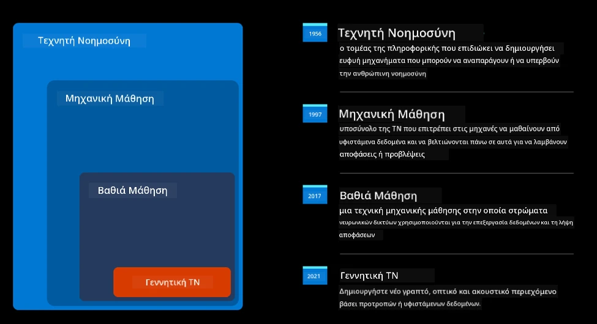
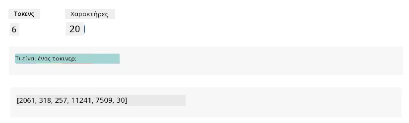
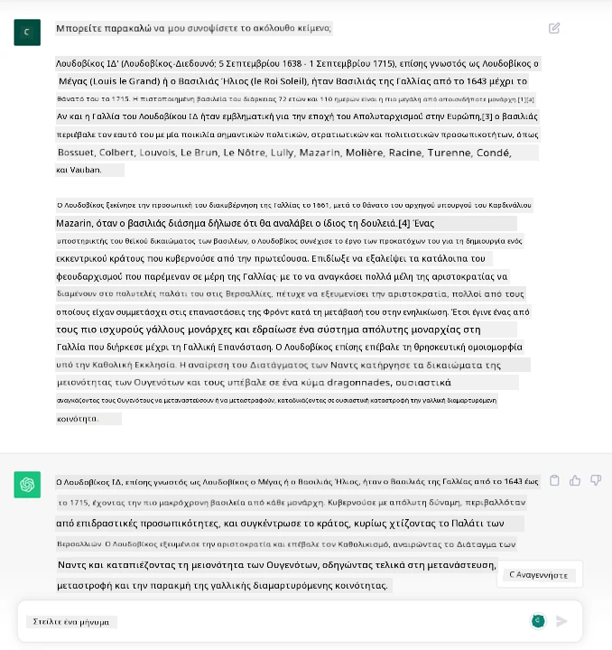
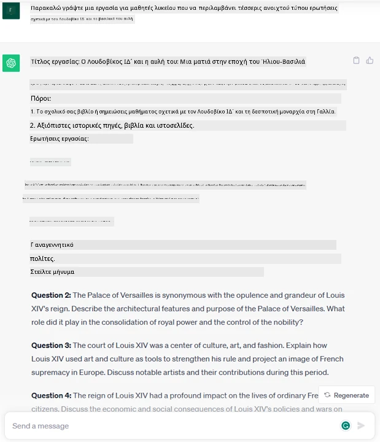
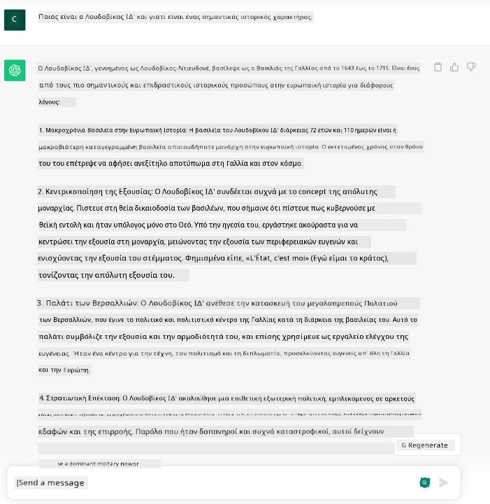
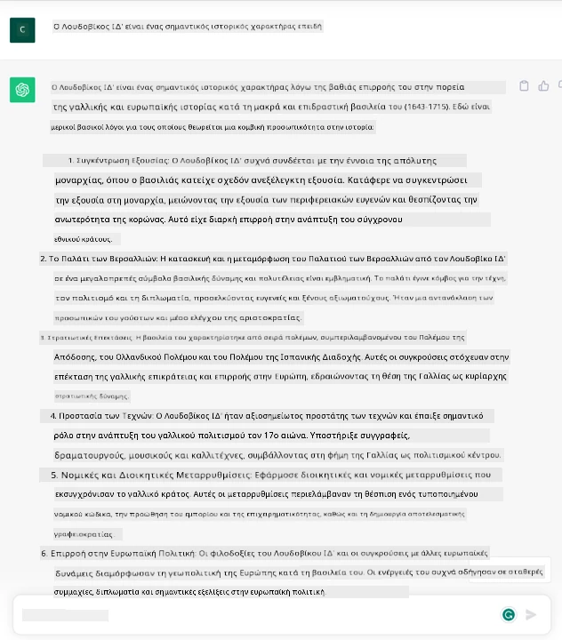
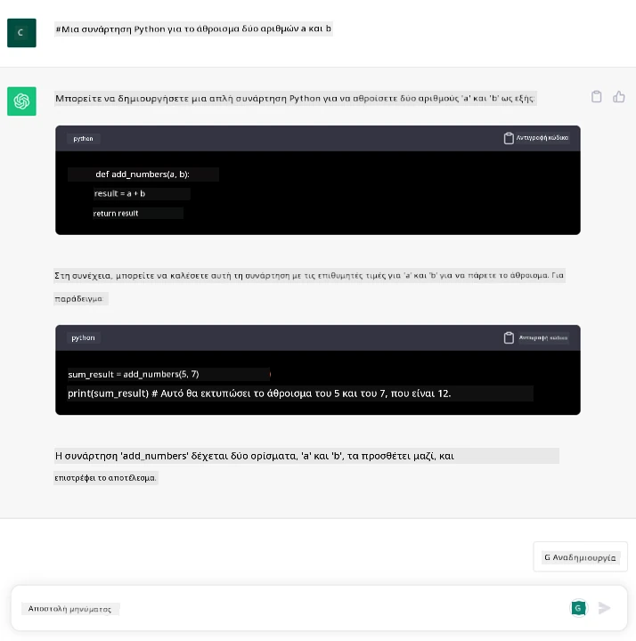

# Εισαγωγή στην Γενετική Τεχνητή Νοημοσύνη και τα Μεγάλα Μοντέλα Γλώσσας

_(Κλικ στην παραπάνω εικόνα για να δείτε το βίντεο αυτού του μαθήματος)_

Η Γενετική Τεχνητή Νοημοσύνη είναι τεχνητή νοημοσύνη ικανή να παράγει κείμενο, εικόνες και άλλους τύπους περιεχομένου. Αυτό που την καθιστά φανταστική τεχνολογία είναι ότι εκδημοκρατικοποιεί την τεχνητή νοημοσύνη, ο καθένας μπορεί να τη χρησιμοποιήσει με ένα κείμενο ως υπόδειξη, μια φράση γραμμένη σε φυσική γλώσσα. Δεν χρειάζεται να μάθετε μια γλώσσα όπως Java ή SQL για να πετύχετε κάτι ουσιαστικό, το μόνο που χρειάζεστε είναι να χρησιμοποιήσετε τη δική σας γλώσσα, να πείτε τι θέλετε και εξέρχεται μια πρόταση από ένα μοντέλο τεχνητής νοημοσύνης. Οι εφαρμογές και η επίδραση αυτής είναι τεράστιες, γράφετε ή κατανοείτε αναφορές, γράφετε εφαρμογές και πολλά άλλα, όλα σε δευτερόλεπτα.

Σε αυτό το πρόγραμμα σπουδών, θα εξερευνήσουμε πώς η startup μας αξιοποιεί τη γενετική AI για να ξεκλειδώσει νέα σενάρια στον κόσμο της εκπαίδευσης και πώς αντιμετωπίζουμε τις αναπόφευκτες προκλήσεις που σχετίζονται με τις κοινωνικές επιπτώσεις της εφαρμογής της και τους περιορισμούς της τεχνολογίας.

## Εισαγωγή

Αυτό το μάθημα θα καλύψει:

- Εισαγωγή στο επιχειρηματικό σενάριο: η ιδέα και η αποστολή της startup μας.
- Τη Γενετική AI και πώς καταλήξαμε στο τρέχον τεχνολογικό τοπίο.
- Τον εσωτερικό μηχανισμό ενός μεγάλου μοντέλου γλώσσας.
- Κύριες ικανότητες και πρακτικές χρήσεις των Μεγάλων Μοντέλων Γλώσσας.

## Στόχοι Μάθησης

Μετά την ολοκλήρωση αυτού του μαθήματος, θα κατανοείτε:

- Τι είναι η γενετική AI και πώς λειτουργούν τα Μεγάλα Μοντέλα Γλώσσας.
- Πώς μπορείτε να αξιοποιήσετε μεγάλα μοντέλα γλώσσας για διάφορες χρήσεις, με έμφαση σε εκπαιδευτικά σενάρια.

## Σενάριο: η εκπαιδευτική μας startup

Η Γενετική Τεχνητή Νοημοσύνη (AI) αντιπροσωπεύει την κορυφή της τεχνολογίας AI, ωθώντας τα όρια του τι θεωρούνταν παλαιότερα αδύνατο. Τα γενετικά μοντέλα AI έχουν πολλές δυνατότητες και εφαρμογές, αλλά για αυτό το πρόγραμμα θα εξερευνήσουμε πώς μεταμορφώνει την εκπαίδευση μέσω μιας φανταστικής startup. Θα αναφερόμαστε σε αυτή την startup ως _η startup μας_. Η startup μας δραστηριοποιείται στον εκπαιδευτικό τομέα με τον φιλόδοξο σκοπό

> _βελτίωση της προσβασιμότητας στη μάθηση, σε παγκόσμια κλίμακα, διασφαλίζοντας ίση πρόσβαση στην εκπαίδευση και παρέχοντας εξατομικευμένες μαθησιακές εμπειρίες σε κάθε μαθητή, ανάλογα με τις ανάγκες του_.

Η ομάδα μας γνωρίζει ότι δεν θα μπορέσουμε να πετύχουμε αυτόν τον στόχο χωρίς να αξιοποιήσουμε ένα από τα πιο ισχυρά εργαλεία της σύγχρονης εποχής – τα Μεγάλα Μοντέλα Γλώσσας (LLMs).

Η Γενετική Τεχνητή Νοημοσύνη αναμένεται να φέρει επανάσταση στον τρόπο με τον οποίο μαθαίνουμε και διδάσκουμε σήμερα, με τους μαθητές να έχουν στη διάθεσή τους εικονικούς δασκάλους 24 ώρες το 24ωρο που παρέχουν τεράστιες ποσότητες πληροφοριών και παραδειγμάτων, και τους καθηγητές να μπορούν να αξιοποιούν καινοτόμα εργαλεία για την αξιολόγηση των μαθητών και την παροχή ανατροφοδότησης.

Για αρχή, ας ορίσουμε βασικές έννοιες και ορολογία που θα χρησιμοποιούμε καθ' όλη τη διάρκεια του προγράμματος.

## Πώς φτάσαμε στη Γενετική AI;

Παρά τον εξαιρετικό _θόρυβο_ που έχει δημιουργηθεί πρόσφατα από τις ανακοινώσεις των γενετικών μοντέλων AI, αυτή η τεχνολογία είναι δεκαετιών, με τις πρώτες ερευνητικές προσπάθειες να χρονολογούνται στη δεκαετία του ’60. Βρισκόμαστε τώρα σε σημείο όπου η AI έχει γνωστικές ικανότητες ανθρώπου, όπως συνομιλία, όπως δείχνουν παραδείγματα όπως το [OpenAI ChatGPT](https://openai.com/chatgpt) ή το [Microsoft Copilot](https://copilot.microsoft.com/?WT.mc_id=academic-105485-koreyst), που επίσης χρησιμοποιεί μοντέλο GPT για την εμπειρία συνομιλίας στην αναζήτηση web.

Ρίχνοντας μια ματιά πίσω, τα πρώτα πρωτότυπα AI αποτελούνταν από πληκτρολογημένα chatbots, βασισμένα σε μια βάση γνώσεων που εξήχθη από ομάδα εμπειρογνωμόνων και αναπαριστάτο σε υπολογιστή. Οι απαντήσεις στη βάση γνώσεων ενεργοποιούνταν από λέξεις-κλειδιά που εμφανίζονταν στο κείμενο εισόδου.
Ωστόσο, σύντομα έγινε εμφανές ότι μια τέτοια προσέγγιση, με πλαστογραφημένα chatbots, δεν κλιμακωνόταν καλά.

### Μια στατιστική προσέγγιση στην AI: Μηχανική Μάθηση

Ένα σημείο καμπής ήρθε τη δεκαετία του ’90, με την εφαρμογή μιας στατιστικής προσέγγισης στην ανάλυση κειμένου. Αυτό οδήγησε στην ανάπτυξη νέων αλγορίθμων – γνωστών ως μηχανική μάθηση – ικανών να μαθαίνουν πρότυπα από δεδομένα χωρίς να προγραμματίζονται ρητά. Αυτή η προσέγγιση επιτρέπει τις μηχανές να προσομοιώνουν την κατανόηση ανθρώπινης γλώσσας: ένα στατιστικό μοντέλο εκπαιδεύεται σε ζεύγη κειμένου-ετικετών, επιτρέποντας στο μοντέλο να ταξινομεί άγνωστο κείμενο εισόδου με προ-ορισμένη ετικέτα που αναπαριστά την πρόθεση του μηνύματος.

### Νευρωνικά δίκτυα και σύγχρονοι εικονικοί βοηθοί

Τα τελευταία χρόνια, η τεχνολογική εξέλιξη του υλικού, ικανός να χειρίζεται μεγαλύτερα δεδομένα και πιο σύνθετους υπολογισμούς, ενθάρρυνε την έρευνα στην AI, οδηγώντας στην ανάπτυξη προηγμένων αλγορίθμων μηχανικής μάθησης γνωστών ως νευρωνικά δίκτυα ή αλγόριθμοι βαθιάς μάθησης.

Τα νευρωνικά δίκτυα (και ιδίως τα Επαναφορατικά Νευρωνικά Δίκτυα – RNNs) αναβάθμισαν σημαντικά την επεξεργασία φυσικής γλώσσας, επιτρέποντας την αναπαράσταση του νοήματος του κειμένου με πιο ουσιαστικό τρόπο, αξιολογώντας το πλαίσιο μιας λέξης μέσα σε μια πρόταση.

Αυτή είναι η τεχνολογία που τροφοδότησε τους εικονικούς βοηθούς που γεννήθηκαν στην πρώτη δεκαετία του νέου αιώνα, πολύ ικανούς στην ερμηνεία της ανθρώπινης γλώσσας, στην αναγνώριση ανάγκης και στην εκτέλεση μιας ενέργειας για να την ικανοποιήσουν – όπως απαντήσεις με προ-ορισμένο σενάριο ή την κατανάλωση μιας υπηρεσίας τρίτου μέρους.

### Σήμερα, Γενετική AI

Έτσι φτάσαμε στη σημερινή Γενετική AI, που μπορεί να θεωρηθεί ως υποσύνολο της βαθιάς μάθησης.

Μετά από δεκαετίες έρευνας στον τομέα της AI, μια νέα αρχιτεκτονική μοντέλου – που ονομάζεται _Transformer_ – ξεπέρασε τους περιορισμούς των RNN, έχοντας τη δυνατότητα να λαμβάνει πολύ μεγαλύτερες ακολουθίες κειμένου ως είσοδο. Οι Transformers βασίζονται στον μηχανισμό προσοχής, που επιτρέπει στο μοντέλο να δίνει διαφορετικά βάρη στις εισόδους που λαμβάνει, ‘εστιάζοντας περισσότερο’ εκεί που συγκεντρώνεται η πιο σχετική πληροφορία, ανεξάρτητα από τη σειρά τους στην ακολουθία κειμένου.

Τα περισσότερα από τα πρόσφατα γενετικά μοντέλα AI – γνωστά και ως Μεγάλα Μοντέλα Γλώσσας (LLMs), επειδή δουλεύουν με κειμενικές εισόδους και εξόδους – βασίζονται πράγματι σε αυτή την αρχιτεκτονική. Αυτό που είναι ενδιαφέρον για αυτά τα μοντέλα – εκπαιδευμένα σε τεράστια ποσά ακατάτακτων δεδομένων από διάφορες πηγές όπως βιβλία, άρθρα και ιστότοπους – είναι ότι μπορούν να προσαρμοστούν σε ποικιλία εργασιών και να παράγουν γραμματικά σωστό κείμενο με μια αίσθηση δημιουργικότητας. Έτσι, όχι μόνο βελτίωσαν απίστευτα την ικανότητα μιας μηχανής να ‘κατανοεί’ ένα κείμενο εισόδου, αλλά επέτρεψαν και την ικανότητά τους να δημιουργούν μια πρωτότυπη απάντηση στη ανθρώπινη γλώσσα.

## Πώς λειτουργούν τα μεγάλα μοντέλα γλώσσας;

Στο επόμενο κεφάλαιο θα εξερευνήσουμε διαφορετικούς τύπους Γενετικών μοντέλων AI, αλλά προς το παρόν ας ρίξουμε μια ματιά στο πώς λειτουργούν τα μεγάλα μοντέλα γλώσσας με έμφαση στα μοντέλα OpenAI GPT (Generative Pre-trained Transformer).

- **Tokenizer, κείμενο σε αριθμούς**: Τα Μεγάλα Μοντέλα Γλώσσας λαμβάνουν ένα κείμενο ως είσοδο και παράγουν ένα κείμενο ως έξοδο. Ωστόσο, ως στατιστικά μοντέλα, δουλεύουν πολύ καλύτερα με αριθμούς παρά με ακολουθίες κειμένου. Γι' αυτό κάθε είσοδος στο μοντέλο επεξεργάζεται από ένα tokenizer, πριν χρησιμοποιηθεί από το βασικό μοντέλο. Ένα token είναι ένα κομμάτι κειμένου – αποτελούμενο από μεταβλητό αριθμό χαρακτήρων, οπότε η κύρια δουλειά του tokenizer είναι να χωρίζει το κείμενο σε μια σειρά από tokens. Στη συνέχεια, κάθε token αντιστοιχίζεται με ένα δείκτη token, που είναι η ακέραια κωδικοποίηση του αρχικού κομματιού κειμένου.

- **Πρόβλεψη tokens εξόδου**: Δίνοντας n tokens ως είσοδο (με max n που ποικίλει από μοντέλο σε μοντέλο), το μοντέλο μπορεί να προβλέψει ένα token ως έξοδο. Αυτό το token ενσωματώνεται τότε στην είσοδο της επόμενης επανάληψης, σε ένα επεκτεινόμενο μοτίβο παραθύρου, επιτρέποντας μια καλύτερη εμπειρία χρήστη με λήψη μιας (ή πολλαπλών) προτάσεων ως απάντηση. Αυτό εξηγεί γιατί, αν έχετε παίξει με το ChatGPT, ίσως έχετε παρατηρήσει ότι μερικές φορές φαίνεται να σταματά στη μέση μιας πρότασης.

- **Διαδικασία επιλογής, κατανομή πιθανότητας**: Το token εξόδου επιλέγεται από το μοντέλο σύμφωνα με την πιθανότητα εμφάνισής του μετά τη τρέχουσα ακολουθία κειμένου. Αυτό συμβαίνει επειδή το μοντέλο προβλέπει μια κατανομή πιθανότητας πάνω σε όλα τα πιθανά ‘επόμενα tokens’, υπολογισμένη βάσει της εκπαίδευσής του. Ωστόσο, δεν επιλέγεται πάντα το token με τη μεγαλύτερη πιθανότητα από την προκύπτουσα κατανομή. Προστίθεται ένα επίπεδο τυχαιότητας σε αυτή την επιλογή, με τέτοιο τρόπο που το μοντέλο λειτουργεί με μη ντετερμινιστικό τρόπο - δεν παίρνουμε την ακριβώς ίδια έξοδο για την ίδια είσοδο. Αυτή η τυχαιότητα προστίθεται για να προσομοιώσει τη διαδικασία δημιουργικής σκέψης και μπορεί να ρυθμιστεί μέσω μιας παραμέτρου του μοντέλου που ονομάζεται θερμοκρασία.

## Πώς μπορεί η startup μας να αξιοποιήσει τα Μεγάλα Μοντέλα Γλώσσας;

Τώρα που έχουμε καλύτερη κατανόηση του εσωτερικού μηχανισμού ενός μεγάλου μοντέλου γλώσσας, ας δούμε μερικά πρακτικά παραδείγματα από τις πιο κοινές εργασίες που μπορούν να εκτελέσουν αρκετά καλά, με έμφαση στο επιχειρηματικό μας σενάριο.
Είπαμε ότι η κύρια ικανότητα ενός Μεγάλου Μοντέλου Γλώσσας είναι _να παράγει κείμενο από το μηδέν, ξεκινώντας από μια κειμενική είσοδο, γραμμένη σε φυσική γλώσσα_.

Αλλά τι είδους κειμενική είσοδο και έξοδο;
Η είσοδος ενός μεγάλου μοντέλου γλώσσας είναι γνωστή ως prompt, ενώ η έξοδος ως completion, όρος που αναφέρεται στον μηχανισμό του μοντέλου να παράγει το επόμενο token για να ολοκληρώσει την τρέχουσα είσοδο. Θα εξερευνήσουμε σε βάθος τι είναι ένα prompt και πώς να το σχεδιάσουμε ώστε να αξιοποιούμε το μοντέλο στο μέγιστο. Αλλά προς το παρόν, ας πούμε μόνο ότι ένα prompt μπορεί να περιλαμβάνει:

- Μια **εντολή** που προσδιορίζει τον τύπο εξόδου που περιμένουμε από το μοντέλο. Αυτή η εντολή μερικές φορές μπορεί να περιλαμβάνει και παραδείγματα ή επιπλέον δεδομένα.

  1. Περίληψη ενός άρθρου, βιβλίου, αξιολογήσεων προϊόντων και άλλα, μαζί με εξαγωγή πληροφοριών από μη δομημένα δεδομένα.
    
    
  
  2. Δημιουργική ιδέα και σχεδιασμός ενός άρθρου, δοκιμίου, εργασίας ή περισσότερων.
      
     

- Μια **ερώτηση**, που τίθεται με τη μορφή συνομιλίας με έναν πράκτορα.
  
  

- Ένα κομμάτι **κειμένου για ολοκλήρωση**, που υποδηλώνει αίτηση για βοήθεια στη συγγραφή.
  
  

- Ένα κομμάτι **κώδικα** μαζί με αίτημα να εξηγηθεί και να τεκμηριωθεί, ή ένα σχόλιο που ζητά να δημιουργηθεί ένα κομμάτι κώδικα που εκτελεί μια συγκεκριμένη εργασία.
  
  

Τα παραπάνω παραδείγματα είναι αρκετά απλά και δεν αποτελούν εξαντλητική επίδειξη των δυνατοτήτων των Μεγάλων Μοντέλων Γλώσσας. Σκοπός τους είναι να δείξουν το δυναμικό χρήσης της γενετικής AI, ειδικά αλλά όχι αποκλειστικά σε εκπαιδευτικά περιβάλλοντα.

Επίσης, η έξοδος ενός μοντέλου γενετικής AI δεν είναι τέλεια και μερικές φορές η δημιουργικότητα του μοντέλου μπορεί να λειτουργήσει εις βάρος του, καταλήγοντας σε μια έξοδο που είναι ένας συνδυασμός λέξεων που ο άνθρωπος χρήστης μπορεί να ερμηνεύσει ως μυθοποίηση της πραγματικότητας, ή μπορεί να είναι προσβλητική. Η γενετική AI δεν είναι ευφυής - τουλάχιστον στην πιο ολοκληρωμένη ορισμό της νοημοσύνης, που περιλαμβάνει κριτική και δημιουργική σκέψη ή συναισθηματική νοημοσύνη· δεν είναι ντετερμινιστική, και δεν είναι αξιόπιστη, αφού ψεύτικες αναφορές, περιεχόμενο και δηλώσεις μπορεί να συνδυαστούν με σωστές πληροφορίες και να παρουσιαστούν με πειστικό και σίγουρο τρόπο. Στα επόμενα μαθήματα θα ασχοληθούμε με όλους αυτούς τους περιορισμούς και θα δούμε τι μπορούμε να κάνουμε για να τους μετριάσουμε.

## Άσκηση

Η άσκησή σας είναι να διαβάσετε περισσότερα για τη [γενετική AI](https://en.wikipedia.org/wiki/Generative_artificial_intelligence?WT.mc_id=academic-105485-koreyst) και να προσπαθήσετε να εντοπίσετε έναν τομέα όπου θα προσθέτατε σήμερα γενετική AI που δεν υπάρχει ήδη. Πώς θα ήταν διαφορετική η επίδραση σε σχέση με τον «παλιό τρόπο», μπορείτε να κάνετε κάτι που δεν μπορούσατε πριν, ή είστε πιο γρήγοροι; Γράψτε μια περίληψη 300 λέξεων για το πώς θα ήταν η ιδανική startup AI σας και συμπεριλάβετε τίτλους όπως "Πρόβλημα", "Πώς θα χρησιμοποιούσα AI", "Επίδραση" και προαιρετικά ένα επιχειρηματικό σχέδιο.

Αν ολοκληρώσατε αυτή την εργασία, ίσως να είστε ακόμα και έτοιμοι να υποβάλετε αίτηση στο incubator της Microsoft, το [Microsoft for Startups Founders Hub](https://www.microsoft.com/startups?WT.mc_id=academic-105485-koreyst) που προσφέρει πιστώσεις για Azure, OpenAI, mentoring και πολλά άλλα, ρίξτε μια ματιά!

## Έλεγχος γνώσεων

Τι ισχύει για τα μεγάλα μοντέλα γλώσσας;

1. Λαμβάνετε την ίδια ακριβώς απάντηση κάθε φορά.
1. Κάνει τα πράγματα τέλεια, είναι εξαιρετικό σε υπολογισμούς αριθμών, παράγει λειτουργικό κώδικα κ.ά.
1. Η απάντηση μπορεί να ποικίλει παρά τη χρήση του ίδιου prompt. Είναι επίσης εξαιρετικό στο να σας δίνει ένα πρώτο σχέδιο κάτι, είτε είναι κείμενο είτε κώδικας. Αλλά χρειάζεται να βελτιώνετε τα αποτελέσματα.

Α: 3, ένα LLM είναι μη ντετερμινιστικό, η απόκριση διαφέρει, όμως μπορείτε να ελέγξετε τη διακύμανσή του μέσω της ρύθμισης θερμοκρασίας. Επίσης δεν πρέπει να περιμένετε να κάνει τα πράγματα τέλεια, είναι εδώ για να κάνει τη βαριά δουλειά, που συχνά σημαίνει ότι λαμβάνετε μια καλή πρώτη προσπάθεια για κάτι που χρειάζεται να βελτιώσετε σταδιακά.

## Μπράβο! Συνεχίστε το ταξίδι

Μετά την ολοκλήρωση αυτού του μαθήματος, ρίξτε μια ματιά στη [Συλλογή Μάθησης για Γενετική AI](https://aka.ms/genai-collection?WT.mc_id=academic-105485-koreyst) για να συνεχίσετε να εξελίσσετε τις γνώσεις σας στη Γενετική AI!

Μεταβείτε στο Μάθημα 2 όπου θα δούμε πώς να [εξερευνήσουμε και να συγκρίνουμε διαφορετικούς τύπους LLM](../02-exploring-and-comparing-different-llms/README.md?WT.mc_id=academic-105485-koreyst)!

---

<!-- CO-OP TRANSLATOR DISCLAIMER START -->
**Αποποίηση ευθυνών**:
Αυτό το έγγραφο έχει μεταφραστεί χρησιμοποιώντας την υπηρεσία μετάφρασης με τεχνητή νοημοσύνη [Co-op Translator](https://github.com/Azure/co-op-translator). Ενώ επιδιώκουμε την ακρίβεια, παρακαλούμε να έχετε υπόψη ότι οι αυτοματοποιημένες μεταφράσεις ενδέχεται να περιέχουν λάθη ή ανακρίβειες. Το πρωτότυπο έγγραφο στη μητρική του γλώσσα πρέπει να θεωρείται η αυθεντική πηγή. Για κρίσιμες πληροφορίες, συνιστάται επαγγελματική ανθρώπινη μετάφραση. Δεν φέρουμε ευθύνη για τυχόν παρεξηγήσεις ή λανθασμένες ερμηνείες που προκύπτουν από τη χρήση αυτής της μετάφρασης.
<!-- CO-OP TRANSLATOR DISCLAIMER END -->