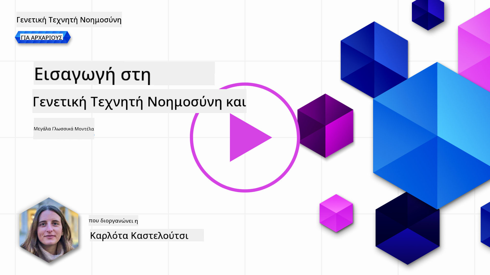
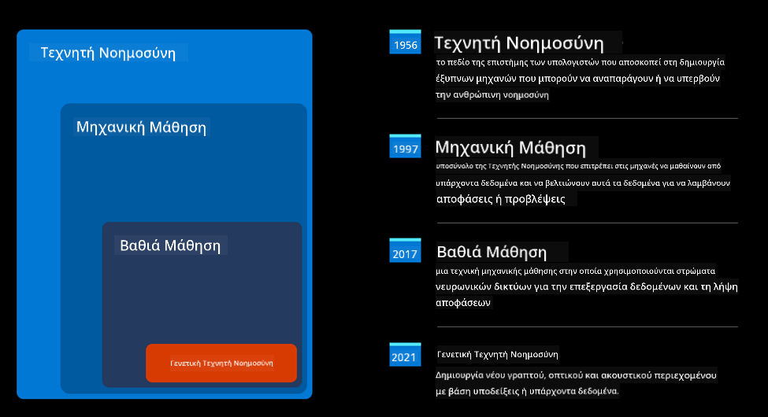
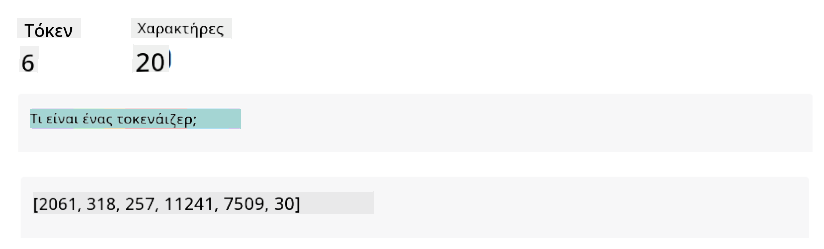
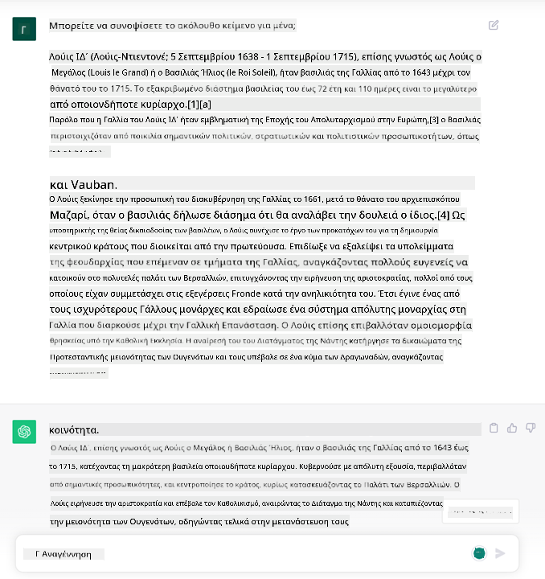
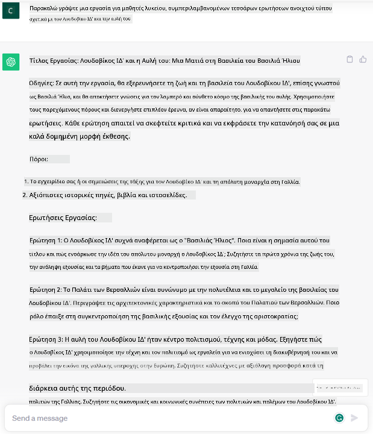
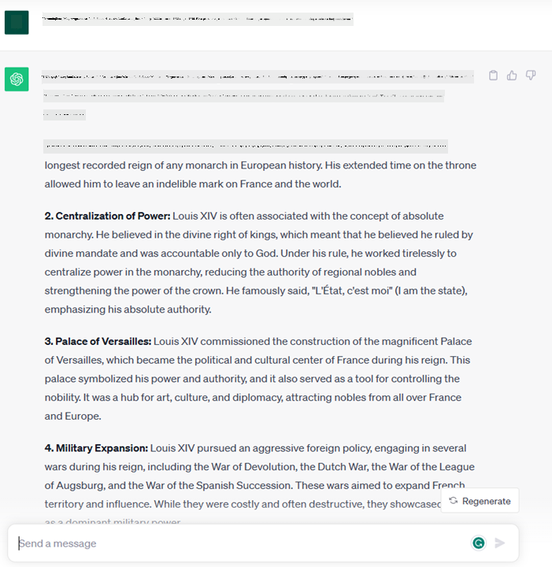
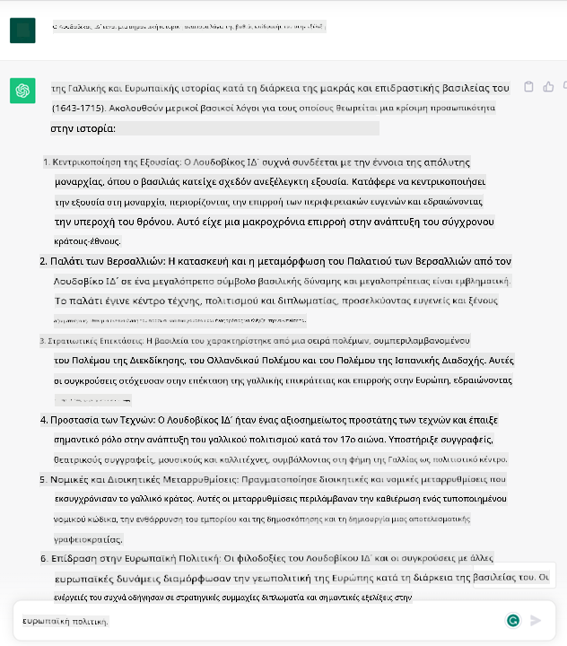
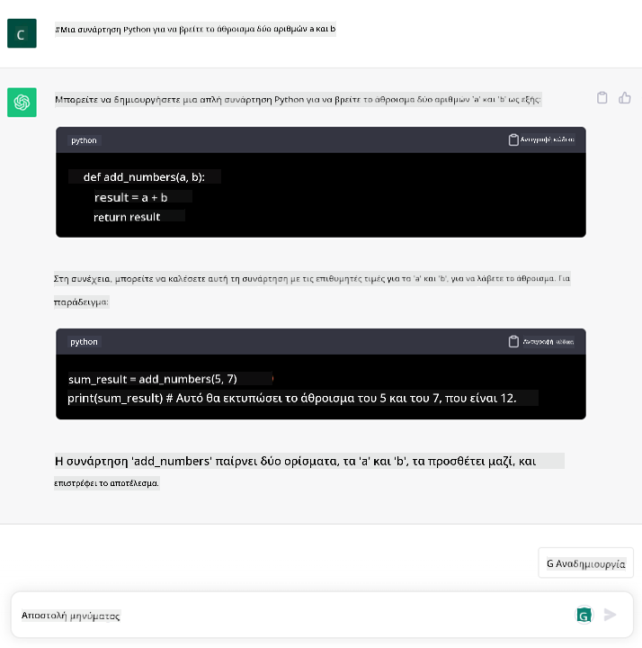

<!--
CO_OP_TRANSLATOR_METADATA:
{
  "original_hash": "f53ba0fa49164f9323043f1c6b11f2b1",
  "translation_date": "2025-06-25T09:53:04+00:00",
  "source_file": "01-introduction-to-genai/README.md",
  "language_code": "el"
}
-->
# Εισαγωγή στη Γενετική AI και τα Μεγάλα Γλωσσικά Μοντέλα

_(Κάντε κλικ στην εικόνα παραπάνω για να δείτε το βίντεο αυτού του μαθήματος)_

Η Γενετική AI είναι τεχνητή νοημοσύνη ικανή να δημιουργεί κείμενο, εικόνες και άλλους τύπους περιεχομένου. Αυτό που την καθιστά φανταστική τεχνολογία είναι ότι εκδημοκρατίζει την AI, οποιοσδήποτε μπορεί να τη χρησιμοποιήσει με το ελάχιστο μιας προτροπής κειμένου, μια πρόταση γραμμένη σε φυσική γλώσσα. Δεν χρειάζεται να μάθετε μια γλώσσα όπως η Java ή η SQL για να πετύχετε κάτι αξιόλογο, το μόνο που χρειάζεστε είναι να χρησιμοποιήσετε τη γλώσσα σας, να δηλώσετε τι θέλετε και το AI μοντέλο θα σας προτείνει κάτι. Οι εφαρμογές και οι επιπτώσεις για αυτό είναι τεράστιες, γράφετε ή κατανοείτε αναφορές, γράφετε εφαρμογές και πολλά άλλα, όλα σε δευτερόλεπτα.

Σε αυτό το πρόγραμμα σπουδών, θα εξερευνήσουμε πώς η startup μας αξιοποιεί τη γενετική AI για να ανοίξει νέες προοπτικές στον κόσμο της εκπαίδευσης και πώς αντιμετωπίζουμε τις αναπόφευκτες προκλήσεις που συνδέονται με τις κοινωνικές επιπτώσεις της εφαρμογής της και τους περιορισμούς της τεχνολογίας.

## Εισαγωγή

Αυτό το μάθημα θα καλύψει:

- Εισαγωγή στο επιχειρηματικό σενάριο: η ιδέα και η αποστολή της startup μας.
- Γενετική AI και πώς καταλήξαμε στο τρέχον τεχνολογικό τοπίο.
- Εσωτερική λειτουργία ενός μεγάλου γλωσσικού μοντέλου.
- Κύριες δυνατότητες και πρακτικές χρήσεις των Μεγάλων Γλωσσικών Μοντέλων.

## Στόχοι Μάθησης

Μετά την ολοκλήρωση αυτού του μαθήματος, θα κατανοήσετε:

- Τι είναι η γενετική AI και πώς λειτουργούν τα Μεγάλα Γλωσσικά Μοντέλα.
- Πώς μπορείτε να αξιοποιήσετε τα μεγάλα γλωσσικά μοντέλα για διάφορες χρήσεις, με έμφαση σε σενάρια εκπαίδευσης.

## Σενάριο: η εκπαιδευτική μας startup

Η Γενετική Τεχνητή Νοημοσύνη (AI) αντιπροσωπεύει την κορυφή της τεχνολογίας AI, ωθώντας τα όρια του τι κάποτε θεωρούνταν αδύνατο. Τα μοντέλα γενετικής AI έχουν πολλές δυνατότητες και εφαρμογές, αλλά για αυτό το πρόγραμμα σπουδών θα εξερευνήσουμε πώς επαναστατεί την εκπαίδευση μέσω μιας φανταστικής startup. Θα αναφερθούμε σε αυτή τη startup ως _η startup μας_. Η startup μας εργάζεται στον τομέα της εκπαίδευσης με την φιλόδοξη αποστολή

> _βελτίωση της προσβασιμότητας στη μάθηση, σε παγκόσμια κλίμακα, εξασφαλίζοντας ισότιμη πρόσβαση στην εκπαίδευση και παρέχοντας εξατομικευμένες εμπειρίες μάθησης σε κάθε μαθητή, σύμφωνα με τις ανάγκες του_.

Η ομάδα της startup μας γνωρίζει ότι δεν θα μπορέσουμε να πετύχουμε αυτόν τον στόχο χωρίς να αξιοποιήσουμε ένα από τα πιο ισχυρά εργαλεία των σύγχρονων εποχών – τα Μεγάλα Γλωσσικά Μοντέλα (LLMs).

Η Γενετική AI αναμένεται να επαναστατήσει τον τρόπο που μαθαίνουμε και διδάσκουμε σήμερα, με τους μαθητές να έχουν στη διάθεσή τους εικονικούς δασκάλους 24 ώρες το 24ωρο που παρέχουν μεγάλες ποσότητες πληροφοριών και παραδειγμάτων, και τους δασκάλους να μπορούν να αξιοποιούν καινοτόμα εργαλεία για να αξιολογούν τους μαθητές τους και να παρέχουν ανατροφοδότηση.

Για να ξεκινήσουμε, ας ορίσουμε κάποιες βασικές έννοιες και ορολογία που θα χρησιμοποιούμε καθ' όλη τη διάρκεια του προγράμματος σπουδών.

## Πώς αποκτήσαμε τη Γενετική AI;

Παρά το εξαιρετικό _hype_ που δημιουργήθηκε πρόσφατα από την ανακοίνωση των μοντέλων γενετικής AI, αυτή η τεχνολογία είναι αποτέλεσμα δεκαετιών, με τις πρώτες ερευνητικές προσπάθειες να χρονολογούνται από τη δεκαετία του '60. Βρισκόμαστε πλέον σε ένα σημείο με την AI να έχει ανθρώπινες γνωστικές ικανότητες, όπως συνομιλία, όπως δείχνουν για παράδειγμα το [OpenAI ChatGPT](https://openai.com/chatgpt) ή το [Bing Chat](https://www.microsoft.com/edge/features/bing-chat?WT.mc_id=academic-105485-koreyst), που επίσης χρησιμοποιεί ένα μοντέλο GPT για τις συνομιλίες αναζήτησης στο Bing.

Γυρίζοντας λίγο πίσω, τα πρώτα πρωτότυπα AI αποτελούνταν από γραπτά chatbots, που βασίζονταν σε μια βάση γνώσεων που εξάγονταν από μια ομάδα ειδικών και αναπαριστώνταν σε έναν υπολογιστή. Οι απαντήσεις στη βάση γνώσεων ενεργοποιούνταν από λέξεις-κλειδιά που εμφανίζονταν στο κείμενο εισόδου.
Ωστόσο, σύντομα έγινε σαφές ότι μια τέτοια προσέγγιση, χρησιμοποιώντας γραπτά chatbots, δεν κλιμακώνεται καλά.

### Μια στατιστική προσέγγιση στην AI: Μηχανική Μάθηση

Ένα σημείο καμπής ήρθε κατά τη διάρκεια της δεκαετίας του '90, με την εφαρμογή μιας στατιστικής προσέγγισης στην ανάλυση κειμένου. Αυτό οδήγησε στην ανάπτυξη νέων αλγορίθμων – γνωστών ως μηχανική μάθηση – ικανών να μαθαίνουν μοτίβα από δεδομένα χωρίς να προγραμματίζονται ρητά. Αυτή η προσέγγιση επιτρέπει στις μηχανές να προσομοιώνουν την κατανόηση της ανθρώπινης γλώσσας: ένα στατιστικό μοντέλο εκπαιδεύεται σε ζευγάρια κειμένου-ετικέτας, επιτρέποντας στο μοντέλο να ταξινομήσει άγνωστο κείμενο εισόδου με μια προκαθορισμένη ετικέτα που αντιπροσωπεύει την πρόθεση του μηνύματος.

### Νευρωνικά δίκτυα και σύγχρονοι εικονικοί βοηθοί

Τα τελευταία χρόνια, η τεχνολογική εξέλιξη του υλικού, ικανή να χειρίζεται μεγαλύτερες ποσότητες δεδομένων και πιο πολύπλοκους υπολογισμούς, ενθάρρυνε την έρευνα στην AI, οδηγώντας στην ανάπτυξη προηγμένων αλγορίθμων μηχανικής μάθησης γνωστών ως νευρωνικά δίκτυα ή αλγορίθμων βαθιάς μάθησης.

Τα νευρωνικά δίκτυα (και ειδικότερα τα Επαναληπτικά Νευρωνικά Δίκτυα – RNNs) βελτίωσαν σημαντικά την επεξεργασία φυσικής γλώσσας, επιτρέποντας την αναπαράσταση της σημασίας του κειμένου με πιο ουσιαστικό τρόπο, δίνοντας αξία στο πλαίσιο μιας λέξης σε μια πρόταση.

Αυτή είναι η τεχνολογία που τροφοδότησε τους εικονικούς βοηθούς που γεννήθηκαν την πρώτη δεκαετία του νέου αιώνα, πολύ ικανούς στην ερμηνεία της ανθρώπινης γλώσσας, στον εντοπισμό μιας ανάγκης και στην εκτέλεση μιας ενέργειας για την ικανοποίησή της – όπως απαντώντας με ένα προκαθορισμένο σενάριο ή καταναλώνοντας μια υπηρεσία τρίτου.

### Σήμερα, Γενετική AI

Έτσι φτάσαμε στη Γενετική AI σήμερα, η οποία μπορεί να θεωρηθεί ως υποσύνολο της βαθιάς μάθησης.

Μετά από δεκαετίες έρευνας στον τομέα της AI, μια νέα αρχιτεκτονική μοντέλου – που ονομάζεται _Transformer_ – ξεπέρασε τα όρια των RNNs, όντας ικανή να δέχεται πολύ μεγαλύτερες ακολουθίες κειμένου ως εισόδου. Οι Transformers βασίζονται στον μηχανισμό προσοχής, επιτρέποντας στο μοντέλο να δίνει διαφορετικά βάρη στις εισόδους που λαμβάνει, ‘δίνοντας περισσότερη προσοχή’ εκεί όπου συγκεντρώνεται η πιο σχετική πληροφορία, ανεξάρτητα από τη σειρά τους στην ακολουθία κειμένου.

Τα περισσότερα από τα πρόσφατα μοντέλα γενετικής AI – επίσης γνωστά ως Μεγάλα Γλωσσικά Μοντέλα (LLMs), καθώς δουλεύουν με κειμενικές εισόδους και εξόδους – βασίζονται πράγματι σε αυτήν την αρχιτεκτονική. Αυτό που είναι ενδιαφέρον για αυτά τα μοντέλα – που εκπαιδεύονται σε τεράστιες ποσότητες μη ετικετοποιημένων δεδομένων από διάφορες πηγές όπως βιβλία, άρθρα και ιστότοπους – είναι ότι μπορούν να προσαρμοστούν σε μια ευρεία ποικιλία εργασιών και να παράγουν γραμματικά σωστό κείμενο με μια αίσθηση δημιουργικότητας. Έτσι, όχι μόνο ενίσχυσαν εξαιρετικά την ικανότητα μιας μηχανής να ‘κατανοεί’ ένα κείμενο εισόδου, αλλά επέτρεψαν την ικανότητά τους να παράγουν μια πρωτότυπη απάντηση σε ανθρώπινη γλώσσα.

## Πώς λειτουργούν τα μεγάλα γλωσσικά μοντέλα;

Στο επόμενο κεφάλαιο θα εξερευνήσουμε διαφορετικούς τύπους μοντέλων γενετικής AI, αλλά προς το παρόν ας δούμε πώς λειτουργούν τα μεγάλα γλωσσικά μοντέλα, με έμφαση στα μοντέλα OpenAI GPT (Generative Pre-trained Transformer).

- **Tokenizer, κείμενο σε αριθμούς**: Τα Μεγάλα Γλωσσικά Μοντέλα λαμβάνουν ένα κείμενο ως είσοδο και παράγουν ένα κείμενο ως έξοδο. Ωστόσο, όντας στατιστικά μοντέλα, λειτουργούν πολύ καλύτερα με αριθμούς παρά με ακολουθίες κειμένου. Γι' αυτό κάθε είσοδος στο μοντέλο επεξεργάζεται από ένα tokenizer, πριν χρησιμοποιηθεί από το βασικό μοντέλο. Ένα token είναι ένα κομμάτι κειμένου – που αποτελείται από μεταβλητό αριθμό χαρακτήρων, έτσι η κύρια δουλειά του tokenizer είναι να διασπάσει την είσοδο σε έναν πίνακα tokens. Στη συνέχεια, κάθε token αντιστοιχείται σε έναν δείκτη token, που είναι η ακέραια κωδικοποίηση του αρχικού κομματιού κειμένου.

- **Πρόβλεψη εξόδου tokens**: Δεδομένων n tokens ως είσοδο (με μέγιστο n να ποικίλει από μοντέλο σε μοντέλο), το μοντέλο είναι ικανό να προβλέψει ένα token ως έξοδο. Αυτό το token στη συνέχεια ενσωματώνεται στην είσοδο της επόμενης επανάληψης, σε ένα μοτίβο επεκτεινόμενου παραθύρου, επιτρέποντας μια καλύτερη εμπειρία χρήστη λαμβάνοντας μια (ή πολλές) προτάσεις ως απάντηση. Αυτό εξηγεί γιατί, αν έχετε παίξει ποτέ με το ChatGPT, ίσως έχετε παρατηρήσει ότι μερικές φορές φαίνεται να σταματά στη μέση μιας πρότασης.

- **Διαδικασία επιλογής, κατανομή πιθανότητας**: Το εξόδου token επιλέγεται από το μοντέλο σύμφωνα με την πιθανότητά του να εμφανιστεί μετά την τρέχουσα ακολουθία κειμένου. Αυτό συμβαίνει επειδή το μοντέλο προβλέπει μια κατανομή πιθανότητας για όλα τα πιθανά ‘επόμενα tokens’, υπολογισμένη με βάση την εκπαίδευσή του. Ωστόσο, δεν επιλέγεται πάντα το token με την υψηλότερη πιθανότητα από την προκύπτουσα κατανομή. Προστίθεται ένας βαθμός τυχαιότητας σε αυτήν την επιλογή, με τρόπο που το μοντέλο να ενεργεί με μη-καθοριστικό τρόπο - δεν λαμβάνουμε την ακριβή ίδια έξοδο για την ίδια είσοδο. Αυτός ο βαθμός τυχαιότητας προστίθεται για να προσομοιωθεί η διαδικασία δημιουργικής σκέψης και μπορεί να ρυθμιστεί χρησιμοποιώντας μια παράμετρο μοντέλου που ονομάζεται θερμοκρασία.

## Πώς μπορεί η startup μας να αξιοποιήσει τα Μεγάλα Γλωσσικά Μοντέλα;

Τώρα που έχουμε καλύτερη κατανόηση της εσωτερικής λειτουργίας ενός μεγάλου γλωσσικού μοντέλου, ας δούμε μερικά πρακτικά παραδείγματα των πιο κοινών εργασιών που μπορούν να εκτελέσουν αρκετά καλά, με μια ματιά στο επιχειρηματικό μας σενάριο.
Είπαμε ότι η κύρια ικανότητα ενός Μεγάλου Γλωσσικού Μοντέλου είναι _η δημιουργία κειμένου από το μηδέν, ξεκινώντας από μια κειμενική είσοδο, γραμμένη σε φυσική γλώσσα_.

Αλλά τι είδους κειμενική είσοδος και έξοδος;
Η είσοδος ενός μεγάλου γλωσσικού μοντέλου είναι γνωστή ως προτροπή, ενώ η έξοδος είναι γνωστή ως ολοκλήρωση, όρος που αναφέρεται στον μηχανισμό του μοντέλου να παράγει το επόμενο token για να ολοκληρώσει την τρέχουσα είσοδο. Θα εμβαθύνουμε στο τι είναι μια προτροπή και πώς να τη σχεδιάσουμε με τρόπο ώστε να αξιοποιήσουμε το μέγιστο από το μοντέλο μας. Αλλά προς το παρόν, ας πούμε ότι μια προτροπή μπορεί να περιλαμβάνει:

- Μια **οδηγία** που καθορίζει τον τύπο εξόδου που περιμένουμε από το μοντέλο. Αυτή η οδηγία μερικές φορές μπορεί να ενσωματώνει κάποια παραδείγματα ή κάποια επιπλέον δεδομένα.

  1. Περίληψη ενός άρθρου, βιβλίου, κριτικών προϊόντων και άλλα, μαζί με εξαγωγή πληροφοριών από μη δομημένα δεδομένα.
    
    
  
  2. Δημιουργική ιδεοποίηση και σχεδιασμός ενός άρθρου, δοκιμίου, εργασίας ή άλλων.
      
     

- Μια **ερώτηση**, που τίθεται με τη μορφή συνομιλίας με έναν πράκτορα.
  
  

- Ένα κομμάτι **κειμένου προς ολοκλήρωση**, που υπονοεί ότι ζητείται βοήθεια στη γραφή.
  
  

- Ένα κομμάτι **κώδικα** μαζί με το αίτημα για εξήγηση και τεκμηρίωση του, ή ένα σχόλιο που ζητά να δημιουργηθεί ένα κομμάτι κώδικα που εκτελεί μια συγκεκριμένη εργασία.
  
  

Τα παραδείγματα παραπάνω είναι αρκετά απλά και δεν προορίζονται να αποτελέσουν μια εξαντλητική επίδειξη των δυνατοτήτων των Μεγάλων Γλωσσικών Μοντέλων. Προορίζονται να δείξουν το δυναμικό της χρήσης γενετικής AI, ιδιαίτερα αλλά όχι αποκλειστικά σε εκπαιδευτικά πλαίσια.

Επίσης, η έξοδος ενός μοντέλου γενετικής AI δεν είναι τέ

**Αποποίηση ευθύνης**:  
Αυτό το έγγραφο έχει μεταφραστεί χρησιμοποιώντας την υπηρεσία αυτόματης μετάφρασης [Co-op Translator](https://github.com/Azure/co-op-translator). Ενώ επιδιώκουμε την ακρίβεια, παρακαλούμε να γνωρίζετε ότι οι αυτοματοποιημένες μεταφράσεις ενδέχεται να περιέχουν σφάλματα ή ανακρίβειες. Το αρχικό έγγραφο στη μητρική του γλώσσα πρέπει να θεωρείται η αυθεντική πηγή. Για κρίσιμες πληροφορίες, συνιστάται η επαγγελματική ανθρώπινη μετάφραση. Δεν φέρουμε ευθύνη για τυχόν παρεξηγήσεις ή παρερμηνείες που προκύπτουν από τη χρήση αυτής της μετάφρασης.