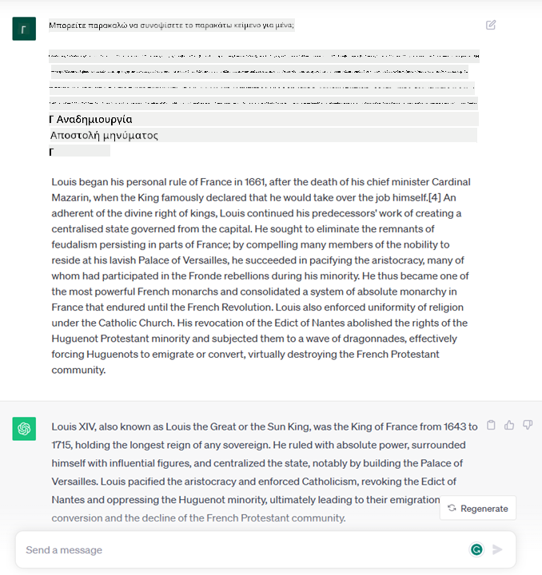
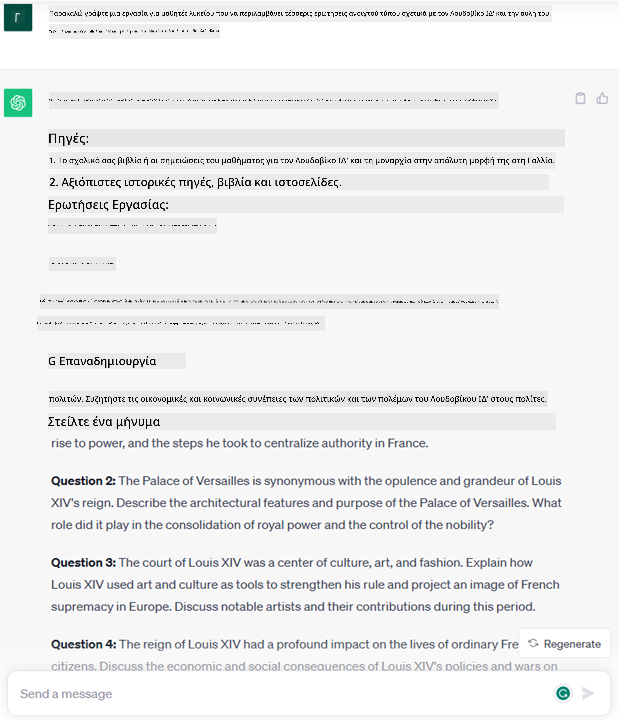
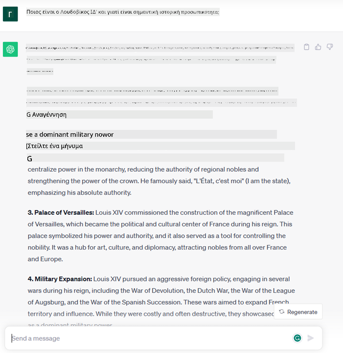
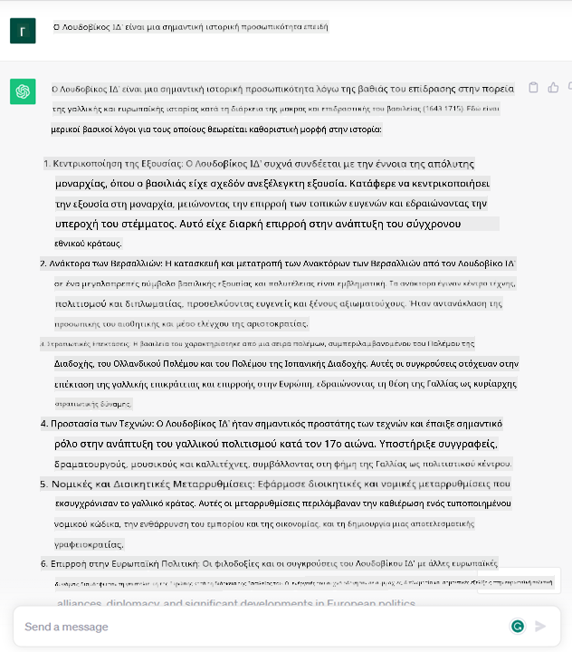
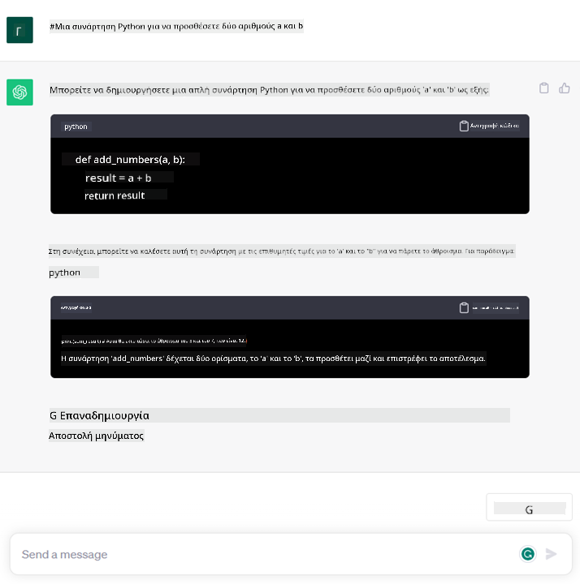

<!--
CO_OP_TRANSLATOR_METADATA:
{
  "original_hash": "f53ba0fa49164f9323043f1c6b11f2b1",
  "translation_date": "2025-07-09T07:53:00+00:00",
  "source_file": "01-introduction-to-genai/README.md",
  "language_code": "el"
}
-->
# Εισαγωγή στην Γενετική Τεχνητή Νοημοσύνη και τα Μεγάλα Γλωσσικά Μοντέλα

_(Κάντε κλικ στην εικόνα παραπάνω για να δείτε το βίντεο αυτής της ενότητας)_

Η Γενετική Τεχνητή Νοημοσύνη είναι μια μορφή τεχνητής νοημοσύνης ικανή να δημιουργεί κείμενο, εικόνες και άλλους τύπους περιεχομένου. Αυτό που την καθιστά εξαιρετική τεχνολογία είναι ότι εκδημοκρατίζει την ΤΝ, επιτρέποντας σε οποιονδήποτε να τη χρησιμοποιήσει με το απλό κείμενο μιας εντολής, μια πρόταση γραμμένη σε φυσική γλώσσα. Δεν χρειάζεται να μάθετε γλώσσες προγραμματισμού όπως Java ή SQL για να πετύχετε κάτι ουσιαστικό, αρκεί να χρησιμοποιήσετε τη δική σας γλώσσα, να δηλώσετε τι θέλετε και να λάβετε μια πρόταση από ένα μοντέλο ΤΝ. Οι εφαρμογές και ο αντίκτυπος είναι τεράστιοι: γράφετε ή κατανοείτε αναφορές, δημιουργείτε εφαρμογές και πολλά άλλα, όλα μέσα σε δευτερόλεπτα.

Σε αυτό το πρόγραμμα σπουδών, θα εξερευνήσουμε πώς η startup μας αξιοποιεί τη γενετική ΤΝ για να ανοίξει νέους ορίζοντες στον χώρο της εκπαίδευσης και πώς αντιμετωπίζουμε τις αναπόφευκτες προκλήσεις που σχετίζονται με τις κοινωνικές επιπτώσεις της εφαρμογής της και τους τεχνολογικούς περιορισμούς.

## Εισαγωγή

Αυτή η ενότητα θα καλύψει:

- Εισαγωγή στο επιχειρηματικό σενάριο: η ιδέα και η αποστολή της startup μας.
- Τη γενετική ΤΝ και πώς φτάσαμε στο σημερινό τεχνολογικό τοπίο.
- Τη λειτουργία ενός μεγάλου γλωσσικού μοντέλου.
- Κύριες δυνατότητες και πρακτικές χρήσεις των Μεγάλων Γλωσσικών Μοντέλων.

## Στόχοι Μάθησης

Μετά την ολοκλήρωση αυτής της ενότητας, θα κατανοείτε:

- Τι είναι η γενετική ΤΝ και πώς λειτουργούν τα Μεγάλα Γλωσσικά Μοντέλα.
- Πώς μπορείτε να αξιοποιήσετε τα μεγάλα γλωσσικά μοντέλα για διάφορες χρήσεις, με έμφαση σε εκπαιδευτικά σενάρια.

## Σενάριο: η εκπαιδευτική startup μας

Η Γενετική Τεχνητή Νοημοσύνη (AI) αντιπροσωπεύει την κορυφή της τεχνολογίας ΤΝ, ωθώντας τα όρια του αδύνατου. Τα γενετικά μοντέλα ΤΝ έχουν πολλές δυνατότητες και εφαρμογές, αλλά σε αυτό το πρόγραμμα θα εξερευνήσουμε πώς φέρνουν επανάσταση στην εκπαίδευση μέσω μιας φανταστικής startup. Θα αναφερόμαστε σε αυτήν ως _η startup μας_. Η startup μας δραστηριοποιείται στον τομέα της εκπαίδευσης με την φιλόδοξη αποστολή

> _να βελτιώσει την προσβασιμότητα στη μάθηση σε παγκόσμιο επίπεδο, εξασφαλίζοντας δίκαιη πρόσβαση στην εκπαίδευση και παρέχοντας εξατομικευμένες μαθησιακές εμπειρίες σε κάθε μαθητή, ανάλογα με τις ανάγκες του_.

Η ομάδα της startup μας γνωρίζει ότι δεν θα μπορέσουμε να πετύχουμε αυτόν τον στόχο χωρίς να αξιοποιήσουμε ένα από τα πιο ισχυρά εργαλεία της σύγχρονης εποχής – τα Μεγάλα Γλωσσικά Μοντέλα (LLMs).

Η γενετική ΤΝ αναμένεται να φέρει επανάσταση στον τρόπο που μαθαίνουμε και διδάσκουμε σήμερα, με τους μαθητές να έχουν στη διάθεσή τους εικονικούς δασκάλους 24 ώρες το 24ωρο που παρέχουν τεράστιες ποσότητες πληροφοριών και παραδειγμάτων, και τους εκπαιδευτικούς να μπορούν να χρησιμοποιούν καινοτόμα εργαλεία για να αξιολογούν τους μαθητές τους και να δίνουν ανατροφοδότηση.

Για αρχή, ας ορίσουμε μερικές βασικές έννοιες και ορολογίες που θα χρησιμοποιούμε σε όλο το πρόγραμμα.

## Πώς φτάσαμε στη Γενετική Τεχνητή Νοημοσύνη;

Παρά τον εξαιρετικό _θόρυβο_ που δημιουργήθηκε πρόσφατα με την ανακοίνωση των γενετικών μοντέλων ΤΝ, αυτή η τεχνολογία αναπτύσσεται εδώ και δεκαετίες, με τις πρώτες ερευνητικές προσπάθειες να χρονολογούνται από τη δεκαετία του ’60. Βρισκόμαστε πλέον σε ένα σημείο όπου η ΤΝ διαθέτει ανθρώπινες γνωστικές ικανότητες, όπως η συνομιλία, όπως φαίνεται για παράδειγμα από το [OpenAI ChatGPT](https://openai.com/chatgpt) ή το [Bing Chat](https://www.microsoft.com/edge/features/bing-chat?WT.mc_id=academic-105485-koreyst), που επίσης χρησιμοποιεί μοντέλο GPT για τις συνομιλίες αναζήτησης στο Bing.

Κάνοντας ένα βήμα πίσω, τα πρώτα πρωτότυπα ΤΝ ήταν πληκτρολογημένοι chatbots, βασισμένα σε μια βάση γνώσεων που εξάγονταν από ομάδα ειδικών και αποθηκεύονταν σε υπολογιστή. Οι απαντήσεις στη βάση γνώσεων ενεργοποιούνταν από λέξεις-κλειδιά που εμφανίζονταν στο κείμενο εισόδου. Ωστόσο, σύντομα έγινε σαφές ότι αυτή η προσέγγιση, με τα πληκτρολογημένα chatbots, δεν κλιμακωνόταν καλά.

### Μια στατιστική προσέγγιση στην ΤΝ: Μηχανική Μάθηση

Ένα σημείο καμπής ήρθε τη δεκαετία του ’90, με την εφαρμογή μιας στατιστικής προσέγγισης στην ανάλυση κειμένου. Αυτό οδήγησε στην ανάπτυξη νέων αλγορίθμων – γνωστών ως μηχανική μάθηση – ικανών να μαθαίνουν πρότυπα από δεδομένα χωρίς να προγραμματίζονται ρητά. Αυτή η προσέγγιση επιτρέπει στις μηχανές να προσομοιώνουν την κατανόηση της ανθρώπινης γλώσσας: ένα στατιστικό μοντέλο εκπαιδεύεται σε ζεύγη κειμένου-ετικέτας, επιτρέποντας στο μοντέλο να ταξινομεί άγνωστο κείμενο εισόδου με μια προκαθορισμένη ετικέτα που αντιπροσωπεύει την πρόθεση του μηνύματος.

### Νευρωνικά δίκτυα και σύγχρονοι εικονικοί βοηθοί

Τα τελευταία χρόνια, η τεχνολογική εξέλιξη του υλικού, ικανή να διαχειρίζεται μεγαλύτερους όγκους δεδομένων και πιο σύνθετους υπολογισμούς, ενθάρρυνε την έρευνα στην ΤΝ, οδηγώντας στην ανάπτυξη προηγμένων αλγορίθμων μηχανικής μάθησης γνωστών ως νευρωνικά δίκτυα ή αλγόριθμοι βαθιάς μάθησης.

Τα νευρωνικά δίκτυα (και ειδικά τα Επαναλαμβανόμενα Νευρωνικά Δίκτυα – RNNs) βελτίωσαν σημαντικά την επεξεργασία φυσικής γλώσσας, επιτρέποντας την αναπαράσταση του νοήματος του κειμένου με πιο ουσιαστικό τρόπο, λαμβάνοντας υπόψη το πλαίσιο μιας λέξης μέσα σε μια πρόταση.

Αυτή είναι η τεχνολογία που τροφοδότησε τους εικονικούς βοηθούς που εμφανίστηκαν στην πρώτη δεκαετία του νέου αιώνα, πολύ ικανούς στην ερμηνεία της ανθρώπινης γλώσσας, στην αναγνώριση μιας ανάγκης και στην εκτέλεση μιας ενέργειας για την ικανοποίησή της – όπως η απάντηση με προκαθορισμένο σενάριο ή η χρήση υπηρεσίας τρίτου μέρους.

### Σήμερα, η Γενετική Τεχνητή Νοημοσύνη

Έτσι φτάσαμε στη σημερινή Γενετική ΤΝ, που μπορεί να θεωρηθεί ως υποσύνολο της βαθιάς μάθησης.

Μετά από δεκαετίες έρευνας στον τομέα της ΤΝ, μια νέα αρχιτεκτονική μοντέλου – ονομάζεται _Transformer_ – ξεπέρασε τους περιορισμούς των RNNs, έχοντας τη δυνατότητα να επεξεργάζεται πολύ μεγαλύτερες ακολουθίες κειμένου ως είσοδο. Οι Transformers βασίζονται στον μηχανισμό προσοχής (attention), που επιτρέπει στο μοντέλο να δίνει διαφορετικά βάρη στα εισερχόμενα δεδομένα, «προσεχώντας περισσότερο» εκεί όπου συγκεντρώνεται η πιο σημαντική πληροφορία, ανεξάρτητα από τη σειρά τους στην ακολουθία κειμένου.

Τα περισσότερα πρόσφατα γενετικά μοντέλα ΤΝ – γνωστά και ως Μεγάλα Γλωσσικά Μοντέλα (LLMs), αφού δουλεύουν με κείμενο ως είσοδο και έξοδο – βασίζονται σε αυτήν την αρχιτεκτονική. Το ενδιαφέρον με αυτά τα μοντέλα – εκπαιδευμένα σε τεράστιο όγκο μη επισημασμένων δεδομένων από διάφορες πηγές όπως βιβλία, άρθρα και ιστοσελίδες – είναι ότι μπορούν να προσαρμοστούν σε μεγάλη ποικιλία εργασιών και να παράγουν γραμματικά σωστό κείμενο με μια αίσθηση δημιουργικότητας. Έτσι, όχι μόνο βελτίωσαν απίστευτα την ικανότητα μιας μηχανής να «κατανοεί» ένα κείμενο εισόδου, αλλά και την ικανότητά τους να δημιουργούν μια πρωτότυπη απάντηση σε ανθρώπινη γλώσσα.

## Πώς λειτουργούν τα μεγάλα γλωσσικά μοντέλα;

Στο επόμενο κεφάλαιο θα εξερευνήσουμε διάφορους τύπους γενετικών μοντέλων ΤΝ, αλλά προς το παρόν ας δούμε πώς λειτουργούν τα μεγάλα γλωσσικά μοντέλα, με έμφαση στα μοντέλα OpenAI GPT (Generative Pre-trained Transformer).

- **Tokenizer, από κείμενο σε αριθμούς**: Τα Μεγάλα Γλωσσικά Μοντέλα λαμβάνουν κείμενο ως είσοδο και παράγουν κείμενο ως έξοδο. Ωστόσο, ως στατιστικά μοντέλα, λειτουργούν πολύ καλύτερα με αριθμούς παρά με ακολουθίες κειμένου. Γι’ αυτό κάθε είσοδος στο μοντέλο επεξεργάζεται από έναν tokenizer, πριν χρησιμοποιηθεί από το βασικό μοντέλο. Ένα token είναι ένα κομμάτι κειμένου – που αποτελείται από μεταβλητό αριθμό χαρακτήρων, οπότε η κύρια δουλειά του tokenizer είναι να χωρίζει την είσοδο σε έναν πίνακα από tokens. Στη συνέχεια, κάθε token αντιστοιχίζεται σε έναν δείκτη token, που είναι ο ακέραιος κωδικός του αρχικού κομματιού κειμένου.

- **Πρόβλεψη tokens εξόδου**: Δίνοντας n tokens ως είσοδο (με μέγιστο n που διαφέρει ανά μοντέλο), το μοντέλο μπορεί να προβλέψει ένα token ως έξοδο. Αυτό το token ενσωματώνεται στην είσοδο της επόμενης επανάληψης, σε ένα μοτίβο επεκτεινόμενου παραθύρου, επιτρέποντας μια καλύτερη εμπειρία χρήστη με την παραγωγή μιας (ή πολλών) προτάσεων ως απάντηση. Αυτό εξηγεί γιατί, αν έχετε παίξει με το ChatGPT, ίσως έχετε παρατηρήσει ότι μερικές φορές σταματάει στη μέση μιας πρότασης.

- **Διαδικασία επιλογής, κατανομή πιθανοτήτων**: Το token εξόδου επιλέγεται από το μοντέλο σύμφωνα με την πιθανότητα εμφάνισής του μετά την τρέχουσα ακολουθία κειμένου. Αυτό συμβαίνει γιατί το μοντέλο προβλέπει μια κατανομή πιθανοτήτων για όλα τα πιθανά «επόμενα tokens», υπολογισμένη βάσει της εκπαίδευσής του. Ωστόσο, δεν επιλέγεται πάντα το token με την υψηλότερη πιθανότητα. Προστίθεται ένα επίπεδο τυχαιότητας σε αυτή την επιλογή, ώστε το μοντέλο να λειτουργεί με μη ντετερμινιστικό τρόπο – δεν παίρνουμε ακριβώς την ίδια απάντηση για την ίδια είσοδο. Αυτό το επίπεδο τυχαιότητας προστίθεται για να προσομοιώσει τη διαδικασία δημιουργικής σκέψης και μπορεί να ρυθμιστεί μέσω μιας παραμέτρου του μοντέλου που ονομάζεται temperature.

## Πώς μπορεί η startup μας να αξιοποιήσει τα Μεγάλα Γλωσσικά Μοντέλα;

Τώρα που έχουμε καλύτερη κατανόηση της εσωτερικής λειτουργίας ενός μεγάλου γλωσσικού μοντέλου, ας δούμε μερικά πρακτικά παραδείγματα από τις πιο κοινές εργασίες που μπορούν να εκτελέσουν πολύ καλά, με έμφαση στο επιχειρηματικό μας σενάριο. Είπαμε ότι η κύρια ικανότητα ενός Μεγάλου Γλωσσικού Μοντέλου είναι _η δημιουργία κειμένου από το μηδέν, ξεκινώντας από μια κειμενική είσοδο, γραμμένη σε φυσική γλώσσα_.

Αλλά τι είδους είσοδο και έξοδο κειμένου;
Η είσοδος ενός μεγάλου γλωσσικού μοντέλου είναι γνωστή ως prompt, ενώ η έξοδος ως completion, όρος που αναφέρεται στον μηχανισμό του μοντέλου να παράγει το επόμενο token για να ολοκληρώσει την τρέχουσα είσοδο. Θα εμβαθύνουμε στο τι είναι ένα prompt και πώς να το σχεδιάζουμε ώστε να αξιοποιούμε στο έπακρο το μοντέλο μας. Προς το παρόν, ας πούμε ότι ένα prompt μπορεί να περιλαμβάνει:

- Μια **εντολή** που καθορίζει τον τύπο της εξόδου που περιμένουμε από το μοντέλο. Αυτή η εντολή μερικές φορές μπορεί να περιλαμβάνει παραδείγματα ή επιπλέον δεδομένα.

  1. Περίληψη άρθρου, βιβλίου, κριτικών προϊόντων και άλλα, μαζί με εξαγωγή συμπερασμάτων από μη δομημένα δεδομένα.
    
    
  
  2. Δημιουργική ιδέα και σχεδιασμός άρθρου, δοκιμίου, εργασίας ή άλλου.
      
     

- Μια **ερώτηση**, διατυπωμένη ως συνομιλία με έναν πράκτορα.
  
  

- Ένα κομμάτι **κειμένου προς ολοκλήρωση**, που υποδηλώνει αίτημα για βοήθεια στη συγγραφή.
  
  

- Ένα κομμάτι **κώδικα** μαζί με αίτημα για εξήγηση και τεκμηρίωση, ή ένα σχόλιο που ζητά να παραχθεί κομμάτι κώδικα που εκτελεί συγκεκριμένη εργασία.
  
  

Τα παραπάνω παραδείγματα είναι αρκετά απλά και δεν έχουν σκοπό να παρουσιάσουν εξαντλητικά τις δυνατότητες των Μεγάλων Γλωσσικών Μοντέλων. Σκοπός τους είναι να δείξουν το δυναμικό της γενετικής ΤΝ, ειδικά αλλά όχι αποκλειστικά σε εκπαιδευτικά πλαίσια.

Επίσης, η έξοδος ενός γενετικού μοντέλου ΤΝ δεν είναι τέλεια και μερικές φορές η δημιουργικότητα του μοντέλου μπορεί να λειτουργήσει εναντίον του, παράγοντας
Πηγαίνετε στο Μάθημα 2 όπου θα δούμε πώς να [εξερευνήσουμε και να συγκρίνουμε διαφορετικούς τύπους LLM](../02-exploring-and-comparing-different-llms/README.md?WT.mc_id=academic-105485-koreyst)!

**Αποποίηση ευθυνών**:  
Αυτό το έγγραφο έχει μεταφραστεί χρησιμοποιώντας την υπηρεσία αυτόματης μετάφρασης AI [Co-op Translator](https://github.com/Azure/co-op-translator). Παρόλο που επιδιώκουμε την ακρίβεια, παρακαλούμε να έχετε υπόψη ότι οι αυτόματες μεταφράσεις ενδέχεται να περιέχουν λάθη ή ανακρίβειες. Το πρωτότυπο έγγραφο στη γλώσσα του θεωρείται η αυθεντική πηγή. Για κρίσιμες πληροφορίες, συνιστάται επαγγελματική ανθρώπινη μετάφραση. Δεν φέρουμε ευθύνη για τυχόν παρεξηγήσεις ή λανθασμένες ερμηνείες που προκύπτουν από τη χρήση αυτής της μετάφρασης.