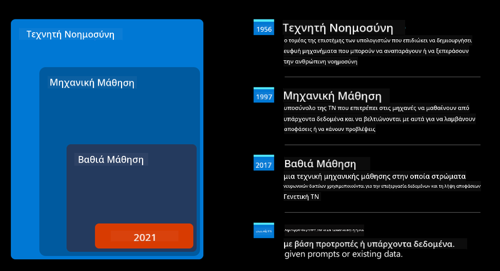
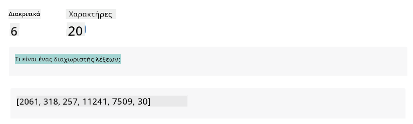

<!--
CO_OP_TRANSLATOR_METADATA:
{
  "original_hash": "bfb7901bdbece1ba3e9f35c400ca33e8",
  "translation_date": "2025-10-17T18:27:28+00:00",
  "source_file": "01-introduction-to-genai/README.md",
  "language_code": "el"
}
-->
# Εισαγωγή στην Παραγωγική Τεχνητή Νοημοσύνη και τα Μεγάλα Γλωσσικά Μοντέλα

_(Κάντε κλικ στην εικόνα παραπάνω για να δείτε το βίντεο αυτού του μαθήματος)_

Η Παραγωγική Τεχνητή Νοημοσύνη είναι μια μορφή τεχνητής νοημοσύνης που μπορεί να δημιουργεί κείμενα, εικόνες και άλλους τύπους περιεχομένου. Αυτό που την καθιστά μια εκπληκτική τεχνολογία είναι ότι εκδημοκρατίζει την τεχνητή νοημοσύνη, καθώς οποιοσδήποτε μπορεί να τη χρησιμοποιήσει με μια απλή εντολή κειμένου, μια πρόταση γραμμένη σε φυσική γλώσσα. Δεν χρειάζεται να μάθετε μια γλώσσα όπως η Java ή η SQL για να πετύχετε κάτι αξιόλογο, το μόνο που χρειάζεστε είναι να χρησιμοποιήσετε τη γλώσσα σας, να δηλώσετε τι θέλετε και να λάβετε μια πρόταση από ένα μοντέλο τεχνητής νοημοσύνης. Οι εφαρμογές και ο αντίκτυπος αυτής της τεχνολογίας είναι τεράστιοι: μπορείτε να γράψετε ή να κατανοήσετε αναφορές, να δημιουργήσετε εφαρμογές και πολλά άλλα, όλα μέσα σε δευτερόλεπτα.

Σε αυτό το πρόγραμμα σπουδών, θα εξερευνήσουμε πώς η startup μας αξιοποιεί την Παραγωγική Τεχνητή Νοημοσύνη για να ανοίξει νέες δυνατότητες στον κόσμο της εκπαίδευσης και πώς αντιμετωπίζουμε τις αναπόφευκτες προκλήσεις που σχετίζονται με τις κοινωνικές επιπτώσεις της εφαρμογής της και τους περιορισμούς της τεχνολογίας.

## Εισαγωγή

Αυτό το μάθημα θα καλύψει:

- Εισαγωγή στο επιχειρηματικό σενάριο: η ιδέα και η αποστολή της startup μας.
- Την Παραγωγική Τεχνητή Νοημοσύνη και πώς φτάσαμε στο σημερινό τεχνολογικό τοπίο.
- Τον εσωτερικό μηχανισμό ενός μεγάλου γλωσσικού μοντέλου.
- Τις κύριες δυνατότητες και πρακτικές εφαρμογές των Μεγάλων Γλωσσικών Μοντέλων.

## Στόχοι Μάθησης

Μετά την ολοκλήρωση αυτού του μαθήματος, θα κατανοήσετε:

- Τι είναι η Παραγωγική Τεχνητή Νοημοσύνη και πώς λειτουργούν τα Μεγάλα Γλωσσικά Μοντέλα.
- Πώς μπορείτε να αξιοποιήσετε τα Μεγάλα Γλωσσικά Μοντέλα για διάφορες εφαρμογές, με έμφαση στα εκπαιδευτικά σενάρια.

## Σενάριο: η εκπαιδευτική μας startup

Η Παραγωγική Τεχνητή Νοημοσύνη (AI) αντιπροσωπεύει την κορυφή της τεχνολογίας AI, ωθώντας τα όρια του τι θεωρούνταν κάποτε αδύνατο. Τα μοντέλα Παραγωγικής Τεχνητής Νοημοσύνης έχουν πολλές δυνατότητες και εφαρμογές, αλλά για αυτό το πρόγραμμα σπουδών θα εξερευνήσουμε πώς επαναστατεί στην εκπαίδευση μέσω μιας φανταστικής startup. Θα αναφερόμαστε σε αυτήν την startup ως _η startup μας_. Η startup μας δραστηριοποιείται στον εκπαιδευτικό τομέα με την φιλόδοξη αποστολή:

> _να βελτιώσει την προσβασιμότητα στη μάθηση, σε παγκόσμια κλίμακα, εξασφαλίζοντας ισότιμη πρόσβαση στην εκπαίδευση και παρέχοντας εξατομικευμένες μαθησιακές εμπειρίες σε κάθε μαθητή, σύμφωνα με τις ανάγκες του_.

Η ομάδα της startup μας γνωρίζει ότι δεν θα μπορέσει να επιτύχει αυτόν τον στόχο χωρίς να αξιοποιήσει ένα από τα πιο ισχυρά εργαλεία της σύγχρονης εποχής – τα Μεγάλα Γλωσσικά Μοντέλα (LLMs).

Η Παραγωγική Τεχνητή Νοημοσύνη αναμένεται να επαναστατήσει τον τρόπο που μαθαίνουμε και διδάσκουμε σήμερα, με τους μαθητές να έχουν στη διάθεσή τους εικονικούς δασκάλους 24 ώρες την ημέρα που παρέχουν τεράστιες ποσότητες πληροφοριών και παραδειγμάτων, και τους δασκάλους να μπορούν να αξιοποιήσουν καινοτόμα εργαλεία για να αξιολογήσουν τους μαθητές τους και να δώσουν ανατροφοδότηση.

Για αρχή, ας ορίσουμε κάποιες βασικές έννοιες και ορολογία που θα χρησιμοποιούμε σε όλο το πρόγραμμα σπουδών.

## Πώς φτάσαμε στην Παραγωγική Τεχνητή Νοημοσύνη;

Παρά τον εξαιρετικό _θόρυβο_ που δημιουργήθηκε πρόσφατα από την ανακοίνωση των μοντέλων Παραγωγικής Τεχνητής Νοημοσύνης, αυτή η τεχνολογία αναπτύσσεται εδώ και δεκαετίες, με τις πρώτες ερευνητικές προσπάθειες να χρονολογούνται από τη δεκαετία του '60. Βρισκόμαστε πλέον σε ένα σημείο όπου η τεχνητή νοημοσύνη διαθέτει ανθρώπινες γνωστικές ικανότητες, όπως η συνομιλία, όπως φαίνεται για παράδειγμα από το [OpenAI ChatGPT](https://openai.com/chatgpt) ή το [Bing Chat](https://www.microsoft.com/edge/features/bing-chat?WT.mc_id=academic-105485-koreyst), που επίσης χρησιμοποιεί ένα μοντέλο GPT για τις συνομιλίες αναζήτησης στο Bing.

Ας γυρίσουμε λίγο πίσω. Τα πρώτα πρωτότυπα της τεχνητής νοημοσύνης αποτελούνταν από γραπτά chatbots, που βασίζονταν σε μια βάση γνώσεων που εξάγονταν από μια ομάδα ειδικών και αναπαρίσταντο σε έναν υπολογιστή. Οι απαντήσεις στη βάση γνώσεων ενεργοποιούνταν από λέξεις-κλειδιά που εμφανίζονταν στο εισαγόμενο κείμενο. Ωστόσο, σύντομα έγινε σαφές ότι μια τέτοια προσέγγιση, χρησιμοποιώντας γραπτά chatbots, δεν μπορούσε να κλιμακωθεί αποτελεσματικά.

### Στατιστική προσέγγιση στην τεχνητή νοημοσύνη: Μηχανική Μάθηση

Ένα σημείο καμπής ήρθε κατά τη δεκαετία του '90, με την εφαρμογή μιας στατιστικής προσέγγισης στην ανάλυση κειμένου. Αυτό οδήγησε στην ανάπτυξη νέων αλγορίθμων – γνωστών ως μηχανική μάθηση – που ήταν ικανοί να μαθαίνουν μοτίβα από δεδομένα χωρίς να προγραμματίζονται ρητά. Αυτή η προσέγγιση επέτρεψε στις μηχανές να προσομοιώνουν την κατανόηση της ανθρώπινης γλώσσας: ένα στατιστικό μοντέλο εκπαιδεύεται σε ζεύγη κειμένου-ετικέτας, επιτρέποντας στο μοντέλο να ταξινομεί άγνωστο εισαγόμενο κείμενο με μια προκαθορισμένη ετικέτα που αντιπροσωπεύει την πρόθεση του μηνύματος.

### Νευρωνικά δίκτυα και σύγχρονοι εικονικοί βοηθοί

Τα τελευταία χρόνια, η τεχνολογική εξέλιξη του υλικού, που είναι ικανό να διαχειρίζεται μεγαλύτερες ποσότητες δεδομένων και πιο σύνθετους υπολογισμούς, ενθάρρυνε την έρευνα στην τεχνητή νοημοσύνη, οδηγώντας στην ανάπτυξη προηγμένων αλγορίθμων μηχανικής μάθησης, γνωστών ως νευρωνικά δίκτυα ή αλγορίθμων βαθιάς μάθησης.

Τα νευρωνικά δίκτυα (και ειδικότερα τα Επαναληπτικά Νευρωνικά Δίκτυα – RNNs) βελτίωσαν σημαντικά την επεξεργασία φυσικής γλώσσας, επιτρέποντας την αναπαράσταση της σημασίας του κειμένου με πιο ουσιαστικό τρόπο, αξιολογώντας το πλαίσιο μιας λέξης μέσα σε μια πρόταση.

Αυτή είναι η τεχνολογία που τροφοδότησε τους εικονικούς βοηθούς που γεννήθηκαν την πρώτη δεκαετία του νέου αιώνα, πολύ ικανούς να ερμηνεύουν την ανθρώπινη γλώσσα, να αναγνωρίζουν μια ανάγκη και να εκτελούν μια ενέργεια για να την ικανοποιήσουν – όπως να απαντούν με ένα προκαθορισμένο σενάριο ή να καταναλώνουν μια υπηρεσία τρίτου μέρους.

### Σήμερα, Παραγωγική Τεχνητή Νοημοσύνη

Έτσι φτάσαμε στη σημερινή Παραγωγική Τεχνητή Νοημοσύνη, η οποία μπορεί να θεωρηθεί ως υποσύνολο της βαθιάς μάθησης.

Μετά από δεκαετίες έρευνας στον τομέα της τεχνητής νοημοσύνης, μια νέα αρχιτεκτονική μοντέλου – που ονομάζεται _Transformer_ – ξεπέρασε τα όρια των RNNs, καθώς μπορεί να λαμβάνει πολύ μεγαλύτερες ακολουθίες κειμένου ως εισαγωγή. Οι Transformers βασίζονται στον μηχανισμό προσοχής, επιτρέποντας στο μοντέλο να δίνει διαφορετικά βάρη στις εισαγωγές που λαμβάνει, «δίνοντας περισσότερη προσοχή» εκεί όπου συγκεντρώνεται η πιο σχετική πληροφορία, ανεξάρτητα από τη σειρά τους στην ακολουθία κειμένου.

Τα περισσότερα από τα πρόσφατα μοντέλα Παραγωγικής Τεχνητής Νοημοσύνης – γνωστά επίσης ως Μεγάλα Γλωσσικά Μοντέλα (LLMs), καθώς λειτουργούν με κειμενικές εισαγωγές και εξαγωγές – βασίζονται πράγματι σε αυτήν την αρχιτεκτονική. Αυτό που είναι ενδιαφέρον σχετικά με αυτά τα μοντέλα – που εκπαιδεύονται σε τεράστιες ποσότητες μη επισημασμένων δεδομένων από διάφορες πηγές όπως βιβλία, άρθρα και ιστότοπους – είναι ότι μπορούν να προσαρμοστούν σε μια μεγάλη ποικιλία εργασιών και να δημιουργούν γραμματικά σωστό κείμενο με μια αίσθηση δημιουργικότητας. Έτσι, όχι μόνο βελτίωσαν απίστευτα την ικανότητα μιας μηχανής να «κατανοεί» ένα εισαγόμενο κείμενο, αλλά επέτρεψαν την ικανότητά της να δημιουργεί μια πρωτότυπη απάντηση σε ανθρώπινη γλώσσα.

## Πώς λειτουργούν τα Μεγάλα Γλωσσικά Μοντέλα;

Στο επόμενο κεφάλαιο θα εξερευνήσουμε διαφορετικούς τύπους μοντέλων Παραγωγικής Τεχνητής Νοημοσύνης, αλλά προς το παρόν ας δούμε πώς λειτουργούν τα Μεγάλα Γλωσσικά Μοντέλα, με έμφαση στα μοντέλα OpenAI GPT (Generative Pre-trained Transformer).

- **Tokenizer, κείμενο σε αριθμούς**: Τα Μεγάλα Γλωσσικά Μοντέλα λαμβάνουν ένα κείμενο ως εισαγωγή και δημιουργούν ένα κείμενο ως εξαγωγή. Ωστόσο, ως στατιστικά μοντέλα, λειτουργούν πολύ καλύτερα με αριθμούς παρά με ακολουθίες κειμένου. Γι' αυτό κάθε εισαγωγή στο μοντέλο επεξεργάζεται από έναν tokenizer, πριν χρησιμοποιηθεί από τον πυρήνα του μοντέλου. Ένα token είναι ένα κομμάτι κειμένου – που αποτελείται από μεταβλητό αριθμό χαρακτήρων, οπότε το κύριο καθήκον του tokenizer είναι να διαχωρίζει την εισαγωγή σε έναν πίνακα tokens. Στη συνέχεια, κάθε token αντιστοιχίζεται με έναν δείκτη token, που είναι η ακέραια κωδικοποίηση του αρχικού κομματιού κειμένου.

- **Πρόβλεψη εξαγωγής tokens**: Δεδομένων n tokens ως εισαγωγή (με μέγιστο n που διαφέρει από μοντέλο σε μοντέλο), το μοντέλο είναι ικανό να προβλέψει ένα token ως εξαγωγή. Αυτό το token ενσωματώνεται στη συνέχεια στην εισαγωγή της επόμενης επανάληψης, σε ένα μοτίβο επεκτεινόμενου παραθύρου, επιτρέποντας μια καλύτερη εμπειρία χρήστη με την παροχή μιας (ή περισσότερων) προτάσεων ως απάντηση. Αυτό εξηγεί γιατί, αν έχετε παίξει ποτέ με το ChatGPT, μπορεί να έχετε παρατηρήσει ότι μερικές φορές φαίνεται να σταματά στη μέση μιας πρότασης.

- **Διαδικασία επιλογής, κατανομή πιθανότητας**: Το εξαγόμενο token επιλέγεται από το μοντέλο σύμφωνα με την πιθανότητα εμφάνισής του μετά την τρέχουσα ακολουθία κειμένου. Αυτό συμβαίνει επειδή το μοντέλο προβλέπει μια κατανομή πιθανότητας για όλα τα πιθανά «επόμενα tokens», που υπολογίζεται βάσει της εκπαίδευσής του. Ωστόσο, δεν επιλέγεται πάντα το token με την υψηλότερη πιθανότητα από την προκύπτουσα κατανομή. Προστίθεται ένας βαθμός τυχαιότητας σε αυτήν την επιλογή, με τρόπο που το μοντέλο να λειτουργεί με μη ντετερμινιστικό τρόπο - δεν λαμβάνουμε την ίδια εξαγωγή για την ίδια εισαγωγή. Αυτός ο βαθμός τυχαιότητας προστίθεται για να προσομοιωθεί η διαδικασία δημιουργικής σκέψης και μπορεί να ρυθμιστεί χρησιμοποιώντας μια παράμετρο του μοντέλου που ονομάζεται θερμοκρασία.

## Πώς μπορεί η startup μας να αξιοποιήσει τα Μεγάλα Γλωσσικά Μοντέλα;

Τώρα που έχουμε καλύτερη κατανόηση του εσωτερικού μηχανισμού ενός μεγάλου γλωσσικού μοντέλου, ας δούμε μερικά πρακτικά παραδείγματα των πιο κοινών εργασιών που μπορούν να εκτελέσουν αρκετά καλά, με έμφαση στο επιχειρηματικό μας σενάριο. Είπαμε ότι η κύρια δυνατότητα ενός Μεγάλου Γλωσσικού Μοντέλου είναι _η δημιουργία κειμένου από το μηδέν, ξεκινώντας από μια κειμενική εισαγωγή, γραμμένη σε φυσική γλώσσα_.

Αλλά τι είδους κειμενική εισαγωγή και εξαγωγή;
Η εισαγωγή ενός μεγάλου γλωσσικού μοντέλου είναι γνωστή ως prompt, ενώ η εξαγωγή είναι γνωστή ως completion, όρος που αναφέρεται στον μηχανισμό του μοντέλου να δημιουργεί το επόμενο token για να ολοκληρώσει την τρέχουσα εισαγωγή. Θα εμβαθύνουμε στο τι είναι ένα prompt και πώς να το σχεδιάσουμε με τρόπο που να αξιοποιούμε στο έπακρο το μοντέλο μας. Αλλά προς το παρόν, ας πούμε απλώς ότι ένα prompt μπορεί να περιλαμβάνει:

- Μια **οδηγία** που καθορίζει τον τύπο εξαγωγής που περιμένουμε από το μοντέλο. Αυτή η οδηγία μπορεί μερικές φορές να περιλαμβάνει παραδείγματα ή πρόσθετα δεδομένα.

  1. Περίληψη ενός άρθρου, βιβλίου, κριτικών προϊόντων και άλλα, μαζί με εξαγωγή πληροφοριών από μη δομημένα δεδομένα.
    
    
  
  2. Δημιουργική ιδέα και σχεδιασμός ενός άρθρου, δοκιμίου, εργασίας ή άλλου.
      
     

- Μια **ερώτηση**, που τίθεται με τη μορφή συνομιλίας με έναν πράκτορα.
  
  

- Ένα κομμάτι **κειμένου προς ολοκλήρωση**, που υπονοεί μια αί
Πηγαίνετε στο Μάθημα 2, όπου θα εξετάσουμε πώς να [εξερευνήσουμε και να συγκρίνουμε διαφορετικούς τύπους LLM](../02-exploring-and-comparing-different-llms/README.md?WT.mc_id=academic-105485-koreyst)!

---

**Αποποίηση ευθύνης**:  
Αυτό το έγγραφο έχει μεταφραστεί χρησιμοποιώντας την υπηρεσία μετάφρασης AI [Co-op Translator](https://github.com/Azure/co-op-translator). Παρόλο που καταβάλλουμε προσπάθειες για ακρίβεια, παρακαλούμε να γνωρίζετε ότι οι αυτοματοποιημένες μεταφράσεις ενδέχεται να περιέχουν λάθη ή ανακρίβειες. Το πρωτότυπο έγγραφο στη μητρική του γλώσσα θα πρέπει να θεωρείται η αυθεντική πηγή. Για κρίσιμες πληροφορίες, συνιστάται επαγγελματική ανθρώπινη μετάφραση. Δεν φέρουμε ευθύνη για τυχόν παρεξηγήσεις ή εσφαλμένες ερμηνείες που προκύπτουν από τη χρήση αυτής της μετάφρασης.