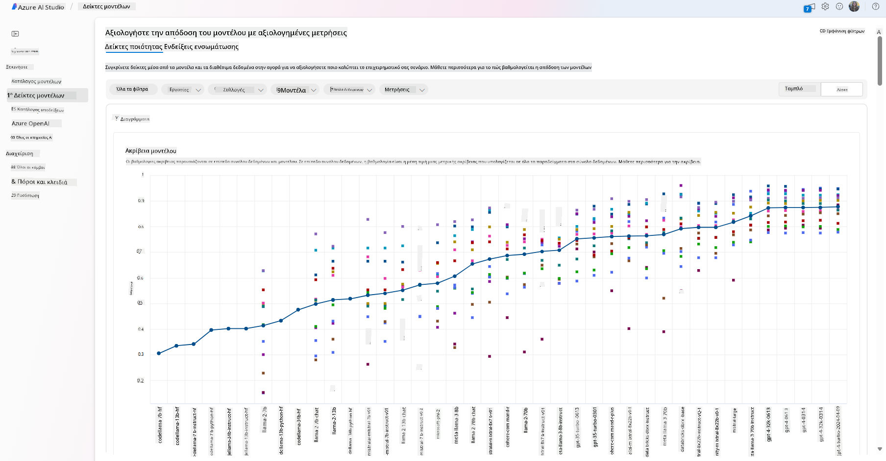
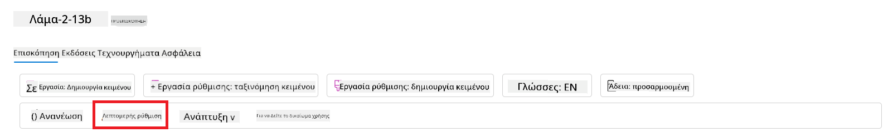
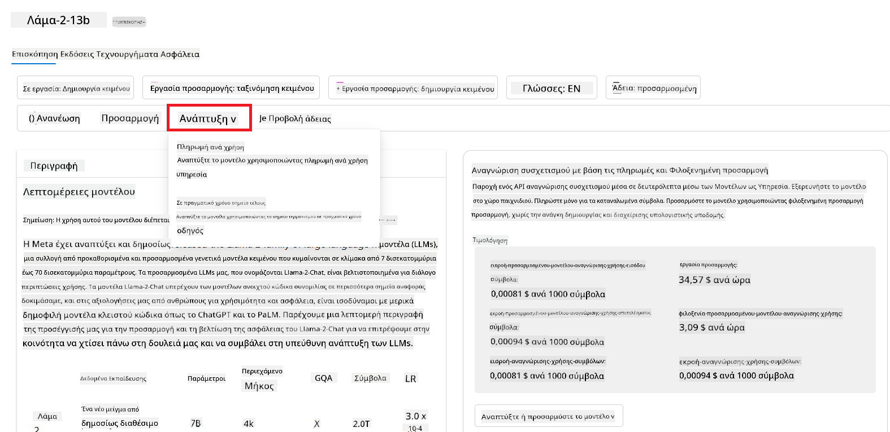
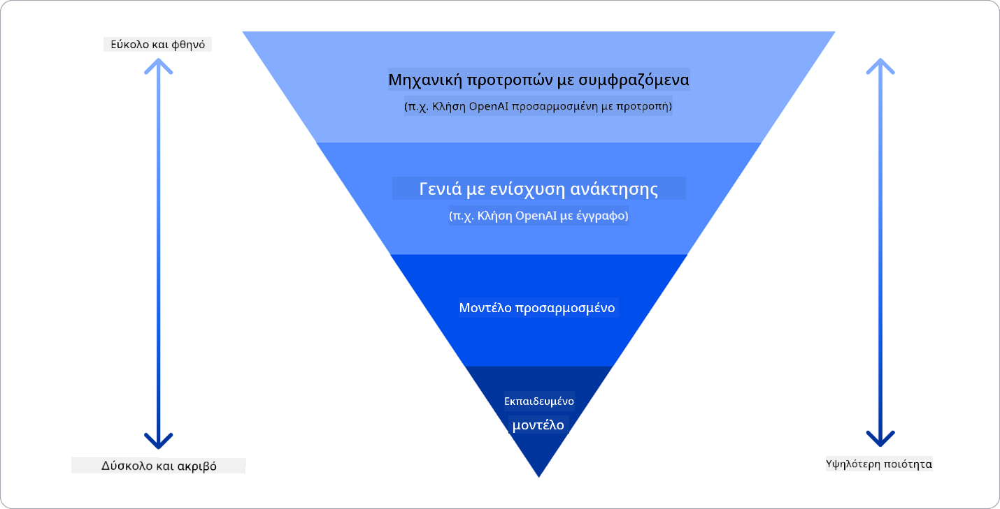

<!--
CO_OP_TRANSLATOR_METADATA:
{
  "original_hash": "e2f686f2eb794941761252ac5e8e090b",
  "translation_date": "2025-06-25T10:41:28+00:00",
  "source_file": "02-exploring-and-comparing-different-llms/README.md",
  "language_code": "el"
}
-->
# Εξερεύνηση και σύγκριση διαφορετικών LLMs

> _Κάντε κλικ στην παραπάνω εικόνα για να δείτε το βίντεο αυτού του μαθήματος_

Στο προηγούμενο μάθημα, είδαμε πώς η Γενετική Τεχνητή Νοημοσύνη αλλάζει το τεχνολογικό τοπίο, πώς λειτουργούν τα Μεγάλα Γλωσσικά Μοντέλα (LLMs) και πώς μια επιχείρηση - όπως η startup μας - μπορεί να τα εφαρμόσει στις περιπτώσεις χρήσης της και να αναπτυχθεί! Σε αυτό το κεφάλαιο, θα συγκρίνουμε και θα αντιπαραβάλλουμε διαφορετικούς τύπους μεγάλων γλωσσικών μοντέλων (LLMs) για να κατανοήσουμε τα πλεονεκτήματα και τα μειονεκτήματά τους.

Το επόμενο βήμα στο ταξίδι της startup μας είναι η εξερεύνηση του τρέχοντος τοπίου των LLMs και η κατανόηση ποια είναι κατάλληλα για την περίπτωση χρήσης μας.

## Εισαγωγή

Αυτό το μάθημα θα καλύψει:

- Διαφορετικούς τύπους LLMs στο τρέχον τοπίο.
- Δοκιμή, επανάληψη και σύγκριση διαφορετικών μοντέλων για την περίπτωση χρήσης σας στο Azure.
- Πώς να αναπτύξετε ένα LLM.

## Στόχοι Μάθησης

Μετά την ολοκλήρωση αυτού του μαθήματος, θα μπορείτε να:

- Επιλέξετε το κατάλληλο μοντέλο για την περίπτωση χρήσης σας.
- Κατανοήσετε πώς να δοκιμάσετε, να επαναλάβετε και να βελτιώσετε την απόδοση του μοντέλου σας.
- Γνωρίζετε πώς οι επιχειρήσεις αναπτύσσουν μοντέλα.

## Κατανόηση διαφορετικών τύπων LLMs

Τα LLMs μπορούν να κατηγοριοποιηθούν με βάση την αρχιτεκτονική τους, τα δεδομένα εκπαίδευσης και την περίπτωση χρήσης. Η κατανόηση αυτών των διαφορών θα βοηθήσει τη startup μας να επιλέξει το κατάλληλο μοντέλο για το σενάριο και να κατανοήσει πώς να δοκιμάσει, να επαναλάβει και να βελτιώσει την απόδοση.

Υπάρχουν πολλοί διαφορετικοί τύποι μοντέλων LLM, η επιλογή σας εξαρτάται από το τι σκοπεύετε να τα χρησιμοποιήσετε, τα δεδομένα σας, πόσο είστε έτοιμοι να πληρώσετε και άλλα.

Ανάλογα με το αν σκοπεύετε να χρησιμοποιήσετε τα μοντέλα για κείμενο, ήχο, βίντεο, δημιουργία εικόνων κ.ο.κ., μπορεί να επιλέξετε έναν διαφορετικό τύπο μοντέλου.

- **Αναγνώριση ήχου και ομιλίας**. Για αυτόν τον σκοπό, τα μοντέλα τύπου Whisper είναι μια εξαιρετική επιλογή καθώς είναι γενικής χρήσης και προορίζονται για αναγνώριση ομιλίας. Είναι εκπαιδευμένα σε ποικιλία ήχου και μπορούν να εκτελέσουν πολυγλωσσική αναγνώριση ομιλίας.

- **Δημιουργία εικόνων**. Για τη δημιουργία εικόνων, τα DALL-E και Midjourney είναι δύο πολύ γνωστές επιλογές. Το DALL-E προσφέρεται από το Azure OpenAI.

- **Δημιουργία κειμένου**. Τα περισσότερα μοντέλα είναι εκπαιδευμένα για δημιουργία κειμένου και έχετε μια μεγάλη ποικιλία επιλογών από το GPT-3.5 έως το GPT-4. Έρχονται με διαφορετικά κόστη, με το GPT-4 να είναι το πιο ακριβό.

- **Πολυτροπικότητα**. Αν θέλετε να χειριστείτε πολλούς τύπους δεδομένων στην είσοδο και έξοδο, μπορεί να θέλετε να δείτε μοντέλα όπως το gpt-4 turbo με όραση ή gpt-4o - οι τελευταίες εκδόσεις των μοντέλων OpenAI.

Η επιλογή ενός μοντέλου σημαίνει ότι αποκτάτε κάποιες βασικές δυνατότητες, που μπορεί να μην είναι αρκετές. Συχνά έχετε εταιρικά δεδομένα που πρέπει να τα μεταφέρετε στο LLM. Υπάρχουν διάφορες επιλογές για το πώς να το προσεγγίσετε, περισσότερα γι' αυτό στις επόμενες ενότητες.

### Μοντέλα Βάσης έναντι LLMs

Ο όρος Μοντέλο Βάσης δημιουργήθηκε από ερευνητές του Στάνφορντ και ορίζεται ως ένα μοντέλο τεχνητής νοημοσύνης που ακολουθεί κάποια κριτήρια, όπως:

- **Εκπαιδεύονται χρησιμοποιώντας μη εποπτευόμενη μάθηση ή αυτοεποπτευόμενη μάθηση**, που σημαίνει ότι εκπαιδεύονται σε μη επισημασμένα πολυτροπικά δεδομένα και δεν απαιτούν ανθρώπινη επισήμανση ή ετικετοποίηση δεδομένων για τη διαδικασία εκπαίδευσής τους.
- **Είναι πολύ μεγάλα μοντέλα**, βασισμένα σε πολύ βαθιά νευρωνικά δίκτυα εκπαιδευμένα σε δισεκατομμύρια παραμέτρους.
- **Συνήθως προορίζονται να χρησιμεύσουν ως 'βάση' για άλλα μοντέλα**, που σημαίνει ότι μπορούν να χρησιμοποιηθούν ως σημείο εκκίνησης για να χτιστούν άλλα μοντέλα πάνω τους, το οποίο μπορεί να γίνει με την προσαρμογή τους.

Για να διευκρινίσουμε περαιτέρω αυτή τη διάκριση, ας πάρουμε το ChatGPT ως παράδειγμα. Για να δημιουργηθεί η πρώτη έκδοση του ChatGPT, ένα μοντέλο που ονομάζεται GPT-3.5 χρησίμευσε ως μοντέλο βάσης.

### Ανοιχτού Κώδικα έναντι Ιδιοκτησιακών Μοντέλων

Ένας άλλος τρόπος να κατηγοριοποιήσουμε τα LLMs είναι αν είναι ανοιχτού κώδικα ή ιδιοκτησιακά.

Τα μοντέλα ανοιχτού κώδικα είναι μοντέλα που είναι διαθέσιμα στο κοινό και μπορούν να χρησιμοποιηθούν από οποιονδήποτε. Συχνά είναι διαθέσιμα από την εταιρεία που τα δημιούργησε ή από την ερευνητική κοινότητα. Αυτά τα μοντέλα επιτρέπεται να επιθεωρηθούν, να τροποποιηθούν και να προσαρμοστούν για διάφορες περιπτώσεις χρήσης στα LLMs.

Τα ιδιοκτησιακά μοντέλα είναι μοντέλα που ανήκουν σε μια εταιρεία και δεν είναι διαθέσιμα στο κοινό. Αυτά τα μοντέλα συχνά είναι βελτιστοποιημένα για παραγωγική χρήση.

### Ενσωμάτωση έναντι Δημιουργίας Εικόνας έναντι Δημιουργίας Κειμένου και Κώδικα

Τα LLMs μπορούν επίσης να κατηγοριοποιηθούν με βάση την έξοδο που παράγουν.

Οι ενσωματώσεις είναι ένα σύνολο μοντέλων που μπορούν να μετατρέψουν το κείμενο σε αριθμητική μορφή, που ονομάζεται ενσωμάτωση, η οποία είναι μια αριθμητική αναπαράσταση του εισαγόμενου κειμένου. Οι ενσωματώσεις διευκολύνουν τις μηχανές να κατανοήσουν τις σχέσεις μεταξύ λέξεων ή προτάσεων.

Τα μοντέλα δημιουργίας εικόνας είναι μοντέλα που παράγουν εικόνες. Αυτά τα μοντέλα συχνά χρησιμοποιούνται για επεξεργασία εικόνων, σύνθεση εικόνων και μετάφραση εικόνων.

Τα μοντέλα δημιουργίας κειμένου και κώδικα είναι μοντέλα που παράγουν κείμενο ή κώδικα. Αυτά τα μοντέλα συχνά χρησιμοποιούνται για περίληψη κειμένου, μετάφραση και απάντηση σε ερωτήσεις.

### Κωδικοποιητής-Αποκωδικοποιητής έναντι Μόνο Αποκωδικοποιητής

Για να μιλήσουμε για τους διαφορετικούς τύπους αρχιτεκτονικών των LLMs, ας χρησιμοποιήσουμε μια αναλογία.

Φανταστείτε ότι ο διευθυντής σας σας ανέθεσε μια εργασία για να γράψετε ένα κουίζ για τους μαθητές. Έχετε δύο συναδέλφους· ο ένας είναι υπεύθυνος για τη δημιουργία του περιεχομένου και ο άλλος για την αναθεώρησή τους.

Ο δημιουργός περιεχομένου είναι σαν ένα μοντέλο Μόνο Αποκωδικοποιητή, μπορεί να δει το θέμα και τι έχετε ήδη γράψει και στη συνέχεια μπορεί να γράψει ένα μάθημα με βάση αυτό. Είναι πολύ καλός στη συγγραφή συναρπαστικού και ενημερωτικού περιεχομένου, αλλά δεν είναι πολύ καλός στην κατανόηση του θέματος και των μαθησιακών στόχων.

Ο αναθεωρητής είναι σαν ένα μοντέλο Μόνο Κωδικοποιητή, κοιτάζει το μάθημα που γράφτηκε και τις απαντήσεις, παρατηρώντας τη σχέση μεταξύ τους και κατανοώντας το πλαίσιο, αλλά δεν είναι καλός στη δημιουργία περιεχομένου.

Φανταστείτε ότι μπορούμε να έχουμε κάποιον που θα μπορούσε να δημιουργήσει και να αναθεωρήσει το κουίζ, αυτό είναι ένα μοντέλο Κωδικοποιητή-Αποκωδικοποιητή.

### Υπηρεσία έναντι Μοντέλο

Τώρα, ας μιλήσουμε για τη διαφορά μεταξύ μιας υπηρεσίας και ενός μοντέλου. Μια υπηρεσία είναι ένα προϊόν που προσφέρεται από έναν Πάροχο Υπηρεσιών Cloud και συχνά αποτελείται από συνδυασμό μοντέλων, δεδομένων και άλλων συστατικών. Ένα μοντέλο είναι το βασικό συστατικό μιας υπηρεσίας και συχνά είναι ένα μοντέλο βάσης, όπως ένα LLM.

Οι υπηρεσίες συχνά είναι βελτιστοποιημένες για παραγωγική χρήση και συχνά είναι πιο εύκολες στη χρήση από τα μοντέλα, μέσω μιας γραφικής διεπαφής χρήστη. Ωστόσο, οι υπηρεσίες δεν είναι πάντα διαθέσιμες δωρεάν και μπορεί να απαιτούν συνδρομή ή πληρωμή για χρήση.

Τα μοντέλα είναι απλά το Νευρωνικό Δίκτυο, με τις παραμέτρους, τα βάρη και άλλα. Επιτρέπουν στις εταιρείες να τα τρέχουν τοπικά, ωστόσο, θα χρειαστεί να αγοράσουν εξοπλισμό, να χτίσουν μια δομή για κλιμάκωση και να αγοράσουν μια άδεια ή να χρησιμοποιήσουν ένα μοντέλο ανοιχτού κώδικα.

## Πώς να δοκιμάσετε και να επαναλάβετε με διαφορετικά μοντέλα για να κατανοήσετε την απόδοση στο Azure

Αφού η ομάδα μας έχει εξερευνήσει το τρέχον τοπίο των LLMs και έχει εντοπίσει κάποιους καλούς υποψήφιους για τα σενάριά τους, το επόμενο βήμα είναι να τα δοκιμάσει στα δεδομένα και στο φόρτο εργασίας τους. Αυτή είναι μια επαναληπτική διαδικασία, που γίνεται μέσω πειραμάτων και μετρήσεων.

Τα περισσότερα από τα μοντέλα που αναφέραμε σε προηγούμενες παραγράφους (μοντέλα OpenAI, μοντέλα ανοιχτού κώδικα όπως το Llama2 και μετασχηματιστές Hugging Face) είναι διαθέσιμα στον [Κατάλογο Μοντέλων](https://learn.microsoft.com/azure/ai-studio/how-to/model-catalog-overview?WT.mc_id=academic-105485-koreyst) στο [Azure AI Studio](https://ai.azure.com/?WT.mc_id=academic-105485-koreyst).

Το [Azure AI Studio](https://learn.microsoft.com/azure/ai-studio/what-is-ai-studio?WT.mc_id=academic-105485-koreyst) είναι μια Πλατφόρμα Cloud σχεδιασμένη για προγραμματιστές να χτίζουν εφαρμογές γενετικής τεχνητής νοημοσύνης και να διαχειρίζονται ολόκληρο τον κύκλο ανάπτυξης - από την πειραματική φάση έως την αξιολόγηση - συνδυάζοντας όλες τις υπηρεσίες Azure AI σε έναν ενιαίο κόμβο με εύχρηστη γραφική διεπαφή χρήστη. Ο Κατάλογος Μοντέλων στο Azure AI Studio επιτρέπει στον χρήστη να:

- Βρει το Μοντέλο Βάσης που τον ενδιαφέρει στον κατάλογο - είτε ιδιοκτησιακό είτε ανοιχτού κώδικα, φιλτράροντας ανά εργασία, άδεια ή όνομα.

- Αναθεωρήσει την κάρτα του μοντέλου, που περιλαμβάνει λεπτομερή περιγραφή της προοριζόμενης χρήσης και των δεδομένων εκπαίδευσης, παραδείγματα κώδικα και αποτελέσματα αξιολόγησης στη βιβλιοθήκη εσωτερικών αξιολογήσεων.
- Συγκρίνετε τα benchmarks μεταξύ μοντέλων και συνόλων δεδομένων που είναι διαθέσιμα στη βιομηχανία για να αξιολογήσετε ποιο από αυτά πληροί το επιχειρηματικό σενάριο, μέσω του πίνακα [Model Benchmarks](https://learn.microsoft.com/azure/ai-studio/how-to/model-benchmarks?WT.mc_id=academic-105485-koreyst).

- Βελτιώστε το μοντέλο με προσαρμοσμένα δεδομένα εκπαίδευσης για να βελτιώσετε την απόδοση του μοντέλου σε συγκεκριμένο φόρτο εργασίας, αξιοποιώντας τις δυνατότητες πειραματισμού και παρακολούθησης του Azure AI Studio.

- Αναπτύξτε το αρχικό προ-εκπαιδευμένο μοντέλο ή την έκδοση με λεπτομερή ρύθμιση σε απομακρυσμένη πραγματική χρονική πρόβλεψη - διαχειριζόμενη υπολογιστική μονάδα - ή serverless api endpoint - [pay-as-you-go](https://learn.microsoft.com/azure/ai-studio/how-to/model-catalog-overview#model-deployment-managed-compute-and-serverless-api-pay-as-you-go?WT.mc_id=academic-105485-koreyst) - για να επιτρέψετε στις εφαρμογές να το καταναλώσουν.

> [!NOTE]
> Δεν είναι όλα τα μοντέλα στον κατάλογο διαθέσιμα αυτή τη στιγμή για λεπτομερή ρύθμιση και/ή ανάπτυξη pay-as-you-go. Ελέγξτε την κάρτα του μοντέλου για λεπτομέρειες σχετικά με τις δυνατότητες και τους περιορισμούς του μοντέλου.

## Βελτίωση των αποτελεσμάτων LLM

Έχουμε εξερευνήσει με την ομάδα μας διαφορετικά είδη LLMs και μια πλατφόρμα Cloud (Azure Machine Learning) που μας επιτρέπει να συγκρίνουμε διαφορετικά μοντέλα, να τα αξιολογούμε σε δεδομένα δοκιμών, να βελτιώνουμε την απόδοση και να τα αναπτύσσουμε σε σημεία πρόβλεψης.

Αλλά πότε θα πρέπει να σκεφτούν να κάνουν λεπτομερή ρύθμιση ενός μοντέλου αντί να χρησιμοποιήσουν ένα προ-εκπαιδευμένο; Υπάρχουν άλλες προσεγγίσεις για να βελτιώσουν την απόδοση του μοντέλου σε συγκεκριμένους φόρτους εργασίας;

Υπάρχουν διάφορες προσεγγίσεις που μια επιχείρηση μπορεί να χρησιμοποιήσει για να επιτύχει τα αποτελέσματα που χρειάζεται από ένα LLM. Μπορείτε να επιλέξετε διαφορετικούς τύπους μοντέλων με διαφορετικούς βαθμούς εκπαίδευσης κατά την ανάπτυξη ενός LLM στην παραγωγή, με διαφορετικά επίπεδα πολυπλοκότητας, κόστους και ποιότητας. Εδώ είναι μερικές διαφορετικές προσεγγίσεις:

- **Προσαρμογή προτροπής με συμφραζόμενα**. Η ιδέα είναι να παρέχετε αρκετά συμφραζόμενα όταν κάνετε την προτροπή για να εξασφαλίσετε ότι θα λάβετε τις απαντήσεις που χρειάζεστε.

- **Ανάκτηση Ενισχυμένης Γενεάς, RAG**. Τα δεδομένα σας μπορεί να υπάρχουν σε μια βάση δεδομένων ή σε ένα διαδικτυακό σημείο για παράδειγμα, για να εξασφαλίσετε ότι αυτά τα δεδομένα, ή ένα υποσύνολό τους, περιλαμβάνονται κατά τη στιγμή της προτροπής, μπορείτε να ανακτήσετε τα σχετικά δεδομένα και να τα κάνετε μέρος της προτροπής του χρήστη.

- **Λεπτομερώς ρυθμισμένο μοντέλο**. Εδώ, εκπαιδεύσατε το μοντέλο περαιτέρω με τα δικά σας δεδομένα, που οδήγησε το μοντέλο να είναι πιο ακριβές και ανταποκρινόμενο στις ανάγκες σας, αλλά μπορεί να είναι κοστοβόρο.

Πηγή εικόνας: [Four Ways that Enterprises Deploy LLMs | Fiddler AI Blog](https://www.fiddler.ai/blog/four-ways-that-enterprises-deploy-llms?WT.mc_id=academic-105485-koreyst)

### Προσαρμογή Προτροπής με Συμφραζόμενα

Τα προ-εκπαιδευμένα LLMs λειτουργούν πολύ καλά σε γενικευμένα φυσικά γλωσσικά καθήκοντα, ακόμα και καλώντας τα με μια σύντομη προτροπή, όπως μια πρόταση για ολοκλήρωση ή μια ερώτηση - το αποκαλούμενο "zero-shot" μάθηση.

Ωστόσο, όσο περισσότερο μπορεί ο χρήστης να διαμορφώσει την ερώτησή του, με μια λεπτομερή αίτηση και παραδείγματα - το Συμφραζόμενο - τόσο πιο ακριβής και κοντά στις προσδοκίες του χρήστη θα είναι η απάντηση. Σε αυτή την περίπτωση, μιλάμε για "one-shot" μάθηση αν η προτροπή περιλαμβάνει μόνο ένα παράδειγμα και "few shot learning" αν περιλαμβάνει πολλαπλά παραδείγματα. Η προσαρμογή προτροπής με συμφραζόμενα είναι η πιο οικονομική προσέγγιση για να ξεκινήσετε.

### Ανάκτηση Ενισχυμένης Γενεάς (RAG)

Τα LLMs έχουν τον περιορισμό ότι μπορούν να χρησιμοποιήσουν μόνο τα δεδομένα που έχουν χρησιμοποιηθεί κατά την εκπαίδευσή τους για να δημιουργήσουν μια απάντηση. Αυτό σημαίνει ότι δεν γνωρίζουν τίποτα για τα γεγονότα που συνέβησαν μετά τη διαδικασία εκπαίδευσής τους, και δεν μπορούν να έχουν πρόσβαση σε μη δημόσιες πληροφορίες (όπως εταιρικά δεδομένα). Αυτό μπορεί να ξεπεραστεί μέσω της RAG, μιας τεχνικής που ενισχύει την προτροπή με εξωτερικά δεδομένα με τη μορφή κομματιών εγγράφων, λαμβάνοντας υπόψη τα όρια μήκους της προτροπής. Αυτό υποστηρίζεται από εργαλεία βάσης δεδομένων Vector (όπως [Azure Vector Search](https://learn.microsoft.com/azure/search/vector-search-overview?WT.mc_id=academic-105485-koreyst)) που ανακτούν τα χρήσιμα κομμάτια από διάφορες προκαθορισμένες πηγές δεδομένων και τα προσθέτουν στο Συμφραζόμενο της προτροπής.

Αυτή η τεχνική είναι πολύ χρήσιμη όταν μια επιχείρηση δεν έχει αρκετά δεδομένα, αρκετό χρόνο, ή πόρους για να κάνει λεπτομερή ρύθμιση ενός LLM, αλλά εξακολουθεί να επιθυμεί να βελτιώσει την απόδοση σε έναν συγκεκριμένο φόρτο εργασίας και να μειώσει τους κινδύνους κατασκευών, δηλαδή, παραποίηση της πραγματικότητας ή επιβλαβές περιεχόμενο.

### Λεπτομερώς ρυθμισμένο μοντέλο

Η λεπτομερής ρύθμιση είναι μια διαδικασία που αξιοποιεί τη μεταφορά μάθησης για να "προσαρμόσει" το μοντέλο σε ένα κατωτέρω καθήκον ή να λύσει ένα συγκεκριμένο πρόβλημα. Διαφορετικά από τη μάθηση με λίγα παραδείγματα και την RAG, αυτό οδηγεί στη δημιουργία ενός νέου μοντέλου, με ενημερωμένα βάρη και προκαταλήψεις. Απαιτεί ένα σύνολο παραδειγμάτων εκπαίδευσης που αποτελείται από μία είσοδο (την προτροπή) και την σχετιζόμενη έξοδο της (την ολοκλήρωση). Αυτή θα ήταν η προτιμώμενη προσέγγιση αν:

- **Χρησιμοποιείτε λεπτομερώς ρυθμισμένα μοντέλα**. Μια επιχείρηση θα ήθελε να χρησιμοποιήσει λεπτομερώς ρυθμισμένα λιγότερο ικανά μοντέλα (όπως μοντέλα ενσωμάτωσης) αντί για μοντέλα υψηλής απόδοσης, με αποτέλεσμα μια πιο οικονομική και γρήγορη λύση.

- **Λαμβάνετε υπόψη την καθυστέρηση**. Η καθυστέρηση είναι σημαντική για μια συγκεκριμένη περίπτωση χρήσης, οπότε δεν είναι δυνατό να χρησιμοποιηθούν πολύ μακριές προτροπές ή ο αριθμός των παραδειγμάτων που πρέπει να μάθει το μοντέλο δεν ταιριάζει με το όριο μήκους της προτροπής.

- **Μένει ενημερωμένο**. Μια επιχείρηση έχει πολλά υψηλής ποιότητας δεδομένα και ετικέτες αλήθειας και τους πόρους που απαιτούνται για να διατηρηθούν αυτά τα δεδομένα ενημερωμένα με την πάροδο του χρόνου.

### Εκπαιδευμένο μοντέλο

Η εκπαίδευση ενός LLM από το μηδέν είναι αναμφίβολα η πιο δύσκολη και η πιο σύνθετη προσέγγιση που πρέπει να υιοθετηθεί, απαιτώντας τεράστιες ποσότητες δεδομένων, εξειδικευμένους πόρους και κατάλληλη υπολογιστική ισχύ. Αυτή η επιλογή θα πρέπει να εξεταστεί μόνο σε ένα σενάριο όπου μια επιχείρηση έχει μια περίπτωση χρήσης ειδική για τομέα και μια μεγάλη ποσότητα δεδομένων κεντρικών στον τομέα.

## Έλεγχος γνώσεων

Ποια θα μπορούσε να είναι μια καλή προσέγγιση για τη βελτίωση των αποτελεσμάτων ολοκλήρωσης LLM;

1. Προσαρμογή προτροπής με συμφραζόμενα
2. RAG
3. Λεπτομερώς ρυθμισμένο μοντέλο

Α:3, αν έχετε το χρόνο και τους πόρους και υψηλής ποιότητας δεδομένα, η λεπτομερής ρύθμιση είναι η καλύτερη επιλογή για να παραμείνετε ενημερωμένοι. Ωστόσο, αν κοιτάτε να βελτιώσετε τα πράγματα και σας λείπει ο χρόνος, αξίζει να εξετάσετε πρώτα την RAG.

## 🚀 Πρόκληση

Διαβάστε περισσότερα για το πώς μπορείτε να [χρησιμοποιήσετε την RAG](https://learn.microsoft.com/azure/search/retrieval-augmented-generation-overview?WT.mc_id=academic-105485-koreyst) για την επιχείρησή σας.

## Εξαιρετική δουλειά, συνεχίστε τη μάθησή σας

Αφού ολοκληρώσετε αυτό το μάθημα, δείτε τη συλλογή μας [Generative AI Learning](https://aka.ms/genai-collection?WT.mc_id=academic-105485-koreyst) για να συνεχίσετε να αναβαθμίζετε τις γνώσεις σας στη Γεννητική AI!

Πηγαίνετε στο Μάθημα 3 όπου θα δούμε πώς να [δημιουργήσετε με Γεννητική AI Υπεύθυνα](../03-using-generative-ai-responsibly/README.md?WT.mc_id=academic-105485-koreyst)!

**Αποποίηση ευθυνών**:  
Αυτό το έγγραφο έχει μεταφραστεί χρησιμοποιώντας την υπηρεσία αυτόματης μετάφρασης AI [Co-op Translator](https://github.com/Azure/co-op-translator). Παρόλο που επιδιώκουμε την ακρίβεια, παρακαλούμε να έχετε υπόψη σας ότι οι αυτοματοποιημένες μεταφράσεις μπορεί να περιέχουν λάθη ή ανακρίβειες. Το αρχικό έγγραφο στη μητρική του γλώσσα θα πρέπει να θεωρείται η αυθεντική πηγή. Για κρίσιμες πληροφορίες, συνιστάται επαγγελματική μετάφραση από άνθρωπο. Δεν φέρουμε ευθύνη για τυχόν παρεξηγήσεις ή παρερμηνείες που προκύπτουν από τη χρήση αυτής της μετάφρασης.